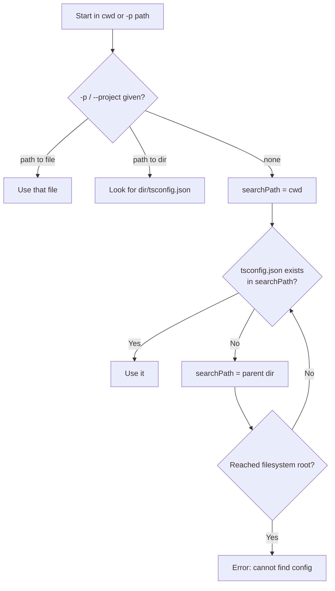
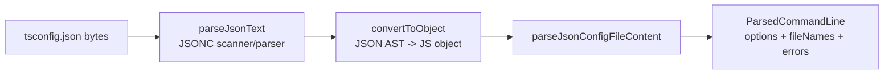
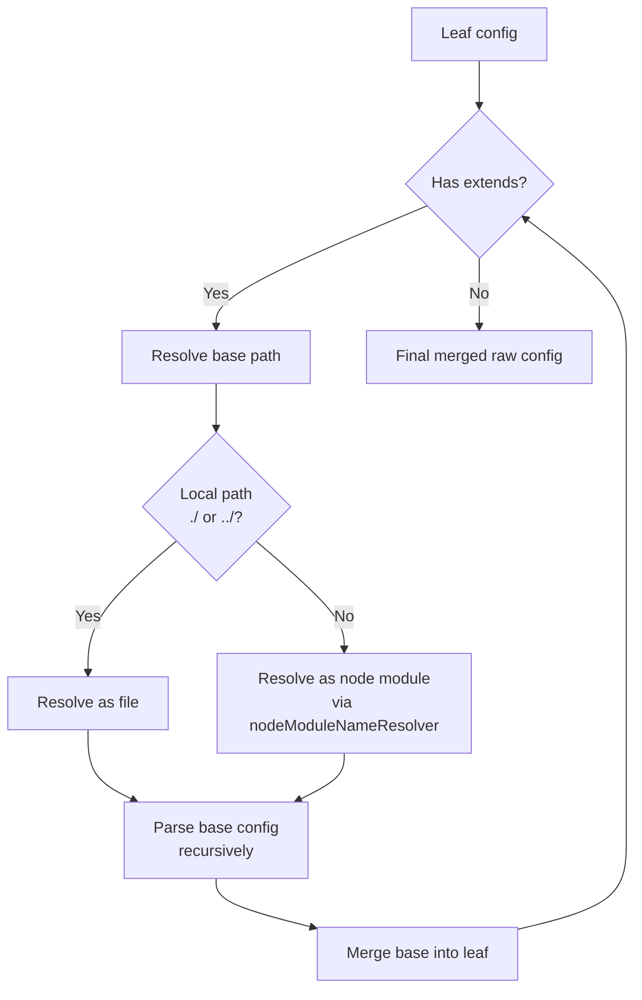
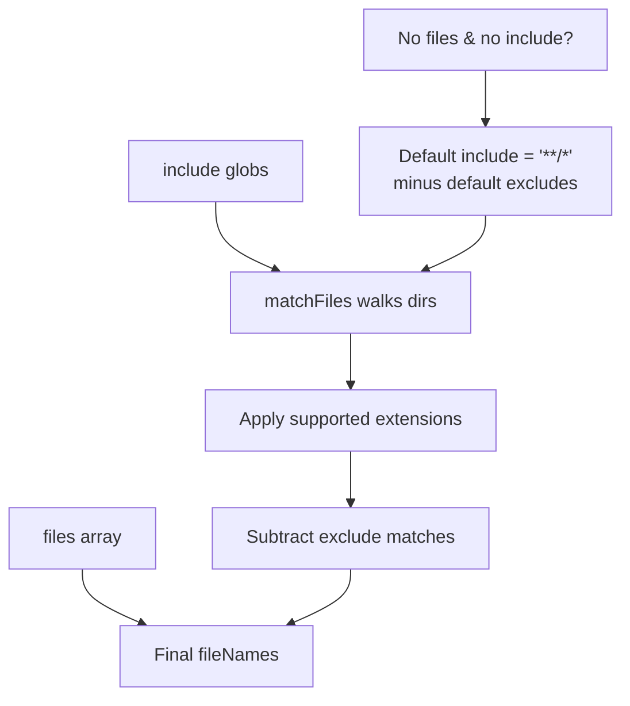
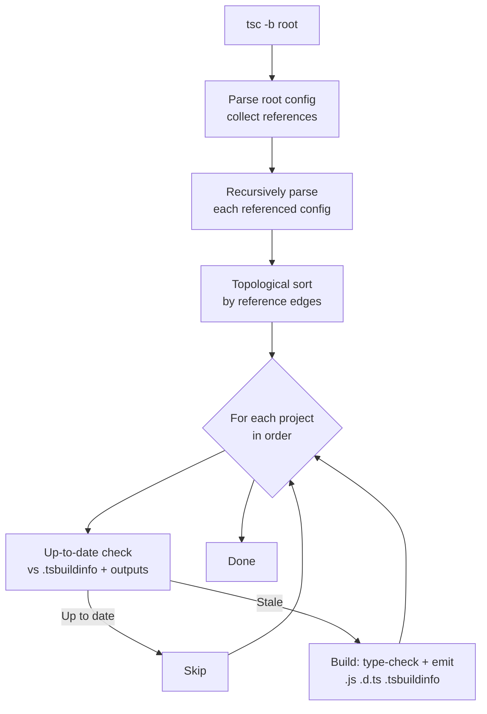
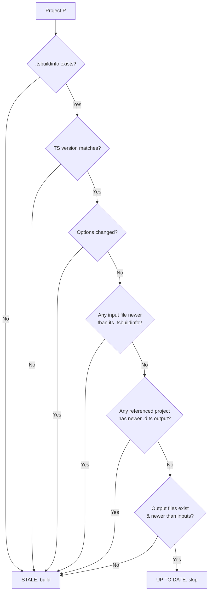
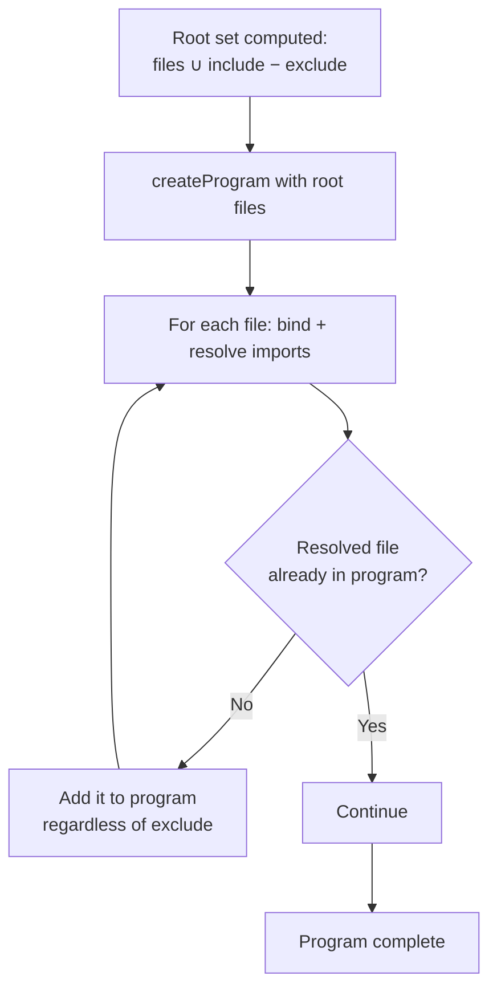

# tsconfig.json — Under the Hood (Professional Level)

## Table of Contents

1. [Overview](#overview)
2. [Config File Resolution Algorithm](#config-file-resolution-algorithm)
3. [Parsing: From Bytes to ParsedCommandLine](#parsing-from-bytes-to-parsedcommandline)
4. [How extends Is Resolved & Merged](#how-extends-is-resolved--merged)
5. [File Discovery: Expanding include/exclude/files](#file-discovery-expanding-includeexcludefiles)
6. [Option Validation & Defaulting](#option-validation--defaulting)
7. [Build Mode Internals (tsc -b)](#build-mode-internals-tsc--b)
8. [Inside .tsbuildinfo](#inside-tsbuildinfo)
9. [Up-To-Date Checking Algorithm](#up-to-date-checking-algorithm)
10. [Program Construction & Module Resolution Hook](#program-construction--module-resolution-hook)
11. [Watch Mode Internals](#watch-mode-internals)
12. [Diagnosing Config Problems](#diagnosing-config-problems)
13. [Practical Implications](#practical-implications)
14. [Test](#test)
15. [Summary](#summary)
16. [Further Reading](#further-reading)

---

## Overview

This section examines how the TypeScript compiler turns a `tsconfig.json` on disk into an in-memory configuration object, discovers the file set, and (in build mode) orchestrates incremental multi-project builds. Understanding these internals lets you diagnose mysterious "file not found", "not listed in project", and "everything rebuilt" issues, and reason about edge cases the handbook glosses over.

The relevant compiler entry points (in the TypeScript source) are:

- `findConfigFile` / `getTsConfigPropArray` — locating the config.
- `readConfigFile` → `parseJsonText` → `convertToObject` — parsing JSONC.
- `parseJsonConfigFileContent` → `ParsedCommandLine` — turning the object into options + file names.
- `createSolutionBuilder` — the `tsc -b` orchestrator.
- `BuildInfo` — the structure serialized into `.tsbuildinfo`.

---

## Config File Resolution Algorithm

When `tsc` runs without explicit input files, locating the config is a precise walk:



Key facts:

1. **Directory walk is upward only.** `tsc` never searches downward into subfolders for a config.
2. **`-p`/`--project` accepts a file or a directory.** A directory is treated as containing `tsconfig.json`.
3. **Explicit input files short-circuit everything.** If file arguments are present, no config file is read; options come only from the CLI. Internally, the presence of root file names skips `findConfigFile`.
4. The path the config is found at becomes `configFile.fileName`, and its directory (`configFilePath` dirname) is the anchor for all relative path resolution.

---

## Parsing: From Bytes to ParsedCommandLine

The pipeline from disk to usable config:



### Step 1 — JSONC parsing

`tsconfig.json` is parsed by TypeScript's own scanner, not `JSON.parse`. This is why **comments and trailing commas are allowed**. The parser produces a JSON AST (`JsonSourceFile`), preserving node positions so error messages can point at the exact offending line/column.

```json
{
  "compilerOptions": {
    "target": "ES2022", // a comment — fine, because this is JSONC
    "strict": true,      // trailing comma below is fine too
  },
}
```

### Step 2 — convertToObject

The JSON AST is converted to a plain JS object. During this conversion, TypeScript validates value *shapes* against the known option schema and records diagnostics for unknown keys or wrong types (e.g., `target: 123` produces a diagnostic).

### Step 3 — parseJsonConfigFileContent

This is where the real work happens. It:
- Resolves and merges `extends` (recursively).
- Normalizes `compilerOptions` (string enums like `"ES2022"` → internal `ScriptTarget` numeric enum).
- Expands `include`/`exclude`/`files` globs into a concrete `fileNames: string[]`.
- Applies default options and computes implied options (e.g., `composite` ⇒ `declaration`).
- Returns a `ParsedCommandLine` containing `options`, `fileNames`, `projectReferences`, `watchOptions`, `typeAcquisition`, and `errors`.

```typescript
// Conceptual shape of the result (simplified)
interface ParsedCommandLine {
  options: CompilerOptions;       // fully merged & defaulted
  fileNames: string[];            // expanded, absolute paths
  projectReferences?: readonly ProjectReference[];
  watchOptions?: WatchOptions;
  typeAcquisition?: TypeAcquisition;
  raw?: any;                      // the merged raw JSON
  errors: Diagnostic[];
}
```

---

## How extends Is Resolved & Merged

`extends` is resolved **before** option normalization, producing a single merged raw object.



### Resolution rules

- A bare specifier (`@tsconfig/node20/tsconfig.json`) is resolved like a Node module from `node_modules`.
- A relative specifier (`./base.json`) is resolved as a file relative to the *extending* config's directory. The `.json` extension may be omitted (TypeScript appends it).
- An **array** of `extends` (TS 5.0+) is processed left-to-right; each subsequent base overrides the previous.

### Merge semantics (the precise rules)

| Field | Merge behavior |
|-------|----------------|
| `compilerOptions` | Deep-ish: merged key-by-key. A key present in the child overrides the base. Keys only in base are kept. **Values are not deep-merged** — an array or object value is replaced wholesale. |
| `include`, `exclude`, `files` | **Not inherited if the child defines them.** If child omits the field entirely, it inherits the base's value. If child defines it, child's value fully replaces base's. |
| `references` | **Never inherited.** Always taken only from the current config. |
| `watchOptions` | Merged key-by-key like `compilerOptions`. |

### Relative path rewriting

When a base config (in a different directory) is merged, certain path-valued options must be **rewritten** so they remain correct relative to the base's location. TypeScript rewrites things like `outDir`, `rootDir`, `baseUrl`, `paths`, and `include` globs from the base so they resolve against the base file's directory — *except* that output-shaping options have nuanced rules across versions. The safe mental model: **paths declared in a config resolve relative to that config's own file**, and the merge machinery normalizes them to absolute paths during parsing.

---

## File Discovery: Expanding include/exclude/files

`parseJsonConfigFileContent` calls `getFileNamesFromConfigSpecs`, which computes the final file set:

```
fileNames = files ∪ (matchFiles(include) − matchFiles(exclude))
```



Details that bite people:

1. **Supported extensions are appended** to extension-less globs: `.ts`, `.tsx`, `.d.ts`, plus `.js`, `.jsx` if `allowJs`, plus `.json` if `resolveJsonModule` and the glob targets json. The exact list comes from `getSupportedExtensions(options)`.
2. **`files` entries bypass globbing and exclusion.** They are added verbatim (resolved to absolute). A missing `files` entry is a hard error (`TS6053: File not found`).
3. **Default excludes** (`node_modules`, `bower_components`, `jspm_packages`, `outDir`) are only auto-applied when you do **not** specify your own `exclude` (outDir is always excluded).
4. **The final `fileNames` is only the *root* set.** Module resolution later pulls in additional files reachable by `import`/`/// <reference>` even if they were excluded. `exclude` cannot remove a file that an included file imports.
5. **Wildcard directories are tracked** so watch mode knows which directories to monitor for added/removed files.

---

## Option Validation & Defaulting

After merge, options are validated and defaulted:

- **String enums → numeric enums.** `target: "ES2022"` becomes `ScriptTarget.ES2022`. Unknown values produce a diagnostic listing valid choices.
- **Implied options computed.** Examples:
  - `composite: true` ⇒ `declaration: true`, and incremental output enabled.
  - `composite: true` ⇒ default `tsBuildInfoFile` derived from `outDir`/config name.
  - `strict: true` ⇒ each sub-flag (`strictNullChecks`, `noImplicitAny`, …) defaults to `true` unless individually overridden.
  - `module: "NodeNext"` ⇒ `moduleResolution: "NodeNext"` default.
- **Incompatible combinations flagged.** e.g., `outDir` overlapping an input, or `composite` without an inferrable `rootDir` in some cases.
- **`lib` defaulting.** If `lib` is omitted, it is derived from `target`.

This is why two configs with the same `target` can behave differently: one may have explicitly set a sub-flag that the other inherits via `strict`.

---

## Build Mode Internals (tsc -b)

`tsc -b` constructs a **SolutionBuilder** rather than a single `Program`.



Steps:

1. **Graph construction.** Starting from the root (or listed) projects, follow `references` recursively, parsing each `tsconfig.json` into a `ParsedCommandLine`. Cycles are detected and reported as errors.
2. **Topological ordering.** Projects are sorted so dependencies build before dependents.
3. **Per-project up-to-date check** (see next section).
4. **Build stale projects.** Each build produces `.js`, `.d.ts`, optional `.d.ts.map`/`.js.map`, and an updated `.tsbuildinfo`.
5. **Downstream invalidation by signature.** If a project's emitted `.d.ts` **signatures** changed, dependents are marked stale; if only implementation changed (same public types), dependents stay up-to-date.

`--verbose` prints, per project, whether it was up-to-date and the reason it was (or wasn't) rebuilt — invaluable for debugging "why did the whole repo rebuild?"

---

## Inside .tsbuildinfo

`.tsbuildinfo` is a JSON file (minified) that serializes the program's state for incremental rebuilds. Conceptually it holds:

```typescript
// Conceptual structure (internal, version-dependent — do not depend on it)
interface BuildInfo {
  program: {
    fileNames: string[];                 // index -> file path
    fileInfos: FileInfo[];               // version (hash), signature, impliedFormat
    referencedMap?: [number, number[]][];// file -> files it imports
    exportedModulesMap?: ...;            // for affected-file computation
    semanticDiagnosticsPerFile?: ...;    // cached diagnostics
    affectedFilesPendingEmit?: ...;
    changeFileSet?: number[];
    options: CompilerOptions;            // the options used (to detect option changes)
  };
  version: string;                       // TS version that wrote it
}
```

Key fields and why they matter:

- **`version` (per file)** — a hash of the file's text. Changed hash ⇒ file is "changed".
- **`signature` (per file)** — a hash of the file's emitted `.d.ts` (its public type surface). Used to decide whether *dependents* are affected.
- **`referencedMap`** — the import graph, so the builder can propagate "affected" status.
- **`options`** — if compiler options changed between runs, the whole program is invalidated (you cannot trust incremental state across an option change).
- **`version` (top-level)** — the TypeScript compiler version. If you upgrade TypeScript, the old `.tsbuildinfo` is discarded and a full rebuild occurs.

Because `.tsbuildinfo` encodes absolute-ish state and the TS version, it is a **build cache, not source**: gitignore it, but cache it in CI keyed on source + tsconfig + TS version.

---

## Up-To-Date Checking Algorithm

For each project, the SolutionBuilder decides "build or skip":



This is why:
- Touching a file (e.g., `touch src/x.ts`) without changing content can still trigger a rebuild of that project (timestamp newer), but not necessarily dependents (signature unchanged).
- Upgrading TypeScript forces a full rebuild (version mismatch).
- Changing any compiler option forces a full rebuild (options hash mismatch).

---

## Program Construction & Module Resolution Hook

After the file set is computed, `createProgram` builds the `Program`. During binding/checking, every `import` triggers **module resolution** governed by `moduleResolution`, `baseUrl`, `paths`, and `types`/`typeRoots`. Resolved files are added to the program even if they were not in the root `fileNames` — which is precisely why `exclude` cannot prevent compilation of imported files.

```typescript
// Conceptual: resolution feeds new files back into the program
// root fileNames -> bind -> resolve imports -> add resolved files -> repeat
```

`paths`/`baseUrl` affect only this *type* resolution step. They do not rewrite emitted `import` specifiers — the emitted JS still contains the original specifier, which is why a runtime/bundler alias must mirror `paths`.

---

## Watch Mode Internals

`tsc --watch` (and editor language servers) builds a watching program:

1. The wildcard directories computed during config parsing are watched for added/removed files (so new files in `src` join the program automatically).
2. Individual root and resolved files are watched for content changes.
3. `watchOptions` selects the strategy (`useFsEvents` vs polling). On Docker bind-mounts or network drives, `useFsEvents` may miss events, so `fallbackPolling` and explicit polling strategies exist.
4. On change, only affected files (via `referencedMap`) are re-checked and re-emitted — the same signature-based invalidation as `.tsbuildinfo`.
5. `excludeDirectories`/`excludeFiles` prune the watch set; on big repos, watching `node_modules` is the usual cause of high CPU, so it is excluded by default.

---

## Diagnosing Config Problems

```bash
# Dump the FULLY RESOLVED config (after extends merge & glob expansion)
tsc --showConfig
tsc --showConfig -p tsconfig.build.json
```

`--showConfig` is the single best debugging tool: it prints the effective `compilerOptions`, the expanded `files` list, and merged `include`/`exclude`. If a file is unexpectedly in or out of the build, `--showConfig` tells you the truth after all inheritance.

```bash
# Trace module resolution to debug "cannot find module"
tsc --traceResolution

# See build decisions in references mode
tsc -b --verbose

# See what WOULD build without building
tsc -b --dry

# Profile type-check time
tsc --generateTrace ./trace && npx @typescript/analyze-trace ./trace
```

---

## Practical Implications

```typescript
// 1) exclude is a discovery filter, not a compilation barrier:
//    imported files are always compiled. Use noEmit-on-type or
//    architectural separation, not exclude, to truly drop files.

// 2) Options changes invalidate incremental caches entirely.
//    Frequent toggling of compilerOptions in CI defeats caching.

// 3) The TS version is baked into .tsbuildinfo — pin TypeScript and
//    bust CI caches on version bumps.

// 4) paths/baseUrl are type-only — always mirror them in the runtime
//    (bundler alias, tsconfig-paths, or package "imports").

// 5) composite implies declaration; a composite project MUST list
//    all its files (include/files) or you get "not listed" errors.
```

---

## Test

### Multiple Choice

**1. Why are comments allowed in tsconfig.json?**

- A) Node strips them
- B) TypeScript parses it with its own JSONC scanner, not JSON.parse
- C) They are silently corrupted
- D) Only in build mode

<details>
<summary>Answer</summary>
**B)** — TypeScript uses its own scanner/parser that accepts comments and trailing commas (JSONC).
</details>

**2. What invalidates the entire incremental cache?**

- A) Editing a function body
- B) Renaming a local variable
- C) Changing compiler options or upgrading the TypeScript version
- D) Adding a comment

<details>
<summary>Answer</summary>
**C)** — Options changes and TS version changes are recorded in `.tsbuildinfo`; a mismatch forces a full rebuild.
</details>

### True or False

**3. `--showConfig` prints the config after `extends` merge and glob expansion.**

<details>
<summary>Answer</summary>
**True** — It is the authoritative view of the effective configuration and file set.
</details>

**4. `references` are inherited through `extends`.**

<details>
<summary>Answer</summary>
**False** — `references` are never inherited; they are always taken only from the current config.
</details>

---

## Summary

- `tsc` locates config by walking up directories; explicit file args bypass config entirely.
- Parsing is JSONC → object → `ParsedCommandLine` (merged options + expanded `fileNames`).
- `extends` merges `compilerOptions`/`watchOptions` key-by-key, replaces arrays, never inherits `references`, and rewrites relative paths.
- File discovery is `files ∪ (include − exclude)`; imports add files regardless of `exclude`.
- `tsc -b` builds a SolutionBuilder: parse graph → topological sort → per-project up-to-date check → build stale.
- `.tsbuildinfo` stores file hashes, `.d.ts` signatures, the import graph, options, and TS version; option or version changes invalidate it.
- `--showConfig`, `--traceResolution`, and `tsc -b --verbose` are the core diagnostic tools.

**Next step:** Specification level — the official, field-by-field tsconfig reference.

---

## Further Reading

- [Project References](https://www.typescriptlang.org/docs/handbook/project-references.html)
- [TypeScript Performance Wiki](https://github.com/microsoft/TypeScript/wiki/Performance)
- [tsconfig reference](https://www.typescriptlang.org/tsconfig)
- [TypeScript compiler internals (src/compiler)](https://github.com/microsoft/TypeScript/tree/main/src/compiler)

---

## Appendix A: Key Internal Functions (Source Map)

For readers diving into the TypeScript repository, these are the functions that implement the behaviors above. They live under `src/compiler/`.

| Function | File (approx.) | Responsibility |
|----------|----------------|----------------|
| `findConfigFile` | `program.ts` | Walk up directories to locate `tsconfig.json` |
| `readConfigFile` | `commandLineParser.ts` | Read + JSONC-parse the file into an object |
| `parseJsonText` | `parser.ts` | Produce the JSON AST with positions |
| `convertToObject` | `commandLineParser.ts` | JSON AST → JS object with shape diagnostics |
| `parseJsonConfigFileContent` | `commandLineParser.ts` | Merge `extends`, normalize options, expand files |
| `getFileNamesFromConfigSpecs` | `commandLineParser.ts` | Compute `files ∪ (include − exclude)` |
| `getSupportedExtensions` | `utilities.ts` | Determine which extensions globs expand to |
| `convertCompilerOptionsFromJson` | `commandLineParser.ts` | String enums → internal enums + validation |
| `createSolutionBuilder` | `tsbuild.ts`/`builder.ts` | The `tsc -b` orchestrator |
| `getBuildInfo` / `emitBuildInfo` | `builder.ts` | Read/write `.tsbuildinfo` |
| `createWatchProgram` | `watch.ts` | Watch-mode program with wildcard dir watching |

> These names and locations evolve between TypeScript versions; treat them as a starting point for source exploration, not a stable API.

---

## Appendix B: Reading a .tsbuildinfo

`.tsbuildinfo` is minified JSON. To inspect it:

```bash
# Pretty-print for inspection (do NOT rely on the shape programmatically)
node -e "console.log(JSON.stringify(require('./dist/tsconfig.tsbuildinfo'), null, 2))" | head -50
```

You'll see (shapes vary by version):

```json
{
  "program": {
    "fileNames": ["./src/index.ts", "./src/util.ts"],
    "fileInfos": [
      { "version": "<hash>", "signature": "<hash>", "impliedFormat": 1 }
    ],
    "options": { "strict": true, "target": 9 },
    "referencedMap": [[1, [2]]],
    "semanticDiagnosticsPerFile": [1, 2]
  },
  "version": "5.4.5"
}
```

Notice `options` and the top-level `version` (TS compiler version). A change to either between runs invalidates incremental state — this is the mechanism, not magic.

---

## Appendix C: Why `exclude` Cannot Win Against Imports (Detailed)



`exclude` is consulted **only** when building the root set (step A). Once the program starts resolving imports (steps C–E), files are added purely based on reachability. There is no second consultation of `exclude`. This is by design: a type-correct program must include everything its entry points depend on. The only ways to truly drop a file are to not import it, or to put it behind a boundary (separate project/package) that isn't referenced.

---

## Appendix D: Config Resolution Quick Diagnostics

```bash
# 1) Which config is actually used, and what's the resolved file set?
tsc --showConfig
tsc --showConfig -p tsconfig.build.json

# 2) Why is module X not found? Trace resolution steps.
tsc --traceResolution | grep "module-name"

# 3) Why is file Y included? Explain inclusion reasons.
tsc --explainFiles | grep "fileY"

# 4) Build mode: per-project up-to-date reasoning.
tsc -b --verbose

# 5) Phase timing & memory.
tsc --extendedDiagnostics
```

`--explainFiles` is especially useful for the "why is this file compiled?" question — it prints, for each file, the reason it entered the program (root, imported by X, referenced by Y, automatic `@types`).
