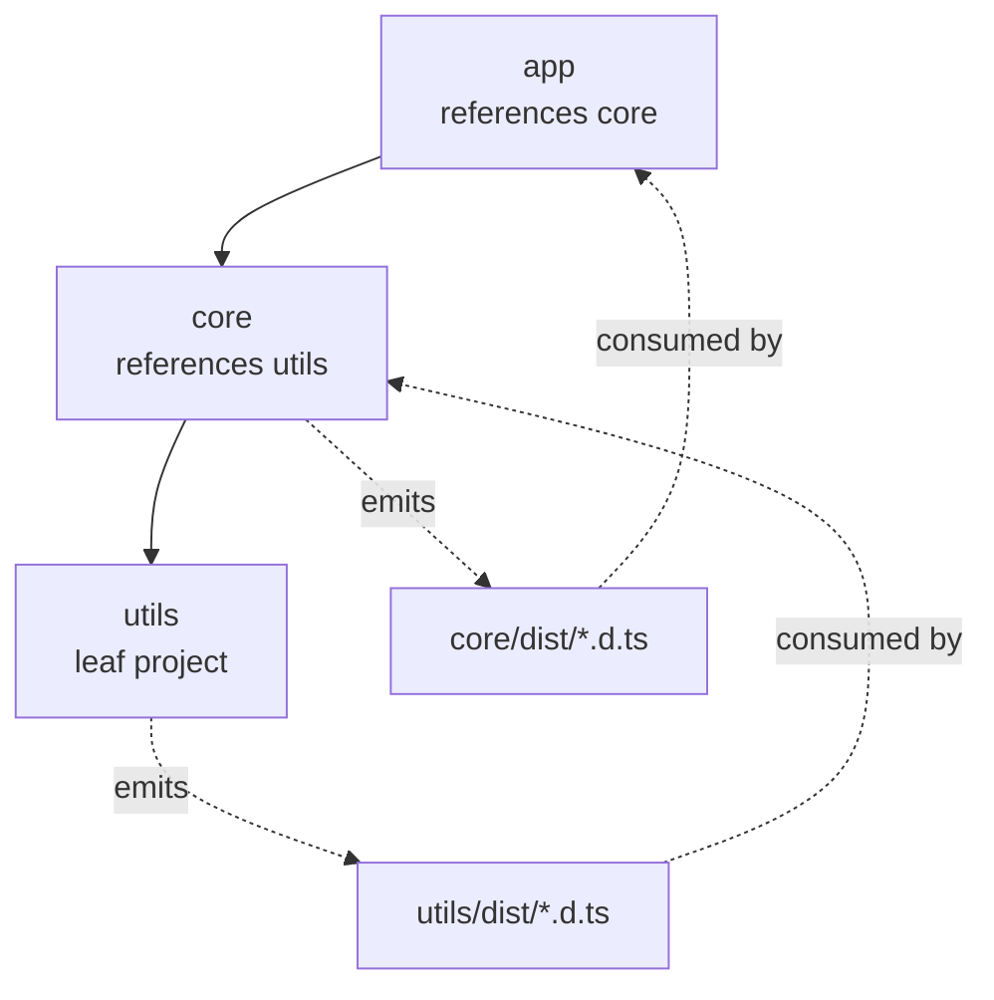
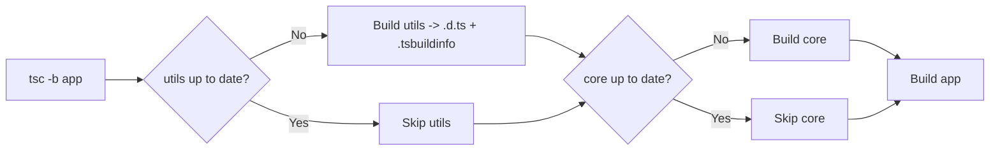
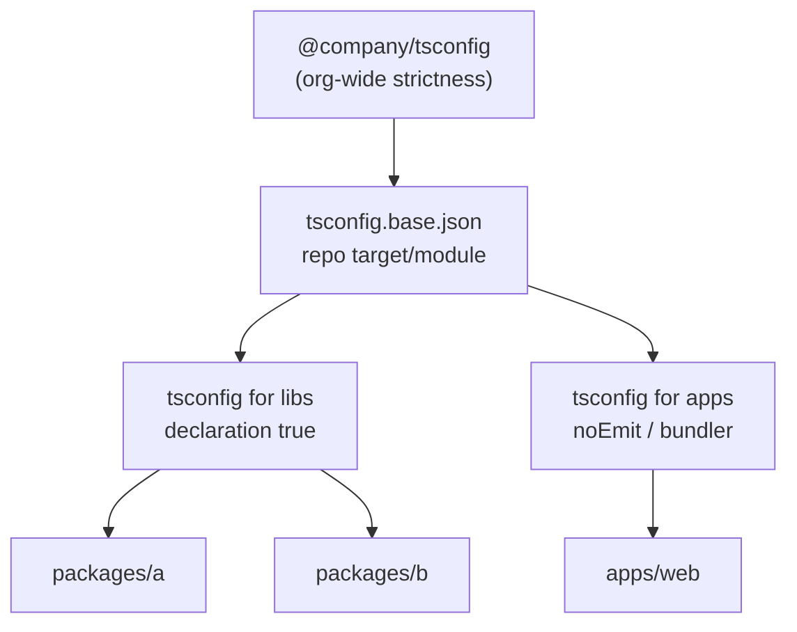
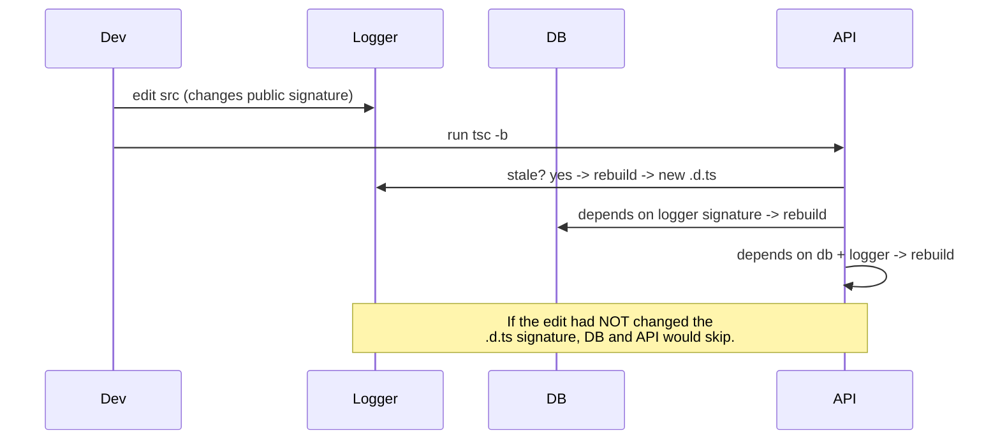

# tsconfig.json — Senior Level

## Table of Contents

1. [Responsibilities at This Level](#responsibilities-at-this-level)
2. [Project References — The Core Idea](#project-references--the-core-idea)
3. [composite, declaration, and the Build Contract](#composite-declaration-and-the-build-contract)
4. [Build Mode: tsc -b](#build-mode-tsc--b)
5. [Incremental Builds & .tsbuildinfo](#incremental-builds--tsbuildinfo)
6. [Monorepo Config Strategy](#monorepo-config-strategy)
7. [Layered extends Architecture](#layered-extends-architecture)
8. [Solution-Style Root tsconfig](#solution-style-root-tsconfig)
9. [Splitting Build, Test, and Editor Configs](#splitting-build-test-and-editor-configs)
10. [Path Mapping at Scale](#path-mapping-at-scale)
11. [CI Strategy](#ci-strategy)
12. [Migration: Flat Repo to Project References](#migration-flat-repo-to-project-references)
13. [Anti-Patterns](#anti-patterns)
14. [Senior Checklist](#senior-checklist)
15. [Test](#test)
16. [Summary](#summary)
17. [Further Reading](#further-reading)

---

## Responsibilities at This Level

- Define the TypeScript build topology for a whole repository or organization.
- Choose between a single config, split configs, and project references.
- Make `tsc -b` builds fast and correct for CI and local dev.
- Own the `.tsbuildinfo` caching strategy and CI cache keys.
- Establish a layered `extends` hierarchy that teams inherit from.
- Diagnose "works locally, fails in CI" config drift.

---

## Project References — The Core Idea

Project references let you split a large codebase into multiple TypeScript "projects," each with its own `tsconfig.json`, and declare dependencies between them. The compiler can then build each project independently, in the right order, and only rebuild what changed.

```json
// packages/utils/tsconfig.json
{
  "compilerOptions": {
    "composite": true,
    "declaration": true,
    "declarationMap": true,
    "outDir": "dist",
    "rootDir": "src"
  },
  "include": ["src"]
}
```

```json
// packages/core/tsconfig.json — depends on utils
{
  "compilerOptions": {
    "composite": true,
    "declaration": true,
    "outDir": "dist",
    "rootDir": "src"
  },
  "references": [{ "path": "../utils" }],
  "include": ["src"]
}
```

```json
// packages/app/tsconfig.json — depends on core
{
  "compilerOptions": {
    "composite": true,
    "outDir": "dist",
    "rootDir": "src"
  },
  "references": [{ "path": "../core" }],
  "include": ["src"]
}
```

The key shift: `app` does **not** re-typecheck `core`'s source. It consumes `core`'s emitted `.d.ts` files. This is why references scale — downstream projects read declarations (cheap) instead of source (expensive).



---

## composite, declaration, and the Build Contract

A project that is *referenced* by another must satisfy a contract:

| Requirement | Why |
|-------------|-----|
| `composite: true` | Marks the project as buildable as a reference; implies `declaration: true` and enables `.tsbuildinfo` |
| `declaration: true` | Referenced projects must emit `.d.ts` so dependents can consume types |
| `rootDir` set | Needed so `tsc -b` can map sources to outputs predictably |
| All files in `include`/`files` | With `composite`, every input file must be matched by `files` or `include` |

```json
{
  "compilerOptions": {
    "composite": true,          // turns on the reference contract
    "declaration": true,        // implied by composite, but state it explicitly
    "declarationMap": true,     // lets editors "go to definition" jump to .ts source
    "incremental": true,        // implied by composite
    "outDir": "dist",
    "rootDir": "src"
  }
}
```

`declarationMap: true` is a senior-level quality-of-life win: without it, "Go to Definition" across package boundaries lands you in generated `.d.ts` files; with it, the editor jumps to the original `.ts` source.

---

## Build Mode: tsc -b

`tsc -b` (alias `tsc --build`) is a different mode from plain `tsc`. It understands project references and orchestrates a multi-project build.

```bash
# Build a project and all its references, in dependency order
tsc -b packages/app

# Build several projects (a "solution")
tsc -b packages/app packages/core packages/utils

# Build everything referenced by the root solution config
tsc -b

# Useful flags
tsc -b --verbose     # show what is up-to-date vs rebuilt and why
tsc -b --dry         # show what WOULD be built, build nothing
tsc -b --clean       # delete all build outputs (.js, .d.ts, .tsbuildinfo)
tsc -b --force       # ignore .tsbuildinfo, rebuild everything
tsc -b --watch       # incremental watch across all projects
```

Plain `tsc` cannot follow `references`. If you run `tsc` (no `-b`) in a project that has references, it type-checks only that project's own files and treats references as already-built `.d.ts` — it will error if those outputs don't exist. **For referenced setups, always use `tsc -b`.**



---

## Incremental Builds & .tsbuildinfo

When `composite` or `incremental` is enabled, `tsc` writes a `.tsbuildinfo` file that records the program's state: file hashes, dependency graph, and emitted signatures. On the next build, `tsc` compares hashes and skips unchanged work.

```json
{
  "compilerOptions": {
    "incremental": true,
    "tsBuildInfoFile": "./.cache/app.tsbuildinfo"
  }
}
```

How it speeds things up:

1. First build (cold): full type-check + emit, write `.tsbuildinfo`.
2. Second build (no changes): read `.tsbuildinfo`, confirm hashes match, do nothing. Milliseconds.
3. After editing one file: rebuild only that file and anything whose **`.d.ts` signature** it changed. If a change doesn't alter the public type signature, dependents are not rebuilt.

This "signature-based" invalidation is the heart of fast incremental builds: editing a function body that doesn't change its type won't cascade.

**CI implication:** Cache `.tsbuildinfo` files (and `dist`) between CI runs keyed on a hash of source + tsconfig. A warm cache turns a 90-second type-check into a few seconds.

```bash
# CI cache key example (conceptual)
# key: ts-build-${{ hashFiles('**/*.ts', '**/tsconfig*.json') }}
# paths: **/.tsbuildinfo, **/dist
```

---

## Monorepo Config Strategy

A robust monorepo layout:

```
repo/
├── tsconfig.base.json          # shared compilerOptions (strict, target)
├── tsconfig.json               # solution root: references all packages
├── packages/
│   ├── utils/
│   │   ├── tsconfig.json        # composite, references: []
│   │   └── src/
│   ├── core/
│   │   ├── tsconfig.json        # composite, references: [utils]
│   │   └── src/
│   └── app/
│       ├── tsconfig.json        # composite, references: [core]
│       └── src/
```

```json
// tsconfig.base.json
{
  "compilerOptions": {
    "target": "ES2022",
    "module": "NodeNext",
    "moduleResolution": "NodeNext",
    "strict": true,
    "declaration": true,
    "declarationMap": true,
    "composite": true,
    "esModuleInterop": true,
    "skipLibCheck": true,
    "forceConsistentCasingInFileNames": true
  }
}
```

```json
// packages/core/tsconfig.json
{
  "extends": "../../tsconfig.base.json",
  "compilerOptions": {
    "outDir": "dist",
    "rootDir": "src"
  },
  "references": [{ "path": "../utils" }],
  "include": ["src"]
}
```

**Cross-package imports** rely on each package's `package.json` having correct `name`, `exports`/`types`, and (ideally) being symlinked via your package manager's workspaces. TypeScript's `references` handle *build ordering and type resolution*; the package manager handles *runtime module resolution*. Both must agree.

---

## Layered extends Architecture

For large organizations, layer configs so policy lives in one place:



```json
// @company/tsconfig/tsconfig.json (published package)
{
  "compilerOptions": {
    "strict": true,
    "noUncheckedIndexedAccess": true,
    "noImplicitOverride": true,
    "exactOptionalPropertyTypes": true,
    "forceConsistentCasingInFileNames": true,
    "skipLibCheck": true
  }
}
```

```json
// tsconfig.base.json — repo-specific
{
  "extends": "@company/tsconfig/tsconfig.json",
  "compilerOptions": {
    "target": "ES2022",
    "module": "NodeNext",
    "composite": true,
    "declaration": true
  }
}
```

Now bumping org-wide strictness is a single package version bump, not a repo-wide find-and-replace.

---

## Solution-Style Root tsconfig

The root `tsconfig.json` in a references monorepo often contains **no files of its own** — it is purely a build orchestrator:

```json
// tsconfig.json (repo root) — a "solution" file
{
  "files": [],
  "references": [
    { "path": "packages/utils" },
    { "path": "packages/core" },
    { "path": "packages/app" }
  ]
}
```

`"files": []` tells TypeScript "this project compiles nothing itself." Running `tsc -b` at the root then builds every referenced project in dependency order. This is the idiomatic entry point for `tsc -b` in a monorepo.

---

## Splitting Build, Test, and Editor Configs

Within a single package you frequently want three perspectives:

```json
// tsconfig.json — the editor/IDE view (everything, type-check only)
{
  "extends": "../../tsconfig.base.json",
  "compilerOptions": { "noEmit": true, "composite": false },
  "include": ["src", "test"]
}
```

```json
// tsconfig.build.json — what actually emits to dist
{
  "extends": "../../tsconfig.base.json",
  "compilerOptions": { "outDir": "dist", "rootDir": "src" },
  "include": ["src"],
  "exclude": ["**/*.test.ts", "**/*.spec.ts"]
}
```

```json
// tsconfig.test.json — test-only types and globals
{
  "extends": "../../tsconfig.base.json",
  "compilerOptions": {
    "noEmit": true,
    "composite": false,
    "types": ["node", "vitest/globals"]
  },
  "include": ["src", "test"]
}
```

Note `composite: false` on the editor/test configs — only the *build* config needs to be composite for references. Mixing composite into a "sees-everything" editor config causes "file not listed in project" friction.

---

## Path Mapping at Scale

`paths` plus `baseUrl` let you write `@app/utils` instead of `../../utils`. But beware: TypeScript's `paths` only affects *type resolution*, not runtime. Your bundler/runtime needs matching aliases.

```json
{
  "compilerOptions": {
    "baseUrl": ".",
    "paths": {
      "@utils/*": ["packages/utils/src/*"],
      "@core/*": ["packages/core/src/*"]
    }
  }
}
```

In a references monorepo, prefer real package names (`@company/utils`) resolved through workspace symlinks over `paths` aliases — references + workspaces give you correct build order *and* runtime resolution, while `paths` aliases can hide the dependency graph from `tsc -b`.

---

## CI Strategy

```bash
# Type-check the whole solution without emitting (fast gate)
tsc -b --dry      # verify nothing is stale unexpectedly

# Actual CI command
tsc -b            # builds all referenced projects, incremental with cache

# Pure type-check gate for a non-references repo
tsc --noEmit
```

Recommendations:
- Run `tsc -b` (or `tsc --noEmit`) as a **separate CI step** from bundling, so type errors are reported independently of build/bundle failures.
- Cache `.tsbuildinfo` and `dist` keyed on source hashes.
- Use `tsc -b --verbose` in CI logs when debugging "why did everything rebuild?"
- Pin the TypeScript version in `devDependencies` — minor versions change inference and can introduce new errors.

---

## Migration: Flat Repo to Project References

```mermaid
flowchart TD
    A[Single big tsconfig.json] --> B[Identify package boundaries]
    B --> C[Create tsconfig.base.json\nwith shared options]
    C --> D[Add composite + declaration\nper package]
    D --> E[Add references between packages]
    E --> F[Create solution root\nfiles: [] + references]
    F --> G[Switch CI to tsc -b]
    G --> H[Add .tsbuildinfo to cache + gitignore]
```

Pitfalls during migration:
- Circular references are forbidden — `tsc -b` errors on cycles. Break them by extracting shared types into a leaf package.
- Every composite project must include **all** its input files; stray files outside `include` cause "not listed in the file list" errors.
- Remember to gitignore `*.tsbuildinfo` and `dist`.

---

## Anti-Patterns

| Anti-pattern | Why it hurts | Better |
|--------------|--------------|--------|
| One giant `tsconfig.json` for a 50-package monorepo | Every change retype-checks everything | Project references |
| `composite: true` on an editor "sees-everything" config | "File not listed" errors, slow IDE | Keep composite only on build configs |
| Relying on `paths` instead of real packages in a monorepo | Hides dependency graph from `tsc -b` | Workspaces + package names |
| Committing `.tsbuildinfo` | Noisy diffs, stale-cache bugs | gitignore it, cache in CI |
| Running plain `tsc` in a references repo | Misses build ordering, false errors | `tsc -b` |
| Loosening `strict` per-package to "fix" errors | Erodes safety repo-wide | Fix types; keep strict in the base |

---

## Senior Checklist

- [ ] Monorepo uses project references with a `files: []` solution root.
- [ ] Every referenced project sets `composite`, `declaration`, `rootDir`.
- [ ] `declarationMap: true` so cross-package "Go to Definition" lands on source.
- [ ] CI runs `tsc -b` and caches `.tsbuildinfo` + `dist`.
- [ ] Strictness lives in a single layered base config (org → repo → package).
- [ ] No circular references; shared types extracted to leaf packages.
- [ ] Build, test, and editor configs are split where their emit/types differ.
- [ ] `.tsbuildinfo` and `dist` are gitignored.

---

## Test

### Multiple Choice

**1. What does `composite: true` imply?**

- A) Nothing extra
- B) `declaration: true` and incremental `.tsbuildinfo` output
- C) `noEmit: true`
- D) `strict: true`

<details>
<summary>Answer</summary>
**B)** — `composite` implies `declaration` and enables incremental build info; the project becomes referenceable.
</details>

**2. Why do downstream projects in a references setup build faster?**

- A) They skip strict mode
- B) They consume upstream `.d.ts` files instead of re-checking upstream source
- C) They run in parallel only
- D) They disable type checking

<details>
<summary>Answer</summary>
**B)** — Dependents type-check against emitted declarations, which is far cheaper than re-processing source.
</details>

### True or False

**3. Plain `tsc` (without `-b`) follows `references` and builds them in order.**

<details>
<summary>Answer</summary>
**False** — Only `tsc -b` understands references. Plain `tsc` checks just the current project and expects referenced outputs to already exist.
</details>

**4. Circular project references are allowed.**

<details>
<summary>Answer</summary>
**False** — `tsc -b` errors on cycles. Extract shared types into a leaf package to break them.
</details>

---

## Summary

- Project references split a repo into independently buildable projects with declared dependencies.
- Referenced projects must be `composite` (which implies `declaration` + incremental).
- `tsc -b` orchestrates dependency-ordered, incremental builds; plain `tsc` does not.
- `.tsbuildinfo` caches program state for signature-based incremental rebuilds.
- A `files: []` solution root is the idiomatic monorepo entry point.
- Layer `extends` (org → repo → package) so strictness lives in one place.

**Next step:** Professional level — how tsc parses and resolves config, the resolution algorithm, build-mode internals, and `.tsbuildinfo` format.

---

## Further Reading

- [Project References](https://www.typescriptlang.org/docs/handbook/project-references.html)
- [tsc CLI & build mode](https://www.typescriptlang.org/docs/handbook/compiler-options-in-msbuild.html)
- [Performance wiki (TypeScript)](https://github.com/microsoft/TypeScript/wiki/Performance)
- [tsconfig/bases](https://github.com/tsconfig/bases)

---

## Appendix: Reference Monorepo Walkthrough

A complete, copy-pasteable layout you can adapt.

### Directory tree

```
acme/
├── package.json                 # workspaces: ["packages/*"]
├── tsconfig.base.json           # shared strictness + target + composite
├── tsconfig.json                # solution root: files [] + references
└── packages/
    ├── logger/
    │   ├── package.json          # name: @acme/logger
    │   ├── tsconfig.json          # composite, no references
    │   └── src/index.ts
    ├── db/
    │   ├── package.json          # name: @acme/db
    │   ├── tsconfig.json          # references: [logger]
    │   └── src/index.ts
    └── api/
        ├── package.json          # name: @acme/api
        ├── tsconfig.json          # references: [logger, db]
        └── src/index.ts
```

### Root files

```json
// tsconfig.base.json
{
  "compilerOptions": {
    "target": "ES2022",
    "module": "NodeNext",
    "moduleResolution": "NodeNext",
    "strict": true,
    "composite": true,
    "declaration": true,
    "declarationMap": true,
    "sourceMap": true,
    "esModuleInterop": true,
    "skipLibCheck": true,
    "forceConsistentCasingInFileNames": true
  }
}
```

```json
// tsconfig.json (solution root)
{
  "files": [],
  "references": [
    { "path": "packages/logger" },
    { "path": "packages/db" },
    { "path": "packages/api" }
  ]
}
```

### Package configs

```json
// packages/logger/tsconfig.json
{
  "extends": "../../tsconfig.base.json",
  "compilerOptions": { "outDir": "dist", "rootDir": "src" },
  "include": ["src"]
}
```

```json
// packages/db/tsconfig.json
{
  "extends": "../../tsconfig.base.json",
  "compilerOptions": { "outDir": "dist", "rootDir": "src" },
  "references": [{ "path": "../logger" }],
  "include": ["src"]
}
```

```json
// packages/api/tsconfig.json
{
  "extends": "../../tsconfig.base.json",
  "compilerOptions": { "outDir": "dist", "rootDir": "src" },
  "references": [{ "path": "../logger" }, { "path": "../db" }],
  "include": ["src"]
}
```

### package.json wiring

Each package declares its name and entry points so that cross-package imports resolve at runtime (and the workspace symlinks them):

```json
// packages/logger/package.json
{
  "name": "@acme/logger",
  "version": "1.0.0",
  "main": "dist/index.js",
  "types": "dist/index.d.ts"
}
```

```typescript
// packages/api/src/index.ts — imports by package name, NOT by path
import { log } from "@acme/logger";
import { query } from "@acme/db";

export function start() {
  log("api starting");
  return query("SELECT 1");
}
```

### Build commands

```bash
# Build everything in dependency order
tsc -b

# Watch the whole solution
tsc -b --watch

# Clean all outputs and caches
tsc -b --clean

# See why each project did/didn't rebuild
tsc -b --verbose
```

### What happens on a change



---

## Appendix: Strictness Ratcheting Strategy

Adopting strictness across many teams without a flag-day:

```json
// configs/level-1.json — minimum bar everyone meets today
{ "compilerOptions": { "noImplicitAny": true, "forceConsistentCasingInFileNames": true } }
```

```json
// configs/level-2.json — next milestone
{ "extends": "./level-1.json", "compilerOptions": { "strictNullChecks": true } }
```

```json
// configs/level-3.json — target end-state
{ "extends": "./level-2.json", "compilerOptions": { "strict": true, "noUncheckedIndexedAccess": true } }
```

Each package extends the highest level it currently passes. Over time, packages migrate upward, and the org tracks progress by counting packages at each level. The base configs encode policy; the migration is incremental and measurable.

---

## Appendix: Common Senior-Level Gotchas

| Gotcha | Symptom | Resolution |
|--------|---------|-----------|
| `composite` on an editor "all files" config | "File not listed" IDE noise | Keep composite only on build configs |
| Editing path imports across packages | TS6059/TS6307 | Import by package name + add `references` |
| Forgetting `declarationMap` | Go-to-def lands in `.d.ts` | Enable `declarationMap` in the base |
| Not caching `.tsbuildinfo` in CI | Every CI run rebuilds cold | Cache it keyed on source + TS version |
| Circular references | `tsc -b` cycle error | Extract shared types to a leaf package |
| `paths` instead of packages | Hidden build order, runtime breakage | Use workspace package names |
