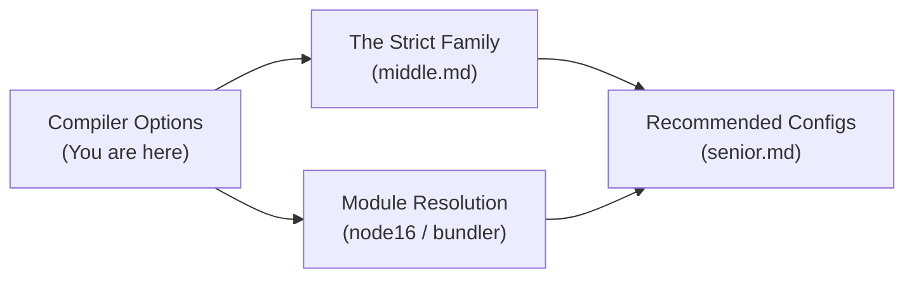

# Compiler Options — Junior Level

## Table of Contents

1. [Introduction](#introduction)
2. [Prerequisites](#prerequisites)
3. [Glossary](#glossary)
4. [Where Compiler Options Live](#where-compiler-options-live)
5. [Core Concepts](#core-concepts)
6. [The Everyday Options You Will Touch First](#the-everyday-options-you-will-touch-first)
7. [`target` — Which JavaScript Version to Emit](#target--which-javascript-version-to-emit)
8. [`module` — How Imports Are Emitted](#module--how-imports-are-emitted)
9. [`outDir` and `rootDir` — Where Files Go](#outdir-and-rootdir--where-files-go)
10. [`strict` — Turn On Real Type Safety](#strict--turn-on-real-type-safety)
11. [`lib` — Which Built-in Types Are Available](#lib--which-built-in-types-are-available)
12. [Other Everyday Flags](#other-everyday-flags)
13. [Code Examples](#code-examples)
14. [A Minimal Starter tsconfig.json](#a-minimal-starter-tsconfigjson)
15. [Pros & Cons](#pros--cons)
16. [Best Practices](#best-practices)
17. [Common Mistakes](#common-mistakes)
18. [Edge Cases & Pitfalls](#edge-cases--pitfalls)
19. [Test](#test)
20. [Tricky Questions](#tricky-questions)
21. [Cheat Sheet](#cheat-sheet)
22. [Summary](#summary)
23. [What You Can Build](#what-you-can-build)
24. [Further Reading](#further-reading)
25. [Related Topics](#related-topics)

---

## Introduction

> Focus: "What is it?" and "How to use it?"

TypeScript is a **superset of JavaScript**. Every valid `.js` file is also valid TypeScript. The type system you add on top exists only at **compile time** — when the TypeScript compiler (`tsc`) turns your `.ts` files into `.js` files, all the types are erased and what runs in Node.js or the browser is plain JavaScript.

The compiler needs instructions: *Which version of JavaScript should I output? Where should the output files go? How strict should I be about type errors?* Those instructions are the **compiler options**. They live inside a file called `tsconfig.json`, in a section named `compilerOptions`.

```json
{
  "compilerOptions": {
    "target": "ES2022",
    "module": "NodeNext",
    "outDir": "./dist",
    "strict": true
  }
}
```

Think of `compilerOptions` as the dashboard of the TypeScript compiler. Each key is a knob that changes how your code is checked or how it is compiled. There are over a hundred options, but as a junior you only need a handful every day. This page teaches those.

---

## Prerequisites

- **Required:** Basic JavaScript (variables, functions, modules with `import`/`export`).
- **Required:** You have run `tsc` at least once or used a project that compiles TypeScript.
- **Helpful but not required:** You have seen a `tsconfig.json` file before, even if you did not understand every line.
- **Helpful but not required:** You know the difference between Node.js and the browser as runtime environments.

---

## Glossary

| Term | Definition |
|------|-----------|
| **`tsconfig.json`** | The configuration file at the root of a TypeScript project. It tells `tsc` what to compile and how |
| **`compilerOptions`** | The object inside `tsconfig.json` that holds all the compiler flags |
| **`tsc`** | The TypeScript compiler command-line tool that reads `tsconfig.json` and produces JavaScript |
| **Emit** | The act of producing output files (`.js`, `.d.ts`, `.js.map`) from your `.ts` source |
| **Target** | The version of the JavaScript language the compiler will output (e.g. `ES2015`, `ES2022`) |
| **Module** | The module system used in the emitted JavaScript (`CommonJS`, `ESNext`, `NodeNext`) |
| **`strict` mode** | A bundle of strict type-checking flags enabled by a single switch |
| **`lib`** | The set of built-in type declarations available to your code (e.g. `DOM`, `ES2022`) |
| **Type error** | A problem the compiler reports about types — it does not exist at runtime |
| **`any`** | A type that disables type checking for a value — to be avoided |

---

## Where Compiler Options Live

When you run `tsc`, the compiler looks for a `tsconfig.json` starting from the current directory and walking upward. Inside that file, `compilerOptions` is one of several top-level keys:

```json
{
  "compilerOptions": {
    // every compiler flag goes here
  },
  "include": ["src/**/*"],
  "exclude": ["node_modules", "dist"]
}
```

- `compilerOptions` — the flags (the subject of this whole topic).
- `include` / `exclude` / `files` — which files to compile.
- `extends` — inherit settings from another config (e.g. a shared base).
- `references` — link to other TypeScript projects (advanced).

You can also pass options on the command line, which override the file:

```bash
tsc --target ES2022 --outDir dist --strict
```

But for any real project, you put options in `tsconfig.json` so the whole team and your editor share the same settings.

---

## Core Concepts

### Concept 1: Two Jobs, One Compiler

`tsc` does two jobs at once:

1. **Type checking** — verifying your types are consistent and reporting errors.
2. **Emitting** — stripping types and writing JavaScript files.

Some compiler options affect **only checking** (`strict`, `noUnusedLocals`). Some affect **only emit** (`outDir`, `removeComments`). A few affect both. As a junior, knowing which category an option belongs to clears up a lot of confusion.

### Concept 2: Types Disappear at Runtime

No compiler option changes the fact that types are erased. `strict: true` makes the compiler complain more loudly, but it does not add runtime checks. If you want runtime validation, you write code for it (or use a library like Zod). Compiler options shape the *compile-time* experience.

### Concept 3: Defaults Are Often Not What You Want

If you omit an option, TypeScript uses a default. Many defaults are loose for backward compatibility. For example, `strict` defaults to `false`. A good starter config explicitly turns on the safety features rather than relying on defaults.

### Concept 4: Your Editor Reads the Same Config

VS Code and other editors run the same TypeScript language service that `tsc` uses. The red squiggles you see in your editor come from your `tsconfig.json`. Change `strict` to `true`, and your editor immediately starts flagging more issues — no rebuild needed.

---

## The Everyday Options You Will Touch First

For your first months with TypeScript, these are the options that matter:

| Option | What it controls | Typical value |
|--------|------------------|---------------|
| `target` | Which JS version to output | `"ES2022"` |
| `module` | Module system in output | `"NodeNext"` or `"ESNext"` |
| `outDir` | Where compiled JS goes | `"./dist"` |
| `rootDir` | Root of your source files | `"./src"` |
| `strict` | Turn on all strict checks | `true` |
| `lib` | Built-in type libraries | `["ES2022", "DOM"]` |
| `esModuleInterop` | Smooth CommonJS/ESM imports | `true` |
| `skipLibCheck` | Skip checking `.d.ts` files (faster) | `true` |
| `sourceMap` | Generate debug maps | `true` |
| `noEmit` | Type-check only, emit nothing | `true` (for lint-style checks) |

The rest of this page explains the most important of these.

---

## `target` — Which JavaScript Version to Emit

`target` tells the compiler which version of JavaScript to produce. If you write modern syntax but `target` is old, the compiler **downlevels** it — rewrites it into equivalent older code.

```json
{
  "compilerOptions": {
    "target": "ES2022"
  }
}
```

Common values, oldest to newest: `ES5`, `ES2015` (a.k.a. `ES6`), `ES2016`, `ES2017`, `ES2018`, `ES2019`, `ES2020`, `ES2021`, `ES2022`, `ES2023`, `ESNext`.

### What downleveling looks like

Source TypeScript:

```typescript
const greet = (name: string): string => `Hello, ${name}!`;
```

With `target: "ES2015"` the output keeps the arrow function and template string (both are ES2015 features):

```javascript
const greet = (name) => `Hello, ${name}!`;
```

With `target: "ES5"` (which predates arrow functions and template strings) the compiler rewrites it:

```javascript
var greet = function (name) { return "Hello, " + name + "!"; };
```

### How to choose a target

- Modern Node.js (18+) or evergreen browsers: `ES2022` is a safe, modern choice.
- You must support old browsers (IE11): you would need `ES5`, but in practice a bundler with Babel handles this today.
- Not sure: `ES2020` works almost everywhere modern.

The newer the target, the smaller and faster the output, because the compiler does not have to emit polyfill-style rewrites.

---

## `module` — How Imports Are Emitted

`module` controls what your `import` and `export` statements turn into.

```json
{
  "compilerOptions": {
    "module": "NodeNext"
  }
}
```

Common values:

| Value | Output style | When |
|-------|--------------|------|
| `CommonJS` | `require()` / `module.exports` | Classic Node.js |
| `ESNext` | native `import` / `export` | Bundlers (Vite, esbuild), browsers |
| `NodeNext` | picks CJS or ESM per file based on `package.json` | Modern Node.js projects |
| `Node16` | same idea as NodeNext, pinned to Node 16 behavior | Node 16+ |

Source:

```typescript
import { readFile } from "node:fs/promises";
export const config = { retries: 3 };
```

With `module: "CommonJS"`:

```javascript
const promises_1 = require("node:fs/promises");
exports.config = { retries: 3 };
```

With `module: "ESNext"` the `import`/`export` stay native:

```javascript
import { readFile } from "node:fs/promises";
export const config = { retries: 3 };
```

As a junior rule of thumb: use `NodeNext` for Node apps, `ESNext` for front-end apps built with a bundler.

---

## `outDir` and `rootDir` — Where Files Go

By default, `tsc` writes each `.js` file next to its `.ts` source. That clutters your source folder. `outDir` redirects all output into one folder.

```json
{
  "compilerOptions": {
    "rootDir": "./src",
    "outDir": "./dist"
  }
}
```

With this config, `src/index.ts` compiles to `dist/index.js`, and `src/utils/math.ts` compiles to `dist/utils/math.js`. The folder structure under `src` is mirrored under `dist`.

- `rootDir` sets the base folder that the output structure is calculated from.
- `outDir` sets where the output is written.

If you set `outDir` but not `rootDir`, TypeScript infers `rootDir` from the common ancestor of all input files — which sometimes surprises you by including a `tests` folder. Setting both explicitly avoids confusion.

---

## `strict` — Turn On Real Type Safety

`strict` is the single most important option. It enables a whole family of checks that catch real bugs.

```json
{
  "compilerOptions": {
    "strict": true
  }
}
```

Without `strict`, TypeScript is lenient and lets dangerous code through. The most impactful sub-check is `strictNullChecks`, which makes `null` and `undefined` distinct types you must handle.

### Without strict

```typescript
function getLength(text: string) {
  return text.length;
}

getLength(null); // No error without strict — crashes at runtime!
```

### With strict

```typescript
function getLength(text: string) {
  return text.length;
}

getLength(null); // Error: Argument of type 'null' is not assignable to parameter of type 'string'.
```

`strict` is actually a bundle. Turning it on enables `noImplicitAny`, `strictNullChecks`, `strictFunctionTypes`, `strictBindCallApply`, `strictPropertyInitialization`, `noImplicitThis`, `useUnknownInCatchVariables`, and `alwaysStrict`. You will study each of those at the Middle level. For now: **always set `strict: true` in new projects.**

---

## `lib` — Which Built-in Types Are Available

`lib` declares which built-in type definitions your code can use. It does not add runtime code — it tells the compiler what globals exist.

```json
{
  "compilerOptions": {
    "lib": ["ES2022", "DOM"]
  }
}
```

- `ES2022` gives you types for `Array.prototype.at`, `Object.hasOwn`, etc.
- `DOM` gives you `document`, `window`, `fetch`, `HTMLElement`, etc.

If you are writing a Node.js backend with no browser, you typically omit `DOM`:

```json
{
  "compilerOptions": {
    "lib": ["ES2022"]
  }
}
```

If you do not set `lib`, TypeScript picks a default based on your `target`. Setting it explicitly is clearer and prevents accidental use of browser globals in server code.

```typescript
// With "DOM" in lib:
const el = document.getElementById("app"); // OK

// Without "DOM" in lib:
const el = document.getElementById("app"); // Error: Cannot find name 'document'.
```

---

## Other Everyday Flags

### `esModuleInterop`

Makes importing CommonJS packages (like older npm libraries) work with clean `import x from "x"` syntax. Almost always set to `true`.

```json
{ "compilerOptions": { "esModuleInterop": true } }
```

```typescript
// With esModuleInterop: true
import express from "express"; // works smoothly

// Without it you often need:
import * as express from "express"; // clumsier, sometimes broken
```

### `skipLibCheck`

Skips type-checking the `.d.ts` declaration files inside `node_modules`. This makes builds much faster and avoids errors caused by mismatched library types you cannot fix yourself.

```json
{ "compilerOptions": { "skipLibCheck": true } }
```

### `sourceMap`

Generates `.js.map` files so your debugger can show you the original TypeScript line instead of the compiled JavaScript line.

```json
{ "compilerOptions": { "sourceMap": true } }
```

### `noEmit`

Tells `tsc` to type-check but produce no files. Useful when a bundler (Vite, esbuild, SWC) does the actual compiling and you only want `tsc` to verify types.

```json
{ "compilerOptions": { "noEmit": true } }
```

```bash
tsc --noEmit   # just check types, write nothing
```

### `resolveJsonModule`

Lets you `import data from "./data.json"` and get a typed object.

```json
{ "compilerOptions": { "resolveJsonModule": true } }
```

---

## Code Examples

### Example 1: A backend config

```json
{
  "compilerOptions": {
    "target": "ES2022",
    "module": "NodeNext",
    "moduleResolution": "NodeNext",
    "rootDir": "./src",
    "outDir": "./dist",
    "strict": true,
    "esModuleInterop": true,
    "skipLibCheck": true,
    "sourceMap": true,
    "lib": ["ES2022"]
  },
  "include": ["src/**/*"]
}
```

**What it does:** Compiles modern Node.js TypeScript from `src/` into `dist/`, with full strictness and debug maps.

### Example 2: A front-end (bundler) config

```json
{
  "compilerOptions": {
    "target": "ES2022",
    "module": "ESNext",
    "moduleResolution": "bundler",
    "strict": true,
    "noEmit": true,
    "lib": ["ES2022", "DOM", "DOM.Iterable"],
    "skipLibCheck": true,
    "esModuleInterop": true,
    "resolveJsonModule": true,
    "jsx": "react-jsx"
  },
  "include": ["src"]
}
```

**What it does:** Type-checks a React/Vite app. The bundler emits the JS; `tsc` only checks types because of `noEmit: true`.

### Example 3: Watching the effect of `target`

```typescript
// input.ts
class Counter {
  #count = 0; // private field (ES2022)
  increment() { this.#count++; }
  get value() { return this.#count; }
}
```

- With `target: "ES2022"`, the `#count` private field is emitted as-is.
- With `target: "ES2015"`, TypeScript rewrites it using a `WeakMap` to emulate private fields.

```bash
tsc input.ts --target ES2022   # keeps #count
tsc input.ts --target ES2015   # emulates with WeakMap
```

---

## A Minimal Starter tsconfig.json

If you remember nothing else, this is a solid starting point for almost any new project:

```json
{
  "compilerOptions": {
    "target": "ES2022",
    "module": "NodeNext",
    "moduleResolution": "NodeNext",
    "outDir": "./dist",
    "rootDir": "./src",
    "strict": true,
    "esModuleInterop": true,
    "skipLibCheck": true,
    "forceConsistentCasingInFileNames": true
  },
  "include": ["src/**/*"],
  "exclude": ["node_modules", "dist"]
}
```

`forceConsistentCasingInFileNames` prevents the classic bug where `import "./User"` works on macOS (case-insensitive filesystem) but fails on Linux (case-sensitive) in CI.

---

## Pros & Cons

| Pros | Cons |
|------|------|
| One file configures the whole project and editor | Over a hundred options can feel overwhelming |
| `strict: true` catches bugs before they ship | Strict mode surfaces many errors in legacy code |
| `target` lets you support old or new runtimes | Wrong `target`/`module` combo produces broken output |
| `outDir` keeps source and build separate | Misconfigured `rootDir` can scatter output |
| Defaults work out of the box for a quick start | Defaults are loose and not production-ready |

### When to tune compiler options:
- Starting any new project — set `strict`, `target`, `module`, `outDir`.

### When NOT to over-tune:
- Do not copy a giant config from the internet without understanding each flag — many options conflict.

---

## Best Practices

- **Always set `strict: true`** in new projects. It is far harder to add later.
- **Set `target` and `module` explicitly** rather than relying on defaults.
- **Use `outDir`** to keep compiled output out of your source folders.
- **Turn on `skipLibCheck: true`** for faster builds (almost everyone does).
- **Turn on `esModuleInterop: true`** to avoid import headaches.
- **Add `forceConsistentCasingInFileNames: true`** to prevent OS-specific casing bugs.
- **Use `noEmit: true`** when a bundler does the compilation and `tsc` only checks types.

---

## Common Mistakes

### Mistake 1: Forgetting `strict`

```json
// Loose — lets null bugs through
{ "compilerOptions": { "target": "ES2022" } }

// Correct — catches real bugs
{ "compilerOptions": { "target": "ES2022", "strict": true } }
```

### Mistake 2: Mismatched `module` and runtime

```json
// Bug: emitting ESNext modules but running with plain node (no "type": "module")
{ "compilerOptions": { "module": "ESNext" } }
// Node throws: "Cannot use import statement outside a module"
```

Fix: use `module: "NodeNext"` and let TypeScript respect your `package.json` `"type"` field.

### Mistake 3: Output appearing next to source

```json
// Forgot outDir — every src/foo.ts produces src/foo.js clutter
{ "compilerOptions": { "target": "ES2022" } }

// Fixed
{ "compilerOptions": { "target": "ES2022", "outDir": "./dist", "rootDir": "./src" } }
```

---

## Edge Cases & Pitfalls

### Pitfall 1: `lib` without your target's features

```typescript
// target: "ES2022" but lib: ["ES2015"]
const found = [1, 2, 3].at(-1); // Error: Property 'at' does not exist
```

**What happens:** `lib` overrides the default that `target` would provide. If you set `lib` manually, you must include everything you need.
**Fix:** Include the matching ES version in `lib`, e.g. `["ES2022"]`.

### Pitfall 2: `noEmit` with a build script that expects output

```json
{ "compilerOptions": { "noEmit": true } }
```

If your deploy step runs `tsc` and then `node dist/index.js`, but `noEmit` is on, `dist` is empty and the app fails to start.
**Fix:** Use `noEmit` only for check-only runs; use a separate config or remove it for the real build.

### Pitfall 3: Case-sensitivity surprise

```typescript
import { User } from "./user"; // file is actually User.ts
```

Works on macOS/Windows, fails on Linux CI. `forceConsistentCasingInFileNames: true` catches it locally.

---

## Test

### Multiple Choice

**1. Which option turns on all the strict type-checking flags at once?**

- A) `noImplicitAny`
- B) `strict`
- C) `strictMode`
- D) `target`

<details>
<summary>Answer</summary>
**B)** — `strict: true` is an umbrella flag that enables `noImplicitAny`, `strictNullChecks`, and the rest of the strict family. There is no option literally named `strictMode`.
</details>

**2. What does `target` control?**

- A) Which folder output goes to
- B) Which version of JavaScript the compiler emits
- C) Which test runner to use
- D) Which package manager to use

<details>
<summary>Answer</summary>
**B)** — `target` sets the JavaScript language version of the emitted code. `outDir` controls the folder; the others are unrelated to `tsc`.
</details>

### True or False

**3. Compiler options can add runtime type checks to your program.**

<details>
<summary>Answer</summary>
**False** — Types are erased at compile time. No option adds runtime checks. `strict` only makes the compiler report more issues during compilation.
</details>

**4. `skipLibCheck: true` makes builds faster by skipping type-checking of `.d.ts` files.**

<details>
<summary>Answer</summary>
**True** — It skips checking declaration files (mostly in `node_modules`), which speeds up compilation noticeably.
</details>

### What's the Output?

**5. With `target: "ES5"`, what does this compile to?**

```typescript
const add = (a: number, b: number) => a + b;
```

<details>
<summary>Answer</summary>
Roughly: `var add = function (a, b) { return a + b; };`. ES5 has no arrow functions or `const`, so the compiler downlevels both.
</details>

**6. What error appears with `strict: true`?**

```typescript
let name: string = null;
```

<details>
<summary>Answer</summary>
`Type 'null' is not assignable to type 'string'.` — Under `strictNullChecks` (part of `strict`), `null` is not assignable to `string`.
</details>

---

## Tricky Questions

**1. If both `tsconfig.json` and a command-line flag set `target`, which wins?**

- A) The file always wins
- B) The command-line flag wins
- C) They are merged
- D) It is an error

<details>
<summary>Answer</summary>
**B)** — Command-line flags override `tsconfig.json` settings for that run. This is handy for one-off builds without editing the file.
</details>

**2. You set `lib: ["DOM"]` only (no ES version). What happens to array methods?**

<details>
<summary>Answer</summary>
You lose the ECMAScript libraries. Even basic things like `Array`, `Promise`, and `Map` may be missing because setting `lib` explicitly replaces the default. Always include an ES version, e.g. `["ES2022", "DOM"]`.
</details>

**3. Why might code run fine locally but fail in CI on a casing error?**

<details>
<summary>Answer</summary>
macOS and Windows filesystems are case-insensitive, so `./User` and `./user` resolve to the same file. Linux (used by most CI) is case-sensitive, so the import fails. `forceConsistentCasingInFileNames: true` makes the compiler catch this everywhere.
</details>

---

## Cheat Sheet

| Option | Meaning | Typical value |
|--------|---------|---------------|
| `target` | JS version to emit | `"ES2022"` |
| `module` | Module system in output | `"NodeNext"` / `"ESNext"` |
| `moduleResolution` | How imports are resolved | `"NodeNext"` / `"bundler"` |
| `outDir` | Output folder | `"./dist"` |
| `rootDir` | Source root | `"./src"` |
| `strict` | All strict checks | `true` |
| `lib` | Built-in type libs | `["ES2022", "DOM"]` |
| `esModuleInterop` | Smooth CJS imports | `true` |
| `skipLibCheck` | Skip `.d.ts` checks | `true` |
| `sourceMap` | Debug maps | `true` |
| `noEmit` | Check only, no output | `true` (check runs) |
| `resolveJsonModule` | Import `.json` files | `true` |
| `forceConsistentCasingInFileNames` | Catch casing bugs | `true` |

```bash
tsc                      # compile using tsconfig.json
tsc --noEmit             # type-check only
tsc --watch              # recompile on change
tsc --target ES2022 ...  # override a flag for one run
```

---

## Summary

- Compiler options live in the `compilerOptions` object of `tsconfig.json`.
- `tsc` does two jobs: **type-check** and **emit JavaScript**; options affect one or both.
- The everyday flags are `target`, `module`, `outDir`/`rootDir`, `strict`, `lib`, `esModuleInterop`, `skipLibCheck`.
- `strict: true` is the single most valuable option — always enable it in new projects.
- `target` controls which JS version is emitted; old targets cause the compiler to downlevel modern syntax.
- Types are erased at runtime; no option changes that.

**Next step:** Learn the full strict family in `middle.md` — what each strict sub-flag catches and when to enable it.

---

## What You Can Build

### Projects you can create:
- **Config Starter CLI:** A tool that prints a recommended `tsconfig.json` for "node" or "browser" projects.
- **Target Comparison Demo:** Compile the same file with `ES5` and `ES2022` and diff the output.
- **Strict-Mode Lab:** A repo with the same code in two folders — one strict, one loose — to see the errors strict catches.

### Learning path — what to study next:



---

## Further Reading

- **Official:** [tsconfig reference — compilerOptions](https://www.typescriptlang.org/tsconfig)
- **Official:** [TSConfig bases (`@tsconfig/*`)](https://github.com/tsconfig/bases)
- **Handbook:** [What is a tsconfig.json](https://www.typescriptlang.org/docs/handbook/tsconfig-json.html)
- **Handbook:** [The strict flag](https://www.typescriptlang.org/tsconfig#strict)

---

## Related Topics

- **tsconfig.json** — the file that contains `compilerOptions`.
- **tsc** — the compiler that reads these options.
- **Installation and Configuration** — getting TypeScript set up before configuring it.
