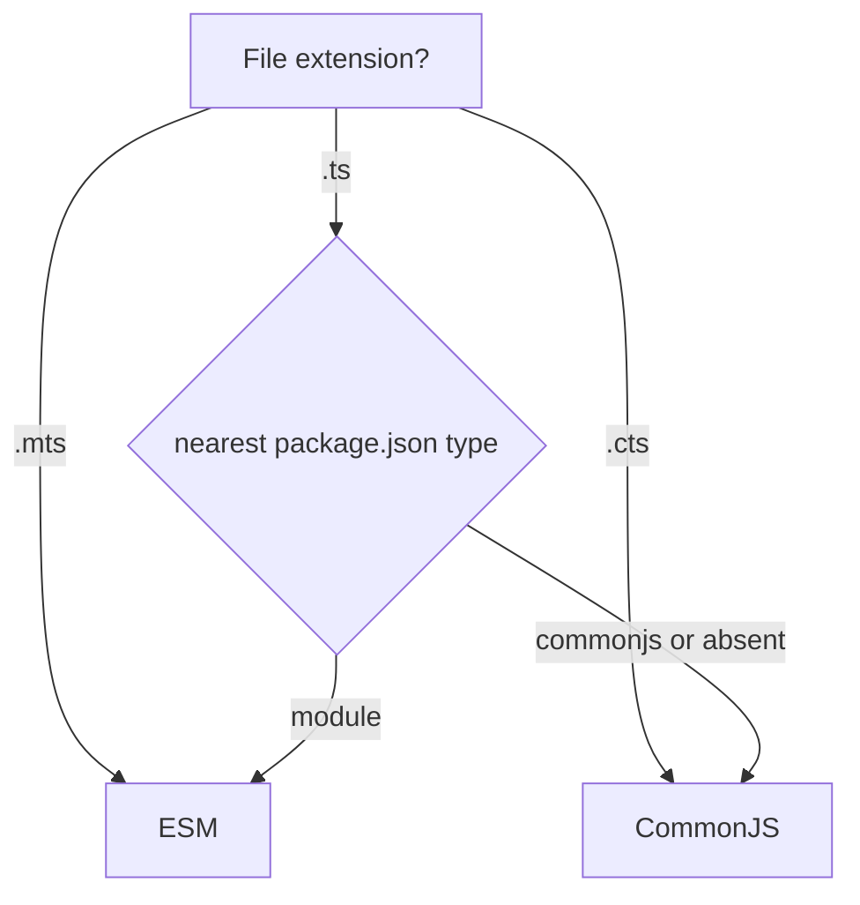

# Compiler Options — Under the Hood

## Table of Contents

1. [Overview](#overview)
2. [The tsc Pipeline and Where Each Option Acts](#the-tsc-pipeline-and-where-each-option-acts)
3. [How `target` Drives the Emitter (Downlevel Transforms)](#how-target-drives-the-emitter-downlevel-transforms)
4. [`downlevelIteration` — Correct Iteration on Old Targets](#downleveliteration--correct-iteration-on-old-targets)
5. [`importHelpers` and `tslib`](#importhelpers-and-tslib)
6. [How `module` and `moduleResolution` Drive Resolution and Emit](#how-module-and-moduleresolution-drive-resolution-and-emit)
7. [`esModuleInterop` — The Helpers It Injects](#esmoduleinterop--the-helpers-it-injects)
8. [How Type-Checking Flags Change the Checker](#how-type-checking-flags-change-the-checker)
9. [`useDefineForClassFields` — Two Different Class Semantics](#usedefineforclassfields--two-different-class-semantics)
10. [Decorators: `experimentalDecorators` and `emitDecoratorMetadata`](#decorators-experimentaldecorators-and-emitdecoratormetadata)
11. [`incremental` and `composite` — The `.tsbuildinfo` Format](#incremental-and-composite--the-tsbuildinfo-format)
12. [`isolatedModules` — Why Single-File Transpilers Need It](#isolatedmodules--why-single-file-transpilers-need-it)
13. [`skipLibCheck` — What Is Actually Skipped](#skiplibcheck--what-is-actually-skipped)
14. [Profiling the Effect of Options](#profiling-the-effect-of-options)
15. [Summary](#summary)
16. [Further Reading](#further-reading)

---

## Overview

This page explains *how* compiler options change the compiler's behavior internally — which phase reads each option, what AST transforms an option triggers, and what JavaScript ends up on disk. Understanding this lets you predict emit, debug "why did `tsc` produce that?", and choose options with full knowledge of their runtime cost.

The compiler has three relevant subsystems:

- **Binder** — builds the symbol table and control-flow graph.
- **Checker** — resolves and validates types; emits diagnostics.
- **Emitter (transforms + printer)** — lowers the typed AST into JavaScript and declaration files.

Options act on one or more of these. Type-checking flags configure the **checker**; emit flags configure the **emitter**; a few (`alwaysStrict`, `isolatedModules`) touch the **binder/parser** too.

---

## The tsc Pipeline and Where Each Option Acts


| Phase | Options that configure it |
|-------|---------------------------|
| Parser | `alwaysStrict`, `jsx`, `experimentalDecorators` (parse decorators), `target` (syntax acceptance) |
| Binder | `alwaysStrict` (strict-mode binding), `isolatedModules` (single-file constraints) |
| Checker | `strict` family, `noUnused*`, `noImplicitReturns`, `noUncheckedIndexedAccess`, `exactOptionalPropertyTypes`, `skipLibCheck`, `lib` |
| Transforms | `target`, `downlevelIteration`, `useDefineForClassFields`, `emitDecoratorMetadata`, `importHelpers`, `esModuleInterop`, `module` |
| Printer | `removeComments`, `sourceMap`, `declaration`, `declarationMap`, `outDir`, `newLine` |

The checker runs even when nothing is emitted (`noEmit`), which is why type errors appear regardless of emit settings.

---

## How `target` Drives the Emitter (Downlevel Transforms)

`target` selects a chain of *transformers* that lower newer syntax into the chosen older dialect. Each language feature has a transform that activates only when `target` is below the feature's level.

### Example: async/await with `target: "ES5"`

Source:

```typescript
async function load(id: string) {
  const res = await fetch(`/u/${id}`);
  return res.json();
}
```

With `target: "ES2017"` (async is native) the emit is essentially unchanged. With `target: "ES5"` the emitter rewrites it into a state machine driven by a generator-emulation helper (`__awaiter` + `__generator`):

```javascript
var __awaiter = (this && this.__awaiter) || function (thisArg, _arguments, P, generator) {
  // ... promise-driven state machine runner ...
};
function load(id) {
  return __awaiter(this, void 0, void 0, function () {
    var res;
    return __generator(this, function (_a) {
      switch (_a.label) {
        case 0: return [4 /*yield*/, fetch("/u/" + id)];
        case 1:
          res = _a.sent();
          return [2 /*return*/, res.json()];
      }
    });
  });
}
```

The template string also became string concatenation (another downlevel transform). The lower the `target`, the more transforms fire and the larger and slower the output.

### Example: class private fields

```typescript
class C { #secret = 1; read() { return this.#secret; } }
```

- `target: "ES2022"`: `#secret` is emitted verbatim (native private fields).
- Below `ES2022`: lowered to a `WeakMap` (`_C_secret`) plus `__classPrivateFieldGet/Set` helpers to preserve true privacy and identity semantics.

---

## `downlevelIteration` — Correct Iteration on Old Targets

When `target` is `ES5`, a naive `for...of` over an iterable, array spread, or destructuring only works correctly on arrays — not on `Map`, `Set`, strings with surrogate pairs, or custom iterators — unless `downlevelIteration` is on. The flag makes the emitter use the full iterator protocol helper (`__values`, `__read`, `__spreadArray`).

```typescript
const set = new Set([1, 2, 3]);
for (const x of set) console.log(x);
```

- `target: ES5`, `downlevelIteration: false`: the emit assumes array-like indexing; iterating a `Set` produces wrong/empty results.
- `target: ES5`, `downlevelIteration: true`: emits a `__values(set)` call that invokes `set[Symbol.iterator]()`, iterating correctly.

```javascript
// with downlevelIteration
var e_1, _a;
try {
  for (var set_1 = __values(set), set_1_1 = set_1.next(); !set_1_1.done; set_1_1 = set_1.next()) {
    var x = set_1_1.value;
    console.log(x);
  }
} catch (e_1_1) { e_1 = { error: e_1_1 }; }
finally { /* iterator cleanup */ }
```

The cost is larger, slower code, so it is only needed when targeting ES5 and using non-array iterables. For `target: ES2015+`, native `for...of` is used and the flag has no effect.

---

## `importHelpers` and `tslib`

The downlevel helpers above (`__awaiter`, `__extends`, `__spreadArray`, `__values`, `__classPrivateFieldGet`, ...) are by default **inlined into every file that needs them**. In a 500-file project that is a lot of duplicated bytes.

`importHelpers: true` instead imports each helper from the `tslib` package:

```javascript
// importHelpers: true  → emitted per file
var tslib_1 = require("tslib");
return tslib_1.__awaiter(this, void 0, void 0, function () { /* ... */ });
```

Trade-off: smaller total output and a single shared implementation, at the cost of a runtime dependency on `tslib`. Libraries almost always want this; apps benefit when downleveling heavily.

---

## How `module` and `moduleResolution` Drive Resolution and Emit

These two options control different phases:

- `moduleResolution` runs in the **checker/resolver**: given `import x from "y"`, which file on disk is `"y"`? `node16`/`nodenext` read `package.json` `"exports"`, `"imports"`, and `"type"`; the legacy `node` algorithm ignores `"exports"`. `bundler` mirrors `node16`'s lookup but drops the requirement to write file extensions in import specifiers.
- `module` runs in the **emitter**: what syntax do `import`/`export` become? `CommonJS` → `require`/`exports`; `ESNext` → native ESM; `NodeNext` → decided **per file** by the nearest `package.json` `"type"` (a `.ts` under `"type": "module"` emits ESM; otherwise CJS), and enforces explicit extensions.

```typescript
// import.ts
import { join } from "node:path";
export const sep = "/";
```

`module: "CommonJS"` emit:

```javascript
"use strict";
Object.defineProperty(exports, "__esModule", { value: true });
exports.sep = void 0;
const node_path_1 = require("node:path");
exports.sep = "/";
```

`module: "ESNext"` emit:

```javascript
import { join } from "node:path";
export const sep = "/";
```

Mismatching `module` with the runtime (e.g. emitting ESM but running under CommonJS) produces the infamous `Cannot use import statement outside a module`. `NodeNext` exists precisely to make this decision automatically from `package.json`.

---

## `esModuleInterop` — The Helpers It Injects

CommonJS modules have no real default export; `module.exports = fn` is the whole namespace. Naive ESM-to-CJS interop makes `import x from "cjs"` bind `x` to the namespace object, which breaks when the package exports a function directly. `esModuleInterop: true` injects two runtime helpers so the semantics match the ESM spec:

```javascript
var __importDefault = (this && this.__importDefault) || function (mod) {
  return (mod && mod.__esModule) ? mod : { "default": mod };
};
var __importStar = (this && this.__importStar) || function (mod) { /* wraps namespace */ };

const express_1 = __importDefault(require("express"));
express_1.default(); // `default` now correctly points at the exported function
```

Without the flag you must write `import express = require("express")` or `import * as express`. The flag also implies `allowSyntheticDefaultImports`, which is the *type-level* permission to write a default import against a module that has none. (`allowSyntheticDefaultImports` affects only type-checking; `esModuleInterop` affects type-checking **and** emit.)

---

## How Type-Checking Flags Change the Checker

Checker flags do not change emit at all — they change which **diagnostics** are produced and how types are computed.

- `strictNullChecks` changes the lattice: `null` and `undefined` become distinct types removed from every other type's domain. The checker then requires control-flow narrowing (computed from the binder's CFG) before member access on a possibly-null value.
- `noUncheckedIndexedAccess` changes the result type of element-access expressions: `T[number]` and index-signature access yield `T | undefined`. This is a checker-side type construction, invisible in emit.
- `exactOptionalPropertyTypes` changes assignability: an optional property `x?: T` no longer accepts the literal value `undefined` unless `undefined` is in `T`. The checker tracks "optionality" separately from "contains undefined".
- `strictFunctionTypes` switches parameter comparison from bivariant to contravariant for function-typed (not method) positions. Methods stay bivariant by design.
- `noImplicitAny` makes the checker error instead of widening to the `any` type when inference fails.
- `useUnknownInCatchVariables` types the catch binding as `unknown` rather than `any`.

Because these are checker-only, two builds that differ only in checker flags emit byte-identical JavaScript (assuming the stricter one compiles) — the difference is the error list.

---

## `useDefineForClassFields` — Two Different Class Semantics

This flag decides how class fields are emitted, and the two modes have observably different runtime behavior. It defaults to `true` when `target` is `ES2022` or higher (and `ESNext`), matching the standardized `[[Define]]` semantics.

```typescript
class Base { constructor() { this.setup(); } setup() {} }
class Derived extends Base {
  name = "x";
  setup() { console.log(this.name); }
}
new Derived();
```

- `useDefineForClassFields: false` (legacy): fields are emitted as constructor assignments (`this.name = "x"`). The `Base` constructor calls `setup()` **after** the assignment runs — actually, before, depending on order; the field uses `[[Set]]`, so setters on the prototype fire.
- `useDefineForClassFields: true` (standard): fields are installed with `Object.defineProperty` (`[[Define]]`) at the start of the derived constructor, **shadowing** any accessor on the prototype and running before subclass logic. A getter/setter declared in a base class for the same name is overwritten rather than invoked.

The practical gotcha: declaring a property in a subclass that a decorator or base accessor expects to be a setter can silently break under `true`. Frameworks that relied on the old behavior (older Angular, MobX patterns) sometimes require `useDefineForClassFields: false` or the `declare` modifier on such fields.

---

## Decorators: `experimentalDecorators` and `emitDecoratorMetadata`

`experimentalDecorators: true` enables the legacy (Stage 2) decorator syntax and emit — the form used by Angular, NestJS, TypeORM, and `class-transformer`. (TypeScript 5.0+ also supports the standard Stage 3 decorators *without* this flag, but the two emits differ and are not interchangeable.)

```typescript
@Controller("/users")
class UsersController {
  @Get()
  list(@Query("page") page: number) {}
}
```

With `experimentalDecorators: true`, the emitter lowers each decorator into a `__decorate([...], target, key, ...)` call wrapping the class/member.

`emitDecoratorMetadata: true` additionally emits **design-time type metadata** via `Reflect.metadata("design:type", ...)`, `"design:paramtypes"`, and `"design:returntype"`. This is what lets NestJS/TypeORM read a parameter's runtime type for dependency injection:

```javascript
__decorate([
  Get(),
  __param(0, Query("page")),
  __metadata("design:type", Function),
  __metadata("design:paramtypes", [Number]),   // <-- from emitDecoratorMetadata
  __metadata("design:returntype", void 0)
], UsersController.prototype, "list", null);
```

It requires `experimentalDecorators` and a `reflect-metadata` polyfill at runtime. Only enable `emitDecoratorMetadata` when a framework actually consumes the metadata — it adds emit weight and forces every decorated symbol's type to be reachable at value level.

---

## `incremental` and `composite` — The `.tsbuildinfo` Format

`incremental: true` writes a `.tsbuildinfo` file containing a serialized snapshot of the program: file version hashes, the file-to-file reference graph, the emitted-signature of each file's `.d.ts`, and the set of diagnostics. On the next run, `tsc` reads it, rehashes inputs, and re-checks only files whose hash changed *or* whose dependencies' `.d.ts` signature changed. A change to a function body that does not alter its public type often invalidates only that one file.

`composite: true` is `incremental` plus guarantees needed for project references: every input must be listed in `include`/`files` (so the build graph is complete), and `declaration` is forced on (downstream projects consume the `.d.ts`, never the source). `tsc --build` walks the `references` DAG, building each upstream project to its `.d.ts` first and using those as the input boundary for downstream type-checking — which is why a change confined to one package does not re-check the whole repo.

```bash
tsc --build --verbose   # shows which projects are up to date vs rebuilt
```

---

## `isolatedModules` — Why Single-File Transpilers Need It

esbuild/SWC/Babel transpile **one file at a time** with no type information. Certain TypeScript constructs require whole-program knowledge to emit correctly, so `isolatedModules: true` makes `tsc` reject them up front:

- `const enum` — its values are inlined at use sites across files; a single-file transpiler cannot see the declaration, so it cannot inline.
- Type-only re-exports `export { T } from "./t"` — without type info the transpiler cannot tell `T` is a type to elide, so you must write `export type { T }`.
- Bare `namespace` value merges that span files.

The flag does not change emit; it adds **constraints** so that whatever a single-file tool emits matches what `tsc` would. Pair it with `verbatimModuleSyntax` (which makes import elision purely syntactic) for full agreement between `tsc` and the bundler.

---

## `skipLibCheck` — What Is Actually Skipped

`skipLibCheck: true` tells the checker to skip the **internal consistency check of declaration (`.d.ts`) files** — the pass that verifies, say, two `@types` packages do not declare incompatible versions of the same global. It does **not** skip using those declarations; your code is still checked against them. What you lose is detection of conflicts *inside* and *between* `.d.ts` files (often the dependency author's bug, not yours). What you gain is skipping a large amount of redundant cross-checking of `node_modules` types, which is frequently the single biggest build-time win.

---

## Profiling the Effect of Options

```bash
# Per-phase timing — see how much time is checking vs emit
tsc --diagnostics
tsc --extendedDiagnostics   # adds memory, parse/bind/check/emit breakdown

# Flame-graph trace of type instantiations
tsc --generateTrace ./trace
npx @typescript/analyze-trace ./trace
```

`--extendedDiagnostics` reports lines like `Check time`, `Emit time`, and `Total time`. Toggling `skipLibCheck` and re-running shows its concrete impact on "Check time". Toggling `incremental` and running twice shows the warm-cache speedup. Use these numbers, not intuition, to justify flag choices.

```
Files:                          412
Lines:                       210443
Nodes:                       712004
Identifiers:                 248110
Check time:                    3.91 s
Emit time:                     0.62 s
Total time:                    5.10 s
```

---

## Deep Dive: How `strictNullChecks` Uses the Control-Flow Graph

`strictNullChecks` is a checker flag, but it depends on data the **binder** produces. During binding, every function body is turned into a control-flow graph (CFG) of flow nodes: branch nodes (`if`, `&&`, `?:`), assignment nodes, and call nodes. When the checker evaluates an expression, it walks backward through the CFG to compute the *narrowed* type at that point.

```typescript
function format(value: string | null): string {
  if (value === null) {
    return "n/a";          // flow node: value is null here
  }
  return value.toUpperCase(); // flow node: value is string here (null excluded by the guard)
}
```

With `strictNullChecks` off, `value` is just `string` everywhere (null was never a distinct member), so the CFG narrowing is a no-op and the guard is "pointless". With it on, the declared type is genuinely `string | null`, and the checker uses the CFG to subtract `null` after the `return`. This is why the same code produces different diagnostics under the two settings even though the binder did identical work — the difference is entirely in how the checker interprets the type lattice.

Narrowing constructs the binder/checker recognize: `typeof`, `instanceof`, equality against literals/`null`/`undefined`, `in`, truthiness, assignment, discriminant property checks, and user-defined type guards (`x is T`). `noUncheckedIndexedAccess` interacts here too: an element access result `T | undefined` can be narrowed to `T` by a truthiness guard before use.

---

## Deep Dive: `assumeChangesOnlyAffectDirectDependencies` and Watch Mode

In `--watch` mode the compiler keeps the program in memory and reuses the binder/checker state. `incremental` persists a subset of that state to disk. A subtle option, `assumeChangesOnlyAffectDirectDependencies`, tells watch/incremental builds to *not* transitively re-check the whole dependency cone on every change — only direct importers. It trades a small soundness risk (a deep transitive type change might be missed until the next full build) for much faster watch rebuilds in very large graphs. Most teams leave it off and rely on CI for the full check.

The watch host also recomputes module resolution only for changed files, which is why a `moduleResolution` or `paths` change sometimes requires a full restart of the watcher to take effect — the cached resolutions are not invalidated by editing the config.

---

## Deep Dive: What `declaration` Emit Actually Computes

`declaration: true` runs a separate **declaration emitter** that walks the checked AST and prints the *public type surface* — signatures with bodies stripped, types inlined or referenced. It must sometimes *synthesize* a type name for an anonymous inferred type, which is where the classic error comes from:

```typescript
// Without an explicit return type, the declaration emitter may fail:
export const make = () => ({ id: crypto.randomUUID(), at: new Date() });
// error TS9006: Declaration emit for this file requires using private name '...'.
```

The fix is to annotate the public return type so the emitter has a name to print. `isolatedDeclarations` (5.5+) turns this from a runtime failure into an up-front requirement: it forbids any export whose type cannot be emitted without whole-program inference, enabling fast per-file `.d.ts` generation by external tools.

---

## Deep Dive: Emit Determinism and `newLine`/`removeComments`

The **printer** is the final stage. A few options act only here and never affect types:

- `removeComments: true` — drops all comments (including JSDoc) from emitted `.js`. Note it does **not** strip comments from `.d.ts` — JSDoc is preserved there for consumer tooling.
- `newLine: "lf" | "crlf"` — line ending of emitted files; important for reproducible builds across OSes.
- `sourceMap`/`inlineSourceMap`/`inlineSources` — control whether maps are separate files, embedded, and whether the original source is embedded in the map.

Because these are printer-only, toggling them never changes the diagnostic list — only the bytes on disk.

---

## Summary

- Options act on specific phases: parser/binder (`alwaysStrict`, `isolatedModules`), checker (the `strict` family, `noUncheckedIndexedAccess`, `skipLibCheck`), and emitter (`target`, `downlevelIteration`, `module`, `useDefineForClassFields`, decorators, `importHelpers`).
- `target` selects downlevel transformers; lower targets emit state machines, `WeakMap`-based private fields, and string concatenation.
- `downlevelIteration` and `importHelpers` change *how* downlevel code is emitted (iterator protocol; shared `tslib` helpers).
- `module`/`moduleResolution` separate emit format from on-disk lookup; `esModuleInterop` injects `__importDefault`/`__importStar`.
- `useDefineForClassFields` changes class field semantics (`[[Define]]` vs `[[Set]]`); decorator flags change emit and metadata.
- Checker-only flags change diagnostics, never emit; `incremental`/`composite` persist a `.tsbuildinfo` build graph.

**Next step:** `specification.md` — the official `compilerOptions` reference with categories, defaults, and direct links.

---

## Deep Dive: `jsx` Emit Strategies

`jsx` selects a transform that runs in the emitter; the four modes produce different output and impose different runtime requirements.

```tsx
const el = <button onClick={handle}>Save</button>;
```

- `jsx: "preserve"` — leaves JSX intact, emits a `.jsx` file. A downstream tool (Babel, the bundler) finishes the transform. `tsc` does no JSX lowering.
- `jsx: "react"` — classic runtime: emits `React.createElement("button", { onClick: handle }, "Save")`. Requires `React` in scope in every file.
- `jsx: "react-jsx"` — automatic runtime (React 17+): emits `_jsx("button", { onClick: handle, children: "Save" })` and auto-imports `_jsx` from `react/jsx-runtime`. No manual `React` import needed.
- `jsx: "react-jsxdev"` — like `react-jsx` but emits the dev-runtime entry with extra source/position arguments for better warnings.

The `jsxImportSource` option (default `"react"`) lets non-React libraries (Preact, Solid) redirect the automatic-runtime import: `jsxImportSource: "preact"` emits imports from `preact/jsx-runtime`. This is purely an emitter concern — the checker validates the JSX against the configured factory's types regardless.

---

## Deep Dive: How `lib` Resolves to `.d.ts` Files

`lib` entries are not abstract — each maps to a bundled declaration file shipped inside the TypeScript package (`lib.es2022.d.ts`, `lib.dom.d.ts`, etc.). When you write `lib: ["ES2022", "DOM"]`, the checker loads exactly those `.d.ts` files (plus their internal `/// <reference lib="..." />` dependencies) as the ambient global environment. There is no runtime component — these files only *declare* what the runtime is assumed to provide.

This is why `lib` is replacement, not addition: the compiler does not infer a base set when you specify `lib`; it loads precisely your list. The target-derived default (when `lib` is omitted) is itself just a predetermined list per `target`. Knowing this, you can debug "why is `structuredClone` not found?" by checking whether the corresponding lib file (`lib.dom.d.ts` or a newer ES lib) is in your effective `lib`.

```bash
# Inspect which lib files TypeScript ships
ls node_modules/typescript/lib/lib.*.d.ts
```

---

## Deep Dive: Module Format Decision Table for `NodeNext`

Under `module: "nodenext"`, the emitter decides each file's format with a precise algorithm the professional should be able to reproduce:



The chosen format then drives:
- Whether `import`/`export` stay native or become `require`/`exports`.
- Whether import specifiers must carry extensions (ESM requires them).
- Whether `import x = require("y")` (CJS interop syntax) is allowed.

A single repo can therefore emit mixed formats: a `.cts` config loader as CommonJS alongside `.ts` ESM modules. The checker enforces the matching import rules per file, which is why moving a file between a `"type": "module"` and a non-module package can suddenly produce extension errors.

---

## Profiling Recap: Reading `--extendedDiagnostics`

| Line | Meaning | Lever if high |
|------|---------|---------------|
| Parse time | Tokenizing + AST | Fewer/smaller files |
| Bind time | Symbols + CFG | Usually small; rarely the bottleneck |
| Check time | Type resolution + assignability | `skipLibCheck`, simpler generics, smaller unions |
| Emit time | Transforms + printing | Higher `target`, offload to bundler, `noEmit` |
| Total time | Sum + overhead | — |
| Memory used | Peak heap | Project references to split the program |

The decisive habit: change exactly one option, re-run `--extendedDiagnostics`, and attribute the delta. This is how you turn "I think `skipLibCheck` helps" into "Check time dropped from 6.2s to 3.4s."

---

## Further Reading

- [TypeScript compiler internals (deep dive)](https://basarat.gitbook.io/typescript/overview)
- [tslib](https://github.com/microsoft/tslib)
- [useDefineForClassFields](https://www.typescriptlang.org/tsconfig#useDefineForClassFields)
- [Decorators handbook](https://www.typescriptlang.org/docs/handbook/decorators.html)
- [TypeScript Performance wiki](https://github.com/microsoft/TypeScript/wiki/Performance)
- [JSX handbook](https://www.typescriptlang.org/docs/handbook/jsx.html)
- [Modules — reference](https://www.typescriptlang.org/docs/handbook/modules/reference.html)

---

## Appendix A: Helper Inventory by Option

The downlevel and interop helpers `tsc` may inject, and which option/target triggers each:

| Helper | Triggered by | Purpose |
|--------|--------------|---------|
| `__extends` | class inheritance, `target < ES2015` | Prototype-chain setup for `extends` |
| `__assign` | object spread, `target < ES2015` | `Object.assign`-style spread |
| `__rest` | object rest in destructuring | Collect remaining properties |
| `__spreadArray` | array spread, `target < ES2015` | Concatenate spread elements |
| `__awaiter` + `__generator` | `async/await`, `target < ES2017` | Promise-driven state machine |
| `__values` / `__read` | `for...of`/spread with `downlevelIteration` | Iterator protocol |
| `__importDefault` / `__importStar` | `esModuleInterop` | CJS↔ESM default/namespace interop |
| `__classPrivateFieldGet`/`Set` | `#field`, `target < ES2022` | WeakMap-backed private fields |
| `__decorate` / `__param` / `__metadata` | decorators / `emitDecoratorMetadata` | Decorator application + reflect metadata |

With `importHelpers: true`, each of these is imported from `tslib` instead of inlined per file. This table lets you predict, from a file's syntax + your options, exactly which helpers will appear in its emit.

---

## Appendix B: Why Checker-Only vs Emit-Affecting Matters

A practical consequence of the phase model: you can change **checker-only** flags freely between environments without risking different runtime behavior, because emit is identical. For example, a stricter CI config (`tsconfig.ci.json` with `noUncheckedIndexedAccess`) and a looser dev config produce the same JavaScript — the CI config just rejects more programs. Conversely, **emit-affecting** flags (`target`, `module`, `useDefineForClassFields`, `importHelpers`, `esModuleInterop`, decorator flags) must be identical between the config that builds production and any config used to reason about runtime behavior, or you risk "works in dev, breaks in prod."

Classification at a glance:

- **Checker-only (safe to vary):** entire `strict` family, `noUncheckedIndexedAccess`, `exactOptionalPropertyTypes`, `noImplicitReturns`, `noFallthroughCasesInSwitch`, `noUnused*`, `skipLibCheck`, `noImplicitOverride`, `noPropertyAccessFromIndexSignature`.
- **Emit-affecting (must match prod):** `target`, `module`, `useDefineForClassFields`, `downlevelIteration`, `importHelpers`, `esModuleInterop`, `experimentalDecorators`, `emitDecoratorMetadata`, `jsx`, `verbatimModuleSyntax`, `removeComments`, `sourceMap`.
- **Resolution-affecting (must match the toolchain):** `moduleResolution`, `baseUrl`, `paths`, `types`, `typeRoots`.

Internalizing these three buckets is the difference between confidently tuning configs and introducing heisenbugs.

---

## Appendix C: The `target` → `lib` → emit Triangle

Three options interact to determine both what your code *can use* and what it *compiles to*:

- `target` sets the syntax level of emit **and** the default `lib`.
- `lib` sets the *type* environment (what globals exist for the checker).
- The emitter uses `target` to decide which downlevel transforms run.

A subtle, professional-level gotcha: `lib` and `target` can disagree, and that is sometimes intentional. You might target `ES2017` (for a runtime that lacks newer *syntax*) while including `lib: ["ES2022"]` because the runtime has the newer *APIs* polyfilled. The checker then allows `Array.prototype.at` (from the ES2022 lib) while the emitter still downlevels any ES2018+ syntax to ES2017. Mismatching them deliberately is how you model "modern APIs, conservative syntax" runtimes.

```json
{
  "compilerOptions": {
    "target": "ES2017",          // emit syntax for an older runtime
    "lib": ["ES2022", "DOM"]     // but assume newer APIs are available (polyfilled)
  }
}
```

The danger: if the runtime does *not* actually provide an API your `lib` promises, the type-check passes but the code crashes with `x.at is not a function`. `lib` is a *promise to the checker*, not a polyfill — you remain responsible for providing the runtime implementation.

---

## Appendix D: How `paths` Resolution Runs in the Checker

`paths` resolution happens during module resolution, before type-checking the import. For each import specifier, the resolver:

1. Checks if the specifier matches a `paths` pattern (longest/most-specific pattern wins; `*` is the substitution point).
2. For each candidate in the pattern's array, substitutes the captured `*` and resolves relative to `baseUrl` (or the config dir if `baseUrl` is unset, in newer versions).
3. Falls back to normal `moduleResolution` if no `paths` candidate resolves.

```json
{ "baseUrl": ".", "paths": { "@app/*": ["src/*", "generated/*"] } }
```

Here `@app/user` tries `src/user` then `generated/user`. Because this is checker-side only, the emitter leaves the original specifier `@app/user` untouched in the output — which is exactly why a runtime resolver must re-apply the same mapping. Tools like `tsc-alias` rewrite the emitted specifiers post-build to bridge this gap.
