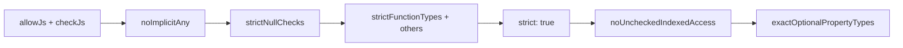

# Compiler Options — Senior Level

## Table of Contents

1. [Responsibilities at This Level](#responsibilities-at-this-level)
2. [A Mental Model for Choosing Options](#a-mental-model-for-choosing-options)
3. [Recommended Config: New Application](#recommended-config-new-application)
4. [Recommended Config: New Library](#recommended-config-new-library)
5. [Recommended Config: Legacy / Migrating Codebase](#recommended-config-legacy--migrating-codebase)
6. [Gradual Hardening Strategy](#gradual-hardening-strategy)
7. [Performance Flags](#performance-flags)
8. [Project References and `composite`](#project-references-and-composite)
9. [Sharing Config with `extends` and `@tsconfig/bases`](#sharing-config-with-extends-and-tsconfigbases)
10. [Isolated Modules and the Bundler Era](#isolated-modules-and-the-bundler-era)
11. [`verbatimModuleSyntax`](#verbatimmodulesyntax)
12. [Decisions Table: One Flag, One Trade-off](#decisions-table-one-flag-one-trade-off)
13. [Senior Checklist](#senior-checklist)
14. [Anti-Patterns](#anti-patterns)
15. [Test](#test)
16. [Summary](#summary)
17. [Further Reading](#further-reading)

---

## Responsibilities at This Level

- Define the organization's baseline `tsconfig.json` and the rules for deviating from it.
- Drive strictness adoption across legacy code without halting feature work.
- Keep type-check and build times low as the codebase scales to thousands of files.
- Set up project references and `composite` builds for monorepos.
- Decide when `tsc` emits and when a bundler (esbuild, SWC, Vite) does, and configure `isolatedModules`/`verbatimModuleSyntax` to keep the two in agreement.

At this level you are not just *using* compiler options — you are *governing* them.

---

## A Mental Model for Choosing Options

Group every option into one of three buckets, and ask the bucket's question:

1. **Type safety** (`strict`, `noUncheckedIndexedAccess`, `exactOptionalPropertyTypes`, `noImplicit*`) — *How many real bugs do I want the compiler to catch, and how much migration pain can the team absorb right now?*
2. **Emit / interop** (`target`, `module`, `moduleResolution`, `declaration`, `importHelpers`, `verbatimModuleSyntax`, `isolatedModules`) — *What runtime and tooling consume my output, and will single-file transpilers agree with `tsc`?*
3. **Build performance** (`skipLibCheck`, `incremental`, `composite`, project references) — *How do I keep CI fast as the codebase grows?*

Most config debates are really debates inside one of these buckets. Keeping them separate prevents the common failure of trading away safety to fix a build-speed problem (or vice versa).

---

## Recommended Config: New Application

For a greenfield app you control end-to-end, be maximally strict — it is cheapest now and most expensive later.

```json
{
  "compilerOptions": {
    "target": "ES2022",
    "module": "NodeNext",
    "moduleResolution": "NodeNext",
    "outDir": "./dist",
    "rootDir": "./src",

    "strict": true,
    "noUncheckedIndexedAccess": true,
    "exactOptionalPropertyTypes": true,
    "noImplicitOverride": true,
    "noUnusedLocals": true,
    "noUnusedParameters": true,
    "noImplicitReturns": true,
    "noFallthroughCasesInSwitch": true,
    "noPropertyAccessFromIndexSignature": true,

    "isolatedModules": true,
    "verbatimModuleSyntax": true,
    "esModuleInterop": true,
    "resolveJsonModule": true,

    "skipLibCheck": true,
    "incremental": true,
    "forceConsistentCasingInFileNames": true,

    "declaration": false,
    "sourceMap": true
  },
  "include": ["src/**/*"]
}
```

Rationale highlights:
- `noImplicitOverride` — requires the `override` keyword when overriding a base method, preventing accidental shadowing.
- `noPropertyAccessFromIndexSignature` — forces `obj["dynamic"]` (bracket) for index-signature keys and `obj.known` (dot) for declared keys, making intent explicit.
- `verbatimModuleSyntax` + `isolatedModules` — keep `tsc` and single-file transpilers in agreement.

---

## Recommended Config: New Library

A library publishes `.d.ts` files that downstream consumers depend on. Two extra concerns: emit correct declarations, and do not assume the consumer's `lib`/`target`.

```json
{
  "compilerOptions": {
    "target": "ES2020",
    "module": "NodeNext",
    "moduleResolution": "NodeNext",
    "outDir": "./dist",
    "rootDir": "./src",

    "strict": true,
    "noUncheckedIndexedAccess": true,
    "exactOptionalPropertyTypes": true,

    "declaration": true,
    "declarationMap": true,
    "sourceMap": true,
    "importHelpers": true,

    "isolatedModules": true,
    "verbatimModuleSyntax": true,
    "skipLibCheck": true,
    "forceConsistentCasingInFileNames": true
  },
  "include": ["src/**/*"]
}
```

- `declaration: true` — emit `.d.ts`. Required for a typed library.
- `declarationMap: true` — emit `.d.ts.map` so consumers' "go to definition" jumps to your `.ts` source, not the generated `.d.ts`.
- `importHelpers: true` with `tslib` as a dependency — share downlevel helpers (`__awaiter`, `__spreadArray`) instead of inlining them into every file, shrinking the published bundle.
- A slightly conservative `target` (`ES2020`) widens the set of runtimes the library supports. Avoid setting `lib` aggressively; let consumers control it.

---

## Recommended Config: Legacy / Migrating Codebase

For a large JavaScript or loosely-typed TypeScript codebase, you cannot flip `strict` on day one — thousands of errors would block all work. Start permissive, ratchet up.

```json
{
  "compilerOptions": {
    "target": "ES2019",
    "module": "CommonJS",
    "moduleResolution": "node",
    "outDir": "./dist",

    "strict": false,
    "noImplicitAny": false,
    "strictNullChecks": false,

    "allowJs": true,
    "checkJs": false,
    "esModuleInterop": true,
    "skipLibCheck": true,
    "incremental": true
  },
  "include": ["src/**/*"]
}
```

Then harden one flag at a time (next section).

---

## Gradual Hardening Strategy

The goal: monotonic progress with a green build at every step. Recommended order, easiest-impact first:



Tactics that make each step survivable:

1. **Enable per-file, not all-at-once.** Add `// @ts-strict-ignore` (with `@typescript-eslint/strict`) or use a tool like `ts-strictify` to opt files in incrementally.
2. **Use a separate stricter config for CI on new code.** `tsconfig.strict.json` extends the base, turns on `strictNullChecks`, and `include`s only the migrated folders. CI runs both.
3. **Track progress with a metric.** Count files passing the strict config; make the count monotonically increase via a CI gate.
4. **Turn `strictNullChecks` on last among the big ones** — it produces the most errors but the most value. Budget real time for it.
5. **Prefer fixing over `!` and `as`.** Each non-null assertion is debt. Grep for them after migration.

```json
// tsconfig.strict.json — the "ratchet" config
{
  "extends": "./tsconfig.json",
  "compilerOptions": {
    "strict": true,
    "noUncheckedIndexedAccess": true
  },
  "include": ["src/payments/**/*", "src/auth/**/*"]
}
```

```bash
tsc -p tsconfig.json          # whole repo, lenient (must stay green)
tsc -p tsconfig.strict.json   # migrated folders, strict (must stay green)
```

---

## Performance Flags

As a senior, build time is a product feature. The flags that matter:

### `skipLibCheck: true`

Skips type-checking `.d.ts` files (mostly `node_modules`). Large speedup; the small risk is missing an error caused by conflicting library types. Almost everyone runs it.

### `incremental: true`

Persists a `.tsbuildinfo` file recording the last build's program graph. Subsequent builds re-check only what changed.

```json
{ "compilerOptions": { "incremental": true, "tsBuildInfoFile": "./.cache/tsbuild.json" } }
```

```bash
tsc            # cold: full check
tsc            # warm, no changes: seconds instead of minutes
```

Cache `.tsbuildinfo` in CI to carry the warm cache across runs.

### Project references (build performance dimension)

Split a monorepo into independently-checkable packages so only changed packages and their dependents rebuild. Covered next.

### Other levers

- Reduce expensive recursive generics (deep `DeepPartial`, big conditional types). Profile with `tsc --generateTrace`.
- Keep union types small; 100+ member unions are checked on every assignment.
- Prefer `interface` over large `type` object aliases — interfaces are cached more effectively by the checker.

---

## Project References and `composite`

Project references let `tsc --build` treat packages as a dependency graph, building each once and reusing its `.d.ts` output downstream.

```json
// packages/core/tsconfig.json
{
  "compilerOptions": {
    "composite": true,        // required for referenced projects
    "declaration": true,      // implied by composite, but be explicit
    "declarationMap": true,
    "outDir": "./dist",
    "rootDir": "./src"
  },
  "include": ["src/**/*"]
}
```

```json
// packages/api/tsconfig.json
{
  "compilerOptions": { "composite": true, "outDir": "./dist", "rootDir": "./src" },
  "references": [{ "path": "../core" }],
  "include": ["src/**/*"]
}
```

```bash
tsc --build packages/api     # builds core first (if stale), then api
tsc --build --watch          # incremental rebuilds across the graph
tsc --build --clean          # remove all outputs
```

`composite: true` forces `declaration: true` and requires every input file to be covered by `include`/`files`. It also implies `incremental: true`. The payoff is large: a 500-file monorepo can drop from a 60s full check to ~15s by only rebuilding affected packages.

---

## Sharing Config with `extends` and `@tsconfig/bases`

Do not copy-paste configs across packages. Centralize a base and extend it.

```json
// tsconfig.base.json (repo root)
{
  "compilerOptions": {
    "strict": true,
    "skipLibCheck": true,
    "esModuleInterop": true,
    "forceConsistentCasingInFileNames": true,
    "target": "ES2022",
    "moduleResolution": "NodeNext"
  }
}
```

```json
// packages/api/tsconfig.json
{
  "extends": "../../tsconfig.base.json",
  "compilerOptions": { "outDir": "./dist", "rootDir": "./src", "module": "NodeNext" },
  "include": ["src/**/*"]
}
```

The community-maintained `@tsconfig/*` packages (e.g. `@tsconfig/node20`, `@tsconfig/strictest`) give you vetted bases you can extend:

```json
{ "extends": "@tsconfig/strictest/tsconfig.json" }
```

`@tsconfig/strictest` turns on the full safety set (`strict`, `noUncheckedIndexedAccess`, `exactOptionalPropertyTypes`, `noImplicitOverride`, and more) — a good default for new strict projects.

---

## Isolated Modules and the Bundler Era

When a single-file transpiler (esbuild, SWC, Babel) compiles each file in isolation, it cannot see the whole type graph. `isolatedModules: true` makes `tsc` reject constructs those tools cannot handle correctly, so your `tsc` type-check and your bundler's emit agree.

```typescript
// isolatedModules: true flags this — re-exporting a type without `export type`
export { SomeType } from "./types";
//       ~~~~~~~~ Error: Re-exporting a type when 'isolatedModules' is enabled
//                requires using 'export type'.

// Fix:
export type { SomeType } from "./types";
```

It also forbids `const enum` (which requires cross-file inlining) and bare namespace value merges. The rule of thumb: **if a bundler emits your production code, set `isolatedModules: true`.**

---

## `verbatimModuleSyntax`

The modern successor to `importsNotUsedAsValues` and `preserveValueImports`. It makes the rule simple and predictable: an `import`/`export` written without the `type` modifier is **always emitted**; one written with `type` is **always elided**. No type-directed elision, which is exactly what single-file transpilers need.

```typescript
// verbatimModuleSyntax: true
import { type User, createUser } from "./user";
// `type User` is erased; `createUser` is kept in the emitted JS.

import type { Config } from "./config";
// Entire import is erased.

import { Logger } from "./logger";
// Kept even if only used in a type position — you must mark it `type` to elide.
```

Benefits: emit is decided purely from syntax (fast, deterministic), and you avoid the bug where `tsc` elides an import that the bundler keeps (or vice versa). Note it forbids mixing CommonJS `export =` with ESM syntax in the same file — intentional, to keep emit unambiguous.

---

## Decisions Table: One Flag, One Trade-off

| Flag | Buys you | Costs you |
|------|----------|-----------|
| `strict` | Whole class of bugs caught | Migration effort on legacy code |
| `noUncheckedIndexedAccess` | No out-of-bounds crashes | `| undefined` noise on every index access |
| `exactOptionalPropertyTypes` | Absent vs undefined precision | Extra annotations on optional fields |
| `skipLibCheck` | Faster builds | Rare missed lib-type conflicts |
| `incremental` | Fast rebuilds | A cache file to manage/cache in CI |
| `composite` | Monorepo incremental graph | Stricter `include`, mandatory declarations |
| `isolatedModules` | Bundler agreement | No `const enum`, stricter re-exports |
| `verbatimModuleSyntax` | Deterministic emit | Must annotate type-only imports |
| `importHelpers` | Smaller emitted output | `tslib` runtime dependency |
| `declaration` | Publishable types | Slower emit, must be type-clean |

---

## Senior Checklist

- [ ] A central `tsconfig.base.json` (or `@tsconfig/*` base) is the single source of truth.
- [ ] New projects use the strict-plus config; legacy uses a documented ratchet.
- [ ] `skipLibCheck` and `incremental` are on; `.tsbuildinfo` is cached in CI.
- [ ] Monorepos use project references with `composite: true`.
- [ ] If a bundler emits production code, `isolatedModules` and `verbatimModuleSyntax` are on.
- [ ] Libraries emit `declaration` + `declarationMap`, and use `importHelpers` with `tslib`.
- [ ] `tsc --noEmit` (or `tsc --build`) runs in CI independent of the bundler.

---

## Anti-Patterns

### Anti-Pattern 1: Loosening strictness globally to unblock one file

Disabling `strictNullChecks` repo-wide because one module is painful throws away safety everywhere. Instead, scope the strict config to migrated folders and fix the painful file.

### Anti-Pattern 2: `skipLibCheck: false` "for safety"

Almost no team needs to type-check every dependency's `.d.ts`. The build-time cost is large and the bugs it catches are usually the dependency author's, not yours. Keep `skipLibCheck: true`.

### Anti-Pattern 3: Bundler emits but `tsc` settings disagree

Running esbuild for production while `tsc` has `verbatimModuleSyntax: false` and uses `const enum` leads to runtime breakage the type-check never reveals. Align the two with `isolatedModules` + `verbatimModuleSyntax`.

### Anti-Pattern 4: `paths` aliases with no runtime resolver

Type-checks pass; `node dist/index.js` throws `Cannot find module "@/x"`. Mirror every alias in the bundler or a `package.json` `imports` map.

---

## Test

### Multiple Choice

**1. Which flag is required on a project that other projects reference via `references`?**

- A) `incremental`
- B) `composite`
- C) `declarationMap`
- D) `isolatedModules`

<details>
<summary>Answer</summary>
**B)** — Referenced projects must set `composite: true` (which also implies `declaration` and `incremental`).
</details>

**2. Which combination keeps `tsc` and a single-file transpiler in agreement?**

- A) `declaration` + `declarationMap`
- B) `isolatedModules` + `verbatimModuleSyntax`
- C) `incremental` + `composite`
- D) `skipLibCheck` + `strict`

<details>
<summary>Answer</summary>
**B)** — `isolatedModules` rejects whole-program constructs and `verbatimModuleSyntax` makes import emit syntax-driven, both of which single-file transpilers require.
</details>

### True or False

**3. `importHelpers: true` removes the need for any runtime dependency.**

<details>
<summary>Answer</summary>
**False** — It *adds* a dependency on `tslib`, which provides the shared helpers. The benefit is not inlining helpers into every file.
</details>

**4. The best gradual-hardening order turns on `strictNullChecks` first.**

<details>
<summary>Answer</summary>
**False** — `strictNullChecks` produces the most errors. Enable `noImplicitAny` first, then work up to `strictNullChecks`, then the rest.
</details>

### Scenario

**5. Your monorepo full type-check takes 90s and blocks PRs. Name three flags/strategies to attack it.**

<details>
<summary>Answer</summary>
`skipLibCheck: true`, `incremental: true` with a cached `.tsbuildinfo`, and project references with `composite: true` so only changed packages rebuild. Optionally profile recursive generics with `--generateTrace`.
</details>

---

## Governance: Owning the Org-Wide Config

A senior's real deliverable is not one `tsconfig.json` — it is a *policy* the whole org follows. Practical mechanics:

1. **Publish a base as a package.** Ship `@acme/tsconfig` containing `tsconfig.base.json`, `tsconfig.node.json`, `tsconfig.library.json`, `tsconfig.react.json`. Teams `extends` the right one. Bumping the package rolls out a flag change everywhere.

```json
// a consuming repo
{ "extends": "@acme/tsconfig/node.json", "compilerOptions": { "outDir": "dist" } }
```

2. **Make deviations explicit and reviewed.** Any `compilerOptions` override in a leaf config must carry a comment and ideally a lint rule that flags loosening of safety flags (`strict`, `noUncheckedIndexedAccess`).

3. **Pin or float TypeScript deliberately.** Because `strict` can gain new members in a major release, decide whether to pin the compiler (`~5.6.0`) for reproducibility or float (`^5.6.0`) for free safety. Pin in libraries (their `.d.ts` are consumed by others); float in apps with good CI.

4. **Gate CI on the strict config, not just the lenient one.** A green lenient build hides regressions. Run both; fail the PR if a file regresses out of the strict set.

---

## Reading an `extends` Chain Correctly

`extends` is shallow-merge on `compilerOptions`, but with important rules seniors must internalize:

- `compilerOptions` keys are merged; a child key overrides the parent's same key.
- `files`, `include`, and `exclude` from the child **replace** (do not merge with) the parent's.
- Relative paths in the parent (`outDir`, `paths`, `baseUrl`) are resolved relative to the **parent** config's location, except where noted — a frequent source of "why is output in the wrong folder" confusion.
- `extends` can be an array (5.0+): later entries win.

```json
{
  "extends": ["@acme/tsconfig/base.json", "./tsconfig.local.json"],
  "compilerOptions": { "outDir": "dist" }
}
```

When debugging an effective config, run `tsc --showConfig` to print the fully-resolved options after all `extends` are applied — invaluable in a deep chain.

```bash
tsc --showConfig   # prints the merged, effective tsconfig
```

---

## When to Split into Multiple Configs

A single repo often needs several configs for different purposes:

| Config | Purpose | Key differences |
|--------|---------|-----------------|
| `tsconfig.json` | Editor + default build | strict, emits or `noEmit` |
| `tsconfig.build.json` | Production build | `declaration`, no test files, `removeComments` |
| `tsconfig.test.json` | Test type-check | includes `*.test.ts`, looser if needed |
| `tsconfig.strict.json` | Migration ratchet | strict-only, scoped `include` |
| `tsconfig.eslint.json` | Lint type info | broad `include`, `noEmit` |

The editor uses the nearest `tsconfig.json`, so that one must include test files (or the IDE will not type them). Build excludes tests via a separate config. Keeping these straight prevents the classic "works in the editor, fails in CI build" mismatch.

---

## Cost/Benefit of the Most Debated Flags

Seniors are asked to justify these in design reviews:

- **`exactOptionalPropertyTypes`** — high precision, but generates friction with libraries that spread `{ ...defaults, ...opts }` where `opts` may carry explicit `undefined`. Adopt on new internal code; be pragmatic at library boundaries.
- **`noUncheckedIndexedAccess`** — biggest safety win for data-heavy code, but adds `| undefined` noise to *every* loop body. Pair with helpers (`at()`, guards) so it does not push teams toward `!`.
- **`noPropertyAccessFromIndexSignature`** — great for config/env objects; can feel pedantic elsewhere. Often scoped to specific files.
- **`skipLibCheck: false`** — almost never worth it; the bugs it finds are usually a dependency's, and the cost is large. Default to `true`.

---

## Summary

- Sort options into **type safety**, **emit/interop**, and **build performance** buckets and reason within each.
- New apps: maximal strictness plus `isolatedModules` + `verbatimModuleSyntax`. New libraries: add `declaration`, `declarationMap`, `importHelpers`.
- Legacy code: start lenient and ratchet flags one at a time with a scoped strict config and a monotonic CI metric; save `strictNullChecks` for late.
- Build speed comes from `skipLibCheck`, `incremental`, and project references with `composite`.
- Centralize config with `extends` / `@tsconfig/*`; never copy-paste.

**Next step:** `professional.md` — how each flag changes the binder, checker, and emitter, and what `tsc` actually emits for downlevel targets.

---

## Further Reading

- [Project references](https://www.typescriptlang.org/docs/handbook/project-references.html)
- [`@tsconfig/bases`](https://github.com/tsconfig/bases)
- [verbatimModuleSyntax](https://www.typescriptlang.org/tsconfig#verbatimModuleSyntax)
- [isolatedModules](https://www.typescriptlang.org/tsconfig#isolatedModules)
- [Performance — TypeScript wiki](https://github.com/microsoft/TypeScript/wiki/Performance)
