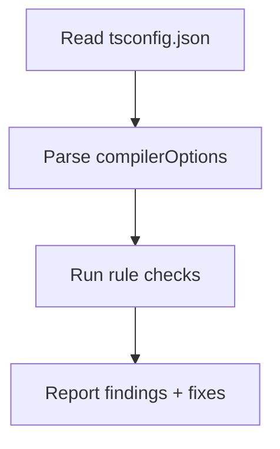

# Compiler Options — Practical Tasks

## Table of Contents

1. [Junior Tasks](#junior-tasks)
2. [Middle Tasks](#middle-tasks)
3. [Senior Tasks](#senior-tasks)
4. [Professional Tasks](#professional-tasks)
5. [Questions](#questions)
6. [Mini Projects](#mini-projects)
7. [Challenge](#challenge)

---

## Junior Tasks

### Task 1: Write a Starter tsconfig

**Type:** Config

**Goal:** Create a `tsconfig.json` for a modern Node.js project from scratch.

**Requirements:**
- `target` set to a modern ES version.
- `module` and `moduleResolution` consistent and suited to Node.
- Source in `src/`, output in `dist/`.
- Strict mode on.
- `esModuleInterop`, `skipLibCheck`, and `forceConsistentCasingInFileNames` on.

**Starter:**

```json
{
  "compilerOptions": {
    // TODO: fill in target, module, moduleResolution
    // TODO: outDir, rootDir
    // TODO: strict and the everyday helper flags
  },
  "include": ["src/**/*"]
}
```

**Expected solution shape:**

```json
{
  "compilerOptions": {
    "target": "ES2022",
    "module": "NodeNext",
    "moduleResolution": "NodeNext",
    "rootDir": "./src",
    "outDir": "./dist",
    "strict": true,
    "esModuleInterop": true,
    "skipLibCheck": true,
    "forceConsistentCasingInFileNames": true
  },
  "include": ["src/**/*"]
}
```

**Evaluation criteria:**
- [ ] `tsc` compiles `src/index.ts` to `dist/index.js`.
- [ ] `module` and `moduleResolution` match.
- [ ] `strict: true` present.

---

### Task 2: Observe the `target` Effect

**Type:** Experiment

**Goal:** See how `target` changes emitted JavaScript.

**Steps:**
1. Create `feature.ts`:

```typescript
class Box {
  #value = 0;
  set(v: number) { this.#value = v; }
  get(): number { return this.#value; }
}

const doubled = [1, 2, 3].map((n) => n * 2);
export { Box, doubled };
```

2. Compile twice and compare:

```bash
tsc feature.ts --target ES2022 --outDir out-new
tsc feature.ts --target ES5 --outDir out-old --downlevelIteration
```

**Evaluation criteria:**
- [ ] `out-new` keeps `#value` and the arrow function.
- [ ] `out-old` replaces `#value` with a `WeakMap` and the arrow with a `function`.
- [ ] You can explain at least two differences.

---

### Task 3: Turn On Strict and Fix the Errors

**Type:** Code

**Goal:** Add `strict: true` to a loose file and fix every resulting error without `any`.

**Starter:**

```typescript
// users.ts (compiles without strict, has hidden bugs)
function getEmail(user) {
  return user.email.toLowerCase();
}

function findUser(users, id) {
  return users.find((u) => u.id === id);
}

const admin = findUser([], "1");
console.log(getEmail(admin));
```

**Requirements:**
- Enable `strict: true`.
- Annotate `user`, `users`, `id`.
- Handle the possibly-`undefined` result of `find`.
- No `any`, no `!`.

**Evaluation criteria:**
- [ ] `tsc --noEmit` exits 0.
- [ ] `findUser` result is narrowed before use.
- [ ] All parameters are typed.

---

### Task 4: Backend vs Frontend lib

**Type:** Config

**Goal:** Demonstrate the effect of `lib` and `DOM`.

**Requirements:**
- Write `server.ts` that uses `document.getElementById` (browser-only).
- Configure a Node config (`lib: ["ES2022"]`) — confirm it errors on `document`.
- Configure a browser config (`lib: ["ES2022", "DOM"]`) — confirm it compiles.

**Evaluation criteria:**
- [ ] You can show the exact error under the Node config.
- [ ] You can explain why `lib` replaces (not extends) the default.

---

## Middle Tasks

### Task 5: Enable `noUncheckedIndexedAccess` and Adapt

**Type:** Code

**Goal:** Turn on `noUncheckedIndexedAccess` and make existing array code type-safe.

**Starter:**

```typescript
function firstWord(sentence: string): string {
  const words = sentence.split(" ");
  return words[0].toUpperCase(); // becomes possibly-undefined
}

function lookup(table: Record<string, number>, key: string): number {
  return table[key] * 2; // becomes possibly-undefined
}
```

**Requirements:**
- Add `"noUncheckedIndexedAccess": true`.
- Fix both functions to handle `undefined` (guard, default, or throw).
- Document why each access could be undefined.

**Evaluation criteria:**
- [ ] Both functions compile under the flag.
- [ ] No non-null assertions used as a shortcut.

---

### Task 6: Path Aliases That Work at Runtime

**Type:** Config + Code

**Goal:** Set up `paths` aliases and make them resolve at runtime too.

**Requirements:**
- Configure `baseUrl` and `paths` so `@/services/*` maps to `src/services/*`.
- Use the alias in an import.
- Make it work at runtime via one of: a bundler, `tsconfig-paths`, or a `package.json` `imports` map.

**Starter:**

```json
{
  "compilerOptions": {
    "baseUrl": ".",
    "paths": {
      "@/*": ["src/*"]
    }
  }
}
```

**Evaluation criteria:**
- [ ] `tsc --noEmit` resolves the alias.
- [ ] `node` (or the bundler) runs the code without "module not found".
- [ ] You can explain why `paths` alone is not enough at runtime.

---

### Task 7: Decode `exactOptionalPropertyTypes`

**Type:** Code

**Goal:** Show the difference the flag makes for optional properties.

**Starter:**

```typescript
interface Settings {
  theme?: "light" | "dark";
}

function applySettings(s: Settings) {
  // ...
}

applySettings({ theme: undefined }); // legal without the flag
```

**Requirements:**
- Enable `exactOptionalPropertyTypes: true`.
- Show the error on `{ theme: undefined }`.
- Provide two correct alternatives: omit the key, or widen the type to `theme?: "light" | "dark" | undefined`.

**Evaluation criteria:**
- [ ] The error is reproduced and explained.
- [ ] Both fixes compile.

---

### Task 8: Bundler-Safe Config

**Type:** Config

**Goal:** Configure a project that esbuild/Vite compiles, with `tsc` only checking types.

**Requirements:**
- `noEmit: true`.
- `module: "ESNext"`, `moduleResolution: "bundler"`.
- `isolatedModules: true` and `verbatimModuleSyntax: true`.
- Demonstrate that re-exporting a type without `export type` now errors.

**Starter:**

```typescript
// re-exports.ts
export { User } from "./types"; // should now require `export type`
```

**Evaluation criteria:**
- [ ] The type re-export error appears.
- [ ] Fixing it with `export type { User }` compiles.
- [ ] You can explain why single-file transpilers need these flags.

---

## Senior Tasks

### Task 9: Gradual Strictness Ratchet

**Type:** Config + Process

**Goal:** Set up a two-config ratchet so new code is strict while legacy stays buildable.

**Requirements:**
- `tsconfig.json` — lenient, whole repo, must stay green.
- `tsconfig.strict.json` — `extends` the base, `strict: true` + `noUncheckedIndexedAccess`, `include`s only migrated folders.
- A CI step running both.
- A documented metric (count of strict-passing files) that must not decrease.

**Deliverable:**

```json
// tsconfig.strict.json
{
  "extends": "./tsconfig.json",
  "compilerOptions": { "strict": true, "noUncheckedIndexedAccess": true },
  "include": ["src/payments/**/*"]
}
```

**Evaluation criteria:**
- [ ] Both configs compile green.
- [ ] Moving a folder into the strict `include` is the unit of progress.
- [ ] The ratchet cannot regress (CI gate).

---

### Task 10: Monorepo Project References

**Type:** Config

**Goal:** Convert a two-package repo to project references with incremental builds.

**Requirements:**
- `packages/core` with `composite: true`, `declaration`, `declarationMap`.
- `packages/api` referencing `core`.
- `tsc --build` builds in dependency order.
- A no-change rebuild completes quickly (warm).

**Evaluation criteria:**
- [ ] `tsc --build packages/api` builds `core` first.
- [ ] `tsc --build --verbose` shows "up to date" on a second run.
- [ ] Editing `core` only rebuilds `core` + dependents.

---

### Task 11: Library Publishing Config

**Type:** Config

**Goal:** Configure a library that ships correct types and small output.

**Requirements:**
- `declaration: true`, `declarationMap: true`.
- `importHelpers: true` with `tslib` as a dependency.
- A conservative `target` for broad runtime support.
- `isolatedModules` + `verbatimModuleSyntax`.

**Evaluation criteria:**
- [ ] `dist` contains `.d.ts`, `.d.ts.map`, and `.js`.
- [ ] Downlevel helpers are imported from `tslib`, not inlined.
- [ ] "Go to definition" in a consumer jumps to your `.ts` (declarationMap works).

---

## Professional Tasks

### Task 12: Emit Diff Across Targets

**Type:** Analysis

**Goal:** Produce and explain the emit difference for `async/await` and class private fields across `ES5`, `ES2017`, and `ES2022`.

**Requirements:**
- One source file using `async/await`, a private field, and a `for...of` over a `Set`.
- Compile at each target (with and without `downlevelIteration` for ES5).
- Document which helper each lowering uses (`__awaiter`, `__classPrivateFieldGet`, `__values`).

**Evaluation criteria:**
- [ ] You can point to the state machine in the ES5 output.
- [ ] You explain why `downlevelIteration` is needed for the `Set` loop at ES5.

---

### Task 13: Build-Time Profiling

**Type:** Performance

**Goal:** Quantify the impact of `skipLibCheck` and `incremental`.

**Requirements:**
- Run `tsc --extendedDiagnostics` with `skipLibCheck` off, then on; record "Check time".
- Run `tsc` twice with `incremental: true`; record cold vs warm "Total time".
- Run `tsc --generateTrace` and open it in `@typescript/analyze-trace`.

**Evaluation criteria:**
- [ ] Documented before/after numbers for each flag.
- [ ] At least one expensive type instantiation identified from the trace.

---

## Questions

### 1. Why is `module` not enough — why do you also need `moduleResolution`?

**Answer:** `module` decides how `import`/`export` are *emitted*; `moduleResolution` decides how the specifier `"y"` is *located* on disk. Emitting CommonJS while resolving with the legacy `node` algorithm ignores `package.json` `"exports"`, so a modern package that only exposes its API through `exports` would fail to resolve even though the emit format is fine. The two must be chosen together.

### 2. When does setting `lib` make basic types disappear?

**Answer:** Whenever you set `lib` manually, it replaces the target-derived default entirely. If you write `lib: ["DOM"]` without an ES version, the ECMAScript libraries (`Array`, `Promise`, `Map`) are gone. Always include the matching ES version: `["ES2022", "DOM"]`.

### 3. Why might `strictPropertyInitialization` appear to do nothing?

**Answer:** It only takes effect when `strictNullChecks` is also on. Without `strictNullChecks`, every type already includes `undefined`, so an uninitialized field is trivially "assignable" and no error is reported.

### 4. Why is `noUncheckedIndexedAccess` separate from `strict`?

**Answer:** It is the most disruptive non-strict flag — it touches *every* array and index-signature access, adding `| undefined`. Bundling it into `strict` would have made `strict` painful to adopt, so it is opt-in for teams ready for the extra rigor.

### 5. What runtime requirement does `emitDecoratorMetadata` add?

**Answer:** A `reflect-metadata` polyfill, because the emitted `Reflect.metadata(...)` calls need `Reflect.metadata`/`Reflect.getMetadata` to exist at runtime. It also requires `experimentalDecorators` and forces decorated symbols' types to be reachable as values.

### 6. How does `forceConsistentCasingInFileNames` prevent a class of CI failures?

**Answer:** macOS/Windows filesystems are case-insensitive, so `import "./User"` resolves even when the file is `user.ts`. Linux (most CI) is case-sensitive and fails. The flag makes `tsc` error on inconsistent casing everywhere, catching the bug before CI does.

---

## Mini Projects

### Project 1: tsconfig Doctor

**Requirements:**
- [ ] A CLI that reads a `tsconfig.json` and reports: missing `strict`, `module`/`moduleResolution` mismatch, `paths` without a runtime resolver, and `lib` set without an ES version.
- [ ] Each finding includes a one-line explanation and a suggested fix.
- [ ] Tests with realistic fixture configs.

**Difficulty:** Middle
**Estimated time:** 4-6 hours



### Project 2: Emit Explorer

**Requirements:**
- [ ] A web page where you paste TypeScript and pick `target`/`module`.
- [ ] It calls the TypeScript compiler API and shows the emitted JS side by side.
- [ ] Highlights which helper functions were injected.

**Difficulty:** Senior
**Estimated time:** 8-12 hours

---

## Challenge

### Build a Config Linter with Auto-Fix

**Build a tool that audits a `tsconfig.json` against a chosen profile (`app`, `library`, `bundler`) and can auto-apply fixes.**

**Requirements:**
- Profiles encode required/forbidden flags (e.g. `library` requires `declaration`; `bundler` requires `isolatedModules` + `verbatimModuleSyntax`).
- Detect mutually-exclusive options (`verbatimModuleSyntax` with `importsNotUsedAsValues`).
- Detect implied options not explicitly set (warn when `composite` is on but `declaration` was left off).
- Output a diff and an optional `--fix` that rewrites the file preserving comments (use a JSONC-aware editor).

**Constraints:**
- Must handle `extends` chains (resolve the effective config).
- Idempotent: running `--fix` twice produces no further changes.

**Scoring:**
- Correctness: 50% — accurate detection across profiles and `extends`.
- Safety: 30% — never breaks a valid config; preserves comments.
- UX: 20% — clear findings, helpful fix suggestions.

---

## Additional Tasks

### Task 14: Effective-Config Inspector

**Type:** Tooling

**Goal:** Print the fully-resolved config after an `extends` chain.

**Requirements:**
- Given a leaf `tsconfig.json` that extends a base (and maybe a second base), output the merged `compilerOptions`.
- Use `tsc --showConfig` and compare its output to your own manual merge to verify you understand the merge rules.
- Document that `include`/`exclude` are replaced (not merged) by the child.

**Evaluation criteria:**
- [ ] `tsc --showConfig` output matches your prediction.
- [ ] You can explain how relative paths resolve across the chain.

---

### Task 15: `declaration` Emit Failure and Fix

**Type:** Code

**Goal:** Trigger and fix the classic declaration-emit error.

**Starter:**

```typescript
// tsconfig: { "compilerOptions": { "declaration": true, "strict": true } }
export const make = () => ({ id: crypto.randomUUID(), at: new Date() });
```

**Requirements:**
- Reproduce a declaration-emit error (or, with `isolatedDeclarations`, an up-front error).
- Fix it by adding an explicit return type.
- Confirm the emitted `.d.ts` now contains the named return type.

**Evaluation criteria:**
- [ ] The error is reproduced and explained.
- [ ] Annotating the return type fixes it.
- [ ] You can read the generated `.d.ts`.

---

### Task 16: Decorator Metadata Round-Trip

**Type:** Code

**Goal:** Prove that `emitDecoratorMetadata` is required for runtime type metadata.

**Requirements:**
- A decorated class with a typed constructor parameter.
- `import "reflect-metadata"` at startup.
- Read `Reflect.getMetadata("design:paramtypes", TheClass)` and log it.
- Compile once with `emitDecoratorMetadata: false` (metadata `undefined`) and once with `true` (metadata present).

**Evaluation criteria:**
- [ ] With the flag off, the metadata is missing.
- [ ] With the flag on, the parameter type is reported.
- [ ] You can explain the `experimentalDecorators` dependency.

---

### Task 17: Tame a Slow Recursive Generic

**Type:** Performance

**Goal:** Reduce check time caused by an unbounded recursive type.

**Starter:**

```typescript
type DeepReadonly<T> = { readonly [K in keyof T]: DeepReadonly<T[K]> };
// Applied to a 40-level nested config type
```

**Requirements:**
- Measure check time with `tsc --extendedDiagnostics`.
- Introduce a depth bound or flatten the type.
- Re-measure and document the delta.

**Evaluation criteria:**
- [ ] Before/after check times recorded.
- [ ] The bounded version still type-checks the real usage.

---

## More Questions

### 7. Why does the editor sometimes show types that the build excludes?

**Answer:** The editor uses the nearest `tsconfig.json`, which typically `include`s test files and everything for IntelliSense. A separate `tsconfig.build.json` excludes tests and sets `declaration`/`removeComments`. So a symbol can be typed in the editor yet excluded from the production build — keep the two configs intentionally aligned.

### 8. What is the difference between `noEmit` and `noEmitOnError`?

**Answer:** `noEmit` means *never* write output (check-only). `noEmitOnError` means *write output normally, but suppress it if there are type errors* — so a broken type-check does not produce a half-valid `dist`. They serve different goals: lint-style checking vs fail-safe builds.

### 9. How does `types: ["node"]` change global type loading?

**Answer:** By default, TypeScript auto-includes every package under `node_modules/@types`. Setting `types` to an explicit list disables that auto-inclusion and loads only the listed packages globally. This shrinks the program and prevents unexpected global types from leaking in.

### 10. Why might `--showConfig` be the first command you run on an unfamiliar repo?

**Answer:** It prints the effective `compilerOptions` after all `extends` are resolved, revealing what is *actually* in effect rather than what a single file shows. In a deep base-config chain, this is the fastest way to see the real strictness and emit settings.

---

## Self-Check Before Moving On

- [ ] I can write a correct Node and a correct bundler config from memory.
- [ ] I can turn on each strict-family flag and fix the resulting errors.
- [ ] I can set up project references with `composite` and verify incremental rebuilds.
- [ ] I can diagnose a slow build with `--extendedDiagnostics` and `--generateTrace`.
- [ ] I can resolve an `extends` chain with `--showConfig`.
- [ ] I can reproduce and fix a `declaration` emit failure.
