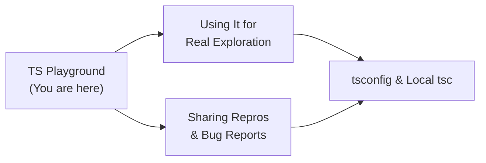
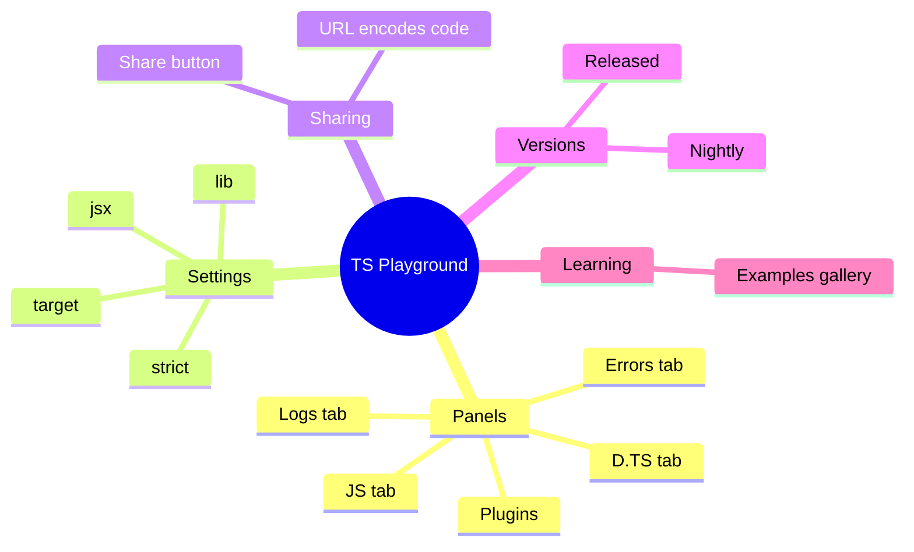
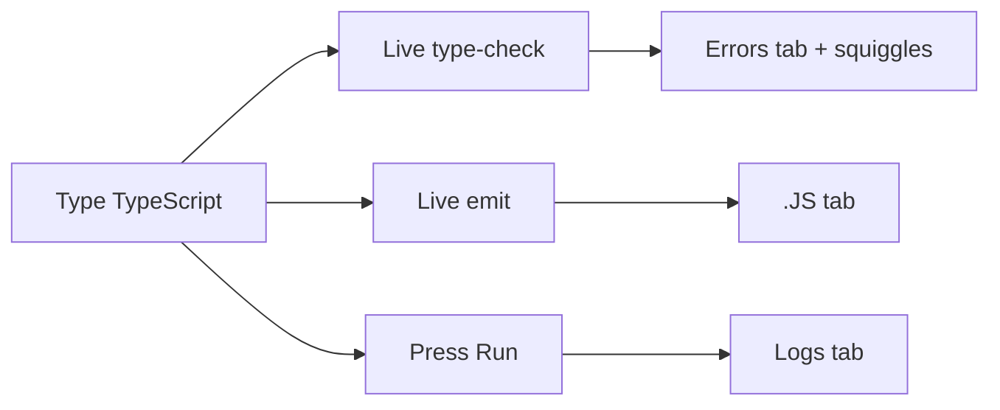

# TS Playground — Junior Level

## Table of Contents

1. [Introduction](#introduction)
2. [Prerequisites](#prerequisites)
3. [Glossary](#glossary)
4. [Core Concepts](#core-concepts)
5. [Real-World Analogies](#real-world-analogies)
6. [Mental Models](#mental-models)
7. [Pros & Cons](#pros--cons)
8. [Use Cases](#use-cases)
9. [Walkthroughs](#walkthroughs)
10. [The Editor Tabs](#the-editor-tabs)
11. [Compiler Options in the UI](#compiler-options-in-the-ui)
12. [Sharing Code via URL](#sharing-code-via-url)
13. [The Example Gallery](#the-example-gallery)
14. [Switching TypeScript Versions](#switching-typescript-versions)
15. [Clean Habits](#clean-habits)
16. [Error Handling](#error-handling)
17. [Performance Tips](#performance-tips)
18. [Best Practices](#best-practices)
19. [Edge Cases & Pitfalls](#edge-cases--pitfalls)
20. [Common Mistakes](#common-mistakes)
21. [Common Misconceptions](#common-misconceptions)
22. [Tricky Points](#tricky-points)
23. [Test](#test)
24. [Tricky Questions](#tricky-questions)
25. [Cheat Sheet](#cheat-sheet)
26. [Self-Assessment Checklist](#self-assessment-checklist)
27. [Summary](#summary)
28. [What You Can Build](#what-you-can-build)
29. [Further Reading](#further-reading)
30. [Related Topics](#related-topics)
31. [Diagrams & Visual Aids](#diagrams--visual-aids)

---

## Introduction

> Focus: "What is it?" and "How to use it?"

The **TypeScript Playground** is the official, free, browser-based code editor for TypeScript, hosted at [typescriptlang.org/play](https://www.typescriptlang.org/play). You open a web page, type TypeScript on the left, and immediately see three things: the JavaScript it compiles into, the type errors the compiler found, and the values your code logs when you run it. No installation, no `npm install`, no `tsconfig.json` — just a URL and a keyboard.

For a beginner, the Playground is the single most useful tool for learning TypeScript. Every time you wonder "what does this type actually do?" or "will the compiler complain about this?", you can answer the question in five seconds instead of setting up a whole project. It is also where the people who write the TypeScript handbook test their examples, where bug reports are reproduced, and where Stack Overflow answers link to live, runnable code.

The Playground runs the **real TypeScript compiler** — the exact same `typescript` package you would install with `npm`. It does not approximate or simulate type-checking; it loads the compiler into your browser and runs it there. That means whatever the Playground tells you about your types is exactly what `tsc` would tell you on your own machine, for the version you have selected.

This page teaches the Junior-level mental model: what the Playground is, what each panel does, how to change compiler settings through the user interface, how to share a snippet as a link, and how to switch TypeScript versions. By the end you will be able to use the Playground confidently to explore the language.

---

## Prerequisites

- **Required:** Basic JavaScript knowledge (variables, functions, objects) — the Playground compiles TypeScript *to* JavaScript, so you need to recognize JS output.
- **Required:** A modern web browser (Chrome, Firefox, Safari, or Edge). The Playground is a client-side web app.
- **Helpful but not required:** A first look at TypeScript syntax (`: string`, `interface`, union types). You will pick this up as you experiment.
- **Helpful but not required:** Knowing what a compiler is — a program that translates source code from one language into another.

---

## Glossary

| Term | Definition |
|------|-----------|
| **TS Playground** | The official browser-based TypeScript editor at typescriptlang.org/play |
| **Compiler (`tsc`)** | The program that checks TypeScript types and emits JavaScript |
| **Transpile / Emit** | Translating TypeScript source into JavaScript output |
| **`.js` tab** | Panel showing the JavaScript the Playground produced from your code |
| **`.d.ts` tab** | Panel showing the generated type declaration file (types only, no logic) |
| **Errors tab** | Panel listing every type error the compiler found, with messages |
| **Logs tab** | Panel showing `console.log` output after you press Run |
| **Compiler option** | A setting like `strict` or `target` that changes how `tsc` behaves |
| **`target`** | The JavaScript version the compiler emits (ES5, ES2015, ESNext, …) |
| **`lib`** | The set of built-in type definitions available (DOM, ES2020, …) |
| **Share URL** | A link that encodes your entire code + settings so others can open it |
| **Nightly** | The bleeding-edge, unreleased development build of TypeScript |

---

## Core Concepts

### Concept 1: A Three-Panel Mental Picture

The Playground screen has two halves. On the **left** is the editor where you write TypeScript. On the **right** is a tabbed panel that shows you the *results* of compiling your code:

- **`.JS`** — the JavaScript your TypeScript became.
- **`.D.TS`** — the type-only declaration file.
- **Errors** — the list of type problems.
- **Logs** — what your code printed when you ran it.
- **Plugins** — extra tools you can enable (AST viewer, etc.).

The flow is always the same: you type on the left, and the right side updates *live* as you type. There is no "compile" button for type-checking — it happens continuously.

### Concept 2: Type-Checking vs Running

These are two separate actions, and beginners often confuse them.

- **Type-checking** happens automatically as you type. The Errors tab and the red squiggles under your code come from this.
- **Running** happens only when you click the **Run** button (or press the run shortcut). This executes the *compiled JavaScript* and sends `console.log` output to the Logs tab.

Crucially, **the Playground will run your code even if it has type errors.** TypeScript errors do not stop the JavaScript from executing, because the types are erased before running. This mirrors real life: by default `tsc` still emits `.js` even when there are type errors.

### Concept 3: The Compiler Settings Live in the URL

When you change a setting (say, you turn on `strict`) or switch the TypeScript version, the Playground encodes that choice into the page's URL. When you share the URL, the recipient sees *exactly* your code, your settings, and your TS version. Nothing is stored on a server — the entire state is packed into the link itself.

### Concept 4: No File System, No npm

The Playground is a single file. You cannot create multiple files, you cannot `import` from `node_modules`, and you cannot install packages like `lodash` or `react` (with a small exception for type-only imports of popular packages, covered later). This is the Playground's main limitation, and recognizing it early saves confusion: it is a *language* sandbox, not a *project* sandbox.

---

## Real-World Analogies

| Concept | Analogy |
|---------|--------|
| **TS Playground** | A scientist's lab bench — a clean, isolated place to run one quick experiment without setting up a whole factory |
| **`.js` tab** | The shadow your TypeScript casts — change the light (the `target`) and the shadow changes shape |
| **Errors tab** | A spell-checker that underlines mistakes as you type, before you even hit "send" |
| **Share URL** | A photograph of your exact whiteboard — anyone who opens it sees the same drawing, settings and all |
| **Switching TS versions** | Trying the same recipe in different ovens to see which one burns the cake |

---

## Mental Models

**The intuition:** Think of the Playground as a *mirror for the compiler's mind*. Whatever you write, it instantly shows you both how the compiler *understands* your code (types, errors) and how the computer will *run* it (the emitted JS, the logs). You get to watch the compiler think in real time.

**Why this model helps:** When something surprises you in a real project — "why does TypeScript think this is `string | undefined`?" — you can paste the snippet into the Playground and watch the type appear when you hover over it. The Playground turns abstract type questions into something you can see and poke at.

---

## Pros & Cons

| Pros | Cons |
|------|------|
| Zero setup — works in any browser instantly | Single file only — no multi-file projects |
| Runs the real, exact TypeScript compiler | Cannot install npm packages (lodash, express, …) |
| Live type-checking and live JS output | No real file system or Node APIs (`fs`, `path`) |
| Shareable as a single URL | Limited for large or realistic apps |
| Can switch TS versions, including nightly | Logs are simplified vs a real terminal |
| Great example gallery for learning | Network/async behavior is constrained |

### When to use:
- Learning syntax, testing a type, reproducing a bug, sharing a minimal snippet, comparing TS versions.

### When NOT to use:
- Building a real application, anything needing npm packages, multiple files, or Node.js APIs. For that, use a local `tsc` setup or StackBlitz/CodeSandbox.

---

## Use Cases

- **Use Case 1:** Learning — type an example from a tutorial and watch the emitted JavaScript to understand what TypeScript adds and removes.
- **Use Case 2:** Quick type questions — "Is `x` inferred as `number` or `number | undefined` here?" Hover to find out.
- **Use Case 3:** Sharing a reproduction — paste a snippet, copy the URL, and send it in a Slack thread or GitHub issue so a colleague sees the exact same errors.

---

## Walkthroughs

### Walkthrough 1: Your First Playground Session

1. Open [typescriptlang.org/play](https://www.typescriptlang.org/play).
2. Clear the default sample and type the snippet below on the left.
3. Watch the `.JS` tab on the right update as you type.
4. Click **Run** and look at the **Logs** tab.

```typescript
// Left panel — TypeScript source
function greet(name: string): string {
  return `Hello, ${name}!`;
}

console.log(greet("Ada"));
```

The `.JS` tab will show the compiled JavaScript (the type annotation `: string` is gone):

```javascript
// .JS tab — compiled output
function greet(name) {
  return `Hello, ${name}!`;
}
console.log(greet("Ada"));
```

The **Logs** tab (after pressing Run) shows:

```
"Hello, Ada!"
```

This single exercise demonstrates the whole loop: write TS, see JS, run, see logs.

### Walkthrough 2: Watching a Type Error Appear

Type this and watch the Errors tab and the red squiggle:

```typescript
function greet(name: string): string {
  return `Hello, ${name}!`;
}

// Passing a number where a string is expected
console.log(greet(42));
```

The **Errors** tab shows:

```
Argument of type 'number' is not assignable to parameter of type 'string'.
```

Now press **Run** anyway. The code *still runs* and logs `"Hello, 42!"` — proving that type errors do not block execution.

### Walkthrough 3: Hovering to Inspect Types

Type this and hover your mouse over `result`:

```typescript
const numbers = [1, 2, 3];
const result = numbers.map((n) => n * 2);
```

When you hover `result`, a tooltip appears: `const result: number[]`. Hovering is the fastest way to ask "what does TypeScript think this is?" — and it works on every variable, parameter, and expression.

---

## The Editor Tabs

The right-hand panel has several tabs. Here is what each one does.

### The `.JS` Tab

Shows the JavaScript that `tsc` emits from your code. This updates live. It is the single best way to understand what TypeScript syntax compiles into — async/await, classes, enums, optional chaining, decorators, and more all have visible JS output. Change the `target` and watch this tab transform.

### The `.D.TS` Tab

Shows the **declaration file** — the types of your code with all implementation stripped out. This is what a library would publish so that *consumers* get type information without seeing the source. For:

```typescript
export function add(a: number, b: number): number {
  return a + b;
}
```

…the `.D.TS` tab shows:

```typescript
export declare function add(a: number, b: number): number;
```

Notice: no function body, just the signature. This teaches you what `.d.ts` files are for.

### The Errors Tab

A clean, scrollable list of every diagnostic the compiler produced, each with the message and the line. Clicking an error jumps your cursor to it. This is identical to what you would see running `tsc` in a terminal.

### The Logs Tab

After you press **Run**, anything passed to `console.log`, `console.warn`, `console.error`, etc. appears here. It is a simplified console — good for small experiments, not a full Node terminal.

### The Plugins Tab

Lets you enable extra panels. The most important for learning are the **AST Viewer** (shows the tree structure of your code) and **type-checking explorers**. You can toggle these on from the Plugins settings.

---

## Compiler Options in the UI

You do not edit a `tsconfig.json` file in the Playground. Instead, you change settings through menus. Open the **TS Config** dropdown (sometimes labeled with a gear or "Config") to find toggles and pickers.

### Changing `target`

The `target` controls which JavaScript version is emitted. Set it to `ES5` and paste:

```typescript
const greet = (name: string) => `Hi ${name}`;
class Animal {
  constructor(public name: string) {}
}
```

With `target: ES5`, the arrow function becomes a regular `function` and the class becomes a function with prototype assignments. Switch to `ESNext` and the output stays modern and clean. This single experiment makes "what does target do?" obvious.

### Changing `strict`

Toggle the `strict` option on and off and watch errors appear or disappear:

```typescript
function length(value: string | null) {
  return value.length; // error only when strictNullChecks is on
}
```

With `strict` (which includes `strictNullChecks`) **on**, you get: `'value' is possibly 'null'.` With it **off**, the error vanishes. This is the fastest way to *feel* what strict mode does.

### Changing `jsx`

If you write JSX/TSX, set the `jsx` option (`preserve`, `react`, `react-jsx`) and the `.JS` tab shows different output — `React.createElement` calls vs the modern `_jsx` runtime vs untouched JSX. The Playground supports `.tsx` mode.

### Changing `lib`

The `lib` setting controls which built-in types exist. Remove `DOM` from `lib` and `document.querySelector` becomes an error, because the browser types are no longer included. Add `ES2021` and `String.prototype.replaceAll` becomes known.

---

## Sharing Code via URL

This is one of the Playground's superpowers.

1. Write your code and set your options.
2. Look at the browser's address bar — the URL already contains your code, encoded after `#code/`.
3. Copy the URL and send it to anyone.

When they open it, they see your exact code, your exact compiler settings, and your exact TypeScript version. There is also a **Share** button that can generate a shortened link and copy it for you.

```
https://www.typescriptlang.org/play?#code/PTAEHU...   <- your code is encoded here
```

Because the state lives in the URL, you can also bookmark experiments, paste them in documentation, and embed them in blog posts. Nothing is uploaded; the link *is* the data.

---

## The Example Gallery

The Playground ships with a built-in **Examples** menu — a curated gallery of dozens of runnable snippets grouped by topic: "TypeScript in 5 minutes", generics, type guards, mapped types, JSX, and more. Each example is a complete, working Playground you can open, run, and edit.

For a beginner this gallery is a free, structured tour of the language. Open the Examples menu, pick "Functions", and step through. Every example already has the right compiler settings applied, so you see correct behavior immediately.

---

## Switching TypeScript Versions

The Playground has a **version dropdown** (usually at the top, showing something like `v5.x`). Click it and you can select:

- Any **released** version of TypeScript back through many older releases.
- The **Nightly** build — the latest unreleased development version, rebuilt every day.

Switching versions re-runs your exact code under a different compiler. This lets you answer "did this behavior change between TypeScript 4.9 and 5.4?" by simply flipping the dropdown. The selected version is also encoded into the share URL, so a link can pin a specific version.

```typescript
// Some features only exist in newer versions.
// Switch versions in the dropdown and watch the error appear or disappear.
const value = "hello" satisfies string; // 'satisfies' requires TS 4.9+
```

On an old enough version, `satisfies` is a syntax error; on 4.9+ it works. The version dropdown turns this into a one-click experiment.

---

## Clean Habits

### Keep Snippets Minimal

```typescript
// Noisy — too much unrelated code to share as a repro
import { a, b, c, d } from "./stuff";
function huge() { /* 100 lines */ }

// Clean — the smallest code that shows the behavior
function add(a: number, b: number) {
  return a + b;
}
add("oops", 2); // <- the one line that matters
```

**Rule:** When sharing, delete everything that is not needed to demonstrate the point.

### Name Things Clearly in Examples

```typescript
// Bad — single letters obscure the lesson
function f(x: any) { return x.y; }

// Clean — names that explain the concept
function readName(user: { name: string }) {
  return user.name;
}
```

**Rule:** Even throwaway Playground code reads better with descriptive names.

---

## Error Handling

### Error 1: "Cannot find module 'lodash'"

```typescript
// Trying to import an npm package
import _ from "lodash";
// Error: Cannot find module 'lodash' or its corresponding type declarations.
```

**Why it happens:** The Playground has no `node_modules` and cannot install packages. Most third-party imports fail.
**How to fix:** Remove the import and inline the small piece you need, or move to StackBlitz/CodeSandbox for package-based work.

```typescript
// Inline the behavior instead of importing a package
function chunk<T>(arr: T[], size: number): T[][] {
  const result: T[][] = [];
  for (let i = 0; i < arr.length; i += size) {
    result.push(arr.slice(i, i + size));
  }
  return result;
}

console.log(chunk([1, 2, 3, 4, 5], 2));
```

### Error 2: "Cannot find name 'document'"

```typescript
const el = document.querySelector("div");
// Error (if DOM lib is missing): Cannot find name 'document'.
```

**Why it happens:** The `lib` setting does not include `DOM`.
**How to fix:** Open the config and add `DOM` to `lib` (or pick a `target` that includes it by default).

### Error 3: My code logs nothing

```typescript
const sum = 2 + 2; // computed but never printed
```

**Why it happens:** You never called `console.log`, or you never pressed **Run**.
**How to fix:** Add `console.log(sum);` and click **Run** — type-checking is automatic, but *running* is manual.

---

## Performance Tips

### Tip 1: Use a Recent TS Version for Speed

```typescript
// The compiler itself gets faster across versions.
// For quick experiments, the default (latest stable) is best.
const x: number = 1;
```

**Why it helps:** Newer compiler builds parse and check faster, so the live feedback in the Playground feels snappier.

### Tip 2: Keep the Snippet Small

```typescript
// A 1000-line paste makes the live checker re-run on every keystroke.
// Trim to the minimum that reproduces what you care about.
type Demo = { id: number };
```

**Why it helps:** The Playground re-type-checks as you type; smaller code means instant feedback instead of lag.

---

## Best Practices

- **Always reach for the Playground first** when you have a small language question — it is faster than spinning up a project.
- **Share URLs, not screenshots** — a link is runnable; a screenshot is not.
- **Pin the version** when reporting a bug so others reproduce it exactly.
- **Use the Examples gallery** to discover features you did not know existed.
- **Watch the `.JS` tab** whenever you learn new syntax — seeing the output cements understanding.

---

## Edge Cases & Pitfalls

### Pitfall 1: Forgetting the Code Still Runs With Errors

```typescript
let total: number = "not a number"; // type error
console.log(total);
```

**What happens:** The Errors tab complains, but if you press Run, it logs `"not a number"`. Types are erased; the JS runs regardless.
**How to fix:** Treat type errors as real problems to resolve, not warnings to ignore — in a real build you would configure `noEmitOnError`.

### Pitfall 2: Expecting `import` from npm to Work

```typescript
import express from "express"; // fails — no node_modules
```

**What happens:** Module-not-found error.
**How to fix:** Recognize the Playground's single-file, no-package limitation and switch tools when you need real dependencies.

---

## Common Mistakes

### Mistake 1: Confusing the `.JS` Tab with the Logs Tab

```typescript
console.log("hi");
```

The `.JS` tab shows `console.log("hi");` (the *code*). The **Logs** tab shows `"hi"` (the *result of running*). Beginners look in the wrong tab and think nothing happened.

### Mistake 2: Editing Settings and Not Knowing They Changed

You toggled `strict` last week, the setting is encoded in your URL, and now an example "mysteriously" behaves differently. Always check the config when behavior surprises you.

---

## Common Misconceptions

### Misconception 1: "The Playground only simulates TypeScript"

**Reality:** It runs the genuine `typescript` compiler package in your browser. Results match `tsc` exactly for the selected version.

**Why people think this:** It is so fast and frictionless that it feels like a toy, but it is the real thing.

### Misconception 2: "I can build a whole app in the Playground"

**Reality:** It is a single file with no packages and no file system. It is for snippets and exploration, not applications.

**Why people think this:** It looks like a full editor (it uses the same Monaco editor as VS Code), so people expect project features.

### Misconception 3: "Type errors stop my code from running here"

**Reality:** By default the Playground runs the emitted JS even with type errors, just like `tsc` without `noEmitOnError`.

**Why people think this:** They assume a "compiler error" must halt everything, but TypeScript erases types and emits JS anyway.

---

## Tricky Points

### Tricky Point 1: The URL Encodes Everything

```typescript
// Two people can open "the same example" and see different results
// if their URLs encode different compiler settings or TS versions.
const value = null;
```

**Why it's tricky:** The same source code behaves differently under different settings, and the settings hide in the URL.
**Key takeaway:** When sharing, the link carries the settings — that is a feature, but verify the settings are the ones you intend.

---

## Test

### Multiple Choice

**1. What does the `.JS` tab show?**

- A) The values your code logged
- B) The JavaScript your TypeScript compiled into
- C) A list of type errors
- D) The AST of your code

<details>
<summary>Answer</summary>
**B)** — The `.JS` tab shows the compiled JavaScript output. The logged values appear in the Logs tab (A), errors in the Errors tab (C), and the AST in the AST viewer plugin (D).
</details>

**2. Where is your Playground code and settings stored when you share a link?**

- A) On Microsoft's servers
- B) In a database
- C) Encoded in the URL itself
- D) In your browser's local storage only

<details>
<summary>Answer</summary>
**C)** — The code and compiler settings are encoded directly into the share URL. Nothing is uploaded to a server.
</details>

### True or False

**3. Type errors prevent the Playground from running your code.**

<details>
<summary>Answer</summary>
**False** — By default the emitted JavaScript runs even when there are type errors, because types are erased before execution.
</details>

**4. The Playground can install npm packages like `lodash`.**

<details>
<summary>Answer</summary>
**False** — The Playground has no `node_modules`. Most third-party imports fail. Use StackBlitz/CodeSandbox for package-based work.
</details>

### What's the Output?

**5. What appears in the Logs tab after you press Run?**

```typescript
const message: string = "Go";
console.log(message + " Playground");
```

<details>
<summary>Answer</summary>
Output: `"Go Playground"`. The type annotation is erased and the concatenation runs normally.
</details>

**6. What does the `.D.TS` tab show for this code?**

```typescript
export function double(n: number): number {
  return n * 2;
}
```

<details>
<summary>Answer</summary>
`export declare function double(n: number): number;` — the signature only, with no function body, since declaration files describe types without implementation.
</details>

---

## "What If?" Scenarios

**What if I switch the TypeScript version after writing my code?**
- **You might think:** My code stays exactly the same.
- **But actually:** The code text stays, but it is re-checked by a different compiler. Newer syntax may break on old versions, and some errors may appear or disappear because type-checking rules evolve between releases.

---

## Tricky Questions

**1. You enabled `strict` and an error appeared on `value.length`. What single sub-option caused it?**

- A) `noImplicitAny`
- B) `strictNullChecks`
- C) `strictFunctionTypes`
- D) `alwaysStrict`

<details>
<summary>Answer</summary>
**B)** — `strictNullChecks` (enabled by `strict`) makes `null`/`undefined` non-assignable, so `value: string | null` triggers "possibly null" when you access `.length`.
</details>

**2. What is the difference between the Errors tab and pressing Run?**

- A) They are the same
- B) The Errors tab type-checks (automatic); Run executes the JS (manual)
- C) Run type-checks; the Errors tab executes
- D) Neither type-checks

<details>
<summary>Answer</summary>
**B)** — Type-checking (Errors tab) happens automatically as you type; Run executes the compiled JavaScript and shows logs.
</details>

**3. Why might two people see different `.JS` output for identical source code?**

- A) Their browsers differ
- B) Their `target`/compiler settings encoded in the URL differ
- C) The Playground is random
- D) It is impossible

<details>
<summary>Answer</summary>
**B)** — The `target` and other options change the emitted JavaScript, and those settings travel in the URL.
</details>

---

## Cheat Sheet

| What | Where / How |
|------|-------------|
| Open the Playground | typescriptlang.org/play |
| See compiled JS | `.JS` tab |
| See declaration file | `.D.TS` tab |
| See type errors | Errors tab |
| See `console.log` output | Logs tab (press **Run** first) |
| Change JS output version | `target` in the config menu |
| Turn on strict checks | `strict` toggle in the config menu |
| Add browser types | add `DOM` to `lib` |
| Share your code | copy the URL or use the Share button |
| Switch TS version | version dropdown (top) |
| Try unreleased TS | choose **Nightly** in the version dropdown |
| Browse learning samples | Examples menu |

---

## Self-Assessment Checklist

### I can explain:
- [ ] What the TS Playground is and where to find it
- [ ] The difference between type-checking and running
- [ ] What each right-hand tab (`.JS`, `.D.TS`, Errors, Logs) shows
- [ ] How sharing via URL works

### I can do:
- [ ] Write a snippet and read its compiled `.JS` output
- [ ] Toggle `strict` and `target` and observe the effect
- [ ] Copy a share URL and pin a TS version
- [ ] Open and run an example from the gallery

### I can answer:
- [ ] All multiple choice questions in this document

---

## Summary

- The TS Playground is the official, free, browser-based TypeScript editor at typescriptlang.org/play.
- It runs the real TypeScript compiler in your browser, so results match `tsc` exactly.
- The right panel shows `.JS` (compiled output), `.D.TS` (declarations), Errors, and Logs.
- Type-checking is automatic; running (and logging) requires pressing **Run**.
- Compiler options (`target`, `strict`, `jsx`, `lib`) are changed through the UI, not a config file.
- Your code and settings are encoded in the URL, making sharing trivial.
- You can switch TS versions, including the nightly build, and browse the Examples gallery.
- Limitations: single file, no npm packages, no file system.

**Next step:** Learn to use the Playground for real exploration and sharing reproductions (Middle level).

---

## What You Can Build

### Projects you can create:
- **A shareable type demo:** Build a tiny example that proves a TypeScript behavior and send the URL to a study group.
- **A "before/after" target comparison:** One Playground showing modern code, screenshots of `.JS` at `ES5` vs `ESNext`.
- **A personal example library:** A bookmarks folder of Playground links, one per concept you have learned.

### Learning path — what to study next:



---

## Further Reading

- **Official Playground:** [typescriptlang.org/play](https://www.typescriptlang.org/play)
- **TypeScript Handbook:** [typescriptlang.org/docs/handbook/intro.html](https://www.typescriptlang.org/docs/handbook/intro.html)
- **Examples gallery:** open the **Examples** menu inside the Playground
- **TypeScript blog:** [devblogs.microsoft.com/typescript](https://devblogs.microsoft.com/typescript/) — release notes that you can test live in the Playground

---

## Related Topics

- **Setting Up TypeScript** — installing `tsc` locally for real projects after you outgrow the Playground.
- **tsconfig.json** — the configuration file whose options the Playground exposes through its UI.
- **Basic Types** — the language features you will most often test inside the Playground.

---

## Diagrams & Visual Aids

### Mind Map



### The Edit → Compile → Run Loop



### Where Things Live

```
+----------------------------------------------+
|              TS Playground                   |
|----------------------------------------------|
| Left editor   | Right tabs                   |
|   your code   |   .JS  .D.TS  Errors  Logs   |
|----------------------------------------------|
| Config menu   | target, strict, jsx, lib     |
| Version drop  | released + Nightly           |
| URL           | encodes code + all settings  |
+----------------------------------------------+
```
