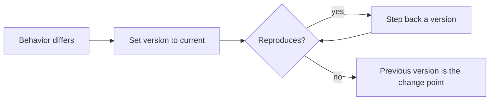
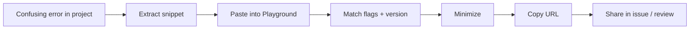

# TS Playground — Middle Level

## Table of Contents

1. [Introduction](#introduction)
2. [Prerequisites](#prerequisites)
3. [Using the Playground for Real Exploration](#using-the-playground-for-real-exploration)
4. [Inspecting Inferred Types Precisely](#inspecting-inferred-types-precisely)
5. [Driving Compiler Options Through the UI](#driving-compiler-options-through-the-ui)
6. [The `.D.TS` Tab as a Design Tool](#the-dts-tab-as-a-design-tool)
7. [Reading the Emitted JS to Understand Features](#reading-the-emitted-js-to-understand-features)
8. [Sharing Reproductions](#sharing-reproductions)
9. [Type-Level Experiments](#type-level-experiments)
10. [Working Around the No-npm Limitation](#working-around-the-no-npm-limitation)
11. [Plugins and the AST Viewer](#plugins-and-the-ast-viewer)
12. [Switching Versions to Verify Behavior](#switching-versions-to-verify-behavior)
13. [Twoslash Annotations](#twoslash-annotations)
14. [Patterns](#patterns)
15. [Error Handling](#error-handling)
16. [Performance Tips](#performance-tips)
17. [Best Practices](#best-practices)
18. [Edge Cases & Pitfalls](#edge-cases--pitfalls)
19. [Common Mistakes](#common-mistakes)
20. [Tricky Points](#tricky-points)
21. [Test](#test)
22. [Tricky Questions](#tricky-questions)
23. [Cheat Sheet](#cheat-sheet)
24. [Middle Checklist](#middle-checklist)
25. [Summary](#summary)
26. [Further Reading](#further-reading)
27. [Diagrams & Visual Aids](#diagrams--visual-aids)

---

## Introduction

> Focus: "Why?" and "When?"

At the Junior level you learned what the Playground is and how its panels work. At the Middle level the question changes from "what is this button?" to "how do I use this tool to answer real questions and unblock real work?" The Playground stops being a learning toy and becomes a daily instrument: you use it to confirm an inference, to isolate a confusing error away from a noisy codebase, to compare two TypeScript versions, and — most valuably — to produce *minimal reproductions* that you can paste into a code review, a GitHub issue, or a teammate's DM.

A working TypeScript developer reaches for the Playground a dozen times a day. The skill is not knowing the tabs; it is knowing *how to ask a question with code*. This page is about that skill: shrinking a problem to its essence, reading the compiler's answer precisely, and sharing the result so others can verify it in one click.

---

## Prerequisites

- Comfortable with interfaces, type aliases, union types, and basic generics.
- Has used the Playground's basic panels (`.JS`, `.D.TS`, Errors, Logs).
- Understands `strict` mode at a high level and what `tsconfig.json` does.
- Builds real projects (React, Node, or similar) and occasionally hits confusing type errors.

---

## Using the Playground for Real Exploration

The core workflow is **extract → reproduce → minimize → share**.

1. **Extract:** Copy the confusing code out of your project.
2. **Reproduce:** Paste it into the Playground and confirm the same error/behavior appears.
3. **Minimize:** Delete everything that does not change the result, until you have the smallest snippet that still shows it.
4. **Share:** Copy the URL.

Minimization is the part people skip and the part that matters most. A good reproduction is so small that the cause is almost self-evident.

```typescript
// A confusing error in your app might involve 8 files.
// In the Playground, reduce it to this:
type Result<T> = { ok: true; value: T } | { ok: false; error: string };

function unwrap<T>(r: Result<T>): T {
  return r.value; // Error: Property 'value' does not exist on type ... ok:false branch
}
```

Now the bug is obvious: you accessed `.value` without narrowing on `r.ok`. In the original codebase this was buried; in the Playground it is one screen.

---

## Inspecting Inferred Types Precisely

Hovering shows a type, but for complex types the tooltip truncates. Three techniques give you exact answers.

### Technique 1: Assign to a Typed Constant

```typescript
const data = { id: 1, tags: ["a", "b"], nested: { ok: true } };
// Hover `data` — but the tooltip may abbreviate. Force the full type:
type Data = typeof data;
//   ^? hover Data for the complete inferred shape
```

### Technique 2: Provoke an Error to Read the Type

```typescript
const inferred = [1, 2, 3].reduce((acc, n) => ({ ...acc, [n]: n }), {});

// Force the compiler to print the type by assigning to `never`:
const _check: never = inferred; // error message shows the exact inferred type
```

The error message `Type '{...}' is not assignable to type 'never'` *prints the full type*, which is often clearer than the tooltip.

### Technique 3: Use the Twoslash `^?` Query

In Twoslash-enabled contexts (and the Playground's twoslash mode), a `// ^?` comment under an identifier renders its type inline. More on Twoslash below.

```typescript
const total = 2 + 2;
//    ^?  -> const total: number
```

---

## Driving Compiler Options Through the UI

The Playground's config menu mirrors `tsconfig.json`. Mastering it means you can reproduce *your project's* exact compiler behavior.

### Match Your Project's Strictness

If your project runs `strict: true` plus `noUncheckedIndexedAccess`, set the same toggles before reproducing. Otherwise the Playground may *not* show the error you see locally — or may show extra ones.

```typescript
// With noUncheckedIndexedAccess ON, arr[i] is T | undefined
const arr = [1, 2, 3];
const first = arr[0]; // number | undefined  (only with the flag on)
first.toFixed(2);     // Error: 'first' is possibly 'undefined'
```

### Match the Module Settings

```typescript
// `module` and `moduleResolution` affect import emit and resolution.
// Set them to match your project (e.g. ESNext / bundler) when reproducing
// import-related issues.
export const x = 1;
```

### Match the `target` and `lib`

A method like `Array.prototype.at` exists only when `lib` is recent enough:

```typescript
const last = [1, 2, 3].at(-1); // requires lib ES2022 (or DOM equivalents)
```

If your project targets an older `lib`, set the same in the Playground or you will "fix" a bug that does not exist in your real environment.

---

## The `.D.TS` Tab as a Design Tool

Library authors use the `.D.TS` tab to *design and verify their public API surface* before publishing. Whatever you export, the `.D.TS` tab shows exactly what consumers will see.

```typescript
export interface User {
  id: string;
  name: string;
}

export function createUser(name: string): User {
  return { id: crypto.randomUUID(), name };
}

// Internal helper — should NOT leak to consumers
function internalLog(msg: string) {
  console.log(msg);
}
```

The `.D.TS` tab shows `User` and `createUser` but **not** `internalLog` (it is not exported). If a private implementation type accidentally appears in the `.D.TS`, you have leaked an internal detail — the Playground catches this instantly. This is the fastest way to audit "what does my package actually expose?"

---

## Reading the Emitted JS to Understand Features

When a TypeScript feature confuses you, read its emitted JS. The Playground makes "what does this actually do at runtime?" a one-glance answer.

### Enums

```typescript
enum Direction {
  Up,
  Down,
}
```

The `.JS` tab reveals enums are real runtime objects with reverse mappings — explaining why they have a runtime cost that `const enum` and union types avoid.

### Decorators

```typescript
function log(target: any, key: string) {}
class Service {
  @log method() {}
}
```

The emitted JS shows the decorator helper calls, demystifying how decorators actually wire up.

### `async`/`await` at Old Targets

```typescript
async function load() {
  const x = await Promise.resolve(1);
  return x;
}
```

At `target: ES5`, the `.JS` tab shows a generator-based state machine (`__awaiter`/`__generator`), explaining why downleveling async adds helper code.

---

## Sharing Reproductions

A great repro is a gift: it lets the recipient verify your claim without rebuilding your project. Checklist for a shareable repro:

- **Minimal:** smallest code that shows the behavior.
- **Self-contained:** no external imports; inline any helpers.
- **Correct settings:** the compiler options that trigger the behavior are set (and therefore encoded in the URL).
- **Pinned version:** if the behavior is version-specific, select the exact TS version.
- **A comment marking the line that matters.**

```typescript
// REPRO: narrowing is lost after an await (TS issue style)
async function demo(x: string | null) {
  if (x === null) return;
  await Promise.resolve();
  x.toUpperCase(); // <- is x still 'string' here? Share to ask.
}
```

Copy the URL, drop it in the issue, and say: "Open this — line 5 is where I expect narrowing to hold." That is a textbook bug report.

---

## Type-Level Experiments

The Playground is the ideal place to develop and debug type-level code, where errors are otherwise cryptic.

```typescript
type DeepReadonly<T> = {
  readonly [K in keyof T]: T[K] extends object ? DeepReadonly<T[K]> : T[K];
};

type Config = {
  server: { port: number; host: string };
  flags: { debug: boolean };
};

type FrozenConfig = DeepReadonly<Config>;
//   ^? hover to confirm every level is readonly
```

Build the type incrementally, hovering after each step. When a conditional type returns `never` unexpectedly, isolate it:

```typescript
type ElementType<T> = T extends (infer E)[] ? E : never;

type A = ElementType<string[]>; // string
type B = ElementType<number>;   // never  <- expected? hover to confirm
```

The Playground turns "why is my generic returning `never`?" into a clear, hover-driven investigation.

---

## Working Around the No-npm Limitation

You cannot install packages, but two things still work:

### Type-Only Imports of Bundled Definitions

The Playground bundles the type definitions for a curated set of popular packages (such as React) so that *type-checking* works even though the runtime code is absent. You can write:

```typescript
import { useState } from "react";

const [count, setCount] = useState(0);
//     ^? const count: number
```

Type-checking succeeds because the React `.d.ts` is available; you just cannot actually *run* React rendering. This is enough for exploring type behavior.

### Inline the Behavior

For runtime experiments, reimplement the tiny slice you need:

```typescript
// Instead of importing lodash's groupBy, inline it:
function groupBy<T, K extends string | number>(
  items: T[],
  key: (item: T) => K,
): Record<K, T[]> {
  return items.reduce((acc, item) => {
    const k = key(item);
    (acc[k] ??= []).push(item);
    return acc;
  }, {} as Record<K, T[]>);
}

console.log(groupBy([1, 2, 3, 4], (n) => (n % 2 === 0 ? "even" : "odd")));
```

---

## Plugins and the AST Viewer

Open the Plugins settings and enable the **AST Viewer**. It renders the abstract syntax tree of your code — the structured tree that the parser produces before type-checking. Click any node in your source to highlight the matching AST node.

```typescript
const sum = 1 + 2;
```

The AST viewer shows a `VariableStatement` → `VariableDeclaration` → `BinaryExpression` (with `+`) → two `NumericLiteral` nodes. This is invaluable when writing ESLint rules, codemods, or anything that manipulates TypeScript programmatically, because those tools operate on exactly this tree.

Other useful plugins include type-checking explorers that let you inspect the type of any node and a "show emitted output" panel for fine-grained emit inspection.

---

## Switching Versions to Verify Behavior

A daily Middle-level use: "Is this a bug in my code or did TypeScript change?" Flip the version dropdown.

```typescript
// Example: behavior or new syntax that changed across versions
const config = {
  mode: "dark",
} as const satisfies { mode: string };
```

Select TS 4.8 → syntax error (`satisfies` not yet available). Select 4.9+ → it works. By bisecting versions in the dropdown you can pinpoint exactly which release introduced or changed a behavior, then cite it in your PR description.

The selected version is encoded in the URL, so when you share, the recipient sees the same compiler — eliminating "works for me" confusion caused by version drift.

---

## Twoslash Annotations

**Twoslash** is a markup format (powered by the TypeScript compiler) that turns special comments into rich, rendered output. The Playground and the TypeScript docs use it heavily. The two most useful directives:

### `// ^?` — Show a Type Inline

```typescript
const greeting = "hello".toUpperCase();
//    ^? const greeting: string
```

The `^?` points (via the caret position) at the identifier above it and renders that identifier's type. Documentation authors use this to show inferred types without screenshots.

### `// @errors:` and Expected Errors

Twoslash can assert that specific error codes occur, which keeps documentation examples honest — if TypeScript changes and the error no longer fires, the doc build fails.

```typescript
// @errors: 2322
const x: number = "string"; // intentionally wrong, asserted to error
```

Twoslash also supports `// @filename`, multi-file virtual setups, compiler flag comments (`// @strict: false`), and completion queries — far more than plain Playground sharing offers. When you write TypeScript documentation, Twoslash is how you make examples that are both runnable-correct and beautifully rendered.

---

## Patterns

### Pattern 1: The Minimal Repro

**Intent:** Communicate a bug or question with the least possible code.
**When to use:** Bug reports, code reviews, Stack Overflow, asking for help.

```typescript
// Strip to the essence; mark the line of interest with a comment.
function pick<T, K extends keyof T>(obj: T, keys: K[]): Pick<T, K> {
  const out = {} as Pick<T, K>;
  for (const k of keys) out[k] = obj[k];
  return out; // <- does this type-check under strict? Share to find out.
}
```

### Pattern 2: The Version Bisection

**Intent:** Find which TS release changed a behavior.
**When to use:** "This used to work" investigations.



---

## Error Handling

### Error 1: "Cannot find module 'react' or its corresponding type declarations"

```typescript
import { useState } from "react";
```

**Why it happens:** The bundled types for that package were not loaded (older Playground sessions or a package that is not pre-bundled).
**How to fix:** Confirm the package is one the Playground supports type-only; otherwise inline the types you need or switch to StackBlitz.

### Error 2: My Repro Doesn't Reproduce the Error

```typescript
const arr = [1, 2, 3];
arr[10].toFixed(); // no error here unless noUncheckedIndexedAccess is on
```

**Why it happens:** Your Playground config does not match your project's `tsconfig.json`.
**How to fix:** Set the same strictness flags (`strict`, `noUncheckedIndexedAccess`, `exactOptionalPropertyTypes`, etc.) before reproducing.

### Error 3: My Repro Reproduces a *Different* Error

**Why it happens:** Different TS version than your project.
**How to fix:** Select your project's exact version in the dropdown.

---

## Performance Tips

### Tip 1: Trim Before Sharing

```typescript
// A small repro re-checks instantly and is far more useful to a reader.
type Tiny = { a: number };
```

**Why it helps:** Reviewers reproduce faster and the cause is clearer.

### Tip 2: Disable Unneeded Strict Flags While Iterating

```typescript
// If you are exploring ONE behavior, turn off unrelated strict flags
// so their errors don't clutter the Errors tab.
let x: any;
```

**Why it helps:** Fewer distracting diagnostics while you focus on the one you care about.

---

## Best Practices

- **Always reproduce in the Playground before filing a bug** — a live link is worth a thousand words.
- **Match compiler settings to the environment you are debugging** — otherwise the repro is misleading.
- **Pin the TS version** for any version-sensitive claim.
- **Use the `.D.TS` tab to audit your public API** before publishing a library.
- **Read the `.JS` tab** whenever runtime behavior surprises you.
- **Prefer Twoslash `^?`** over screenshots when documenting inferred types.

---

## Edge Cases & Pitfalls

### Pitfall 1: Bundled Types Drift from Reality

```typescript
import { useState } from "react";
```

**What happens:** The Playground's bundled `@types/react` version may differ from your project's, so type behavior can subtly diverge.
**How to fix:** For precise library-type debugging, reproduce locally with your exact installed `@types` versions.

### Pitfall 2: Forgetting Errors Are Encoded in Settings, Not Just Code

**What happens:** You share a link, the recipient sees no error, and you both waste time. The settings differed.
**How to fix:** Confirm the relevant flags are set; they ride along in the URL, so once set, sharing is reliable.

---

## Common Mistakes

### Mistake 1: Reproducing Under Default (Loose) Settings

The Playground's default config may be less strict than your project. A bug that only appears under `strictNullChecks` will vanish if you forget to enable it.

### Mistake 2: Over-Minimizing Until the Bug Disappears

```typescript
// Removing too much can accidentally remove the cause.
// Minimize in small steps, re-checking that the behavior persists each time.
type Keep = unknown;
```

If the error vanishes during minimization, you just learned what triggers it — add that piece back.

---

## Tricky Points

### Tricky Point 1: A Repro Is a Hypothesis

```typescript
function identity<T>(x: T): T {
  return x;
}
const r = identity(42); // is r `number` or `42`? share to confirm
```

**Why it's tricky:** When you minimize, you are implicitly claiming "this is the part that matters." If the behavior changes, your hypothesis was wrong — which is itself useful information.
**Key takeaway:** Treat minimization as an experiment, not just cleanup.

---

## Test

### Multiple Choice

**1. What is the most important property of a good Playground reproduction?**

- A) It uses many files
- B) It is minimal and self-contained
- C) It imports lots of packages
- D) It is at least 100 lines

<details>
<summary>Answer</summary>
**B)** — A great repro is minimal and self-contained so others can verify it in one click without rebuilding a project.
</details>

**2. Why might a real bug fail to reproduce in the Playground?**

- A) The Playground is buggy
- B) The compiler settings don't match your project
- C) Browsers vary
- D) It always reproduces

<details>
<summary>Answer</summary>
**B)** — Mismatched strictness flags or TS version cause the behavior to differ. Match them before reproducing.
</details>

### True or False

**3. The `.D.TS` tab shows your private (non-exported) functions.**

<details>
<summary>Answer</summary>
**False** — Only exported members appear in the declaration output; private/internal ones are excluded.
</details>

**4. Twoslash `// ^?` renders the type of the identifier above the caret.**

<details>
<summary>Answer</summary>
**True** — The `^?` query points at the identifier and shows its inferred type inline.
</details>

### What's the Output?

**5. Under `target: ES5`, what kind of construct appears in the `.JS` tab for an `async` function?**

<details>
<summary>Answer</summary>
A generator-based state machine using helpers like `__awaiter` and `__generator`, because native async/await is downleveled for ES5.
</details>

**6. With `noUncheckedIndexedAccess` on, what is the type of `arr[0]` where `arr: number[]`?**

<details>
<summary>Answer</summary>
`number | undefined` — the flag adds `undefined` to indexed access results.
</details>

---

## Tricky Questions

**1. You share a repro and it shows a different error for your colleague. What is the most likely cause?**

- A) Their internet is slow
- B) Different TS version or compiler settings
- C) The Playground randomizes output
- D) Their browser language

<details>
<summary>Answer</summary>
**B)** — Version or settings differences change diagnostics. Pin the version and confirm settings.
</details>

**2. Why use the "assign to `never`" trick when inspecting a complex inferred type?**

- A) It fixes the type
- B) The resulting error message prints the full, untruncated type
- C) It runs faster
- D) It hides the type

<details>
<summary>Answer</summary>
**B)** — Assigning to `never` forces an error whose message contains the complete inferred type, often clearer than a truncated hover.
</details>

**3. What can Twoslash assert that plain sharing cannot?**

- A) Nothing
- B) That specific error codes occur, keeping docs honest
- C) Browser compatibility
- D) Runtime performance

<details>
<summary>Answer</summary>
**B)** — Twoslash can assert expected errors (`// @errors:`), so documentation examples fail the build if TypeScript's behavior changes.
</details>

---

## Cheat Sheet

| Goal | Technique |
|------|-----------|
| See full inferred type | assign to `never` or use Twoslash `^?` |
| Reproduce a project bug | match `strict`/flags + TS version, then minimize |
| Audit public API | read the `.D.TS` tab |
| Understand a feature's runtime | read the `.JS` tab (try old `target`) |
| Explore type-level code | build incrementally, hover each step |
| Find when behavior changed | bisect with the version dropdown |
| Type-check React snippets | use bundled type-only imports |
| Document inferred types | Twoslash `// ^?` |
| Share a question | minimal repro + comment + URL |

---

## Middle Checklist

- [ ] I reproduce confusing errors in the Playground before asking for help.
- [ ] I match compiler flags and TS version to the environment I'm debugging.
- [ ] I minimize repros to the smallest code that shows the behavior.
- [ ] I use the `.D.TS` tab to check what my library exposes.
- [ ] I read the `.JS` tab to understand runtime cost of features.
- [ ] I use Twoslash `^?` and `@errors` when writing documentation.

---

## Summary

- The Middle-level skill is *extract → reproduce → minimize → share*.
- Match compiler settings and TS version, or your repro misleads.
- Inspect exact types via hover, the assign-to-`never` trick, or Twoslash `^?`.
- The `.D.TS` tab audits your public API; the `.JS` tab reveals runtime behavior.
- The AST viewer and other plugins support tooling work.
- The version dropdown lets you bisect behavior changes across releases.
- Twoslash adds rendered types and asserted errors for honest documentation.

**Next step:** Use the Playground for teaching, onboarding, and rigorous cross-version evaluation (Senior level).

---

## Further Reading

- **Playground:** [typescriptlang.org/play](https://www.typescriptlang.org/play)
- **Twoslash docs:** [shikijs.github.io/twoslash](https://shikijs.github.io/twoslash/) and the TypeScript website's twoslash usage
- **Handbook:** [typescriptlang.org/docs/handbook](https://www.typescriptlang.org/docs/handbook/intro.html)
- **TS release notes:** [typescriptlang.org/docs/handbook/release-notes](https://www.typescriptlang.org/docs/handbook/release-notes/overview.html)

---

## Diagrams & Visual Aids

### The Reproduction Workflow



### Tools for Inspecting Types

```
+-------------------------------------------------+
|        How do I see the exact type?             |
|-------------------------------------------------|
| Hover                | quick, may truncate      |
| Assign to never      | full type in error msg   |
| Twoslash ^?          | inline, doc-friendly     |
| .D.TS tab            | public surface only      |
+-------------------------------------------------+
```
