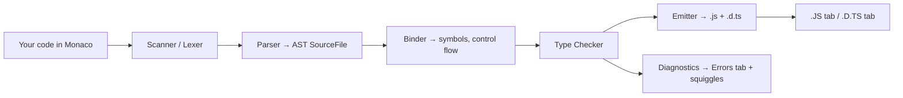
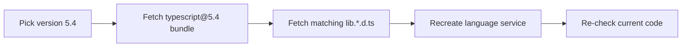
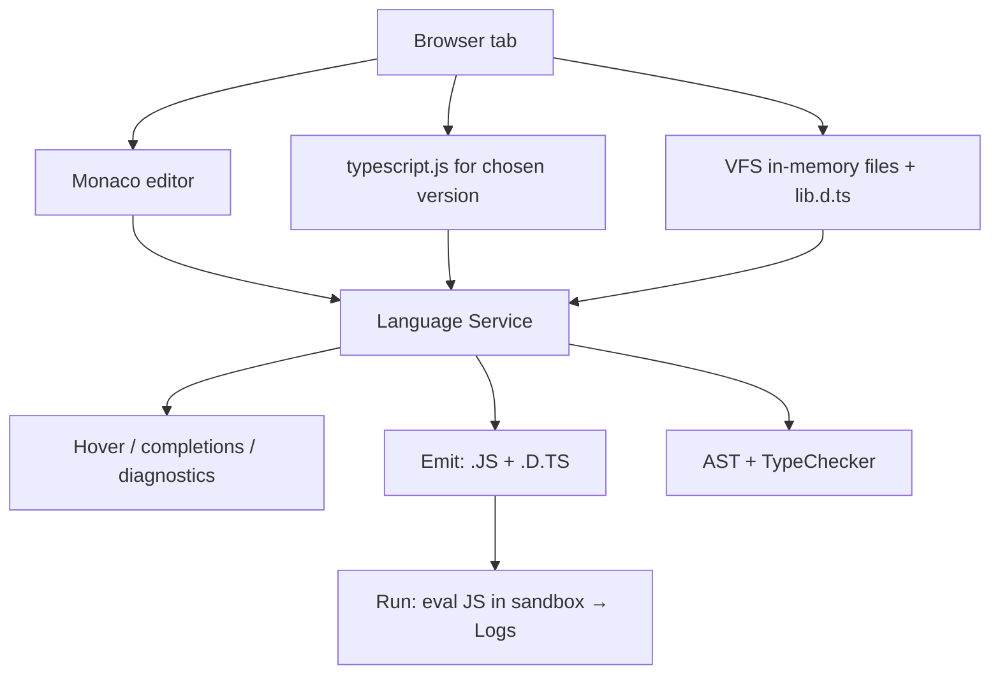

# TS Playground — Under the Hood

## Table of Contents

1. [Overview](#overview)
2. [How the Playground Loads the Compiler](#how-the-playground-loads-the-compiler)
3. [The TypeScript Sandbox Component](#the-typescript-sandbox-component)
4. [In-Browser Compilation Pipeline](#in-browser-compilation-pipeline)
5. [The Virtual File System](#the-virtual-file-system)
6. [The Language Service vs the Batch Compiler](#the-language-service-vs-the-batch-compiler)
7. [How Type Information Reaches the UI](#how-type-information-reaches-the-ui)
8. [The AST and Type APIs](#the-ast-and-type-apis)
9. [Twoslash Internals](#twoslash-internals)
10. [Version Switching Mechanics](#version-switching-mechanics)
11. [Auto-Type Acquisition](#auto-type-acquisition)
12. [URL Encoding and State](#url-encoding-and-state)
13. [Running the Emitted Code](#running-the-emitted-code)
14. [Performance Internals](#performance-internals)
15. [Practical Implications](#practical-implications)
16. [Worked Walkthrough](#worked-walkthrough)
17. [Error Handling](#error-handling)
18. [Best Practices](#best-practices)
19. [Edge Cases & Pitfalls](#edge-cases--pitfalls)
20. [Test](#test)
21. [Tricky Questions](#tricky-questions)
22. [Cheat Sheet](#cheat-sheet)
23. [Summary](#summary)
24. [Further Reading](#further-reading)
25. [Diagrams & Visual Aids](#diagrams--visual-aids)

---

## Overview

This section examines how the TypeScript Playground actually works. The headline fact is the one that surprises most people: **the Playground runs the genuine TypeScript compiler inside your browser tab.** There is no server doing the type-checking. When you select version 5.4, the browser downloads the `typescript` package built for 5.4 and runs it locally on your machine, in JavaScript, against your code.

Understanding the internals explains a lot of behavior: why the first load (and a version switch) involves a download; why the editor experience is identical to VS Code (they share components); why there is a virtual file system but no real one; how hover tooltips, quick-info, completions, and red squiggles all come from the same compiler API the editor uses on disk; and how Twoslash extracts rich type data programmatically. It also clarifies the hard limits — no Node APIs, no real `node_modules` — as direct consequences of "everything runs in the browser sandbox."

---

## How the Playground Loads the Compiler

TypeScript is itself written in TypeScript and compiled to a single large JavaScript bundle (`typescript.js`). That bundle is a normal JavaScript library — it has no dependency on Node.js for its *type-checking* core. The Playground takes advantage of this:

1. The page boots a Monaco editor (the same editor engine VS Code uses).
2. It loads `typescript.js` for the selected version from a CDN, via an AMD-style loader.
3. Monaco's TypeScript language features are wired to that loaded compiler.

Because `typescript.js` is just JavaScript implementing a compiler, it happily runs in a browser. The parts of TypeScript that *do* need Node (reading files from disk, watching directories) are replaced by browser-friendly shims — chiefly an in-memory virtual file system.

```typescript
// Conceptually, the Playground does something like:
// 1. load the compiler module for the chosen version
// 2. create an in-memory file system
// 3. create a language service backed by that fs + compiler
// 4. feed editor changes into the service, render its results
declare const ts: typeof import("typescript"); // the loaded compiler API
```

---

## The TypeScript Sandbox Component

The Playground is not a monolith. Its reusable core is **`@typescript/sandbox`**, a published library that wraps "a Monaco editor connected to an in-browser TypeScript compiler." The Playground is essentially the Sandbox plus a UI (tabs, menus, examples, sharing).

The Sandbox exposes an API surface, including:
- The Monaco `editor` instance (so you can read/write code).
- The loaded `ts` compiler object (the full compiler API).
- A `languageServiceWorker` / language service to query types, completions, and diagnostics.
- Methods to get the emitted JS, the `.d.ts`, and the AST.
- Compiler-option and version controls.

Because the Sandbox is a library, third parties embed it in their own sites, and the official Playground, the docs' interactive examples, and bug-report tooling all build on the same foundation.

```typescript
// Sketch of the embedding surface (illustrative):
interface Sandbox {
  editor: unknown;                 // Monaco editor
  ts: typeof import("typescript"); // the compiler API
  getEmitResult(): Promise<{ outputFiles: { name: string; text: string }[] }>;
  getAST(): import("typescript").SourceFile;
  setText(value: string): void;
  // ...compiler options, version switching, etc.
}
```

---

## In-Browser Compilation Pipeline

Once the compiler is loaded, your code goes through the *same pipeline* it would under `tsc`, just executed in the browser:



1. **Scanner** turns characters into tokens.
2. **Parser** builds the AST (`SourceFile` and `Node` hierarchy) — what the AST viewer renders.
3. **Binder** creates the symbol table and the control-flow graph used for narrowing.
4. **Type Checker** resolves types, infers generics, validates assignments, and produces diagnostics — the source of every error message and every hover type.
5. **Emitter** strips types and produces JavaScript (the `.JS` tab) plus declaration files (the `.D.TS` tab).

The crucial point: nothing here is approximated for the browser. The Playground uses the real `ts.createProgram` / language-service machinery, so the diagnostics and emit are byte-for-byte what `tsc` of that version produces.

---

## The Virtual File System

`tsc` normally asks the operating system for files. In the browser there is no OS file system, so the Playground supplies a **virtual file system (VFS)** — an in-memory map of filename → contents. This is provided by `@typescript/vfs`.

The VFS contains:
- Your single editor file (e.g. `index.ts`).
- The **lib files** — `lib.es2022.d.ts`, `lib.dom.d.ts`, etc. — which define built-in types (`Array`, `Promise`, `document`). These are fetched and stored in memory so the checker can resolve global types.
- Any bundled `@types` (like React) the Playground loads for type-only imports.

```typescript
// Conceptual VFS
const fsMap = new Map<string, string>([
  ["/index.ts", "const x: number = 1;"],
  ["/lib.es2022.d.ts", "/* built-in type defs */"],
  ["/lib.dom.d.ts", "/* DOM type defs */"],
]);
// A System object backed by this Map replaces Node's fs for the compiler.
```

This is exactly why there is no real file system and no `node_modules`: the only files that exist are the ones placed into this in-memory map. `import "fs"` cannot work because there is no Node `fs` and no file on disk to resolve.

---

## The Language Service vs the Batch Compiler

TypeScript ships two front doors to the same checker:

- **The batch compiler** (`ts.createProgram`) — what `tsc` uses for a one-shot build.
- **The language service** (`ts.createLanguageService`) — an *incremental, editor-oriented* API that powers IDE features: completions, quick-info (hover), signature help, rename, go-to-definition, and live diagnostics.

The Playground uses the **language service** for the interactive experience (the same one VS Code uses), which is why hover, autocomplete, and squiggles feel exactly like your editor. It uses the **emit** path to populate the `.JS` and `.D.TS` tabs.

```typescript
// The hover tooltip you see is essentially:
//   languageService.getQuickInfoAtPosition(fileName, position)
// The squiggles are:
//   languageService.getSemanticDiagnostics(fileName)
//   + getSyntacticDiagnostics(fileName)
// The .JS tab is:
//   languageService.getEmitOutput(fileName).outputFiles
declare const languageService: import("typescript").LanguageService;
```

The language service maintains incremental state, so as you type it re-checks efficiently rather than rebuilding everything — this is what makes the live feedback fast.

---

## How Type Information Reaches the UI

Every type-related thing you see is a query against the compiler:

| UI element | Compiler API (conceptually) |
|------------|-----------------------------|
| Hover tooltip | `getQuickInfoAtPosition` |
| Red squiggles | `getSemanticDiagnostics` + `getSyntacticDiagnostics` |
| Errors tab | the same diagnostics, formatted |
| Autocomplete | `getCompletionsAtPosition` |
| `.JS` tab | `getEmitOutput` (JS files) |
| `.D.TS` tab | `getEmitOutput` with declaration emit |
| AST viewer | `ts.createSourceFile` / the program's `SourceFile` |
| Twoslash `^?` | `getQuickInfoAtPosition` at the caret |

The UI is, in effect, a presentation layer over the compiler's public API. This is why the Playground cannot "disagree" with `tsc`: it *is* `tsc`'s checker answering the questions.

---

## The AST and Type APIs

The **AST viewer** plugin calls into the parser to render the `SourceFile` tree. Every node has a `kind` (a `SyntaxKind` enum value), child nodes, and source positions. Clicking source highlights the node because the viewer maps text positions to nodes.

```typescript
import * as ts from "typescript";

// What the AST viewer does under the hood for your snippet:
const source = ts.createSourceFile(
  "index.ts",
  "const sum = 1 + 2;",
  ts.ScriptTarget.Latest,
  /* setParentNodes */ true,
);

function walk(node: ts.Node, depth = 0) {
  console.log("  ".repeat(depth) + ts.SyntaxKind[node.kind]);
  node.forEachChild((child) => walk(child, depth + 1));
}
walk(source);
// VariableStatement → VariableDeclarationList → VariableDeclaration
//   → Identifier, BinaryExpression → NumericLiteral, PlusToken, NumericLiteral
```

The **type API** (the `TypeChecker`) is what type-explorer plugins query. From a program you get a checker, and from the checker you get the `Type` of any node:

```typescript
import * as ts from "typescript";

declare const program: ts.Program;
const checker = program.getTypeChecker();
declare const node: ts.Node;

const type = checker.getTypeAtLocation(node);
const text = checker.typeToString(type); // the string you see in hovers
```

This is the bedrock of every TypeScript-based tool: ESLint's `@typescript-eslint`, ts-morph, codemods, and the Playground's own type tooling all consume these same APIs.

---

## Twoslash Internals

**Twoslash** (`@typescript/twoslash`) is a library that runs the compiler over a code sample and extracts rich, position-accurate information, which renderers (like Shiki) turn into highlighted HTML. It is not a feature of the editor; it is a *batch* tool that uses the same in-browser/Node compiler APIs.

What Twoslash does for a sample:
1. Parses out its special comment directives (`// @errors:`, `// @filename:`, `// @strict:`, queries like `// ^?`).
2. Sets up a (possibly multi-file) virtual program with the requested compiler options.
3. Runs the checker and collects: diagnostics, and the quick-info type at each `^?` query position.
4. Asserts that the diagnostics match any `@errors` list (failing the build otherwise).
5. Emits structured data (tokens + annotations) for a highlighter to render.

```typescript
// A ^? query is resolved by locating the caret's target identifier
// and calling getQuickInfoAtPosition there — the exact same call the
// hover tooltip uses. That is why ^? output matches editor hovers.
const example = "const total = 1 + 2;";
//    ^ twoslash maps the caret under an identifier to a source position
```

Because Twoslash uses the compiler, its rendered types and asserted errors are guaranteed accurate for the version it runs against — which is what makes it trustworthy for documentation.

---

## Version Switching Mechanics

Switching versions changes *which `typescript.js` bundle is loaded*. The Playground:

1. Looks up the chosen version.
2. Loads that version's compiler bundle from a CDN.
3. Reloads the matching lib `.d.ts` files (built-in types differ across versions).
4. Re-creates the language service with the new compiler.
5. Re-checks your unchanged code under the new compiler.



**Nightly** points at the latest development build, rebuilt continuously from the main branch, so selecting it loads whatever the most recent successful build produced. This is the same artifact you would get from installing `typescript@next`.

---

## Auto-Type Acquisition

For type-only imports of popular packages (e.g. `import ... from "react"`), the Playground uses **Automatic Type Acquisition (ATA)** — the same mechanism VS Code uses for untyped JS projects. It fetches the package's type declarations (from a types CDN) and writes them into the virtual file system so the checker can resolve the import.

```typescript
import type { FC } from "react";
// ATA fetched @types/react (or React's bundled types) into the VFS,
// so this type-checks. The runtime React code is NOT fetched —
// you can type-check, but you cannot render.
const Component: FC = () => null;
```

ATA explains the asymmetry: type-checking against a library can work, but *running* it cannot, because only the `.d.ts` files (not the executable code) are brought in. It also explains why obscure packages fail — their types may not be on the CDN, or the package may have no types at all.

---

## URL Encoding and State

The Playground serializes its full state into the URL so sharing needs no server:

- **Compiler options and version** go into the query string (`?strict=true&ts=5.4.0`).
- **Your code** is compressed (LZ-based) and placed after `#code/`.

```typescript
// Conceptually:
// const hash = "#code/" + compressToEncodedURIComponent(sourceText);
// const query = "?" + serializeCompilerOptions(options) + "&ts=" + version;
// location.href = origin + "/play" + query + hash;
const note = "the URL IS the database";
```

Because the hash fragment is never sent to the server, your code stays on the client. The compression keeps even fairly large snippets within URL length limits; very large snippets are where the optional shortlink/Gist sharing comes in.

---

## Running the Emitted Code

The **Run** button executes the *emitted JavaScript*, not the TypeScript. The Playground takes the `.JS` output and evaluates it in a sandboxed context, capturing `console.*` calls and routing them to the Logs tab.

```typescript
// Pipeline for Run:
// 1. getEmitOutput → JavaScript string
// 2. evaluate it in an isolated context (e.g. a sandboxed iframe/eval)
// 3. intercept console methods → Logs tab
console.log("captured and shown in Logs");
```

This is why type errors do not stop execution: by the time Run happens, only the erased JavaScript exists, and it runs like any JS. It is also why Node-only globals (`process`, `require`, `Buffer`, `fs`) are unavailable at runtime — the sandbox is a browser context, not Node.

---

## Performance Internals

Factors that dominate the Playground's responsiveness:

- **Initial/version-switch download** of `typescript.js` + lib files (network-bound, cached afterward).
- **Incremental language-service checking** keeps per-keystroke cost low by reusing prior state.
- **Snippet size and type complexity** — deeply recursive conditional/mapped types instantiate many times and can make even small files feel slow, exactly as they would in `tsc`.
- **ATA fetches** add a one-time network cost when you first import a typed package.

```typescript
// Pathological type that is slow to check IN THE BROWSER as on disk:
type DeepPartial<T> = T extends object
  ? { [K in keyof T]?: DeepPartial<T[K]> }
  : T;
// Applied to a huge nested type, the checker instantiates repeatedly.
type Big = DeepPartial<Record<string, Record<string, Record<string, number>>>>;
```

The Playground is therefore a faithful microbenchmark for "is this type expensive to check?" — if it lags here, it lags in your editor.

---

## Practical Implications

```typescript
// 1. The Playground is ground truth for "what does tsc X.Y do?"
//    because it loads exactly tsc X.Y.
const groundTruth = true;

// 2. Anything needing Node or npm runtime is impossible by construction
//    (browser sandbox + virtual fs).
const noNode = true;

// 3. Tooling authors can prototype against ts APIs (AST, checker) live,
//    matching what their ESLint rule / codemod will see.
const toolingPlayground = true;

// 4. Twoslash + Sandbox let you ship docs whose examples are compiler-verified.
const honestDocs = true;
```

---

## Worked Walkthrough

### Inspecting a Type via the Checker API (mirroring the Playground)

```typescript
import * as ts from "typescript";

const code = `const user = { id: 1, name: "Ada" };`;
const fileName = "index.ts";

const host: ts.CompilerHost = ts.createCompilerHost({});
const sourceFile = ts.createSourceFile(fileName, code, ts.ScriptTarget.Latest, true);

host.getSourceFile = (name) => (name === fileName ? sourceFile : undefined);

const program = ts.createProgram([fileName], {}, host);
const checker = program.getTypeChecker();

// Find the `user` declaration and print its type — like a hover tooltip.
sourceFile.forEachChild(function visit(node) {
  if (ts.isVariableDeclaration(node) && node.name.getText() === "user") {
    const type = checker.getTypeAtLocation(node.name);
    console.log(checker.typeToString(type)); // { id: number; name: string; }
  }
  node.forEachChild(visit);
});
```

This is conceptually what the Playground does for every hover — only it runs in the browser against the version you picked.

---

## Error Handling

### Error 1: "ReferenceError: process is not defined" at Run Time

```typescript
console.log(process.env.NODE_ENV); // fails when Run
```

**Why it happens:** Run executes in a browser sandbox, not Node; `process` does not exist.
**How to fix:** Do not rely on Node globals in the Playground; move Node experiments to StackBlitz (which can run a Node container) or local Node.

### Error 2: Import Type-Checks but Code Won't Run

```typescript
import { z } from "zod"; // types may resolve via ATA, but runtime code is absent
const schema = z.string(); // ReferenceError at Run: z is not defined
```

**Why it happens:** ATA fetches `.d.ts` only; the executable package code is not loaded.
**How to fix:** For runnable package code, use a real sandbox; the Playground is for type-level work here.

### Error 3: Version Switch Seems to "Hang"

**Why it happens:** It is downloading the new compiler bundle and lib files.
**How to fix:** Wait for the network fetch; it is cached for subsequent switches to that version.

---

## Best Practices

- **Trust the Playground as ground truth** for a given version's type behavior — it is the real compiler.
- **Use it to gauge type-checking cost** — slowness here predicts slowness in your editor.
- **Prototype tooling against the AST/checker APIs** in the Plugins/AST viewer before writing the ESLint rule or codemod.
- **Prefer Twoslash for docs** to get compiler-verified examples.
- **Remember the runtime is a browser sandbox** — no Node globals, no real packages at run time.

---

## Edge Cases & Pitfalls

### Pitfall 1: Assuming Run Has a Real Console/Environment

```typescript
console.table?.([{ a: 1 }]); // some console methods may render differently
```

**What happens:** The Logs tab is a simplified console, not a full DevTools console; rich formatting may differ.
**How to fix:** For full console fidelity, run the emitted JS in real DevTools.

### Pitfall 2: Expecting ATA for Every Package

**What happens:** Obscure or untyped packages fail to resolve types because the types CDN has nothing to fetch.
**How to fix:** Inline minimal type declarations, or verify locally with the installed package.

---

## Test

### Multiple Choice

**1. Where does the Playground run the TypeScript compiler?**

- A) On a Microsoft server
- B) In your browser tab
- C) On a CDN
- D) In a Node process you start

<details>
<summary>Answer</summary>
**B)** — The actual `typescript.js` bundle is downloaded and executed in your browser; there is no server-side type-checking.
</details>

**2. What replaces the OS file system in the Playground?**

- A) A real disk
- B) An in-memory virtual file system (`@typescript/vfs`)
- C) Cloud storage
- D) Nothing — it has no files

<details>
<summary>Answer</summary>
**B)** — A virtual file system holds your file plus the lib `.d.ts` and any acquired `@types` in memory.
</details>

### True or False

**3. Hover tooltips come from the same language service VS Code uses.**

<details>
<summary>Answer</summary>
**True** — The Playground uses the TypeScript language service (`getQuickInfoAtPosition`, etc.), identical to the editor.
</details>

**4. Twoslash `^?` output can differ from editor hovers.**

<details>
<summary>Answer</summary>
**False** — Both call `getQuickInfoAtPosition`, so they agree for the same version and settings.
</details>

### What's the Output?

**5. Why can you type-check an import of `react` but not render it?**

<details>
<summary>Answer</summary>
Automatic Type Acquisition fetches only the `.d.ts` files into the VFS; the executable package code is never loaded, so runtime use fails.
</details>

**6. Why does `process.env` throw at Run time?**

<details>
<summary>Answer</summary>
Run executes in a browser sandbox, not Node, so Node globals like `process` are undefined.
</details>

---

## Tricky Questions

**1. Why can the Playground never disagree with `tsc` for a selected version?**

- A) It guesses well
- B) It loads and runs that exact compiler version's real checker
- C) It calls a server that runs tsc
- D) It approximates the rules

<details>
<summary>Answer</summary>
**B)** — The UI is a presentation layer over the genuine compiler API for the chosen version.
</details>

**2. What does selecting Nightly load?**

- A) An old release
- B) The latest development build (equivalent to `typescript@next`)
- C) A random version
- D) Your local install

<details>
<summary>Answer</summary>
**B)** — Nightly loads the most recent successful main-branch build, matching `typescript@next`.
</details>

**3. Why is a deeply recursive conditional type slow in the Playground?**

- A) The browser is slow
- B) The real checker instantiates the type many times, exactly as `tsc` would
- C) Network latency
- D) It is not slow

<details>
<summary>Answer</summary>
**B)** — It is the genuine checker, so expensive instantiations cost the same as on disk; the Playground is a faithful cost gauge.
</details>

---

## Cheat Sheet

| Internal | What it is |
|----------|-----------|
| Compiler location | the real `typescript.js`, in your browser |
| Core library | `@typescript/sandbox` (Monaco + compiler) |
| File system | `@typescript/vfs` in-memory map |
| Editor features | TypeScript **language service** |
| `.JS`/`.D.TS` tabs | `getEmitOutput` |
| Hover/squiggles | `getQuickInfoAtPosition` / diagnostics |
| AST viewer | parser `SourceFile` tree |
| Package types | Automatic Type Acquisition (ATA) |
| Twoslash | `@typescript/twoslash` batch over the compiler |
| State storage | compressed code in URL hash + options in query |
| Run | evaluates emitted JS in a browser sandbox |

---

## Summary

- The Playground runs the genuine TypeScript compiler in the browser; there is no server type-checking.
- It is built on `@typescript/sandbox` (Monaco editor + loaded compiler) and a virtual file system (`@typescript/vfs`).
- The full Scanner → Parser → Binder → Checker → Emitter pipeline runs unchanged in the browser.
- Editor features come from the TypeScript **language service**; `.JS`/`.D.TS` come from emit; the AST viewer renders the parser tree; type explorers use the `TypeChecker`.
- Twoslash batch-runs the compiler to extract verified types and assert errors for docs.
- Version switching loads a different compiler bundle + lib files; Nightly is the dev build.
- Library types arrive via Automatic Type Acquisition (types only — hence type-check-yes, run-no).
- State is encoded in the URL; Run evaluates emitted JS in a browser sandbox (no Node globals).

**Next step:** Review the official Playground and handbook documentation (specification).

---

## Further Reading

- **Sandbox docs:** [typescriptlang.org/dev/sandbox](https://www.typescriptlang.org/dev/sandbox/)
- **`@typescript/vfs`:** [typescriptlang.org/dev/typescript-vfs](https://www.typescriptlang.org/dev/typescript-vfs/)
- **Compiler API wiki:** [github.com/microsoft/TypeScript/wiki/Using-the-Compiler-API](https://github.com/microsoft/TypeScript/wiki/Using-the-Compiler-API)
- **Twoslash:** [shikijs.github.io/twoslash](https://shikijs.github.io/twoslash/)

---

## Diagrams & Visual Aids

### Architecture



### What Powers Each UI Piece

```
+--------------------------------------------------------+
| UI piece        | Compiler API                         |
|-----------------|--------------------------------------|
| Hover           | getQuickInfoAtPosition               |
| Squiggles/Errors| getSemantic/SyntacticDiagnostics     |
| Autocomplete    | getCompletionsAtPosition             |
| .JS / .D.TS     | getEmitOutput                        |
| AST viewer      | createSourceFile / SourceFile tree   |
| Twoslash ^?     | getQuickInfoAtPosition (batch)       |
| Run             | evaluate emitted JS in sandbox       |
+--------------------------------------------------------+
```
