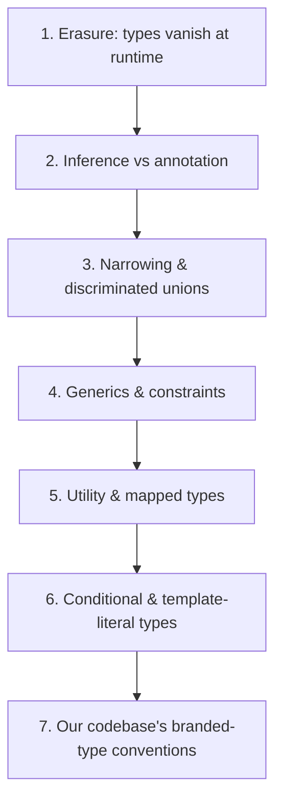
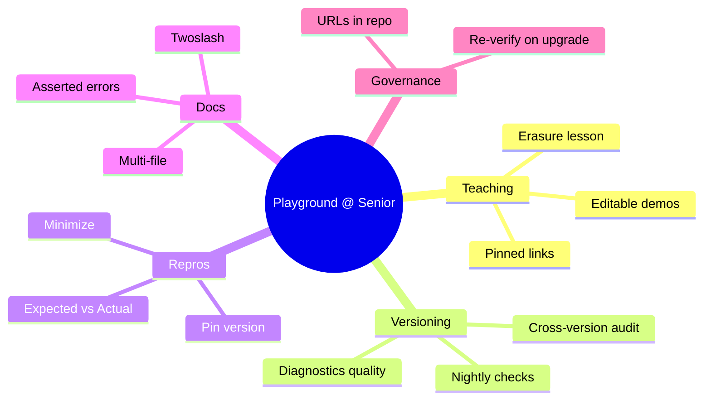
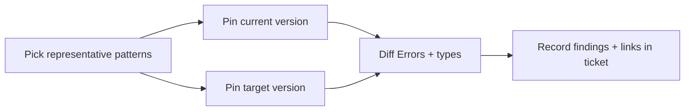

# TS Playground — Senior Level

## Table of Contents

1. [Introduction](#introduction)
2. [Responsibilities at This Level](#responsibilities-at-this-level)
3. [Teaching and Onboarding with the Playground](#teaching-and-onboarding-with-the-playground)
4. [Designing a Curriculum of Shareable Examples](#designing-a-curriculum-of-shareable-examples)
5. [Evaluating Type Behavior Across TS Versions](#evaluating-type-behavior-across-ts-versions)
6. [Producing Minimal Repros for Issues](#producing-minimal-repros-for-issues)
7. [Twoslash for Documentation at Scale](#twoslash-for-documentation-at-scale)
8. [Auditing Library API Surface](#auditing-library-api-surface)
9. [Embedding the Playground and Sandbox](#embedding-the-playground-and-sandbox)
10. [Establishing Team Conventions](#establishing-team-conventions)
11. [Decision Records: Playground vs Alternatives](#decision-records-playground-vs-alternatives)
12. [Advanced Walkthroughs](#advanced-walkthroughs)
13. [Error Handling](#error-handling)
14. [Performance Tips](#performance-tips)
15. [Best Practices](#best-practices)
16. [Edge Cases & Pitfalls](#edge-cases--pitfalls)
17. [Common Mistakes](#common-mistakes)
18. [Tricky Points](#tricky-points)
19. [Test](#test)
20. [Tricky Questions](#tricky-questions)
21. [Cheat Sheet](#cheat-sheet)
22. [Senior Checklist](#senior-checklist)
23. [Summary](#summary)
24. [Further Reading](#further-reading)
25. [Diagrams & Visual Aids](#diagrams--visual-aids)

---

## Introduction

> Focus: "How to teach with it?" and "How to evaluate behavior rigorously?"

A senior engineer uses the Playground less for personal confusion and more as a *communication and verification instrument for a team*. You build onboarding material with it, you settle architectural debates with it ("does this generic blow up at scale?"), you verify whether a behavior is stable across the TypeScript versions your team supports, and you produce the airtight minimal reproductions that get bugs accepted upstream instead of bounced back with "please provide a repro."

At this level the Playground is also a teaching device. The single most effective way to explain a subtle type-system concept is a link that the learner can open, run, edit, and break. A screenshot can lie or go stale; a Playground link is live, version-pinned truth. This page covers the senior workflows: teaching and onboarding, cross-version evaluation, rigorous repros, Twoslash-driven documentation, API auditing, embedding, and the conventions that keep a team's shared examples trustworthy.

---

## Responsibilities at This Level

- Build onboarding paths and internal docs that teach TypeScript via runnable Playground links.
- Decide which TypeScript versions the team supports and verify behavior across them.
- Produce minimal, version-pinned reproductions for upstream bug reports.
- Author documentation examples (often with Twoslash) that stay correct as TS evolves.
- Audit the public type surface of internal libraries before release.
- Choose, per situation, between the Playground and richer sandboxes (StackBlitz/CodeSandbox) or local `tsc`.

---

## Teaching and Onboarding with the Playground

The Playground is the best whiteboard you have for TypeScript concepts. The teaching loop is: **show a small surprise → let the learner predict → reveal → let them edit.**

```typescript
// Onboarding example: "Why does this fail?"
type Animal = { name: string };
type Dog = { name: string; breed: string };

const dogs: Dog[] = [{ name: "Rex", breed: "Lab" }];
const animals: Animal[] = dogs; // OK — arrays are covariant here
animals.push({ name: "Generic" }); // compiles, but now `dogs` has a non-Dog!
```

You give the learner this link, ask them to predict the runtime risk, then have them *fix it* by removing the unsound assignment. Because it is live, they can experiment with `readonly Animal[]` and see the assignment become an error. Live experimentation cements the lesson far better than prose.

### Why Links Beat Screenshots in Onboarding

- A link is runnable: the learner *does*, not just reads.
- A link is version-pinned: the example will behave the same next quarter.
- A link is editable: "now you try" is one keystroke away.
- A link carries settings: the learner sees the exact strictness your team uses.

---

## Designing a Curriculum of Shareable Examples

Treat your onboarding TypeScript material as a *gallery of curated Playground links*, mirroring how the official Examples menu is organized. Structure it from concrete to abstract:



Each node is one Playground link, each pinned to the team's TS version and strict settings. New hires walk the path top to bottom; every step is runnable. The "Erasure" lesson, for instance, is just:

```typescript
interface User {
  name: string;
}
const u: User = { name: "Ada" };
// The .JS tab proves the interface is GONE at runtime.
console.log(typeof u); // "object" — there is no "User" at runtime
```

Pointing a new hire at the `.JS` tab here teaches the single most important TypeScript mental model in thirty seconds.

---

## Evaluating Type Behavior Across TS Versions

Teams pin a TypeScript version and upgrade deliberately. Before upgrading, a senior verifies whether the team's patterns behave the same on the new compiler. The Playground's version dropdown is the cheapest way to run this evaluation without touching CI.

```typescript
// Candidate pattern used widely in the codebase:
type EventMap = {
  click: { x: number; y: number };
  key: { code: string };
};

function on<K extends keyof EventMap>(
  event: K,
  handler: (payload: EventMap[K]) => void,
): void {}

on("click", (p) => p.x); // p inferred from the key — verify across versions
```

Open this on the current version and the target upgrade version. Confirm:
- Does inference still flow from the key to the payload?
- Do error messages improve or regress (a UX concern for the team)?
- Did any previously-allowed pattern become an error (a breaking change to plan for)?

Document findings in the upgrade ticket with one Playground link per behavior, each pinned to both versions for comparison. This turns "the upgrade is risky" hand-waving into concrete, clickable evidence.

### Nightly for Forward-Looking Verification

When a TS feature you depend on is "coming soon," select **Nightly** to test against the unreleased build. If a bug affects your pattern, you can file it *before* the release ships, while it is still cheap to fix upstream.

---

## Producing Minimal Repros for Issues

Getting a bug accepted in `microsoft/TypeScript` or a library's tracker requires a reproduction the maintainers can open and run. The Playground is the canonical medium; many issue templates explicitly ask for a Playground link.

A senior-grade repro:

1. **Isolates** the behavior from all project specifics.
2. **Pins** the version (and ideally also shows it on Nightly to indicate whether it is already fixed).
3. **Comments** the expected vs actual behavior on the exact line.
4. **Removes** every flag not required to trigger it, then states the minimal flags needed.

```typescript
// @strict: true
// Expected: `value` is narrowed to `string` after the guard.
// Actual: narrowing is lost after the await (describe precisely).
async function repro(value: string | undefined) {
  if (value === undefined) return;
  await Promise.resolve();
  return value.toUpperCase(); // <- claim about narrowing goes here
}
```

Pair the link with a crisp title and a one-paragraph "Expected vs Actual." Maintainers triage faster, and your team's name becomes associated with high-signal reports.

---

## Twoslash for Documentation at Scale

For a team's published docs (internal handbook, library README, design-system site), Twoslash is the senior-grade tool. It renders inferred types inline, asserts errors, and supports multi-file virtual setups — all checked by the real compiler at build time.

```typescript
// @errors: 2345
// twoslash renders the type and asserts the error code
declare function save(user: { id: string }): void;

save({ id: 123 });
//        ^^^ asserted to error 2345 (number not assignable to string)
```

Because the docs are compiled with Twoslash in CI, an example that silently rots when TypeScript changes will **fail the docs build**. This is a governance win: your documentation cannot drift out of sync with the compiler. Senior engineers set this up so juniors writing docs get correctness for free.

Twoslash multi-file and flag directives let you document realistic scenarios the single-file Playground cannot:

```typescript
// @filename: types.ts
export interface Config { mode: "light" | "dark" }

// @filename: app.ts
import type { Config } from "./types";
const c: Config = { mode: "neon" }; // documented error, multi-file
```

---

## Auditing Library API Surface

Before publishing an internal package, a senior reviews the generated declarations. The Playground's `.D.TS` tab gives an instant read, and for the full package you compare it against `tsc --declaration` output locally. The Playground is the fast first pass.

```typescript
// Audit question: am I leaking internal types into the public API?
type InternalState = { _cache: Map<string, unknown> }; // should stay private

export class Store {
  private state: InternalState = { _cache: new Map() };
  get(key: string): unknown {
    return this.state._cache.get(key);
  }
}
```

The `.D.TS` tab confirms `InternalState` and the `private state` do not appear in the public surface, while `get` does. If a refactor accidentally exports `InternalState`, you catch it here before it becomes a breaking change you cannot remove without a major version bump.

---

## Embedding the Playground and Sandbox

The TypeScript Playground is built on a reusable component called the **TypeScript Sandbox** (`@typescript/sandbox`), and there is a public API for embedding and deep-linking. Senior engineers use this to put live examples into internal tooling and docs sites.

Capabilities relevant at this level:
- **Deep links** that pre-set code, compiler options, and version via URL parameters, so your handbook can link straight to a configured example.
- **The Sandbox library** to embed a Monaco editor wired to the in-browser TypeScript compiler inside your own web pages.
- **Twoslash rendering** in static site generators so non-interactive docs still show real compiler output.

```typescript
// A docs page can embed a configured example by constructing a deep link:
// https://www.typescriptlang.org/play?strictNullChecks=true&ts=5.4.0#code/<encoded>
// The query params set flags + version; the hash carries the code.
const example = "const x: string | null = null; x.length;"; // demo content
```

Knowing the embedding surface lets you decide: link out to the hosted Playground, or embed a sandbox for a fully integrated experience.

---

## Establishing Team Conventions

Shared examples are only trustworthy if they are governed. Set conventions:

- **Always pin the TS version** in any link added to docs or onboarding.
- **Always set the team's strict flags**, so examples reflect production reality.
- **Prefer Twoslash-checked docs** over screenshots for anything that ships.
- **Store canonical example URLs** in version control (a `playgrounds.md` index), not just in chat history, so they survive and can be re-verified on upgrades.
- **Re-verify the gallery on each TS upgrade** as part of the upgrade checklist.

```typescript
// playgrounds.md (in the repo) — a curated, version-controlled index:
// ## Narrowing
// - Discriminated unions: <pinned playground url>
// ## Generics
// - Constrained keyof: <pinned playground url>
const note = "links live in the repo, not in Slack history";
```

---

## Decision Records: Playground vs Alternatives

A senior chooses the right tool and writes down why.

| Need | Best tool | Reason |
|------|-----------|--------|
| One-file type/behavior question | **TS Playground** | Fastest, real compiler, shareable |
| Multi-file, real npm packages | **StackBlitz / CodeSandbox** | Full project, runs in browser |
| Node APIs, file system, real build | **Local `tsc` + editor** | Only place with the real environment |
| Cross-version type evaluation | **TS Playground** | Version dropdown incl. Nightly |
| Published, compiler-checked docs | **Twoslash** | Asserts types/errors at build time |

```typescript
// Rule of thumb encoded as a decision:
// if (singleFile && noPackages && languageQuestion) usePlayground();
// else if (needsPackages || multiFile) useStackBlitzOrCodeSandbox();
// else useLocalTsc();
const decision = "match the tool to the constraint";
```

---

## Advanced Walkthroughs

### Walkthrough 1: A Cross-Version Upgrade Audit

1. Collect 5–10 representative type patterns from your codebase.
2. Create one Playground per pattern, pinned to the current version, with team flags.
3. Duplicate each, switch only the version to the upgrade target.
4. Diff the Errors tab and hovered types between the two.
5. Record every difference in the upgrade ticket with both links.

```typescript
// Representative pattern under audit:
type Branded<T, B extends string> = T & { readonly __brand: B };
type UserId = Branded<string, "UserId">;
const id = "u_1" as UserId;
function load(_: UserId) {}
load(id); // confirm still accepted on the target version
```

### Walkthrough 2: Turning a Vague Bug Into an Accepted Issue

1. Reproduce in the Playground; confirm it is not a project artifact.
2. Minimize to the trigger.
3. Check it on Nightly — is it already fixed?
4. Write Expected vs Actual as comments on the exact line.
5. File with the pinned link and the Nightly result.

```typescript
// Minimized trigger with explicit claim:
const tuple = [1, "a"] as const;
type First = (typeof tuple)[0]; // Expected literal 1; confirm on this version
```

---

## Error Handling

### Error 1: Onboarding Link Behaves Differently for a New Hire

```typescript
const x: string | null = null;
x.length; // error appears only with strictNullChecks
```

**Why it happens:** The shared link did not pin strict flags or version, so the new hire's defaults differed — except they cannot differ, because the link encodes settings. The real cause is usually an *old* link created before you standardized flags.
**How to fix:** Re-generate the link with the current team flags and version; store the canonical URL in the repo.

### Error 2: Twoslash Docs Build Fails After a TS Bump

```typescript
// @errors: 2322
const n: number = "x"; // if TS changes the code, the assertion may mismatch
```

**Why it happens:** Twoslash asserts specific error codes; a compiler change altered the code or removed the error.
**How to fix:** Update the example or the asserted code — this failure is the feature working: it caught drift.

### Error 3: Repro Rejected as "Cannot Reproduce"

**Why it happens:** You did not pin the version or omitted a required flag.
**How to fix:** Re-share with the exact version selected and the minimal flags stated explicitly in the issue body.

---

## Performance Tips

### Tip 1: Keep Teaching Examples Tiny

```typescript
// A 12-line example loads instantly and re-checks live; a 300-line one lags.
type Lesson = { concept: string };
```

**Why it helps:** Learners stay focused and the editor stays responsive.

### Tip 2: Pre-Pin Versions in Deep Links

```typescript
// Encoding ts=5.4.0 in the link avoids the recipient's editor
// re-downloading a different compiler build.
const link = "?ts=5.4.0#code/...";
```

**Why it helps:** Faster, deterministic load for everyone who opens the link.

---

## Best Practices

- **Teach with live links, never screenshots** — runnable beats static.
- **Pin version and strict flags on every shared example.**
- **Store canonical Playground URLs in the repo**, and re-verify on upgrades.
- **Use Twoslash for shipped docs** so examples cannot rot silently.
- **Check repros on Nightly** before filing, to see if a fix already exists.
- **Audit `.D.TS` surface** before any library release.
- **Write decision records** for Playground vs StackBlitz vs local `tsc`.

---

## Edge Cases & Pitfalls

### Pitfall 1: The Playground's Bundled `@types` ≠ Your Project's

```typescript
import { useState } from "react";
const [n] = useState(0); // behavior depends on the bundled @types/react version
```

**What happens:** Library-type behavior may diverge from your installed versions, leading to false conclusions during an audit.
**How to fix:** For library-type precision, verify locally with the exact installed `@types`; use the Playground for the language-level question.

### Pitfall 2: Treating a Playground Result as a Guarantee for All Configs

**What happens:** A behavior verified under one flag set may differ under another a different team uses.
**How to fix:** State the flags explicitly with every conclusion; verify under each relevant configuration.

---

## Common Mistakes

### Mistake 1: Onboarding Docs Full of Unpinned Links

Links without a pinned version will silently change behavior after the next TS release, confusing future hires. Always pin.

### Mistake 2: Skipping the Nightly Check on a Bug Report

You file a bug that was fixed two weeks ago. Always check Nightly first; if it is fixed there, your report becomes "please backport / when does this ship?" instead of a duplicate.

---

## Tricky Points

### Tricky Point 1: Error-Message Quality Is Itself a Behavior

```typescript
type Deep = { a: { b: { c: number } } };
const d: Deep = { a: { b: { c: "x" } } }; // compare the message across versions
```

**Why it's tricky:** Two versions may both reject the code but with very different message quality. For a team, message clarity affects developer velocity, so it is worth tracking in an upgrade audit — not just pass/fail.
**Key takeaway:** When evaluating versions, evaluate the *diagnostics experience*, not only whether code compiles.

---

## Test

### Multiple Choice

**1. Why are Playground links better than screenshots for onboarding?**

- A) They are smaller files
- B) They are runnable, editable, and version-pinned
- C) They look nicer
- D) They cannot be edited

<details>
<summary>Answer</summary>
**B)** — A link lets the learner run, edit, and break the example, and it pins the exact settings and version.
</details>

**2. What does selecting "Nightly" let a senior verify?**

- A) Old behavior
- B) Behavior on the unreleased development build, to catch issues early
- C) Browser compatibility
- D) Runtime performance

<details>
<summary>Answer</summary>
**B)** — Nightly tests against the latest unreleased compiler, useful for forward-looking verification and pre-release bug reports.
</details>

### True or False

**3. Twoslash can fail your docs build when TypeScript's behavior changes.**

<details>
<summary>Answer</summary>
**True** — Twoslash asserts types/errors; drift causes a build failure, which prevents stale docs.
</details>

**4. The Playground's bundled `@types` always match your installed project versions.**

<details>
<summary>Answer</summary>
**False** — They can differ; verify library-type details locally with your exact `@types`.
</details>

### What's the Output?

**5. What does the `.D.TS` tab include for a `private` class field?**

<details>
<summary>Answer</summary>
The private field is part of the class but not part of the publicly consumable surface in the way exported members are; the audit point is that internal-only *types* it references should not leak as exported declarations.
</details>

**6. Why store canonical example URLs in the repo rather than chat?**

<details>
<summary>Answer</summary>
So they survive, can be version-controlled, and are re-verified on each TS upgrade instead of being lost in chat history.
</details>

---

## Tricky Questions

**1. A teammate says "the upgrade is risky." How do you make that concrete?**

- A) Trust the feeling
- B) Build one pinned Playground per pattern on current and target versions, and diff the results
- C) Skip the upgrade
- D) Upgrade and see what breaks in production

<details>
<summary>Answer</summary>
**B)** — Convert the vague risk into clickable, version-pinned evidence by comparing representative patterns across versions.
</details>

**2. Why check a bug on Nightly before filing?**

- A) Nightly is faster
- B) The bug may already be fixed; your report should reflect that
- C) Nightly hides bugs
- D) It is required by law

<details>
<summary>Answer</summary>
**B)** — If Nightly already fixes it, you avoid filing a duplicate and instead ask about release timing.
</details>

**3. When should a senior choose StackBlitz over the Playground?**

- A) Never
- B) When the example needs real npm packages or multiple files
- C) For single-file type questions
- D) For cross-version checks

<details>
<summary>Answer</summary>
**B)** — StackBlitz/CodeSandbox handle real packages and multi-file projects the Playground cannot.
</details>

---

## Cheat Sheet

| Senior task | Approach |
|-------------|----------|
| Onboard a hire | curated, pinned, runnable Playground gallery |
| Evaluate a TS upgrade | same patterns across two pinned versions, diff results |
| File an upstream bug | minimal repro + version pin + Nightly check + Expected/Actual |
| Ship live docs | Twoslash (`^?`, `@errors`, `@filename`) in CI |
| Audit a library | read `.D.TS` for leaks before release |
| Embed examples | TypeScript Sandbox + deep links |
| Govern examples | store URLs in repo, re-verify on upgrade |

---

## Senior Checklist

- [ ] Onboarding material is a curated set of pinned, runnable Playground links.
- [ ] Upgrade audits compare representative patterns across versions with evidence.
- [ ] Bug reports are minimal, version-pinned, and Nightly-checked.
- [ ] Shipped docs use Twoslash so examples cannot silently rot.
- [ ] Library `.D.TS` surface is audited before each release.
- [ ] Canonical example URLs live in the repo and are re-verified on upgrades.
- [ ] Decision records justify Playground vs StackBlitz vs local `tsc`.

---

## Summary

- At senior level the Playground is a team communication and verification instrument.
- Teach and onboard with live, pinned, editable links — never stale screenshots.
- Evaluate TS upgrades by comparing representative patterns across pinned versions, including diagnostics quality.
- Produce minimal, version-pinned, Nightly-checked reproductions to get issues accepted.
- Use Twoslash for documentation that the compiler keeps honest in CI.
- Audit the `.D.TS` surface before shipping libraries.
- Choose the Playground, StackBlitz/CodeSandbox, or local `tsc` deliberately and record why.

**Next step:** Understand how the Playground actually compiles TypeScript in the browser (Professional level).

---

## Further Reading

- **TypeScript Sandbox & embedding:** [typescriptlang.org/dev/sandbox](https://www.typescriptlang.org/dev/sandbox/)
- **Twoslash:** [shikijs.github.io/twoslash](https://shikijs.github.io/twoslash/)
- **Playground:** [typescriptlang.org/play](https://www.typescriptlang.org/play)
- **TypeScript bug-report guidance:** [github.com/microsoft/TypeScript issue templates](https://github.com/microsoft/TypeScript/issues/new/choose)

---

## Diagrams & Visual Aids

### Senior Workflows Map



### Upgrade Audit Flow


