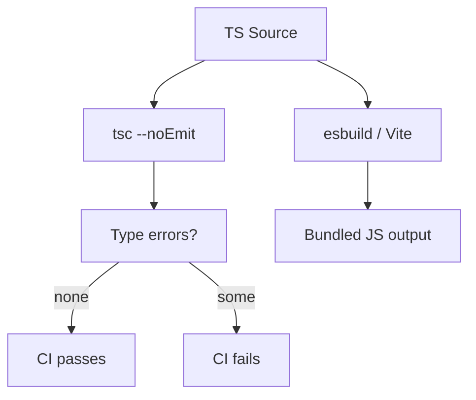
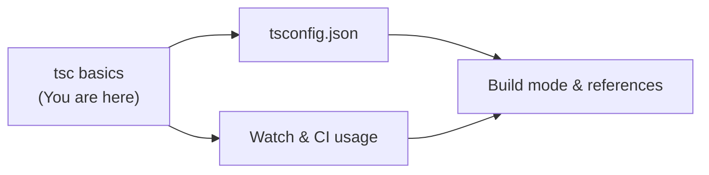
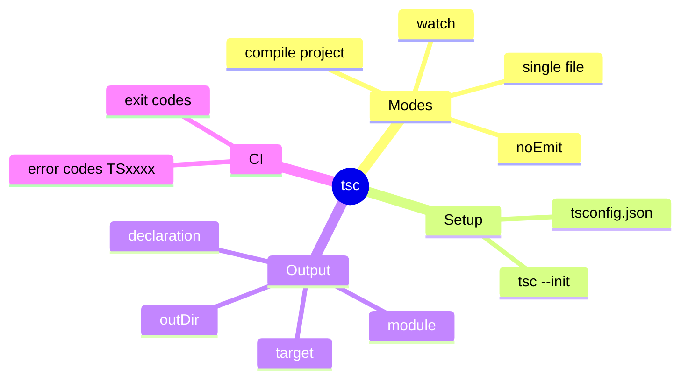
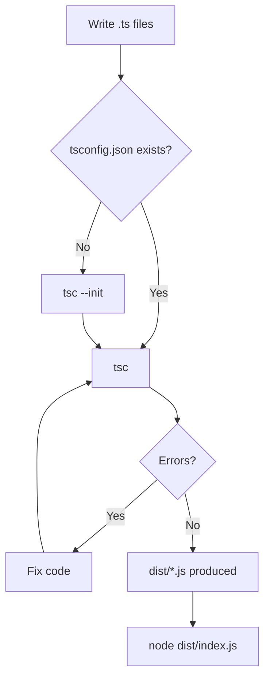

# tsc (the TypeScript Compiler) — Junior Level

## Table of Contents

1. [Introduction](#introduction)
2. [Prerequisites](#prerequisites)
3. [Glossary](#glossary)
4. [Core Concepts](#core-concepts)
5. [Real-World Analogies](#real-world-analogies)
6. [Mental Models](#mental-models)
7. [Pros & Cons](#pros--cons)
8. [Use Cases](#use-cases)
9. [Code Examples](#code-examples)
10. [Coding Patterns](#coding-patterns)
11. [Clean Code](#clean-code)
12. [Product Use / Feature](#product-use--feature)
13. [Error Handling](#error-handling)
14. [Security Considerations](#security-considerations)
15. [Performance Tips](#performance-tips)
16. [Metrics & Analytics](#metrics--analytics)
17. [Best Practices](#best-practices)
18. [Edge Cases & Pitfalls](#edge-cases--pitfalls)
19. [Common Mistakes](#common-mistakes)
20. [Common Misconceptions](#common-misconceptions)
21. [Tricky Points](#tricky-points)
22. [Test](#test)
23. [Tricky Questions](#tricky-questions)
24. [Cheat Sheet](#cheat-sheet)
25. [Self-Assessment Checklist](#self-assessment-checklist)
26. [Summary](#summary)
27. [What You Can Build](#what-you-can-build)
28. [Further Reading](#further-reading)
29. [Related Topics](#related-topics)
30. [Diagrams & Visual Aids](#diagrams--visual-aids)

---

## Introduction

> Focus: "What is it?" and "How to use it?"

`tsc` is the **TypeScript compiler**. It is the command-line program that takes your `.ts` (and `.tsx`) source files, checks them for type errors, and emits plain JavaScript (`.js`) files that browsers and Node.js can actually run.

The single most important thing to understand about `tsc` is that it does **two jobs at once**:

1. **Type checking** — it reads your type annotations and reports any errors (passing a `string` where a `number` is expected, calling a method that does not exist, forgetting to handle `null`, and so on).
2. **Emitting JavaScript** — it strips away all the TypeScript-only syntax (type annotations, interfaces, `enum`s when applicable) and writes runnable JavaScript.

TypeScript is a **superset of JavaScript**: every valid `.js` file is also a valid `.ts` file. The types you add exist only at compile time. After `tsc` runs, the type information is **erased** — the output is ordinary JavaScript with no trace of your annotations.

You install `tsc` as part of the `typescript` package:

```bash
# Install TypeScript locally in a project (recommended)
npm install --save-dev typescript

# Now run the compiler through npx so you use the project's version
npx tsc --version
# Output: Version 5.4.5

# Or install globally (handy for quick experiments)
npm install --global typescript
tsc --version
```

Every TypeScript developer runs `tsc` (directly or through a build tool) constantly, so learning its core commands and flags from day one pays off immediately.

---

## Prerequisites

- **Required:** Node.js and npm installed — `tsc` ships as an npm package (`typescript`).
- **Required:** Basic terminal / command-line skills — you run `tsc` in a terminal.
- **Required:** A little JavaScript — you should know what a `.js` file is and how `node file.js` runs it.
- **Helpful but not required:** Understanding of what a compiler does (turns source code into another form). `tsc` is a *transpiler* + *type checker*.
- **Helpful but not required:** Familiarity with `package.json` and `npm scripts`.

---

## Glossary

| Term | Definition |
|------|-----------|
| **tsc** | The TypeScript compiler binary, provided by the `typescript` npm package |
| **Transpile** | Convert source from one language version/form to another (TS → JS); no machine code involved |
| **Emit** | The act of `tsc` writing output files (`.js`, `.d.ts`, `.js.map`) |
| **Type check** | The act of `tsc` validating your types and reporting errors |
| **tsconfig.json** | The configuration file that tells `tsc` what to compile and how |
| **Compiler option** | A setting like `--target` or `--strict` that changes how `tsc` behaves |
| **Declaration file** | A `.d.ts` file containing only types (no runtime code) |
| **Source map** | A `.js.map` file linking compiled JS back to original TS for debugging |
| **Exit code** | The number a process returns; `0` = success, non-zero = failure (used by CI) |
| **Error code** | A `TSxxxx` identifier attached to every compiler diagnostic |
| **noEmit** | A mode where `tsc` only type-checks and writes no files |
| **Watch mode** | A mode where `tsc` stays running and recompiles on file changes |

---

## Core Concepts

### Concept 1: `tsc file.ts` — Compile a single file

The simplest invocation compiles one file into JavaScript next to it.

```bash
# Given hello.ts, this produces hello.js in the same folder
tsc hello.ts
```

`tsc hello.ts` ignores any `tsconfig.json` and uses **default** compiler options. This is fine for quick experiments but not how real projects build.

### Concept 2: `tsc` (no arguments) — Compile a project

When you run `tsc` with **no file arguments**, it looks for a `tsconfig.json` in the current directory (and upward) and compiles the whole project according to that config.

```bash
# Reads tsconfig.json, compiles every file it lists
tsc
```

This is the normal way to build a project. The `tsconfig.json` decides which files are included, the output folder, the target JavaScript version, and dozens of other settings.

### Concept 3: `tsc --init` — Create a tsconfig.json

`--init` generates a starter `tsconfig.json` with sensible defaults and lots of commented-out options you can enable later.

```bash
tsc --init
# Created a new tsconfig.json with:
#   target: es2016
#   module: commonjs
#   strict: true
#   ...
```

### Concept 4: `tsc --watch` / `tsc -w` — Recompile on save

Watch mode keeps `tsc` running. Every time you save a file, it recompiles only what changed and prints any new errors. This is great for fast feedback during development.

```bash
tsc --watch
# [10:42:01] Starting compilation in watch mode...
# [10:42:02] Found 0 errors. Watching for file changes.
```

### Concept 5: `tsc --noEmit` — Type-check only

`--noEmit` tells `tsc` to check types but **not** write any `.js` files. This is extremely common when another tool (Vite, esbuild, Babel) does the actual JavaScript emit, and you just want `tsc` to be the type checker.

```bash
tsc --noEmit
# Found 0 errors.   (and no .js files were created)
```

### Concept 6: `tsc --outDir` — Choose the output folder

By default `tsc` writes `.js` files right next to your `.ts` files. `--outDir` collects them in a separate folder (usually `dist`).

```bash
tsc --outDir dist
# Source: src/index.ts  ->  Output: dist/index.js
```

### Concept 7: `tsc --target` — Choose the JS version

`--target` controls how modern the emitted JavaScript is. A lower target (like `es5`) means more compatibility but more down-leveling; a higher target (like `es2022`) means cleaner, faster output for modern environments.

```bash
tsc --target es2022 index.ts
```

### Concept 8: Reading errors and exit codes

When `tsc` finds problems, it prints them and exits with a **non-zero exit code**. When everything is fine, it exits with code `0`. CI systems rely on this.

```bash
tsc --noEmit
# index.ts:3:14 - error TS2345: Argument of type 'string' is not
#   assignable to parameter of type 'number'.
#
# Found 1 error in index.ts:3

echo $?   # prints the exit code
# 2
```

---

## Real-World Analogies

| Concept | Analogy |
|---------|--------|
| **tsc type checking** | A grammar/spell checker that reads your essay and underlines mistakes before you publish |
| **tsc emit** | A translator who rewrites your essay from British English into American English so a different audience can read it |
| **tsconfig.json** | A recipe card that tells the cook (tsc) which ingredients (files) to use and how to prepare them (options) |
| **--watch mode** | A live proofreader sitting next to you, re-checking every sentence the moment you type it |
| **--noEmit** | Asking the proofreader to *only* mark mistakes, not produce a final printed copy |
| **exit code** | A traffic light: green (0) means go, red (non-zero) means stop the pipeline |

---

## Mental Models

**The intuition:** Think of `tsc` as two machines bolted together. The first machine is a **type checker** that reads your code and complains about anything that does not make sense. The second machine is a **translator** that removes all the TypeScript-specific syntax and writes plain JavaScript. You can run both machines, or you can run just the checker (`--noEmit`), or in some setups you let a faster tool do the translating and use `tsc` only for checking.

**Why this model helps:** Beginners often think "TypeScript runs my code." It does not. Node and the browser run the *output* JavaScript. `tsc` is a build step that happens *before* execution. Once you separate "checking" from "emitting" in your head, flags like `--noEmit` and tools like `ts-node` stop being confusing.

---

## Pros & Cons

| Pros | Cons |
|------|------|
| Official, authoritative type checker — the source of truth | Slower than bundler-based transpilers (esbuild, swc) for emit |
| One tool does both checking and emitting | No bundling — produces one `.js` per `.ts`, not a single file |
| Highly configurable through `tsconfig.json` | Many options can be overwhelming at first |
| Stable exit codes make CI integration trivial | Error messages can be long for complex generic types |
| Watch and incremental modes for fast local feedback | No built-in dev server or hot reload |
| Generates `.d.ts` declaration files for libraries | Cannot run TypeScript directly (need `ts-node`/`tsx` for that) |

### When to use:
- Building any TypeScript project to JavaScript.
- Type-checking as a CI gate (`tsc --noEmit`).
- Generating `.d.ts` files for a published library.

### When NOT to use (alone):
- When you need fast bundling — pair `tsc --noEmit` with esbuild/Vite/swc for emit.
- When you want to *run* a `.ts` file directly during development — use `ts-node` or `tsx`.

---

## Use Cases

- **Use Case 1:** Compile a small project to `dist/` — `tsc --outDir dist`.
- **Use Case 2:** Type-check in CI without producing files — `tsc --noEmit`.
- **Use Case 3:** Fast local feedback — `tsc --watch` recompiles on every save.
- **Use Case 4:** Bootstrap configuration — `tsc --init` scaffolds a `tsconfig.json`.
- **Use Case 5:** Ship a typed library — `tsc --declaration` emits `.js` plus `.d.ts`.

---

## Code Examples

### Example 1: Compile a single file

```typescript
// Save as greet.ts
function greet(name: string): string {
  return `Hello, ${name}!`;
}

console.log(greet("World"));
```

**How to run:**

```bash
tsc greet.ts      # creates greet.js
node greet.js     # prints: Hello, World!
```

**The emitted greet.js looks like:**

```javascript
// greet.js — types are gone, this is plain JS
function greet(name) {
  return `Hello, ${name}!`;
}
console.log(greet("World"));
```

### Example 2: Catch a type error

```typescript
// Save as bad.ts
function double(n: number): number {
  return n * 2;
}

double("five"); // wrong type on purpose
```

**How to run:**

```bash
tsc bad.ts
```

**Output:**

```
bad.ts:5:8 - error TS2345: Argument of type 'string' is not assignable
  to parameter of type 'number'.

5 double("five");
         ~~~~~~

Found 1 error in bad.ts:5
```

Note: by default `tsc` **still emits** `bad.js` even when there are type errors (unless you turn on `noEmitOnError`). The error is a warning to you, not necessarily a hard stop for emit.

### Example 3: A minimal tsconfig.json project

```json
// tsconfig.json
{
  "compilerOptions": {
    "target": "es2022",
    "module": "nodenext",
    "outDir": "dist",
    "rootDir": "src",
    "strict": true
  },
  "include": ["src"]
}
```

```typescript
// src/index.ts
export function add(a: number, b: number): number {
  return a + b;
}

console.log(add(2, 3));
```

**How to run:**

```bash
tsc            # reads tsconfig.json, emits dist/index.js
node dist/index.js
# Output: 5
```

### Example 4: Type-check only, no output

```bash
# Great for "is my code type-correct?" without touching dist/
tsc --noEmit
# Found 0 errors.
```

### Example 5: Watch mode for development

```bash
tsc --watch
# [10:00:00] Starting compilation in watch mode...
# [10:00:01] Found 0 errors. Watching for file changes.
#
# (you edit src/index.ts and save...)
#
# [10:00:09] File change detected. Starting incremental compilation...
# [10:00:09] Found 0 errors. Watching for file changes.
```

---

## Coding Patterns

### Pattern 1: Separate type-check from build

**Intent:** Use `tsc` for correctness, a faster tool for output.
**When to use:** Modern front-end and Node projects using Vite/esbuild/swc.

```bash
# CI / pre-commit: just check types (no files written)
tsc --noEmit

# Build step: let the bundler emit JS (much faster)
vite build
```

**Diagram:**



### Pattern 2: npm scripts wrapper

**Intent:** Standardize commands across the team.
**When to use:** Every project.

```json
// package.json
{
  "scripts": {
    "build": "tsc",
    "typecheck": "tsc --noEmit",
    "dev": "tsc --watch"
  }
}
```

```bash
npm run typecheck
npm run build
```

---

## Clean Code

### Naming output folders

```bash
# Unclear — output mixed with source
tsc

# Clean — output isolated in dist/
tsc --outDir dist --rootDir src
```

**Rule:** Keep compiled output out of your source tree. Use `outDir: "dist"` and add `dist/` to `.gitignore`.

### Prefer tsconfig over long flag lists

```bash
# Hard to read, easy to get wrong, not reproducible
tsc --target es2022 --module nodenext --outDir dist --strict --declaration src/index.ts

# Clean — put it all in tsconfig.json and just run:
tsc
```

**Rule:** Configuration belongs in `tsconfig.json`, not in shell history. Flags are for one-off overrides.

### Comments explain WHY

```bash
# Noise: states the obvious
# run tsc
tsc

# Useful: explains the intent
# Type-check only; esbuild handles the actual JS emit in the build step
tsc --noEmit
```

---

## Product Use / Feature

### 1. CI/CD Type Gates (GitHub Actions, GitLab CI)

- **How it uses tsc:** A pipeline step runs `tsc --noEmit`. A non-zero exit code fails the build.
- **Why it matters:** Stops type errors from ever reaching the main branch or production.

### 2. Library Publishing (npm packages)

- **How it uses tsc:** `tsc --declaration` emits `.js` plus `.d.ts` so consumers get types.
- **Why it matters:** Without `.d.ts`, your library users get no autocomplete or type safety.

### 3. Editor Integration (VS Code)

- **How it uses tsc:** VS Code runs the TypeScript language server (the same compiler core as `tsc`) to underline errors as you type.
- **Why it matters:** The red squiggles in your editor and the errors from `tsc` come from the same engine, so they agree.

---

## Error Handling

### Error 1: `Cannot find name 'X'`

```bash
$ tsc
src/index.ts:2:1 - error TS2304: Cannot find name 'consol'.

2 consol.log("hi");
  ~~~~~~
```

**Why it happens:** A typo or a missing import.
**How to fix:** Correct the name (`console`) or add the missing `import`.

### Error 2: `Argument of type 'X' is not assignable to parameter of type 'Y'`

```bash
$ tsc
src/index.ts:5:8 - error TS2345: Argument of type 'string' is not
  assignable to parameter of type 'number'.
```

**Why it happens:** You passed the wrong type.
**How to fix:** Pass the correct type or fix the function signature.

### Error 3: `No inputs were found in config file`

```bash
$ tsc
error TS18003: No inputs were found in config file 'tsconfig.json'.
  Specified 'include' paths were '["src"]' and 'exclude' paths were '[]'.
```

**Why it happens:** Your `include` points at a folder with no `.ts` files.
**How to fix:** Add a `.ts` file to `src/`, or fix the `include`/`files` paths.

### Error 4: `Cannot find module 'typescript'`

```bash
$ npx tsc
npm ERR! could not determine executable to run
```

**Why it happens:** `typescript` is not installed.
**How to fix:**

```bash
npm install --save-dev typescript
```

### Error Handling Pattern in Scripts

```bash
# Fail the script if type checking fails
tsc --noEmit
if [ $? -ne 0 ]; then
  echo "Type check failed!"
  exit 1
fi
echo "Types OK"
```

---

## Security Considerations

### 1. Pin the compiler version

```bash
# Risky — different machines may use different tsc versions
npm install -g typescript

# Safer — version is locked in package.json / package-lock.json
npm install --save-dev typescript@5.4.5
npx tsc --version
```

**Risk:** Inconsistent compiler versions cause "works on my machine" type errors.
**Mitigation:** Always depend on `typescript` locally and commit the lockfile.

### 2. Do not blindly disable checks

```json
// Risky: silences real errors
{ "compilerOptions": { "strict": false, "noImplicitAny": false } }

// Safer: keep strict checks on
{ "compilerOptions": { "strict": true } }
```

**Risk:** Disabling checks can let runtime-crashing bugs through.
**Mitigation:** Keep `strict: true`; suppress individual lines with a documented `// @ts-expect-error` only when justified.

---

## Performance Tips

### Tip 1: Use `--noEmit` when you only need a check

```bash
# Slower — writes files you do not need
tsc

# Faster — skips the entire emit phase
tsc --noEmit
```

**Why it is faster:** No JavaScript is written to disk.

### Tip 2: Turn on `skipLibCheck`

```json
{ "compilerOptions": { "skipLibCheck": true } }
```

**Why it matters:** `tsc` skips type-checking the `.d.ts` files in `node_modules`, which can be a large chunk of the work.

### Tip 3: Use incremental builds

```bash
tsc --incremental
# First run: full build. Later runs: only re-check what changed.
```

---

## Metrics & Analytics

### What to Measure

| Metric | Why it matters | Tool |
|--------|---------------|------|
| **Compile time** | Slow builds slow down everyone | `time tsc --noEmit` |
| **Number of errors** | Tracks code health over time | `tsc --noEmit` output footer |
| **Files compiled** | Detects accidental inclusion of node_modules | `tsc --listFiles \| wc -l` |

### Basic Instrumentation

```bash
# Measure how long a type check takes
time tsc --noEmit

# Count how many files tsc processed
tsc --listFiles | wc -l

# Get a high-level breakdown of where time went
tsc --noEmit --diagnostics
```

---

## Best Practices

- **Always run `tsc --noEmit` in CI** — make type errors block merges.
- **Keep `strict: true`** — it catches the most bugs.
- **Use `outDir` and `rootDir`** — keep output separate from source.
- **Install `typescript` locally** — never rely on a global version for builds.
- **Add `dist/` and `*.tsbuildinfo` to `.gitignore`** — they are build artifacts.
- **Use `tsc --watch` during development** — fast feedback beats manual rebuilds.

---

## Edge Cases & Pitfalls

### Pitfall 1: `tsc file.ts` ignores tsconfig.json

```bash
# This does NOT read your tsconfig.json!
tsc src/index.ts

# This DOES read tsconfig.json
tsc
```

**What happens:** Passing a file name makes `tsc` use defaults, not your config. Your `strict` and `outDir` settings are silently ignored.
**How to fix:** Run bare `tsc` (or `tsc -p tsconfig.json`) for project builds.

### Pitfall 2: tsc still emits JS even with errors

```bash
tsc            # errors printed, but dist/*.js is STILL written
```

**What happens:** By default, type errors do not stop emit.
**How to fix:** Add `"noEmitOnError": true` to refuse emitting broken builds.

### Pitfall 3: Output appears next to source

```bash
tsc src/index.ts   # creates src/index.js — clutters your source folder
```

**How to fix:** Set `outDir` in tsconfig and run bare `tsc`.

---

## Common Mistakes

### Mistake 1: Forgetting `--save-dev` typescript

```bash
# Build fails in CI because typescript is not a dependency
npx tsc

# Fix:
npm install --save-dev typescript
```

### Mistake 2: Expecting tsc to run the code

```bash
# tsc does NOT execute anything
tsc index.ts
# You still need:
node index.js
```

### Mistake 3: Mixing file arguments with `-p`

```bash
# Error: cannot combine a file list with --project
tsc src/index.ts -p tsconfig.json
```

---

## Common Misconceptions

### Misconception 1: "TypeScript runs in the browser"

**Reality:** Browsers and Node run **JavaScript**. `tsc` converts your TypeScript to JavaScript first. The types never reach runtime.

**Why people think this:** Editors show TypeScript everywhere, so it feels like the runtime language.

### Misconception 2: "If tsc emits JS, the types were correct"

**Reality:** By default `tsc` emits JS *even when there are type errors*. Emit success is not the same as type correctness. Use `noEmitOnError` or check the exit code.

**Why people think this:** Other compilers refuse to produce output on errors.

---

## Tricky Points

### Tricky Point 1: Exit code is what CI reads, not the printed text

```bash
tsc --noEmit
echo $?   # 0 = clean, non-zero = errors
```

**Why it is tricky:** A pipeline does not "read" the error text; it checks the exit code. As long as `tsc` exits non-zero on errors, your gate works.
**Key takeaway:** Never pipe `tsc` through something that swallows its exit code (like `tsc --noEmit || true`) in CI.

### Tricky Point 2: `tsc -w` and `tsc --noEmit -w` are both valid

```bash
tsc --watch            # watch + emit
tsc --noEmit --watch   # watch + type-check only (no files)
```

**Key takeaway:** Watch mode composes with other flags.

---

## Test

### Multiple Choice

**1. What does `tsc --noEmit` do?**

- A) Compiles to JS but skips type checking
- B) Type-checks but writes no output files
- C) Deletes all emitted files
- D) Runs the compiled program

<details>
<summary>Answer</summary>
**B)** — `--noEmit` performs a full type check but does not write any `.js`, `.d.ts`, or map files.
</details>

### True or False

**2. `tsc src/index.ts` reads your `tsconfig.json`.**

<details>
<summary>Answer</summary>
**False** — passing a file path makes `tsc` ignore `tsconfig.json` and use default options. Run bare `tsc` (or `tsc -p`) to use the config.
</details>

### What's the Output?

**3. What happens?**

```bash
echo 'let x: number = "hi";' > t.ts
tsc t.ts
echo $?
```

<details>
<summary>Answer</summary>
`tsc` prints a `TS2322` type error and exits with code `2`. It still writes `t.js` unless `noEmitOnError` is set.
</details>

**4. Which command creates a starter config?**

- A) `tsc --config`
- B) `tsc --new`
- C) `tsc --init`
- D) `tsc create`

<details>
<summary>Answer</summary>
**C)** — `tsc --init` generates a `tsconfig.json`.
</details>

**5. Where does `tsc --outDir dist` put compiled files?**

<details>
<summary>Answer</summary>
In the `dist/` folder, mirroring the structure under `rootDir`.
</details>

---

## Tricky Questions

**1. You run `tsc` and see your `.js` files appear *next to* your `.ts` files even though you set `outDir` in tsconfig. Why?**

<details>
<summary>Answer</summary>
You probably ran `tsc src/index.ts` (with a file argument), which ignores `tsconfig.json`. Run bare `tsc` so the config — including `outDir` — is honored.
</details>

**2. CI says "build passed" but you know there are type errors. What went wrong?**

<details>
<summary>Answer</summary>
Either the CI ran `tsc` (which emits and may still exit 0 in some setups) instead of `tsc --noEmit`, or the command was wrapped with `|| true`, swallowing the non-zero exit code.
</details>

---

## Cheat Sheet

| What | Command | Example |
|------|---------|---------|
| Check version | `tsc --version` | `tsc --version` |
| Compile one file | `tsc <file>` | `tsc app.ts` |
| Compile project | `tsc` | `tsc` |
| Create config | `tsc --init` | `tsc --init` |
| Watch mode | `tsc -w` | `tsc --watch` |
| Type-check only | `tsc --noEmit` | `tsc --noEmit` |
| Output folder | `tsc --outDir <dir>` | `tsc --outDir dist` |
| JS target | `tsc --target <ver>` | `tsc --target es2022` |
| Module system | `tsc --module <kind>` | `tsc --module nodenext` |
| Strict mode | `tsc --strict` | `tsc --strict` |
| Emit declarations | `tsc --declaration` | `tsc --declaration` |
| Specific config | `tsc -p <path>` | `tsc -p tsconfig.build.json` |

---

## Self-Assessment Checklist

### I can explain:
- [ ] That `tsc` both type-checks and emits JavaScript
- [ ] Why types disappear at runtime
- [ ] The difference between `tsc file.ts` and bare `tsc`

### I can do:
- [ ] Install TypeScript and run `tsc --version`
- [ ] Create a `tsconfig.json` with `tsc --init`
- [ ] Compile a project to `dist/`
- [ ] Run a type-check-only pass with `--noEmit`
- [ ] Start watch mode

### I can answer:
- [ ] All multiple-choice questions above

---

## Summary

- `tsc` is the TypeScript compiler: it **type-checks** and **emits JavaScript**.
- Bare `tsc` compiles the whole project using `tsconfig.json`; `tsc file.ts` uses defaults and ignores the config.
- `tsc --init` scaffolds a config, `--watch` recompiles on save, `--noEmit` checks without writing files.
- `tsc` exits non-zero on errors — that is what makes it a perfect CI gate.
- Common flags: `--outDir`, `--target`, `--module`, `--strict`, `--declaration`.

**Next step:** Learn `tsconfig.json` options in depth, then move on to watch mode, CI integration, and reading complex error messages at the middle level.

---

## What You Can Build

### Projects you can create:
- **A "build + run" Node CLI:** practice `tsc --outDir dist` then `node dist/index.js`.
- **A CI type gate:** add a GitHub Action that runs `tsc --noEmit`.
- **A tiny typed library:** emit `.d.ts` with `tsc --declaration`.

### Learning path:



---

## Further Reading

- **Official docs:** [tsc CLI reference](https://www.typescriptlang.org/docs/handbook/compiler-options.html)
- **Official docs:** [What is a tsconfig.json](https://www.typescriptlang.org/docs/handbook/tsconfig-json.html)
- **Handbook:** [TypeScript for JS Programmers](https://www.typescriptlang.org/docs/handbook/typescript-in-5-minutes.html)

---

## Related Topics

- **tsconfig.json** — the configuration file `tsc` reads.
- **Compiler options** — the individual settings like `target`, `module`, `strict`.
- **ts-node / tsx** — running TypeScript without a separate compile step.

---

## Diagrams & Visual Aids

### Mind Map



### tsc Workflow



### Pipeline — ASCII

```
+-------------+      +-----------+      +-------------+
|  .ts files  | ---> |    tsc    | ---> |  .js files  |
+-------------+      +-----------+      +-------------+
                          |
                          v
                   +--------------+
                   | type errors  |
                   | TSxxxx codes |
                   +--------------+
```
