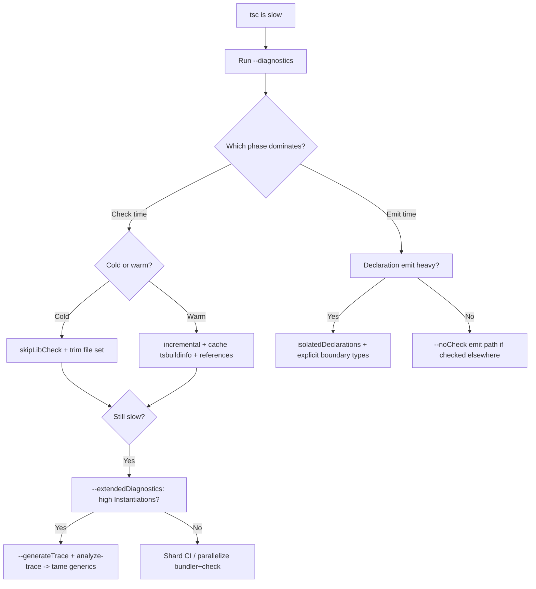

# tsc — Optimization Guide

> 12 optimizations for making `tsc` faster — faster cold builds, faster warm/incremental builds, faster CI, and cheaper type checking. Each gives the problem, the change, the expected impact, and how to measure it. Difficulty: 🟢 easy win, 🟡 moderate, 🔴 advanced.

## Table of Contents

1. [Optimization 1 — `skipLibCheck` 🟢](#optimization-1--skiplibcheck-)
2. [Optimization 2 — `--noEmit` When You Only Check 🟢](#optimization-2--noemit-when-you-only-check-)
3. [Optimization 3 — Incremental + `.tsbuildinfo` 🟢](#optimization-3--incremental--tsbuildinfo-)
4. [Optimization 4 — Trim the File Set 🟢](#optimization-4--trim-the-file-set-)
5. [Optimization 5 — Project References 🟡](#optimization-5--project-references-)
6. [Optimization 6 — Cache `.tsbuildinfo` in CI 🟡](#optimization-6--cache-tsbuildinfo-in-ci-)
7. [Optimization 7 — Bundler Emits, tsc Checks 🟡](#optimization-7--bundler-emits-tsc-checks-)
8. [Optimization 8 — Tame Expensive Generics 🔴](#optimization-8--tame-expensive-generics-)
9. [Optimization 9 — Name Inlined Complex Types 🔴](#optimization-9--name-inlined-complex-types-)
10. [Optimization 10 — Explicit Return Types on Hot Boundaries 🔴](#optimization-10--explicit-return-types-on-hot-boundaries-)
11. [Optimization 11 — `--isolatedDeclarations` for Parallel d.ts 🔴](#optimization-11---isolateddeclarations-for-parallel-dts-)
12. [Optimization 12 — `--noCheck` Emit Path 🔴](#optimization-12--nocheck-emit-path-)
13. [Optimization 13 — `assumeChangesOnlyAffectDirectDependencies` 🔴](#optimization-13--assumechangesonlyaffectdirectdependencies-)
14. [Optimization 14 — Split CI Type Check Across Shards 🔴](#optimization-14--split-ci-type-check-across-shards-)
15. [How to Measure Everything](#how-to-measure-everything)
16. [Optimization Summary Table](#optimization-summary-table)
17. [Decision Flow](#decision-flow)

---

## Before You Optimize: Profile First

The single most common mistake is optimizing the wrong phase. `tsc` time is split across parse, bind, **check**, and emit, and on almost every real project **check** dominates. Before changing anything, capture a baseline:

```bash
tsc --noEmit --diagnostics
```

```
Files:               512
Parse time:          0.88s
Bind time:           0.41s
Check time:          4.92s   <-- optimize THIS
Emit time:           0.00s   (already --noEmit)
Total time:          6.22s
```

If `Check time` is the giant, your levers are: reduce the file set, skip lib checking, shrink invalidation radius (references + incremental), and tame expensive generics. If `Emit time` is large (declaration emit on a big library), the levers are different (isolated declarations, explicit boundary types, `--noCheck` emit). **Measure, change one thing, re-measure.** Everything below is organized from cheapest to most involved so you can stop as soon as you hit your budget.

A second principle: **warm builds matter more than cold builds for developer experience and CI throughput.** A 6-second cold build that becomes a 0.5-second warm build (via incremental + cached `.tsbuildinfo`) is usually a bigger real-world win than shaving a second off the cold path. Optimize the path your team actually runs most often.

---

## Optimization 1 — `skipLibCheck` 🟢

**Problem:** `tsc` type-checks every `.d.ts` in `node_modules` and the `lib` files, which can be a large, mostly-constant slice of the work.

```json
{ "compilerOptions": { "skipLibCheck": true } }
```

**Expected impact:** Often 10–40% off cold build time on dependency-heavy projects, because the bind/check of thousands of library declarations is skipped.

**Measure:**
```bash
tsc --noEmit --diagnostics            # without
# add skipLibCheck, then:
tsc --noEmit --diagnostics            # compare "Check time"
```

**Trade-off:** It can hide an incompatibility between two `@types` packages. Run a full check (without it) occasionally to verify.

---

## Optimization 2 — `--noEmit` When You Only Check 🟢

**Problem:** A CI or pre-commit step runs full `tsc`, writing `.js`/`.d.ts`/maps that nobody uses.

```bash
# Before: emits files you discard
tsc

# After: skips the entire emit phase
tsc --noEmit
```

**Expected impact:** Removes the emit and disk-write work entirely. The savings grow with declaration emit (which itself needs type computation).

**Measure:** Compare the `Emit time` line in `--diagnostics`; with `--noEmit` it is `0`.

---

## Optimization 3 — Incremental + `.tsbuildinfo` 🟢

**Problem:** Every run is a full, cold rebuild even when little changed.

```json
{ "compilerOptions": { "incremental": true, "tsBuildInfoFile": "./.cache/tsc.tsbuildinfo" } }
```

```bash
tsc --noEmit     # cold (writes .tsbuildinfo)
tsc --noEmit     # warm (re-checks only changed + affected files)
```

**Expected impact:** Warm no-change runs can be many times faster than cold. Body-only edits don't ripple to dependents (invalidation is by `.d.ts` signature).

**Measure:**
```bash
rm -f .cache/tsc.tsbuildinfo
time tsc --noEmit    # cold
time tsc --noEmit    # warm
```

---

## Optimization 4 — Trim the File Set 🟢

**Problem:** `tsc` is silently compiling more than it should — test fixtures, generated code, or `node_modules` pulled in by a loose `include`.

```bash
# Find out what's actually included and why
tsc --noEmit --explainFiles | less
```

```json
// Tighten include/exclude
{
  "include": ["src"],
  "exclude": ["**/*.test.ts", "dist", "coverage", "**/__fixtures__/**"]
}
```

**Expected impact:** Directly proportional to how many files you remove. Often the single biggest accidental cost.

**Measure:**
```bash
tsc --noEmit --listFiles | wc -l     # before vs after
```

---

## Optimization 5 — Project References 🟡

**Problem:** A 2,000-file single program re-checks everything on any change.

```json
// each package: composite + declaration; root solution references them
{ "compilerOptions": { "composite": true, "declaration": true, "outDir": "dist" }, "include": ["src"] }
```

```bash
tsc --build           # builds only stale projects, in order
tsc --build --verbose # see what was skipped
```

**Expected impact:** Shrinks the invalidation blast radius. A change in one package only rebuilds that package and its dependents; unrelated packages are skipped entirely on warm runs.

**Measure:** `tsc --build --verbose` prints "up to date" for skipped projects; time the full vs. single-package change.

---

## Optimization 6 — Cache `.tsbuildinfo` in CI 🟡

**Problem:** CI starts cold every run, redoing the full check even for a one-line PR.

```yaml
- uses: actions/cache@v4
  with:
    path: "**/*.tsbuildinfo"
    key: tsbuild-${{ hashFiles('**/package-lock.json') }}-${{ github.sha }}
    restore-keys: tsbuild-${{ hashFiles('**/package-lock.json') }}-
- run: npx tsc --build --pretty false
```

**Expected impact:** Restored cache turns a cold full-repo check into a near-instant incremental one for most PRs. Safe because `tsc` validates options/versions — a stale cache only causes redundant work, never wrong results.

**Measure:** Compare CI job duration with and without a cache hit.

---

## Optimization 7 — Bundler Emits, tsc Checks 🟡

**Problem:** `tsc` is doing both the (slow) JS emit and the type check in your build.

```json
{
  "scripts": {
    "typecheck": "tsc --noEmit",
    "bundle": "esbuild src/index.ts --bundle --outfile=dist/index.js",
    "build": "npm-run-all --parallel typecheck bundle"
  }
}
```

```json
// tsconfig for the checker
{ "compilerOptions": { "noEmit": true, "isolatedModules": true, "verbatimModuleSyntax": true, "skipLibCheck": true } }
```

**Expected impact:** esbuild transpiles 10–100× faster than `tsc` emit, and running it in parallel with the type check hides the check behind the bundle. Total wall-clock build time drops sharply.

**Measure:** `time` the old single `tsc` build vs. the parallelized `npm-run-all` build.

---

## Optimization 8 — Tame Expensive Generics 🔴

**Problem:** `--extendedDiagnostics` shows a huge `Instantiations` count and long `Check time`, traced to a deep recursive type applied to a large schema.

```typescript
// SLOW: unbounded recursion instantiates many times
type DeepPartial<T> = T extends object
  ? { [K in keyof T]?: DeepPartial<T[K]> }
  : T;
```

```typescript
// FASTER: bound the recursion depth
type Prev = [never, 0, 1, 2, 3, 4, 5];
type DeepPartial<T, D extends number = 4> =
  D extends 0 ? T :
  T extends object ? { [K in keyof T]?: DeepPartial<T[K], Prev[D]> } : T;
```

**Expected impact:** Caps the worst-case instantiation explosion. On schema-heavy code this can cut `Check time` substantially.

**Measure:**
```bash
tsc --noEmit --extendedDiagnostics | grep Instantiations    # before/after
tsc --noEmit --generateTrace .trace && npx @typescript/analyze-trace .trace
```

---

## Optimization 9 — Name Inlined Complex Types 🔴

**Problem:** A complex mapped/conditional type is inlined in many return positions, so the checker instantiates it fresh each time instead of reusing a cached result.

```typescript
// SLOW: anonymous complex type recomputed at each call site
function parse<T>(x: T): { [K in keyof T]: NonNullable<T[K]> } {
  return x as any;
}
```

```typescript
// FASTER: a NAMED alias is instantiated once and cached
type Parsed<T> = { [K in keyof T]: NonNullable<T[K]> };
function parse<T>(x: T): Parsed<T> {
  return x as any;
}
```

**Expected impact:** Better cache hits in the checker, fewer redundant instantiations. The win scales with how many call sites share the type.

**Measure:** Compare `Instantiations` in `--extendedDiagnostics` before/after.

---

## Optimization 10 — Explicit Return Types on Hot Boundaries 🔴

**Problem:** Large exported functions with inferred return types force the checker (and declaration emit) to re-derive complex types repeatedly across files.

```typescript
// SLOW: return type inferred from a big expression, recomputed by dependents
export function buildConfig() {
  return { /* large object literal with many computed types */ };
}
```

```typescript
// FASTER: annotate the boundary so the type is fixed and cacheable
export function buildConfig(): AppConfig {
  return { /* ... */ };
}
```

**Expected impact:** Cuts inference work at module boundaries and speeds declaration emit, since `tsc` no longer has to infer and re-serialize a large anonymous type. Also stabilizes `.d.ts` signatures (fewer downstream invalidations).

**Measure:** Compare `Check time`/`Emit time` and observe fewer dependent re-checks on body edits.

---

## Optimization 11 — `--isolatedDeclarations` for Parallel d.ts 🔴

**Problem:** Declaration emit for a large library is slow because `tsc` must infer types across files to write `.d.ts`.

```json
// requires explicit types on exported declarations
{ "compilerOptions": { "isolatedDeclarations": true, "declaration": true } }
```

**Expected impact (TS 5.5+):** With explicit types at the public surface, `.d.ts` can be produced per-file without cross-file inference, enabling much faster — and parallelizable — declaration generation by external tools.

**Measure:** Compare `Emit time` for declaration-only emit before/after; measure third-party `.d.ts` tooling throughput.

**Trade-off:** Requires annotating exported declarations; the compiler enforces this and reports where annotations are missing.

---

## Optimization 12 — `--noCheck` Emit Path 🔴

**Problem:** A build step needs JS output fast, and type checking is already guaranteed by a separate `tsc --noEmit` gate, so re-checking during emit is wasted work.

```bash
# TS 5.6+: emit WITHOUT full type checking
tsc --noCheck --outDir dist
```

**Expected impact:** Skips the dominant `Check time` phase during the emit-only build. Useful when correctness is enforced elsewhere (a separate gate or the bundler+`tsc --noEmit` split).

**Measure:** Compare `Check time` (≈0 with `--noCheck`) and total time vs. a normal emit.

**Trade-off:** No type safety on this path — only use it when a real `tsc --noEmit` check runs elsewhere in the pipeline.

---

## Optimization 13 — `assumeChangesOnlyAffectDirectDependencies` 🔴

**Problem:** Even with incremental enabled, a change to a widely-imported file invalidates a large transitive set of dependents, and warm rebuilds are still slow in a deep dependency graph.

```json
{ "compilerOptions": { "assumeChangesOnlyAffectDirectDependencies": true } }
```

**Expected impact:** `tsc` re-checks only the **direct** importers of a changed file rather than the full transitive closure, shrinking the affected set on each edit. On deep graphs this can noticeably speed up watch/incremental rebuilds.

**Measure:** Edit a heavily-imported file in `--watch` and compare the number of re-checked files / rebuild time with and without the flag.

**Trade-off:** It is an *approximation* — in rare cases a transitive-only effect could be missed, so a clean full build (CI, or a periodic cold run) should remain the source of truth. Use it for fast local iteration, not as the only verification.

---

## Optimization 14 — Split CI Type Check Across Shards 🔴

**Problem:** A very large monorepo's full `tsc --build` is slow on a single runner even with caching, gating every PR on one long job.

```yaml
# Run independent package groups on parallel runners
strategy:
  matrix:
    shard: [ui, core, services]
steps:
  - uses: actions/checkout@v4
  - uses: actions/setup-node@v4
    with: { node-version: 20, cache: npm }
  - run: npm ci
  - uses: actions/cache@v4
    with:
      path: "**/*.tsbuildinfo"
      key: tsbuild-${{ matrix.shard }}-${{ hashFiles('**/package-lock.json') }}
  - run: npx tsc --build packages/${{ matrix.shard }} --pretty false
```

**Expected impact:** Wall-clock CI time drops toward the slowest single shard rather than the sum of all packages. Combined with per-shard `.tsbuildinfo` caching and a remote build cache (Turborepo/Nx), warm shards finish near-instantly.

**Measure:** Compare total PR-gate wall-clock before (single job) vs. after (max of parallel shards).

**Trade-off:** More CI configuration and runner minutes; ensure shards cover the whole graph so nothing is left unchecked. A nightly unsharded `tsc --build --force` catches any gap.

---

## How to Measure Everything

```bash
# High-level phase timings (start here)
tsc --noEmit --diagnostics

# Detailed counters: instantiations + cache sizes
tsc --noEmit --extendedDiagnostics

# File-set audit
tsc --noEmit --listFiles | wc -l
tsc --noEmit --explainFiles | less

# Hot-spot profiling
tsc --noEmit --generateTrace .trace
npx @typescript/analyze-trace .trace

# Wall-clock cold vs warm
rm -f **/*.tsbuildinfo
time tsc --noEmit   # cold
time tsc --noEmit   # warm
```

**Golden rule:** Always read `--diagnostics` first. If **Check time** dominates (it usually does), optimize the checker (generics, file set, references). Only chase emit when `Emit time` is actually large.

---

## Optimization Summary Table

| # | Technique | Effort | Impact | Key Metric |
|---|-----------|--------|--------|-----------|
| 1 | `skipLibCheck` | Very Low | Medium–High | Check time |
| 2 | `--noEmit` for checks | Very Low | Medium | Emit time |
| 3 | `incremental` + tsbuildinfo | Very Low | High | Warm rebuild time |
| 4 | Trim file set | Low | High | Files compiled |
| 5 | Project references | Medium | Very High | Invalidation radius |
| 6 | Cache tsbuildinfo in CI | Low | Very High | CI job duration |
| 7 | Bundler emits, tsc checks | Medium | High | Total build wall-clock |
| 8 | Tame recursive generics | High | High | Instantiations |
| 9 | Name inlined complex types | Medium | Medium–High | Instantiations |
| 10 | Explicit return types | Medium | Medium | Check + Emit time |
| 11 | `--isolatedDeclarations` | High | High (d.ts) | Emit time (declarations) |
| 12 | `--noCheck` emit path | Low | High (emit) | Check time (≈0) |
| 13 | `assumeChangesOnlyAffectDirectDependencies` | Low | Medium–High | Warm rebuild affected set |
| 14 | Shard CI type check | Medium | High | CI wall-clock |

**Priority order for most teams:** Start with 1–4 (near-free), then 6 and 7 (CI + bundler split), then 5 (references) as the repo grows, and finally 8–14 when profiling proves a specific bottleneck.

---

## Decision Flow



### A Pragmatic Checklist

- [ ] `--diagnostics` baseline captured and recorded.
- [ ] `skipLibCheck: true` (verify periodically without it).
- [ ] `incremental: true` with a stable `tsBuildInfoFile`.
- [ ] File set audited via `--explainFiles`; tests/fixtures excluded from build config.
- [ ] CI caches `**/*.tsbuildinfo` and runs `tsc --build`.
- [ ] Bundler emits JS; `tsc --noEmit` checks; both run in parallel.
- [ ] Worst generic hot spot identified with `analyze-trace` before any type-level refactor.
- [ ] A nightly cold `tsc --build --force` guards against cache-masked regressions.

### Common Anti-Patterns That Quietly Cost Time

| Anti-pattern | Why it is slow | Better |
|--------------|----------------|--------|
| One giant `tsconfig.json` for the whole repo | Whole-repo invalidation on any change | Project references |
| `tsc` emitting JS in the build | Slow emit vs. esbuild/swc | Bundler emits, tsc checks |
| Loose `include` pulling in tests/generated code | Extra files parsed/bound/checked | Tighten `include`/`exclude` |
| Inlined deep recursive generics everywhere | Instantiation explosion | Bound depth, name the type |
| Cold CI every run | Repeated full check | Cache `.tsbuildinfo` |
| Inferred return types on big exported functions | Re-derived by every dependent + slow `.d.ts` | Explicit boundary types |

---

## Worked Case Study: From 90s to 6s

A realistic walkthrough of applying these optimizations in order on a single-program app of ~900 files that also pulled in heavy `@types`.

### Step 0 — Baseline

```bash
tsc --noEmit --diagnostics
```

```
Files:               2480     <-- 900 source + 1580 lib/@types
Check time:         71.20s
Emit time:           0.00s
Total time:         89.90s
```

Observation: 2,480 files but only 900 are ours — over 60% of the file set is library declarations. `Check time` dominates.

### Step 1 — `skipLibCheck` (Opt 1)

```json
{ "compilerOptions": { "skipLibCheck": true } }
```

```
Total time:         61.40s   (-32%)
```

The library declarations are no longer checked. Biggest single cheap win here.

### Step 2 — Trim the file set (Opt 4)

`--explainFiles` revealed a loose `include: ["."]` pulling in `scripts/`, `coverage/`, and `*.test.ts`.

```json
{ "include": ["src"], "exclude": ["**/*.test.ts", "coverage", "scripts"] }
```

```
Files:               1750
Total time:         44.10s   (-28% more)
```

### Step 3 — Incremental + cache (Opt 3 + 6)

```json
{ "compilerOptions": { "incremental": true, "tsBuildInfoFile": "./.cache/tsc.tsbuildinfo" } }
```

```
Cold:               44.10s
Warm (no change):    3.10s
Warm (one body edit): 5.80s
```

CI now restores `.tsbuildinfo`, so most PRs hit the warm path.

### Step 4 — Tame one runaway generic (Opt 8)

`--extendedDiagnostics` showed `Instantiations: 9_120_544`. A trace pinned it to an unbounded `DeepMerge<A, B>` over a large config schema.

```typescript
// bounded recursion
type DeepMerge<A, B, D extends number = 4> = D extends 0 ? A & B : /* ... */;
```

```
Instantiations:    1_204_889   (-87%)
Cold:               31.70s
```

### Step 5 — Bundler split (Opt 7)

The production build moved JS emit to esbuild, leaving `tsc --noEmit` as the parallel checker.

```
Build wall-clock (parallel typecheck + bundle): ~6s warm
```

### Result

| Stage | Cold | Warm |
|-------|------|------|
| Baseline | 90s | 90s |
| + skipLibCheck | 61s | 61s |
| + trimmed files | 44s | 44s |
| + incremental/cache | 44s | ~3–6s |
| + generic fix | 32s | ~3–6s |
| + bundler split | ~6s (parallel) | ~3–6s |

The team's day-to-day experience went from a 90-second wait to a few seconds, and CI PR gates dropped proportionally — all driven by profiling first and applying the cheapest effective lever at each step.
