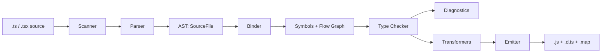
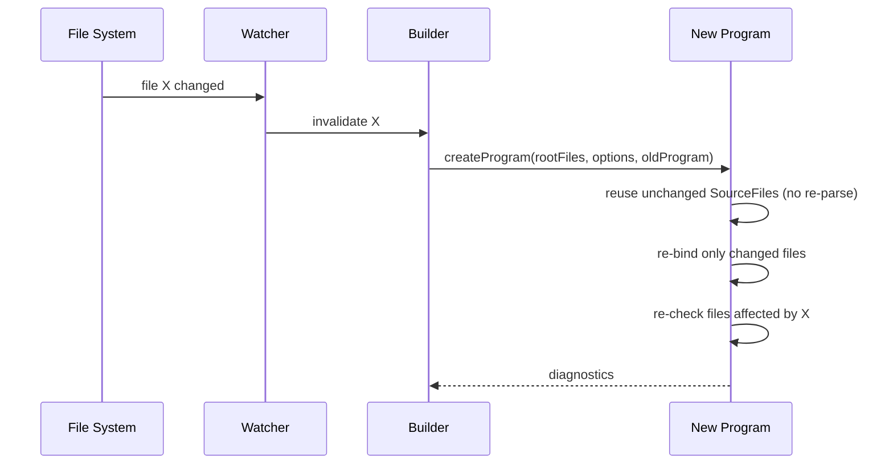

# tsc (the TypeScript Compiler) — Professional / Under the Hood

## Table of Contents

1. [Overview](#overview)
2. [The tsc Pipeline](#the-tsc-pipeline)
3. [Phase 1 — Scanner / Lexer](#phase-1--scanner--lexer)
4. [Phase 2 — Parser → AST](#phase-2--parser--ast)
5. [Phase 3 — Binder](#phase-3--binder)
6. [Phase 4 — Type Checker](#phase-4--type-checker)
7. [Phase 5 — Transformer & Emitter](#phase-5--transformer--emitter)
8. [The Program Object](#the-program-object)
9. [How Watch Reuses Program State](#how-watch-reuses-program-state)
10. [How Incremental Reuses Program State](#how-incremental-reuses-program-state)
11. [`.tsbuildinfo` Internals](#tsbuildinfo-internals)
12. [Build Mode Orchestration Internals](#build-mode-orchestration-internals)
13. [Caches Inside the Checker](#caches-inside-the-checker)
14. [What `--generateTrace` Actually Records](#what---generatetrace-actually-records)
15. [Module Resolution Inside the Program](#module-resolution-inside-the-program)
16. [Diagnostics: Syntactic vs. Semantic](#diagnostics-syntactic-vs-semantic)
17. [The Recursion Guards in the Checker](#the-recursion-guards-in-the-checker)
18. [Why `isolatedModules` and `verbatimModuleSyntax` Exist](#why-isolatedmodules-and-verbatimmodulesyntax-exist-internals-view)
19. [Practical Implications](#practical-implications)
20. [Test](#test)
21. [Summary](#summary)
22. [Further Reading](#further-reading)

---

## Overview

This document explains what happens *inside* `tsc` when you run it. Understanding the pipeline — scanner → parser → binder → checker → emitter — and how watch/incremental/build modes reuse pieces of that pipeline lets you reason precisely about build performance, cache behavior, and why certain errors appear where they do.

The TypeScript compiler is a single, mostly-functional codebase (`src/compiler/` in the `microsoft/TypeScript` repo). Its public entry point for tooling is the `ts` namespace; `tsc` itself is a thin CLI (`tsc.js`) that wires the CLI arguments into the compiler API and prints diagnostics.

---

## The tsc Pipeline



| Phase | Input | Output | Dominant cost? |
|-------|-------|--------|----------------|
| Scanner | characters | tokens | low |
| Parser | tokens | AST (`SourceFile`) | low–medium |
| Binder | AST | symbols, scopes, flow nodes | low |
| Checker | AST + symbols | types, diagnostics | **high** (usually) |
| Emitter | AST (+ transforms) | JS/`.d.ts`/maps | low–medium |

The checker dominates because it is **lazy and on-demand**: types are computed only when needed, but assignability and instantiation can fan out enormously for generic-heavy code.

---

## Phase 1 — Scanner / Lexer

The scanner (`scanner.ts`) reads the raw source text and produces a stream of **tokens** — keywords, identifiers, punctuation, literals, comments, and trivia (whitespace/newlines). It is hand-written for speed and is re-entrant: the parser pulls tokens one at a time rather than the scanner producing a full array up front.

Key properties:

- **Trivia handling:** whitespace and comments are "trivia" attached around tokens, preserved so the emitter and formatters can reproduce/adjust them.
- **Rescanning:** some tokens are context-dependent (e.g., `<` could begin a type argument list or be a less-than operator; `/` could be division or a regex). The parser asks the scanner to *rescan* in the correct context.
- **Unicode-aware:** identifier scanning follows the ECMAScript identifier rules.

```typescript
// Conceptually, scanning "let x = 1;" yields:
// [LetKeyword] [Identifier "x"] [EqualsToken] [NumericLiteral "1"] [SemicolonToken]
```

The scanner is rarely a bottleneck, but it runs over every character of every included file, which is why pruning the file set (`include`/`exclude`, `skipLibCheck`) matters.

---

## Phase 2 — Parser → AST

The parser (`parser.ts`) is a hand-written recursive-descent parser that turns tokens into an **abstract syntax tree** rooted at a `SourceFile` node. Each node is a `ts.Node` with a `kind` (a `SyntaxKind` enum value), child references, and source position (`pos`/`end`).

Notable design points:

- **Error recovery:** the parser never throws on malformed input; it produces a "best effort" tree with error nodes so the rest of the pipeline can still run and report multiple errors at once.
- **Incremental re-parsing:** given an old `SourceFile` and a text change range, the parser can reuse unaffected subtrees (`updateSourceFile`). This is foundational for watch mode's speed.
- **No types yet:** the AST is purely syntactic. `const x: Foo = ...` parses `Foo` as a type reference node, but nothing knows what `Foo` *is* yet.

```typescript
// AST shape (simplified) for: const x: number = 1;
// VariableStatement
//   VariableDeclarationList (const)
//     VariableDeclaration
//       name: Identifier "x"
//       type: TypeReference -> KeywordType "number"
//       initializer: NumericLiteral "1"
```

---

## Phase 3 — Binder

The binder (`binder.ts`) walks the AST and builds the **symbol table** and **control-flow graph** — without computing any types.

What the binder does:

1. **Creates symbols.** A *symbol* represents a named entity (variable, function, class, interface, parameter). The binder links every declaration to a symbol and merges declarations that share a name and scope (this is how interface declaration merging and namespace merging work).
2. **Builds scopes.** Each container (source file, function, block, class) gets a symbol table mapping names → symbols, establishing lexical scope.
3. **Builds the flow graph.** The binder attaches **flow nodes** to expressions, encoding branches, loops, assignments, and narrowing points. This graph is what the checker later walks to perform control-flow-based narrowing (e.g., knowing `x` is `string` after `if (typeof x === "string")`).

```typescript
function f(x: string | null) {
  if (x === null) return;     // binder records a flow branch here
  x.toUpperCase();            // checker uses the flow node to narrow x to string
}
```

The binder is cheap, but it produces the structures that make the checker's narrowing possible.

---

## Phase 4 — Type Checker

The checker (`checker.ts`, the largest file in the compiler) is where types come into existence. It is fundamentally **lazy**: it computes the type of a symbol only when something asks for it, memoizing the result.

Core operations:

- **`getTypeOfSymbol`** — resolves a declaration to a `Type` object (with caching).
- **`checkExpression` / `checkSourceFile`** — walks the AST, computing and validating types, producing diagnostics.
- **Assignability (`isTypeAssignableTo` → `checkTypeRelatedTo`)** — the heart of structural typing: is `S` assignable to `T`? Walks members recursively, with extensive caching to avoid re-deriving the same relation.
- **Generic instantiation** — substituting type arguments into a generic's body, producing a new `Type`. Heavy generic code triggers many instantiations; this is the cost the `Instantiations` counter measures.
- **Inference** — solving for unspecified type parameters by collecting candidates from arguments and contextual types, then choosing a best common type.
- **Narrowing** — using the flow graph from the binder to refine a declared type within a branch.

```typescript
function identity<T>(value: T): T { return value; }
const r = identity("hi");
// inference: collect candidate T = "hi" (literal) -> widen to string in this context
// instantiate identity with T = string -> r: string
```

Why it is the bottleneck: assignability and instantiation can recurse deeply for complex conditional/mapped types and large unions. The checker mitigates this with multiple caches (see [Caches Inside the Checker](#caches-inside-the-checker)) and recursion guards that bail out with `any`-like behavior or an error (`TS2589: Type instantiation is excessively deep and possibly infinite`).

---

## Phase 5 — Transformer & Emitter

If emit is enabled, the checker's results feed a chain of **transformers** that lower the AST, followed by the **emitter** that prints text.

1. **Transformers** (`transformers/*.ts`): each handles a concern — down-leveling to the `target` (e.g., `async/await` → state machines for ES5), module transformation (ESM ↔ CommonJS per `module`), JSX transformation, decorator emit, and **type erasure** (removing annotations, interfaces, type-only imports).
2. **Emitter** (`emitter.ts`): writes the final `.js` text, plus `.js.map` source maps, plus — separately — the **declaration emitter** that produces `.d.ts` by printing only the type-relevant surface of each declaration.

```typescript
// Source (target: ES2015)
const greet = (name: string): string => `Hi ${name}`;

// Emitted JS (types erased, arrow preserved at ES2015)
const greet = (name) => `Hi ${name}`;
```

Declaration emit can itself require type computation (to write inferred types into `.d.ts`), which is why libraries that emit `.d.ts` may be slower than apps that only check.

---

## The Program Object

A `Program` (`program.ts`) ties everything together: the set of root files, the resolved options, the file→`SourceFile` map, module resolution results, and access to a `TypeChecker`. Creating a `Program`:

1. Resolves root files from `tsconfig` (`files`/`include`/`exclude`).
2. Resolves every `import`/`/// <reference>` to a file (module resolution), pulling in `.d.ts` from `node_modules` and the `lib` files.
3. Parses each file into a `SourceFile` (reusing old ones when possible).
4. Binds each file.
5. Lazily creates a `TypeChecker` bound to this program.

The `Program` is the **unit of reuse**. Watch, incremental, and build modes are all strategies for *reconstructing a new Program cheaply* from a previous one.

---

## How Watch Reuses Program State

Watch mode is built around a **`WatchProgram`** and a "builder" that holds the previous `Program`. On a file change:



Reuse mechanics:

- **Unchanged `SourceFile`s are reused verbatim** — no re-scan, no re-parse, no re-bind. The new `Program` shares the old node objects.
- **Changed files are re-parsed** (often incrementally via `updateSourceFile`), re-bound, and re-checked.
- **Affected files** (those importing a changed file, where the change altered the public surface) are re-checked. The builder computes this "affected set" so it does not re-check the entire program.
- The `TypeChecker` itself is recreated, but because most `SourceFile`s and their symbols are shared, much of the expensive resolution is effectively warm.

This is why watch mode's *subsequent* compilations are far faster than the cold start: the cold start parses/binds everything; later passes touch a small affected set.

---

## How Incremental Reuses Program State

Incremental mode (`incremental: true`, used by both `tsc --incremental` and `tsc --build`) persists enough state to disk so that a **fresh process** — not just a long-running watcher — can skip unchanged work.

The mechanism centers on **file signatures**:

- After a build, `tsc` computes a **signature** for each file's emitted `.d.ts` (its public type surface), plus version stamps for source files.
- It records, per file, the diagnostics and the dependency relationships ("which files reference which").
- On the next run, `tsc` compares current file versions to stored ones. A file whose source is unchanged is skipped. A file whose *source* changed is re-checked; whether its **`.d.ts` signature** changed determines whether *downstream* files must also be re-checked.

The crucial optimization: if you edit a function **body** but not its **signature**, the file's `.d.ts` signature is unchanged, so **dependents are not re-checked**. If you change a function's **return type**, the signature changes and dependents are invalidated.

```typescript
// Editing the BODY only -> .d.ts signature unchanged -> dependents skipped
export function area(r: number): number {
  return Math.PI * r * r;   // change this math; dependents need not re-check
}

// Editing the SIGNATURE -> .d.ts signature changed -> dependents re-checked
export function area(r: number): string { /* ... */ }
```

---

## `.tsbuildinfo` Internals

`.tsbuildinfo` is a JSON file (not meant for hand-editing) that stores the persisted incremental state. Conceptually it contains:

| Section | Purpose |
|---------|---------|
| **File names list** | An ordered list of every file in the program; other sections index into it |
| **File info / versions** | Per-file version hash + the file's own signature |
| **Options** | The exact `compilerOptions` used — compared on next run to decide cache validity |
| **Reference graph** | `referencedMap` / `exportedModulesMap`: which files depend on which |
| **Signatures** | Per-file `.d.ts` signature (emit signature) used to decide downstream invalidation |
| **Semantic diagnostics per file** | Cached errors so unchanged files report instantly without re-checking |
| **Affected-files state** | Bookkeeping for which files still need processing if a previous run was interrupted |

How `tsc` uses it on the next run:

1. **Validate options.** If stored `compilerOptions` differ from current, the whole cache is discarded — this is why changing an option always triggers a rebuild and you never get stale-option results.
2. **Compare file versions.** Build the set of changed files.
3. **Propagate via signatures.** For each changed file, re-emit/re-check; if its `.d.ts` signature changed, add its dependents to the work set; repeat until fixpoint.
4. **Reuse cached diagnostics** for everything untouched.

```jsonc
// Illustrative shape (real format is version-specific and minified):
{
  "program": {
    "fileNames": ["./src/a.ts", "./src/b.ts"],
    "fileInfos": [{ "version": "h1", "signature": "s1" }, { "version": "h2", "signature": "s2" }],
    "referencedMap": { "./src/b.ts": ["./src/a.ts"] },
    "semanticDiagnosticsPerFile": [],
    "options": { "target": 9, "strict": true, "outDir": "./dist" }
  },
  "version": "5.4.5"
}
```

> Because correctness is gated on the stored options and per-file versions, a stale or partial `.tsbuildinfo` can only ever cause **redundant work**, never **wrong results**. That is what makes it safe to cache aggressively in CI.

---

## Build Mode Orchestration Internals

`tsc --build` adds a **solution builder** on top of the incremental machinery. It:

1. **Loads the reference graph** from each project's `references` and topologically sorts it (erroring on cycles, `TS6202`).
2. For each project, in order, decides **up-to-date status** by comparing input file timestamps, output timestamps, and the project's `.tsbuildinfo`. Statuses include `UpToDate`, `OutOfDateWithSelf`, `OutOfDateWithUpstream`, and `OutputMissing`.
3. **Builds only out-of-date projects.** Crucially, downstream projects type-check against upstream **`.d.ts`** (already on disk), not upstream source — so building `core` does not re-process `utils`'s implementation.
4. Writes/updates each project's `.tsbuildinfo`.

```
[verbose] Project 'utils' is out of date because oldest output is older than newest input
[verbose] Building project 'utils'...
[verbose] Project 'core' is out of date because output 'core/.tsbuildinfo' is older than input from 'utils'
[verbose] Building project 'core'...
[verbose] Project 'app' is up to date with .d.ts from its dependencies
```

The `--verbose` flag literally prints the up-to-date reasoning; `--dry` runs the status computation and stops before building.

---

## Caches Inside the Checker

The checker maintains several caches that determine real-world performance:

| Cache | What it stores | Why it matters |
|-------|----------------|----------------|
| Symbol type cache | type of each symbol once computed | avoids recomputing `getTypeOfSymbol` |
| Assignability/relation caches | results of `S relates to T` | structural checks are expensive; reuse is huge |
| Instantiation cache | generic instantiations keyed by type args | avoids re-instantiating the same generic |
| Subtype/identity/superset caches | finer-grained relation results | speed up union/intersection comparisons |

The `--extendedDiagnostics` output prints the sizes of these caches. Patterns that defeat caching — e.g., constructing a *fresh* large object type at every call site, or deeply recursive conditional types that produce unique instantiations — are exactly what shows up as high `Instantiations` and long `Check time`.

```typescript
// Cache-friendly: a NAMED type is instantiated once and reused
type Parsed<T> = { [K in keyof T]: T[K] };
function parse<T>(x: T): Parsed<T> { return x as Parsed<T>; }

// Cache-hostile: inlining a complex mapped type in many positions
function parse2<T>(x: T): { [K in keyof T]: T[K] } { return x as any; }
```

---

## What `--generateTrace` Actually Records

`--generateTrace traceDir` instruments the compiler to emit Chrome-tracing events for major operations: `createProgram`, `bindSourceFile`, `checkSourceFile`, `checkExpression`, `structuredTypeRelatedTo`, `instantiateType`, and emit phases. Each event has a name, timestamp, and duration; nested events form a flame graph.

```bash
tsc --noEmit --generateTrace .trace
ls .trace
# trace.json   types.json
```

- **`trace.json`** — the event log; load in `chrome://tracing`, Perfetto, or feed to `@typescript/analyze-trace`.
- **`types.json`** — metadata about types referenced in the trace, so analyzers can name the expensive types.

`analyze-trace` correlates long-duration `check`/`relate`/`instantiate` spans with `types.json` to tell you, in plain text, which expression and which type are costing the most milliseconds — turning a raw flame graph into an actionable hot-spot list.

---

## Practical Implications

1. **Edit bodies, not signatures, to keep rebuilds cheap.** Incremental invalidation propagates via `.d.ts` signatures; body-only edits don't ripple downstream.
2. **Name your complex types.** Named type aliases are instantiated once and cached; inlined complex types fan out instantiations.
3. **`skipLibCheck` removes a large, mostly-constant slice of work** by skipping the bind/check of `node_modules` `.d.ts`.
4. **`isolatedModules` keeps single-file transpilers honest** because emit per-file cannot rely on cross-file type info; the checker enforces this so esbuild/swc output stays correct.
5. **Project references shrink the affected set.** Smaller programs mean smaller invalidation blast radius.
6. **Trust `.tsbuildinfo` in CI** — option/version gating guarantees correctness; cache it for warm builds.

---

## Module Resolution Inside the Program

Before any checking can happen, the `Program` must turn every `import`/`require`/`/// <reference>` into a concrete file on disk. This is **module resolution**, governed by `moduleResolution` (`node10`, `node16`, `nodenext`, `bundler`).

For each import specifier, the resolver:

1. Classifies it as **relative** (`./x`, `../y`) or **bare** (`react`, `@scope/pkg`).
2. For relative, probes the path with the candidate extensions and index files allowed by the mode.
3. For bare, walks up `node_modules` directories, and — under modern modes — consults the package's `package.json` `exports`/`imports`/`types`/`typesVersions` fields to find the declaration entry point.
4. Records the resolved file (or a failure) and pulls the resolved `.d.ts`/`.ts` into the program.

```bash
# See every resolution decision the compiler makes
tsc --noEmit --traceResolution
```

```
======== Resolving module 'pg' from '/app/src/db.ts'. ========
Module resolution kind is set to 'NodeNext'.
File '/app/node_modules/pg/package.json' exists - using it.
'exports' field found, looking for 'types' condition...
Resolved 'pg' to '/app/node_modules/pg/lib/index.d.ts'.
========================================================
```

Resolution results are cached per directory so the same specifier is not re-resolved repeatedly. A misconfigured `moduleResolution` or a package missing a `types` condition manifests as `TS2307`, and `--traceResolution` is the way to see exactly where the lookup diverged from expectation. Resolution work is part of `Program` construction and therefore part of the cold-start cost that incremental modes try to avoid repeating.

---

## Diagnostics: Syntactic vs. Semantic

`tsc` produces diagnostics at two distinct stages, and the distinction matters for incremental caching:

| Kind | Produced by | Example | Cached in `.tsbuildinfo`? |
|------|-------------|---------|---------------------------|
| **Syntactic** | parser | `';' expected`, unterminated string | Implicitly (re-parse only changed files) |
| **Semantic** | checker | `TS2345` type mismatch, `TS2531` possibly null | Yes — per file (`semanticDiagnosticsPerFile`) |

Because semantic diagnostics are cached **per file**, an unchanged file can report its previous errors instantly without re-running the checker on it. This is why a warm incremental run can still surface the full error list even though it only actually *checked* the changed/affected files — the rest of the errors come straight from the cache. The checker also distinguishes **global** diagnostics (option errors, ambient declaration conflicts) that are not tied to a single file.

---

## The Recursion Guards in the Checker

The checker must terminate even on pathological types. It uses depth limits and cycle detection:

- **Instantiation depth limit** — when a generic instantiation recurses beyond a threshold, the checker reports `TS2589: Type instantiation is excessively deep and possibly infinite` rather than looping forever.
- **Relation cycle detection** — while determining whether `S` relates to `T`, the checker may need to check sub-relations that reference the original pair. It tracks in-progress relations and assumes success for a recursive sub-goal (a standard coinductive trick) to break the cycle.
- **Variance computation caching** — for generic type references, the checker computes and caches the variance of each type parameter so assignability of instantiations can short-circuit.

```typescript
// Triggers the depth guard: each level wraps the previous in another array
type Inf<T> = [Inf<T>];          // unbounded
// type Bad = Inf<number>;       // TS2589 if forced to fully instantiate
```

These guards are why a single bad type can cause an *error* instead of a hang — and why they show up as long spans in `--generateTrace`: the compiler spends real time pushing toward the limit before bailing out.

---

## Why `isolatedModules` and `verbatimModuleSyntax` Exist (Internals View)

Single-file transpilers (esbuild, swc, Babel) see one file at a time and have **no type information**. Two TypeScript features depend on whole-program type info, which such tools cannot reproduce:

1. **Type-only import elision.** `tsc` knows whether an imported name is used only as a type and can drop the import from emit. A single-file transpiler cannot know this, so it might keep or drop the wrong imports.
2. **`const enum` inlining.** `tsc` inlines `const enum` member values at use sites using cross-file knowledge. A single-file tool can't.

```typescript
// verbatimModuleSyntax forces you to mark type-only imports explicitly,
// so a single-file transpiler always elides the right thing:
import type { User } from "./types";   // guaranteed erased
import { save } from "./db";           // guaranteed kept
```

`isolatedModules: true` makes the checker **reject** constructs that a single-file transpiler would get wrong, guaranteeing that bundler output stays correct. This is the internal reason the senior-level "bundler emits, tsc checks" split is safe.

---

## Test

### Multiple Choice

**1. Which phase builds the control-flow graph used for narrowing?**

- A) Scanner
- B) Parser
- C) Binder
- D) Emitter

<details>
<summary>Answer</summary>
**C)** — the binder attaches flow nodes to the AST; the checker later walks them to narrow types.
</details>

### True or False

**2. Editing only a function body invalidates all files that import it.**

<details>
<summary>Answer</summary>
**False** — if the public `.d.ts` signature is unchanged, dependents are not re-checked. Only signature changes ripple downstream.
</details>

### What's the Output?

**3. What two files does `--generateTrace` produce?**

<details>
<summary>Answer</summary>
`trace.json` (event log) and `types.json` (type metadata).
</details>

**4. Why can a stale `.tsbuildinfo` never produce wrong results?**

<details>
<summary>Answer</summary>
`tsc` validates the stored `compilerOptions` and per-file versions; any mismatch discards/invalidates the cache, so the worst case is redundant rebuilding, not incorrect output.
</details>

**5. Why is the checker usually the bottleneck and not the emitter?**

<details>
<summary>Answer</summary>
Assignability checks and generic instantiation recurse deeply for complex generic/union types, fanning out far more work than the linear emit phase.
</details>

**6. Where do semantic diagnostics live so an unchanged file can report errors without re-checking?**

<details>
<summary>Answer</summary>
In `.tsbuildinfo` under `semanticDiagnosticsPerFile` — cached per file, so warm runs replay them without re-running the checker on unchanged files.
</details>

**7. What error does the instantiation depth guard produce, and why does it exist?**

<details>
<summary>Answer</summary>
`TS2589: Type instantiation is excessively deep and possibly infinite`. It exists so a recursive/effectively-infinite type produces an error instead of hanging the compiler.
</details>

---

## Mapping Internals to the CLI

A consolidated view of how each internal phase surfaces through `tsc` flags — useful for diagnosing where a problem lives.

| Internal phase / structure | Observe it with | What you learn |
|----------------------------|-----------------|----------------|
| Program construction / file set | `--listFiles`, `--explainFiles` | Which files are in the program and why |
| Module resolution | `--traceResolution` | Where each import resolved (or failed) |
| Resolved options (`extends` merge) | `--showConfig` | The effective configuration |
| Phase timings (parse/bind/check/emit) | `--diagnostics` | Which phase dominates |
| Checker caches + instantiations | `--extendedDiagnostics` | Whether expensive generics are the cost |
| Per-operation flame graph | `--generateTrace` + analyze-trace | The exact expression/type costing time |
| Build-mode up-to-date logic | `--build --verbose`, `--build --dry` | Why each project is (not) rebuilt |
| Incremental state | the `.tsbuildinfo` file | Persisted versions/signatures/diagnostics |

The throughline: nearly every internal mechanism has a CLI window into it. When a build is slow or behaves oddly, the workflow is to move *down* this table from the cheap, high-level views (`--diagnostics`, `--showConfig`) to the expensive, precise ones (`--generateTrace`).

---

## Summary

- The pipeline is **scanner → parser → binder → checker → (transformers →) emitter**, tied together by a `Program`.
- The **binder** creates symbols and the flow graph; the **checker** lazily computes types and is the dominant cost.
- **Watch** reuses unchanged `SourceFile`s from the old `Program` and re-checks only the affected set.
- **Incremental** persists file versions and `.d.ts` signatures to `.tsbuildinfo`, so body-only edits don't ripple and a fresh process can skip unchanged work.
- **`.tsbuildinfo`** stores file infos, options, the reference graph, signatures, and cached diagnostics; option/version gating makes it always-safe.
- **Build mode** layers a solution builder that computes per-project up-to-date status and checks downstream against upstream `.d.ts`.

**Next step:** Specification — the official `tsc` CLI and compiler-options reference, edge cases, and version history.

---

## Further Reading

- **Source:** [microsoft/TypeScript `src/compiler`](https://github.com/microsoft/TypeScript/tree/main/src/compiler)
- **Wiki:** [Architectural Overview](https://github.com/microsoft/TypeScript/wiki/Architectural-Overview)
- **Wiki:** [Using the Compiler API](https://github.com/microsoft/TypeScript/wiki/Using-the-Compiler-API)
- **Wiki:** [Performance Tracing](https://github.com/microsoft/TypeScript/wiki/Performance-Tracing)
