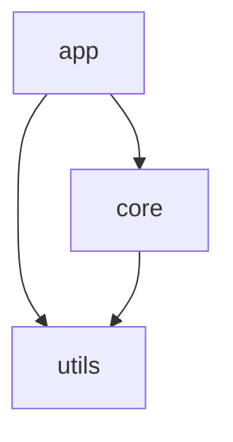
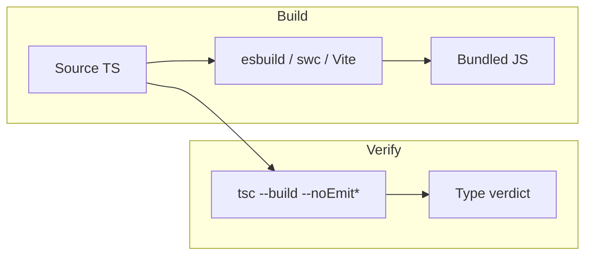
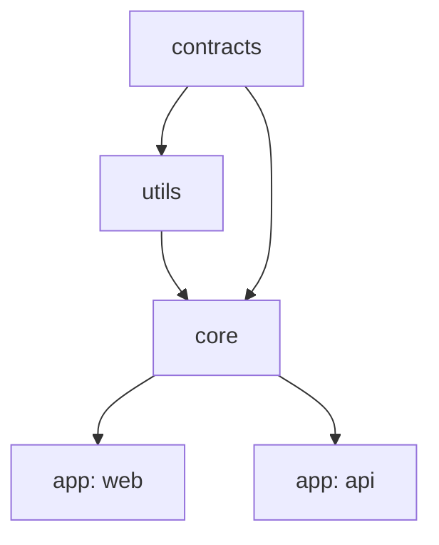

# tsc (the TypeScript Compiler) — Senior Level

## Table of Contents

1. [Responsibilities at This Level](#responsibilities-at-this-level)
2. [Build Mode (`--build` / `-b`)](#build-mode---build---b)
3. [Project References at Scale](#project-references-at-scale)
4. [Incremental Builds & `.tsbuildinfo`](#incremental-builds--tsbuildinfo)
5. [The tsc vs. Bundler Type-Checking Split](#the-tsc-vs-bundler-type-checking-split)
6. [Build Performance Diagnostics](#build-performance-diagnostics)
7. [`--generateTrace` and analyze-trace](#--generatetrace-and-analyze-trace)
8. [Designing a Monorepo Build Graph](#designing-a-monorepo-build-graph)
9. [CI Strategy for Large Repos](#ci-strategy-for-large-repos)
10. [Declaration Emit Strategy](#declaration-emit-strategy)
11. [Coding Patterns](#coding-patterns)
12. [Best Practices](#best-practices)
13. [Edge Cases & Pitfalls](#edge-cases--pitfalls)
14. [Common Mistakes](#common-mistakes)
15. [Tricky Points](#tricky-points)
16. [Test](#test)
17. [Senior Checklist](#senior-checklist)
18. [Summary](#summary)
19. [Further Reading](#further-reading)

---

## Responsibilities at This Level

- Own the TypeScript build architecture for a multi-package repository.
- Choose where `tsc` checks vs. where a bundler emits, and enforce that split in CI.
- Configure project references, `composite` builds, and incremental caching so full-repo checks stay fast.
- Diagnose slow type-checking with `--diagnostics`, `--extendedDiagnostics`, and `--generateTrace`.
- Define declaration-emit strategy for published packages and internal consumers.
- Keep cold and warm build times within agreed budgets as the codebase grows.

---

## Build Mode (`--build` / `-b`)

`tsc --build` (alias `-b`) is a distinct mode from plain `tsc`. Plain `tsc` compiles **one** program. Build mode orchestrates **many** programs connected by project references, computes a dependency graph, and rebuilds only the packages that are stale — in topological order.

```bash
# Build a project and everything it references, in dependency order
tsc --build packages/app

# Build the whole graph from the root solution config
tsc --build

# Common build-mode-only flags
tsc --build --verbose      # log why each project is or isn't rebuilt
tsc --build --dry          # show what WOULD be built, build nothing
tsc --build --force        # rebuild everything, ignore .tsbuildinfo
tsc --build --clean        # delete all build outputs and .tsbuildinfo
tsc --build --watch        # build mode + watch
```

Build mode requires every referenced project to be **composite** (`composite: true`), which forces `declaration: true` and makes `.tsbuildinfo` mandatory. The compiler uses the emitted `.d.ts` of upstream packages — not their source — to type-check downstream packages. That is the core speed win.

Sample `--verbose` output:

```
[10:30:01] Projects in this build:
    * packages/utils/tsconfig.json
    * packages/core/tsconfig.json
    * packages/app/tsconfig.json

[10:30:01] Project 'packages/utils' is out of date because output
           'utils/dist/index.js' is older than input 'utils/src/x.ts'
[10:30:01] Building project 'packages/utils'...
[10:30:02] Project 'packages/core' is up to date with .d.ts from its dependencies
[10:30:02] Project 'packages/app' is up to date
```

---

## Project References at Scale

Project references split a large codebase into independently-checkable units. Each package declares what it depends on; build mode resolves the order.

### A three-package layout

```json
// packages/utils/tsconfig.json
{
  "compilerOptions": {
    "composite": true,
    "declaration": true,
    "declarationMap": true,
    "outDir": "dist",
    "rootDir": "src"
  },
  "include": ["src"]
}
```

```json
// packages/core/tsconfig.json
{
  "compilerOptions": {
    "composite": true,
    "declaration": true,
    "declarationMap": true,
    "outDir": "dist",
    "rootDir": "src"
  },
  "references": [{ "path": "../utils" }],
  "include": ["src"]
}
```

```json
// packages/app/tsconfig.json
{
  "compilerOptions": {
    "composite": true,
    "outDir": "dist",
    "rootDir": "src"
  },
  "references": [
    { "path": "../core" },
    { "path": "../utils" }
  ],
  "include": ["src"]
}
```

### A "solution" config at the root

A root config with **no files of its own** that only references the leaves lets you build everything with one command:

```json
// tsconfig.json (root solution file)
{
  "files": [],
  "references": [
    { "path": "packages/utils" },
    { "path": "packages/core" },
    { "path": "packages/app" }
  ]
}
```

```bash
tsc --build        # builds utils -> core -> app in order, skipping up-to-date ones
```

### Why this scales

- **Isolation:** a change in `app` does not force a re-check of `utils`.
- **Parallelism:** independent packages can be built concurrently (with external orchestrators like Turborepo / Nx, or by sharding CI).
- **Caching:** each package has its own `.tsbuildinfo`, so warm builds skip unchanged packages entirely.



---

## Incremental Builds & `.tsbuildinfo`

Incremental compilation persists the result of a build to a `.tsbuildinfo` file so the next run can skip unchanged work.

```json
{
  "compilerOptions": {
    "incremental": true,
    "tsBuildInfoFile": "./.cache/tsconfig.tsbuildinfo"
  }
}
```

```bash
# Single-program incremental (non build-mode)
tsc --incremental --noEmit

# First run: full work, writes .tsbuildinfo
# Subsequent no-change runs: a fraction of the time
```

Two flavors:

| Mode | How it caches |
|------|---------------|
| `tsc --incremental` | One program; one `.tsbuildinfo`; skips re-checking unchanged files |
| `tsc --build` | Many programs; one `.tsbuildinfo` per project; skips whole up-to-date projects |

`.tsbuildinfo` stores file hashes/signatures, the resolved file list, the options used, and per-file diagnostic state. If you change a compiler option, the stored options no longer match and `tsc` correctly invalidates and rebuilds.

### CI caching

The biggest CI win is **persisting `.tsbuildinfo` between runs**:

```yaml
      - name: Cache tsbuildinfo
        uses: actions/cache@v4
        with:
          path: |
            **/*.tsbuildinfo
          key: tsbuild-${{ hashFiles('**/package-lock.json') }}-${{ github.sha }}
          restore-keys: tsbuild-${{ hashFiles('**/package-lock.json') }}-
      - run: npx tsc --build
```

A restored cache turns a cold full-repo check into a near-instant incremental one for PRs that touch few packages.

> Gotcha: if the cache key is too coarse, a stale `.tsbuildinfo` can either be ignored (safe, just slow) — `tsc` validates options and signatures, so it never produces wrong results from a stale cache. Worst case is a redundant rebuild.

---

## The tsc vs. Bundler Type-Checking Split

At scale, the most important architectural decision is **who checks and who emits**.



| Job | Best tool | Why |
|-----|-----------|-----|
| Transpile/bundle JS | esbuild, swc, Vite, Rollup | 10–100× faster; they only strip types |
| Type checking | `tsc` | The only complete, correct type checker |
| `.d.ts` generation | `tsc` (or `tsc`-based: api-extractor, rollup-plugin-dts) | Bundlers historically can't, or do it imperfectly |

Key consequences:

- **`isolatedModules: true`** — enforce that every file is independently transpilable, so esbuild/swc (which see one file at a time) never break on constructs that require type information (e.g., `const enum`, certain re-exports). `tsc` will flag offending patterns.
- **`verbatimModuleSyntax: true`** — make import/export elision explicit so single-file transpilers handle `import type` correctly.
- The split means a fast `vite dev` for iteration, plus a `tsc --build` (often `--noEmit` for app packages, real emit for library packages) for correctness in CI and pre-merge.

```json
// app package: bundler emits, tsc only checks
{
  "compilerOptions": {
    "noEmit": true,
    "isolatedModules": true,
    "verbatimModuleSyntax": true,
    "skipLibCheck": true
  }
}
```

> Note: a project with `noEmit: true` cannot be `composite` (composite requires declaration emit). For app leaves you often keep them non-composite and let the bundler build them, while library packages stay composite for `.d.ts`.

---

## Build Performance Diagnostics

`tsc` exposes built-in timing breakdowns. Use them before reaching for traces.

### `--diagnostics`

```bash
tsc --noEmit --diagnostics
```

```
Files:                         512
Lines:                      198431
Identifiers:                201233
Symbols:                    412900
Types:                       88123
Memory used:               412331K
I/O read:                    0.21s
I/O write:                   0.00s
Parse time:                  0.88s
Bind time:                   0.41s
Check time:                  4.92s   <-- usually the dominant cost
Emit time:                   0.00s
Total time:                  6.22s
```

### `--extendedDiagnostics`

Adds finer-grained counters: number of type instantiations, assignability cache hits, subtype/identity cache sizes, and more.

```bash
tsc --noEmit --extendedDiagnostics
```

```
Instantiations:           1248903   <-- huge numbers signal expensive generics
Assignability cache size:  204113
Identity cache size:        18002
Subtype cache size:         44211
...
Check time:                  4.92s
```

A very high **Instantiations** count almost always points at a few deeply recursive conditional/mapped types being instantiated thousands of times. That is your optimization target.

---

## `--generateTrace` and analyze-trace

When counters tell you *that* checking is slow but not *where*, generate a trace.

```bash
tsc --noEmit --generateTrace traceDir
```

This writes `trace.json` (a Chrome-tracing event log) and `types.json` (type metadata). Two ways to analyze:

```bash
# 1) Automated hot-spot report
npx @typescript/analyze-trace traceDir
```

```
Hot spots
  Check file src/schema.ts (1.84s)
    Check expression at src/schema.ts:88:12 (1.40s)
      Compare types DeepPartial<HugeSchema> and ... (1.31s)
```

```bash
# 2) Manual: open chrome://tracing (or Perfetto) and load trace.json
#    Look for wide "checkSourceFile" / "structuredTypeRelatedTo" spans.
```

Typical findings and fixes:

| Hot spot | Fix |
|----------|-----|
| Deep recursive `DeepPartial`/`DeepReadonly` on big schemas | Bound recursion depth; or generate flat types |
| Huge union (100+ members) compared repeatedly | Use a discriminant; split into smaller unions |
| Re-instantiating a generic in many return positions | Assign to a named type alias so the result is cached |
| `node_modules` `.d.ts` dominating | Enable `skipLibCheck` |

---

## Designing a Monorepo Build Graph

Principles for a graph that stays fast:

1. **Few, well-defined boundaries.** Each package should have a clear public surface (`index.ts`) that becomes its `.d.ts`. Avoid deep cross-package imports into internals.
2. **Acyclic references.** Build mode requires a DAG. Cycles are a hard error (`TS6202`). Use a shared `types` or `contracts` package to break would-be cycles.
3. **Leaf apps non-composite, libraries composite.** Libraries emit `.d.ts`; apps are bundled.
4. **Stable `.d.ts` surface.** With `declarationMap: true`, downstream debuggers can jump to source even through compiled `.d.ts`.
5. **One root solution config** so `tsc --build` does the whole graph.



Anti-patterns to watch for:
- A "god" package everything references — invalidating it rebuilds the world.
- Re-exporting another package's entire surface, coupling their `.d.ts` outputs.
- App packages marked `composite` while also using `noEmit` (contradiction).

---

## CI Strategy for Large Repos

```yaml
jobs:
  typecheck:
    runs-on: ubuntu-latest
    steps:
      - uses: actions/checkout@v4
      - uses: actions/setup-node@v4
        with: { node-version: 20, cache: npm }
      - run: npm ci
      - uses: actions/cache@v4
        with:
          path: "**/*.tsbuildinfo"
          key: tsbuild-${{ hashFiles('**/package-lock.json') }}
          restore-keys: tsbuild-
      - run: npx tsc --build --pretty false
```

Scaling tactics:
- **Cache `.tsbuildinfo`** so PRs only re-check changed packages.
- **Shard by package** across runners for very large graphs; combine with Turborepo/Nx remote cache.
- **`--build --dry`** in a "what changed" job to skip the typecheck job entirely when no TS changed.
- Keep a **nightly `--build --force`** job to catch any cache-masked issues and validate from cold.

---

## Declaration Emit Strategy

For published or internally-consumed libraries, the `.d.ts` *is* your API.

```json
{
  "compilerOptions": {
    "declaration": true,
    "declarationMap": true,
    "emitDeclarationOnly": false,
    "stripInternal": true
  }
}
```

| Option | Effect |
|--------|--------|
| `declaration` | Emit `.d.ts` |
| `declarationMap` | Emit `.d.ts.map` so consumers' editors jump to your source |
| `emitDeclarationOnly` | Only types, no JS (when a bundler emits JS) |
| `stripInternal` | Drop members tagged `/** @internal */` from the public `.d.ts` |

Common pattern for a published package: bundle JS with esbuild, emit types with `tsc --emitDeclarationOnly`, then optionally roll them into a single `.d.ts` with API Extractor.

```json
{
  "scripts": {
    "build:js": "esbuild src/index.ts --bundle --format=esm --outfile=dist/index.js",
    "build:types": "tsc --emitDeclarationOnly --declaration --outDir dist",
    "build": "npm-run-all build:js build:types"
  }
}
```

---

## Coding Patterns

### Pattern 1: Solution-style root + composite leaves

Already shown above — one `tsc --build` drives the entire graph.

### Pattern 2: Check-only app, emit-only lib

```json
// libs/sdk/tsconfig.json
{ "compilerOptions": { "composite": true, "declaration": true, "outDir": "dist" } }
```

```json
// apps/web/tsconfig.json
{ "compilerOptions": { "noEmit": true, "isolatedModules": true } }
```

### Pattern 3: Trace-driven optimization loop

```bash
tsc --noEmit --generateTrace .trace
npx @typescript/analyze-trace .trace > hotspots.txt
# refactor the top hot spot, then re-measure
tsc --noEmit --extendedDiagnostics | grep -E "Instantiations|Check time"
```

---

## Best Practices

- **Use `--build` for any repo with references**; plain `tsc` cannot honor the reference graph for emit.
- **Make libraries `composite` and apps bundler-built.**
- **Persist `.tsbuildinfo` in CI** — it is the single biggest warm-build win.
- **Measure before optimizing** with `--extendedDiagnostics`, then `--generateTrace`.
- **Keep the reference graph acyclic and shallow.**
- **Enable `isolatedModules` + `verbatimModuleSyntax`** so single-file transpilers stay correct.
- **Run a cold `--build --force` nightly** to catch cache-masked regressions.

---

## Edge Cases & Pitfalls

### Pitfall 1: Plain `tsc` in a referenced repo

```bash
tsc            # does NOT build references; may error or under-build
tsc --build    # correct for project references
```

### Pitfall 2: `composite` + `noEmit`

`composite: true` requires declaration emit; combining it with `noEmit` is contradictory and errors. App leaves should not be composite if they don't emit.

### Pitfall 3: Reference cycles

```
error TS6202: Project references may not form a circular graph. Cycle detected: ...
```

**Fix:** extract a shared `contracts`/`types` package.

### Pitfall 4: Stale outputs after switching branches

Build mode keys off file timestamps and `.tsbuildinfo`. After unusual git operations, `tsc --build --clean` followed by a fresh build resolves "it says up-to-date but it's wrong."

---

## Common Mistakes

### Mistake 1: Trusting the bundler to catch type errors

A green `vite build` says nothing about types. Always pair with `tsc`.

### Mistake 2: One giant program instead of references

A single 2000-file program re-checks everything on each change. References + incremental cut that dramatically.

### Mistake 3: Optimizing the wrong thing

Spending time on emit when `--diagnostics` shows **Check time** dominates. Almost always the checker, not the emitter, is the bottleneck.

---

## Tricky Points

### Tricky Point 1: `.tsbuildinfo` is per-program

In build mode each project has its own `.tsbuildinfo`. Deleting one forces only that project to rebuild.

### Tricky Point 2: `--build --dry` is read-only

It prints the plan and exits without touching outputs — perfect for "what would change?" checks in CI gating.

### Tricky Point 3: Options changes invalidate the cache automatically

You never have to manually clear `.tsbuildinfo` after editing compiler options; `tsc` compares the stored options and rebuilds when they differ.

---

## Test

### Multiple Choice

**1. What does `tsc --build` add over plain `tsc`?**

- A) Faster emit of a single file
- B) Orchestration of a project-reference graph in dependency order
- C) Automatic bundling
- D) Running the output

<details>
<summary>Answer</summary>
**B)** — build mode resolves references, rebuilds only stale projects topologically, and manages per-project `.tsbuildinfo`.
</details>

### True or False

**2. A `composite` project can also set `noEmit: true`.**

<details>
<summary>Answer</summary>
**False** — `composite` requires declaration emit, which conflicts with `noEmit`.
</details>

### What's the Output?

**3. Which diagnostic line usually dominates `tsc --diagnostics`?**

<details>
<summary>Answer</summary>
`Check time` — type checking is almost always the heaviest phase.
</details>

**4. How do you see *why* a project is rebuilt in build mode?**

<details>
<summary>Answer</summary>
`tsc --build --verbose`.
</details>

**5. What does a very high `Instantiations` count in `--extendedDiagnostics` indicate?**

<details>
<summary>Answer</summary>
Expensive generic types (deep recursive conditional/mapped types) being instantiated many times — a prime target for `--generateTrace`.
</details>

---

## Senior Checklist

- [ ] Reference graph is acyclic; one root solution config exists.
- [ ] Libraries are `composite` with `declaration` + `declarationMap`.
- [ ] Apps are bundler-built; `tsc` checks them with `noEmit`.
- [ ] `isolatedModules` and `verbatimModuleSyntax` enabled.
- [ ] CI persists `.tsbuildinfo`; `tsc --build` runs as the gate.
- [ ] Build-perf baseline captured with `--extendedDiagnostics`.
- [ ] Hot spots investigated with `--generateTrace` + analyze-trace.

---

## Summary

- **Build mode (`--build`)** is the scale tool: it orchestrates a reference DAG, rebuilds only stale projects, and caches per project.
- **Project references + incremental + `.tsbuildinfo`** keep large repos fast; cache `.tsbuildinfo` in CI for the biggest win.
- **Split responsibilities:** bundlers emit, `tsc` checks, `tsc` emits `.d.ts`.
- **Diagnose with data:** `--diagnostics` → `--extendedDiagnostics` → `--generateTrace`; optimize the checker, not the emitter.
- Keep the graph acyclic, libraries composite, apps bundler-built.

**Next step:** Professional level — the internal tsc pipeline (scanner → parser → binder → checker → emitter), how watch/incremental reuse program state, and `.tsbuildinfo` internals.

---

## Further Reading

- **Official docs:** [Project References](https://www.typescriptlang.org/docs/handbook/project-references.html)
- **Official wiki:** [Performance](https://github.com/microsoft/TypeScript/wiki/Performance)
- **Tool:** [@typescript/analyze-trace](https://github.com/microsoft/typescript-analyze-trace)
- **Docs:** [Build mode in tsc](https://www.typescriptlang.org/docs/handbook/project-references.html#build-mode-for-typescript)
