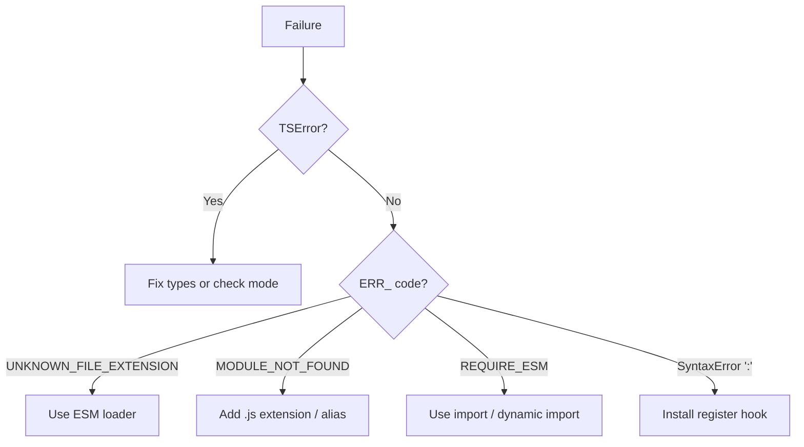

# ts-node — Find the Bug

> Difficulty legend: 🟢 Junior · 🟡 Middle · 🔴 Senior/Professional
>
> Each exercise has buggy code/config, an explanation, and a fix. Try to spot the bug before reading the solution.

## Table of Contents

1. [Bug 1 — Missing Register Hook 🟢](#bug-1--missing-register-hook-)
2. [Bug 2 — ts-node Not Installed 🟢](#bug-2--ts-node-not-installed-)
3. [Bug 3 — transpile-only Hides a Type Error 🟢](#bug-3--transpile-only-hides-a-type-error-)
4. [Bug 4 — ESM Import Missing Extension 🟡](#bug-4--esm-import-missing-extension-)
5. [Bug 5 — CJS Hook on an ESM Project 🟡](#bug-5--cjs-hook-on-an-esm-project-)
6. [Bug 6 — Path Alias Fails at Runtime 🟡](#bug-6--path-alias-fails-at-runtime-)
7. [Bug 7 — __dirname Undefined Under ESM 🟡](#bug-7--__dirname-undefined-under-esm-)
8. [Bug 8 — const enum Breaks Under swc 🔴](#bug-8--const-enum-breaks-under-swc-)
9. [Bug 9 — ts-node in Production start Script 🔴](#bug-9--ts-node-in-production-start-script-)
10. [Bug 10 — Type Error Hidden by Lazy Checking 🔴](#bug-10--type-error-hidden-by-lazy-checking-)
11. [Bug 11 — Wrong Config Module for Scripts 🟡](#bug-11--wrong-config-module-for-scripts-)
12. [Bug 12 — Unhandled Rejection Exits 0 🟡](#bug-12--unhandled-rejection-exits-0-)
13. [Bug 13 — require() Inside ESM 🔴](#bug-13--require-inside-esm-)
14. [Bug 14 — Deprecated --loader on Modern Node 🔴](#bug-14--deprecated---loader-on-modern-node-)

---

## Bug 1 — Missing Register Hook 🟢

```bash
# A test script written in TypeScript
node test/run.ts
# SyntaxError: Unexpected token ':'
```

**What is wrong?**
Plain `node` does not understand TypeScript syntax. When it hits a type annotation (`:`), it throws a syntax error. The `.ts` file was never compiled.

**Fix:**
```bash
# Preload the ts-node require hook so node can load .ts
node -r ts-node/register test/run.ts
```

Or use the `ts-node` CLI directly: `npx ts-node test/run.ts`.

---

## Bug 2 — ts-node Not Installed 🟢

```bash
npx ts-node src/app.ts
# Error: Cannot find module 'ts-node'
```

**What is wrong?**
`ts-node` (and/or `typescript`) is not installed in the project. `npx` cannot find a local copy.

**Fix:**
```bash
npm install --save-dev ts-node typescript @types/node
npx ts-node src/app.ts
```

Keep them in `devDependencies` — never `dependencies`.

---

## Bug 3 — transpile-only Hides a Type Error 🟢

```typescript
// src/price.ts — run with: ts-node --transpile-only src/price.ts
function totalCents(dollars: number): number {
  return dollars * 100;
}

// BUG: passing a string; transpile-only does NOT catch this
const total = totalCents("19.99" as any);
console.log(total); // "19.99100"? No -> "19.99" * 100 = 1999 only by luck, or NaN
```

**What is wrong?**
`--transpile-only` skips type checking, so the bad argument is not caught. At runtime `"19.99" * 100` coerces oddly (here `1999`), and other inputs produce `NaN`. The type system would have caught this in default mode.

**Fix:**
```typescript
// Remove the `as any`, run default mode OR add a separate check:
const total = totalCents(19.99);
console.log(total); // 1999
```

```json
// Always pair transpile-only with a real check
{ "scripts": { "typecheck": "tsc --noEmit" } }
```

---

## Bug 4 — ESM Import Missing Extension 🟡

```json
// package.json
{ "type": "module" }
```

```typescript
// src/main.ts
import { sum } from "./util"; // BUG: no extension
console.log(sum(2, 3));
```

```bash
ts-node --esm src/main.ts
# Error [ERR_MODULE_NOT_FOUND]: Cannot find module '.../src/util'
```

**What is wrong?**
Under ESM, relative imports require an explicit extension. TypeScript does not rewrite specifiers, and Node's ESM resolver won't guess `.ts`/`.js`.

**Fix:**
```typescript
// Use the .js extension even though the file is util.ts
import { sum } from "./util.js";
```

---

## Bug 5 — CJS Hook on an ESM Project 🟡

```json
// package.json
{ "type": "module" }
```

```bash
node -r ts-node/register src/app.ts
# TypeError [ERR_UNKNOWN_FILE_EXTENSION]: Unknown file extension ".ts"
```

**What is wrong?**
`ts-node/register` installs the CommonJS hook, but in an ESM project the entry is loaded through the ESM pipeline, which the CJS hook doesn't cover.

**Fix:**
```bash
# Use the ESM loader instead
node --loader ts-node/esm src/app.ts
# or on Node 20.6+
node --import ts-node/register/esm src/app.ts
# or simply
npx ts-node --esm src/app.ts
```

---

## Bug 6 — Path Alias Fails at Runtime 🟡

```json
// tsconfig.json
{
  "compilerOptions": {
    "baseUrl": ".",
    "paths": { "@app/*": ["src/*"] }
  }
}
```

```typescript
// src/app.ts
import { db } from "@app/db"; // type-checks fine
```

```bash
ts-node src/app.ts
# Error: Cannot find module '@app/db'
```

**What is wrong?**
TypeScript understands `paths` at compile time, but Node has no idea what `@app/db` means at runtime, and `ts-node` does not resolve `paths` by itself.

**Fix:**
```bash
npm install --save-dev tsconfig-paths
node -r ts-node/register -r tsconfig-paths/register src/app.ts
```

```json
// or via config
{ "ts-node": { "require": ["tsconfig-paths/register"] } }
```

---

## Bug 7 — __dirname Undefined Under ESM 🟡

```typescript
// src/load.ts (ESM project)
import { readFileSync } from "node:fs";
import { join } from "node:path";

// BUG: __dirname is not defined in ESM
const data = readFileSync(join(__dirname, "data.json"), "utf8");
console.log(data);
// ReferenceError: __dirname is not defined
```

**What is wrong?**
`__dirname` and `__filename` are CommonJS-only. They do not exist in ESM modules.

**Fix:**
```typescript
import { readFileSync } from "node:fs";
import { join, dirname } from "node:path";
import { fileURLToPath } from "node:url";

const __dirname = dirname(fileURLToPath(import.meta.url));
const data = readFileSync(join(__dirname, "data.json"), "utf8");
console.log(data);
```

---

## Bug 8 — const enum Breaks Under swc 🔴

```typescript
// src/colors.ts — run with: ts-node --swc src/colors.ts
const enum Color {
  Red,
  Green,
  Blue,
}

console.log(Color.Green);
// May throw or log undefined: const enum requires whole-program inlining
```

**What is wrong?**
`const enum` relies on the TypeScript compiler inlining values across files. swc (and `--transpile-only`) compile each file in isolation and cannot inline, so the enum is not emitted correctly.

**Fix:**
```typescript
// Use a regular enum or an as-const object
const Color = { Red: 0, Green: 1, Blue: 2 } as const;
type Color = (typeof Color)[keyof typeof Color];

console.log(Color.Green); // 1
```

```json
// Prevent recurrence
{ "compilerOptions": { "isolatedModules": true } }
```

---

## Bug 9 — ts-node in Production start Script 🔴

```json
// package.json
{
  "dependencies": {
    "ts-node": "^10.9.2",
    "typescript": "^5.6.0"
  },
  "scripts": {
    "start": "ts-node src/server.ts"
  }
}
```

**What is wrong?**
Two bugs: (1) `ts-node`/`typescript` are in `dependencies` and will ship to production. (2) `start` compiles TypeScript on every cold start, adding latency and shipping the compiler — type/syntax errors crash at deploy instead of failing a build.

**Fix:**
```json
{
  "devDependencies": {
    "ts-node": "^10.9.2",
    "typescript": "^5.6.0"
  },
  "scripts": {
    "build": "tsc -p tsconfig.build.json",
    "start": "node dist/server.js"
  }
}
```

---

## Bug 10 — Type Error Hidden by Lazy Checking 🔴

```typescript
// src/index.ts — the entrypoint, imports nothing from unused.ts
console.log("App started");

// src/unused.ts — has a real type error but is never imported
export const broken: number = "not a number"; // type error!
```

```bash
ts-node src/index.ts
# App started   <-- runs clean despite the error in unused.ts!
```

**What is wrong?**
`ts-node` checks lazily, per file, only as modules are imported. `unused.ts` is never imported, so its type error is never seen. Developers assume "ts-node ran, so my types are fine" — false.

**Fix:**
```bash
# Run a whole-program check; this DOES catch unused.ts
tsc --noEmit
# src/unused.ts:2:14 - error TS2322: Type 'string' is not assignable to type 'number'.
```

Make `tsc --noEmit` a CI gate; never rely on `ts-node` as your type checker.

---

## Bug 11 — Wrong Config Module for Scripts 🟡

```json
// tsconfig.json (app is ESM)
{ "compilerOptions": { "module": "ESNext" } }
```

```bash
# A maintenance script that uses lots of relative imports without extensions
ts-node --esm scripts/migrate.ts
# Error [ERR_MODULE_NOT_FOUND] for every relative import
```

**What is wrong?**
The script inherits the app's ESM module config, forcing `.js`-extension imports everywhere. The author didn't want to rewrite every import in throwaway scripts.

**Fix:**
```json
// tsconfig.scripts.json
{
  "extends": "./tsconfig.json",
  "compilerOptions": { "module": "CommonJS", "moduleResolution": "Node" }
}
```

```bash
ts-node -P tsconfig.scripts.json scripts/migrate.ts
```

Scripts now run as CommonJS — no extension friction.

---

## Bug 12 — Unhandled Rejection Exits 0 🟡

```typescript
// scripts/seed.ts
async function main(): Promise<void> {
  await seedDatabase(); // throws on failure
}

// BUG: rejection is not handled; process may exit with code 0
main();
```

**What is wrong?**
A rejected promise from `main()` is unhandled. Depending on Node/ts-node settings the process can still exit `0`, so CI thinks the seed succeeded when it failed.

**Fix:**
```typescript
main().catch((err: unknown) => {
  console.error("Seed failed:", err);
  process.exitCode = 1; // non-zero so CI detects the failure
});
```

---

## Bug 13 — require() Inside ESM 🔴

```typescript
// src/config.ts (ESM project)
// BUG: require is not defined in ESM
const pkg = require("../package.json");
console.log(pkg.version);
// ReferenceError: require is not defined
```

**What is wrong?**
`require` is a CommonJS construct and does not exist in ESM modules.

**Fix:**
```typescript
import { createRequire } from "node:module";
const require = createRequire(import.meta.url);
const pkg = require("../package.json");
console.log(pkg.version);

// Or, preferred, a JSON import attribute:
// import pkg from "../package.json" with { type: "json" };
```

---

## Bug 14 — Deprecated --loader on Modern Node 🔴

```bash
# On Node 22, in a script people copy from old blog posts
node --experimental-loader ts-node/esm src/app.ts
# (ExperimentalWarning) --experimental-loader may be removed; loaders run off-thread
```

**What is wrong?**
`--experimental-loader` / `--loader` are deprecated in favor of `--import` + `module.register()` on Node 20.6+. Old tutorials still show the loader form, which emits warnings and may break in future Node.

**Fix:**
```bash
# Modern, supported form
node --import ts-node/register/esm src/app.ts
```

Or register programmatically:
```javascript
import { register } from "node:module";
import { pathToFileURL } from "node:url";
register("ts-node/esm", pathToFileURL("./"));
```

---

## Bug 15 — preferTsExts Surprise 🟡

```text
project/
  src/
    util.ts      // the source you edited
    util.js      // a stale compiled file left over from an old build
```

```typescript
// src/app.ts
import { value } from "./util"; // CommonJS
console.log(value); // logs the STALE value from util.js, not util.ts!
```

**What is wrong?**
When both `util.ts` and `util.js` exist, the default resolution may pick the `.js` file, so your edits to `util.ts` appear to have no effect. This is a classic "why isn't my change taking" trap after switching build tools.

**Fix:**
```bash
# Option 1: delete stale compiled files
rm src/util.js
```

```json
// Option 2: tell ts-node to prefer .ts over .js
{ "ts-node": { "preferTsExts": true } }
```

Also add `dist`/compiled output to `.gitignore` and never commit emitted `.js` next to sources.

---

## Bug 16 — esModuleInterop Default Import Fails 🔴

```typescript
// src/app.ts — importing a CommonJS library
import express from "express";

const app = express();
// TypeError: express is not a function   (when interop is off)
```

**What is wrong?**
Without `esModuleInterop`, a CommonJS module's `module.exports` is not adapted to a default import, so `express` is the namespace object, not the callable export.

**Fix:**
```json
// tsconfig.json
{ "compilerOptions": { "esModuleInterop": true } }
```

```typescript
// Now this works as expected
import express from "express";
const app = express();
```

---

## Bug 17 — Forgetting to await Means the Script Exits Early 🟡

```typescript
// scripts/seed.ts
async function seed(): Promise<void> {
  // ... inserts ...
}

// BUG: not awaited; process may exit before inserts finish
seed();
console.log("Done"); // prints immediately, before seed completes
```

**What is wrong?**
`seed()` returns a promise that is never awaited. "Done" logs before the async work finishes, and the process can exit early. This is not specific to `ts-node`, but it is extremely common in `ts-node` scripts.

**Fix:**
```typescript
async function main(): Promise<void> {
  await seed();
  console.log("Done");
}

main().catch((err) => {
  console.error(err);
  process.exitCode = 1;
});
```

---

## Bug 18 — Wrong Loader Order with tsconfig-paths 🔴

```bash
# BUG: tsconfig-paths registered before ts-node — aliases in .ts not resolved
node -r tsconfig-paths/register -r ts-node/register src/app.ts
# Cannot find module '@app/db'
```

**What is wrong?**
Register order matters. `ts-node` must be set up so that when `tsconfig-paths` rewrites an alias to a `.ts` path, the `.ts` extension hook already exists to compile it. The robust approach is to let `ts-node` own the `require` list.

**Fix:**
```json
// tsconfig.json — ts-node loads tsconfig-paths at the right time
{ "ts-node": { "require": ["tsconfig-paths/register"] } }
```

```bash
ts-node src/app.ts   # both hooks active, correct order
```

---

## Summary of Lessons

| Bug | Category | Key Lesson |
|-----|----------|-----------|
| 1 | Setup | Plain node needs the register hook for `.ts` |
| 2 | Setup | Install `ts-node` + `typescript` as dev deps |
| 3 | Safety | transpile-only ≠ type-safe; add `tsc --noEmit` |
| 4 | ESM | Relative ESM imports need `.js` extensions |
| 5 | ESM | Use the ESM loader for `"type":"module"` |
| 6 | Config | `paths` need `tsconfig-paths` at runtime |
| 7 | ESM | `__dirname` doesn't exist in ESM |
| 8 | Transpile | `const enum` breaks under swc/transpile-only |
| 9 | Prod | Never ship `ts-node` to production |
| 10 | Safety | ts-node checks lazily; `tsc --noEmit` is authoritative |
| 11 | Config | Use a CJS scripts config to avoid ESM friction |
| 12 | Reliability | Handle rejections; set non-zero exit code |
| 13 | ESM | No `require` in ESM; use `createRequire` |
| 14 | Versioning | Use `--import`/`register()`, not `--loader` |
| 15 | Resolution | Stale `.js` shadows `.ts`; clean output or `preferTsExts` |
| 16 | Interop | `esModuleInterop` for CJS default imports |
| 17 | Async | Always `await` and handle the entrypoint promise |
| 18 | Loader order | Let `ts-node` own the `require` list for `tsconfig-paths` |

---

## How to Debug ts-node Issues Systematically

When something fails, work through this checklist in order:

1. **Is it a TS error or a runtime error?** `TSError` = type problem; `ERR_*` = Node/module problem.
2. **CJS or ESM?** Check `package.json` `"type"` and the file extension. Use the matching bootstrap.
3. **Is the hook installed?** A raw `SyntaxError: Unexpected token ':'` means no hook ran.
4. **Are extensions correct?** ESM relative imports need `.js`.
5. **Are aliases wired?** `Cannot find module '@x'` → add `tsconfig-paths`.
6. **Stale output?** Delete compiled `.js` next to sources; set `preferTsExts`.
7. **Does `tsc --noEmit` agree?** If `ts-node` runs but you suspect a hidden type bug, run the full check.


