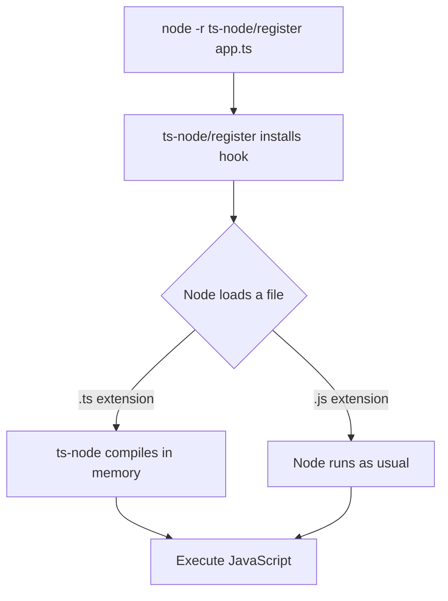
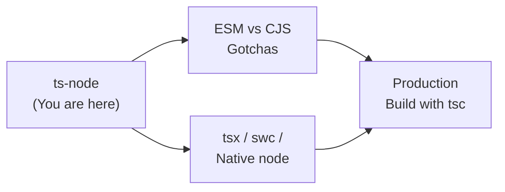
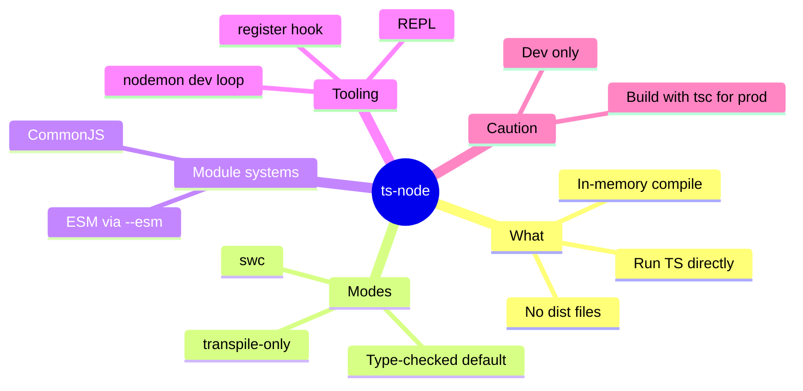
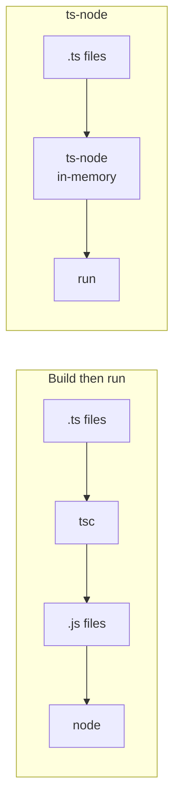

# ts-node — Junior Level

## Table of Contents

1. [Introduction](#introduction)
2. [Prerequisites](#prerequisites)
3. [Glossary](#glossary)
4. [Core Concepts](#core-concepts)
5. [Real-World Analogies](#real-world-analogies)
6. [Mental Models](#mental-models)
7. [Pros & Cons](#pros--cons)
8. [Use Cases](#use-cases)
9. [Installation](#installation)
10. [Code Examples](#code-examples)
11. [The REPL](#the-repl)
12. [Coding Patterns](#coding-patterns)
13. [Clean Code](#clean-code)
14. [Error Handling](#error-handling)
15. [Security Considerations](#security-considerations)
16. [Performance Tips](#performance-tips)
17. [Best Practices](#best-practices)
18. [Edge Cases & Pitfalls](#edge-cases--pitfalls)
19. [Common Mistakes](#common-mistakes)
20. [Common Misconceptions](#common-misconceptions)
21. [Test](#test)
22. [Tricky Questions](#tricky-questions)
23. [Cheat Sheet](#cheat-sheet)
24. [Self-Assessment Checklist](#self-assessment-checklist)
25. [Summary](#summary)
26. [What You Can Build](#what-you-can-build)
27. [Further Reading](#further-reading)
28. [Related Topics](#related-topics)
29. [Diagrams & Visual Aids](#diagrams--visual-aids)

---

## Introduction

> Focus: "What is it?" and "How to use it?"

`ts-node` is a tool that lets you run TypeScript files **directly**, without first compiling them to JavaScript with `tsc`. Normally TypeScript code goes through two steps: you compile `.ts` files into `.js` files, and then you run the `.js` files with Node.js. `ts-node` collapses those two steps into one. You point it at a `.ts` file and it executes immediately.

This is a huge convenience during development. Instead of:

```bash
tsc                # compile every .ts file into .js
node dist/app.js   # then run the compiled output
```

…you simply do:

```bash
ts-node src/app.ts
```

Under the hood, `ts-node` still compiles your TypeScript — but it does so **in memory**, on the fly, as Node loads each file. You never see a `.js` file written to disk. This makes it perfect for scripts, quick experiments, prototypes, and dev-time tooling where the slow write-to-disk build step would just get in the way.

It is important to understand from the start: `ts-node` is a **development convenience**, not a production deployment strategy. For production you almost always compile ahead of time with `tsc` (or a bundler) and ship plain JavaScript. We will return to this point many times, because it is one of the most common mistakes beginners make.

---

## Prerequisites

- **Required:** Node.js installed (v18+ recommended; v20 or v22 ideal). Check with `node --version`.
- **Required:** A package manager — `npm`, `pnpm`, or `yarn`.
- **Required:** Basic TypeScript knowledge — you can write a `.ts` file with types and you have seen `tsc`.
- **Required:** Comfort with a terminal/shell and running commands.
- **Helpful but not required:** Familiarity with `tsconfig.json` and a few compiler options.
- **Helpful but not required:** Understanding the difference between CommonJS (`require`) and ES Modules (`import`).

---

## Glossary

| Term | Definition |
|------|-----------|
| **ts-node** | A tool that compiles and runs TypeScript files in one step, in memory |
| **tsc** | The official TypeScript Compiler — converts `.ts` to `.js` on disk |
| **Transpile** | Translate TypeScript to JavaScript (strip types, downlevel syntax) without full type checking |
| **Type-check** | Verify that the program is type-correct (no type errors) |
| **REPL** | Read–Eval–Print Loop — an interactive prompt where you type code and see results |
| **CommonJS (CJS)** | Node's classic module system using `require()` and `module.exports` |
| **ES Modules (ESM)** | The standard module system using `import` and `export` |
| **Loader / require hook** | A mechanism that intercepts module loading so `ts-node` can compile `.ts` on the fly |
| **transpile-only** | A `ts-node` mode that skips type checking for speed |
| **swc** | A super-fast Rust-based compiler that can replace TypeScript's compiler for transpilation |
| **tsx** | A modern alternative CLI that runs TypeScript using esbuild |

---

## Core Concepts

### Concept 1: Run TypeScript Without a Build Step

The single most important idea: `ts-node src/app.ts` runs your TypeScript immediately. There is no separate "compile" command, and no `.js` files are created in your project folder. Everything happens in memory.

```bash
# The whole workflow during development
ts-node src/app.ts
```

This is great for the "edit → run → see result" loop. You change a line, save, and re-run — no waiting for a full build.

### Concept 2: In-Memory Compilation

When Node tries to load a `.ts` file, `ts-node` steps in, compiles that file to JavaScript in RAM, and hands the JavaScript to Node to execute. The original `.ts` file on disk is never modified, and no new file is written. Think of it as a translator standing between your `.ts` files and Node.

### Concept 3: Type-Checking vs Transpile-Only

`ts-node` has two important modes:

- **Default (type-checked):** It runs the real TypeScript type checker. If your code has a type error, it refuses to run and prints the error. Safer, but slower.
- **`--transpile-only`:** It only strips the types and converts syntax; it does **not** check types. Much faster, but type errors will not stop your program from running.

```bash
ts-node src/app.ts                  # type-checks, then runs
ts-node --transpile-only src/app.ts # just strips types and runs (fast)
```

### Concept 4: It Reads Your tsconfig.json

`ts-node` reuses your project's `tsconfig.json` for compiler options (target, module, paths, etc.). You can point it at a specific config with `--project` or `-P`. This means the way `ts-node` compiles is consistent with how `tsc` would compile.

### Concept 5: The REPL

Running `ts-node` with no file argument starts an interactive REPL where you can type TypeScript expressions and immediately see their results — a fantastic way to experiment with types and APIs.

---

## Real-World Analogies

| Concept | Analogy |
|---------|--------|
| **ts-node** | A live interpreter at a meeting — you speak TypeScript, Node hears JavaScript instantly, no need to mail a translated transcript first |
| **In-memory compilation** | A microwave vs an oven — you skip the long preheat (full build) and get food (output) immediately |
| **transpile-only mode** | A spell-checker turned off for speed — you type faster, but typos (type errors) slip through |
| **Shipping ts-node to production** | Cooking with a microwave at a wedding for 500 guests — fine for a quick snack at home, wrong tool for the real event |

---

## Mental Models

**The intuition:** `ts-node` is "Node, but it understands TypeScript." Wherever you would normally type `node file.js`, during development you can type `ts-node file.ts` and it just works.

**Why this model helps:** It reminds you that `ts-node` is still Node underneath. All of Node's behavior — modules, globals, async, the event loop — is unchanged. `ts-node` only adds a translation layer for `.ts` files. So if something works in `node`, it almost certainly works in `ts-node`; the only new variable is the TypeScript compilation step.

**Second model — the "register hook":** Picture a checkpoint at the door of Node's module system. Every time Node asks for a file, the checkpoint inspects the extension. If it ends in `.ts`, the checkpoint compiles it first. That checkpoint is what `node -r ts-node/register` installs.

---

## Pros & Cons

| Pros | Cons |
|------|------|
| No build step — run `.ts` directly | Slower startup than running plain `.js` |
| Great for scripts, prototypes, and tooling | Not meant for production deployment |
| Interactive REPL for experimentation | Type-checking on every run adds latency |
| Reuses your existing `tsconfig.json` | ESM support is fiddly and version-sensitive |
| `--transpile-only` / `--swc` for speed | Memory usage higher than plain Node |

### When to use:
- Running one-off scripts, database seeds, and migrations during development
- Prototyping and experimenting in the REPL
- Powering dev servers with auto-restart (e.g. `nodemon` + `ts-node`)

### When NOT to use:
- Production runtime (compile with `tsc` and ship `.js` instead)
- Performance-critical startup paths (serverless cold starts, CLIs distributed to users)
- CI test runs where a faster runner (`tsx`, `swc`, native Node) would speed things up

---

## Use Cases

- **Use Case 1:** A database seeding script — `ts-node scripts/seed.ts` runs your typed seeding logic without a build.
- **Use Case 2:** A dev server — `nodemon --exec ts-node src/server.ts` restarts your API on every save.
- **Use Case 3:** Quick API exploration in the REPL — start `ts-node`, import a library, and call its functions interactively.

---

## Installation

You can install `ts-node` locally (recommended) or globally.

```bash
# Local install (recommended) — pinned per project
npm install --save-dev ts-node typescript

# You will almost always want @types/node for Node globals
npm install --save-dev @types/node
```

Run a locally-installed `ts-node` via `npx` or an npm script:

```bash
npx ts-node src/app.ts
```

A global install lets you call `ts-node` anywhere, but ties every project to one version — usually not what you want:

```bash
# Global install (use sparingly)
npm install -g ts-node typescript
ts-node src/app.ts
```

Verify the install:

```bash
npx ts-node --version
# ts-node v10.9.x
# node vXX.X.X
# typescript X.X.X
```

---

## Code Examples

### Example 1: Your First ts-node Script

```typescript
// src/hello.ts

// A typed function — note the parameter and return type annotations
function greet(name: string): string {
  return `Hello, ${name}! Running via ts-node.`;
}

// Node globals like console work exactly as in plain Node
console.log(greet("TypeScript"));
```

**What it does:** Prints a greeting.
**How to run:** `npx ts-node src/hello.ts`

### Example 2: Using Node Built-in Modules

```typescript
// src/list-files.ts
import { readdirSync } from "node:fs";

// Read the current directory and print each entry
const entries: string[] = readdirSync(".");

for (const entry of entries) {
  console.log(entry);
}
```

**What it does:** Lists files in the current directory using the typed `fs` API.
**How to run:** `npx ts-node src/list-files.ts`

### Example 3: A Type Error Stops the Default Run

```typescript
// src/bad.ts
function double(n: number): number {
  return n * 2;
}

// Passing a string where a number is expected
console.log(double("oops")); // Type error!
```

**What happens:**
```bash
npx ts-node src/bad.ts
# TSError: Argument of type 'string' is not assignable to parameter of type 'number'.
```

In default mode, `ts-node` refuses to run code with type errors. This is a feature — it catches mistakes early.

### Example 4: transpile-only Skips the Check

```bash
# Same file as above, but we skip type checking
npx ts-node --transpile-only src/bad.ts
# NaN
```

With `--transpile-only`, the type error is ignored, the code runs, and `double("oops")` produces `NaN` at runtime. This shows the trade-off: speed vs safety.

---

## The REPL

Start the interactive REPL by running `ts-node` with no file:

```bash
npx ts-node
```

You will get a prompt where you can type TypeScript:

```typescript
> const nums: number[] = [1, 2, 3];
undefined
> nums.map(n => n * n);
[ 1, 4, 9 ]
> type Point = { x: number; y: number };
undefined
> const p: Point = { x: 1, y: 2 };
undefined
> p.z;
// Property 'z' does not exist on type 'Point'.
```

The REPL type-checks each line, so you get real TypeScript feedback interactively. Press `Ctrl+D` to exit. This is the fastest way to test a small idea or remember how an API behaves.

You can even evaluate a one-liner without entering the REPL:

```bash
npx ts-node -e 'console.log(([1,2,3] as number[]).reduce((a,b)=>a+b,0))'
# 6
```

---

## Coding Patterns

### Pattern 1: An npm Script for Scripts

**Intent:** Give your team a memorable command instead of long `npx` invocations.
**When to use:** Every project with dev scripts.

```json
{
  "scripts": {
    "seed": "ts-node scripts/seed.ts",
    "dev": "ts-node src/server.ts"
  }
}
```

```bash
npm run seed
npm run dev
```

**Remember:** npm scripts find the locally installed `ts-node` automatically — no `npx` needed inside the script.

### Pattern 2: The Register Hook for Node

**Intent:** Make `node` itself understand `.ts` files.
**When to use:** When a tool only knows how to launch `node`, not `ts-node` (e.g. some test runners and debuggers).

```bash
# -r preloads ts-node/register before running your file
node -r ts-node/register src/app.ts
```



**Remember:** `-r` (short for `--require`) preloads a module before your program starts.

---

## Clean Code

### Naming

```typescript
// Bad — unclear script purpose
// file: s.ts
function r() { /* ... */ }

// Clean — name files and functions by intent
// file: seed-users.ts
function seedUsers(): Promise<void> { /* ... */ return Promise.resolve(); }
```

**Rules:**
- Name script files by what they do: `seed-users.ts`, `migrate.ts`, not `s.ts`.
- Functions describe an action: `seedUsers`, `runMigration`.
- Keep one responsibility per script.

### Functions

```typescript
// Too much in one script entrypoint
async function main() {
  // connect, parse args, run, report — all inline
}

// Split responsibilities
async function connect(): Promise<void> { /* ... */ }
async function run(): Promise<void> { /* ... */ }

async function main(): Promise<void> {
  await connect();
  await run();
}

main().catch((err) => {
  console.error(err);
  process.exitCode = 1;
});
```

**Rule:** Always handle the rejected promise from `main()` so failures produce a non-zero exit code.

### Comments

```typescript
// Noise — states the obvious
// run the script
main();

// Useful — explains WHY this guard exists
// ts-node does not set exit code on unhandled rejection; do it ourselves
main().catch((err) => { console.error(err); process.exitCode = 1; });
```

**Rule:** Comments explain **why**, not **what**.

---

## Error Handling

### Error 1: "Cannot find module 'ts-node'"

```bash
npx ts-node src/app.ts
# Error: Cannot find module 'ts-node'
```

**Why it happens:** `ts-node` is not installed in this project.
**How to fix:**

```bash
npm install --save-dev ts-node typescript
```

### Error 2: "Unknown file extension .ts" (ESM)

```bash
node --loader ts-node/esm src/app.ts
# TypeError [ERR_UNKNOWN_FILE_EXTENSION]: Unknown file extension ".ts"
```

**Why it happens:** Your project is in ESM mode (`"type": "module"`) and `ts-node` was started in CommonJS mode, or the loader was not registered.
**How to fix:**

```bash
# Use the ESM-aware entrypoint
npx ts-node --esm src/app.ts
# or
node --loader ts-node/esm src/app.ts
```

### Error Handling Pattern

```typescript
// src/safe-main.ts
async function main(): Promise<void> {
  // ... your async work ...
  throw new Error("Something failed");
}

main().catch((err: unknown) => {
  // Always log and set a failing exit code
  console.error("Script failed:", err);
  process.exitCode = 1;
});
```

**Why it matters:** Without this, a thrown error in an async script may still exit with code 0, which can hide failures in CI.

---

## Security Considerations

### 1. Do Not Ship ts-node to Production

```json
// package.json — ts-node belongs in devDependencies, not dependencies
{
  "devDependencies": {
    "ts-node": "^10.9.2",
    "typescript": "^5.6.0"
  }
}
```

**Risk:** Shipping `ts-node` and the full TypeScript compiler to production enlarges your dependency surface and slows startup.
**Mitigation:** Keep `ts-node` in `devDependencies`; compile with `tsc` for production and run plain `.js`.

### 2. Never `ts-node` Untrusted Files

```bash
# Dangerous — runs arbitrary code with your privileges
ts-node ./downloaded-script.ts
```

**Risk:** Running TypeScript executes code immediately, just like `node`. A malicious script can read files, make network calls, or delete data.
**Mitigation:** Only run scripts you trust; review third-party scripts before executing.

---

## Performance Tips

### Tip 1: Use --transpile-only for Faster Startup

```bash
# Skip type checking when you just want the script to run quickly
ts-node --transpile-only scripts/seed.ts
```

**Why it's faster:** Type checking is the most expensive part of compilation. Skipping it can cut startup time dramatically. Run a separate `tsc --noEmit` in CI to keep type safety.

### Tip 2: Use the swc Backend

```bash
npm install --save-dev @swc/core @swc/helpers
ts-node --swc scripts/seed.ts
```

**Why it's faster:** `swc` is a Rust-based compiler that transpiles far faster than the TypeScript compiler. Like `--transpile-only`, it does not type-check.

---

## Best Practices

- **Keep `ts-node` in `devDependencies`** — it is a dev tool, not a runtime dependency.
- **Install locally, not globally** — pin the version per project.
- **Use `--transpile-only` or `--swc` for speed**, and run `tsc --noEmit` separately for type safety.
- **Compile with `tsc` for production** — never run `ts-node` in production.
- **Add an npm script** (`"dev"`, `"seed"`) so the command is consistent for the whole team.
- **Always handle errors in your `main()`** and set `process.exitCode` on failure.

---

## Edge Cases & Pitfalls

### Pitfall 1: Forgetting the Register Hook

```bash
# A test runner that launches node directly will not understand .ts
node test/run.ts
# SyntaxError: Unexpected token ':'
```

**What happens:** Plain Node sees TypeScript syntax (like type annotations) and throws a syntax error.
**How to fix:** Preload the hook: `node -r ts-node/register test/run.ts`.

### Pitfall 2: A Type Error Blocks an Otherwise-Working Script

```typescript
// A harmless typo in a type annotation halts the whole run in default mode
const count: numbr = 5; // 'numbr' is not a valid type
```

**What happens:** Default `ts-node` refuses to run because the file does not type-check, even though the logic is fine.
**How to fix:** Fix the type error, or use `--transpile-only` if you knowingly want to skip checks temporarily.

---

## Common Mistakes

### Mistake 1: Using ts-node as a Production Runtime

```json
// Wrong — running ts-node on your server
{
  "scripts": {
    "start": "ts-node src/server.ts"
  }
}

// Correct — build first, then run plain JS
{
  "scripts": {
    "build": "tsc",
    "start": "node dist/server.js"
  }
}
```

### Mistake 2: Confusing transpile-only With "Type Safe"

```bash
# This runs even with type errors — it does NOT mean your code is correct
ts-node --transpile-only src/app.ts
```

Remember to run `tsc --noEmit` separately to actually verify types.

---

## Common Misconceptions

### Misconception 1: "ts-node compiles my project to a dist folder."

**Reality:** `ts-node` compiles in memory and writes nothing to disk. If you want output files, use `tsc`.

**Why people think this:** They confuse `ts-node` (run) with `tsc` (build).

### Misconception 2: "ts-node is faster than tsc."

**Reality:** `ts-node` does the same compilation work as `tsc` plus runs the code. It feels faster only because it skips writing files and you do not run a separate command. For a true build, `tsc` is the right tool.

**Why people think this:** The single-command experience feels lightweight.

### Misconception 3: "If ts-node runs my code, my types are correct."

**Reality:** Only true in default mode. With `--transpile-only` or `--swc`, no type checking happens at all.

**Why people think this:** They forget which mode they are in.

---

## Test

### Multiple Choice

**1. What does `ts-node src/app.ts` do?**

- A) Writes `src/app.js` to disk, then runs it
- B) Compiles `src/app.ts` in memory and runs it directly
- C) Only type-checks the file without running it
- D) Installs TypeScript globally

<details>
<summary>Answer</summary>
**B)** — `ts-node` compiles in memory and executes immediately; no `.js` file is written. (A) describes `tsc` + `node`. (C) is `tsc --noEmit`.
</details>

**2. What does `--transpile-only` do?**

- A) Speeds up runs by skipping type checking
- B) Makes type checking stricter
- C) Writes declaration files
- D) Disables module resolution

<details>
<summary>Answer</summary>
**A)** — It strips types and converts syntax without running the type checker, trading safety for speed.
</details>

### True or False

**3. ts-node is recommended for production deployments.**

<details>
<summary>Answer</summary>
**False** — For production you compile with `tsc` and run plain JavaScript. `ts-node` is a development tool.
</details>

**4. Running `ts-node` with no file argument starts an interactive REPL.**

<details>
<summary>Answer</summary>
**True** — It opens a TypeScript REPL where each line is type-checked and evaluated.
</details>

### What's the Output?

**5. What does this print?**

```bash
ts-node --transpile-only -e 'const x: any = 5; console.log(typeof x);'
```

<details>
<summary>Answer</summary>
Output: `number`. `typeof` reports the runtime type; the `any` annotation is erased.
</details>

**6. What happens here in default mode?**

```typescript
const n: number = "hello";
console.log(n);
```

<details>
<summary>Answer</summary>
**A type error (`TSError`)** — string is not assignable to number, so default `ts-node` refuses to run.
</details>

---

## Tricky Questions

**1. Where does ts-node write the compiled JavaScript?**

- A) To a `dist/` folder
- B) Next to the source file
- C) Nowhere — it stays in memory
- D) To a temp directory you must clean up

<details>
<summary>Answer</summary>
**C)** — Compilation happens in memory. No files are written.
</details>

**2. Which command makes plain `node` understand `.ts` files?**

- A) `node --typescript app.ts`
- B) `node -r ts-node/register app.ts`
- C) `node --compile app.ts`
- D) `node --ts app.ts`

<details>
<summary>Answer</summary>
**B)** — `-r ts-node/register` preloads the require hook so Node can load `.ts` files.
</details>

**3. What is the main trade-off of `--transpile-only`?**

- A) It writes extra files
- B) It is slower
- C) It skips type checking, so type errors do not stop the run
- D) It cannot use your tsconfig

<details>
<summary>Answer</summary>
**C)** — Faster startup at the cost of no type safety during the run.
</details>

---

## Cheat Sheet

| What | Command | Notes |
|------|---------|-------|
| Run a file | `ts-node src/app.ts` | Type-checks then runs |
| Run fast (no types) | `ts-node --transpile-only src/app.ts` | Skips type checking |
| Run with swc | `ts-node --swc src/app.ts` | Fastest; no type checking |
| Start the REPL | `ts-node` | Interactive TypeScript |
| One-liner | `ts-node -e 'code'` | Evaluate an expression |
| ESM mode | `ts-node --esm src/app.ts` | For `"type": "module"` |
| Register hook | `node -r ts-node/register app.ts` | Make node understand `.ts` |
| Pick a config | `ts-node -P tsconfig.dev.json app.ts` | Use a specific tsconfig |
| Version info | `ts-node --version` | Shows ts-node/node/ts versions |

---

## Self-Assessment Checklist

### I can explain:
- [ ] What `ts-node` is and how it differs from `tsc`
- [ ] Why no `.js` files appear when I use `ts-node`
- [ ] The difference between default (type-checked) and `--transpile-only` modes
- [ ] Why `ts-node` is a dev tool, not a production runtime

### I can do:
- [ ] Install `ts-node` locally and run a `.ts` file
- [ ] Start and use the REPL
- [ ] Add an npm script that runs a TypeScript script
- [ ] Use `node -r ts-node/register` to launch a `.ts` entrypoint

### I can answer:
- [ ] All multiple choice questions in this document

---

## Summary

- `ts-node` runs TypeScript directly, compiling in memory without writing `.js` files.
- It reuses your `tsconfig.json` and, by default, type-checks before running.
- `--transpile-only` and `--swc` make it faster by skipping type checking.
- The REPL lets you experiment with TypeScript interactively.
- `node -r ts-node/register` makes plain Node understand `.ts` files.
- It is a development convenience — compile with `tsc` for production.

**Next step:** Learn the middle-level details — ESM vs CommonJS gotchas, transpile-only trade-offs, and dev workflows with `nodemon`.

---

## What You Can Build

### Projects you can create:
- **Seed Script:** `ts-node scripts/seed.ts` to populate a local database with typed data.
- **CLI Prototype:** A small typed command-line tool you iterate on quickly with `ts-node`.
- **Dev Server:** An Express/Fastify API started with `nodemon --exec ts-node src/server.ts`.

### Learning path — what to study next:



---

## Further Reading

- **Official docs:** [ts-node README](https://typestrong.org/ts-node/) — the canonical reference.
- **Node.js docs:** [Modules: CommonJS vs ECMAScript](https://nodejs.org/api/esm.html) — understand the module systems.
- **TypeScript handbook:** [Compiler Options](https://www.typescriptlang.org/tsconfig) — options `ts-node` honors.
- **Alternative tool:** [tsx](https://tsx.is/) — a faster esbuild-based runner.

---

## Related Topics

- **tsc** — the compiler `ts-node` reuses for type checking and config.
- **tsconfig.json** — the configuration both tools share.
- **Compiler options** — `target`, `module`, `paths`, and friends.

---

## Diagrams & Visual Aids

### Mind Map



### Two Ways to Run TypeScript



### Decision Box

```
+--------------------------------------------------+
|              Should I use ts-node?               |
|--------------------------------------------------|
| Dev script / prototype     | Yes                 |
| REPL experimentation       | Yes                 |
| nodemon dev server         | Yes                 |
| Production server          | No -> tsc + node    |
| User-distributed CLI       | No -> bundle/build  |
+--------------------------------------------------+
```
