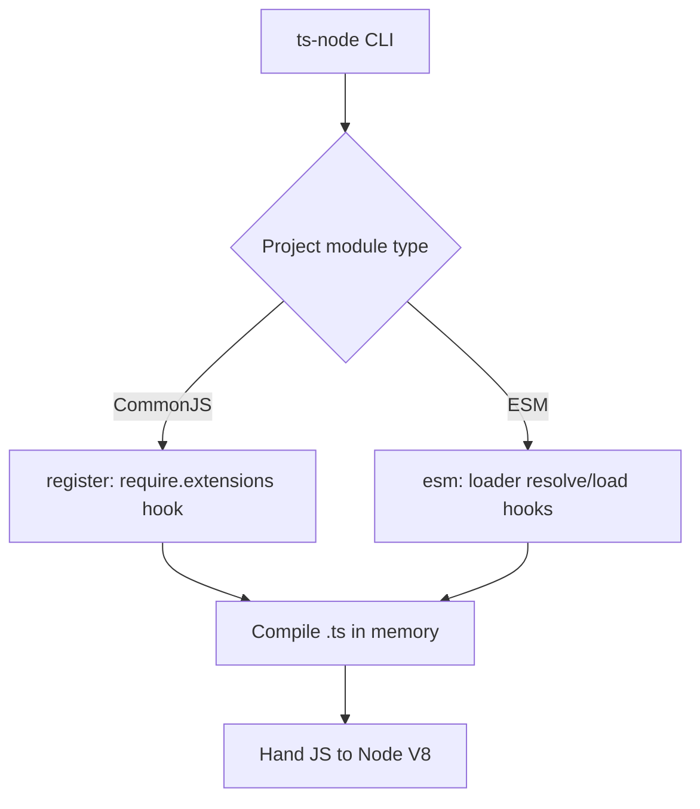
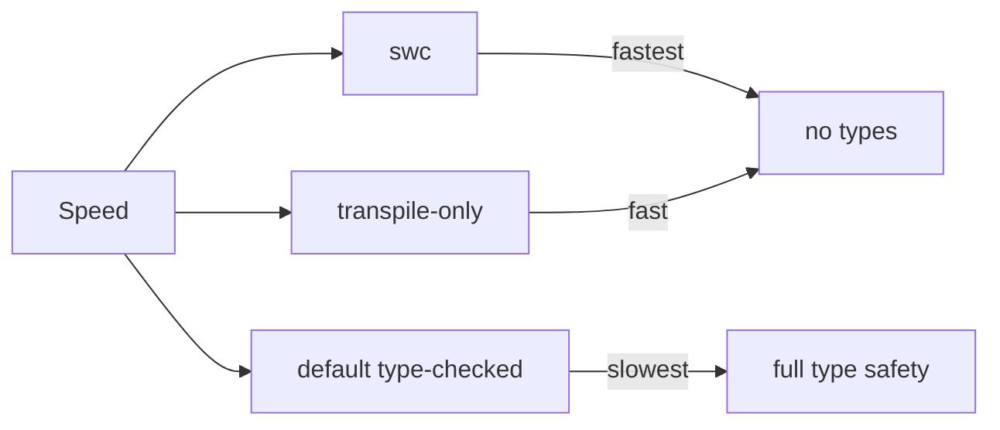

# ts-node — Middle Level

## Table of Contents

1. [Prerequisites](#prerequisites)
2. [Deep Dive: How ts-node Fits Into Node](#deep-dive-how-ts-node-fits-into-node)
3. [CommonJS vs ESM — The Core Gotcha](#commonjs-vs-esm--the-core-gotcha)
4. [Configuring ts-node](#configuring-ts-node)
5. [transpile-only vs Type-Checked](#transpile-only-vs-type-checked)
6. [The swc Backend](#the-swc-backend)
7. [The Register Hook in Depth](#the-register-hook-in-depth)
8. [Dev Workflows: nodemon and Watch](#dev-workflows-nodemon-and-watch)
9. [Path Aliases and tsconfig-paths](#path-aliases-and-tsconfig-paths)
10. [Source Maps and Debugging](#source-maps-and-debugging)
11. [ESM Interop Gotchas](#esm-interop-gotchas)
12. [Patterns](#patterns)
13. [Anti-Patterns](#anti-patterns)
14. [Error Catalog](#error-catalog)
15. [Performance Notes](#performance-notes)
16. [Middle Checklist](#middle-checklist)
17. [Practice Questions](#practice-questions)
18. [Summary](#summary)

---

## Prerequisites

- You can run `ts-node` files and use the REPL (junior level).
- You understand `tsconfig.json` basics: `target`, `module`, `moduleResolution`, `strict`.
- You know the difference between `require()`/`module.exports` (CJS) and `import`/`export` (ESM).
- You have used `nodemon` or a watch-based dev loop before.
- You are comfortable reading Node error codes like `ERR_REQUIRE_ESM` and `ERR_UNKNOWN_FILE_EXTENSION`.

---

## Deep Dive: How ts-node Fits Into Node

`ts-node` does not replace Node. It plugs **into** Node's module loading system. There are two integration points, corresponding to Node's two module systems:

1. **CommonJS require hook** — `ts-node/register`. It overrides `require.extensions[".ts"]` so that when CommonJS `require()` encounters a `.ts` file, `ts-node` compiles it first.
2. **ESM loader hooks** — `ts-node/esm`. It registers a loader that intercepts `resolve` and `load` for `.ts`/`.tsx`/`.mts`/`.cts` files in the ESM pipeline.

The `ts-node` CLI is mostly a convenience wrapper. `ts-node app.ts` is roughly equivalent to `node -r ts-node/register app.ts` for CommonJS, and `ts-node --esm app.ts` wires up the ESM loader for you.



Because `ts-node` reuses the real TypeScript compiler API, it understands the same `tsconfig.json` as `tsc`. This is a key reason to prefer it for correctness-sensitive scripts: the compilation semantics match your build.

---

## CommonJS vs ESM — The Core Gotcha

This is the single biggest source of confusion with `ts-node`. The behavior depends on **how Node decides whether a file is CommonJS or ESM**, which in turn depends on:

- The nearest `package.json` `"type"` field (`"commonjs"` default, or `"module"`).
- The file extension (`.cts` → CJS, `.mts` → ESM, `.ts` → follows `"type"`).
- Your `tsconfig.json` `module` and `moduleResolution`.

### Scenario A: CommonJS Project (the easy path)

```json
// package.json
{
  "type": "commonjs"
}
```

```json
// tsconfig.json
{
  "compilerOptions": {
    "module": "CommonJS",
    "moduleResolution": "Node",
    "target": "ES2022",
    "esModuleInterop": true
  }
}
```

```bash
# Just works
ts-node src/app.ts
```

In CommonJS mode, `ts-node` uses the `require` hook. Imports are compiled down to `require()` calls. This is the most reliable, lowest-friction configuration.

### Scenario B: ESM Project

```json
// package.json
{
  "type": "module"
}
```

```json
// tsconfig.json
{
  "compilerOptions": {
    "module": "ESNext",
    "moduleResolution": "Bundler",
    "target": "ES2022"
  }
}
```

```bash
# Must use the ESM entrypoint
ts-node --esm src/app.ts
# or
node --loader ts-node/esm src/app.ts
```

In ESM mode you hit a famous quirk: **relative imports must include the `.js` extension**, even though the file on disk is `.ts`. This is because Node's ESM resolver is strict about extensions, and TypeScript follows Node's resolution.

```typescript
// src/app.ts (ESM)
// Correct: import the .js path even though the file is util.ts
import { helper } from "./util.js";

// Wrong: omitting the extension -> ERR_MODULE_NOT_FOUND
// import { helper } from "./util";
```

### Why the `.js` Extension on a `.ts` Import?

TypeScript does **not** rewrite import specifiers. With ESM, the emitted JS keeps `./util.js`, and at runtime that path resolves to the compiled file. `ts-node` maps `./util.js` back to `./util.ts` during loading. It feels backwards but is the officially documented behavior for `NodeNext`/ESM.


### `.cts` and `.mts` Escape Hatches

You can force a single file's module system regardless of `package.json`:

```typescript
// config.cts  -> always CommonJS
module.exports = { port: 3000 };

// loader.mts  -> always ESM
export const port = 3000;
```

These are handy when most of your project is one system but a specific file must be the other.

---

## Configuring ts-node

`ts-node` reads configuration from three places, in increasing priority: `tsconfig.json` `compilerOptions`, a dedicated `ts-node` block in `tsconfig.json`, CLI flags, and `TS_NODE_*` environment variables.

### The `ts-node` Block in tsconfig.json

```json
// tsconfig.json
{
  "compilerOptions": {
    "target": "ES2022",
    "module": "CommonJS",
    "strict": true
  },
  "ts-node": {
    "transpileOnly": true,
    "files": true,
    "compilerOptions": {
      // Overrides applied ONLY when running through ts-node
      "module": "CommonJS"
    }
  }
}
```

Key sub-options:
- `transpileOnly`: skip type checking (same as `--transpile-only`).
- `files`: include files listed in `tsconfig.json` `files`/`include` even if not imported (useful for ambient `.d.ts`).
- `compilerOptions`: overrides applied only under `ts-node` — great for forcing `module: CommonJS` for scripts while your build emits ESM.
- `swc`: set to `true` to use the swc transpiler.
- `esm`: enable ESM support from config instead of the CLI flag.

### Selecting a Config with `--project` / `-P`

```bash
# Use a dedicated tsconfig for scripts
ts-node -P tsconfig.scripts.json scripts/seed.ts
```

A common pattern: a separate `tsconfig.scripts.json` that extends your base config but sets `module: CommonJS` so scripts run without ESM friction.

### TS_NODE_* Environment Variables

```bash
# Equivalent to flags, useful in CI or shared shells
TS_NODE_TRANSPILE_ONLY=true ts-node scripts/seed.ts
TS_NODE_PROJECT=tsconfig.scripts.json ts-node scripts/seed.ts
TS_NODE_COMPILER_OPTIONS='{"module":"CommonJS"}' ts-node scripts/seed.ts
```

| Variable | Equivalent flag |
|----------|-----------------|
| `TS_NODE_TRANSPILE_ONLY` | `--transpile-only` |
| `TS_NODE_PROJECT` | `--project` / `-P` |
| `TS_NODE_COMPILER_OPTIONS` | inline compiler option JSON |
| `TS_NODE_FILES` | `--files` |
| `TS_NODE_PREFER_TS_EXTS` | prefer `.ts` over `.js` for ambiguous imports |

---

## transpile-only vs Type-Checked

This is a core decision you make for every `ts-node` usage.

| Aspect | Default (type-checked) | `--transpile-only` |
|--------|------------------------|--------------------|
| Type errors | Block the run | Ignored at runtime |
| Startup speed | Slower (full check) | Much faster |
| Per-file isolation | Whole-program aware | Per-file (no cross-file type info) |
| Best for | Correctness-sensitive scripts | Fast dev loops, hot restarts |

```bash
# Type-checked: safe, slower
ts-node scripts/migrate.ts

# transpile-only: fast, no type safety
ts-node --transpile-only scripts/migrate.ts
```

The recommended professional pattern is to **decouple** running from checking:

```json
{
  "scripts": {
    "dev": "ts-node --transpile-only src/server.ts",
    "typecheck": "tsc --noEmit"
  }
}
```

You get fast dev startup AND real type safety — just in separate commands. CI runs `npm run typecheck`; developers run `npm run dev`.

### A Subtle transpile-only Caveat: `const enum` and `isolatedModules`

Because `--transpile-only` (and swc) compile each file in isolation, certain whole-program features break:

```typescript
// const enum requires cross-file inlining — breaks under isolated transpilation
const enum Color { Red, Green, Blue }
// In transpile-only/swc, this may error or behave unexpectedly.

// Fix: use a regular enum or a plain object
const Color = { Red: 0, Green: 1, Blue: 2 } as const;
```

Set `"isolatedModules": true` in `tsconfig.json` to catch these patterns at type-check time so they never surprise you in transpile-only runs.

---

## The swc Backend

`@swc/core` is a Rust-based transpiler that is dramatically faster than the TypeScript compiler for emitting JS. `ts-node` can delegate transpilation to it.

```bash
npm install --save-dev @swc/core @swc/helpers
ts-node --swc src/app.ts
```

Or configure it permanently:

```json
// tsconfig.json
{
  "ts-node": {
    "swc": true
  }
}
```

Trade-offs:
- swc does **not** type-check (like `--transpile-only`).
- swc handles most TypeScript syntax but has its own subtle differences (e.g. decorators metadata, some edge syntax).
- For the absolute fastest dev loop, `--swc` beats `--transpile-only`.



---

## The Register Hook in Depth

The register hook is what tools other than the `ts-node` CLI use to gain TypeScript support.

```bash
# CommonJS require hook
node -r ts-node/register app.ts

# ESM loader hook
node --loader ts-node/esm app.ts

# Newer Node prefers --import for loaders (Node 20.6+)
node --import ts-node/register/esm app.ts
```

This is essential for integrating with tools that spawn `node` directly:

```json
// .mocharc.json — make Mocha understand TypeScript tests
{
  "require": "ts-node/register",
  "extensions": ["ts"],
  "spec": "test/**/*.spec.ts"
}
```

```bash
# Debugging with the Node inspector through ts-node
node -r ts-node/register --inspect-brk src/app.ts
```

---

## Dev Workflows: nodemon and Watch

The classic dev loop is `nodemon` + `ts-node`: restart the process whenever a `.ts` file changes.

```bash
npm install --save-dev nodemon ts-node typescript
```

```json
// nodemon.json
{
  "watch": ["src"],
  "ext": "ts,json",
  "ignore": ["src/**/*.spec.ts"],
  "exec": "ts-node --transpile-only src/server.ts"
}
```

```json
// package.json
{
  "scripts": {
    "dev": "nodemon"
  }
}
```

```bash
npm run dev
# [nodemon] watching path(s): src
# [nodemon] starting `ts-node --transpile-only src/server.ts`
# Server listening on http://localhost:3000
# (edit a file)
# [nodemon] restarting due to changes...
```

Using `--transpile-only` here is important: it makes each restart fast. Pair it with an editor that surfaces type errors (VS Code) and a CI `tsc --noEmit`.

### Alternative: ts-node-dev

`ts-node-dev` (a.k.a. `tsnd`) keeps the compiler process alive between restarts, so restarts are faster than `nodemon` spinning up a fresh process:

```bash
npm install --save-dev ts-node-dev
npx ts-node-dev --respawn --transpile-only src/server.ts
```

### Built-in Node Watch Mode

On modern Node you can use `--watch` instead of nodemon:

```bash
node --watch -r ts-node/register src/server.ts
# Node restarts the process when watched files change
```

---

## Path Aliases and tsconfig-paths

If your `tsconfig.json` defines `paths` (e.g. `@app/*`), the TypeScript compiler understands them, but Node at runtime does not — it has no idea what `@app/foo` means. `ts-node` does not resolve `paths` by itself, so you add `tsconfig-paths`:

```json
// tsconfig.json
{
  "compilerOptions": {
    "baseUrl": ".",
    "paths": {
      "@app/*": ["src/*"]
    }
  }
}
```

```bash
npm install --save-dev tsconfig-paths
# Register both hooks: ts-node compiles, tsconfig-paths rewrites aliases
node -r ts-node/register -r tsconfig-paths/register src/app.ts
```

Or via config:

```json
// tsconfig.json
{
  "ts-node": {
    "require": ["tsconfig-paths/register"]
  }
}
```

Without this, alias imports throw `Cannot find module '@app/foo'` at runtime.

---

## Source Maps and Debugging

`ts-node` generates inline source maps so stack traces point to your `.ts` files, not the compiled JS. By default this works out of the box. Confirm with:

```typescript
// src/boom.ts
function level3(): never {
  throw new Error("boom");
}
function level2() { level3(); }
function level1() { level2(); }
level1();
```

```bash
ts-node src/boom.ts
# Error: boom
#     at level3 (/path/src/boom.ts:3:9)   <- points to the .ts line
#     at level2 (/path/src/boom.ts:5:19)
```

For VS Code debugging:

```json
// .vscode/launch.json
{
  "version": "0.2.0",
  "configurations": [
    {
      "type": "node",
      "request": "launch",
      "name": "Debug ts-node",
      "runtimeArgs": ["-r", "ts-node/register"],
      "args": ["${workspaceFolder}/src/app.ts"],
      "cwd": "${workspaceFolder}",
      "internalConsoleOptions": "openOnSessionStart"
    }
  ]
}
```

Breakpoints land on the correct TypeScript lines thanks to source maps.

---

## ESM Interop Gotchas

### Gotcha 1: `__dirname` and `__filename` Are Not Defined in ESM

```typescript
// Under ESM these are undefined
// console.log(__dirname); // ReferenceError

// ESM replacement
import { fileURLToPath } from "node:url";
import { dirname } from "node:path";

const __filename = fileURLToPath(import.meta.url);
const __dirname = dirname(__filename);
```

### Gotcha 2: Default Import of a CommonJS Module

```typescript
// A CommonJS dependency under ESM may need default-import interop
import pkg from "some-cjs-lib";        // works with esModuleInterop
// or
import * as pkg from "some-cjs-lib";   // namespace import

// Named imports sometimes fail with CJS libs that don't export named bindings:
// import { thing } from "some-cjs-lib"; // may throw at runtime
```

### Gotcha 3: `require` Inside ESM

```typescript
// You cannot use require() directly in ESM
// const fs = require("fs"); // ReferenceError: require is not defined

// Create one if you really need it:
import { createRequire } from "node:module";
const require = createRequire(import.meta.url);
const data = require("./legacy.json");
```

### Gotcha 4: JSON Imports

```typescript
// ESM JSON imports need an import assertion/attribute
import config from "./config.json" with { type: "json" };
// (older Node: assert { type: "json" })
```

---

## Patterns

### Pattern 1: Dedicated Scripts tsconfig

```json
// tsconfig.scripts.json
{
  "extends": "./tsconfig.json",
  "compilerOptions": {
    "module": "CommonJS",
    "moduleResolution": "Node",
    "noEmit": true
  }
}
```

```json
{
  "scripts": {
    "seed": "ts-node -P tsconfig.scripts.json scripts/seed.ts"
  }
}
```

Keeps your app on ESM while scripts run on frictionless CommonJS.

### Pattern 2: Fast Dev, Strict CI

```json
{
  "scripts": {
    "dev": "nodemon",
    "typecheck": "tsc --noEmit",
    "build": "tsc -p tsconfig.build.json",
    "start": "node dist/server.js"
  }
}
```

---

## Anti-Patterns

```bash
# Anti-pattern: ts-node as your production start command
"start": "ts-node src/server.ts"   # slow startup, ships the compiler

# Anti-pattern: relying on transpile-only as your only type safety
ts-node --transpile-only src/app.ts  # add `tsc --noEmit` somewhere!

# Anti-pattern: mixing ESM config and CJS hook
node -r ts-node/register esm-app.ts  # use --loader/--esm for ESM
```

---

## Error Catalog

| Error | Likely cause | Fix |
|-------|--------------|-----|
| `ERR_UNKNOWN_FILE_EXTENSION ".ts"` | ESM mode without the ESM loader | `ts-node --esm` or `--loader ts-node/esm` |
| `ERR_MODULE_NOT_FOUND` | Missing `.js` extension on a relative ESM import | Add `.js` to the specifier |
| `ERR_REQUIRE_ESM` | `require()` of an ESM-only dependency | Switch to `import`, or use a dynamic `import()` |
| `Cannot find module '@app/...'` | `paths` alias not resolved at runtime | Add `tsconfig-paths/register` |
| `SyntaxError: Unexpected token ':'` | Plain `node` ran a `.ts` file without the hook | `node -r ts-node/register file.ts` |
| `const enum` error under swc/transpile-only | Isolated transpilation | Use a regular enum / `as const` object |

---

## Performance Notes

- Default type-checked startup is dominated by type checking, not transpilation. For repeated dev restarts, `--transpile-only` or `--swc` is the lever.
- `ts-node` re-checks/re-transpiles on each process start; long-lived watchers like `ts-node-dev` amortize this.
- `skipLibCheck: true` in your tsconfig speeds up type-checked runs by skipping `node_modules` `.d.ts` checking.
- For large monorepos, prefer a faster runner (`tsx`, native Node type stripping) for the dev inner loop — covered at senior level.

---

## Middle Checklist

- [ ] I know whether my project is CommonJS or ESM and configured `ts-node` accordingly.
- [ ] My ESM relative imports use the `.js` extension.
- [ ] I run dev with `--transpile-only`/`--swc` and type-check separately with `tsc --noEmit`.
- [ ] `isolatedModules: true` is on to avoid transpile-only surprises.
- [ ] Path aliases are wired through `tsconfig-paths/register` if I use them.
- [ ] My `start` script uses compiled `node dist/...`, never `ts-node`.

---

## Practice Questions

**Q1: Why must relative ESM imports use `.js` even though the file is `.ts`?**
> TypeScript does not rewrite import specifiers, and Node's ESM resolver requires explicit extensions. The emitted/loaded path is `.js`; `ts-node` maps it back to the `.ts` source.

**Q2: How do you keep fast dev startup without losing type safety?**
> Run with `--transpile-only` (or `--swc`) and add a separate `tsc --noEmit` step (locally and in CI).

**Q3: Your alias import `@app/db` fails at runtime under ts-node. Why?**
> Node does not understand `paths`. Register `tsconfig-paths/register` so aliases resolve at runtime.

**Q4: When would you use `.cts` or `.mts`?**
> To force a single file's module system (CJS or ESM) regardless of the package's `"type"`.

**Q5: What breaks under `--transpile-only` that works in default mode?**
> Whole-program features like `const enum` inlining and cross-file type erasure assumptions. `isolatedModules: true` flags these.

---

## Summary

- `ts-node` hooks into Node's CommonJS (`require`) and ESM (loader) systems.
- The biggest gotcha is CJS vs ESM: ESM needs `--esm`/`--loader` and `.js` extensions on relative imports.
- Configure via `tsconfig.json` `ts-node` block, `--project`, CLI flags, or `TS_NODE_*` vars.
- `--transpile-only`/`--swc` trade type safety for speed; pair with `tsc --noEmit`.
- Use `nodemon`/`ts-node-dev`/`node --watch` for auto-restart dev loops.
- Wire `tsconfig-paths` for alias support; source maps give `.ts` stack traces.

**Next step:** Senior level — choosing between `ts-node`, `tsx`, `swc`, Bun/Deno, and Node's native type stripping for dev, CI, and (never) prod.
