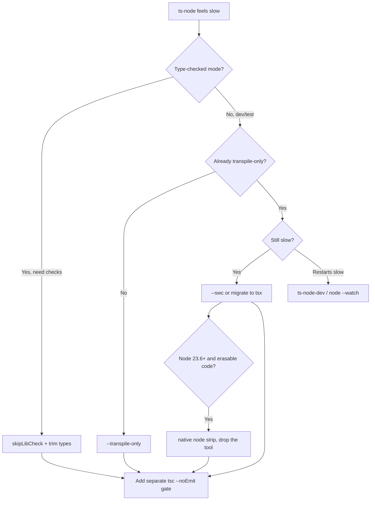

# ts-node — Optimization Guide

> Goal: make running TypeScript in development as fast as possible without sacrificing the type safety you need elsewhere. Each optimization states the problem, the change, the expected improvement, and the trade-off.

## Table of Contents

1. [Optimization 1 — transpile-only for Dev Runs](#optimization-1--transpile-only-for-dev-runs)
2. [Optimization 2 — Switch the Engine to swc](#optimization-2--switch-the-engine-to-swc)
3. [Optimization 3 — skipLibCheck](#optimization-3--skiplibcheck)
4. [Optimization 4 — Keep the Compiler Warm (ts-node-dev)](#optimization-4--keep-the-compiler-warm-ts-node-dev)
5. [Optimization 5 — Migrate the Dev Loop to tsx](#optimization-5--migrate-the-dev-loop-to-tsx)
6. [Optimization 6 — Use Native Node Type Stripping](#optimization-6--use-native-node-type-stripping)
7. [Optimization 7 — Decouple Type Checking from Running](#optimization-7--decouple-type-checking-from-running)
8. [Optimization 8 — node --watch Instead of nodemon](#optimization-8--node---watch-instead-of-nodemon)
9. [Optimization 9 — Narrow the Compilation Scope](#optimization-9--narrow-the-compilation-scope)
10. [Optimization 10 — Cache and Parallelize in CI](#optimization-10--cache-and-parallelize-in-ci)
11. [Optimization 11 — Faster Test Transpilation](#optimization-11--faster-test-transpilation)
12. [Optimization 12 — Production: Compile, Don't Run ts-node](#optimization-12--production-compile-dont-run-ts-node)
13. [Benchmarking Methodology](#benchmarking-methodology)
14. [Optimization Summary Table](#optimization-summary-table)

---

## Optimization 1 — transpile-only for Dev Runs

**Problem:** Default `ts-node` type-checks on every run; a script that should start in 0.3s takes 2–4s.

```bash
# Slow: full type check on each start
ts-node scripts/seed.ts        # ~3.2s
```

```bash
# Fast: skip type checking
ts-node --transpile-only scripts/seed.ts   # ~0.7s
```

```json
// Or make it the default for ts-node runs
{ "ts-node": { "transpileOnly": true } }
```

**Expected improvement:** 3–6x faster startup for type-heavy projects.

**Trade-off:** No type checking during the run. Pair with `tsc --noEmit` elsewhere (see Optimization 7).

---

## Optimization 2 — Switch the Engine to swc

**Problem:** Even transpile-only with the TypeScript compiler is slower than a native transpiler.

```bash
npm install --save-dev @swc/core @swc/helpers
ts-node --swc scripts/seed.ts
```

```json
{ "ts-node": { "swc": true } }
```

**Expected improvement:** Often 2–4x faster than `--transpile-only` (swc is Rust-based). The bigger the file count, the larger the gap.

**Trade-off:** No type checking; minor emit differences (e.g. legacy decorator metadata needs explicit `.swcrc` config). Avoid `const enum`.

---

## Optimization 3 — skipLibCheck

**Problem:** Default (type-checked) `ts-node` spends most of its first-require time parsing and checking `node_modules` `.d.ts` files.

```json
// tsconfig.json
{
  "compilerOptions": {
    "skipLibCheck": true
  }
}
```

**Expected improvement:** Large speedup on the first require in type-checked mode, especially with many dependencies. Frequently the single highest-ROI flag for type-checked runs.

**Trade-off:** Skips type errors *inside* declaration files (rarely your bug). Your own code is still checked.

---

## Optimization 4 — Keep the Compiler Warm (ts-node-dev)

**Problem:** `nodemon` spawns a fresh `ts-node` process on every change, paying full compiler startup each restart.

```bash
npm install --save-dev ts-node-dev
npx ts-node-dev --respawn --transpile-only src/server.ts
```

`ts-node-dev` keeps the compiler service alive between restarts and recompiles only changed files.

**Expected improvement:** Restarts drop from seconds to a few hundred ms because the program is already built.

**Trade-off:** Slightly more memory held between restarts; another dependency.

---

## Optimization 5 — Migrate the Dev Loop to tsx

**Problem:** `ts-node` (even tuned) is slower and fussier with ESM than esbuild-based runners.

```bash
npm install --save-dev tsx
# Before
nodemon --exec "ts-node --transpile-only" src/server.ts
# After
tsx watch src/server.ts
```

**Expected improvement:** Faster cold starts and restarts; ESM "just works" without `.js`-extension and loader gymnastics in many setups.

**Trade-off:** No type checking (same as transpile-only); a different engine (esbuild) with rare emit edge cases. Keep `tsc --noEmit` as the gate.

---

## Optimization 6 — Use Native Node Type Stripping

**Problem:** You want the fastest possible dev start with zero extra tooling.

```bash
# Node 22.6 - 23.5
node --experimental-strip-types src/server.ts

# Node 23.6+ (on by default)
node src/server.ts

# With watch
node --watch src/server.ts
```

**Expected improvement:** Near-zero tooling overhead — Node strips types internally. No `ts-node`/`tsx` process to start.

**Trade-off:** No type checking; strip-only mode rejects `enum`/`namespace`/parameter properties (use `--experimental-transform-types` or refactor). Requires `erasableSyntaxOnly`-compatible code and explicit import extensions.

```json
// Keep code compatible
{ "compilerOptions": { "erasableSyntaxOnly": true, "verbatimModuleSyntax": true } }
```

---

## Optimization 7 — Decouple Type Checking from Running

**Problem:** You turned on `--transpile-only`/`--swc` and now nothing checks types.

```json
{
  "scripts": {
    "dev": "tsx watch src/server.ts",
    "typecheck": "tsc --noEmit",
    "typecheck:watch": "tsc --noEmit --watch"
  }
}
```

Run `typecheck:watch` in a second terminal (or rely on your editor) while `dev` stays fast. CI runs `typecheck` as the gate.

**Expected improvement:** Best of both — fast restarts and authoritative type safety, just not in the same process.

**Trade-off:** Two processes / an extra CI step. This is the recommended professional setup.

---

## Optimization 8 — node --watch Instead of nodemon

**Problem:** `nodemon` is an extra dependency and process supervisor.

```bash
# Built into modern Node — no nodemon needed
node --watch -r ts-node/register src/server.ts
# or with native stripping
node --watch src/server.ts
```

**Expected improvement:** One fewer dependency; restart latency comparable to or better than nodemon.

**Trade-off:** Fewer features than nodemon (no custom ignore globs, no exec chains). Fine for simple loops.

---

## Optimization 9 — Narrow the Compilation Scope

**Problem:** `ts-node` (default) builds a program from your whole `tsconfig` `include`, parsing files you don't need for this script.

```json
// tsconfig.scripts.json — minimal include for scripts
{
  "extends": "./tsconfig.json",
  "include": ["scripts/**/*.ts", "src/db/**/*.ts"],
  "compilerOptions": { "skipLibCheck": true }
}
```

```bash
ts-node -P tsconfig.scripts.json scripts/seed.ts
```

**Expected improvement:** Less to parse/check on startup, especially in large monorepos.

**Trade-off:** You must keep the `include` accurate; too narrow and you miss ambient types (use `files: true` if needed).

---

## Optimization 10 — Cache and Parallelize in CI

**Problem:** CI re-checks everything from scratch on each run.

```yaml
# Use incremental tsc with a cached .tsbuildinfo, and project references
# tsconfig.json: { "compilerOptions": { "incremental": true } }
steps:
  - uses: actions/cache@v4
    with:
      path: .tsbuildinfo
      key: tsbuildinfo-${{ hashFiles('tsconfig*.json', 'src/**') }}
  - run: tsc --noEmit --incremental
```

For monorepos, `tsc -b` only rebuilds changed packages.

**Expected improvement:** Warm CI type-check runs drop dramatically when `.tsbuildinfo` is cached; project references parallelize independent packages.

**Trade-off:** Cache invalidation complexity; do not use `ts-node` for CI type checking — `tsc -b` is faster and complete.

---

## Optimization 11 — Faster Test Transpilation

**Problem:** A Jest suite using `ts-jest` (which type-checks) is slow.

```bash
# Swap ts-jest for swc-based transform (no type checking)
npm install --save-dev @swc/jest @swc/core
```

```json
// jest.config.json
{
  "transform": { "^.+\\.(t|j)sx?$": "@swc/jest" }
}
```

Or move to **vitest** (esbuild transpile, no type check) for even faster runs.

**Expected improvement:** Test transpilation goes from seconds to milliseconds per file.

**Trade-off:** Tests no longer type-check — rely on the separate `tsc --noEmit` gate (Optimization 7).

---

## Optimization 12 — Production: Compile, Don't Run ts-node

**Problem:** Running `ts-node` in production compiles on every cold start and ships the compiler.

```json
{
  "scripts": {
    "build": "tsc -p tsconfig.build.json",
    "start": "node dist/server.js"
  }
}
```

```dockerfile
FROM node:22 AS build
WORKDIR /app
COPY package*.json ./
RUN npm ci
COPY . .
RUN npm run build

FROM node:22-slim AS runtime
WORKDIR /app
COPY package*.json ./
RUN npm ci --omit=dev          # no ts-node/typescript in prod
COPY --from=build /app/dist ./dist
CMD ["node", "dist/server.js"]
```

**Expected improvement:** Cold start drops from seconds (compile) to near-instant (run prebuilt JS); image shrinks by tens of MB; deploys fail fast on build errors.

**Trade-off:** A build step in the pipeline — which you want anyway for determinism.

---

## Optimization 12b — Bundle Scripts for Distribution

**Problem:** A CLI you distribute to users starts slowly under `ts-node` and pulls heavy dev deps.

```bash
# Build a single bundled file with esbuild
npx esbuild src/cli.ts --bundle --platform=node --outfile=dist/cli.js
node dist/cli.js
```

**Expected improvement:** End users run one prebuilt `.js`; no compiler, no `ts-node`, fastest possible start. Bundling also tree-shakes unused code.

**Trade-off:** A build step and a bundler dependency at build time (not runtime). Worth it for anything shipped to others.

---

## Optimization 13 — Avoid Re-Resolving tsconfig on Every Script

**Problem:** In a large repo, `ts-node` searches upward for the nearest `tsconfig.json` and resolves `extends` chains on each invocation, adding startup latency.

```bash
# Point ts-node directly at a small, flat config to skip discovery/extends work
ts-node -P tsconfig.scripts.json scripts/seed.ts
```

```json
// tsconfig.scripts.json — flat, no deep extends chain
{
  "compilerOptions": {
    "module": "CommonJS",
    "target": "ES2022",
    "skipLibCheck": true,
    "types": ["node"]
  },
  "include": ["scripts/**/*.ts"]
}
```

**Expected improvement:** Small but consistent startup win, larger when your base config has many `extends` layers or a huge `include`.

**Trade-off:** You maintain a second config; keep it minimal and explicit.

---

## Optimization 14 — Trim the `types` Array

**Problem:** By default TypeScript includes every `@types/*` package found in `node_modules/@types`. Each adds `.d.ts` to parse on startup.

```json
// tsconfig.json — only pull in what scripts actually use
{
  "compilerOptions": {
    "types": ["node"]   // not: implicitly everything in @types
  }
}
```

**Expected improvement:** Faster program construction in type-checked mode, especially in repos with many type packages (e.g. `@types/jest`, `@types/lodash`, browser types) that a backend script does not need.

**Trade-off:** You must list the types you do use; forgetting one yields "Cannot find name" errors you then add explicitly.

---

## Optimization 15 — Precompile Hot Scripts You Run Often

**Problem:** A maintenance script you run dozens of times a day re-compiles every time under `ts-node`.

```json
{
  "scripts": {
    "build:scripts": "tsc -p tsconfig.scripts.json --outDir .scripts-dist",
    "seed": "node .scripts-dist/seed.js"
  }
}
```

For scripts that change rarely but run constantly (cron-style local tooling), compiling once and running the `.js` removes all per-run compile cost.

**Expected improvement:** Each run becomes a plain `node` start — effectively zero compile overhead.

**Trade-off:** You must rebuild when the script changes; only worth it for genuinely hot, stable scripts.

---

## Optimization 16 — Disable Source Maps When You Don't Need Them

**Problem:** Generating inline source maps adds work and enlarges in-memory output. For a throwaway one-liner you may not care about `.ts` stack traces.

```bash
ts-node --swc -O '{"sourceMap":false}' scripts/quick.ts
```

**Expected improvement:** Marginal, but measurable on very hot, tiny scripts where map generation is a relatively larger fraction of total time.

**Trade-off:** Stack traces point at generated JS positions. Keep maps on for anything you debug.

---

## Benchmarking Methodology

Measure your real code; don't trust headline numbers.

```bash
npm install -g hyperfine   # or use your package manager

hyperfine --warmup 2 \
  'ts-node src/app.ts' \
  'ts-node --transpile-only src/app.ts' \
  'ts-node --swc src/app.ts' \
  'tsx src/app.ts' \
  'node --experimental-strip-types src/app.ts'
```

Guidelines:
- Always `--warmup` to populate disk caches; report the **median**.
- Separate "cold start" (process spawn + first compile) from "steady-state throughput" (for long-running servers, measure request latency too).
- Re-run after dependency or `tsconfig` changes — the winner shifts with file count and `.d.ts` volume.
- Record results in a committed `BENCHMARK.md` so the choice is auditable.

---

## Optimization Summary Table

| Technique | Effort | Impact | Type-safe? | Best for |
|-----------|--------|--------|-----------|----------|
| `--transpile-only` | Very Low | High | No (pair w/ tsc) | Dev script speed |
| `--swc` engine | Low | High | No | Faster dev/tests |
| `skipLibCheck` | Very Low | Medium–High | Partial | Type-checked runs |
| `ts-node-dev` warm compiler | Low | High | Optional | Watch restarts |
| Migrate to `tsx` | Low | High | No | Modern dev loop |
| Native Node stripping | Low | Very High | No | Zero-tooling dev |
| Decouple check from run | Low | High (safety) | Yes (separate) | Every project |
| `node --watch` | Very Low | Medium | n/a | Simple watch loops |
| Narrow compilation scope | Medium | Medium | Yes | Large monorepos |
| Cache/parallelize CI | Medium | Very High | Yes | CI type checks |
| swc/vitest test transform | Low | High | No | Test suites |
| Compile for prod (no ts-node) | Medium | Very High | Yes (build) | Production |

**The golden rule:** make *running* fast (transpile-only/swc/tsx/native) and make *checking* authoritative and separate (`tsc --noEmit`/`tsc -b` in CI). Never conflate the two, and never run `ts-node` in production.

---

## Decision Flow: Which Optimization First?



Apply in this order for best ROI:
1. **Cheapest, safe:** `skipLibCheck`, trim `types`, narrow `include`.
2. **High impact, drops checks:** `--transpile-only` → `--swc` → `tsx` → native strip.
3. **Restart latency:** `ts-node-dev` (warm compiler) or `node --watch`.
4. **Always, in parallel:** one authoritative `tsc --noEmit`/`tsc -b` gate.
5. **Production:** compile with `tsc`, run `node dist`, no runner.

---

## Anti-Optimizations (Things That Don't Help)

| Tempting "fix" | Why it doesn't help |
|----------------|---------------------|
| Global-installing ts-node | No speed change; just version drift risk |
| Deleting `tsconfig.json` | ts-node still needs config; you lose correctness |
| Running ts-node in prod "to skip the build" | Slower cold start, bigger image, no build-time errors |
| Using `any` everywhere to "speed up checks" | Negligible compile win, large safety loss |
| Caching `.js` output by hand | Reinventing what `tsc --incremental`/precompile already do |

---

## Measuring Server Steady-State, Not Just Startup

For long-running servers, cold start is paid once; what matters more is request latency and memory. After picking a fast runner, verify the running process isn't holding extra memory from the compiler.

```bash
# Compare RSS of a ts-node-run server vs a compiled one
node -e "setInterval(()=>console.log(process.memoryUsage().rss/1e6+' MB'),1000)" &
# vs running through ts-node --transpile-only and observing the delta
```

**Expectation:** A `ts-node`-run process carries the compiler service in memory; a compiled `node dist` process does not. For production this is one more reason to ship compiled output. For dev it is acceptable.

---

## Real-World Tuning Walkthrough

A concrete example of layering optimizations on a slow seed script.

```bash
# Baseline: default ts-node, type-checked, big tsconfig include
time ts-node scripts/seed.ts          # 3.4s

# Step 1: skipLibCheck + trim types
#   tsconfig: skipLibCheck true, types ["node"]
time ts-node scripts/seed.ts          # 2.1s

# Step 2: transpile-only (move checking to a separate tsc --noEmit)
time ts-node --transpile-only scripts/seed.ts   # 0.9s

# Step 3: swc engine
time ts-node --swc scripts/seed.ts    # 0.5s

# Step 4: migrate to tsx
time tsx scripts/seed.ts              # 0.4s

# Step 5: precompile (script is hot and stable)
tsc -p tsconfig.scripts.json --outDir .scripts-dist
time node .scripts-dist/seed.js       # 0.15s
```

The numbers are illustrative, but the **shape** is real: each layer removes a cost bucket from the model (`type_check`, then slow transpile, then tool overhead, then compile-on-run entirely). Stop when the script is fast enough; do not skip the parallel `tsc --noEmit` gate just because the run got fast.

---

## Choosing the Right Optimization for Your Constraint

| Your constraint | Pick |
|-----------------|------|
| "Dev restarts are too slow" | `--swc`/`tsx`/`ts-node-dev`/`node --watch` |
| "First run is slow, deps are huge" | `skipLibCheck` + trim `types` + narrow `include` |
| "I run this script 50x/day" | Precompile to `.js` |
| "CI type-check is slow" | `tsc -b` + cache `.tsbuildinfo` |
| "Tests are slow" | `@swc/jest` / `vitest` |
| "Cold start in prod is slow" | Stop using a runner; ship compiled `dist` |
| "Shipping a CLI to users" | Bundle with esbuild |
