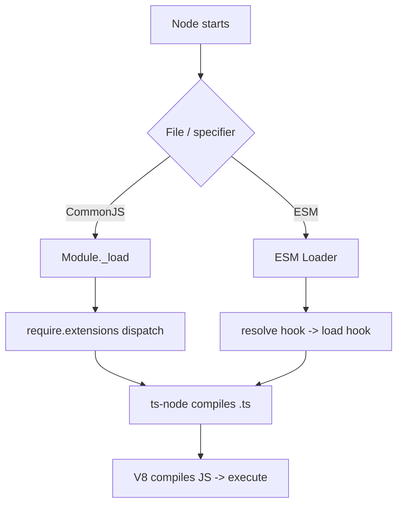
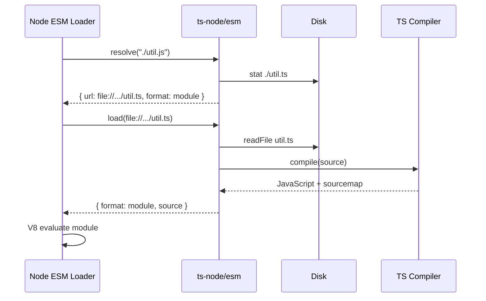
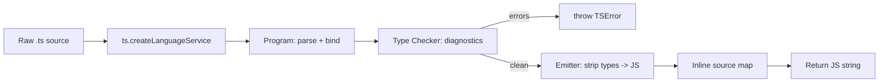
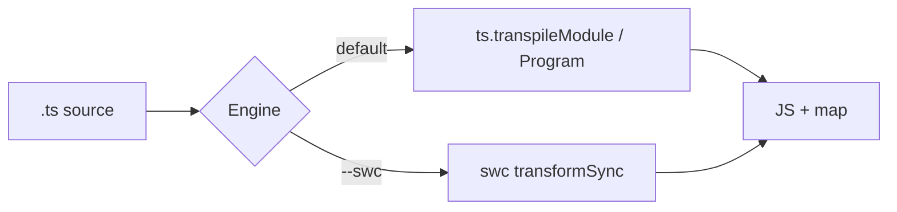
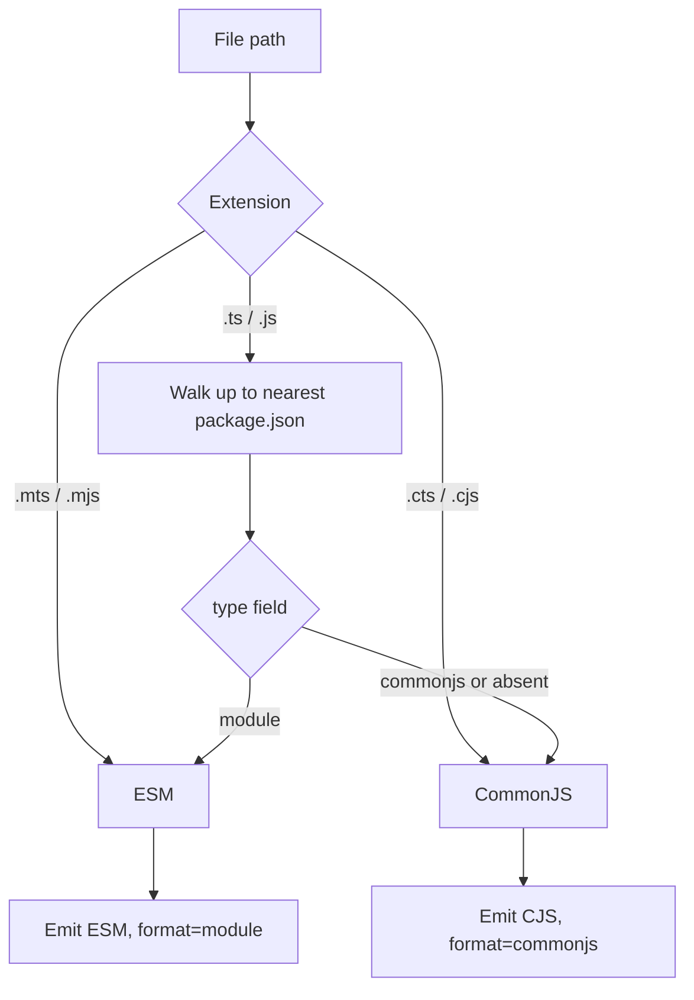
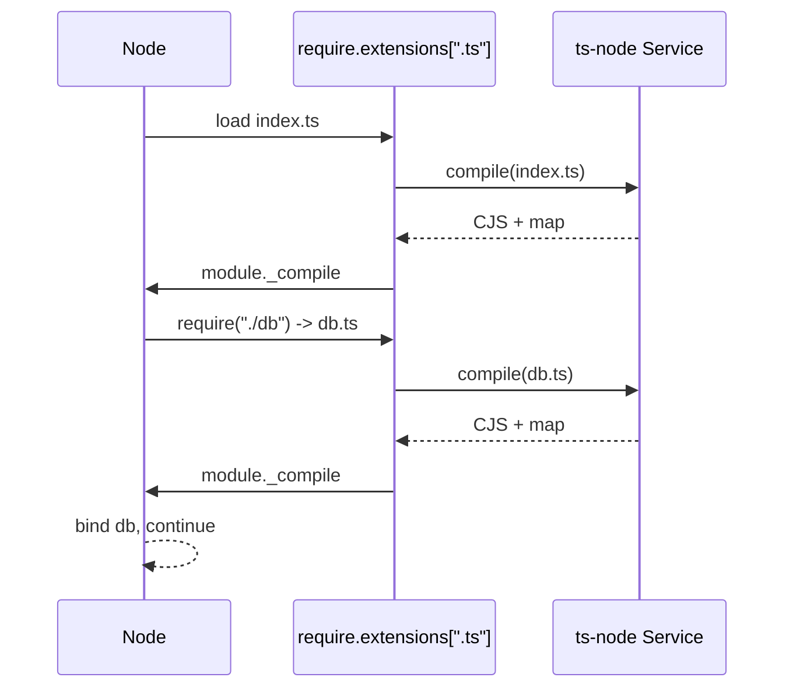

# ts-node — Under the Hood

## Table of Contents

1. [Overview](#overview)
2. [Node's Two Module Systems](#nodes-two-module-systems)
3. [The CommonJS require Hook](#the-commonjs-require-hook)
4. [require.extensions in Detail](#requireextensions-in-detail)
5. [The ESM Loader Hooks](#the-esm-loader-hooks)
6. [resolve and load Hook Contracts](#resolve-and-load-hook-contracts)
7. [The Registration Mechanism](#the-registration-mechanism)
8. [In-Memory Compilation Pipeline](#in-memory-compilation-pipeline)
9. [The Compiler Service and Caching](#the-compiler-service-and-caching)
10. [Source Maps and Stack Traces](#source-maps-and-stack-traces)
11. [Diagnostics and the Type Checker](#diagnostics-and-the-type-checker)
12. [The swc Path](#the-swc-path)
13. [Module Type Resolution Internals](#module-type-resolution-internals)
14. [How Native Node Type Stripping Differs](#how-native-node-type-stripping-differs)
15. [Building a Minimal ts-node](#building-a-minimal-ts-node)
16. [Performance Internals](#performance-internals)
17. [Edge Cases and Failure Modes](#edge-cases-and-failure-modes)
18. [Professional Checklist](#professional-checklist)
19. [Summary](#summary)

---

## Overview

This section dissects how `ts-node` actually works. The headline trick — "run TypeScript directly" — is implemented by **intercepting Node's module loading** and **compiling source to JavaScript in memory** before Node executes it. To understand it you must understand Node's module pipeline, the legacy `require.extensions` mechanism, the modern ESM loader hooks, and how `ts-node` wires the TypeScript compiler API into both.

The mental model: `ts-node` installs a translator at Node's "front door." Node never learns TypeScript; it always executes JavaScript. `ts-node` makes sure that whenever Node asks for a `.ts` file's contents, what it receives back is compiled JavaScript plus a source map.

---

## Node's Two Module Systems

Node has two independent loaders, and `ts-node` integrates with both:

| | CommonJS | ESM |
|---|----------|-----|
| Syntax | `require()`, `module.exports` | `import`, `export` |
| Loading | Synchronous | Asynchronous |
| Extension hook | `require.extensions[ext]` | loader `resolve`/`load` hooks |
| ts-node entry | `ts-node/register` | `ts-node/esm` |
| Determined by | default / `.cjs` / `.cts` | `"type":"module"` / `.mjs` / `.mts` |



---

## The CommonJS require Hook

In CommonJS, every `require(x)` goes through `Module._load` → `Module._resolveFilename` → `Module.prototype._compile`. The dispatch on file extension uses the public-ish map `require.extensions` (internally `Module._extensions`). Each entry is a function `(module, filename) => void` responsible for reading the file and calling `module._compile(source, filename)`.

`ts-node/register` overrides the `.ts` (and `.tsx`, `.jsx`, optionally `.js`) entries:

```javascript
// Conceptual shape of what ts-node installs (simplified)
const tsNodeService = createTsNodeService(options);

require.extensions[".ts"] = function (module, filename) {
  // 1. Read the raw TypeScript source from disk
  const rawSource = fs.readFileSync(filename, "utf8");

  // 2. Compile it (type-check + emit, or transpile-only) to JavaScript
  const jsOutput = tsNodeService.compile(rawSource, filename);

  // 3. Hand the JavaScript to Node's CommonJS compiler
  module._compile(jsOutput, filename);
};
```

Node then treats the emitted JavaScript exactly as if it had been a `.js` file: it wraps it in the module function wrapper `(exports, require, module, __filename, __dirname) => { ... }`, runs it, and caches the resulting `module.exports`.

This is why CommonJS `ts-node` is so robust: it slots into a decades-old, synchronous, well-understood mechanism. `__dirname` and `__filename` exist because Node provides them in the wrapper — no special ESM workaround needed.

---

## require.extensions in Detail

`require.extensions` is officially deprecated but remains the load-bearing mechanism for tools like `ts-node`, `babel-register`, and `@swc-node/register`. Key properties:

- It is a plain object keyed by extension (including the dot): `".ts"`, `".tsx"`.
- Lookup order follows `Module._extensions` keys; `.js`, `.json`, `.node` are built in.
- Installing a hook is just assigning a function; multiple registers can chain by saving and calling the previous handler.

```javascript
// Chaining: preserve any previously installed handler
const previous = require.extensions[".ts"];
require.extensions[".ts"] = function (module, filename) {
  // ... ts-node compiles ...
  // optionally: if not handled, fall back to `previous`
};
```

`ts-node` also flips `Module._preloadModules` indirectly: the `-r ts-node/register` flag tells Node to `require("ts-node/register")` before the entrypoint, which is what runs the installation code above.

---

## The ESM Loader Hooks

ESM is asynchronous and does not use `require.extensions`. Instead Node exposes **loader hooks** (historically `--loader`, now `--import` + `register()` from `node:module`). A loader can export up to three async hooks:

- `resolve(specifier, context, nextResolve)` — turn an import specifier into a fully-resolved URL plus a `format`.
- `load(url, context, nextLoad)` — given a URL, return the source and its `format` (`"module"`, `"commonjs"`, `"json"`, etc.).
- `globalPreload` / `initialize` — setup hooks run once.

`ts-node/esm` implements `resolve` and `load`:

```javascript
// Conceptual ts-node ESM loader (simplified)
export async function resolve(specifier, context, nextResolve) {
  // Map "./util.js" back to "./util.ts" if the .ts file exists,
  // and report format "module" so Node treats output as ESM.
  // Delegates to nextResolve for non-TS specifiers.
  return mappedResolution ?? nextResolve(specifier, context);
}

export async function load(url, context, nextLoad) {
  if (isTypeScript(url)) {
    const rawSource = await readFile(fileURLToPath(url), "utf8");
    const source = tsNodeService.compile(rawSource, fileURLToPath(url));
    return { format: "module", source, shortCircuit: true };
  }
  return nextLoad(url, context);
}
```

The asynchronous nature is why ESM `ts-node` runs in a separate "loader thread/context" in modern Node and cannot share state as freely with the main module graph as the CJS hook can.



---

## resolve and load Hook Contracts

The hook contract is what makes `ts-node`'s ESM mapping possible — and what makes it fragile across Node versions.

`resolve` returns:
```typescript
{
  url: string;          // fully resolved file:// URL
  format?: "builtin" | "commonjs" | "json" | "module" | "wasm" | null;
  shortCircuit?: boolean; // stop calling further hooks
}
```

`load` returns:
```typescript
{
  format: "builtin" | "commonjs" | "json" | "module" | "wasm";
  source: string | ArrayBuffer | TypedArray; // compiled JS
  shortCircuit?: boolean;
}
```

`ts-node` must decide the `format` carefully: a `.ts` whose nearest `package.json` is `"type": "module"` should be `"module"`; a `.cts` should be `"commonjs"`. Getting this wrong produces `ERR_REQUIRE_ESM` or `Unexpected token 'export'` errors. This dance is precisely why ESM `ts-node` is harder than CommonJS — the tool must reimplement Node's module-type determination to set `format` correctly.

The hook API has changed across Node releases (`getFormat`/`transformSource`/`getSource` were collapsed into `load`; `--loader` deprecated in favor of `register()` + `--import`). `ts-node` ships multiple entrypoints to match.

---

## The Registration Mechanism

"Registration" is the act of installing the hooks. There are several entry routes:

```bash
# 1. CLI wrapper — ts-node binary registers then runs your entry
ts-node src/app.ts

# 2. CommonJS preload
node -r ts-node/register src/app.ts

# 3. ESM loader (deprecated --loader form)
node --loader ts-node/esm src/app.ts

# 4. Modern --import form (Node 20.6+)
node --import ts-node/register/esm src/app.ts

# 5. Programmatic registration inside code
```

```typescript
// Programmatic registration (CommonJS)
import { register } from "ts-node";

register({
  transpileOnly: true,
  project: "tsconfig.scripts.json",
});

// From here on, require("./something.ts") works
```

For ESM, modern Node provides `module.register`:

```javascript
import { register } from "node:module";
import { pathToFileURL } from "node:url";

register("ts-node/esm", pathToFileURL("./"));
```

The `ts-node/register` module's side effect is to call `register()` from the `ts-node` package and patch `require.extensions`. The `-r`/`--require` flag simply guarantees this runs before your program — order matters, because the hook must exist before the first `.ts` `require`.

---

## In-Memory Compilation Pipeline

When a `.ts` file is loaded, `ts-node` runs it through the TypeScript compiler API. The pipeline (default, type-checked mode):



1. **Language Service / Program.** `ts-node` creates a TypeScript `LanguageService` (incremental) or a `Program`. The service holds the parsed ASTs and lets `ts-node` re-emit single files quickly as they are required.
2. **Type check.** In default mode, `getSemanticDiagnostics` + `getSyntacticDiagnostics` run for the file. Any diagnostics become a `TSError` thrown synchronously, which aborts loading.
3. **Emit.** The emitter strips type annotations and downlevels syntax per `tsconfig` `target`/`module`, producing JavaScript plus a source map.
4. **Return.** The JavaScript string is handed back to Node (via `module._compile` or the `load` hook source field).

In `--transpile-only`, steps 2 collapses: `ts.transpileModule` is used per-file with no cross-file type information, skipping the checker entirely.

---

## The Compiler Service and Caching

To avoid recompiling unchanged files, `ts-node` maintains a compiler service with caches:

- **In-memory LanguageService cache:** ASTs and emit results live for the process lifetime, so requiring the same file twice does not recompile.
- **File system cache (`TS_NODE_CACHE`, historically):** Older `ts-node` versions persisted compiled output to a cache dir keyed by source hash + compiler options; modern versions rely more on in-memory and on faster transpilers.
- **`ts-node-dev`/watchers:** Keep the service alive across restarts, so only changed files recompile — the big win over `nodemon` + fresh `ts-node`.

The cache key incorporates the source text, the resolved `tsconfig` compiler options, and the `ts-node` mode, so a config change correctly invalidates stale output.

---

## Source Maps and Stack Traces

`ts-node` makes stack traces point to `.ts` lines by:

1. **Emitting inline source maps.** It forces `sourceMap`/`inlineSourceMap` semantics so each compiled module carries a base64 source map comment.
2. **Installing `source-map-support`.** `ts-node` hooks `Error.prepareStackTrace` (via `source-map-support` or equivalent) so that when a stack trace is formatted, frame positions are translated from generated JS back to original TS coordinates.

```typescript
// Internally, roughly:
import { install } from "source-map-support";
install({
  retrieveSourceMap(path) {
    // Return the in-memory source map ts-node produced for `path`
    return tsNodeService.getSourceMap(path);
  },
});
```

Because the maps are in memory (no `.map` files on disk), the retrieval callback is essential — there is nothing on disk for the default loader to find.

---

## Diagnostics and the Type Checker

In default mode the relationship to `tsc` is direct: `ts-node` calls the same compiler API and surfaces the same diagnostic codes (e.g. `TS2345`). It throws a `TSError` aggregating diagnostics for the current file. Notable behaviors:

- It checks **per loaded file**, lazily, as modules are required — not the whole program upfront. So an unreferenced file with a type error may not be checked until imported.
- `ignoreDiagnostics` / `--ignore-diagnostics` can suppress specific codes.
- `--files` forces inclusion of `files`/`include` entries (e.g. ambient `.d.ts`) into the program so global augmentations are visible.

```json
// tsconfig.json
{
  "ts-node": {
    "ignoreDiagnostics": [7006],  // suppress a specific code if needed
    "files": true
  }
}
```

This lazy, per-file checking is also why default `ts-node` is *not* a substitute for `tsc --noEmit`: the latter checks the entire program graph, including files no script imports.

---

## The swc Path

With `--swc` (or `swc: true`), `ts-node` swaps the emit engine. Instead of `ts.transpileModule`, it calls `@swc/core`'s `transformSync` per file. `ts-node` still owns the registration and module-format logic; only the TS→JS transformation is delegated. swc:

- Parses with its Rust parser, strips types, downlevels per a synthesized `.swcrc` derived from your `tsconfig` (`target`, `jsx`, decorators).
- Does **no** type checking (so it is effectively transpile-only).
- Is much faster, at the cost of subtle emit differences (e.g. legacy decorator metadata requires explicit config).



---

## Module Type Resolution Internals

`ts-node` must answer Node's question "is this file ESM or CommonJS?" identically to Node, then tell the compiler to emit the matching module syntax. The decision tree mirrors Node:



If `ts-node` emits CommonJS but tells Node `format: "module"` (or vice versa), you get the classic `SyntaxError: Unexpected token 'export'` or `ERR_REQUIRE_ESM`. Matching these two decisions is the crux of correct ESM support.

---

## How Native Node Type Stripping Differs

Native stripping (`--experimental-strip-types`, default in 23.6+) takes a fundamentally simpler approach than `ts-node`:

| Aspect | ts-node | Native stripping |
|--------|---------|------------------|
| Engine | tsc / swc compiler | Internal swc-based stripper (`amaro`) |
| Type checking | Optional (default on) | Never |
| Syntax handled | Full TS | Erasable subset (no enums/namespaces in strip mode) |
| Source maps | Inline, via source-map-support | Built into Node |
| Transform TS-only syntax | Yes | Only with `--experimental-transform-types` |
| Hook mechanism | User-space loader hooks | Built into the runtime loader |

Native stripping does not parse-and-emit a full program; it does a lightweight tokenize-and-erase, replacing type annotation spans with whitespace to preserve byte offsets (so source maps are often unnecessary). This is why it cannot handle `enum` in strip-only mode — an enum is not erasable, it requires *emitting* runtime code, which is the job of `--experimental-transform-types` (which pulls in swc).

The architectural lesson: `ts-node` is a powerful, general translator that reimplements much of Node's loader semantics in user space; native stripping is a minimal, runtime-integrated eraser. Each suits different needs.

---

## Building a Minimal ts-node

A teaching implementation of the CommonJS path in ~15 lines clarifies the whole mechanism:

```typescript
// mini-ts-node.ts — run with: node -r ./mini-ts-node.js entry.ts
import * as fs from "node:fs";
import * as ts from "typescript";
import { addHook } from "pirates"; // or patch require.extensions directly

addHook(
  (code, filename) => {
    // Transpile-only: strip types, emit CJS
    const result = ts.transpileModule(code, {
      compilerOptions: {
        module: ts.ModuleKind.CommonJS,
        target: ts.ScriptTarget.ES2022,
        inlineSourceMap: true,
      },
      fileName: filename,
    });
    return result.outputText;
  },
  { exts: [".ts"], matcher: () => true }
);
```

This is essentially what `ts-node --transpile-only` does for CommonJS. The real implementation adds: type checking, ESM loader hooks, config resolution, caching, source-map-support installation, diagnostics formatting, and module-type detection.

---

## Performance Internals

Where time goes in default `ts-node`:

1. **Program/LanguageService construction** — parsing all reachable `.d.ts` (including `node_modules`) is the dominant cost on first require. `skipLibCheck: true` removes the type-checking portion of this.
2. **Type checking** — per-file semantic diagnostics. Eliminated by `--transpile-only`/`--swc`.
3. **Emit** — fast relative to checking.
4. **source-map-support installation** — one-time, negligible.

Levers, from cheapest to most impactful: `skipLibCheck` → `--transpile-only` → `--swc` → keep the service warm (`ts-node-dev`) → switch tool (`tsx`/native). The first require pays the program-build tax; subsequent requires hit the in-memory cache.

---

## Edge Cases and Failure Modes

| Symptom | Internal cause | Resolution |
|---------|----------------|------------|
| `Unexpected token 'export'` | Emitted ESM but loaded as CJS | Fix module-type detection: `.cts`/`type` field/config |
| `ERR_REQUIRE_ESM` | Sync `require` of an ESM graph node | Use `import()` or align module systems |
| Stack trace points to `.js` lines | source-map-support not installed / maps stripped | Ensure inline maps + `ts-node` default install |
| Global types missing | File not in program (lazy per-file load) | `"files": true` or import the `.d.ts` |
| `const enum` undefined at runtime | transpile-only/swc isolated emit | Avoid `const enum`; use `isolatedModules` |
| Loader ignored | `-r` ran too late / wrong entrypoint | Preload before entry; use correct CJS vs ESM entry |

---

## Tracing a Real Load End-to-End

Walking one concrete `require` clarifies how the pieces connect. Consider `node -r ts-node/register src/index.ts`, where `index.ts` does `import { db } from "./db";`.

1. **Preload.** Node `require`s `ts-node/register`, which builds the service and patches `require.extensions[".ts"]`.
2. **Entry load.** Node resolves `src/index.ts`, dispatches to the `.ts` extension handler.
3. **Compile entry.** The handler reads `index.ts`, the service type-checks it (default) and emits CommonJS with an inline map; `module._compile` runs it.
4. **Nested require.** Executing `index.ts` hits `require("./db")`. Node resolves it to `src/db.ts` (the handler is consulted; with `preferTsExts`, `.ts` wins over a sibling `.js`).
5. **Compile dependency.** `db.ts` flows through the same handler; its exports populate `module.exports` and are cached.
6. **Return.** `db` is bound in `index.ts`; execution continues.



The first compile pays the program-build tax; the `db.ts` compile reuses the warm service. This is why the *second* file is much cheaper than the first.

## Why ESM Cannot Reuse the CJS Trick

The CommonJS `require.extensions` hook works because `require` is synchronous and the map is a mutable global the preload can patch in time. ESM is fundamentally different:

- **Asynchronous resolution.** `import` returns promises; the loader hooks are async, so a synchronous extension map can't express them.
- **Static, hoisted imports.** ESM imports are resolved before the module body runs, so you cannot "install a hook from inside the entry" — it must exist before evaluation, hence `--import`/`register()` at process start.
- **Isolated loader context.** Recent Node runs loader hooks off-thread, so the hook can't simply mutate the main realm's globals the way the CJS hook does.

These constraints are the root cause of every ESM `ts-node` papercut: the tool must reproduce Node's async resolution and module-type logic faithfully, with far less room to "patch around" edge cases.

## Memory Model

The compiler service holds, for the process lifetime: parsed source files (ASTs), the type checker's symbol/type caches, and emitted output per file. This is why a `ts-node`-run process has a higher resident set than the same code compiled and run with plain `node` — the compiler's data structures stay live. For a dev process this is fine; for production it is one more concrete reason to ship compiled output (the runtime should not carry the compiler's heap).

## Source Map Internals in Detail

The inline source map is a base64-encoded JSON object appended as a comment:

```javascript
//# sourceMappingURL=data:application/json;base64,eyJ2ZXJzaW9uIjozLC4uLn0=
```

Decoded, it contains `version`, `sources` (the original `.ts` path), `names`, and `mappings` (VLQ-encoded position deltas). When an exception is thrown, V8 calls `Error.prepareStackTrace`. `source-map-support` overrides this function. For each `CallSite`, it:

1. Reads the generated file's URL and line/column.
2. Looks up the source map via the `retrieveSourceMap` callback (in-memory for `ts-node`).
3. Uses the `mappings` to translate the generated position to the original `.ts` position.
4. Rewrites the displayed frame.

Because the map is generated and held in memory, there is no `.map` file to find on disk — the callback is the only way `source-map-support` can locate it, which is exactly why `ts-node` installs that callback.

## Diagnostics Formatting

`ts-node` formats `TSError` using TypeScript's own diagnostic formatter, which produces the familiar `file.ts(line,col): error TSxxxx: message` output, optionally with a code frame. It aggregates all diagnostics for the current file into one thrown error so you see every problem at once rather than one-at-a-time:

```text
TSError: ⨯ Unable to compile TypeScript:
src/app.ts(3,18): error TS2345: Argument of type 'string' is not
  assignable to parameter of type 'number'.
```

The leading `⨯` and aggregation are `ts-node` conventions layered over the raw compiler diagnostics.

## Professional Checklist

- [ ] I can explain how `require.extensions[".ts"]` intercepts CommonJS loading.
- [ ] I can describe the ESM `resolve`/`load` hook contract and the `format` field's role.
- [ ] I understand why module-type detection (CJS vs ESM) is the crux of ESM support.
- [ ] I know source maps are inline and retrieved via a source-map-support callback.
- [ ] I can contrast `ts-node`'s full-compiler approach with native stripping's erase-only approach.
- [ ] I can build a minimal transpile-only hook from scratch.

---

## Summary

- `ts-node` intercepts Node's module loading: `require.extensions` for CommonJS, loader `resolve`/`load` hooks for ESM.
- It compiles `.ts` to JS in memory via the TypeScript compiler API (or swc), then hands JS to V8.
- Registration (`-r ts-node/register`, `--import`, `module.register`) installs these hooks before your entrypoint runs.
- Correct ESM support hinges on reproducing Node's CJS-vs-ESM decision so the emitted module syntax and reported `format` match.
- Inline source maps plus source-map-support give `.ts` stack traces; an in-memory service caches compiled output.
- Native Node type stripping is a minimal, runtime-integrated eraser — simpler than, and complementary to, `ts-node`'s full translator.

**Next step:** Specification — official `ts-node`, Node loader hook, and native type stripping documentation with direct links.
