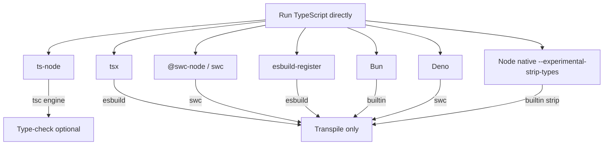
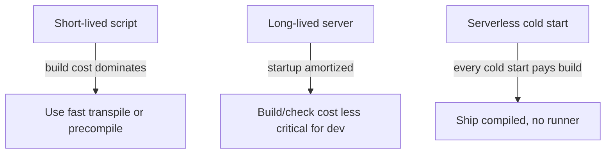

# ts-node — Senior Level

## Table of Contents

1. [Responsibilities at This Level](#responsibilities-at-this-level)
2. [The Landscape of TypeScript Runners](#the-landscape-of-typescript-runners)
3. [ts-node](#ts-node)
4. [tsx](#tsx)
5. [swc / @swc-node](#swc--swc-node)
6. [esbuild-register](#esbuild-register)
7. [Bun](#bun)
8. [Deno](#deno)
9. [Node Native Type Stripping](#node-native-type-stripping)
10. [Decision Matrix](#decision-matrix)
11. [Choosing for Dev](#choosing-for-dev)
12. [Choosing for CI](#choosing-for-ci)
13. [Why You Never Ship ts-node to Prod](#why-you-never-ship-ts-node-to-prod)
14. [Performance Benchmarking Methodology](#performance-benchmarking-methodology)
15. [Migration Strategies](#migration-strategies)
16. [Type Safety Strategy Across the Pipeline](#type-safety-strategy-across-the-pipeline)
17. [Architecture Recommendations](#architecture-recommendations)
18. [Senior Checklist](#senior-checklist)
19. [War Stories](#war-stories)
20. [Summary](#summary)

---

## Responsibilities at This Level

- Choose and standardize the TypeScript execution strategy across dev, test, CI, and production for an organization.
- Quantify startup/throughput trade-offs and justify tool choices with measurements, not vibes.
- Design a pipeline where running TypeScript is fast and type safety is enforced exactly once, reliably.
- Own the "never ship ts-node to prod" rule and provide the compiled-build alternative.
- Evaluate emerging runtimes (Bun, Deno, native Node type stripping) and decide when to adopt or wait.

---

## The Landscape of TypeScript Runners

By the senior level you must understand that `ts-node` is one option among several, and rarely the fastest. The choices split along two axes:

1. **Type checking:** Does the tool type-check (slow, safe) or only transpile (fast, unsafe)?
2. **Compiler engine:** TypeScript compiler API (`tsc`), `swc` (Rust), `esbuild` (Go), or a built-in transpiler (Bun's Zig-based, Deno's `swc`, Node's native stripper).



The crucial insight: **almost all of them only transpile**. Only `ts-node` (default mode) and `tsc` actually type-check. Everyone else assumes you check types separately. So the real question is never "which runner gives me types at runtime" — it is "which runner is fastest, and where do I run `tsc --noEmit`."

---

## ts-node

**Engine:** TypeScript compiler API (or swc/transpile-only).
**Type checks:** Yes by default (unique among runners).
**Strengths:**
- Compilation semantics exactly match `tsc` — fewest surprises.
- Optional real type checking at runtime.
- Mature `tsconfig.json` integration, REPL, register hooks.

**Weaknesses:**
- Slowest default startup (full type check).
- ESM support is the most finicky of the bunch.
- Heavier dependency footprint.

**When to choose:** Scripts where compilation fidelity to your build matters, where you actually want a type-checked run, or where you need the REPL/register-hook integration with a specific tool. For raw dev-loop speed, others win.

---

## tsx

**Engine:** esbuild.
**Type checks:** No (transpile only).
**Strengths:**
- Very fast startup (esbuild is Go-based).
- ESM-first and far less fiddly than `ts-node` — handles `.ts`/`.mts`/`.cts`, path aliases, and watch mode smoothly.
- Drop-in: `tsx file.ts`, `tsx watch file.ts`, `node --import tsx file.ts`.

```bash
npm install --save-dev tsx
tsx src/server.ts
tsx watch src/server.ts          # built-in watch + restart
node --import tsx src/server.ts  # register as a loader
```

**Weaknesses:**
- No type checking (by design).
- esbuild has minor semantic differences from tsc in rare edge cases (e.g. some decorator/emit behaviors).

**When to choose:** The default modern recommendation for the dev inner loop and for running scripts fast. Most teams migrating off `ts-node` go to `tsx`.

---

## swc / @swc-node

**Engine:** swc (Rust).
**Type checks:** No.
**Strengths:**
- Among the fastest transpilers.
- `@swc-node/register` integrates as a require/loader hook; `ts-node --swc` uses the same engine.
- Excellent for large test suites where transpile throughput dominates.

```bash
npm install --save-dev @swc-node/register @swc/core
node -r @swc-node/register src/app.ts
```

**Weaknesses:**
- No type checking.
- Some TypeScript features (advanced decorators metadata, certain emit modes) need extra `.swcrc` config.

**When to choose:** CI test runs (e.g. with Jest's `@swc/jest`) where you want maximum transpile speed and check types separately.

---

## esbuild-register

**Engine:** esbuild.
**Type checks:** No.
**Strengths:** Tiny, fast, simple register hook.
**Weaknesses:** No type checking; fewer features than `tsx` (which is built on esbuild and adds ESM polish).

```bash
node -r esbuild-register src/app.ts
```

**When to choose:** Lightweight hook scenarios; mostly superseded by `tsx` for end-user CLIs.

---

## Bun

**Engine:** Bun's built-in transpiler (native).
**Type checks:** No (Bun does not type-check; use `tsc` separately or `bun tsc`).
**Strengths:**
- Runs `.ts` natively with no config: `bun run src/app.ts`.
- Extremely fast startup; built-in test runner, bundler, package manager.
- First-class TypeScript and JSX support.

```bash
bun run src/server.ts
bun test          # built-in test runner understands TS
```

**Weaknesses:**
- It is a different runtime (not Node) — some Node APIs differ or are incomplete in edge cases.
- Adopting Bun for running TS may pull you toward Bun for everything.

**When to choose:** Greenfield projects or teams already on Bun. As a "ts-node replacement" specifically, Bun is appealing for speed but is a runtime decision, not just a tooling one.

---

## Deno

**Engine:** swc-based, built into the runtime.
**Type checks:** Yes by default (can disable with `--no-check`).
**Strengths:**
- Runs `.ts` natively; type-checks by default like `ts-node` does.
- Secure-by-default permissions, built-in tooling.

```bash
deno run --allow-read src/app.ts
deno run --no-check src/app.ts   # skip type check for speed
```

**Weaknesses:**
- Different runtime and module resolution (URL imports historically; now better npm compat).
- A migration, not a drop-in tool.

**When to choose:** When you want a runtime with native TS and type checking and are willing to adopt Deno's model. Not a same-runtime replacement for `ts-node` on Node.

---

## Node Native Type Stripping

This is the most important recent development and changes the calculus for `ts-node` going forward.

Node added the ability to run TypeScript by **stripping types** with no external tool:

- **Node 22.6+ (`--experimental-strip-types`):** Node removes type annotations and runs the resulting JS. It strips only — it does not transform TS-only syntax (enums, namespaces, parameter properties, certain decorators).
- **Node 22.7+ (`--experimental-transform-types`):** Additionally transforms TS-only constructs (enums, namespaces, `enum`, parameter properties) using swc internally.
- **Node 23.6+:** Type stripping is **enabled by default** — you can run `node file.ts` with no flag for the strip-only subset.
- **Node 24/LTS:** Native TypeScript support (strip-only) is stable and on by default; transform features remain behind a flag.

```bash
# Node 22.6 - 23.5: opt in
node --experimental-strip-types src/app.ts

# Need enums/namespaces transformed
node --experimental-transform-types src/app.ts

# Node 23.6+: just works for strip-only TS
node src/app.ts
```

**Critical constraints of native stripping:**
- It performs **no type checking** — purely syntactic erasure.
- Strip-only mode rejects TS-only syntax (`enum`, `namespace`, parameter properties) unless you enable transform.
- It requires explicit file extensions in imports (like ESM) and is intentionally minimal.
- `erasableSyntaxOnly` (`tsconfig.json`) flags code that won't strip cleanly.

```json
// tsconfig.json — keep your code compatible with native stripping
{
  "compilerOptions": {
    "erasableSyntaxOnly": true,   // ban enums/namespaces/param-props
    "verbatimModuleSyntax": true,
    "module": "NodeNext"
  }
}
```

**Strategic implication:** As native stripping matures and ships on by default, the need for a dedicated runner shrinks for many scripts. The future inner loop for plenty of projects is `node --watch src/server.ts` with `tsc --noEmit` for checking. `ts-node`'s remaining edge is *type-checked runs* and *compilation fidelity*, which native stripping deliberately does not provide.

---

## Decision Matrix

| Tool | Engine | Type-checks | Startup speed | ESM ease | Same runtime as Node | Notes |
|------|--------|-------------|---------------|----------|----------------------|-------|
| ts-node (default) | tsc | Yes | Slow | Hard | Yes | Highest fidelity; REPL |
| ts-node (--swc/--transpile-only) | swc/tsc | No | Fast | Hard | Yes | Faster, no checks |
| tsx | esbuild | No | Very fast | Easy | Yes | Modern default runner |
| @swc-node | swc | No | Very fast | Medium | Yes | Great for tests |
| esbuild-register | esbuild | No | Very fast | Medium | Yes | Minimal hook |
| Bun | builtin | No | Fastest | Easy | No (Bun) | Different runtime |
| Deno | swc | Yes | Fast | Easy | No (Deno) | Different runtime |
| Node native strip | builtin | No | Fastest (no tool) | N/A | Yes | Strip-only subset |

---

## Choosing for Dev

The dev inner loop optimizes for **restart latency** and **DX**, not type safety at runtime (your editor + a watch-mode `tsc --noEmit` cover types).

Recommendation ladder:
1. **Node native `--watch` + type stripping** (Node 23.6+) if your code is erasable-syntax-only — zero tooling.
2. **`tsx watch`** — fast, ESM-friendly, minimal config; the pragmatic default for most teams today.
3. **`ts-node --swc` / `ts-node-dev`** — if you are already invested in `ts-node` config and the register hook.
4. **`ts-node` (default)** — only when you specifically want type-checked runs in the loop.

```bash
# Modern dev loops
tsx watch src/server.ts
node --watch src/server.ts          # Node 23.6+
nodemon --exec "ts-node --swc" src/server.ts
```

---

## Choosing for CI

CI has two distinct jobs; do not conflate them:

1. **Type checking** — run `tsc --noEmit` (or `tsc -b` for project references). This is the one place you pay for full checking, and it gates merges.
2. **Tests** — use the fastest transpiler your test runner supports: `@swc/jest`, `vitest` (esbuild), or `tsx` for ad-hoc scripts. These do **not** type-check; that is fine because step 1 already did.

```yaml
# CI pipeline sketch
jobs:
  typecheck:
    run: tsc --noEmit          # the single source of type-safety truth
  test:
    run: vitest run            # esbuild transpile, fast, no type check
  build:
    run: tsc -p tsconfig.build.json
```

Using `ts-node` (default) in CI to "get type checking for free" is an anti-pattern: it re-checks per script and is slower and less complete than one `tsc --noEmit`.

---

## Why You Never Ship ts-node to Prod

This deserves a dedicated rationale because juniors keep doing it.

1. **Startup cost.** Every cold start compiles TypeScript before serving a request. In serverless and autoscaling environments this directly increases cold-start latency and cost.
2. **Dependency surface.** Production now depends on `typescript`, `ts-node`, and possibly `@swc/core` — large packages that should never be in a runtime image. More dependencies = more CVEs, bigger images, slower installs.
3. **No build-time guarantees.** Compiling at runtime means a type or syntax error can crash the server on deploy instead of failing the build. You lose the "broken builds never reach prod" guarantee.
4. **Determinism.** A prebuilt `dist/` is a frozen artifact you can hash, sign, and reproduce. Runtime compilation reintroduces variability (compiler version, env, caches).
5. **Performance.** Even `--transpile-only` adds per-file work and memory the production process should not bear.

The correct production path:

```json
{
  "scripts": {
    "build": "tsc -p tsconfig.build.json",
    "start": "node dist/server.js"
  }
}
```

```dockerfile
# Multi-stage: compiler stays out of the runtime image
FROM node:22 AS build
WORKDIR /app
COPY package*.json ./
RUN npm ci
COPY . .
RUN npm run build               # tsc -> dist/

FROM node:22-slim AS runtime
WORKDIR /app
COPY package*.json ./
RUN npm ci --omit=dev           # no ts-node / typescript in prod
COPY --from=build /app/dist ./dist
CMD ["node", "dist/server.js"]
```

Native type stripping does not change this: stripping ships untyped, unchecked code at runtime and still lacks build-time guarantees. For production, compile ahead of time.

---

## Performance Benchmarking Methodology

Do not trust headline numbers; measure your own code.

```bash
# Cold start comparison (run several times, take median)
hyperfine \
  'ts-node src/app.ts' \
  'ts-node --transpile-only src/app.ts' \
  'ts-node --swc src/app.ts' \
  'tsx src/app.ts' \
  'node --experimental-strip-types src/app.ts'
```

What to control for:
- Warm vs cold disk cache (run a warm-up iteration).
- Type-check inclusion (default ts-node does extra work; that is the point you are measuring).
- File count and dependency graph size (transpilers scale differently).
- Process spawn overhead vs steady-state throughput (for servers, measure both).

Typical findings: for a small script, native strip ≈ Bun < tsx ≈ swc < transpile-only ts-node ≪ default ts-node. The gap widens with codebase size.

---

## Migration Strategies

### From ts-node to tsx

```bash
# Before
"dev": "nodemon --exec ts-node src/server.ts"
# After
"dev": "tsx watch src/server.ts"
```

Watch for: path aliases (tsx supports tsconfig `paths`), ESM extension requirements (tsx is lenient but enable `verbatimModuleSyntax` to stay portable), and any reliance on `const enum` (tsx transpiles per-file).

### From ts-node to Native Node Stripping

1. Set `erasableSyntaxOnly: true` and fix violations (replace enums/namespaces).
2. Add explicit import extensions (`verbatimModuleSyntax`, `module: NodeNext`).
3. Switch dev to `node --watch src/server.ts`.
4. Keep `tsc --noEmit` in CI.

---

## Type Safety Strategy Across the Pipeline

The senior mental model: **type checking happens exactly once, in one authoritative place** — not implicitly inside every runner.


Runners (`ts-node --transpile-only`, `tsx`, swc, native strip) are all "untyped execution" stages. The green box is the gate. Whether dev uses `tsx` or `ts-node` is a speed/DX choice; the type-safety guarantee lives in CI.

---

## Architecture Recommendations

- **New projects:** `tsx` (or native Node stripping) for dev; `tsc -b` for build; `vitest` for tests; `tsc --noEmit` as the CI gate. Reserve `ts-node` for cases needing type-checked runs.
- **Existing ts-node projects:** Keep it if it works, but switch the dev loop to `--swc` or migrate to `tsx` for speed. Ensure a separate `tsc --noEmit` exists.
- **Monorepos:** Use project references and `tsc -b` for checking/building; pick one fast runner repo-wide for consistency.
- **Libraries:** Build with `tsc` (emit `.d.ts`); never ship a runner. Test with the fastest transpiler.

---

## Senior Checklist

- [ ] One authoritative `tsc --noEmit` (or `tsc -b`) gates all merges.
- [ ] Dev inner loop uses a fast transpiler (`tsx`/`--swc`/native strip), not default `ts-node`.
- [ ] Production runs compiled `node dist/...`; no `ts-node`/`typescript` in prod deps or image.
- [ ] Test runner uses swc/esbuild for transpile speed, types checked separately.
- [ ] `erasableSyntaxOnly`/`isolatedModules` enabled to keep code portable across transpilers and native stripping.
- [ ] Tool choice is justified by a benchmark on the real codebase, not a blog headline.

---

## War Stories

**The 8-second cold start.** A team ran `ts-node src/server.ts` as their production start command on serverless. Cold starts took 6–8s because the compiler ran on every container boot. Switching to a prebuilt `dist/` dropped cold start to <800ms and cut the container image by 60MB (removed `typescript` + `ts-node`).

**The hidden type error.** A team used `ts-node --transpile-only` everywhere and had no separate `tsc --noEmit`. A real type bug (a renamed field) shipped because nothing ever checked types. The fix was organizational, not technical: add the CI gate.

**The ESM rabbit hole.** A migration to `"type": "module"` broke every `ts-node` script with `ERR_UNKNOWN_FILE_EXTENSION` and missing-extension errors. The team spent days; the eventual fix was migrating dev scripts to `tsx`, which handled ESM with zero config.

---

## Reference Architecture Snippets

A senior should be able to produce these from memory.

### package.json for a service

```json
{
  "scripts": {
    "dev": "tsx watch src/server.ts",
    "typecheck": "tsc --noEmit",
    "test": "vitest run",
    "build": "tsc -p tsconfig.build.json",
    "start": "node dist/server.js"
  },
  "devDependencies": {
    "tsx": "^4.0.0",
    "typescript": "^5.6.0",
    "vitest": "^2.0.0"
  }
}
```

### CI gate (GitHub Actions sketch)

```yaml
jobs:
  ci:
    steps:
      - run: npm ci
      - run: npm run typecheck    # authoritative type safety
      - run: npm test             # fast transpile, no type check
      - run: npm run build        # produce dist/
```

Note the absence of `ts-node` anywhere in the production path — `dev` uses `tsx`, types are gated by `tsc`, prod runs `node dist`.

## Cost Model: Quantifying the Trade-offs

Reason about runner choice with a simple cost model rather than intuition.

```
Total per-run cost = spawn + program_build + type_check + transpile + execute
```

- **spawn:** process start (constant; Bun/native have the lowest because there's no extra tool).
- **program_build:** parse all reachable `.d.ts` (dominated by `node_modules`; `skipLibCheck` removes the check portion).
- **type_check:** semantic analysis (only default `ts-node`, Deno, and `tsc` pay this).
- **transpile:** TS→JS emit (tsc slow, swc/esbuild fast, native strip fastest).
- **execute:** your code (identical across runners on the same runtime).

For a server you pay this **once** at startup, then amortize over the process lifetime — so `program_build`/`type_check` matter less for long-lived processes and a lot for short scripts and serverless. For a script you run hundreds of times, `program_build` dominates, which is why precompiling hot scripts (see optimize.md) wins.



## Organizational Rollout

Standardizing a runner across teams is as much a people problem as a technical one.

1. **Audit current usage.** Grep for `ts-node`, `tsx`, `ts-node-dev`, loader flags, and prod `start` scripts. Catalog who runs what.
2. **Define the standard.** Document: dev loop tool, CI type-check command, test transform, build command, prod start. One page.
3. **Provide a template repo / generator.** Make the right setup the default for new services.
4. **Add guardrails.** A CI lint that fails if `ts-node`/`typescript` appear in `dependencies`, or if `start` invokes `ts-node`.
5. **Migrate incrementally.** Per-service, with the `tsc --noEmit` gate held constant so behavior is verifiable at each step.

```bash
# Example guardrail: fail CI if ts-node leaks into runtime deps
node -e "const p=require('./package.json');if((p.dependencies||{})['ts-node']||(p.dependencies||{}).typescript){console.error('ts-node/typescript must be devDependencies');process.exit(1)}"
```

## Reviewing Runner Choices in PRs

Things a senior flags in review:

- `ts-node`/`typescript` in `dependencies` → move to `devDependencies`.
- `start`/`Dockerfile CMD` invoking `ts-node` → require compiled output.
- `--transpile-only`/`tsx`/swc introduced without a corresponding `tsc --noEmit` gate.
- New `const enum`/`namespace` that breaks under transpile-only/native strip.
- ESM relative imports missing `.js` extensions.
- Deprecated `--loader` on Node 20.6+ → suggest `--import`.

## Summary

- `ts-node` is one runner among many; only it (default) and Deno type-check at runtime.
- For dev speed, `tsx`, `@swc-node`, and native Node type stripping beat default `ts-node`.
- Node 22.6+ strips types behind a flag; 23.6+ on by default; transform features (enums) need `--experimental-transform-types`.
- Never ship `ts-node` to prod: startup cost, dependency surface, no build-time guarantee, non-determinism.
- Type safety belongs in one authoritative `tsc --noEmit`/`tsc -b` CI gate, independent of the runner.
- Choose tools by benchmarking your real codebase, and keep code portable with `erasableSyntaxOnly`/`isolatedModules`.

**Key takeaways for the senior:**
- The runner is a speed/DX choice; the type-safety gate is non-negotiable and lives once in CI.
- Production never runs a runner — compile and ship `dist`.
- Native stripping is reshaping the default; keep code `erasableSyntaxOnly`-compatible to stay ready.

**Next step:** Professional level — exactly how ts-node hooks into Node's module loader, in-memory compilation, source maps, and the registration mechanism.
