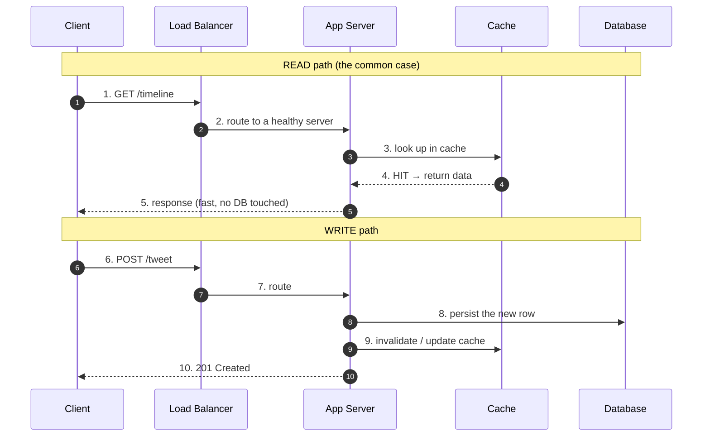

# Introduction — Junior Interview Questions

> **Collection:** [System Design](../README.md) · **Level:** Junior · **Section 01 of 42**
> **Goal:** Confirm you can explain what system design *is*, frame a problem before
> drawing boxes, separate *what* the system does from *how well* it does it, and
> reason with the order-of-magnitude numbers every engineer is expected to know.

A "junior" answer here is not a shallow answer — it is a *correct, concrete, and
honest* one. Interviewers at this level are checking that you have the vocabulary,
that you reach for real products as examples, and that you don't bluff. Each
question below lists **what the interviewer is really probing**, a **model answer**,
and a **follow-up** they will likely ask next.

---

## Contents

1. [What is System Design?](#1-what-is-system-design)
2. [How to Approach System Design](#2-how-to-approach-system-design)
3. [Functional vs Non-Functional Requirements](#3-functional-vs-non-functional-requirements)
4. [Key Characteristics](#4-key-characteristics)
5. [Numbers Every Engineer Should Know](#5-numbers-every-engineer-should-know)
6. [Rapid-Fire Self-Check](#6-rapid-fire-self-check)

---

## 1. What is System Design?

### Q1.1 — In one sentence, what is system design?

**Probing:** Do you understand it is about *structure and trade-offs*, not coding?

**Model answer:** System design is the process of defining the components of a
software system — services, data stores, queues, caches, network paths — and the
way they interact, so that the system meets its functional goals **and** its quality
goals (scale, latency, availability, cost) under real-world failure conditions.
Coding decides whether *one* machine does the right thing; system design decides how
*many* machines do the right thing together when some of them are broken.

**Follow-up:** *"How is it different from writing a class diagram?"* → A class
diagram is one process's internal structure; system design spans processes, machines,
and networks, where the dominant concern is partial failure and latency, not object
relationships.

### Q1.2 — Why can't we just put everything on one powerful server?

**Probing:** Awareness of the *three* forcing functions: scale, availability, geography.

**Model answer:** A single server has three hard ceilings. **(1) Scale** — one box has
a finite CPU, RAM, and disk; past some load it cannot keep up no matter how big it is
(vertical scaling has a top). **(2) Availability** — one box is a single point of
failure; when it reboots or its disk dies, the whole product is down. **(3)
Geography** — users in Tokyo talking to a server in Virginia pay ~150 ms of round-trip
latency they can never get back. Distributing the system addresses all three, at the
cost of new problems: coordination, consistency, and partial failure.

### Q1.3 — Give a concrete example of a system design decision in a product you use.

**Probing:** Can you connect theory to a real product? Junior answers that stay
abstract are weak.

**Model answer:** When you upload a photo to Instagram, the app doesn't make you wait
for the photo to be resized into every thumbnail size before the post appears. The
*write path* stores the original and returns quickly; a *background job* generates
the resized variants afterward. That asynchronous split — fast write path, deferred
heavy work — is a deliberate system design choice that trades a few seconds of
eventual consistency (thumbnails appear slightly later) for a fast, responsive upload.

---

## 2. How to Approach System Design

### Q2.1 — You're asked to "design Twitter." What are your first three moves?

**Probing:** Do you clarify before drawing? Jumping straight to boxes is the #1 junior mistake.

**Model answer:**
1. **Clarify scope and requirements** — Which features? (post a tweet, follow, home
   timeline?) Read-heavy or write-heavy? How many users? This decides everything else.
2. **Estimate scale** — rough Daily Active Users, reads-per-second vs writes-per-second,
   storage growth per year. A 10K-user system and a 300M-user system are different designs.
3. **Sketch the high-level data flow** — client → API → service → data store — *then*
   iterate on the one or two parts that the scale numbers say are hard.

**Follow-up:** *"Why estimate before designing?"* → Because the numbers tell you which
problem is real. If reads outnumber writes 1000:1, your design centers on caching and
fan-out, not on write throughput.

### Q2.2 — Walk me through a simple read path and a simple write path.

**Probing:** Mechanical fluency with the canonical request flow.

**Model answer:** Reads try the cache first and only fall through to the database on a
miss; that keeps the database load low and responses fast. Writes go to the database
(the source of truth) and then must *invalidate or update* the cache so later reads
don't serve stale data. The hard part of the write path is keeping the cache and the
database in agreement — that's cache invalidation.

### Q2.3 — What does "design for the next 10x, not for today" mean?

**Probing:** Forward-looking thinking without over-engineering.

**Model answer:** It means choosing an architecture that won't need a rewrite when load
grows by roughly an order of magnitude — e.g., keeping app servers *stateless* so you
can add more behind the load balancer. It does **not** mean building for 1000x today;
that wastes effort and money on scale you may never reach. The skill is picking the
designs that buy you headroom cheaply (statelessness, a cache, a queue) and deferring
the expensive ones (sharding, multi-region) until the numbers demand them.

---

## 3. Functional vs Non-Functional Requirements

### Q3.1 — Define functional vs non-functional requirements with examples.

**Probing:** The single most important framing skill at this level.

**Model answer:**

| | Functional (what it does) | Non-Functional (how well it does it) |
|---|---|---|
| **Question** | "What feature?" | "How fast / reliable / scalable?" |
| **Example (chat app)** | Send a message, see read receipts, create a group | Messages deliver in < 500 ms, 99.99% uptime, support 10M concurrent users |
| **Tested by** | Does the feature work at all? | Does it hold up under load and failure? |

Functional requirements are the *features*; non-functional requirements (NFRs, the
"-ilities") are the *quality constraints*. In a system design interview, the NFRs —
scale, latency, availability — are usually what make the problem interesting and drive
the architecture.

### Q3.2 — Which usually drives the architecture more, and why?

**Model answer:** The non-functional requirements. "Store and retrieve a short URL" is
trivial functionally — but "serve 100K redirects/second at < 10 ms with 99.99%
availability" is what forces caching, replication, and a carefully chosen data store.
Two products with identical features and different NFRs get completely different designs.

### Q3.3 — Name three non-functional requirements other than speed.

**Model answer:** **Availability** (fraction of time the system is up), **durability**
(once data is acknowledged, it is never lost), and **maintainability** (how cheaply a
team can operate and evolve it). Others worth naming: scalability, security,
consistency, and cost-efficiency.

---

## 4. Key Characteristics

### Q4.1 — Define scalability, availability, reliability, maintainability — and don't conflate them.

**Probing:** Precise vocabulary. Juniors often blur availability and reliability.

**Model answer:**

| Characteristic | Plain definition | Failing example |
|---|---|---|
| **Scalability** | Handle more load by adding resources, ideally near-linearly | Site slows to a crawl during a traffic spike |
| **Availability** | The fraction of time the system responds | Site returns 503s for 2 hours |
| **Reliability** | It produces *correct* results and doesn't lose data | Site is "up" but charges your card twice |
| **Maintainability** | A team can change and operate it safely and cheaply | Every deploy takes a weekend and a prayer |

The key distinction: **available** = "it answered." **Reliable** = "it answered
*correctly* and kept its promises about your data." A system can be highly available
and still unreliable (returns wrong answers fast).

### Q4.2 — What does "four nines" mean in real downtime?

**Probing:** Can you turn an SLA percentage into something concrete?

**Model answer:** "Nines" is availability expressed as a percentage; each extra nine is
~10x less downtime.

| Availability | Downtime per year | Downtime per day |
|---|---|---|
| 99% (two nines) | ~3.65 days | ~14.4 min |
| 99.9% (three nines) | ~8.76 hours | ~1.44 min |
| 99.99% (four nines) | ~52.6 minutes | ~8.6 sec |
| 99.999% (five nines) | ~5.26 minutes | ~0.86 sec |

Four nines means you can afford only about **52 minutes of downtime for the entire
year** — which is why you can't reach it with a single server that needs occasional
reboots; you need redundancy and automated failover.

### Q4.3 — Vertical vs horizontal scaling — one line each, and one trade-off.

**Model answer:** **Vertical** = a bigger machine (more CPU/RAM); simple, but has a
hard ceiling and is a single point of failure. **Horizontal** = more machines behind a
load balancer; no practical ceiling and naturally redundant, but requires the app to be
*stateless* and introduces coordination. The trade-off: vertical is simpler but caps
out and can't survive a machine dying; horizontal scales and survives failure but adds
distributed-systems complexity.

---

## 5. Numbers Every Engineer Should Know

### Q5.1 — Why memorize latency numbers at all?

**Probing:** Purpose, not rote recall.

**Model answer:** Because they let you sanity-check a design in seconds without writing
code. If a request plan involves 50 sequential cross-continent round trips, the latency
numbers immediately tell you it will take seconds — no benchmark needed. They turn
"feels slow" into "is ~7.5 seconds, here's why."

### Q5.2 — Rank these by latency: L1 cache, SSD read, main memory, network round-trip within a datacenter, cross-continent round-trip.

**Probing:** Order-of-magnitude intuition (the "Latency Numbers Every Programmer Should
Know" table).

**Model answer:** From fastest to slowest, by rough order of magnitude:

| Operation | Rough latency | Relative |
|---|---|---|
| L1 cache reference | ~1 ns | 1x |
| Main memory (RAM) reference | ~100 ns | ~100x |
| SSD random read | ~16 µs | ~16,000x |
| Round-trip within a datacenter | ~0.5 ms | ~500,000x |
| Round-trip cross-continent (e.g., CA↔Netherlands) | ~150 ms | ~150,000,000x |

The headline takeaways: **memory is ~100x slower than L1; disk is ~100x slower than
memory; and the network — especially across continents — dwarfs everything.** This is
why we cache in memory and why we try to avoid chatty cross-region calls.

### Q5.3 — Roughly how much storage is 1 billion rows of 1 KB each?

**Probing:** Comfort doing back-of-envelope math out loud.

**Model answer:** 1 billion × 1 KB = 10⁹ × 10³ bytes = 10¹² bytes = **1 TB** (raw,
before indexes and replication). With, say, 3x replication and indexing overhead,
budget **3–5 TB**. The point isn't an exact figure — it's knowing instantly whether the
answer is gigabytes, terabytes, or petabytes, because that decides single-node vs
sharded storage.

### Q5.4 — A service handles 1M requests/day. Roughly what's its average requests/second?

**Model answer:** A day has ~86,400 seconds (≈ 10⁵). 1,000,000 ÷ 100,000 ≈ **~12 req/s
average**. But traffic is rarely flat — peak is often **2–5x the average**, so design
for ~25–60 req/s, not 12. The habit of converting "per day" to "per second" and then
multiplying for peak is the core of capacity estimation.

---

## 6. Rapid-Fire Self-Check

If you can answer each of these in a sentence, you're ready for the junior bar on this section:

- [ ] What are the three reasons one server isn't enough? *(scale, availability, geography)*
- [ ] What are the first three steps when asked to design a system? *(clarify → estimate → sketch flow)*
- [ ] Functional vs non-functional — which usually drives the architecture? *(non-functional)*
- [ ] Available vs reliable — what's the difference? *(answered vs answered correctly)*
- [ ] How much yearly downtime is "four nines"? *(~52 minutes)*
- [ ] Vertical vs horizontal scaling — one trade-off each.
- [ ] Why is a cross-continent round-trip the number you most want to avoid in a hot path?
- [ ] 1 billion × 1 KB ≈ ? *(~1 TB raw)*

> 🎞️ **See it animated:** [Latency numbers, interactive](https://colin-scott.github.io/personal_website/research/interactive_latency.html)

---

**Next step:** Section 02 — [Trade-offs Framework](02-tradeoffs-framework.md): CAP, PACELC, and consistency vs availability.
