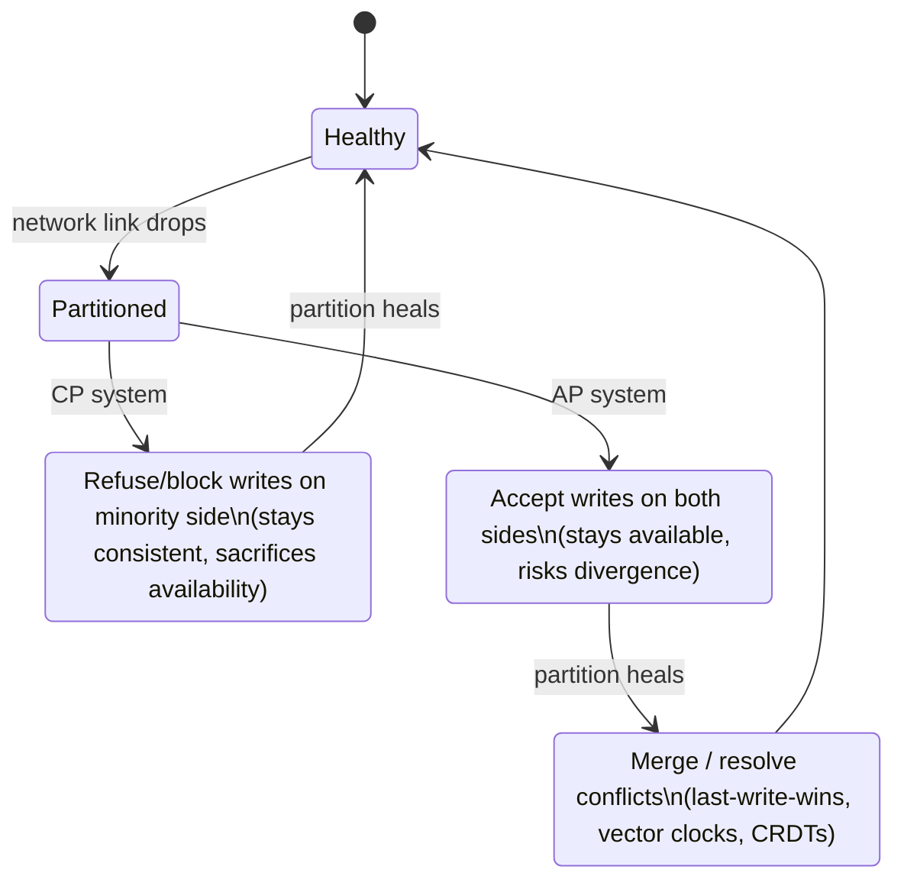
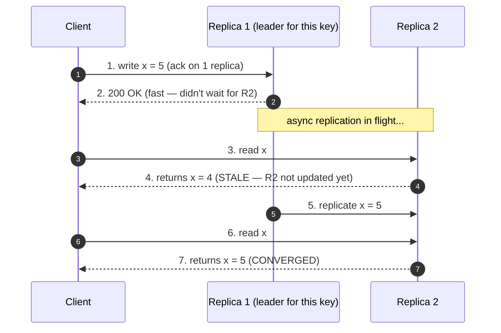

# Trade-offs Framework — Junior Interview Questions

> **Collection:** [System Design](../README.md) · **Level:** Junior · **Section 02 of 42**
> **Goal:** Confirm you can state the CAP theorem precisely, extend it with PACELC,
> and reason about the consistency-vs-availability spectrum using real products —
> without falling into the classic "CAP means pick two" trap.

Distributed systems are governed by laws you cannot vote against. The CAP theorem and
its refinement PACELC are the two most-cited of those laws, and they are the heart of
almost every "what database would you use here?" conversation. A junior who can state
them *exactly* — and pick the right side of the trade-off for a bank ledger versus a
shopping cart — already sounds senior. Each question below lists **what the interviewer
is really probing**, a **model answer**, and often a **follow-up**.

---

## Contents

1. [CAP Theorem](#1-cap-theorem)
2. [PACELC](#2-pacelc)
3. [Consistency vs Availability](#3-consistency-vs-availability)
4. [Rapid-Fire Self-Check](#4-rapid-fire-self-check)

---

## 1. CAP Theorem

### Q1.1 — State the CAP theorem precisely. What do C, A, and P each mean?

**Probing:** Do you know the *exact* definitions, or just the slogan "pick two"?

**Model answer:** CAP says that in the presence of a **network partition (P)**, a
distributed system must choose between **consistency (C)** and **availability (A)** — it
cannot have both. Precisely:

- **Consistency** (here meaning *linearizability*): every read sees the most recent
  acknowledged write, as if there were a single up-to-date copy of the data.
- **Availability:** every request to a non-failed node receives a non-error response,
  eventually.
- **Partition tolerance:** the system keeps operating even when the network drops or
  delays messages between nodes.

The subtlety: **P is not optional.** In any real distributed system the network *will*
partition, so you don't "choose" P — you choose what to do *during* a partition. That's
why the honest statement is "**when partitioned, choose C or A**," not "pick two of three."

**Follow-up:** *"So is 'pick two' wrong?"* → It's misleading. A non-distributed,
single-node database is trivially CA, but the moment you replicate across machines you
must tolerate partitions, so the only live choice is C vs A.

### Q1.2 — Walk me through what actually happens to a CP system versus an AP system during a partition.

**Probing:** Can you connect the abstract theorem to observable behavior?

**Model answer:** Imagine two data-center replicas that can no longer talk to each other.

- A **CP** system (e.g., a system built on a consensus protocol like a strongly
  configured etcd or ZooKeeper) refuses to serve writes — and often reads — on the side
  that can't reach a majority. It would rather return an error than risk giving you a
  stale or conflicting answer. **Consistency preserved, availability sacrificed.**
- An **AP** system (e.g., Cassandra or DynamoDB in their default tunings) keeps accepting
  reads and writes on *both* sides of the partition. Nobody gets an error, but the two
  sides can now diverge; when the network heals, the system reconciles the conflict.
  **Availability preserved, consistency sacrificed (temporarily).**

**Follow-up:** *"How does the AP system clean up afterward?"* → Conflict resolution:
last-write-wins by timestamp, vector clocks to detect concurrent edits, or CRDTs that
merge deterministically. A shopping cart, for example, can union the two carts.

### Q1.3 — Classify these as CP or AP: a bank's core ledger, a social-media "like" counter.

**Probing:** Can you map the trade-off onto real product requirements?

**Model answer:** The **bank ledger is CP.** If a partition makes it impossible to
confirm an account's true balance, the bank must *refuse* the transaction rather than
risk a double-spend or a negative balance — correctness beats uptime for money. The
**like counter is AP.** If two replicas can't sync for a few seconds, showing "1,204
likes" on one side and "1,205" on the other is completely harmless; staying responsive
matters far more than momentary exactness. The rule of thumb: **money and inventory lean
CP; counters, feeds, and carts lean AP.**

### Q1.4 — A teammate says "we made our system CA so we don't have to worry about partitions." What's wrong with that?

**Probing:** Do you catch the most common CAP misconception?

**Model answer:** You don't get to *choose* CA in a real distributed system. Partitions
are a fact of networks — cables get cut, switches reboot, packets are lost — so partition
tolerance isn't a feature you add, it's a condition you're forced to handle. "CA" only
describes a single-node system (no network between replicas to partition). The moment the
system spans machines, the real decision is **CP or AP**, and pretending otherwise just
means the system will behave unpredictably the first time the network hiccups.

---

## 2. PACELC

### Q2.1 — What does PACELC add that CAP leaves out?

**Probing:** Awareness that CAP only describes the *failure* case, not normal operation.

**Model answer:** CAP only tells you what happens *during* a partition. But partitions are
rare; systems spend almost all their time healthy. PACELC extends CAP to the normal case:

> **If** there is a **P**artition, choose between **A**vailability and **C**onsistency;
> **E**lse (no partition, normal operation), choose between **L**atency and **C**onsistency.

So PACELC reads as **P-A-C / E-L-C**. The new insight is the **else** branch: even with a
perfectly healthy network, a replicated system that insists on strong consistency must
coordinate across replicas before answering — and that coordination costs **latency**. So
the everyday trade-off most users actually feel is not availability, it's *speed*.

**Follow-up:** *"Why is the everyday trade-off the more important one in practice?"* →
Because you live in the "else" branch 99.9% of the time. Partitions are occasional;
latency is paid on *every single request*.

### Q2.2 — Classify some well-known stores in PACELC terms.

**Probing:** Can you place real products on both axes, not just the CAP axis?

**Model answer:** PACELC gives a four-letter signature: the letter after **P** is the
partition-time choice, the letter after **E** is the normal-time choice.

| System | PACELC | Reading |
|---|---|---|
| DynamoDB / Cassandra (default) | **PA/EL** | During a partition, stay available; normally, favor low latency over strong consistency |
| A consensus store (etcd, ZooKeeper, Spanner) | **PC/EC** | During a partition, stay consistent; normally, *still* favor consistency even at a latency cost |
| MongoDB (default) | **PA/EC** | During a partition, the primary side favors availability; normally, reads from the primary are consistent |
| Cassandra with `QUORUM` reads+writes | **PC/EC** | Tuned toward consistency on both branches |

The key takeaway: **the same product can move on the chart** by changing its consistency
level (e.g., Cassandra's tunable consistency). PACELC describes a *configuration's*
behavior, not just a product's brand.

### Q2.3 — Spanner is famously "consistent and highly available." Doesn't that break CAP?

**Probing:** Do you understand the difference between *theoretically* CP and *practically*
highly available?

**Model answer:** It doesn't break CAP. Google Spanner is **PC/EC** — it chooses
consistency on both branches. When a true partition isolates a replica, Spanner will
sacrifice availability on that side, exactly as CAP requires. What makes it *feel*
"always up" is that Google runs it on a private network so reliable that partitions are
extraordinarily rare, and it uses tightly synchronized clocks (TrueTime) to keep
coordination cheap. So Spanner is CP in theory and highly available in practice — it
didn't escape the trade-off, it just made the bad branch almost never fire.

---

## 3. Consistency vs Availability

### Q3.1 — Define strong, eventual, and weak consistency, with one example each.

**Probing:** Precise vocabulary on the consistency spectrum — juniors often blur these.

**Model answer:** Consistency is a spectrum of *how fresh* a read is guaranteed to be:

| Model | Guarantee | Example |
|---|---|---|
| **Strong** | Every read reflects the latest acknowledged write, everywhere, immediately | A bank balance after a withdrawal; a primary-key read in a single-node SQL database |
| **Eventual** | Replicas converge to the same value *given enough time with no new writes*; a read may be temporarily stale | DNS propagation; a DynamoDB read right after a write; a follower count that lags a few seconds |
| **Weak** | No guarantee that you'll ever read a given write; best-effort | A live video frame or VoIP packet — a dropped frame is simply skipped, never retried |

The progression is **strong → eventual → weak** = *more freshness guarantee → less*, in
exchange for *more latency/coordination → less*.

**Follow-up:** *"Where does 'read-your-own-writes' fit?"* → It's a useful middle ground
(a session guarantee): the system is eventually consistent globally, but *you* always see
*your own* latest writes — which is why your own tweet appears instantly even if others
see it a moment later.

### Q3.2 — Walk through a write to an AP store, then a stale read, then convergence.

**Probing:** Mechanical understanding of *why* eventual consistency produces stale reads.

**Model answer:** The write is acknowledged as soon as *one* replica accepts it, which is
why it's fast — it didn't wait for every replica to agree. Replication to the other
replicas happens asynchronously. So a read that hits a not-yet-updated replica (step 4)
sees the *old* value: that's the stale read. After replication catches up (step 5), all
replicas hold the new value and subsequent reads converge (step 7). The window of
staleness is usually milliseconds, but it is non-zero — and that's the entire bargain of
eventual consistency: speed and availability now, in exchange for a brief lag.

### Q3.3 — How does replication relate to the consistency choice?

**Probing:** Do you see that *where you wait* determines the trade-off?

**Model answer:** Replication is *how* you make data durable and available across machines;
the consistency choice is *when you let a write be acknowledged*.

- **Synchronous replication** — the write isn't acked until enough replicas confirm it.
  This buys strong consistency (and survives a replica dying) at the cost of higher write
  latency: you pay for the slowest replica in the quorum.
- **Asynchronous replication** — the write is acked by one replica and propagated in the
  background. This is fast and stays available during a partition, but opens the stale-read
  window above.

Quorum systems generalize this: if you have `N` replicas and require `W` to confirm a
write and `R` to confirm a read, then **`W + R > N` guarantees a read overlaps with the
latest write** — strong consistency — whereas smaller `W` and `R` favor latency and
availability. Tuning `W` and `R` is literally dialing the C-vs-A knob.

### Q3.4 — What is failover, and what does it cost you on the consistency axis?

**Probing:** Connecting availability mechanics to consistency risk.

**Model answer:** Failover is automatically promoting a healthy replica to take over when
the primary fails, so the system keeps serving — it's a core availability mechanism. The
catch: if the old primary had writes that hadn't yet replicated to the new primary
(async replication), those writes can be **lost or rolled back** on promotion. So failover
trades a small consistency/durability risk for continued availability. CP systems reduce
this risk by only promoting a replica that's part of the up-to-date majority (consensus),
which is safer but means failover can *refuse* to happen if a majority isn't reachable.

### Q3.5 — When would you deliberately choose eventual consistency over strong?

**Probing:** Judgment — knowing that strong is not automatically "better."

**Model answer:** Choose eventual consistency when **staleness is cheap and uptime/latency
are valuable** — high-write, read-tolerant features at scale: social feeds, like counts,
view counts, product recommendations, presence indicators, a shopping cart. There, a
half-second of staleness is invisible to users, while the AP store's low latency and
partition resilience are worth a lot. Choose **strong** consistency when **a stale read can
cause real harm**: money transfers, inventory decrements that must not oversell, unique
username registration, permission checks. The senior instinct is that **strong
consistency is a cost you pay only where correctness demands it** — not a default.

---

## 4. Rapid-Fire Self-Check

If you can answer each of these in a sentence, you're ready for the junior bar on this section:

- [ ] State CAP precisely. *(during a partition, choose C or A — P is not optional)*
- [ ] Why is "pick any two of three" misleading? *(you can't opt out of partitions in a distributed system)*
- [ ] What does a CP system do during a partition? An AP system? *(refuse writes vs accept and reconcile later)*
- [ ] Bank ledger vs like counter — CP or AP? *(CP vs AP)*
- [ ] Expand PACELC. *(if Partition: A vs C; Else: Latency vs C)*
- [ ] Why is the "else" branch the one users feel most? *(latency is paid on every request; partitions are rare)*
- [ ] Strong vs eventual vs weak — one example each. *(bank balance / DNS / dropped video frame)*
- [ ] What does `W + R > N` guarantee, and why? *(read overlaps latest write → strong consistency)*
- [ ] What can failover cost you? *(unreplicated writes lost on promotion)*
- [ ] Name two features where eventual consistency is the *right* choice. *(feeds, like counts, carts, presence)*

> 🎞️ **See it animated:** [The Raft consensus protocol, visualized](https://raft.github.io/)

---

**Next step:** Section 03 — [Capacity Estimation](03-capacity-estimation.md): turning DAU, QPS, and storage growth into back-of-envelope numbers.
