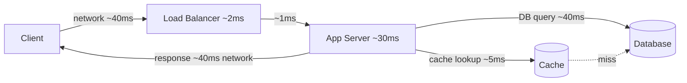

# Capacity Estimation — Junior Interview Questions

> **Collection:** [System Design](../README.md) · **Level:** Junior · **Section 03 of 42**
> **Goal:** Confirm you can turn product numbers — users, posts, payload sizes — into
> the four quantities every design rests on: **requests/second, storage, bandwidth,
> and a latency budget**. The skill being tested is fast, honest, order-of-magnitude
> arithmetic done *out loud*, not exact figures from a spreadsheet.

Capacity estimation is the cheapest design tool you own: a minute of arithmetic tells
you whether a problem needs one box or a thousand, gigabytes or petabytes, a cache or a
shard. Junior interviewers are not checking whether you land on the "right" number —
they're checking that you **round aggressively, show every step, and separate average
from peak**. Each question below lists what the interviewer is really probing, a model
answer with explicit math, and a likely follow-up.

A few rounding habits used throughout, worth committing to memory:

- 1 day ≈ **86,400 s ≈ 10⁵ s** (rounding 86,400 → 100,000 keeps the math one-line).
- 1 month ≈ 30 days ≈ **2.6M s**; 1 year ≈ **31.5M s ≈ 3 × 10⁷ s**.
- 1 KB = 10³ B, 1 MB = 10⁶ B, 1 GB = 10⁹ B, 1 TB = 10¹² B (powers of ten, not 1024 — close enough).
- **Peak ≈ 2–5× average** unless told otherwise; default to ~3×.

---

## Contents

1. [QPS — From Per-Day to Per-Second](#1-qps--from-per-day-to-per-second)
2. [Storage — Sizing Rows, Replication, and Growth](#2-storage--sizing-rows-replication-and-growth)
3. [Bandwidth — Ingress, Egress, and Payload Sizing](#3-bandwidth--ingress-egress-and-payload-sizing)
4. [Latency Budgets — Splitting an End-to-End Target](#4-latency-budgets--splitting-an-end-to-end-target)
5. [Rapid-Fire Self-Check](#5-rapid-fire-self-check)

---

## 1. QPS — From Per-Day to Per-Second

### Q1.1 — A service handles 10M requests/day. What's its average QPS, and what should you design for?

**Probing:** The core conversion — per-day → per-second — and the reflex to multiply for peak.

**Model answer:** Divide by the seconds in a day, rounded to 10⁵:

> 10,000,000 ÷ 86,400 ≈ 10⁷ ÷ 10⁵ = **~115 req/s average** (≈ 100 to round).

Traffic is never flat, so I don't size for the average. Assuming a ~3× peak:

> 115 × 3 ≈ **~350 req/s peak** — that's the number capacity is planned against.

The headline: *average tells you the bill, peak tells you the box count.* You provision
for peak (plus headroom), not for the daily mean.

**Follow-up:** *"Where does the 3× come from?"* → It's a default for a consumer app with
a daily usage curve (quiet at night, busy in the evening). If the product is global and
always-on, peak is flatter (~1.5–2×); if it's spiky (ticket sales, flash deals), peak
can be 10×+. Always state the multiplier you assumed.

### Q1.2 — 200M daily active users each make 20 requests/day. What's the peak QPS?

**Probing:** Comfort chaining two multiplications, then converting, then peaking.

**Model answer:** Total daily requests first, then per-second, then peak:

> 200M × 20 = **4 × 10⁹ requests/day**.
> 4 × 10⁹ ÷ 10⁵ s = **~40,000 req/s average**.
> Peak ~3× → **~120,000 req/s**.

So this is a six-figure-QPS system — comfortably past one machine, into a fleet behind a
load balancer. The exact 40K vs 115K doesn't change that conclusion, which is the point
of estimating: it picks the *class* of design.

**Follow-up:** *"Read or write?"* → Almost always split reads from writes, because they
hit different parts of the system. If 19 of those 20 daily requests are reads (timelines,
profiles) and 1 is a write (a post), then ~38K read QPS goes to caches/replicas and only
~2K write QPS hits the primary database — a 19:1 ratio that reshapes the whole design.

### Q1.3 — Why convert "per day" to "per second" at all, instead of just reasoning in millions/day?

**Probing:** Understanding *why* the unit matters, not just how to compute it.

**Model answer:** Because the resources you provision are rated per-second: a server
handles *N requests/second*, a database does *M queries/second*, a NIC pushes *X Gb/s*.
"4 billion a day" can't be compared to a server's spec sheet, but "40,000 req/s" can —
divide by, say, 2,000 req/s per app server and you immediately get **~20 servers at
average, ~60 at peak**. Per-second is the unit where capacity math actually closes.

### Q1.4 — Average is 115 QPS but your dashboards show 1,200 QPS spikes. What broke your estimate?

**Probing:** Awareness that a flat-average model hides bursts.

**Model answer:** The average smears traffic evenly across 86,400 seconds, but real
load is bursty — a push notification, a cron job, or a viral moment can fire thousands
of requests into a few seconds. A 10× spike over a 115 QPS average is a ~1,200 QPS
*instantaneous* burst, and it's that burst — not the daily mean — that overflows queues
and trips timeouts. The fix in estimation is to size for a realistic **peak-to-average
ratio** and add headroom; the fix in the system is rate-limiting, queues to absorb
bursts, and autoscaling.

---

## 2. Storage — Sizing Rows, Replication, and Growth

### Q2.1 — A table grows by 50M rows/day at 500 bytes/row. How much raw storage per year?

**Probing:** Multiply-then-annualize, and keep the units straight.

**Model answer:** Daily bytes, then scale to a year:

> 50M × 500 B = 2.5 × 10¹⁰ B = **25 GB/day**.
> 25 GB × 365 ≈ **~9 TB/year** (raw, one copy, no indexes).

So a single year of this table is terabytes — already past comfortable single-node and
into "plan for replication and maybe sharding" territory.

**Follow-up:** *"That's raw — what does it actually cost on disk?"* → See Q2.2; the raw
row bytes are only the floor.

### Q2.2 — Why is your real storage need 3–5× the raw row size?

**Probing:** Knowing the multipliers — replication and index/overhead — that juniors forget.

**Model answer:** Raw row bytes is the floor; three things inflate it:

| Factor | Typical multiplier | Why |
|---|---|---|
| **Replication** | ×3 | Most stores keep 3 copies for durability and availability |
| **Indexes** | ×1.2–2 | Secondary indexes duplicate the indexed columns + pointers |
| **Overhead & slack** | ×1.2–1.5 | Row headers, page fragmentation, free space, backups, WAL |

Stacking the common case: **3 × 1.5 × 1.3 ≈ ~6×**. So the 9 TB/year raw from Q2.1 is
really **~45–55 TB/year provisioned**. The lesson: always state "raw," then apply a
replication-and-overhead factor before quoting a real number.

### Q2.3 — 200M users, each storing a 2 KB profile and on average 500 KB of photos. Total storage?

**Probing:** Summing heterogeneous data and seeing which term dominates.

**Model answer:** Compute each term, then notice one swamps the other:

> Profiles: 200M × 2 KB = 4 × 10¹¹ B = **400 GB**.
> Photos: 200M × 500 KB = 10¹⁴ B = **100 TB**.

Photos are ~250× the profiles, so the profile term rounds away — **~100 TB raw**,
dominated entirely by blob storage. With ×3 replication that's **~300 TB**, and you'd
put photos in object storage (S3-style) rather than the database. Spotting the dominant
term early stops you optimizing the 0.4% that doesn't matter.

**Follow-up:** *"Where do the profiles live vs the photos?"* → Small structured profiles
go in the database (cheap, queryable); large opaque blobs go in object storage with a
CDN in front. The estimate is what tells you they belong in different systems.

### Q2.4 — A URL shortener stores 100M new short→long mappings per day. Will it fit on one node in a year?

**Probing:** End-to-end estimate ending in a single-node vs sharded verdict.

**Model answer:** Size one row, multiply out, annualize, then apply overhead:

> Per row: short code (~10 B) + long URL (~100 B) + metadata (~40 B) ≈ **150 B**.
> Daily: 100M × 150 B = 1.5 × 10¹⁰ B = **15 GB/day**.
> Yearly raw: 15 GB × 365 ≈ **~5.5 TB/year**.
> Provisioned (×3 replication, ×1.5 index/overhead ≈ ×4.5): **~25 TB/year**.

A single 25 TB+ node is possible but uncomfortable, and it grows every year, so I'd
design for **sharding by short code from day one** rather than betting on a single box.
The estimate didn't just size the disk — it made the partition decision.

---

## 3. Bandwidth — Ingress, Egress, and Payload Sizing

### Q3.1 — At 350 req/s peak with 20 KB responses, what's the egress bandwidth?

**Probing:** The simplest bandwidth formula — QPS × payload — and unit conversion to bits.

**Model answer:** Bytes per second first, then convert to bits (links are sold in bits/s):

> 350 req/s × 20 KB = 7,000 KB/s = **7 MB/s**.
> ×8 → **~56 Mb/s** of egress at peak.

That's modest — a single server's NIC handles 1–10 Gb/s, so bandwidth isn't the
constraint here. The discipline that matters: **multiply by 8** when going from bytes to
bits, because "MB/s" and "Mb/s" differ by a factor of 8 and conflating them is a classic
slip.

**Follow-up:** *"Ingress or egress?"* → This is egress (server → client). For a
read-heavy API, egress dominates because responses are far larger than the requests that
trigger them.

### Q3.2 — Distinguish ingress and egress with a concrete example.

**Probing:** Vocabulary precision and knowing which way the bytes flow.

**Model answer:** **Ingress** = bytes arriving at the server (uploads, request bodies);
**egress** = bytes leaving it (responses, downloads). They're usually very asymmetric:

- A photo *upload* is ingress-heavy: a 4 MB request body, a tiny "201 Created" response.
- A timeline *fetch* is egress-heavy: a ~200 B request, a 50 KB JSON response.

It matters because egress is typically what you pay cloud providers for, and because the
two flows can be bottlenecked independently — a video site is egress-bound, a backup
service is ingress-bound.

### Q3.3 — A video service streams 720p (~3 Mb/s) to 100K concurrent viewers. What egress do you need?

**Probing:** Bandwidth driven by concurrency × per-stream rate, not by QPS.

**Model answer:** Streaming bandwidth is *per-connection rate × concurrent connections*,
not requests/second:

> 100,000 viewers × 3 Mb/s = 3 × 10¹¹ b/s = **300 Gb/s** = **~37.5 GB/s** of egress.

That's enormous — no single server or even datacenter NIC does 300 Gb/s, which is
exactly why video is served from a **CDN** with hundreds of edge nodes sharing the load,
not from the origin. The estimate immediately forces the CDN into the design.

**Follow-up:** *"What if viewers jump to 1080p?"* → 1080p is ~6 Mb/s, double 720p, so
egress doubles to ~600 Gb/s. Bitrate is a linear multiplier on bandwidth, which is why
adaptive bitrate streaming (dropping quality under load) is a real capacity lever.

### Q3.4 — Why size the payload before the bandwidth?

**Probing:** Understanding that payload is the dominant, controllable input.

**Model answer:** Bandwidth = QPS × payload size, so the payload is a direct linear
multiplier — halving the response halves the bandwidth bill. Estimating it first also
surfaces easy wins: if a 50 KB JSON response is mostly redundant fields, gzip might cut
it to ~10 KB and shrink egress 5×. You can't reason about a link's capacity until you
know how big each thing crossing it is, and payload size is usually the cheapest thing
to change.

---

## 4. Latency Budgets — Splitting an End-to-End Target

### Q4.1 — Your end-to-end p99 target is 200 ms. How do you split it across components?

**Probing:** Treating a latency target as a *budget* to allocate, not a single number.

**Model answer:** End-to-end latency is the **sum** of every hop on the request path, so
I allocate the 200 ms across components and leave slack for variance:

| Component | Budget | Notes |
|---|---|---|
| Client ↔ server network (RTT) | ~80 ms | Two ~40 ms legs; biggest single chunk, often uncontrollable |
| Load balancer | ~2 ms | Routing only |
| App server (CPU, serialization) | ~30 ms | Business logic |
| Cache lookup | ~5 ms | The common, fast path |
| Database query (cache miss) | ~40 ms | Only on miss |
| Slack / headroom | ~40 ms | Variance, GC pauses, retries |
| **Total** | **~200 ms** | Fits the budget |

The whole point: each component now has a *number to hit*, and if the DB needs 80 ms,
I know it has blown its budget before I've written any code.

**Follow-up:** *"Why leave 40 ms of slack?"* → Because p99 is about the *tail* — a GC
pause, a TCP retransmit, or a slow neighbor eats into the budget unpredictably. Spending
every millisecond at the mean guarantees you miss at the tail.

### Q4.2 — Two services are called sequentially at 30 ms each, then a third in parallel at 50 ms. Total?

**Probing:** Does the candidate know sequential calls *add* and parallel calls take the *max*?

**Model answer:** Sequential latencies add; parallel latencies take the maximum:

> Sequential pair: 30 + 30 = **60 ms**.
> Then the parallel call (50 ms) overlaps with nothing after it, so it adds: 60 + 50 = **110 ms**.
> If the 50 ms call ran *in parallel with* the 60 ms chain, total = max(60, 50) = **60 ms**.

So *how* you compose calls is itself a latency lever: parallelizing independent calls
collapses their cost to the slowest one instead of the sum. Fan-out-and-join is the
standard trick to fit a tight budget.

### Q4.3 — A page makes 20 sequential database calls at 10 ms each. Why is that a problem, and what's the fix?

**Probing:** Recognizing serial chains as a latency anti-pattern (the N+1 problem).

**Model answer:** Sequential calls add up:

> 20 × 10 ms = **200 ms**, just in database round-trips — likely the entire budget gone.

This is the **N+1 query** anti-pattern: one query plus N follow-ups in a loop. Fixes:
**batch** the 20 calls into 1 (an `IN (...)` query → ~10–20 ms), or **parallelize** them
so total ≈ the slowest (~10 ms), or **cache** so most never hit the DB. The estimate is
what exposes that 20 serial hops, however small each is, don't fit a 200 ms page.

### Q4.4 — Why budget for p99 latency rather than the average?

**Probing:** Understanding that tail latency, not the mean, defines user experience at scale.

**Model answer:** Because a user's experience is shaped by their *worst* requests, and at
scale almost everyone hits a tail eventually. If a page makes 10 backend calls and each
has a 1% chance of being slow (p99), the chance the *whole page* avoids every slow call
is 0.99¹⁰ ≈ **90%** — so ~10% of page loads are slow even though each call is "99% fast."

> P(at least one slow call) = 1 − 0.99¹⁰ ≈ 1 − 0.90 = **~10%**.

Averaging hides this entirely: a great mean can sit on top of a brutal tail. Budgeting
against p99 (or p99.9) is what keeps the experience good for the unlucky many.

---

## 5. Rapid-Fire Self-Check

If you can answer each of these in a sentence with the arithmetic shown, you're at the
junior bar for this section:

- [ ] How many seconds in a day, rounded for mental math? *(~86,400 ≈ 10⁵)*
- [ ] 10M requests/day → average QPS? *(~115)* → peak at 3×? *(~350)*
- [ ] Why provision for peak, not average? *(average is the bill; peak is the box count)*
- [ ] What's the typical raw → provisioned storage multiplier, and why? *(~3–6×: replication × indexes × overhead)*
- [ ] 200M × 500 KB photos ≈ ? *(~100 TB raw)* — which term dominates over 2 KB profiles? *(photos, ~250×)*
- [ ] Bytes/s → bits/s — what's the conversion factor? *(×8)*
- [ ] 100K viewers × 3 Mb/s ≈ ? *(~300 Gb/s — needs a CDN)*
- [ ] Sequential calls combine how? *(add)* Parallel calls? *(max)*
- [ ] Why budget against p99 instead of the mean? *(the tail defines experience; ~10% of 10-call pages hit a slow call)*

---

**Next step:** Section 04 — [Back-of-Envelope](04-back-of-envelope.md): turning these
four estimates into a complete, defensible capacity model in under five minutes.
