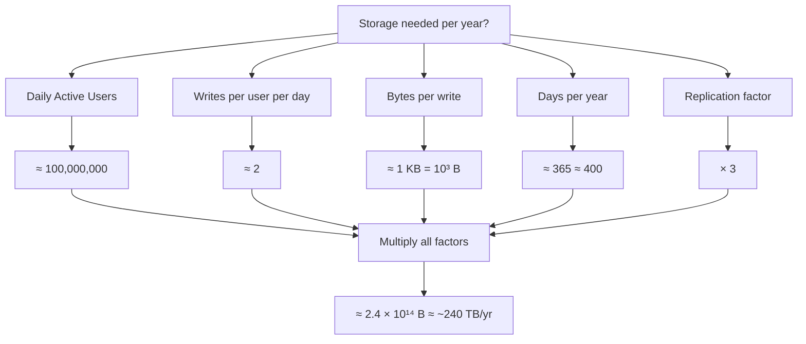

# Back-of-Envelope — Junior Interview Questions

> **Collection:** [System Design](../README.md) · **Level:** Junior · **Section 04 of 42**
> **Goal:** Confirm you can recall the handful of numbers every engineer is expected
> to know, convert between data-size units and time units without a calculator, and
> decompose an unknown quantity into estimable factors so that "I have no idea" becomes
> "it's roughly a few terabytes — here's the arithmetic."

A back-of-envelope estimate is not a guess. It is a *chain of small, defensible steps*
done out loud, where each step is an order-of-magnitude figure you can justify. The
interviewer is not grading the final number to three significant digits — a good
estimate that lands within ~3x of reality is a win. They are grading whether your
method is sound, whether you round to clean powers of ten, and whether you catch your
own unit mistakes. Each question below lists **what the interviewer is really probing**,
a **model answer** with the arithmetic spelled out, and sometimes a **follow-up**.

---

## Contents

1. [Number Tables](#1-number-tables)
2. [Fermi Estimation](#2-fermi-estimation)
3. [Rapid-Fire Self-Check](#3-rapid-fire-self-check)

---

## 1. Number Tables

### Q1.1 — Recite the powers-of-two table up to 2⁴⁰ and the size name each maps to.

**Probing:** Can you convert between bits, bytes, KB/MB/GB/TB instantly? This is the
multiplication table of capacity estimation.

**Model answer:** The trick is that every 10 powers of two is almost exactly a factor of
1000 (2¹⁰ = 1024 ≈ 10³), so the powers line up with the data-size prefixes:

| Power | Exact value | Approx value | Maps to |
|---|---|---|---|
| 2¹⁰ | 1,024 | ~1 thousand | 1 KB (kilobyte) |
| 2²⁰ | 1,048,576 | ~1 million | 1 MB (megabyte) |
| 2³⁰ | 1,073,741,824 | ~1 billion | 1 GB (gigabyte) |
| 2⁴⁰ | ~1.1 × 10¹² | ~1 trillion | 1 TB (terabyte) |
| 2⁵⁰ | ~1.1 × 10¹⁵ | ~1 quadrillion | 1 PB (petabyte) |

So 2³² (a common one, the size of an unsigned 32-bit integer space) = 2² × 2³⁰ ≈
**4 billion** — that's why a 32-bit ID space "runs out" at ~4.3 billion values. And a
64-bit space is 2⁶⁴ ≈ 1.8 × 10¹⁹, effectively inexhaustible.

**Follow-up:** *"How many IDs does a 64-bit space give you?"* → ~1.8 × 10¹⁹, which is far
more than the number of grains of sand on Earth — you will never exhaust it by counting.

### Q1.2 — Convert "1 byte, KB, MB, GB, TB, PB" into a clean data-size ladder.

**Probing:** Comfort with the ×1000 ladder (we round 1024 → 1000 for mental math).

**Model answer:** For back-of-envelope work, treat each prefix as exactly ×1000:

| Unit | Bytes (rounded) | Everyday scale |
|---|---|---|
| 1 B | 1 | one ASCII character |
| 1 KB | 10³ | a short paragraph / one small DB row |
| 1 MB | 10⁶ | a small image, a minute of MP3 |
| 1 GB | 10⁹ | a movie, a large in-memory cache |
| 1 TB | 10¹² | a big disk; ~1 billion 1-KB rows |
| 1 PB | 10¹⁵ | a fleet's worth of data; 1000 TB |

The single most useful fact: **1 billion rows × 1 KB each = 10⁹ × 10³ = 10¹² bytes =
1 TB.** Memorize that one anchor and you can scale up or down from it.

### Q1.3 — Give the canonical "latency numbers every programmer should know."

**Probing:** Order-of-magnitude intuition for where time goes — memory vs disk vs
network. This is the table that lets you reject a bad design in seconds.

**Model answer:** Rounded to the powers of ten that matter:

| Operation | Rough latency | In nanoseconds | Mnemonic |
|---|---|---|---|
| L1 cache reference | ~1 ns | 1 | baseline |
| Branch mispredict | ~3 ns | 3 | — |
| L2 cache reference | ~4 ns | 4 | ~4x L1 |
| Mutex lock/unlock | ~17 ns | 17 | — |
| Main memory (RAM) reference | ~100 ns | 100 | ~100x L1 |
| Compress 1 KB (fast) | ~2 µs | 2,000 | — |
| Read 1 MB sequentially from RAM | ~10 µs | 10,000 | — |
| SSD random read | ~16 µs | 16,000 | ~16,000x L1 |
| Round-trip within a datacenter | ~0.5 ms | 500,000 | — |
| Read 1 MB sequentially from SSD | ~1 ms | 1,000,000 | — |
| Disk (HDD) seek | ~10 ms | 10,000,000 | — |
| Round-trip cross-continent (CA↔Netherlands) | ~150 ms | 150,000,000 | the killer |

The three headline ratios to internalize: **RAM is ~100x slower than L1; an SSD read is
~100x slower than RAM; a cross-continent round-trip is ~100,000x slower than RAM.** This
is *why* we cache in memory and *why* a chatty design that crosses an ocean 20 times in
series is doomed: 20 × 150 ms = 3 seconds before any work is even done.

### Q1.4 — What time constants are worth memorizing for "per day → per second" math?

**Probing:** The conversion that turns DAU and request totals into QPS.

**Model answer:** A day has **86,400 seconds ≈ 10⁵** (rounding 86,400 up to 100,000 makes
division trivial and is the single most useful approximation in capacity work). Useful
companions:

| Constant | Value | Rounded for math |
|---|---|---|
| Seconds per day | 86,400 | ~10⁵ |
| Seconds per month | ~2.6 × 10⁶ | ~2.5 million |
| Seconds per year | ~3.15 × 10⁷ | ~3 × 10⁷ |
| Hours per year | 8,760 | ~9,000 |

So a service doing **1 million requests/day** averages 10⁶ ÷ 10⁵ = **~10 requests/second**.
And **1 billion/day** = 10⁹ ÷ 10⁵ = **~10,000 req/s** average. Then remember traffic isn't
flat: **peak is typically 2–5x the average**, so size for the peak, not the mean.

**Follow-up:** *"Why round 86,400 to 100,000?"* → It's only ~16% off, well inside the
"factor of 2" tolerance an estimate lives in, and it turns every division into shifting a
decimal point. Precision you can't justify is false precision.

---

## 2. Fermi Estimation

### Q2.1 — What is a Fermi estimate, and why is it the right tool in an interview?

**Probing:** Do you understand the *method* — decompose, estimate each factor, multiply —
rather than reaching for a single magic number?

**Model answer:** A Fermi estimate (named after Enrico Fermi, who estimated the yield of
a nuclear test by dropping bits of paper) is a way to estimate a quantity you can't look
up by **breaking it into a product of factors you *can* roughly estimate**, then
multiplying. Each factor is an order-of-magnitude guess; because individual over- and
under-estimates tend to cancel, the product is usually within ~3x of the truth. In an
interview it's the right tool because nobody hands you the QPS or storage figure — you
*derive* it from things you can reason about (users, actions per user, bytes per action),
and you show your reasoning at every step.

### Q2.2 — Estimate the daily storage for a Twitter-like service. Think out loud.

**Probing:** Can you chain DAU → actions → bytes → total, rounding cleanly the whole way?

**Model answer:** Decompose into factors and estimate each:

1. **Users:** Assume **100 million** daily active users (10⁸). State the assumption — the
   interviewer may correct it, and that's fine.
2. **Writes per user:** Say each user posts **2 tweets/day** on average. So daily tweets =
   10⁸ × 2 = **2 × 10⁸ tweets/day**.
3. **Bytes per tweet:** A tweet is ~280 chars of text plus metadata (IDs, timestamps,
   user ref) — round the whole record to **~1 KB = 10³ bytes**.
4. **Raw daily storage:** 2 × 10⁸ tweets × 10³ B = **2 × 10¹¹ B = 200 GB/day** (raw text).
5. **Per year:** 200 GB × 365 ≈ 200 GB × 400 = **~80 TB/year** raw.
6. **Replication:** With 3x replication, **~240 TB/year**. (Media like images/video would
   dwarf this, but for text alone that's the figure.)

The number isn't sacred — what matters is that I can now answer "single disk or sharded?"
instantly: **hundreds of TB/year means this must be sharded across many machines**, not a
single box.

**Follow-up:** *"Where's the biggest source of error?"* → The bytes-per-write assumption.
If tweets routinely carry images, "bytes per write" jumps from ~1 KB to ~200 KB+ and the
whole estimate moves two orders of magnitude. Always flag which factor dominates the
uncertainty.

### Q2.3 — Estimate the read QPS for a photo-sharing app's timeline. Walk through it.

**Probing:** Converting per-day totals to per-second, then adjusting for peak.

**Model answer:** Decompose:

1. **Users:** **200 million** DAU (2 × 10⁸).
2. **Timeline opens per user per day:** Say each user opens the feed **10 times/day**. So
   feed loads/day = 2 × 10⁸ × 10 = **2 × 10⁹/day**.
3. **Per second (average):** Divide by ~10⁵ seconds/day → 2 × 10⁹ ÷ 10⁵ =
   **2 × 10⁴ = ~20,000 reads/second** average.
4. **Peak:** Multiply by ~3 for the busy hour → **~60,000 reads/second** at peak.
5. **Reads vs writes:** If users *post* far less than they *browse* — say a 100:1 read:write
   ratio — the write QPS is only ~600/s. **This read-heavy skew is the headline:** it tells
   me to invest in caching and read replicas, not in write throughput.

That last sentence is the payoff — the estimate isn't trivia, it *chose the architecture*.

### Q2.4 — Estimate how much memory you'd need to cache the "hot" timeline data.

**Probing:** Applying the 80/20 rule — you cache the working set, not everything.

**Model answer:**

1. **What's hot:** By the 80/20 rule, ~**20% of users** generate ~80% of reads. From Q2.3
   that's 0.2 × 2 × 10⁸ = **4 × 10⁷ active users** worth of timeline to keep hot.
2. **Bytes per cached timeline:** Cache, say, the **last 200 tweet IDs** per user. An ID is
   8 bytes, so 200 × 8 = 1,600 B ≈ **~2 KB per user**.
3. **Total cache size:** 4 × 10⁷ users × 2 × 10³ B = **8 × 10¹⁰ B = ~80 GB**.
4. **Conclusion:** ~80 GB fits comfortably across a handful of cache nodes (e.g., a small
   Redis cluster) — so **caching the hot set in RAM is entirely feasible**, which is exactly
   what makes a 20,000-read/s service cheap to serve.

**Follow-up:** *"What if you cached full tweet *objects*, not just IDs?"* → At ~1 KB each,
200 tweets/user × 1 KB × 4 × 10⁷ users = ~8 TB — too big for one tier. That's why real
systems cache *IDs* (cheap, dense) and fetch the bodies separately. The unit you cache
changes the answer by ~500x.

### Q2.5 — How do you sanity-check a Fermi estimate so you don't ship a wrong answer?

**Probing:** Self-correction discipline — do you audit your own units and magnitude?

**Model answer:** Four quick checks I run on every estimate:

1. **Units cancel:** Write units beside every number (users × writes/user/day × bytes/write
   = bytes/day). If the units don't reduce to what I asked for, I made an error.
2. **Powers of ten line up:** Keep everything in exponent form (10⁸ × 10³ = 10¹¹) so an
   off-by-1000 mistake jumps out.
3. **Cross-check against an anchor:** Does "200 GB/day of text" feel right? It's ~2 × 10⁸
   tweets — plausible for a global service. If a quick estimate said *200 PB/day*, I'd know
   instantly something's wrong.
4. **State tolerance:** I declare up front that I'm aiming for within a factor of ~2–3, so
   nobody expects (or trusts) spurious precision. An honest "~80 TB, give or take 2x" beats a
   confident "83.7 TB" that was never that accurate.

---

## 3. Rapid-Fire Self-Check

If you can answer each of these in a sentence (or one line of arithmetic), you're ready for
the junior bar on this section:

- [ ] What does 2¹⁰ equal, and what data-size unit does it map to? *(1,024 ≈ 1 KB)*
- [ ] How many values does a 32-bit ID space hold? A 64-bit one? *(~4 billion; ~1.8 × 10¹⁹)*
- [ ] How many bytes is 1 billion rows of 1 KB each? *(~1 TB)*
- [ ] How many seconds in a day, and why round it? *(86,400 ≈ 10⁵, makes division a decimal shift)*
- [ ] 1 million requests/day is roughly how many req/s? *(~10/s average; ~25–50/s at peak)*
- [ ] What three ratios sit between L1, RAM, SSD, and a cross-continent round-trip? *(~100x, ~100x, ~100,000x)*
- [ ] What are the three steps of a Fermi estimate? *(decompose → estimate each factor → multiply)*
- [ ] In a storage estimate, which factor usually dominates the error? *(bytes-per-write — text vs media)*
- [ ] Why does a read-heavy QPS estimate point you toward caching? *(reads vastly outnumber writes, so serve them from memory)*
- [ ] What tolerance should a back-of-envelope answer claim? *(within a factor of ~2–3, never false precision)*

---

**Next step:** Section 05 — [Networking & Protocols](05-networking-protocols.md): how
bytes actually move — DNS, TCP/UDP, HTTP, and the round trips your latency math just paid for.
