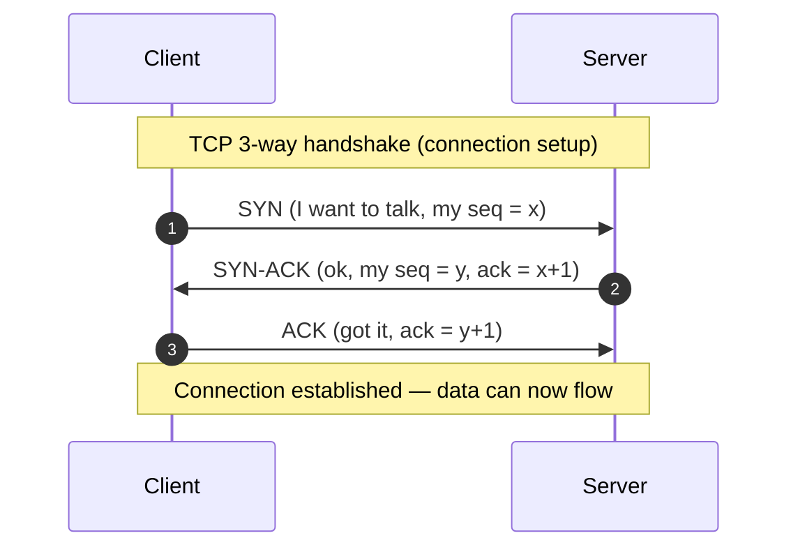
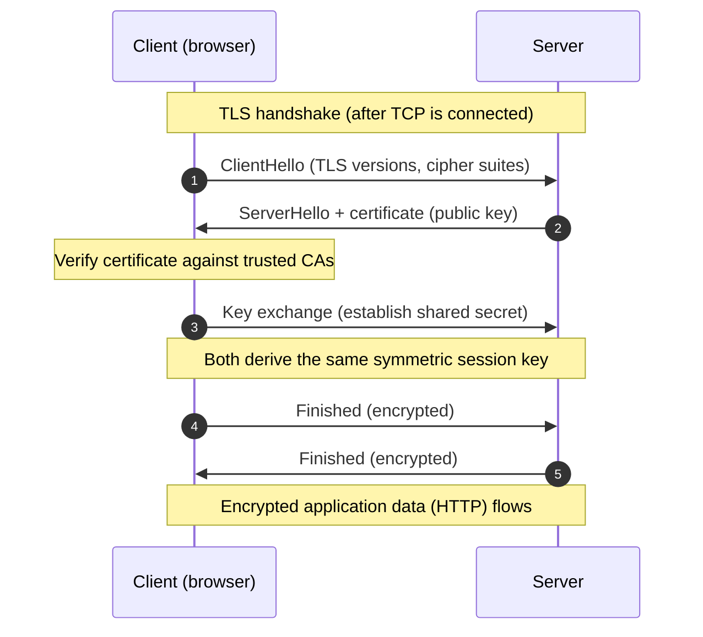
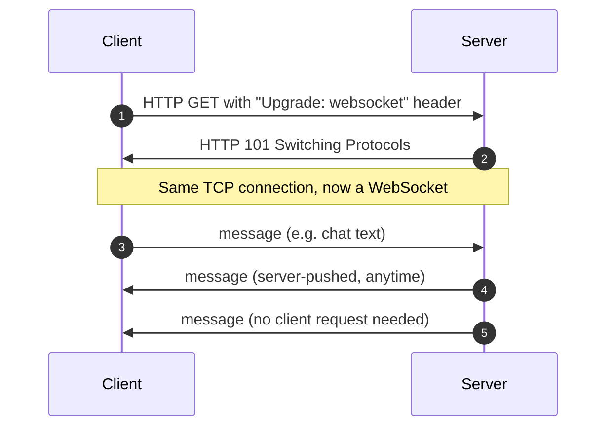

# Networking & Protocols — Junior Interview Questions

> **Collection:** [System Design](../README.md) · **Level:** Junior · **Section 05 of 42**
> **Goal:** Confirm you can place a protocol on the right layer, explain *why* TCP, TLS,
> HTTP/2, and WebSockets exist, and pick the right transport for a chat app, a stock
> ticker, or a video stream — without bluffing about what happens on the wire.

A "junior" answer here is not a hand-wave about "the network." It is a *correct,
concrete, and honest* explanation of which layer a thing lives at, what guarantee it
gives you, and what it costs. Interviewers are checking that you know the difference
between reliable and unreliable delivery, that you can describe a handshake, and that
you reach for the right real-time transport instead of defaulting to one for everything.
Each question lists **what the interviewer is really probing**, a **model answer**, and
often a **follow-up**.

---

## Contents

1. [OSI & TCP/IP Model](#1-osi--tcpip-model)
2. [TCP vs UDP](#2-tcp-vs-udp)
3. [TLS & HTTPS](#3-tls--https)
4. [HTTP Evolution (HTTP/1.1, HTTP/2, HTTP/3, QUIC)](#4-http-evolution-http11-http2-http3-quic)
5. [WebSockets](#5-websockets)
6. [Server-Sent Events (SSE)](#6-server-sent-events-sse)
7. [Long-Polling & Streaming](#7-long-polling--streaming)
8. [Network Proxies & NAT](#8-network-proxies--nat)
9. [Rapid-Fire Self-Check](#9-rapid-fire-self-check)

---

## 1. OSI & TCP/IP Model

### Q1.1 — What problem do layered network models solve?

**Probing:** Do you understand *why* we layer at all, not just the list of layers?

**Model answer:** Layering splits "get bytes from one program to another across the
world" into independent jobs, so each layer only talks to the one above and below it. A
web app at the top doesn't care whether the bytes travel over Wi-Fi, fiber, or 5G —
that's the physical/link layer's problem. Because the boundaries are stable, you can
swap one layer (e.g., IPv4 → IPv6, or Wi-Fi → Ethernet) without rewriting the others.
The model is an *abstraction contract*: each layer hides its mechanics behind a simple
interface.

**Follow-up:** *"Where does HTTP live?"* → The application layer (OSI layer 7 / the top
of the TCP/IP model). It rides on top of TCP, which rides on IP.

### Q1.2 — Map the four TCP/IP layers to the protocols you use daily.

**Probing:** Can you connect the abstract model to concrete names?

**Model answer:** The TCP/IP model collapses OSI's seven layers into four practical ones:

| TCP/IP layer | Job | Examples |
|---|---|---|
| **Application** | What the data *means* | HTTP, DNS, TLS, WebSocket, gRPC |
| **Transport** | End-to-end delivery between programs (ports) | TCP, UDP, QUIC |
| **Internet (Network)** | Routing packets between machines (IP addresses) | IP, ICMP |
| **Link** | Bits across one physical hop | Ethernet, Wi-Fi |

When you open `https://example.com`, **DNS** (app) resolves the name, **TLS** (app)
secures the channel, **HTTP** (app) carries the request, **TCP** (transport) makes
delivery reliable, **IP** (internet) routes the packets, and **Wi-Fi** (link) pushes
the bits to your router.

### Q1.3 — What's the difference between a port and an IP address?

**Probing:** A common gap — addressing the *machine* vs addressing the *program*.

**Model answer:** An **IP address** identifies a *machine* on the network (which house);
a **port** identifies a *program/process* on that machine (which room). A web server
listens on port 443; a database on 5432. Together, an IP + port + protocol (TCP/UDP)
uniquely identifies one endpoint of a connection — which is how one server can serve
HTTP, SSH, and Postgres at the same time without confusion.

---

## 2. TCP vs UDP

### Q2.1 — Explain TCP and UDP, and when you'd pick each.

**Probing:** The core transport-layer trade-off: reliability vs latency/overhead.

**Model answer:** Both are transport protocols, but they make opposite promises:

| | TCP | UDP |
|---|---|---|
| **Connection** | Connection-oriented (handshake first) | Connectionless (just send) |
| **Reliability** | Guaranteed delivery, retransmits lost packets | Best-effort; lost packets stay lost |
| **Ordering** | In-order delivery | No ordering guarantee |
| **Overhead** | Higher (acks, state, congestion control) | Minimal |
| **Use it for** | Web, APIs, file transfer, chat history | Live video/voice, gaming, DNS |

**Pick TCP** when correctness matters more than the last millisecond — a chat message or
a bank transfer must arrive, intact and in order. **Pick UDP** when *fresh* data beats
*complete* data: in a video call, a packet that arrives 200 ms late is useless, so
you'd rather drop it and show the next frame than stall waiting for a retransmit.

**Follow-up:** *"Why does a video call tolerate loss but a file download doesn't?"* →
A dropped frame is a momentary glitch the eye forgives; a dropped byte in a ZIP file
corrupts it. Reliability is only worth its latency cost when every byte is sacred.

### Q2.2 — Walk me through the TCP handshake.

**Probing:** Do you actually know how a connection is established?

**Model answer:** TCP opens a connection with a **three-way handshake**: the client
sends **SYN** (with its initial sequence number), the server replies **SYN-ACK**
(acknowledging the client and sending its own sequence number), and the client replies
**ACK**. After these three messages, both sides have agreed on starting sequence
numbers and the connection is established. The cost is **one full round-trip before any
data flows** — which is why connection setup latency matters, and why we reuse
connections (keep-alive) instead of opening a new one per request.

### Q2.3 — What does "TCP guarantees ordering" actually mean under the hood?

**Probing:** Depth beyond the buzzword.

**Model answer:** Each byte stream is tagged with **sequence numbers**. Packets can
arrive out of order or get lost on the network, but TCP uses those numbers to
reassemble them in the right order on the receiving side, and it **acknowledges** what
it received so the sender can retransmit anything missing. The application always reads
a clean, in-order byte stream — TCP hides the mess. The downside, which matters later
for HTTP/2, is **head-of-line blocking**: if one packet is lost, everything behind it
waits, even data that already arrived.

---

## 3. TLS & HTTPS

### Q3.1 — What does HTTPS give you that HTTP doesn't?

**Probing:** Can you name all three security properties, not just "encryption"?

**Model answer:** HTTPS is HTTP carried over **TLS**, and TLS provides three things:
**(1) Confidentiality** — the traffic is encrypted, so a snooper on the Wi-Fi sees only
ciphertext. **(2) Integrity** — tampering is detected, so an attacker can't silently
flip bytes in transit. **(3) Authentication** — the server proves it really is
`bank.com` via a certificate signed by a trusted Certificate Authority, so you're not
talking to an impostor. Plain HTTP gives you *none* of these — credentials and session
cookies would travel in the clear.

### Q3.2 — Walk through a TLS handshake at a high level.

**Probing:** Conceptual grasp of how two strangers agree on a secret key.

**Model answer:** After TCP connects, the client and server negotiate TLS. The client
proposes supported versions and cipher suites (**ClientHello**); the server picks one
and sends its **certificate** containing its public key (**ServerHello**). The client
verifies that certificate chains up to a trusted Certificate Authority — this is the
authentication step. Then both sides perform a **key exchange** to agree on a shared
**symmetric session key** that no eavesdropper can derive. From then on, all HTTP data
is encrypted with that fast symmetric key. The pattern is: use slow asymmetric crypto
*once* to bootstrap trust and a key, then use fast symmetric crypto for the bulk data.

**Follow-up:** *"Why not use the certificate's key for everything?"* → Asymmetric crypto
is far slower. It's used only to authenticate and to safely establish the symmetric key;
symmetric encryption then carries the actual traffic efficiently.

### Q3.3 — What is a Certificate Authority and why does it matter?

**Probing:** The chain-of-trust concept.

**Model answer:** A **Certificate Authority (CA)** is an organization your browser
already trusts (its root certificates ship with the OS/browser). When `bank.com` gets a
certificate, a CA cryptographically signs it, vouching that the holder controls that
domain. Your browser trusts the certificate because it trusts the CA's signature.
Without CAs, an attacker could present *any* public key and claim to be `bank.com` — the
CA is what stops a man-in-the-middle from impersonating a site you trust.

---

## 4. HTTP Evolution (HTTP/1.1, HTTP/2, HTTP/3, QUIC)

### Q4.1 — What was the main limitation of HTTP/1.1, and how did HTTP/2 fix it?

**Probing:** Understanding *why* the protocol kept evolving.

**Model answer:** In **HTTP/1.1**, a connection handles one request at a time; to load a
page with 50 assets, the browser either waits in line or opens many parallel TCP
connections (expensive). This causes **head-of-line blocking at the application layer**
— a slow response stalls everything behind it. **HTTP/2** fixed this with
**multiplexing**: many requests and responses share *one* TCP connection as interleaved
"streams," so a slow image no longer blocks the CSS. It also added **header compression**
and **server push**. The win is fewer connections and far better parallelism over a
single pipe.

### Q4.2 — If HTTP/2 multiplexes over one connection, why do we need HTTP/3 and QUIC?

**Probing:** The subtle TCP-vs-protocol head-of-line distinction.

**Model answer:** HTTP/2 solved application-layer blocking but still runs over **TCP** —
and TCP guarantees in-order delivery of the *whole* byte stream. So if one packet is
lost, TCP stalls *all* the multiplexed streams until it's retransmitted: the blocking
moved down to the transport layer. **HTTP/3** runs over **QUIC**, a new transport built
on **UDP** that implements its own streams. A lost packet now only blocks the *one*
stream it belonged to; the others keep flowing. QUIC also folds the TLS handshake into
the connection setup, so it connects in fewer round-trips — great for mobile networks
with high latency and packet loss.

| Version | Transport | Key idea | Main problem solved |
|---|---|---|---|
| **HTTP/1.1** | TCP | One request per connection (keep-alive) | Baseline |
| **HTTP/2** | TCP | Multiplexed streams, header compression | App-layer head-of-line blocking |
| **HTTP/3** | QUIC (UDP) | Independent streams, faster handshake | Transport-layer head-of-line blocking |

**Follow-up:** *"Why build QUIC on UDP instead of fixing TCP?"* → TCP behavior is baked
into operating systems and middleboxes worldwide; changing it is nearly impossible.
Building on UDP lets QUIC implement modern transport logic in user space and evolve fast.

---

## 5. WebSockets

### Q5.1 — What problem do WebSockets solve that plain HTTP can't?

**Probing:** Do you grasp *full-duplex* and *server-initiated* communication?

**Model answer:** Plain HTTP is **request–response**: the client always asks first, the
server answers, done. There's no way for the server to *push* a message whenever it
wants. **WebSockets** provide a single, long-lived, **full-duplex** connection — after
an initial handshake, both client and server can send messages to each other at any
time, with low overhead per message. That's exactly what a **chat app** needs: when
your friend sends a message, the server pushes it to you instantly instead of you
polling "any new messages?" every second.

### Q5.2 — How does a WebSocket connection get established?

**Probing:** Knowing it *starts* as HTTP then upgrades.

**Model answer:** It begins as an ordinary HTTP request carrying an **`Upgrade:
websocket`** header. If the server agrees, it responds with **`101 Switching
Protocols`**, and the *same* TCP connection is repurposed as a persistent WebSocket. From
that point there's no more request/response framing — either side sends messages freely
until someone closes the connection. Starting as HTTP means it works through existing
ports (80/443) and proxies.

**Follow-up:** *"WebSocket or polling for a chat app?"* → WebSocket: real-time, low
latency, and far cheaper than hammering the server with poll requests once you have many
users.

---

## 6. Server-Sent Events (SSE)

### Q6.1 — What are Server-Sent Events, and how do they differ from WebSockets?

**Probing:** Knowing SSE is *one-way* and simpler — and when that's the right call.

**Model answer:** **SSE** lets a server push a continuous stream of text events to the
client over a single long-lived HTTP connection — but it's **one-directional**:
server → client only. It runs over plain HTTP/1.1 (or HTTP/2), so it needs no protocol
upgrade, works through ordinary infrastructure, and the browser's `EventSource` API
**auto-reconnects** if the connection drops. WebSockets are bidirectional and need an
upgrade; SSE is unidirectional and dead simple. For a **stock ticker** or a live news
feed — where the client only ever *receives* updates — SSE is the lighter, more robust
choice.

**Follow-up:** *"When would SSE be the wrong choice?"* → When the client also needs to
send a steady stream of messages back (e.g., a chat or a collaborative editor) — that's
bidirectional, so use WebSockets.

### Q6.2 — Compare WebSockets, SSE, and long-polling.

**Probing:** Can you choose the right real-time transport for a given workload?

| | WebSocket | SSE | Long-Polling |
|---|---|---|---|
| **Direction** | Bidirectional (full-duplex) | Server → client only | Server → client (per request) |
| **Transport** | Upgraded TCP connection | Plain HTTP, long-lived | Plain HTTP, repeated requests |
| **Auto-reconnect** | Manual | Built in (`EventSource`) | Implicit (re-request) |
| **Best for** | Chat, multiplayer games | Stock ticker, notifications, logs | Fallback when others unavailable |
| **Overhead** | Low per message | Low | High (new request each cycle) |

The decision rule: **two-way** real-time → WebSocket; **one-way** server push → SSE;
**neither available / legacy environment** → long-polling.

---

## 7. Long-Polling & Streaming

### Q7.1 — What is long-polling and how does it differ from regular polling?

**Probing:** The "hold the request open" trick and why it reduces waste.

**Model answer:** In **regular (short) polling**, the client asks "any new data?" on a
fixed interval — say every 2 seconds — and usually gets "no," wasting requests and
adding up-to-2-seconds of latency. In **long-polling**, the client sends a request and
the server **holds it open** until it actually has data (or a timeout). The client gets
the update the instant it's ready, then immediately re-issues the request. It
approximates real-time push using only standard HTTP — which is why it was the classic
fallback before WebSockets and SSE were widely supported.

**Follow-up:** *"Downside of long-polling?"* → Each delivered message still costs a full
HTTP request/response cycle (new headers, possibly a new connection), so it's heavier
than a WebSocket or SSE stream under high message volume, and holding many open requests
ties up server resources.

### Q7.2 — What does "streaming a response" mean, and where is it used?

**Probing:** Understanding chunked, incremental delivery.

**Model answer:** Streaming means the server sends the response **incrementally** rather
than building it fully and sending it at once. The client starts processing as bytes
arrive. A **video** service streams a movie chunk-by-chunk so playback starts in seconds
instead of after a full download. An LLM API streams tokens so text appears word by word.
SSE is one concrete streaming mechanism; HTTP chunked transfer encoding is another. The
shared idea: **deliver data progressively** to cut perceived latency and avoid buffering
huge payloads in memory.

---

## 8. Network Proxies & NAT

### Q8.1 — What's the difference between a forward proxy and a reverse proxy?

**Probing:** Which side of the connection the proxy serves.

**Model answer:** A **forward proxy** sits in front of *clients* and makes requests on
their behalf — used for corporate egress filtering, caching, or hiding client identity.
A **reverse proxy** sits in front of *servers* and is the public face clients actually
connect to; it then forwards traffic to backend servers. Reverse proxies (Nginx, a load
balancer, a CDN edge) handle TLS termination, load balancing, caching, and
rate-limiting — clients never see the real backends. Rule of thumb: **forward proxy
shields the client; reverse proxy shields and fronts the server.**

**Follow-up:** *"Name one job a reverse proxy does in a typical web system."* → TLS
termination (decrypt HTTPS once at the edge) or load balancing requests across many
identical app servers.

### Q8.2 — What is NAT and why does it exist?

**Probing:** The IPv4-scarcity reason and the address-rewriting mechanism.

**Model answer:** **NAT (Network Address Translation)** lets many devices on a private
network share a single public IP address. Your laptop, phone, and TV at home all have
*private* IPs (like `192.168.x.x`); the router rewrites their outgoing packets to use
the home's one *public* IP and remembers the mapping so replies get routed back to the
right device. It exists mainly because IPv4 addresses ran out — NAT lets billions of
devices coexist behind a limited pool of public addresses. A side effect is that devices
behind NAT aren't directly reachable from the outside, which is why peer-to-peer
connections (video calls, gaming) need techniques like STUN/TURN to "punch through."

---

## 9. Rapid-Fire Self-Check

If you can answer each of these in a sentence, you're ready for the junior bar on this section:

- [ ] Which layer does HTTP live on, and what does it ride on top of? *(application; TCP over IP)*
- [ ] IP address vs port — what does each identify? *(machine vs program)*
- [ ] One reason to pick UDP over TCP. *(fresh data beats complete data — live video/voice)*
- [ ] What are the three messages of the TCP handshake? *(SYN, SYN-ACK, ACK)*
- [ ] Three guarantees TLS provides. *(confidentiality, integrity, authentication)*
- [ ] Why does asymmetric crypto bootstrap a symmetric key instead of being used throughout? *(speed)*
- [ ] What did HTTP/2 fix vs HTTP/1.1, and what did HTTP/3 fix vs HTTP/2? *(app-layer vs transport-layer head-of-line blocking)*
- [ ] WebSocket vs SSE — one-line difference. *(bidirectional vs server→client only)*
- [ ] When would you reach for long-polling? *(fallback when WebSocket/SSE unavailable)*
- [ ] Forward proxy vs reverse proxy — who does each protect? *(client vs server)*
- [ ] Why does NAT exist? *(IPv4 address scarcity — many devices share one public IP)*

---

**Next step:** Section 06 — [Domain Name System](06-domain-name-system.md): how names become IP addresses, resolution, caching, and TTLs.
