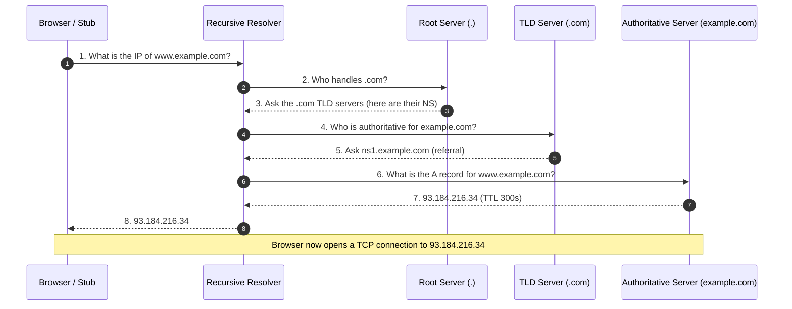

# Domain Name System — Junior Interview Questions

> **Collection:** [System Design](../README.md) · **Level:** Junior · **Section 06 of 42**
> **Goal:** Confirm you can trace a name like `www.example.com` from a browser
> all the way to an IP address, name the common record types and what they're for,
> explain how DNS is used to spread load and route users to nearby servers, and
> reason about caching, TTLs, and the failure modes that bite real systems.

DNS is the layer almost every request crosses *before* your application is even
involved, so it shows up constantly in design interviews — for load balancing,
for failover, for serving users from the nearest region. A strong junior answer is
*mechanical and concrete*: you can walk the resolution steps in order, you reach for
a real hostname as an example, and you know where caching hides. Each question below
lists **what the interviewer is really probing**, a **model answer**, and often a
**follow-up** they will ask next.

---

## Contents

1. [DNS Resolution Flow](#1-dns-resolution-flow)
2. [Record Types](#2-record-types)
3. [DNS Load Balancing](#3-dns-load-balancing)
4. [DNS Caching & TTL](#4-dns-caching--ttl)
5. [GeoDNS & Anycast](#5-geodns--anycast)
6. [Rapid-Fire Self-Check](#6-rapid-fire-self-check)

---

## 1. DNS Resolution Flow

### Q1.1 — In one sentence, what does DNS do?

**Probing:** Do you know it is a *lookup directory*, not a data-transfer protocol?

**Model answer:** DNS (the Domain Name System) is a distributed, hierarchical directory
that translates human-friendly hostnames like `www.example.com` into the IP addresses
machines actually use to connect, such as `93.184.216.34`. It is essentially the
phone book of the internet: you ask for a name, you get back an address. It does **not**
transfer your page or data — it just tells your machine *where* to send the real request.

### Q1.2 — Walk me through resolving `www.example.com` from an empty cache.

**Probing:** Can you name the four players — recursive resolver, root, TLD,
authoritative — in the right order?

**Model answer:** Your machine asks a **recursive resolver** (run by your ISP, or a
public one like a corporate DNS server), and the resolver does the legwork on your
behalf. With nothing cached, it walks the hierarchy top-down:

The key idea is the **referral chain**: the root doesn't know the final answer, it
just points to the right TLD; the TLD points to the right authoritative server; and
only the authoritative server gives the actual address. The recursive resolver is the
one party that follows the whole chain and returns a single answer to your machine.

**Follow-up:** *"Which step actually knows the answer?"* → Only the **authoritative
server** for `example.com`. Root and TLD servers give *referrals* (delegations),
never the final record.

### Q1.3 — What's the difference between a recursive resolver and an authoritative server?

**Probing:** The most common confusion at this level.

**Model answer:** A **recursive resolver** answers "what is the IP?" by *asking others* —
it walks the root → TLD → authoritative chain and caches the results, but it owns no
records itself. An **authoritative server** is the source of truth for a specific zone:
it holds the actual records for `example.com` and answers "here is the record" rather
than "go ask someone else." Put simply: the resolver is the researcher, the
authoritative server is the published reference it eventually reads from.

### Q1.4 — Why is DNS organized as a hierarchy instead of one giant table?

**Probing:** Understanding *why* the design scales.

**Model answer:** A single global table of every hostname would be impossible to keep
consistent, fast, or under any one organization's control. The hierarchy —
root → top-level domains (`.com`, `.org`, `.uz`) → domains → subdomains — lets each
level **delegate** responsibility downward. The `.com` operator manages who owns
`example.com`, and `example.com`'s owner manages `www`, `api`, and `mail` themselves.
This spreads load, spreads administration, and means a change to `www.example.com`
never requires touching anything above it.

---

## 2. Record Types

### Q2.1 — Name the common DNS record types and what each is for.

**Probing:** Vocabulary fluency — can you map record type to purpose?

**Model answer:**

| Record | Maps name to… | Example | Typical use |
|---|---|---|---|
| **A** | An IPv4 address | `www.example.com → 93.184.216.34` | Point a hostname at a server |
| **AAAA** | An IPv6 address | `www.example.com → 2606:2800:220:1:248:1893:25c8:1946` | IPv6 equivalent of A |
| **CNAME** | Another name (alias) | `www.example.com → example.com` | Alias one host to another's records |
| **MX** | A mail server (with priority) | `example.com → 10 mail.example.com` | Where to deliver email for the domain |
| **NS** | The authoritative name servers | `example.com → ns1.example.com` | Delegate a zone |
| **TXT** | Arbitrary text | `example.com → "v=spf1 include:..."` | SPF/DKIM, domain verification |

The mental model: **A/AAAA** end the lookup with an address; **CNAME** redirects to
another name; **NS** delegates a whole zone; **MX** is email-specific routing; and
**TXT** is the catch-all for machine-readable metadata.

### Q2.2 — What is a CNAME, and what's one rule you must not break with it?

**Probing:** Do you know the alias semantics *and* the apex restriction?

**Model answer:** A **CNAME** (Canonical Name) record makes one hostname an alias for
another. If `www.example.com` is a CNAME to `example.com`, a resolver looking up `www`
is told "the real name is `example.com`" and continues resolving *that* until it lands
on an A/AAAA record. It's useful when several names should track one target — change the
target's A record once and every alias follows. **The rule:** you cannot put a CNAME at
the zone apex (the bare `example.com`), because the apex must also carry NS and SOA
records, and a CNAME is not allowed to coexist with other records on the same name.

**Follow-up:** *"So how do people point the apex at a CDN?"* → With provider-specific
workarounds like `ALIAS`/`ANAME` flattening, which behave like a CNAME but resolve to an
A record at query time so the apex stays valid.

### Q2.3 — Email isn't arriving for a domain. Which record do you check first?

**Probing:** Connecting a record type to a real symptom.

**Model answer:** The **MX** records, since they tell sending mail servers *where* to
deliver mail for `example.com`. Each MX record has a priority number — lower is
preferred — so mail tries the lowest-priority host first and falls back to the next on
failure. If MX records are missing or point at a dead host, mail bounces or queues.
I'd then check that the MX target itself resolves to a valid A/AAAA record, and that the
domain's **TXT** records (SPF/DKIM) aren't causing receivers to reject the mail.

### Q2.4 — What are NS records and why are there usually at least two?

**Probing:** Delegation plus availability.

**Model answer:** **NS** records list the authoritative name servers for a zone — they're
how a parent zone *delegates* a child. The `.com` TLD has NS records saying "for
`example.com`, ask `ns1.example.com` and `ns2.example.com`." There are at least two (and
usually more) for **redundancy**: if one name server is down, resolvers simply try
another, so the domain stays resolvable. Best practice spreads them across different
networks or providers so a single outage can't make the whole domain disappear.

---

## 3. DNS Load Balancing

### Q3.1 — How can DNS itself spread traffic across multiple servers?

**Probing:** Do you understand round-robin DNS?

**Model answer:** With **round-robin DNS**, you publish *multiple* A records for the same
hostname — `www.example.com` returns `203.0.113.1`, `203.0.113.2`, and `203.0.113.3`.
The authoritative server (or resolver) rotates the order it hands them out, so different
clients connect to different IPs and load spreads across the three servers. It's the
simplest possible load balancing: no extra hardware, just multiple records on one name.

**Follow-up:** *"Where does the client get the choice?"* → Clients typically try the
*first* address in the returned list, and since the order rotates per query, the "first"
differs across clients — that's what produces the spread.

### Q3.2 — What are the weaknesses of round-robin DNS as a load balancer?

**Probing:** Can you see past the simple case? This is the question that separates strong juniors.

**Model answer:** Three big ones. **(1) No health awareness** — DNS keeps handing out a
dead server's IP because it doesn't know the box is down; clients only fail over after a
timeout, if at all. **(2) Caching defeats the rotation** — resolvers and clients cache the
answer for the TTL, so a single client keeps hitting the same IP, and the distribution
is uneven, not perfectly balanced. **(3) No real load signal** — it rotates blindly
regardless of how busy each server actually is. That's why round-robin DNS is a coarse,
first-layer spread, and serious setups put a real load balancer (with health checks)
*behind* a single DNS name.

### Q3.3 — How do you remove a failed server when using round-robin DNS?

**Probing:** Operational reality — the TTL trap.

**Model answer:** You remove (or update) the bad A record at the authoritative server,
but the change only takes effect for clients *after their cached copy expires* — which is
governed by the record's **TTL**. If the TTL is 300 seconds, some clients keep hitting the
dead IP for up to five minutes. This is exactly why DNS alone is a poor failover
mechanism, and why low TTLs are used on records you expect to change — at the cost of more
DNS queries.

---

## 4. DNS Caching & TTL

### Q4.1 — Where does DNS caching happen?

**Probing:** Do you know it's cached at *several* layers, not just one?

**Model answer:** At many layers along the path, which is why DNS is fast despite the
multi-step resolution. From closest to the user outward: the **browser** has its own DNS
cache; the **operating system** (stub resolver) caches; the **recursive resolver** caches
aggressively and serves most users from there; and even intermediate referrals (the NS of
`.com`) get cached so the resolver rarely re-asks the root. Each layer holds an answer
until its TTL runs out.

### Q4.2 — What is a TTL and what trade-off does it control?

**Probing:** The single most important DNS-operations concept.

**Model answer:** **TTL** (Time To Live) is a per-record value, in seconds, that tells
every cache how long it may keep an answer before discarding it and asking again. It
controls a direct trade-off:

| TTL | Effect | Good for |
|---|---|---|
| **Low** (e.g., 60s) | Changes propagate fast; more DNS queries | Records you may need to fail over or move quickly |
| **High** (e.g., 86400s / 1 day) | Fewer queries, more caching; changes are slow to spread | Stable records that rarely change |

So a low TTL buys **agility** (fast cutover) at the cost of more lookups and load on
authoritative servers; a high TTL buys **efficiency and resilience** (answers survive even
if your DNS has a hiccup) at the cost of slow propagation.

### Q4.3 — You need to change `www.example.com`'s IP at a specific time. What do you do with the TTL?

**Probing:** Applying TTL knowledge to a real migration.

**Model answer:** Plan ahead: **lower the TTL well before the change** — at least one old
TTL period in advance — so that caches expire and start fetching the new short TTL. For
example, drop it from one day to 60 seconds a day before the migration. Then at cutover,
update the A record; because everyone is now caching for only 60 seconds, the world picks
up the new IP within about a minute. After things are stable, raise the TTL back up to
reduce query load. The mistake juniors make is lowering the TTL the same minute as the
change — by then, the old high TTL is already cached.

**Follow-up:** *"Why not just keep TTLs at 60 seconds always?"* → It multiplies DNS query
volume and removes the buffer that long TTLs give you if your authoritative servers
briefly fail; caches with a longer TTL keep serving the last good answer.

### Q4.4 — What is "negative caching"?

**Probing:** Awareness that failures are cached too.

**Model answer:** When a lookup returns "this name doesn't exist" (an NXDOMAIN), resolvers
**cache that negative answer** for a while, controlled by the zone's SOA record settings.
This stops the resolver from hammering the authoritative servers for a name that isn't
there. The practical gotcha: if you create a brand-new record that someone already tried
to look up, they may keep getting "not found" until the negative cache expires.

---

## 5. GeoDNS & Anycast

### Q5.1 — How can DNS send users to a *nearby* server?

**Probing:** The concept of GeoDNS.

**Model answer:** With **GeoDNS**, the authoritative server returns a *different* answer
depending on where the query came from. A user in Europe asking for `www.example.com`
gets the IP of a Frankfurt server; a user in Asia gets the Singapore server's IP. The
authoritative server looks at the resolver's location (roughly, its IP) and picks the
closest data center's address. The benefit is lower latency — users connect to a server
near them instead of crossing an ocean for every request.

**Follow-up:** *"What's the catch with using the resolver's location?"* → DNS sees the
*resolver's* IP, not the user's. If someone uses a distant public resolver, GeoDNS may
guess the wrong region. (An extension called EDNS Client Subnet helps by passing along
part of the client's network.)

### Q5.2 — What is Anycast, and how is it different from GeoDNS?

**Probing:** Can you separate two routing ideas that often get confused?

**Model answer:** **Anycast** advertises the *same* IP address from many locations at
once, and the internet's routing (BGP) automatically sends each user to the *nearest*
instance of that address. So users in different regions all use one IP but reach
different physical servers. **GeoDNS** works at the DNS layer — it hands out *different
IPs* per region. The difference:

| | GeoDNS | Anycast |
|---|---|---|
| **Layer** | DNS resolution | Network routing (BGP) |
| **What varies** | The IP returned | The path to one shared IP |
| **Failover** | Needs a DNS change (TTL delay) | Routing reroutes near-instantly |

In practice they're often combined: GeoDNS picks a regional address, and that address is
itself Anycast for fast, automatic failover.

### Q5.3 — Why do the root and big public DNS servers use Anycast?

**Probing:** Connecting the technique to a real-world deployment.

**Model answer:** Because they need to be **close to everyone and impossible to take down
with one outage.** There are only a handful of logical root server addresses, but each is
Anycast to hundreds of physical sites worldwide. A user's query goes to whichever site is
nearest by network routing, which keeps latency low; and if one site fails, routing simply
sends traffic to the next-nearest site with no DNS change required. The same logic makes
Anycast the standard way to run large public resolvers and DDoS-resistant DNS.

### Q5.4 — Give one concrete benefit of GeoDNS for a global website.

**Probing:** Tie it back to a user-visible outcome.

**Model answer:** Lower page-load latency. If `www.example.com` serves a user in Tokyo
from a Tokyo data center instead of one in Virginia, you save roughly the ~150 ms
cross-Pacific round-trip on *every* connection setup and request. Over a page that makes
many requests, that's the difference between a snappy site and a sluggish one — and DNS
makes that routing decision before the first byte of content is ever sent.

---

## 6. Rapid-Fire Self-Check

If you can answer each of these in a sentence, you're ready for the junior bar on this section:

- [ ] Name the four players in a full resolution. *(recursive resolver → root → TLD → authoritative)*
- [ ] Which server actually holds the answer? *(the authoritative server)*
- [ ] A vs AAAA vs CNAME — one line each. *(IPv4 / IPv6 / alias to another name)*
- [ ] Where can't you put a CNAME, and why? *(the zone apex; it can't coexist with NS/SOA)*
- [ ] How does round-robin DNS spread load, and what's its biggest weakness? *(multiple A records; no health checks)*
- [ ] What does TTL control? *(how long answers are cached → propagation speed vs query load)*
- [ ] You're moving an IP next week — what do you do to the TTL first? *(lower it well in advance)*
- [ ] GeoDNS vs Anycast — which layer does each work at? *(DNS vs BGP routing)*
- [ ] Why is a cross-region round-trip the latency GeoDNS exists to avoid? *(~150 ms saved per connection)*

---

**Next step:** Section 07 — [Content Delivery Networks](07-content-delivery-networks.md): caching content at the edge, close to users.
