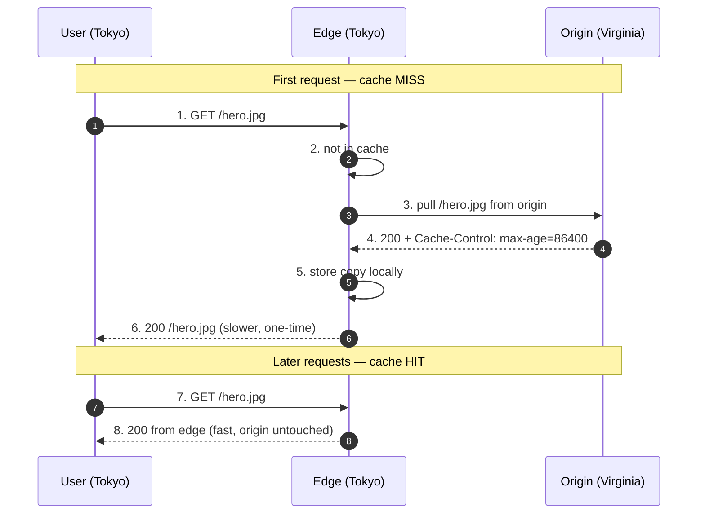

# Content Delivery Networks — Junior Interview Questions

> **Collection:** [System Design](../README.md) · **Level:** Junior · **Section 07 of 42**
> **Goal:** Confirm you can explain why a CDN exists, distinguish a *pull* CDN from a
> *push* CDN, reason about keeping cached content fresh, describe what an *edge location*
> actually does, and name the security a CDN buys you — all with concrete examples like
> serving an image, streaming a video, or surviving a viral post.

A CDN is the first piece of distributed-systems machinery most products reach for, and
it is a favorite junior topic because the *why* is intuitive but the *how* hides real
trade-offs. A strong junior answer is concrete: it names the asset (a 2 MB hero image, a
4K video segment), names the failure (a viral post hammering origin), and reaches for a
real behavior (a cache miss, a `Cache-Control` header). Each question below lists **what
the interviewer is really probing**, a **model answer**, and often a **follow-up**.

---

## Contents

1. [Pull CDN](#1-pull-cdn)
2. [Push CDN](#2-push-cdn)
3. [Cache Invalidation](#3-cache-invalidation)
4. [Edge Locations](#4-edge-locations)
5. [CDN Security](#5-cdn-security)
6. [Rapid-Fire Self-Check](#6-rapid-fire-self-check)

---

## 1. Pull CDN

### Q1.1 — What is a CDN, in one sentence, and what problem does it solve?

**Probing:** Do you understand a CDN is about *geography and origin offload*, not magic?

**Model answer:** A Content Delivery Network is a globally distributed fleet of cache
servers that store copies of your content close to users, so a request is served from a
nearby city instead of traveling to your single origin server. It solves two problems at
once: **latency** — a user in Tokyo gets a file from a Tokyo edge instead of paying ~150
ms each way to Virginia — and **origin load** — millions of requests for the same logo
are absorbed by the edges, so your origin only serves it a handful of times.

**Follow-up:** *"What kind of content benefits most?"* → Static, cacheable assets that
many users request identically: images, CSS/JS bundles, fonts, video segments, software
downloads. Highly personalized, per-user dynamic data benefits least.

### Q1.2 — Explain how a *pull* CDN works.

**Probing:** The core mental model: the edge fetches lazily, on the first miss.

**Model answer:** In a pull CDN, you don't upload anything to the CDN ahead of time. You
just point the CDN at your **origin** server. The first time a user in a region requests
a file, the nearby edge has no copy — that's a **cache miss** — so the edge *pulls* the
file from origin, stores a copy locally, and returns it. Every later request for that
file from that region is a **cache hit**, served instantly from the edge without touching
origin, until the copy expires. The CDN's cache fills itself on demand, driven by real
traffic.

**Follow-up:** *"Who pays the latency cost of the first miss?"* → The unlucky first user
in each region, and only once per file per region per TTL. Everyone after them gets the
fast path.

### Q1.3 — Give a concrete example where a pull CDN shines.

**Probing:** Can you connect the model to a real workload?

**Model answer:** A news site publishes an article with a 2 MB cover image and posts it
to social media. It goes viral and 500,000 people open it in an hour, spread across the
globe. With a pull CDN, the *first* reader in each region triggers one pull from origin;
the other ~499,990 requests are served entirely from edges. Origin sees a few hundred
requests instead of 500,000 — the CDN absorbed the viral spike. That self-filling,
traffic-driven behavior is exactly what pull CDNs are built for.

### Q1.4 — What's a downside of a pull CDN?

**Probing:** Honesty about the cold-cache cost.

**Model answer:** The **first request in each region is slow** because the edge must do a
round trip to origin to fill the cache (a "cold cache" miss). If content is rarely
requested, it may expire before the next request, so you keep paying that miss penalty —
the cache never stays warm. And if origin is down at the moment of a miss, the edge may
have nothing to serve. Pull CDNs trade a little tail latency and an origin dependency for
zero upload effort.

---

## 2. Push CDN

### Q2.1 — Explain how a *push* CDN works, and how it differs from pull.

**Probing:** Do you see that *you* control placement and timing instead of traffic?

**Model answer:** In a push CDN, **you proactively upload (push) content to the CDN**
before any user asks for it — typically as part of your deploy or publish step. The
content sits on the edges immediately, so the *very first* user gets a cache hit; there's
no cold-miss round trip to origin. The trade-off is responsibility: you must decide
*what* to push and *when*, and you must re-push when content changes. Pull is lazy and
traffic-driven; push is eager and you-driven.

### Q2.2 — When is a push CDN the better choice?

**Probing:** Matching the model to a workload.

**Model answer:** Push wins when content is **large, infrequently changed, and you know
in advance it will be requested** — and you want to avoid origin load entirely. The
classic example is a software release: a 5 GB game update goes live at a scheduled time
to millions of players. You push it to all edges beforehand, so the launch-second flood
never hits origin and the first downloader is already fast. Video-on-demand libraries and
large static download archives fit the same pattern.

### Q2.3 — Pull vs Push — give me the comparison.

**Probing:** A crisp, structured contrast is the heart of this section.

**Model answer:**

| | Pull CDN | Push CDN |
|---|---|---|
| **Who triggers caching** | User traffic (first miss) | You (upload ahead of time) |
| **First request** | Slow (cold miss → origin) | Fast (already on edge) |
| **Setup effort** | Low — just point at origin | Higher — manage uploads |
| **Origin load** | Low after warm-up | Near zero |
| **Best for** | Many small/changing assets, unpredictable demand | Large, stable, predictable assets |
| **Stale-content risk** | Expires via TTL | You must re-push on change |
| **Storage cost** | Only what's actually requested | You pay to store everything pushed |

The one-liner: **pull is lazy and self-managing; push is eager and you-managing.** Most
websites use pull for everyday assets and reserve push for big, scheduled, predictable
content.

**Follow-up:** *"Can a single product use both?"* → Yes, routinely. A streaming service
might pull its UI assets and JS bundles while pushing popular video catalogs to edges
ahead of a big premiere.

### Q2.4 — What's the main downside of a push CDN?

**Probing:** Awareness of operational and storage cost.

**Model answer:** You pay to **store everything you push on every edge, whether or not
anyone requests it** — wasted cost for content that turns out to be unpopular. And you
own the freshness problem operationally: every time the content changes you must push a
new version and make sure the old one is removed, or users get stale files. Push removes
the cold-miss penalty but adds storage cost and a manual lifecycle to manage.

---

## 3. Cache Invalidation

### Q3.1 — Why is cache invalidation necessary at all?

**Probing:** Do you grasp the core tension: cached copies can go stale?

**Model answer:** A CDN serves *copies*. The moment the original changes — you fix a typo
in an article, replace a banner, ship a new CSS file — every cached copy on every edge is
now **stale** and may serve users the old version. Cache invalidation is how we tell the
edges "the copy you have is no longer valid; stop serving it." Without it, users would
keep seeing yesterday's content until the cache happened to expire. It is famously one of
the genuinely hard problems in computing precisely because correctness depends on getting
it right everywhere, globally.

### Q3.2 — What's the simplest, most common way content stays fresh?

**Probing:** Do you know TTLs and `Cache-Control` before reaching for fancy tools?

**Model answer:** A **Time To Live (TTL)**, set via the `Cache-Control: max-age=...`
header on the response. It tells the edge "you may serve this cached copy for N seconds;
after that, revalidate or re-fetch." A logo that never changes might use `max-age` of a
year; a frequently updated price might use 60 seconds. TTLs are passive invalidation —
you don't take an action, the copy simply expires. They're the default tool because they
need no manual step and gracefully bound how stale anything can ever be.

**Follow-up:** *"What if you can't wait for the TTL to expire?"* → You issue an explicit
**purge** (active invalidation) — see the next question.

### Q3.3 — A bug shipped in a cached JS file. How do you push the fix *now*?

**Probing:** Active invalidation — purge vs. versioned URLs.

**Model answer:** Two standard tools:

1. **Purge / invalidate** — call the CDN's API to evict that file from all edges
   immediately. The next request becomes a miss and pulls the fixed version. It's
   instant but global purges can be slow to fully propagate and may briefly spike origin.
2. **Cache busting via versioned URLs** — change the file's *name* on every release, e.g.
   `app.v123.js` → `app.v124.js`. The new URL has no cached copy anywhere, so it's
   served fresh, and the old URL simply ages out. No purge call needed.

For static assets, **versioned URLs are the cleaner pattern** — you give the asset a
long TTL *and* get instant updates, because a new version is always a new URL. Reserve
purges for cases where the URL must stay the same.

### Q3.4 — Why is invalidating a *single* file across a global CDN harder than it sounds?

**Probing:** Distributed-systems intuition — there is no single cache.

**Model answer:** Because the file isn't in one place — it's copied across hundreds of
edge servers in dozens of cities. A purge has to reach *all* of them, and it does so over
the network, so for a brief window some edges have evicted the file and others haven't.
During that window, two users in different regions can see different versions. This is
why teams prefer designs that sidestep purging — like versioned URLs — and accept small,
bounded staleness via TTLs rather than chasing perfect, instant global consistency.

---

## 4. Edge Locations

### Q4.1 — What is an edge location, and how is a user routed to one?

**Probing:** Concrete picture of the physical layer plus the routing mechanism.

**Model answer:** An **edge location** (or Point of Presence, PoP) is a data center the
CDN operates in or near a major city, holding cache servers that serve nearby users. The
goal is to be *geographically close* so round-trip latency is small. Users are usually
routed to the nearest healthy edge by **DNS-based or anycast routing**: when the browser
resolves the CDN's hostname, the CDN's DNS returns the IP of a close edge, or anycast
routing sends the packets to the nearest one announcing that address. A user in Berlin
lands on a Frankfurt edge; a user in São Paulo lands on a Brazilian one — automatically.

### Q4.2 — Why does putting an edge near the user matter so much?

**Probing:** Tie it back to the latency numbers from Section 01.

**Model answer:** Distance is latency, and latency is bounded by the speed of light. A
cross-continent round trip is roughly **~150 ms**; a round trip to a city in your own
region is closer to **~5–20 ms**. For a page that loads dozens of assets, shaving ~130 ms
off each round trip is the difference between a snappy site and a sluggish one. The edge
doesn't compute anything special — it's just *physically closer*, and being closer is the
single biggest latency win a CDN offers.

### Q4.3 — Does every edge store every file?

**Probing:** Understanding that edges are caches with finite space, not full mirrors.

**Model answer:** No. Each edge has limited storage and behaves like a cache: it holds
the content that's **popular in its region** and evicts the rest, typically by a
least-recently-used (LRU) policy. A K-pop video might be hot on Seoul edges and absent
from edges in Chicago. So the same CDN can serve very different working sets in different
cities, and a file being on one edge says nothing about whether it's on another. (A *push*
CDN can deliberately override this by pre-loading specific content everywhere.)

**Follow-up:** *"What happens on an edge that doesn't have the file?"* → It's a miss; the
edge fetches from origin (or sometimes from a larger regional/parent cache tier first)
and then caches it locally.

### Q4.4 — A viral post is overwhelming your servers. How do edge locations help?

**Probing:** Synthesizing offload + geography under a real spike.

**Model answer:** When a post goes viral, the same handful of assets — the image, the
video, the page bundle — are requested by a huge, globally spread crowd. Edge locations
**fan the load out across many cities and absorb it close to users**, so the millions of
requests are served by hundreds of edges in parallel instead of piling onto one origin.
Origin only sees the relatively few misses needed to keep each region's edge warm. The
CDN turns a concentrated, origin-crushing spike into a distributed, mostly-cached one —
which is precisely how products survive going viral without falling over.

---

## 5. CDN Security

### Q5.1 — Name the security benefits a CDN gives you beyond speed.

**Probing:** Do you know a CDN is also a protective front door?

**Model answer:** Because the CDN sits in front of origin and terminates user traffic, it
naturally provides several protections:

- **DDoS absorption** — its huge, distributed capacity soaks up volumetric attack traffic
  that would flatten a single origin.
- **TLS/HTTPS termination** — it encrypts traffic between user and edge and manages
  certificates centrally.
- **Origin hiding** — users connect to edges, not to origin, so the origin's real address
  can stay private and locked down.
- **A WAF (Web Application Firewall)** — many CDNs can filter malicious requests (e.g.,
  SQL-injection or bad-bot patterns) at the edge, before they ever reach your app.

The mental model: the CDN is a **distributed shield** in front of your origin.

### Q5.2 — How does a CDN help against a DDoS attack?

**Probing:** Why distribution itself is a defense.

**Model answer:** A volumetric DDoS works by sending more traffic than a target can
handle. A single origin has a fixed, modest capacity, so it's easy to overwhelm. A CDN
has **vastly more aggregate capacity spread across many edges worldwide**, so attack
traffic is dispersed across that fleet and absorbed near its source rather than
concentrating on one box. The CDN can also detect and drop abusive patterns at the edge.
Origin stays protected behind the edge layer and may never even see the attack traffic.

**Follow-up:** *"Does the CDN make origin invincible?"* → No. If attackers discover the
origin's real IP and hit it directly, they bypass the shield — which is why locking down
origin to accept traffic *only* from the CDN matters.

### Q5.3 — What does it mean that a CDN "terminates TLS," and why is that useful?

**Probing:** Basic grasp of HTTPS termination at the edge.

**Model answer:** "Terminating TLS" means the encrypted HTTPS connection from the user
ends *at the edge* — the edge decrypts the request, serves it, and re-encrypts the
response, handling all the certificate work. This is useful because the cryptographic
handshake happens at a server **physically near the user**, which makes the handshake
faster, and because certificate management is centralized at the CDN instead of being
configured on every origin server. The connection from edge back to origin can then be a
separate, often more tightly controlled, secure connection.

### Q5.4 — How do you stop attackers from bypassing the CDN and hitting origin directly?

**Probing:** Closing the obvious hole — the CDN only helps if origin is fenced off.

**Model answer:** Lock origin down so it **only accepts traffic from the CDN**. Common
measures: restrict origin's firewall/security group to the CDN's published IP ranges;
require a shared secret header that the CDN adds and origin checks; and keep origin's real
address out of DNS so it isn't easily discoverable. The principle is that the CDN's
protections — DDoS absorption, WAF, TLS — are only worth anything if every request is
*forced* through the CDN; an exposed origin is an open back door around the whole shield.

---

## 6. Rapid-Fire Self-Check

If you can answer each of these in a sentence, you're ready for the junior bar on this section:

- [ ] In one sentence, what does a CDN do? *(serves cached copies close to users)*
- [ ] What is a cache miss vs. a cache hit in a pull CDN?
- [ ] Pull vs. push — who triggers caching, and which has a slow first request? *(traffic vs. you; pull)*
- [ ] When would you choose a push CDN? *(large, stable, predictable content, e.g. a game release)*
- [ ] What's the simplest way cached content stays fresh? *(TTL via `Cache-Control: max-age`)*
- [ ] Two ways to force a fix out *now*? *(purge/invalidate, or versioned URLs)*
- [ ] What is an edge location, and how are users routed to one? *(nearby PoP; DNS/anycast)*
- [ ] How do edges help you survive a viral post? *(fan out + absorb load near users, offload origin)*
- [ ] Name three security benefits of a CDN. *(DDoS absorption, TLS termination, WAF / origin hiding)*
- [ ] Why must you lock origin to accept only CDN traffic? *(else attackers bypass the shield)*

---

**Next step:** Section 08 — [Load Balancers](08-load-balancers.md): distributing requests across healthy servers, algorithms, and health checks.
