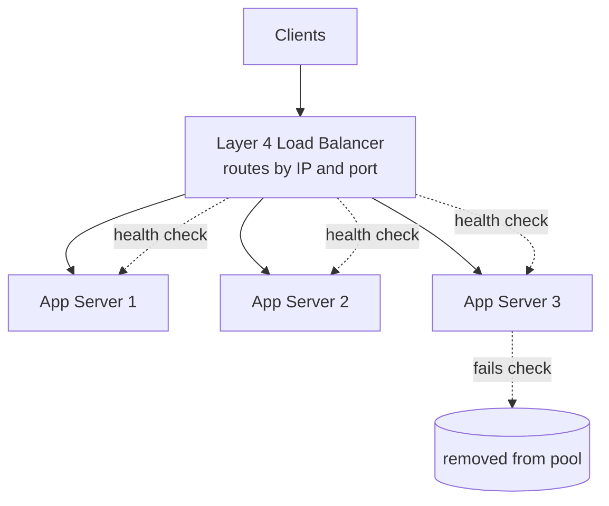

# Load Balancers — Junior Interview Questions

> **Collection:** [System Design](../README.md) · **Level:** Junior · **Section 08 of 42**
> **Goal:** Confirm you can explain what a load balancer *is* and *isn't*, pick a
> distribution algorithm and justify it, tell Layer 4 from Layer 7, describe how
> health checks turn a dead server into a non-event, and connect all of this to
> the reason load balancers exist at all: horizontal scaling.

A load balancer is the traffic cop in front of your servers. At the junior level,
interviewers are not looking for tuning flags — they want to see that you know the
*shape* of the problem: many clients, several interchangeable servers, and a need to
spread work evenly while quietly routing around failure. Each question below lists
**what the interviewer is really probing**, a **model answer**, and often a
**follow-up** they will ask next.

---

## Contents

1. [LB vs Reverse Proxy](#1-lb-vs-reverse-proxy)
2. [Load Balancing Algorithms](#2-load-balancing-algorithms)
3. [Layer 4 Load Balancing](#3-layer-4-load-balancing)
4. [Layer 7 Load Balancing](#4-layer-7-load-balancing)
5. [Health Checks & Failover](#5-health-checks--failover)
6. [Horizontal Scaling](#6-horizontal-scaling)
7. [Global Server Load Balancing (GSLB)](#7-global-server-load-balancing-gslb)
8. [Rapid-Fire Self-Check](#8-rapid-fire-self-check)

---

## 1. LB vs Reverse Proxy

### Q1.1 — What does a load balancer do, in one sentence?

**Probing:** Do you grasp the core job — spreading traffic across interchangeable servers?

**Model answer:** A load balancer sits between clients and a pool of backend servers
and distributes incoming requests across them, so no single server is overwhelmed while
others sit idle. It also continuously checks which backends are healthy and stops
sending traffic to ones that are down, so the failure of any one server is invisible to
the user.

**Follow-up:** *"What problem does it solve that a single server can't?"* → It lets you
scale *out* (add more identical servers behind one address) and survive a server dying,
neither of which a single box can do.

### Q1.2 — Is a load balancer the same as a reverse proxy?

**Probing:** Can you separate two overlapping-but-distinct concepts? Juniors often conflate them.

**Model answer:** They overlap but are not the same. A **reverse proxy** is any server
that sits in front of backends and forwards client requests to them, often adding
features like TLS termination, caching, compression, or request rewriting. A **load
balancer** is specifically about *distributing* requests across multiple backends to
balance load. In practice the two roles blur: a tool like Nginx or HAProxy is a reverse
proxy that *also* load-balances. The clean way to say it: load balancing is one job a
reverse proxy can do, and a reverse proxy can do useful things (TLS, caching) even with
a single backend where there is nothing to balance.

| | Reverse Proxy | Load Balancer |
|---|---|---|
| **Core purpose** | Front backends; add TLS, caching, rewriting | Spread traffic across many backends |
| **Needs multiple backends?** | No (useful with one) | Yes (that's the whole point) |
| **Typical extras** | Caching, compression, auth, TLS termination | Health checks, failover, session affinity |
| **Example** | Nginx caching a single app server | HAProxy across 10 app servers |

**Follow-up:** *"Can one box be both?"* → Yes — Nginx and HAProxy commonly terminate TLS,
cache, *and* balance across a backend pool in the same process.

### Q1.3 — Why put a load balancer in front of servers instead of giving clients the list of server IPs?

**Probing:** Understanding indirection and a stable entry point.

**Model answer:** A load balancer gives clients **one stable address** to talk to while
the set of servers behind it changes freely — you can add, remove, or replace backends
without touching a single client. If clients held the raw server list, every scaling
event or server replacement would require pushing a new list to everyone, and clients
would happily keep hammering a server that just died. The load balancer also centralizes
health checking and even distribution, which you'd otherwise have to reimplement in
every client.

---

## 2. Load Balancing Algorithms

### Q2.1 — Name the common load balancing algorithms and what each optimizes for.

**Probing:** Vocabulary plus the *reason* behind each choice.

**Model answer:**

| Algorithm | How it picks a server | Best when |
|---|---|---|
| **Round-robin** | Next server in rotation, cycling through the pool | Servers are equal and requests are similar in cost |
| **Weighted round-robin** | Rotation, but bigger servers get more turns | Servers have different capacity (e.g., a 16-core and an 8-core box) |
| **Least-connections** | The server with the fewest active connections | Request durations vary a lot (some slow, some fast) |
| **IP-hash** | Hash the client IP to always pick the same server | You want the same client to stick to one server (session affinity) |

Round-robin is the simple default; least-connections is smarter when request costs are
uneven (it won't pile a long slow request onto an already-busy server); weighting handles
mixed hardware; IP-hash buys stickiness when a server holds per-client state.

**Follow-up:** *"Which would you start with and why?"* → Round-robin, because it's
trivial and correct when backends are identical and stateless — only reach for the
others when a measured problem (uneven load, session state) appears.

### Q2.2 — Round-robin sends equal traffic to every server, yet one is overloaded. Why?

**Probing:** Seeing the blind spot of round-robin — it counts requests, not work.

**Model answer:** Round-robin distributes *request count* evenly, but not *work*. If one
server happens to receive several long-running or expensive requests in a row (a big
report, a slow query) while the others get cheap ones, it will be saturated even though
it received the same *number* of requests. **Least-connections** fixes this: it routes
to whichever server currently has the fewest in-flight requests, which is a better proxy
for "least busy" when request durations vary.

### Q2.3 — What is IP-hash (session affinity / "sticky sessions") good and bad at?

**Probing:** Trade-offs of stickiness, and awareness that statelessness is usually better.

**Model answer:** IP-hash hashes the client's IP and always maps it to the same backend,
so a user keeps hitting the server that holds their session data in memory. **Good:** it
makes in-memory session state work without a shared store. **Bad:** it distributes load
unevenly (one big NAT'd office can map a thousand users to one server), and it breaks
when that server dies — those users lose their session. The better long-term fix is to
make servers **stateless** by storing session state in a shared cache like Redis, after
which any algorithm works and any server can serve any user.

---

## 3. Layer 4 Load Balancing

### Q3.1 — What does "Layer 4 load balancing" mean?

**Probing:** Do you know which part of the request an L4 LB sees?

**Model answer:** Layer 4 refers to the transport layer (TCP/UDP) of the OSI model. An L4
load balancer makes its routing decision using only **connection-level** information —
source and destination IP addresses and ports. It does **not** read the actual content
(it doesn't parse the HTTP request, URL, or headers); it just forwards packets/connections
to a chosen backend. Because it works at the connection level, it's very fast and cheap
and works for any TCP/UDP protocol, not just HTTP.

**Follow-up:** *"Can an L4 LB route based on the URL path?"* → No — the URL lives in the
HTTP request body at Layer 7, which an L4 balancer never inspects.

### Q3.2 — Give a one-line picture of how an L4 load balancer fans traffic out.

**Probing:** Mental model of the topology.

**Model answer:** Clients connect to the load balancer's single address; the L4 LB picks
a healthy backend by its algorithm (say least-connections) and forwards the TCP connection
to it. It keeps probing each backend with health checks; when one stops responding it's
pulled from the pool and gets no new connections until it recovers. The client sees one
address the whole time and never knows which physical server answered.

---

## 4. Layer 7 Load Balancing

### Q4.1 — What can a Layer 7 load balancer do that a Layer 4 one cannot?

**Probing:** Understanding content-aware routing.

**Model answer:** A Layer 7 (application layer) load balancer reads the actual HTTP
request — the URL path, headers, cookies, method — and can route based on its **content**.
That unlocks things an L4 balancer can't do: send `/api/*` to one pool and `/images/*` to
another, route by hostname for multiple sites on one address, terminate TLS, do
cookie-based session stickiness, rewrite headers, and even cache responses. The cost is
that it must parse each request, so it does more work per request than a pure L4 forwarder.

### Q4.2 — Compare Layer 4 and Layer 7 load balancing.

**Probing:** Clean, structured trade-off — a classic junior table question.

**Model answer:**

| | Layer 4 (Transport) | Layer 7 (Application) |
|---|---|---|
| **Looks at** | IP + port (connection) | Full HTTP: URL, headers, cookies |
| **Routing power** | Same destination for a connection | Content-based: by path, host, cookie |
| **Speed / cost** | Faster, cheaper per request | More CPU; parses each request |
| **Protocols** | Any TCP/UDP | Mainly HTTP/HTTPS |
| **Extras** | Just forwarding | TLS termination, caching, rewriting, sticky sessions |
| **Example use** | Balancing a database or game-server pool | Routing `/api` vs `/static`, hosting many sites |

The one-liner: **L4 is a fast, dumb pipe that balances connections; L7 is a smart router
that understands HTTP and can make decisions from the request content** — at a higher cost
per request.

**Follow-up:** *"Which would you use to split `/api` and `/static` to different pools?"* →
Layer 7, because that decision requires reading the URL path, which only an L7 LB sees.

---

## 5. Health Checks & Failover

### Q5.1 — What is a health check, and why is it essential to a load balancer?

**Probing:** Connecting health checks to availability.

**Model answer:** A health check is a periodic probe the load balancer sends to each
backend — often an HTTP request to a `/health` endpoint, or just a TCP connection
attempt — to decide whether that server is fit to receive traffic. It's essential because
without it the LB would keep routing requests to a server that has crashed, hung, or been
unplugged, and a fraction of users would get errors. With health checks, a dead backend is
**detected and removed from the pool automatically**, so its failure becomes a non-event
instead of an outage.

**Follow-up:** *"Passive vs active health checks?"* → **Active** = the LB proactively
probes a `/health` endpoint on a schedule. **Passive** = the LB watches real traffic and
marks a backend unhealthy after it sees enough errors or timeouts. Many systems use both.

### Q5.2 — What's the difference between a shallow and a deep health check, and the risk of each?

**Probing:** Nuance — a "200 OK" doesn't always mean "healthy."

**Model answer:** A **shallow** check just confirms the process is up (a TCP connect or a
`/health` that returns 200 immediately). A **deep** check verifies the server can actually
do its job — e.g., it queries the database and checks a downstream dependency before
returning healthy. The trade-off: a shallow check can keep a *broken* server (process up,
but its database connection is dead) in the pool serving errors; a deep check catches that,
but if a shared dependency (the database) is down, **every** backend's deep check fails at
once and the LB removes the *entire* pool — turning a degraded state into a total outage.
The practical answer is to keep health checks shallow enough that one shared dependency
can't take down the whole fleet.

### Q5.3 — A server passes health checks but is responding slowly. What should happen?

**Probing:** Beyond binary up/down — awareness of degraded backends.

**Model answer:** A binary health check might still call it "healthy," so it keeps getting
traffic and dragging latency up. Two mitigations a junior should know: **(1)** make the
health check or the algorithm latency-aware — e.g., least-connections naturally steers new
work away from a slow server because its in-flight connections pile up; **(2)** add
timeouts so the LB gives up on a slow backend and can retry the request on a healthy one.
The general principle: failover should react to *degradation*, not only to a server being
fully dead.

---

## 6. Horizontal Scaling

### Q6.1 — How does a load balancer enable horizontal scaling?

**Probing:** The link between the LB and "add more servers."

**Model answer:** Horizontal scaling means handling more load by adding more identical
servers rather than buying one bigger machine. The load balancer is what makes that
possible from the outside: clients keep hitting one address, and you grow or shrink the
backend pool behind it freely. When traffic doubles, you add servers to the pool and the
LB starts including them in its rotation; when traffic drops, you remove some. Without the
LB as a single front door, clients would have to know about every new server, which doesn't
scale operationally.

**Follow-up:** *"What property must the app servers have for this to work cleanly?"* →
They must be **stateless** — any server can handle any request — so the LB is free to send
a given user to a different server each time.

### Q6.2 — Why must servers behind a load balancer usually be stateless?

**Probing:** The single most important precondition for horizontal scaling.

**Model answer:** Because the load balancer may route the same user's successive requests
to *different* servers. If a server kept the user's session, shopping cart, or upload
progress only in its own memory, the next request landing on a different server would lose
it. Making servers stateless — pushing shared state into an external store like a database
or Redis — means any server can serve any request, which lets the LB balance freely, lets
you add/remove servers at will, and lets any server fail without losing a user's data.
Sticky sessions (IP-hash) are the workaround when you *can't* be stateless, but statelessness
is the cleaner answer.

### Q6.3 — What's a single point of failure (SPOF), and isn't the load balancer itself one?

**Probing:** Catching the obvious gap — who balances the balancer?

**Model answer:** A single point of failure is any one component whose failure takes the
whole system down. And yes — a lone load balancer is exactly that: if it dies, every
backend behind it becomes unreachable even though they're all healthy. The standard fix is
to run **at least two load balancers** in a redundant pair, with a mechanism (a floating/
virtual IP that fails over, or DNS pointing at both) so that if one LB dies the other takes
over its address. The principle generalizes: anything in the request path that exists only
once is a SPOF and needs redundancy.

---

## 7. Global Server Load Balancing (GSLB)

### Q7.1 — What is Global Server Load Balancing, and how does it differ from a normal LB?

**Probing:** Local (within a datacenter) vs global (across datacenters/regions).

**Model answer:** A normal load balancer spreads traffic across servers **inside one
datacenter**. Global Server Load Balancing (GSLB) spreads traffic across **multiple
datacenters or regions**, usually using DNS: when a user looks up your domain, GSLB returns
the IP of the datacenter that's best for *that* user — typically the nearest healthy one.
So GSLB decides *which datacenter*, and the local load balancer inside that datacenter then
decides *which server*. They work as two layers, global then local.

**Follow-up:** *"Which one usually relies on DNS?"* → GSLB — it answers DNS queries with a
region-appropriate IP. The local LB then takes over once the client connects.

### Q7.2 — Name two reasons to route a user to one datacenter over another.

**Probing:** The drivers behind global routing.

**Model answer:** **(1) Latency / proximity** — send the user to the geographically
closest region so the round-trip is short (a user in Tokyo gets the Tokyo datacenter, not
Virginia). **(2) Availability / failover** — if an entire region is down, GSLB stops
handing out its IP and routes everyone to a healthy region, so a whole-datacenter outage
degrades gracefully instead of taking the product offline. Secondary drivers include load
(steer traffic away from an overloaded region) and data-residency rules (keep EU users on
EU infrastructure).

### Q7.3 — A whole datacenter goes offline. How does GSLB handle it, and what's the catch?

**Probing:** Failover at the global layer, plus the DNS-caching gotcha.

**Model answer:** GSLB health-checks each datacenter; when one stops responding, it removes
that region's IP from its DNS answers so new lookups resolve to a healthy region. The
**catch** is DNS caching: clients and resolvers cache the old IP for the duration of its
TTL, so until that TTL expires some users keep trying the dead datacenter. That's why GSLB
records use short TTLs — to shrink the failover window — accepting more frequent DNS lookups
as the cost. It's a reminder that DNS-based failover is fast but not instant.

---

## 8. Rapid-Fire Self-Check

If you can answer each of these in a sentence, you're ready for the junior bar on this section:

- [ ] What's the one-line job of a load balancer? *(spread traffic across healthy backends)*
- [ ] Load balancer vs reverse proxy — what's the relationship? *(LB is one job a reverse proxy can do)*
- [ ] Why round-robin can still overload one server? *(it counts requests, not work)*
- [ ] When would you reach for least-connections over round-robin? *(uneven request durations)*
- [ ] What does IP-hash buy you, and what's the cleaner alternative? *(stickiness; make servers stateless)*
- [ ] L4 vs L7 — what does each one *see*? *(IP+port vs full HTTP content)*
- [ ] Why can only an L7 LB route by URL path? *(the path lives at Layer 7)*
- [ ] Shallow vs deep health check — the risk of each? *(stale-but-up vs whole-fleet-down on a shared dependency)*
- [ ] Why must servers behind an LB usually be stateless? *(the LB may route a user to any server)*
- [ ] Isn't the load balancer itself a SPOF — how do you fix it? *(yes; run a redundant pair)*
- [ ] GSLB vs a local LB — which picks the datacenter? *(GSLB, usually via DNS)*
- [ ] Why are GSLB DNS TTLs kept short? *(to shrink the failover window during DNS caching)*

---

**Next step:** Section 09 — [Communication](09-communication.md): how clients and services
actually talk — protocols, sync vs async, and the request/response patterns that ride on
top of the load balancer.
