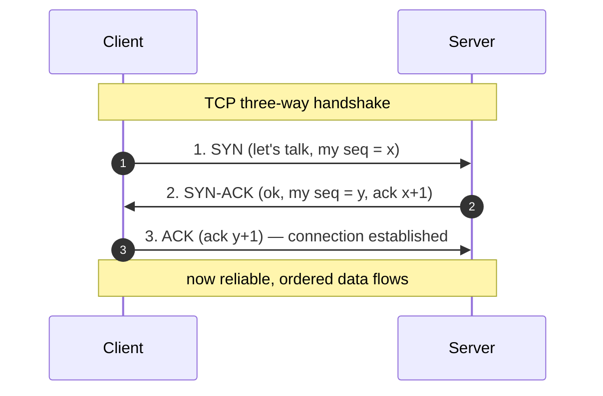
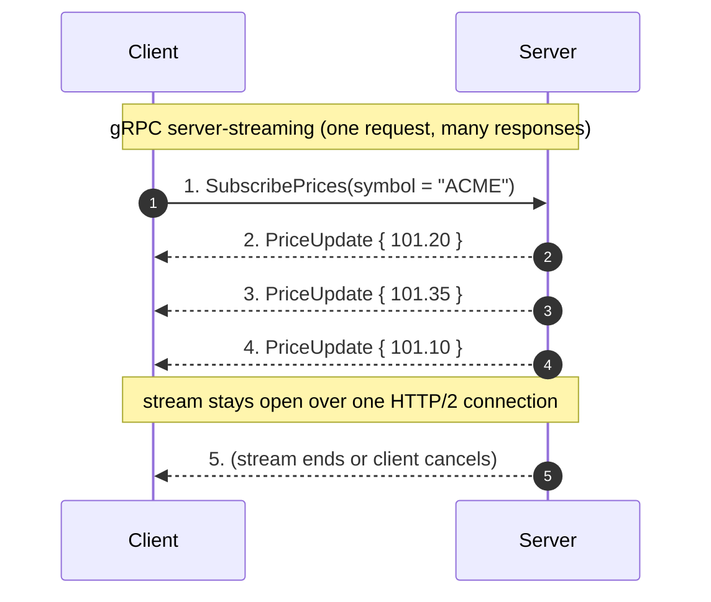

# Communication — Junior Interview Questions

> **Collection:** [System Design](../README.md) · **Level:** Junior · **Section 09 of 42**
> **Goal:** Confirm you can name the protocols and styles that move bytes between
> clients and servers — HTTP, TCP, UDP, RPC, gRPC, REST, GraphQL — explain what each
> is *for*, and reason about HTTP method semantics (safe, idempotent) well enough to
> design a retry-safe API.

A "junior" answer here is not a memorized acronym dump — it is a *correct, concrete*
explanation of why a protocol exists and when you'd reach for it. Interviewers check
that you can place each tool on the right layer, contrast two of them honestly, and
talk about idempotency the way a real backend engineer must when designing retries.
Each question lists **what the interviewer is really probing**, a **model answer**, and
often a **follow-up** they will ask next.

---

## Contents

1. [HTTP](#1-http)
2. [TCP](#2-tcp)
3. [UDP](#3-udp)
4. [RPC](#4-rpc)
5. [gRPC](#5-grpc)
6. [REST](#6-rest)
7. [GraphQL](#7-graphql)
8. [Idempotent Operations](#8-idempotent-operations)
9. [Rapid-Fire Self-Check](#9-rapid-fire-self-check)

---

## 1. HTTP

### Q1.1 — What is HTTP, and where does it sit relative to TCP?

**Probing:** Do you know HTTP is an *application-layer* protocol that rides on top of a transport?

**Model answer:** HTTP (HyperText Transfer Protocol) is a request/response,
application-layer protocol: a client sends a request (method, path, headers, optional
body), the server sends back a response (status code, headers, body). It is
**stateless** — each request is self-contained and the server keeps no memory of prior
requests unless you add cookies or tokens. HTTP itself doesn't move bytes; it defines
the *message format* and rides on top of a transport (TCP for HTTP/1.1 and HTTP/2, QUIC
over UDP for HTTP/3) that handles reliable delivery.

**Follow-up:** *"What does a status code tell the client?"* → The class is the headline:
`2xx` success, `3xx` redirect, `4xx` the client's fault (bad request, unauthorized,
not found), `5xx` the server's fault. A client can branch on the first digit before
parsing anything else.

### Q1.2 — Name the common HTTP methods and what each is for.

**Probing:** Vocabulary, and whether you map methods to intent rather than guessing.

**Model answer:** `GET` retrieves a resource (no side effects), `POST` creates a
resource or submits data for processing, `PUT` replaces a resource at a known URL,
`PATCH` partially updates it, and `DELETE` removes it. The intent matters: `GET
/users/42` should *only read*, while `POST /orders` is expected to *change* state. Using
the right method lets caches, proxies, and clients behave correctly automatically.

### Q1.3 — Why is HTTP being stateless actually useful for scaling?

**Probing:** Connecting a protocol property to a system-design benefit.

**Model answer:** Because the server holds no per-client memory, any server behind a
load balancer can handle any request. That makes app servers **interchangeable** — you
can add or remove them freely, and a request can be retried on a different machine. The
cost is that any needed state (who you are, your cart) must travel *with* each request,
typically in a cookie or a bearer token, or live in a shared store like Redis.

---

## 2. TCP

### Q2.1 — What guarantees does TCP give you?

**Probing:** Reliable, ordered, connection-oriented — can you name them?

**Model answer:** TCP (Transmission Control Protocol) gives you a **reliable, ordered,
connection-oriented byte stream**. Concretely: every byte is acknowledged and
retransmitted if lost (reliable), bytes arrive in the order they were sent (ordered),
and the two sides establish a connection with a **three-way handshake** (SYN, SYN-ACK,
ACK) before any data flows. It also does flow control and congestion control so a fast
sender doesn't overwhelm a slow receiver or the network.

### Q2.2 — What's the cost of those guarantees?

**Probing:** Honest awareness of the latency/overhead trade-off.

**Model answer:** Two main costs. **Setup latency** — the handshake is a full round-trip
before any data moves, so a cross-continent connection pays ~150 ms just to start.
**Head-of-line blocking** — because delivery is strictly ordered, one lost packet stalls
everything behind it until it's retransmitted. That ordering is exactly what you want
for a file or an API response, but it can hurt real-time media where a slightly late
packet is useless anyway.

---

## 3. UDP

### Q3.1 — How is UDP different from TCP, and when would you choose it?

**Probing:** Do you understand the "fire and forget" trade-off and its right use cases?

**Model answer:** UDP (User Datagram Protocol) is **connectionless and unreliable**:
no handshake, no acknowledgements, no ordering, no retransmission. You send a datagram
and it may arrive, arrive out of order, or vanish silently. In exchange you get **lower
latency and overhead**. You choose UDP when *fresh-but-occasionally-lost* beats
*complete-but-late*: live video and voice (a dropped frame is better than a stuttered
one), online gaming, and DNS lookups (one small request, one small reply — cheaper than
a handshake).

**Follow-up:** *"But video calls work fine — who handles the lost packets?"* → The
application does, selectively. Protocols built on UDP (like WebRTC or QUIC) add their
*own* lightweight reliability where it matters and skip it where it doesn't, instead of
paying TCP's all-or-nothing ordering tax.

### Q3.2 — Give a one-line summary of TCP vs UDP.

**Model answer:**

| | TCP | UDP |
|---|---|---|
| Connection | Handshake first | None — fire and forget |
| Reliability | Guaranteed, retransmits | Best-effort, may drop |
| Ordering | In-order | No ordering |
| Overhead / latency | Higher | Lower |
| Use it for | Web pages, APIs, file transfer | Live media, gaming, DNS |

The mental model: **TCP = "deliver everything, in order, no matter the delay." UDP =
"deliver what you can, right now, and don't wait."**

---

## 4. RPC

### Q4.1 — What is RPC, and what problem does it solve?

**Probing:** Do you get the core illusion — calling a remote function like a local one?

**Model answer:** RPC (Remote Procedure Call) is a style where calling code on one
machine invokes a function that runs on **another** machine, made to look like an
ordinary local function call. The framework hides the networking: it **serializes** the
arguments, sends them over the wire, runs the procedure on the server, and serializes
the result back. So instead of hand-writing an HTTP request and parsing JSON, you write
`user := client.GetUser(id)` and the RPC layer does the rest.

### Q4.2 — What's the catch — why isn't a remote call just like a local one?

**Probing:** Awareness that the abstraction leaks; juniors who say "it's identical" miss this.

**Model answer:** A network sits in the middle, so a remote call can do things a local
call never does: it can be **slow** (network latency), **fail partway** (the request
arrived but the reply was lost), or **time out** with you not knowing whether it
executed. That last one is the dangerous case — it's why RPC designs care about retries
and idempotency. The convenience is real, but you must still treat remote calls as
fallible network operations, not free function calls.

---

## 5. gRPC

### Q5.1 — What is gRPC, and what makes it fast?

**Probing:** Protobuf + HTTP/2 — the two ingredients that define it.

**Model answer:** gRPC is a modern, high-performance RPC framework. Two choices make it
fast: **(1)** it serializes messages with **Protocol Buffers** (protobuf), a compact
*binary* format that is much smaller and quicker to parse than JSON text; **(2)** it
runs over **HTTP/2**, which multiplexes many calls over one connection and supports
streaming. You define your service and messages in a `.proto` file, and gRPC generates
strongly-typed client and server code in your language from it.

### Q5.2 — What are the four call types gRPC supports?

**Probing:** Knowing it isn't just request/response — it streams.

**Model answer:** **Unary** (one request → one response, like a normal call),
**server-streaming** (one request → a stream of responses, e.g. live updates),
**client-streaming** (a stream of requests → one response, e.g. uploading chunks), and
**bidirectional streaming** (both sides stream independently over the same connection,
e.g. a chat). Streaming is a first-class feature, which is why gRPC fits real-time and
high-throughput internal services well.

### Q5.3 — When would you pick gRPC over plain REST/JSON?

**Probing:** Right-tool judgement, not dogma.

**Model answer:** gRPC shines for **internal service-to-service** communication where
you control both ends and want low latency, small payloads, strict typing, and
streaming — think microservices in a backend mesh. REST/JSON tends to win for
**public-facing** and **browser** APIs, because it's human-readable, works natively in
every browser, and needs no special tooling. (Browsers can't speak raw gRPC; they need
gRPC-Web as a bridge.)

---

## 6. REST

### Q6.1 — What does it mean for an API to be RESTful?

**Probing:** Resources + HTTP verbs + statelessness, not just "it returns JSON."

**Model answer:** REST (Representational State Transfer) is an architectural *style* for
HTTP APIs built around **resources** identified by URLs, manipulated with **standard
HTTP methods**. A resource like a user is `/users/42`; you `GET` it to read, `PUT` to
replace, `DELETE` to remove, and `POST /users` to create. It's **stateless** (each
request carries everything needed) and leans on HTTP's existing machinery — status
codes, caching headers, methods — instead of inventing its own.

**Follow-up:** *"Is returning JSON enough to call it REST?"* → No. Many "REST" APIs are
really RPC-over-HTTP (e.g. `POST /getUser`). True REST models *resources and verbs*; the
format (JSON, XML) is secondary.

### Q6.2 — Design two REST endpoints for a blog: list posts and create a post.

**Probing:** Can you apply resource + verb conventions concretely?

**Model answer:** `GET /posts` lists posts (a *safe* read; supports paging like
`?page=2&limit=20`), and `POST /posts` creates one with the new post in the request
body, returning `201 Created` and the created resource (often with its new URL in a
`Location` header). Fetching one is `GET /posts/{id}`; updating is `PUT
/posts/{id}` or `PATCH /posts/{id}`. The nouns are plural and stable; the verb conveys
the action.

---

## 7. GraphQL

### Q7.1 — What problem does GraphQL solve that REST often has?

**Probing:** Over-fetching / under-fetching and the single-endpoint idea.

**Model answer:** GraphQL is a query language for APIs where the **client specifies
exactly which fields it wants**, sent to a single endpoint (usually `POST /graphql`).
It targets two REST pain points: **over-fetching** (a REST endpoint returns 30 fields
when the screen needs 3) and **under-fetching** (the screen needs data from three
endpoints, forcing three round-trips). With GraphQL, one request asks for precisely the
nested shape the UI needs, and the server returns exactly that.

### Q7.2 — What's the trade-off — what does GraphQL make harder?

**Probing:** Balanced view; juniors who only praise it haven't operated one.

**Model answer:** Flexibility shifts work to the server. **Caching** is harder because
everything is one `POST` to one URL, so simple HTTP/CDN caching by URL no longer applies.
**Performance** can suffer from the **N+1 problem**, where resolving a list and its
nested fields fires one database query per item unless you batch (e.g. with DataLoader).
And a maliciously deep or broad query can be expensive, so you need depth/complexity
limits. REST's per-endpoint simplicity is genuinely easier to cache and reason about.

### Q7.3 — REST vs gRPC vs GraphQL — when do you reach for each?

**Probing:** The synthesis question. Can you compare all three honestly?

**Model answer:**

| | REST | gRPC | GraphQL |
|---|---|---|---|
| Style | Resources + HTTP verbs | Remote procedure calls | Client-specified query |
| Payload | JSON (text) | Protobuf (binary) | JSON (text) |
| Transport | HTTP/1.1 or HTTP/2 | HTTP/2 | HTTP (usually POST) |
| Best fit | Public / browser APIs | Internal microservices | Flexible client data needs |
| Streaming | Limited (SSE/WebSocket) | First-class (4 modes) | Subscriptions |
| Caching | Easy (per-URL) | Manual | Harder (single endpoint) |
| Browser-native | Yes | No (needs gRPC-Web) | Yes |

Rule of thumb: **REST** for simple public APIs, **gRPC** for fast typed internal traffic,
**GraphQL** when many diverse clients each need different slices of the same data.

---

## 8. Idempotent Operations

### Q8.1 — Define "safe" and "idempotent." Are they the same thing?

**Probing:** The precise distinction — they're related but not identical.

**Model answer:** They're different. A method is **safe** if it has **no side effects** —
it only reads, never changes server state (`GET`, `HEAD`). A method is **idempotent** if
making the request **once or many times has the same final effect** on the server. All
safe methods are idempotent (reading twice changes nothing), but not all idempotent
methods are safe: `DELETE /users/42` *does* change state, yet calling it again leaves the
same result — the user stays deleted. So: safe ⊂ idempotent.

### Q8.2 — Classify the HTTP methods by safe and idempotent.

**Probing:** The table every backend engineer must know cold.

**Model answer:**

| Method | Safe? | Idempotent? | Why |
|---|---|---|---|
| `GET` | ✅ Yes | ✅ Yes | Read-only; repeating it changes nothing |
| `HEAD` | ✅ Yes | ✅ Yes | Like GET with no body |
| `PUT` | ❌ No | ✅ Yes | Replaces resource with the *same* value each time |
| `DELETE` | ❌ No | ✅ Yes | After the first delete, repeats leave it deleted |
| `POST` | ❌ No | ❌ No | Each call typically creates a *new* resource |
| `PATCH` | ❌ No | ⚠️ Not guaranteed | Depends on the patch; e.g. `balance += 10` is not idempotent |

The headline: **`POST` is the odd one out** — it's neither safe nor idempotent, which is
exactly why duplicate `POST`s create duplicate orders.

### Q8.3 — Why does idempotency matter for retries in a distributed system?

**Probing:** Connecting the concept to real failure handling — the whole point.

**Model answer:** Because networks fail in the worst way: a request can succeed on the
server but the *response* gets lost, so the client doesn't know if it worked and retries.
If the operation is idempotent, retrying is **safe** — `PUT` or `DELETE` twice does no
harm. If it isn't (a `POST` that charges a card), a blind retry **double-charges**. The
standard fix is an **idempotency key**: the client sends a unique key with the request,
and the server remembers it, so a retried `POST` with the same key is recognized and
executed only once. This is exactly how payment APIs make charges retry-safe.

**Follow-up:** *"How would you make 'create order' idempotent?"* → Require the client to
send a client-generated `Idempotency-Key` header; the server stores the result against
that key, and any retry with the same key returns the stored result instead of creating
a second order.

---

## 9. Rapid-Fire Self-Check

If you can answer each of these in a sentence, you're ready for the junior bar on this section:

- [ ] What layer is HTTP, and what transport does it ride on? *(application; TCP, or QUIC/UDP for HTTP/3)*
- [ ] Three guarantees TCP gives? *(reliable, ordered, connection-oriented)*
- [ ] When do you choose UDP over TCP? *(live media, gaming, DNS — fresh beats complete)*
- [ ] What illusion does RPC create, and where does it leak? *(local-looking remote call; network latency/partial failure)*
- [ ] Two things that make gRPC fast? *(protobuf binary + HTTP/2)*
- [ ] What two problems does GraphQL fix vs REST? *(over-fetching, under-fetching)*
- [ ] What does GraphQL make harder? *(caching, N+1 queries)*
- [ ] Safe vs idempotent — difference and which methods are which? *(safe = read-only; idempotent = same effect on repeat)*
- [ ] Why is `POST` the dangerous one for retries, and how do you fix it? *(neither safe nor idempotent; idempotency key)*

---

**Next step:** Section 10 — [Application Layer](10-application-layer.md): the protocols and concerns that sit on top of these primitives.
