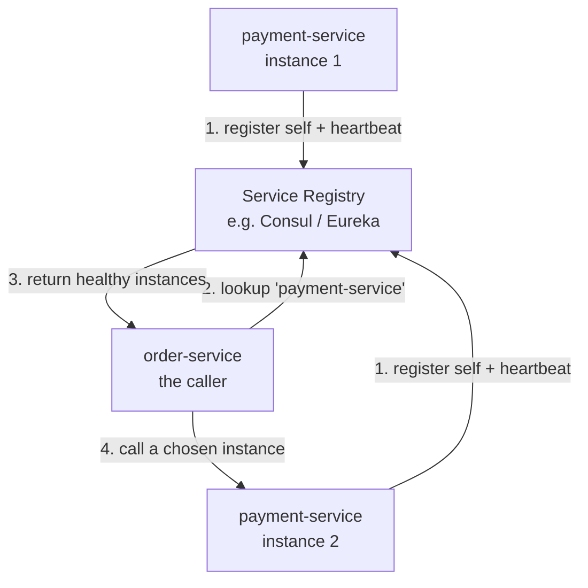
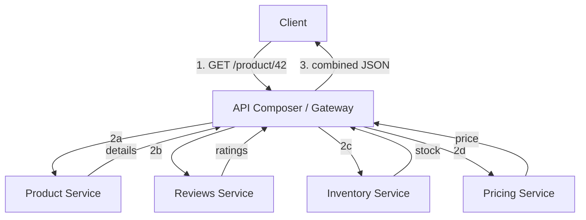
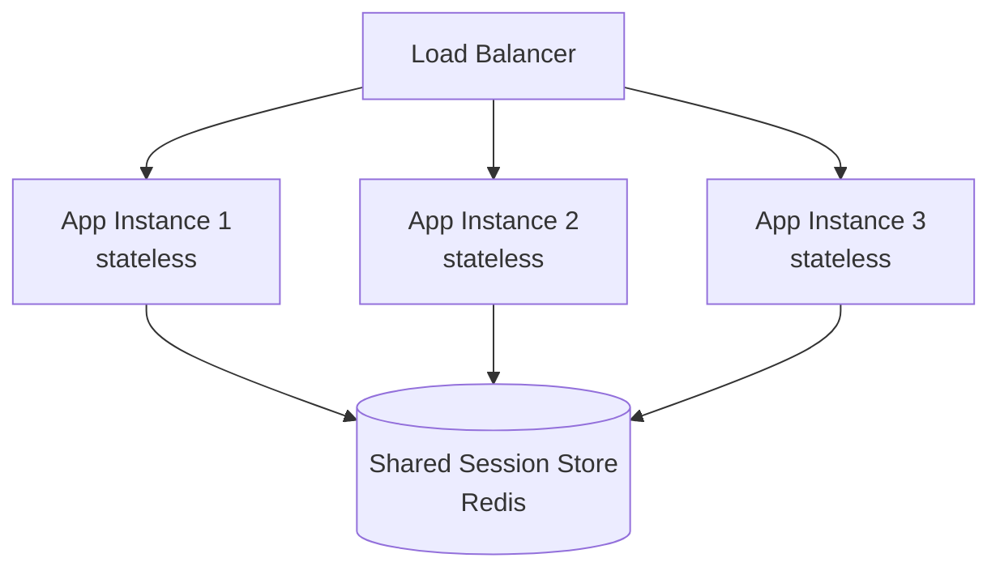
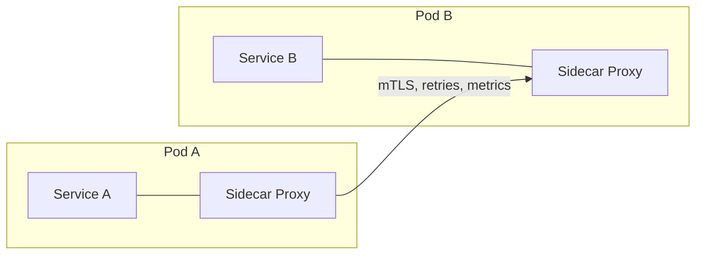

# Application Layer — Junior Interview Questions

> **Collection:** [System Design](../README.md) · **Level:** Junior · **Section 10 of 42**
> **Goal:** Confirm you can explain what a service-oriented application layer is, argue
> *when* to split a monolith and when not to, describe how services find and talk to each
> other, and reason about why keeping a service *stateless* is what makes all of this scale.

The application layer is where the request actually does work: it is the tier of services
that sit behind the load balancer and in front of the data stores. A "junior" answer here
is not a shallow one — it is *correct, concrete, and honest about trade-offs*. Interviewers
are checking that you don't treat "microservices" as a magic word, that you can name a real
product or component for each idea, and that you understand the operational cost each pattern
buys you. Each question lists **what the interviewer is really probing**, a **model answer**,
and often a **follow-up** they will ask next.

---

## Contents

1. [Microservices](#1-microservices)
2. [Monolith vs Microservices](#2-monolith-vs-microservices)
3. [Service Discovery](#3-service-discovery)
4. [API Composition](#4-api-composition)
5. [Stateless Design](#5-stateless-design)
6. [Service Mesh (intro)](#6-service-mesh-intro)
7. [Rapid-Fire Self-Check](#7-rapid-fire-self-check)

---

## 1. Microservices

### Q1.1 — In one sentence, what is a microservice?

**Probing:** Do you understand it is about *independent deployability and ownership*, not just "small"?

**Model answer:** A microservice is a small, independently deployable service that owns one
business capability — and its own data — and communicates with other services only over the
network (typically HTTP/REST, gRPC, or messages). The defining property is not size; it is
that you can build, test, deploy, and scale it *on its own* without coordinating a release
with the rest of the system. "Order Service," "Payment Service," and "Notification Service"
in an e-commerce platform are textbook examples.

**Follow-up:** *"So is a 50-line service automatically a microservice?"* → No. A service that
shares a database with three others, or that must be deployed in lockstep with them, is small
but *not* a microservice — it lacks independence, which is the whole point.

### Q1.2 — Name three concrete benefits of microservices.

**Probing:** Can you give *operational* benefits, not buzzwords?

**Model answer:**
1. **Independent deployment** — the Search team can ship ten times a day without waiting on
   the Billing team's release cycle, which shortens lead time and shrinks blast radius.
2. **Independent scaling** — if image processing is the bottleneck, you scale only that
   service's instances instead of cloning the entire application.
3. **Technology and team autonomy** — one service can be Go and another Python; a small team
   can own a service end-to-end, which scales the *organization*, not just the software.

### Q1.3 — What are the main costs you take on by going to microservices?

**Probing:** Honesty — juniors who only list benefits are a red flag.

**Model answer:** You trade *code complexity* for *operational and network complexity*. A
call that was an in-process function is now a network hop that can be slow, time out, or fail
partway. You inherit distributed-systems problems: service discovery, retries and timeouts,
distributed tracing to debug a request that crossed five services, eventual consistency
across separate databases, and a much heavier deployment/CI/monitoring footprint. The rule of
thumb: don't pay this cost until the team size or scale actually demands it.

**Follow-up:** *"What single thing makes microservices hardest to debug?"* → A request now
spans multiple processes, so you can't read one stack trace; you need correlation IDs and
distributed tracing to follow it end-to-end.

---

## 2. Monolith vs Microservices

### Q2.1 — Compare a monolith and microservices across the dimensions that matter.

**Probing:** Structured, balanced comparison — not a sales pitch for microservices.

**Model answer:**

| Dimension | Monolith | Microservices |
|---|---|---|
| **Deployment** | One artifact, one deploy (all-or-nothing) | Many services deploy independently |
| **Scaling** | Scale the whole app together | Scale each service to its own load |
| **Codebase** | Single codebase, easy to navigate | Many repos/services, harder to see the whole |
| **Failure isolation** | One bug can take down everything | One service can fail while others stay up |
| **Inter-module calls** | Fast in-process function calls | Network calls (slower, can fail) |
| **Data** | Usually one shared database | Each service owns its own data store |
| **Team fit** | Great for small teams | Great for many independent teams |
| **Operational overhead** | Low (one thing to run/monitor) | High (discovery, tracing, orchestration) |

The honest summary: a monolith is *simpler and faster to build early*; microservices *scale
the organization and isolate failure* at the price of distributed-systems complexity.

### Q2.2 — A three-person startup is building an MVP. Monolith or microservices?

**Probing:** Do you reach for the right *default*, or cargo-cult microservices?

**Model answer:** Start with a **monolith** — ideally a *well-modularized* one (a "modular
monolith"). With three people and an unproven product, the dominant cost is iteration speed,
and a monolith gives you that: one deploy, one database, easy local testing, no network
failures to debug. You'd be paying the full operational tax of microservices to solve
scaling and team-autonomy problems you don't have yet. Keep clean module boundaries so that
*if* you grow, you can carve a service out along an existing seam.

**Follow-up:** *"When would you actually split?"* → When a specific part needs to scale or
deploy independently, when a clear bounded context emerges, or when the team grows past the
point where everyone can touch one codebase without stepping on each other.

### Q2.3 — What is the "distributed monolith" anti-pattern?

**Probing:** Awareness that microservices done wrong are worse than a monolith.

**Model answer:** A distributed monolith is when you split into separate services but they
are still tightly coupled — they share a database, or every change to one forces a coordinated
deploy of the others. You've taken on *all* the operational cost of microservices (network
hops, discovery, tracing) and kept *none* of the benefit (independence). It is the worst of
both worlds. The cure is real independence: each service owns its own data and can be
released alone.

---

## 3. Service Discovery

### Q3.1 — Why can't services just hard-code each other's IP addresses?

**Probing:** Understanding that instances are dynamic in a modern deployment.

**Model answer:** In a dynamic environment — autoscaling groups, containers, Kubernetes pods
— instances come and go constantly: they scale up under load, get replaced on deploy, and
restart on failure, each time with a new IP. A hard-coded address is stale almost immediately
and points at a dead host. **Service discovery** solves this: services register themselves at
a known location, and callers look up *current, healthy* instances by logical name (e.g.,
`payment-service`) instead of by IP.

### Q3.2 — Explain the client-side service-discovery flow with a registry.

**Probing:** Mechanical fluency with register → lookup → call → health-check.

**Model answer:** Each `payment-service` instance, on startup, **registers** its address with
the registry and keeps sending heartbeats; if the heartbeats stop, the registry marks it
unhealthy and stops handing it out. When `order-service` needs to call payments, it **queries
the registry by logical name**, gets back the list of currently healthy instances, picks one
(often with client-side load balancing), and calls it. The registry is the single source of
truth for "who is alive right now."

**Follow-up:** *"What's the difference between client-side and server-side discovery?"* → In
**client-side**, the caller queries the registry and load-balances itself. In **server-side**,
the caller hits a fixed load balancer / router that does the lookup and forwarding (e.g.,
Kubernetes Services + kube-proxy, or an AWS ALB). DNS-based discovery is a common simple form.

### Q3.3 — What does a health check do, and why is it essential to discovery?

**Probing:** Connecting discovery to *availability*.

**Model answer:** A health check is a periodic probe (e.g., an HTTP `GET /healthz`) that asks
"are you able to serve traffic?" The registry or load balancer uses it to keep its routing
list accurate: an instance that fails its check is removed from rotation so no new requests
go to it. Without health checks, discovery would keep routing traffic to crashed or
overloaded instances, producing errors. A good health check verifies real readiness — that
dependencies like the database are reachable — not just that the process is running.

---

## 4. API Composition

### Q4.1 — What problem does API composition (an aggregator/gateway) solve?

**Probing:** Why a client shouldn't call ten services itself.

**Model answer:** In a microservices system, the data for one screen often lives across many
services. If the client (a mobile app) had to call each one directly, it would make many
round trips over a slow mobile network, need to know every service's address, and duplicate
the joining logic. **API composition** puts a single entry point — an API gateway or a
Backend-for-Frontend (BFF) — between the client and the services. The client makes *one*
request; the composer fans out to the underlying services, gathers the results, and returns a
single combined response.

### Q4.2 — Walk me through a composer building a "product page" response.

**Probing:** Can you describe a fan-out / gather across services?

**Model answer:** The client sends one `GET /product/42`. The composer fans out — ideally
**in parallel** — to the Product, Reviews, Inventory, and Pricing services, waits for the
responses, merges them into one JSON payload, and returns it. Doing the calls in parallel
keeps total latency close to the *slowest single call* rather than the sum of all of them.

**Follow-up:** *"What happens if the Reviews service is down?"* → You design for partial
failure: the composer should return the product with reviews omitted (or a "reviews
unavailable" marker) rather than failing the whole page. This is **graceful degradation** —
the non-critical service shouldn't take down the critical response.

### Q4.3 — What's a real downside of putting an API gateway in front of everything?

**Probing:** Balanced thinking — every layer has a cost.

**Model answer:** The gateway becomes a critical path and a potential **single point of
failure and bottleneck**, so it must itself be replicated and scaled. It can also turn into a
dumping ground for business logic that belongs in the services, and it adds one more network
hop and one more thing to deploy and monitor. The discipline is to keep it focused on
*cross-cutting* concerns — composition, auth, rate limiting, routing — and out of
domain logic.

---

## 5. Stateless Design

### Q5.1 — What does it mean for a service to be "stateless," and why does it matter so much?

**Probing:** This is the keystone concept that makes horizontal scaling work.

**Model answer:** A stateless service keeps *no client-specific state in its own memory
between requests* — each request carries everything needed to handle it (or the state lives in
a shared store), so any instance can serve any request. It matters because it makes the
service **horizontally scalable and disposable**: you can add or remove instances freely, the
load balancer can send a user's requests to a different instance each time, and if an instance
dies no one loses their session. Statelessness is precisely what lets the application layer
scale by adding boxes.

### Q5.2 — Where should the state go, then? Give a concrete example.

**Probing:** Do you know stateless ≠ "no state anywhere"?

**Model answer:** State doesn't vanish — it moves *out* of the service instance into a shared,
external store. Classic example: instead of keeping a logged-in user's session in one server's
memory (which breaks the moment the load balancer routes them elsewhere), store the session in
a shared cache like **Redis**, or encode it in a signed token (**JWT**) the client sends with
every request. Now every app instance can validate the request identically, and you can scale
or replace instances at will.

**Follow-up:** *"What breaks if you keep sessions in instance memory instead?"* → You'd be
forced to use **sticky sessions** (always route a user to the same instance). Then scaling is
uneven, and when that one instance dies, every user pinned to it is logged out — the failure
isn't isolated.

### Q5.3 — Name one thing that is legitimately *hard* to make stateless.

**Probing:** Nuance — not everything is trivially stateless.

**Model answer:** Long-lived connections like **WebSockets** hold per-connection state in a
specific server's memory for the duration of the connection, so they're inherently sticky to
that instance. You handle it by externalizing the *shared* state (e.g., a pub/sub layer like
Redis so any server can broadcast to any connection) while accepting that the live socket
itself is pinned. The goal is to push as much state as possible out, not to pretend none
exists.

---

## 6. Service Mesh (intro)

### Q6.1 — At a high level, what is a service mesh and what problem does it solve?

**Probing:** Conceptual grasp — juniors aren't expected to operate one, just to explain it.

**Model answer:** A service mesh is an infrastructure layer that handles **service-to-service
communication** — retries, timeouts, load balancing, mutual TLS, and traffic metrics — *outside*
your application code. Without it, every team has to reimplement these resilience and security
concerns in every service, in every language. The mesh moves that logic into a shared layer so
the application code can focus on business logic. Istio and Linkerd are common examples.

### Q6.2 — How does a mesh intercept traffic without changing the app? (the sidecar)

**Probing:** Understanding the sidecar-proxy model.

**Model answer:** The mesh deploys a small **sidecar proxy** (e.g., Envoy) alongside each
service instance. The service's traffic is transparently routed *through* its sidecar, so the
proxy can enforce timeouts, retry failed calls, encrypt the connection with mutual TLS, and
emit metrics — all without the service knowing. A central **control plane** configures all
the sidecars (the **data plane**). The service still thinks it's making a normal network call;
the sidecar does the heavy lifting.

### Q6.3 — When is a service mesh overkill?

**Probing:** Judgment — a mesh is not free.

**Model answer:** For a handful of services, a mesh is usually overkill: it adds real
operational complexity, a control plane to run, and a little latency per hop from the extra
proxy. If you have three services, libraries for retries/timeouts and a basic gateway are
simpler. A mesh starts to pay off when you have *many* services across teams and you want
consistent security (mTLS everywhere) and observability without rewriting each service. As
with most of this section: adopt it when the scale justifies the cost, not before.

---

## 7. Rapid-Fire Self-Check

If you can answer each of these in a sentence, you're ready for the junior bar on this section:

- [ ] What's the *defining* property of a microservice? *(independent deployability + owns its data)*
- [ ] One benefit and one cost of microservices vs a monolith.
- [ ] What's the right default architecture for a 3-person MVP? *(modular monolith)*
- [ ] What is a "distributed monolith" and why is it bad? *(all the cost, none of the independence)*
- [ ] Why can't services hard-code each other's IPs? *(instances are dynamic)*
- [ ] In client-side discovery, what does the registry return? *(current healthy instances)*
- [ ] What does API composition / a gateway do? *(one client call → fan-out → combined response)*
- [ ] What should the composer do if a non-critical downstream is down? *(degrade gracefully)*
- [ ] What does "stateless" mean and why does it enable horizontal scaling? *(any instance serves any request)*
- [ ] Where do you move session state to keep a service stateless? *(shared store: Redis / signed token)*
- [ ] What is a sidecar proxy in a service mesh, and when is a mesh overkill? *(intercepts traffic; overkill for a few services)*

---

**Next step:** Section 11 — [API Design at Scale](11-api-design-at-scale.md): REST vs gRPC, pagination, idempotency, and versioning.
