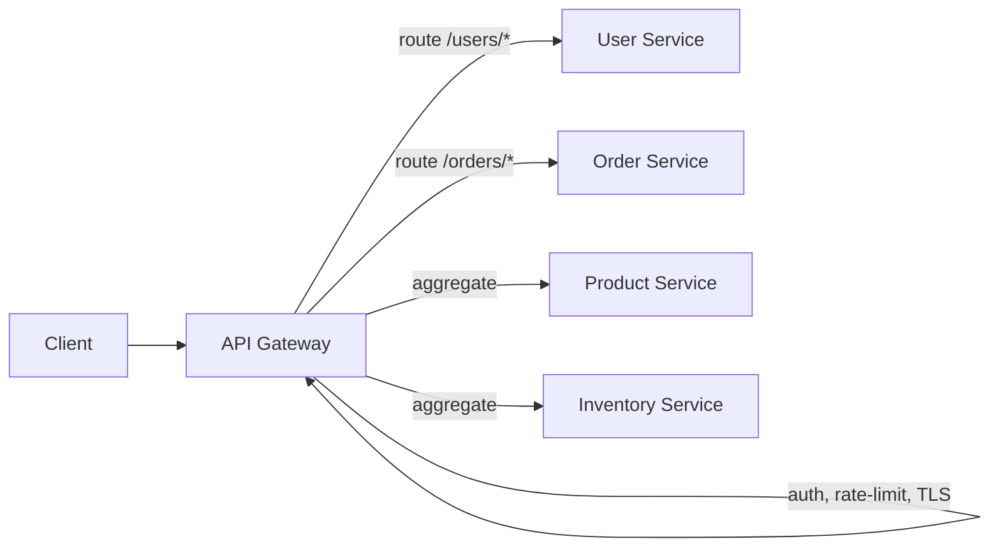
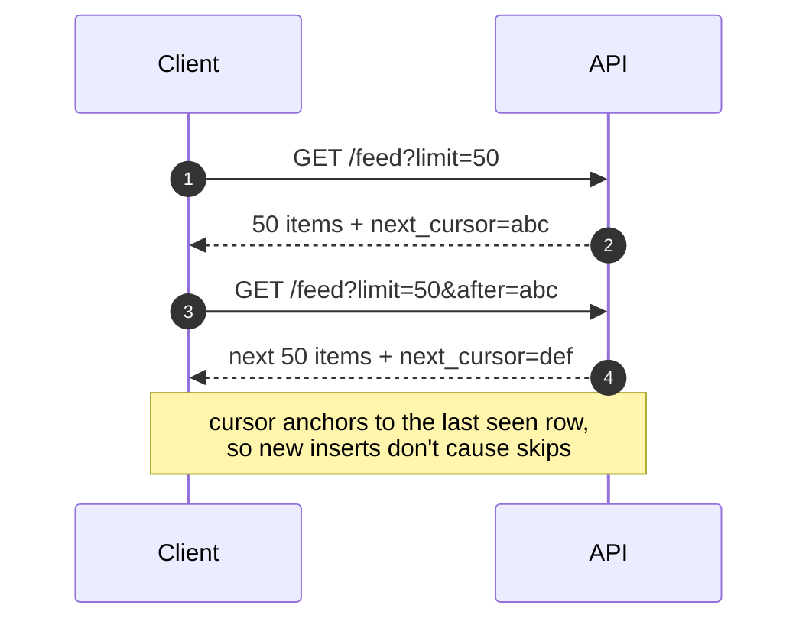
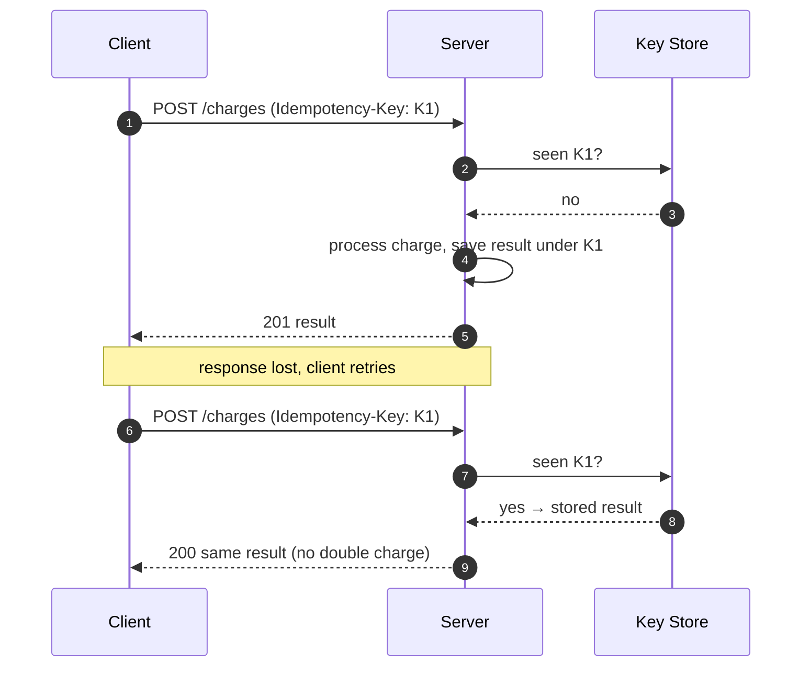
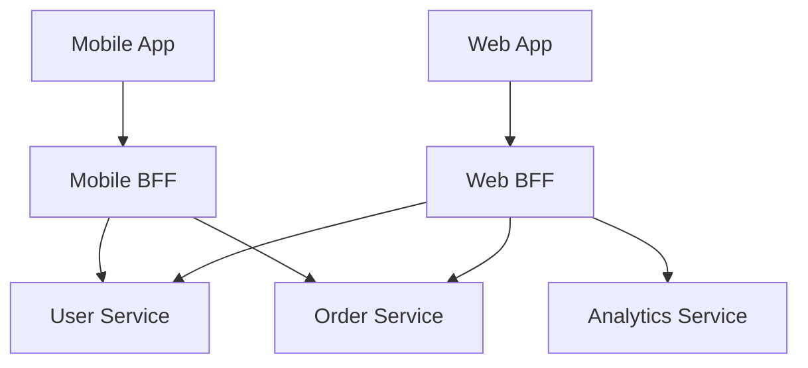

# API Design at Scale — Junior Interview Questions

> **Collection:** [System Design](../README.md) · **Level:** Junior · **Section 11 of 42**
> **Goal:** Confirm you can describe the shapes an API takes at scale — gateway, REST,
> GraphQL federation, gRPC, BFF — and the cross-cutting concerns every public API must
> solve: versioning, pagination, idempotency, and reliable event delivery.

A "junior" answer here is not a shallow answer — it is a *correct, concrete, and
honest* one. Interviewers at this level want to know that you understand the API as a
*contract* between teams and systems, that you reach for real HTTP semantics and real
products as examples, and that you don't bluff about the hard parts (retries,
idempotency, deprecation). Each question lists **what the interviewer is really
probing**, a **model answer**, and often a **follow-up** they will ask next.

---

## Contents

1. [API Gateway](#1-api-gateway)
2. [REST Design at Scale](#2-rest-design-at-scale)
3. [GraphQL Federation](#3-graphql-federation)
4. [gRPC & Streaming](#4-grpc--streaming)
5. [Versioning & Deprecation](#5-versioning--deprecation)
6. [Pagination & Filtering](#6-pagination--filtering)
7. [Idempotency & Retries](#7-idempotency--retries)
8. [Webhooks](#8-webhooks)
9. [Backends for Frontend (BFF)](#9-backends-for-frontend-bff)
10. [Rapid-Fire Self-Check](#10-rapid-fire-self-check)

---

## 1. API Gateway

### Q1.1 — What is an API gateway, and what problems does it solve?

**Probing:** Do you see it as a *single front door* that absorbs cross-cutting concerns?

**Model answer:** An API gateway is a server that sits between clients and your
backend services and acts as the single entry point for all API traffic. It does three
broad jobs. **Routing** — it maps an incoming path like `/orders/42` to whichever
service owns orders, so clients never need to know your internal topology. **Aggregation**
— it can fan one client request out to several services and combine the responses, so a
mobile screen makes *one* call instead of five. **Offloading** — it handles the
cross-cutting concerns you don't want duplicated in every service: TLS termination,
authentication, rate limiting, request logging, and caching.



**Follow-up:** *"Isn't the gateway a single point of failure?"* → Yes, which is why you
run several gateway instances behind a load balancer and keep them stateless; the
gateway is a *logical* single front door, not a single machine.

### Q1.2 — Give a concrete example of gateway aggregation.

**Probing:** Can you connect aggregation to a real screen?

**Model answer:** A mobile product page needs the product details, the price, the
inventory count, and the top reviews — owned by four different services. Without a
gateway, the phone makes four calls over a slow mobile network. With aggregation, the
phone makes one call to `GET /product-page/42`; the gateway (or a BFF behind it) fans
out to the four services in parallel and returns one combined JSON payload. That cuts
round trips, which is the dominant cost on mobile.

### Q1.3 — Name two things a gateway should *not* do.

**Probing:** Awareness that gateways become a dumping ground if undisciplined.

**Model answer:** It should not contain **business logic** — pricing rules, order
validation, and the like belong in the owning service, or the gateway becomes a fragile
monolith every team must coordinate on. And it should not hold **per-user session
state**, because that breaks horizontal scaling; keep gateways stateless and push state
to a shared store or token.

---

## 2. REST Design at Scale

### Q2.1 — What makes an API "RESTful," in practice?

**Probing:** Resource-and-verb thinking, not just "it returns JSON."

**Model answer:** REST models the API as **resources** (nouns) identified by URLs, and
uses HTTP **methods** (verbs) to act on them: `GET /orders/42` reads, `POST /orders`
creates, `PUT`/`PATCH` updates, `DELETE` removes. You lean on HTTP itself — status
codes (`200`, `201`, `404`, `409`), headers (`Cache-Control`, `ETag`), and
statelessness so any server can handle any request. A common junior mistake is putting
verbs in the URL (`/getOrder?id=42`); the verb should be the HTTP method, and the URL
should name the resource.

### Q2.2 — Which HTTP methods are safe and which are idempotent, and why does it matter at scale?

**Probing:** Connecting HTTP semantics to retry behavior.

**Model answer:**

| Method | Safe (no side effects) | Idempotent (repeat = same result) |
|---|---|---|
| `GET` | ✅ | ✅ |
| `PUT` | ❌ | ✅ |
| `DELETE` | ❌ | ✅ |
| `POST` | ❌ | ❌ |

It matters because at scale, clients, load balancers, and proxies **retry** failed
requests. Safe and idempotent methods can be retried freely. `POST` is neither — a
retried "create order" can create two orders — which is exactly why we add idempotency
keys (see §7).

**Follow-up:** *"What status code for a duplicate create you reject?"* → `409 Conflict`,
or `200`/`201` returning the already-created resource if you deduplicated it.

### Q2.3 — How do you keep a REST response small and cacheable for a high-traffic endpoint?

**Probing:** Practical scale concerns: payload size and caching.

**Model answer:** Return only the fields the caller needs (support sparse fieldsets like
`?fields=id,name`), paginate list endpoints instead of returning everything, and set
HTTP caching headers — `Cache-Control: max-age=…` for things that rarely change and
`ETag` + `If-None-Match` so unchanged resources return a cheap `304 Not Modified`. A
cacheable `GET` lets a CDN or the gateway answer most requests without ever touching
your service.

---

## 3. GraphQL Federation

### Q3.1 — What is GraphQL, in one breath, and how does it differ from REST?

**Probing:** Do you know the core trade-off — one flexible query vs many fixed endpoints?

**Model answer:** GraphQL exposes a single endpoint and a typed schema; the client sends
a query describing *exactly* the fields it wants and gets back exactly that shape. This
solves REST's **over-fetching** (a screen downloads fields it ignores) and
**under-fetching** (a screen must call three endpoints to assemble one view). The cost
is more server complexity — resolvers, query-cost limits, and weaker HTTP caching,
since most queries are `POST`s to one URL.

### Q3.2 — What problem does GraphQL *federation* solve?

**Probing:** Do you understand it lets many teams own one graph?

**Model answer:** As an org grows you don't want a single giant GraphQL server that every
team must edit. Federation lets each team run its own **subgraph** (Users, Products,
Reviews), and a **gateway** composes them into one unified graph the client sees. A
`User` type can be defined in the Users subgraph and *extended* with a `reviews` field
in the Reviews subgraph; the gateway plans the query, calls each subgraph for its part,
and stitches the result. It gives clients one schema while letting teams ship
independently.

```mermaid
graph TD
    Cl[Client] --> G[Federation Gateway]
    G --> SU[Users subgraph]
    G --> SP[Products subgraph]
    G --> SR[Reviews subgraph]
    SR -.extends User.type.-> SU
```

**Follow-up:** *"What's the risk?"* → One expensive query can fan out across many
subgraphs, so you need query-cost analysis and depth limits to stop a single client from
overloading the whole graph.

### Q3.3 — What is the N+1 problem in GraphQL and how is it mitigated?

**Probing:** Awareness of the classic resolver pitfall.

**Model answer:** If you ask for 50 posts and each post's author, a naive resolver
fetches the 50 posts (1 query) then makes one author query per post (50 queries) — N+1.
The fix is a **DataLoader**: it batches the 50 author lookups into a single
`WHERE id IN (…)` query and caches within the request, turning 51 queries into 2.

---

## 4. gRPC & Streaming

### Q4.1 — What is gRPC and when would you choose it over REST?

**Probing:** Knowing it's for service-to-service, binary, contract-first.

**Model answer:** gRPC is an RPC framework that uses **Protocol Buffers** (a compact
binary format) over **HTTP/2**. You define the service and messages in a `.proto` file,
and code is generated for both client and server, so the contract is strongly typed.
Compared to REST/JSON it's faster and smaller on the wire, and HTTP/2 multiplexing lets
many calls share one connection. You choose it for **internal service-to-service**
communication where performance and a strict contract matter. You usually keep REST or
GraphQL at the public edge, because gRPC isn't natively callable from a browser without
a proxy.

### Q4.2 — gRPC supports streaming. What are the four call types?

**Probing:** Vocabulary for the streaming modes.

**Model answer:**

| Type | Shape | Example |
|---|---|---|
| Unary | 1 request → 1 response | `GetUser(id)` |
| Server-streaming | 1 request → stream of responses | live price feed for one symbol |
| Client-streaming | stream of requests → 1 response | upload chunks, get one summary |
| Bidirectional | stream ↔ stream | a chat / real-time collaboration session |

Streaming uses HTTP/2's long-lived connection, so the server can keep pushing messages
without the client re-polling.

**Follow-up:** *"Browser can't speak gRPC directly — what do you do?"* → Put gRPC-Web or
a REST/JSON gateway in front, translating browser calls into gRPC behind the edge.

---

## 5. Versioning & Deprecation

### Q5.1 — Why version an API at all, and what's a breaking change?

**Probing:** Understanding the API is a contract you can't silently break.

**Model answer:** Once external clients depend on your API, you can't change it freely —
some change will break someone. A **breaking change** removes or renames a field,
changes a type, makes an optional field required, or changes the meaning of a response.
Versioning lets old clients keep using the old contract while new clients adopt the new
one. **Non-breaking** changes — *adding* an optional field or a new endpoint — usually
don't need a new version.

### Q5.2 — Compare the common versioning strategies.

**Probing:** Knowing the menu and its trade-offs.

**Model answer:**

| Strategy | Example | Pros | Cons |
|---|---|---|---|
| URI path | `/v2/orders` | Obvious, easy to route & cache | Clutters URLs; "version" leaks into resource identity |
| Query param | `/orders?version=2` | Simple to add | Easy to forget; messes with caching |
| Header | `Accept: application/vnd.api.v2+json` | Clean URLs | Invisible; harder to test by hand |

URI-path versioning is the most common because it's explicit and a gateway/CDN can route
and cache on it. The principle that matters more than the mechanism: pick one and be
consistent.

### Q5.3 — How do you deprecate an API version responsibly?

**Probing:** Process maturity, not just a flag flip.

**Model answer:** Announce it, give a long timeline, and warn in-band. Concretely:
(1) publish the deprecation and a migration guide, (2) add a `Deprecation` /`Sunset`
response header (or warning field) so clients see it programmatically, (3) monitor who's
still calling the old version, (4) reach out to the heaviest remaining callers, and only
then (5) shut it off after the sunset date. The cardinal rule is **never remove a
version with no notice** — you'll break production for your consumers.

---

## 6. Pagination & Filtering

### Q6.1 — Why can't a list endpoint just return everything?

**Probing:** The basic scale instinct.

**Model answer:** A `GET /orders` that returns all orders works with 100 rows and falls
over at 10 million: it's a huge payload, a slow query, and a memory spike on both server
and client. Paginate — return a bounded page (say 50 items) plus a way to get the next
page. The two common approaches are offset-based and cursor-based.

### Q6.2 — Offset vs cursor pagination — compare them.

**Probing:** The single most-tested pagination question.

**Model answer:**

| | Offset (`?page=3&limit=50`) | Cursor (`?after=eyJpZCI6MTIzfQ`) |
|---|---|---|
| How | `LIMIT 50 OFFSET 100` | `WHERE id > :cursor LIMIT 50` |
| Deep pages | Slow — DB still scans skipped rows | Fast — indexed seek, constant cost |
| Stability | Items shift if rows are inserted/deleted → skips & dupes | Stable — anchored to a row, not a position |
| Jump to page N | Easy | Not supported (next/prev only) |
| Best for | Small datasets, page-number UIs | Large, frequently-changing feeds |

The headline: **offset is simple but degrades and double-counts on large, changing
data; cursor is stable and fast but only moves forward/back.** Infinite-scroll feeds use
cursors.



### Q6.3 — How should filtering and sorting be exposed?

**Probing:** Clean, safe query design.

**Model answer:** Use query parameters: `?status=shipped&sort=-created_at`. Whitelist
the fields a client may filter and sort on — never pass raw user input into a query —
and make sure those fields are **indexed**, or filtering just hides a full table scan.
Combine filtering with pagination so a filtered result set is still bounded.

---

## 7. Idempotency & Retries

### Q7.1 — What does idempotency mean, and why does it matter for APIs?

**Probing:** The core reliability concept for writes.

**Model answer:** An operation is **idempotent** if doing it once and doing it many times
have the same effect. It matters because networks are unreliable: a client sends "create
payment," the server processes it, but the response is lost, so the client retries — and
without protection, the customer is charged twice. Idempotency lets the *same* request be
safely retried without duplicating its effect.

### Q7.2 — How do you make a `POST` idempotent?

**Probing:** Knowing the idempotency-key pattern concretely.

**Model answer:** The client generates a unique **idempotency key** (a UUID) and sends it
in a header: `Idempotency-Key: 9b2c…`. On first receipt the server processes the request,
stores the result keyed by that value, and returns it. If the *same* key arrives again,
the server detects it and returns the stored result instead of processing again. So a
retry returns the original outcome — one order, one charge. Stripe's API is the textbook
example.



### Q7.3 — How should a client retry, so it doesn't make things worse?

**Probing:** Awareness that naive retries cause retry storms.

**Model answer:** Retry only on transient failures (network errors, `503`, `429`), not on
`400`/`404`. Use **exponential backoff** — wait 1s, 2s, 4s — and add **jitter** (a small
random offset) so thousands of clients don't all retry in lockstep and hammer a
recovering service. Cap the number of retries. And combine retries with idempotency keys
so the retried write is safe.

---

## 8. Webhooks

### Q8.1 — What is a webhook and when do you use one instead of polling?

**Probing:** Push vs pull intuition.

**Model answer:** A webhook is a **reverse API call**: instead of the client repeatedly
polling "is it done yet?", the provider calls *you* — an HTTP `POST` to a URL you
registered — when an event happens (e.g., "payment.succeeded"). It's push, not pull. You
use it when a client wants near-real-time notification of events without wasting requests
polling. Payment providers, GitHub, and Slack all deliver events this way.

### Q8.2 — How does the receiver verify a webhook is genuine?

**Probing:** Security awareness — webhook endpoints are public.

**Model answer:** Your webhook URL is reachable by anyone, so you can't trust the payload
on its face. The provider signs each request — typically an HMAC of the body using a
shared secret — and sends the signature in a header (e.g., `X-Signature`). You recompute
the HMAC over the received body with your copy of the secret and compare; if they don't
match, you reject it. This proves the request came from the provider and wasn't tampered
with.

**Follow-up:** *"What else?"* → Include a timestamp in the signed payload and reject old
ones to prevent replay attacks.

### Q8.3 — What makes webhook *delivery* reliable?

**Probing:** Understanding that the network drops events.

**Model answer:** The provider must **retry** failed deliveries with backoff (your
endpoint might be briefly down), so the receiver must be **idempotent** — each event
carries a unique ID and you ignore duplicates. The receiver should also respond fast
(just `200` and enqueue the work) so it doesn't time out, and providers usually give a
dashboard plus a dead-letter mechanism for events that fail every retry.

---

## 9. Backends for Frontend (BFF)

### Q9.1 — What is the BFF pattern and what problem does it solve?

**Probing:** Why one API can't serve all clients equally well.

**Model answer:** A **Backend for Frontend** is a dedicated backend tailored to one
client type — one for the mobile app, one for the web app — instead of every client
sharing one general-purpose API. Different clients have different needs: mobile wants
small, aggregated payloads to save bandwidth and battery; the web dashboard wants richer,
denser data. A BFF lets each frontend get a response shaped exactly for it, doing the
aggregation and trimming server-side, so the client stays simple.



### Q9.2 — How is a BFF different from an API gateway?

**Probing:** Don't conflate two adjacent patterns.

**Model answer:** A gateway is **generic** — one shared front door handling routing,
auth, and rate limiting for all traffic. A BFF is **client-specific** — it contains
presentation logic for *one* frontend and decides which services to call and how to
shape the response for that client. They coexist: the gateway handles cross-cutting
concerns at the edge; behind it, each BFF assembles the experience for its frontend.

### Q9.3 — What's the main downside of BFFs?

**Probing:** Honest trade-off awareness.

**Model answer:** **Duplication and ownership cost.** Each BFF is another service to
build, deploy, and maintain, and shared logic can drift across them (the mobile and web
BFFs both reimplement the same aggregation). The fix is to keep BFFs thin — only
client-specific shaping — and push genuinely shared logic down into the underlying
services or a shared library. BFFs pay off when client needs truly diverge; for one
client type, they're overkill.

---

## 10. Rapid-Fire Self-Check

If you can answer each of these in a sentence, you're ready for the junior bar on this section:

- [ ] Name the three jobs of an API gateway. *(routing, aggregation, offloading)*
- [ ] Which HTTP methods are idempotent? *(GET, PUT, DELETE — not POST)*
- [ ] What does GraphQL federation let you do? *(many teams own subgraphs of one graph)*
- [ ] When pick gRPC over REST? *(internal, performance-critical, contract-first)*
- [ ] What's a breaking change, and which versioning style is most common? *(remove/rename a field; URI path)*
- [ ] Offset vs cursor pagination — which is stable on changing data? *(cursor)*
- [ ] How do you make a POST idempotent? *(idempotency key + stored result)*
- [ ] How does a receiver verify a webhook? *(HMAC signature with a shared secret)*
- [ ] BFF vs gateway — what's the difference? *(client-specific shaping vs generic front door)*

---

**Next step:** Section 12 — [Databases](12-databases.md): relational vs NoSQL, indexing, and choosing a store.
