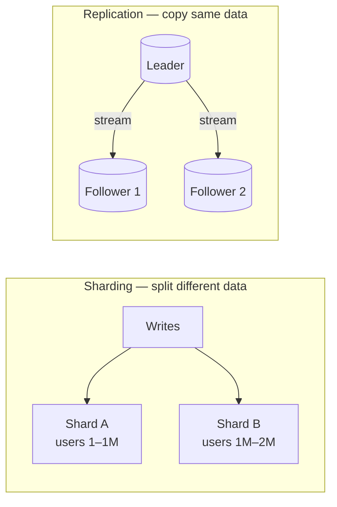
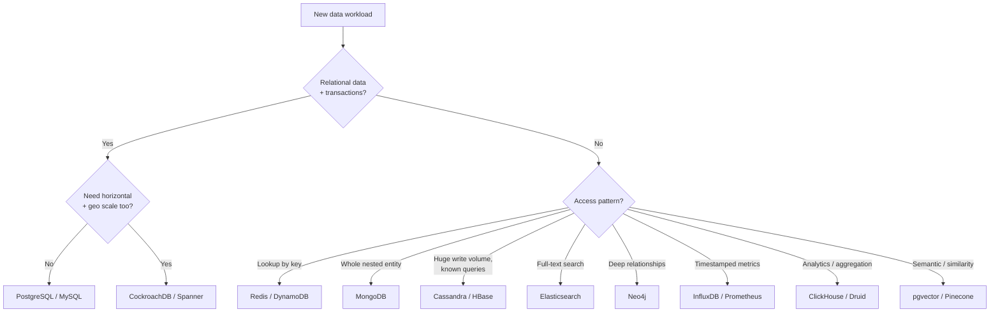

# Databases — Junior Interview Questions

> **Collection:** [System Design](../README.md) · **Level:** Junior · **Section 12 of 42**
> **Goal:** Recognize the major database families by their data model and access
> pattern, name a real product for each, and reason about the cross-cutting concerns —
> replication, sharding, indexing, transactions, normalization — that decide whether a
> chosen store actually holds up in production.

This is a large section because "the database" is usually the part of a system design
that is hardest to change later. A junior answer here is not memorized trivia; it is the
ability to say *which family fits a workload and why*, back it with a concrete product,
and explain the one or two trade-offs that come with the choice. Each question lists
**what the interviewer is really probing**, a **model answer**, and often a **follow-up**.

---

## Contents

1. [Relational (RDBMS)](#1-relational-rdbms)
2. [Key-Value](#2-key-value)
3. [Document](#3-document)
4. [Wide-Column](#4-wide-column)
5. [Column-Oriented (OLAP)](#5-column-oriented-olap)
6. [Graph](#6-graph)
7. [Time-Series](#7-time-series)
8. [Search Engine](#8-search-engine)
9. [Vector](#9-vector)
10. [NewSQL / Distributed SQL](#10-newsql--distributed-sql)
11. [Replication](#11-replication)
12. [Sharding & Partitioning](#12-sharding--partitioning)
13. [Indexing](#13-indexing)
14. [Transactions & Isolation](#14-transactions--isolation)
15. [Denormalization](#15-denormalization)
16. [SQL Tuning](#16-sql-tuning)
17. [SQL vs NoSQL](#17-sql-vs-nosql)
18. [OLTP vs OLAP](#18-oltp-vs-olap)
19. [Polyglot Persistence](#19-polyglot-persistence)
20. [Choosing a Database](#20-choosing-a-database)
21. [Rapid-Fire Self-Check](#21-rapid-fire-self-check)

---

## 1. Relational (RDBMS)

### Q1.1 — What defines a relational database, and when is it the right default?

**Probing:** Do you know *why* RDBMS is the sane starting point for most systems?

**Model answer:** A relational database stores data as **tables of rows and columns**
with a fixed schema, links tables through **foreign keys**, and is queried with **SQL**.
Its defining strengths are **ACID transactions** (correctness under concurrency) and
**joins** (combining related data on the fly). **PostgreSQL** and **MySQL** are the
canonical examples. It's the right default whenever your data is naturally structured
and relational — users, orders, payments — and you need strong consistency. The honest
rule of thumb: *start with PostgreSQL and move off it only when a measured limit forces
you to*, not because NoSQL sounds modern.

**Follow-up:** *"PostgreSQL or MySQL?"* → Both are excellent. PostgreSQL leans richer
(JSONB, extensions, stricter standards compliance); MySQL leans simpler and historically
faster on basic read-heavy workloads. For a greenfield project either is defensible;
PostgreSQL is the common modern default.

---

## 2. Key-Value

### Q2.1 — What is a key-value store, and what is it best at?

**Probing:** Do you understand the trade: blazing simple access in exchange for no rich queries?

**Model answer:** A key-value store maps an opaque **key directly to a value**, like a
giant distributed hash map. You get **O(1)-style lookups by key** and almost nothing
else — no joins, limited or no querying *inside* the value. That constraint is exactly
what makes it fast and easy to scale horizontally. **Redis** is the in-memory example,
used for caching, sessions, rate-limit counters, and leaderboards; **DynamoDB** is the
managed, disk-backed example for high-scale, predictable-latency lookups. Reach for it
when your access pattern is "give me the value for *this exact key*, fast."

**Follow-up:** *"Redis vs DynamoDB?"* → Redis is primarily an in-memory data structure
server (sub-millisecond, can lose data on crash unless persistence is tuned); DynamoDB
is a durable, fully managed store that scales to huge datasets with single-digit-ms
latency. Redis for ephemeral hot data; DynamoDB for durable key-addressed data at scale.

---

## 3. Document

### Q3.1 — What is a document database, and what problem does it solve?

**Probing:** Do you connect "flexible schema" to a real benefit, not just buzz?

**Model answer:** A document database stores semi-structured **documents** (typically
JSON/BSON), where each document is a self-contained nested object. **MongoDB** is the
flagship. The win is a **flexible schema** and **locality**: an entire entity — a user
with their addresses and preferences — lives in one document, so reading it is one fetch
with no joins. It fits use cases where the shape varies between records or evolves often
(product catalogs, content management, user profiles), and where you usually read a whole
entity at once. The cost is weaker support for cross-document relationships and the
discipline you must impose yourself, since the database won't enforce a schema for you.

**Follow-up:** *"When does the document model bite you?"* → When data is highly relational
and you start embedding the same entity in many documents, updates become a fan-out
nightmare. At that point you're fighting the model and a relational store fits better.

---

## 4. Wide-Column

### Q4.1 — What is a wide-column store, and what workload is it built for?

**Probing:** Can you distinguish it from both relational tables and key-value?

**Model answer:** A wide-column store organizes data by **row key → column families**,
where different rows can hold different columns, and it is designed for **massive write
throughput and horizontal scale across many nodes**. **Cassandra** (and **HBase**,
**Bigtable**) are the examples. The mental model is "a distributed, sorted map of maps."
You design the schema **around your queries** — partition key and clustering columns are
chosen so the rows you read together live together — because there are no flexible joins.
It shines for write-heavy, always-on workloads at scale: time-stamped event data,
messaging history, IoT telemetry, large feeds.

**Follow-up:** *"What's the catch?"* → You must know your query patterns up front. Get
the partition key wrong and you can't fix it with an index later — you re-model. Wide-column
trades ad-hoc query flexibility for scale and write speed.

---

## 5. Column-Oriented (OLAP)

### Q5.1 — What does "column-oriented" mean, and why is it fast for analytics?

**Probing:** Do you grasp the storage-layout reason, not just the label?

**Model answer:** A column-oriented database stores each **column contiguously on disk**
instead of storing whole rows together. Analytical queries usually touch a **few columns
across millions of rows** (e.g., `SUM(revenue) GROUP BY country`). With columnar storage
you read only those columns, and because values in a column are similar they **compress
extremely well**, slashing the bytes scanned. **ClickHouse** and **Druid** are the
examples, purpose-built for OLAP dashboards and aggregations over huge datasets. The
trade-off: they're terrible at the OLTP pattern of reading or updating single full rows,
which is exactly what row-stores like PostgreSQL are good at.

---

## 6. Graph

### Q6.1 — When would you reach for a graph database instead of joins in SQL?

**Probing:** Do you recognize the specific shape (deep, variable-depth relationships)?

**Model answer:** A graph database stores data as **nodes and edges (relationships)** as
first-class citizens, and traversing relationships is its core operation. **Neo4j** is
the flagship, queried with Cypher. You reach for it when relationships *are the data* and
queries are **deep or variable-depth traversals**: "friends of friends of friends,"
fraud rings, recommendation paths, dependency graphs. In a relational store such a query
becomes a chain of self-joins that gets exponentially slower with depth; a graph engine
walks edges directly. If your relationships are shallow and fixed, plain SQL is simpler
and you don't need a graph database.

---

## 7. Time-Series

### Q7.1 — What is a time-series database optimized for?

**Probing:** Do you see that the access pattern (append-only, time-ranged) drives the design?

**Model answer:** A time-series database is optimized for data that is **timestamped,
mostly append-only, and queried by time range** — metrics, sensor readings, monitoring
data. **InfluxDB** and **Prometheus** are the examples. They exploit the workload:
near-pure inserts ordered by time, heavy use of **downsampling and retention policies**
(keep raw data for a week, roll up to hourly averages after that), and time-bucketed
aggregations. **Prometheus** specifically is a pull-based monitoring system that scrapes
metrics and is the standard in the Kubernetes/observability world. You *could* store
metrics in PostgreSQL, but a purpose-built TSDB handles the volume and retention far more
efficiently.

---

## 8. Search Engine

### Q8.1 — Why use a search engine like Elasticsearch instead of `LIKE '%term%'` in SQL?

**Probing:** Do you understand full-text search is a different problem with a different index?

**Model answer:** A SQL `LIKE '%term%'` does a slow full scan and can't rank, stem, or
handle typos. A search engine like **Elasticsearch** builds an **inverted index** —
mapping each term to the documents containing it — so it can do **full-text search,
relevance ranking, fuzzy matching, and faceting** in milliseconds over huge corpora.
It's the right tool for search bars, log search, and product catalogs where users type
free text. The pattern in practice: keep the **source of truth in your primary database**
and **sync a copy into Elasticsearch** for searching, accepting that the search index is
eventually consistent with the database.

---

## 9. Vector

### Q9.1 — What is a vector database, and why has it become common?

**Probing:** Can you connect it to embeddings / semantic search without hand-waving?

**Model answer:** A vector database stores high-dimensional **embedding vectors** —
numerical representations of text, images, or audio produced by an ML model — and finds
the **nearest neighbors** to a query vector by similarity. That enables **semantic
search** ("find things that *mean* something similar," not just keyword matches) and is
the retrieval backbone of RAG (retrieval-augmented generation) for LLM applications.
**pgvector** is a PostgreSQL extension that adds vector search to a database you already
run; **Pinecone** is a managed, purpose-built vector service for scale. The core
operation is approximate nearest-neighbor (ANN) search, which trades a little accuracy
for huge speed at high dimensions.

**Follow-up:** *"pgvector or Pinecone?"* → If your data already lives in PostgreSQL and
volumes are moderate, pgvector avoids running a second system. At very large scale or
when you want vector search as a managed concern, a dedicated store like Pinecone earns
its keep.

---

## 10. NewSQL / Distributed SQL

### Q10.1 — What problem does NewSQL / distributed SQL solve?

**Probing:** Do you see it as "have your cake and eat it" — SQL + ACID + horizontal scale?

**Model answer:** Classic SQL databases give you ACID and joins but scale *up* (one
node) far more easily than *out*. Classic NoSQL scales out but historically gave up
transactions and SQL. **NewSQL / distributed SQL** aims to provide **the relational model,
SQL, and ACID transactions while scaling horizontally across many nodes** and surviving
node and region failures. **CockroachDB** and Google **Spanner** are the examples;
Spanner famously uses synchronized clocks (TrueTime) to offer globally consistent
transactions. You reach for it when you genuinely need both strong consistency and
horizontal/geo scale — and accept the higher operational complexity and cost over a
single PostgreSQL.

---

## 11. Replication

### Q11.1 — What is replication and why do we do it?

**Probing:** Do you separate the *reasons* (availability, read scale, locality)?

**Model answer:** Replication keeps **copies of the same data on multiple machines**. We
do it for three reasons: **high availability** (if the primary dies, a replica takes
over), **read scalability** (spread reads across replicas), and **locality** (a replica
near users cuts latency). The common pattern is **leader–follower** (also primary–replica):
all **writes** go to the leader, which streams changes to **followers** that serve
**reads**. The catch is **replication lag** — a follower can be a few milliseconds (or
more) behind, so a read right after a write may return stale data.

**Follow-up:** *"Sync vs async replication?"* → **Synchronous**: the leader waits for a
replica to confirm before acknowledging the write — safer (no data loss on failover) but
slower. **Asynchronous**: the leader acknowledges immediately — faster but you can lose
the last few writes if it crashes before they replicate. Most systems use async, often
with one synchronous replica as a compromise.

---

## 12. Sharding & Partitioning

### Q12.1 — What is sharding, and how is it different from replication?

**Probing:** The classic confusion — do you keep "copies" vs "splits" straight?

**Model answer:** **Replication copies the *same* data to many nodes; sharding splits
*different* data across nodes.** Sharding (horizontal partitioning) divides one large
dataset into pieces — shards — by a **shard key**, so each node holds only a subset. You
shard when a single machine can no longer hold the data or serve the write volume. They're
complementary: real systems **shard for capacity and replicate each shard for
availability**. The hard part is choosing the shard key: it must spread load **evenly**
(avoid hot shards) and match your access pattern so common queries hit one shard, not all.

**Follow-up:** *"Why is sharding a last resort?"* → It adds real pain: cross-shard joins
and transactions become hard, re-sharding is expensive, and a bad shard key causes
hotspots. Exhaust replication, caching, and a bigger box first.

---

## 13. Indexing

### Q13.1 — What is a database index, and what does it cost?

**Probing:** Do you know the read/write trade and not treat indexes as free magic?

**Model answer:** An index is a **separate sorted data structure** (usually a **B-tree**)
that lets the database find rows by a column's value **without scanning the whole table** —
turning an O(n) scan into an O(log n) lookup. It's the single biggest lever for query
speed. But indexes aren't free: each one **takes storage** and must be **updated on every
insert/update/delete**, which slows writes. So you index the columns you **filter, join,
and sort on**, and you *don't* index everything. The classic interview line: *an index
makes reads faster and writes slower.*

**Follow-up:** *"What's a composite index, and does column order matter?"* → A composite
index covers multiple columns; **order matters**. An index on `(country, city)` can serve
queries filtering on `country` (or `country` + `city`), but **not** queries filtering on
`city` alone — like a phone book sorted by last name then first name.

---

## 14. Transactions & Isolation

### Q14.1 — What does ACID stand for, in one line each?

**Probing:** Foundational vocabulary — can you define all four without bluffing?

**Model answer:**
- **Atomicity** — all operations in a transaction succeed or none do (no half-applied transfer).
- **Consistency** — the transaction moves the database from one valid state to another, respecting all constraints.
- **Isolation** — concurrent transactions don't step on each other; the result is as if they ran in some serial order.
- **Durability** — once committed, the data survives crashes (it's persisted, not just in memory).

The canonical example is a bank transfer: debit one account and credit another must be
**atomic** (never just one side) and **durable** (survive a crash right after commit).

### Q14.2 — Name the standard isolation levels and the anomaly each prevents.

**Probing:** Do you understand isolation is a tunable spectrum trading correctness for speed?

**Model answer:** Lower isolation is faster but allows more anomalies; higher isolation
is safer but costs concurrency.

| Isolation level | Dirty read | Non-repeatable read | Phantom read |
|---|---|---|---|
| **Read Uncommitted** | ✅ possible | ✅ possible | ✅ possible |
| **Read Committed** | ❌ prevented | ✅ possible | ✅ possible |
| **Repeatable Read** | ❌ prevented | ❌ prevented | ✅ possible* |
| **Serializable** | ❌ prevented | ❌ prevented | ❌ prevented |

- **Dirty read** — reading another transaction's uncommitted change.
- **Non-repeatable read** — re-reading the same row gives a different value mid-transaction.
- **Phantom read** — re-running the same query returns new rows that appeared.

(*PostgreSQL's Repeatable Read also blocks phantoms.) Most databases default to **Read
Committed**; you raise the level only where correctness demands it, because higher
isolation reduces concurrency.

---

## 15. Denormalization

### Q15.1 — What is denormalization, and when is it worth it?

**Probing:** Do you frame it as a *deliberate* read-speed-for-write-complexity trade?

**Model answer:** **Normalization** stores each fact once and joins to assemble data, which
keeps it consistent but makes reads do work. **Denormalization** is the deliberate opposite:
**duplicating data** (e.g., storing the author's name on every post, not just an author ID)
so common reads need **fewer or no joins**. It's worth it on **read-heavy** paths where joins
are the bottleneck — you trade extra storage and the burden of **keeping copies in sync on
write** for faster reads. The rule: **normalize by default for correctness; denormalize
deliberately, with measurements, where read performance demands it.** NoSQL stores often bake
denormalization in because they can't join.

---

## 16. SQL Tuning

### Q16.1 — A query is slow. What are your first moves?

**Probing:** Do you reach for `EXPLAIN` and indexes before rewriting blindly?

**Model answer:** First, **measure, don't guess**: run **`EXPLAIN`/`EXPLAIN ANALYZE`** to
see the query plan and find the expensive step — usually a **full table scan** (a "Seq
Scan") where an index lookup should be. The most common fixes, in order: **(1) add a
missing index** on the columns being filtered, joined, or sorted; **(2)** select only the
columns you need instead of `SELECT *`; **(3)** fix the **N+1 query** pattern (one query
that triggers a query per row — batch it into a join or an `IN` clause); **(4)** reduce
rows scanned with better `WHERE` predicates or pagination. The discipline is to let the
query plan tell you where the time goes before changing anything.

**Follow-up:** *"What is the N+1 problem?"* → Fetching a list (1 query), then issuing one
extra query per item to load related data (N queries). It's a top cause of slow apps; the
fix is a single join or batched fetch.

---

## 17. SQL vs NoSQL

### Q17.1 — When would you choose NoSQL over SQL — and when not to?

**Probing:** Can you reason about trade-offs instead of declaring one "better"?

**Model answer:** Neither is universally better; they fit different needs.

| | SQL (relational) | NoSQL (KV / document / wide-column) |
|---|---|---|
| **Schema** | Fixed, enforced | Flexible / schema-on-read |
| **Best for** | Structured, relational data; transactions | Huge scale, flexible shapes, simple access patterns |
| **Queries** | Rich joins, ad-hoc SQL | Limited; designed around known queries |
| **Consistency** | Strong (ACID) | Often eventual / tunable |
| **Scaling** | Mainly vertical (then sharding) | Horizontal by design |
| **Examples** | PostgreSQL, MySQL | Redis, DynamoDB, MongoDB, Cassandra |

Choose **SQL** when data is relational and you need transactions and ad-hoc queries — the
right default for most apps. Choose **NoSQL** when you have a clear, simple access pattern
at very large scale, a flexible/evolving shape, or write volumes a single relational node
can't take. The trap is reaching for NoSQL for "scale" you don't have yet and losing joins
and transactions you actually need.

---

## 18. OLTP vs OLAP

### Q18.1 — Distinguish OLTP from OLAP.

**Probing:** Do you see these as two workloads needing two kinds of stores?

**Model answer:** **OLTP** (Online Transaction Processing) is the **operational** workload:
many small, fast reads and writes touching **a few rows** — placing an order, updating a
profile. It wants **row-oriented** stores like **PostgreSQL/MySQL**. **OLAP** (Online
Analytical Processing) is the **analytical** workload: a few large queries that **aggregate
millions of rows** for reports and dashboards. It wants **column-oriented** stores like
**ClickHouse**. You don't run heavy analytics on your production OLTP database because the
big scans compete with live traffic; instead you **ETL/stream** data into a separate
analytics store (a data warehouse) tuned for OLAP.

| | OLTP | OLAP |
|---|---|---|
| **Pattern** | Many small reads/writes | Few large aggregations |
| **Rows touched** | A handful | Millions |
| **Storage** | Row-oriented | Column-oriented |
| **Example** | PostgreSQL | ClickHouse |

---

## 19. Polyglot Persistence

### Q19.1 — What is polyglot persistence?

**Probing:** Do you accept that one system often needs several databases — and why?

**Model answer:** **Polyglot persistence** means using **different databases for different
jobs within one system**, choosing each for what it's best at rather than forcing
everything into a single store. A real e-commerce system might use **PostgreSQL** for
orders and payments (transactions), **Redis** for sessions and cache (speed),
**Elasticsearch** for product search (full-text), and **ClickHouse** for analytics
dashboards (OLAP). The benefit is the right tool per workload; the cost is **operational
complexity** — more systems to run, monitor, and keep in sync. So it's a deliberate trade,
not a default: add a specialized store when a workload clearly outgrows your primary
database, not before.

---

## 20. Choosing a Database

### Q20.1 — Walk me through how you'd choose a database for a new feature.

**Probing:** Can you turn requirements into a database family with a defensible reason?

**Model answer:** I start from the **workload, not the product list**. The key questions:
What's the **data shape** (relational, document, key-value, graph, time-series)? What are
the **access patterns** (lookup by key, ad-hoc joins, full-text, traversals, aggregations)?
What's the **scale** (gigabytes vs petabytes; reads vs writes)? What **consistency** does
correctness require? Then I map that to a family and a concrete product, and I **default to
PostgreSQL unless a requirement clearly pushes me off it** — because a relational store
covers most needs and is the cheapest to operate and reverse.

**Follow-up:** *"What if you're unsure?"* → Pick PostgreSQL. It handles relational,
JSON (JSONB), full-text search, and vectors (pgvector) reasonably well, so it buys you
time to learn the real access patterns before committing to a specialized store you can't
easily walk back.

---

## 21. Rapid-Fire Self-Check

If you can answer each of these in a sentence, you're ready for the junior bar on this section:

- [ ] What's the default database for most systems, and why? *(PostgreSQL/MySQL — relational + ACID)*
- [ ] Name a real product for each family: KV, document, wide-column, graph, time-series, search, vector.
- [ ] Replication vs sharding — copies vs splits? *(same data on many nodes vs different data on many nodes)*
- [ ] What does an index cost? *(storage + slower writes; faster reads)*
- [ ] ACID — what does each letter mean?
- [ ] Which isolation level prevents all of dirty/non-repeatable/phantom reads? *(Serializable)*
- [ ] Why denormalize, and what's the cost? *(faster reads; keeping copies in sync)*
- [ ] First move on a slow query? *(`EXPLAIN`, then add the missing index)*
- [ ] OLTP vs OLAP — row-store vs column-store? *(operational small ops vs analytical aggregations)*
- [ ] What is polyglot persistence, and what's its main cost? *(different DBs per job; operational complexity)*

---

**Next step:** Section 13 — [Storage Systems](13-storage-systems.md): how data actually
lands on disk — files, blocks, objects, and the storage engines beneath the databases.
