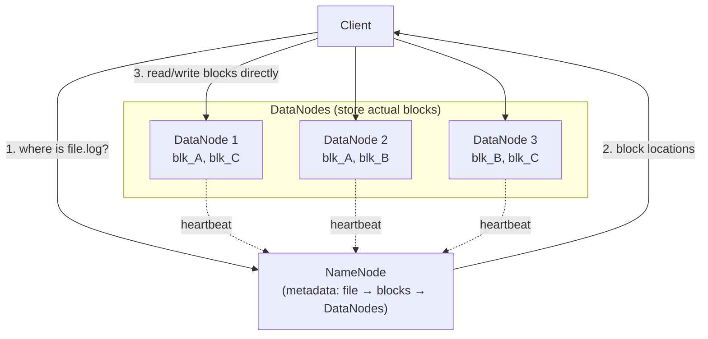
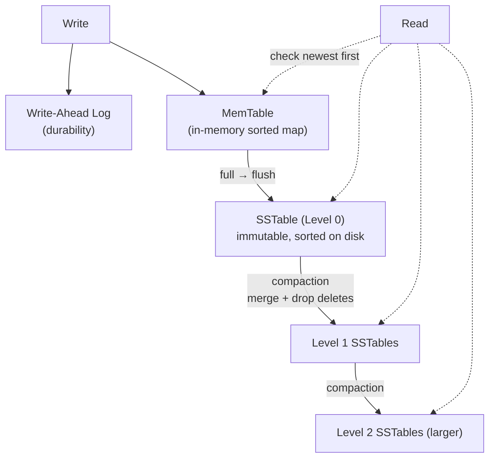

# Storage Systems — Junior Interview Questions

> **Collection:** [System Design](../README.md) · **Level:** Junior · **Section 13 of 42**
> **Goal:** Tell apart the three storage *shapes* (object, block, file), explain how
> the big distributed file systems and blob stores actually lay data out, reason about
> the LSM-tree vs B-tree trade-off that sits under every modern database, and know why
> data lakes use columnar file formats like Parquet.

Storage is where the bytes finally land, so a junior who can speak about it concretely
stands out fast. Interviewers here are checking that you don't treat "the database" as
a black box — that you know an S3 bucket is *not* a filesystem, that a write to RocksDB
does *not* hit the same structure a write to PostgreSQL does, and that you reach for
real products (S3, HDFS, RocksDB, Parquet) instead of hand-waving. Each question lists
**what the interviewer is really probing**, a **model answer**, and often a **follow-up**.

---

## Contents

1. [Object vs Block vs File Storage](#1-object-vs-block-vs-file-storage)
2. [Distributed File Systems (GFS, HDFS)](#2-distributed-file-systems-gfs-hdfs)
3. [Blob Storage (S3-like)](#3-blob-storage-s3-like)
4. [LSM-Trees vs B-Trees (RocksDB, LevelDB)](#4-lsm-trees-vs-b-trees-rocksdb-leveldb)
5. [Data Warehouse vs Data Lake](#5-data-warehouse-vs-data-lake)
6. [File Formats (Parquet, ORC, Iceberg)](#6-file-formats-parquet-orc-iceberg)
7. [Rapid-Fire Self-Check](#7-rapid-fire-self-check)

---

## 1. Object vs Block vs File Storage

### Q1.1 — What are the three kinds of storage, in one line each?

**Probing:** Do you know these are *different abstractions*, not just different vendors?

**Model answer:**
- **Block storage** hands you raw fixed-size blocks (sectors) with no notion of files;
  *you* (or a filesystem on top) decide what the bytes mean. This is what a disk or an
  AWS EBS volume looks like.
- **File storage** gives you a hierarchy of directories and files with names, paths, and
  metadata (permissions, timestamps), accessed through a filesystem protocol like NFS.
  This is a network drive or AWS EFS.
- **Object storage** gives you a flat keyspace of immutable *objects* (a blob of bytes +
  metadata) addressed by a key and reached over HTTP. This is Amazon S3.

The mental model: block = bytes, file = a tree of named bytes, object = a giant
key→blob dictionary you talk to over the network.

### Q1.2 — Compare them across the dimensions that matter.

**Probing:** Can you structure the trade-off instead of listing features randomly?

**Model answer:**

| Dimension | Block | File | Object |
|---|---|---|---|
| **Unit** | Fixed-size block / sector | File in a directory tree | Object (blob + metadata) under a key |
| **Access** | Low-level via OS / SCSI / iSCSI | Filesystem protocol (NFS, SMB) | HTTP API (`GET`/`PUT`/`DELETE`) |
| **Structure** | None (raw) | Hierarchical paths | Flat keyspace (no real folders) |
| **Mutable in place?** | Yes (random writes) | Yes | No — replace the whole object |
| **Typical example** | AWS EBS, a physical SSD | AWS EFS, NetApp/NFS | Amazon S3, GCS, Azure Blob |
| **Scales to** | One volume, one machine | A shared mount, limited | Effectively unlimited, internet-scale |
| **Good for** | Databases, OS disks | Shared documents, legacy apps | Images, video, backups, data lakes |

### Q1.3 — Why can't you run a high-performance database directly on object storage?

**Probing:** Understanding that object storage is immutable and high-latency.

**Model answer:** A database needs **low-latency random reads and in-place updates** —
flip a few bytes in the middle of a page, fsync, move on. Object storage gives you
neither: objects are **immutable** (to "edit" one you re-upload the whole thing) and
each operation is an **HTTP round trip of tens of milliseconds**, versus microseconds
for a local disk. So databases run on **block storage**, where random in-place writes
are cheap. Object storage shines for large, write-once-read-many blobs — images,
backups, log archives — not for a transactional hot path. (Modern "data lakehouse"
engines *do* build databases over object storage, but they work around immutability by
writing new files and tracking them in a manifest — see §6.)

**Follow-up:** *"Where does a regular file actually live, then?"* → On a filesystem,
which itself sits on top of block storage. File storage is a layer of naming and
hierarchy built over blocks.

---

## 2. Distributed File Systems (GFS, HDFS)

### Q2.1 — What problem do GFS and HDFS solve that a normal filesystem doesn't?

**Probing:** Do you grasp *why* a distributed filesystem exists?

**Model answer:** They store files that are **far too big for one machine** and survive
**machine failure as the normal case, not the exception**. Google File System (GFS) and
its open-source descendant HDFS (Hadoop Distributed File System) spread a single logical
file across many commodity servers by splitting it into large **blocks/chunks** (64 MB in
classic GFS, 128 MB default in HDFS) and storing each block on several machines. The
design assumes hardware *will* fail constantly, so it builds replication and recovery in
from the start, and it optimizes for **large sequential reads** (scanning terabytes for
analytics) rather than tiny random ones.

### Q2.2 — Sketch the HDFS architecture and explain the roles.

**Probing:** The single-coordinator + many-workers pattern.

**Model answer:** There are two roles. The **NameNode** is the single coordinator: it
holds all *metadata* — the directory tree and the map of which blocks make up each file
and which DataNodes hold them. The **DataNodes** are the workers that store the actual
block data. A client first asks the NameNode *where* a file's blocks live, then streams
the data **directly to/from the DataNodes** — metadata and bulk data take different
paths, which keeps the NameNode from becoming a bandwidth bottleneck. DataNodes send
**heartbeats**; if one stops, the NameNode notices and re-replicates its blocks
elsewhere.

**Follow-up:** *"What's the risk with one NameNode?"* → It's a single point of failure
and a metadata bottleneck. Classic HDFS mitigates this with a standby NameNode and a
shared edit log for failover.

### Q2.3 — Why such huge blocks (64–128 MB) instead of small ones?

**Probing:** The throughput-vs-metadata trade-off.

**Model answer:** Two reasons. **(1) Less metadata** — the NameNode keeps the entire
block map in memory, so fewer, bigger blocks mean a far smaller metadata table for the
same data volume. **(2) Throughput** — these systems are built for streaming scans, and
with huge blocks a read spends almost all its time transferring sequential data rather
than paying per-block seek and coordination overhead. The cost is that they're terrible
for many tiny files (the "small files problem"), which is exactly the workload they were
*not* designed for.

### Q2.4 — How does HDFS keep data safe when machines die?

**Probing:** Replication as the durability mechanism.

**Model answer:** By **replication** — each block is stored on multiple DataNodes
(default **replication factor 3**). Writes are pipelined to all replicas, and the
NameNode tracks how many copies each block has. If a DataNode fails, its blocks fall
below the target count and the NameNode schedules re-replication from a surviving copy.
Replica placement is rack-aware: it spreads copies across racks so a whole rack losing
power doesn't take out every replica. (Newer HDFS also supports **erasure coding** to
get similar durability with less storage overhead than 3x.)

---

## 3. Blob Storage (S3-like)

### Q3.1 — What is "blob storage" and what's the core abstraction?

**Probing:** Object storage vocabulary — buckets, keys, objects.

**Model answer:** Blob (Binary Large OBject) storage is object storage for arbitrary
files — images, videos, backups, archives. The core abstraction is a **bucket**
(a namespace) containing **objects**, where each object is a blob of bytes plus metadata,
identified by a **key** (a string). You interact over an HTTP API: `PUT` an object,
`GET` it back, `DELETE` it. Amazon S3 is the canonical example; Google Cloud Storage and
Azure Blob Storage are equivalents. The keyspace is **flat** — a key like
`photos/2026/cat.jpg` looks like a path but there are no real directories; the slashes
are just characters in the key, and "folders" are a UI convenience.

### Q3.2 — What makes S3-style storage so durable and scalable?

**Probing:** Replication / erasure coding + flat namespace + horizontal scale.

**Model answer:** Three things. **(1) Massive redundancy** — each object is stored across
many devices in multiple facilities, using replication or **erasure coding**, which is
why S3 advertises **eleven nines (99.999999999%) of durability**: the probability of
losing an object is vanishingly small. **(2) A flat keyspace** — because objects are
addressed by key, the system can hash keys and spread them across an effectively
unlimited fleet of storage nodes, so capacity grows by adding machines. **(3)
Immutability** — objects are replaced wholesale, not edited in place, which removes a
huge class of concurrent-update problems and makes the system far easier to distribute
and cache.

### Q3.3 — Why is object storage so popular for "static assets" in web architectures?

**Probing:** Connecting storage choice to a real system pattern.

**Model answer:** Because user-uploaded files — profile pictures, video, PDFs — are
**large, write-once, read-many** blobs that you don't want clogging your application
servers or your database. You store them in S3 and serve them either directly or through
a CDN (CloudFront) that caches them near users. The pattern: the app server handles the
small structured data (the database row that says "user 42's avatar key is
`avatars/42.jpg`"), and the bytes themselves live in object storage. This keeps app
servers stateless and offloads the heavy bandwidth to a system built for exactly that.

**Follow-up:** *"How would a browser upload a 2 GB video without going through your app
server?"* → A **pre-signed URL**: your server generates a time-limited signed S3 URL and
hands it to the client, which uploads the bytes straight to S3. Your server never touches
the payload.

---

## 4. LSM-Trees vs B-Trees (RocksDB, LevelDB)

### Q4.1 — At a high level, how does a B-tree store data, and where is it used?

**Probing:** The classic read-optimized, update-in-place index.

**Model answer:** A **B-tree** (in practice a B+tree) is a balanced, sorted tree of
fixed-size **pages** on disk. Lookups walk from the root down to a leaf in a handful of
page reads — `O(log n)` — and updates modify the relevant page **in place**. It's the
workhorse index of traditional relational databases: **PostgreSQL, MySQL/InnoDB**, and
most OLTP engines use B+trees. Its strength is fast point reads and range scans on sorted
keys; its cost is that random in-place writes scatter small writes across the disk and can
cause page splits.

### Q4.2 — How does an LSM-tree store data, and why is it write-optimized?

**Probing:** The append/buffer-then-flush model — the heart of the question.

**Model answer:** A **Log-Structured Merge tree (LSM-tree)** turns random writes into
sequential ones. A write goes to two places: an append-only **write-ahead log** (for
durability) and an in-memory sorted structure, the **MemTable**. When the MemTable fills,
it's flushed to disk as an immutable, sorted file called an **SSTable** (Sorted String
Table). Because SSTables are never edited, writes are always cheap sequential appends —
that's why it's write-optimized. Over time many SSTables accumulate, so a background
process called **compaction** merges them, discarding overwritten and deleted keys.
Reads check the MemTable first, then the SSTables newest-to-oldest. This is the engine
behind **RocksDB, LevelDB, Cassandra, and ScyllaDB**.

**Follow-up:** *"How does a read avoid scanning every SSTable?"* → Each SSTable has a
**Bloom filter** that can quickly say "this key is definitely not here," letting reads
skip most files. Sorted index blocks then locate the key within a file.

### Q4.3 — Give me the LSM-tree vs B-tree trade-off in a table.

**Probing:** Read amplification vs write amplification — the core trade-off.

**Model answer:**

| | B-Tree | LSM-Tree |
|---|---|---|
| **Write pattern** | In-place, random writes | Append-only, sequential writes |
| **Optimized for** | Reads (esp. point lookups) | Writes (high ingest throughput) |
| **Write amplification** | Lower per write, but random I/O | Compaction rewrites data multiple times |
| **Read amplification** | Low — one path to a leaf | Higher — may check several SSTables |
| **Space** | Can fragment / leave slack in pages | Compaction reclaims space; better compression |
| **Deletes** | Update the page in place | Write a **tombstone**, purge at compaction |
| **Used by** | PostgreSQL, MySQL/InnoDB | RocksDB, LevelDB, Cassandra, ScyllaDB |

The one-liner: **B-trees pay at write time to keep reads cheap; LSM-trees pay at read
time (and in background compaction) to keep writes cheap.** Choose LSM for
write-heavy/ingest-heavy workloads, B-tree for read-heavy/transactional ones.

### Q4.4 — In an LSM-tree, what is a "tombstone" and why does it matter?

**Probing:** How deletes work when files are immutable.

**Model answer:** Since SSTables can't be modified, you can't erase a key by editing the
file. Instead a delete writes a **tombstone** — a marker that says "this key is deleted"
— which shadows the older value during reads. The actual data isn't physically removed
until a later **compaction** merges the SSTables and drops both the tombstone and the
shadowed value. The gotcha: until that compaction happens, deleted data still occupies
space, and a flood of deletes can even *slow reads* (you scan past many tombstones) — a
known operational issue in systems like Cassandra.

---

## 5. Data Warehouse vs Data Lake

### Q5.1 — Define data warehouse and data lake, and contrast them.

**Probing:** Schema-on-write vs schema-on-read; structured vs raw.

**Model answer:** A **data warehouse** stores **structured, cleaned, modeled** data
optimized for analytical SQL queries — you define the schema up front and transform data
to fit it before loading (**schema-on-write**). Examples: **Snowflake, Amazon Redshift,
Google BigQuery**. A **data lake** stores **raw data of any shape** — structured,
semi-structured, unstructured (logs, JSON, images) — cheaply in object storage, and you
impose structure only when you read it (**schema-on-read**). The lake is typically just
files in **S3/HDFS** plus a catalog.

| | Data Warehouse | Data Lake |
|---|---|---|
| **Data** | Structured, curated | Raw, any format |
| **Schema** | On write (defined first) | On read (defined later) |
| **Storage** | Optimized DB engine | Object storage (S3, HDFS) — cheap |
| **Users** | Analysts, BI dashboards | Data scientists, ML, exploration |
| **Cost** | Higher per GB | Low per GB |
| **Examples** | Snowflake, Redshift, BigQuery | S3 + Parquet + a catalog |

### Q5.2 — When would you choose a lake over a warehouse, or vice versa?

**Probing:** Practical judgment, not dogma.

**Model answer:** Use a **warehouse** when you know your questions and want fast, reliable
BI/SQL on clean data — dashboards, finance reports, defined metrics. Use a **lake** when
you want to **store everything cheaply now and decide later** — raw event logs, ML
training data, exploratory analytics where the schema isn't settled. Many companies use
**both**: land raw data in a lake, then transform a curated subset into a warehouse. The
trend that blurs the line is the **"lakehouse"** — putting warehouse-like SQL, schemas,
and transactions *directly on top of* lake files using table formats like Apache Iceberg
or Delta Lake (see §6).

**Follow-up:** *"What's a 'data swamp'?"* → A data lake with no governance or catalog —
so much undocumented raw data that nobody can find or trust anything. The cautionary tale
for "just dump everything in S3."

---

## 6. File Formats (Parquet, ORC, Iceberg)

### Q6.1 — What's the difference between row-oriented and columnar storage?

**Probing:** The single most important idea behind analytical file formats.

**Model answer:** **Row-oriented** storage keeps all the fields of one record together
(`[id1,name1,age1][id2,name2,age2]…`), which is great for "fetch the whole row 42" —
typical OLTP. **Columnar** storage keeps each column together
(`[id1,id2,…][name1,name2,…][age1,age2,…]`). This is far better for analytics because a
query like `SELECT AVG(age)` reads **only the `age` column** off disk and skips the rest,
and because values in one column are similar, they **compress** dramatically better.
**Apache Parquet** and **ORC** are the two dominant columnar file formats; both are
designed for large analytical scans in data lakes.

### Q6.2 — Why are Parquet/ORC so much faster for analytics than CSV or JSON?

**Probing:** Concrete reasons: column pruning, compression, predicate pushdown.

**Model answer:** Three concrete wins over text formats. **(1) Column pruning** — being
columnar, a query reads only the columns it needs instead of every byte of every row.
**(2) Compression** — homogeneous columns compress extremely well (run-length,
dictionary encoding), so you move far fewer bytes off disk and over the network. **(3)
Predicate pushdown** — these formats store **min/max statistics per chunk** (row group /
stripe), so a query with `WHERE date = '2026-01-01'` can skip entire blocks whose range
can't match, without reading them. CSV/JSON have none of this: no types, no stats, no
column separation, and they parse slowly. The result is often 10x+ less I/O for analytical
queries.

### Q6.3 — Parquet and ORC are *file* formats. What is Apache Iceberg, then?

**Probing:** The crucial distinction — table format vs file format.

**Model answer:** Parquet and ORC describe **how one file is laid out**. **Apache
Iceberg** (like **Delta Lake** and **Apache Hudi**) is a **table format**: a layer of
metadata that turns a *collection of Parquet/ORC files in object storage* into a single
logical **table** with database-like guarantees. Iceberg tracks, in a manifest, exactly
which files belong to the table right now. That gives a data lake features it otherwise
lacks: **atomic commits** (a query sees a consistent snapshot, never a half-written
update), **schema evolution** (add/rename columns safely), **time travel** (query the
table as of an earlier snapshot), and efficient updates/deletes — all on top of cheap
immutable files. This is the technology that makes the **lakehouse** possible: warehouse
reliability on lake-cost storage.

**Follow-up:** *"Why couldn't you get atomic updates just with plain Parquet files in
S3?"* → Because S3 objects are immutable and there's no transaction across files. Two
writers adding files would have no agreed-upon "current set of files," and a reader might
catch a half-finished change. Iceberg's manifest is the single source of truth that makes
a multi-file change appear atomic.

### Q6.4 — A team queries 5 TB of JSON logs in S3 and it's slow and expensive. What do you suggest?

**Probing:** Applying §6 to a realistic problem.

**Model answer:** Convert the raw JSON to **Parquet** and partition it (e.g., by date).
Immediately you gain columnar reads (queries touch only needed columns), strong
compression (5 TB of JSON often shrinks several-fold), and predicate pushdown via row-group
statistics, so a date-filtered query scans a fraction of the data. For engines like Athena
or BigQuery that **bill by bytes scanned**, this directly cuts cost. If the team also needs
safe updates, schema evolution, or time travel, wrap the Parquet files in an **Iceberg**
table. Keep the raw JSON in cheap storage as the immutable source of truth, and serve
queries from the Parquet/Iceberg layer.

---

## 7. Rapid-Fire Self-Check

If you can answer each of these in a sentence, you're ready for the junior bar on this section:

- [ ] Block vs file vs object — one line each. *(raw blocks / named tree of files / key→blob over HTTP)*
- [ ] Why can't a hot transactional database run directly on S3? *(immutable objects + ~ms HTTP latency)*
- [ ] In HDFS, what does the NameNode hold vs the DataNodes? *(metadata vs actual block data)*
- [ ] Why are HDFS blocks 128 MB? *(less metadata + sequential throughput)*
- [ ] How does HDFS survive a dead machine? *(replication, default factor 3, rack-aware)*
- [ ] Why does S3 advertise eleven nines of durability? *(massive redundancy / erasure coding across facilities)*
- [ ] LSM-tree write path: ___ → ___ → ___ → ___. *(WAL + MemTable → flush → SSTable → compaction)*
- [ ] B-tree vs LSM — who's read-optimized, who's write-optimized? *(B-tree reads / LSM writes)*
- [ ] What's a tombstone? *(a delete marker; data purged at compaction)*
- [ ] Data warehouse vs data lake — schema-on-___ vs schema-on-___? *(write vs read)*
- [ ] Why is Parquet faster than CSV for analytics? *(columnar pruning + compression + predicate pushdown)*
- [ ] Iceberg vs Parquet — which is the *table* format and what does it add? *(Iceberg; atomic commits, schema evolution, time travel)*

---

**Next step:** Section 14 — [Caching](14-caching.md): cache strategies, eviction policies, and keeping cache and database in agreement.
