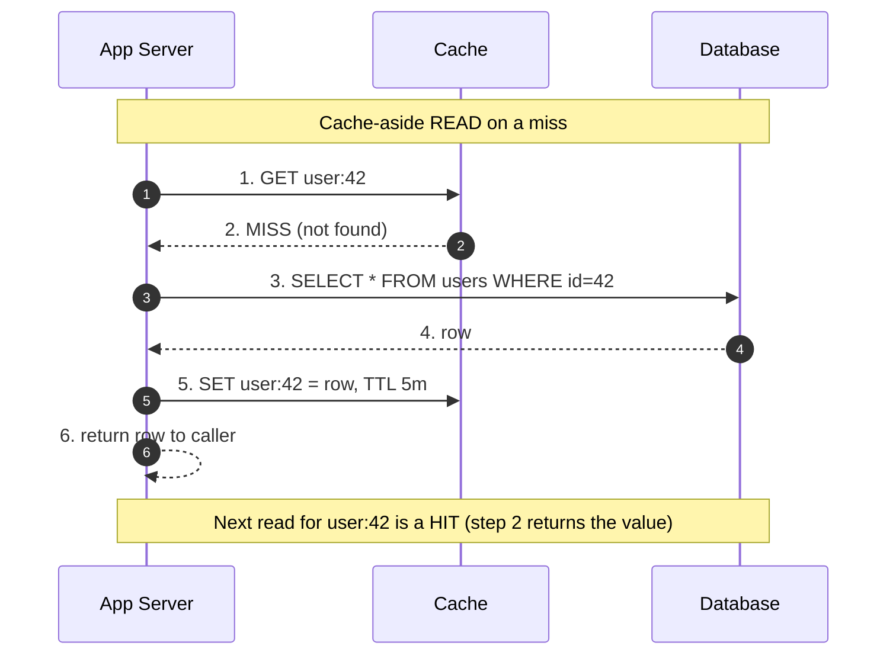
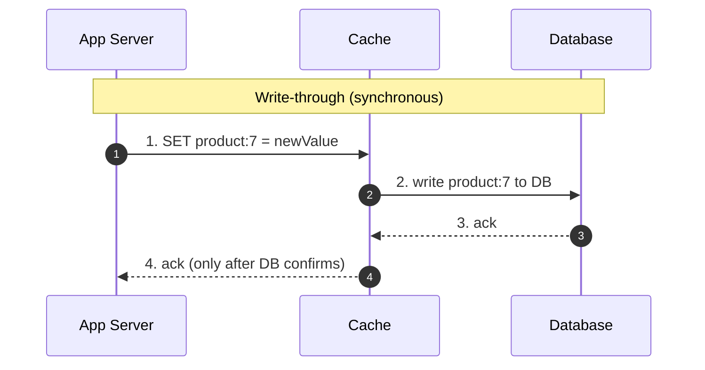
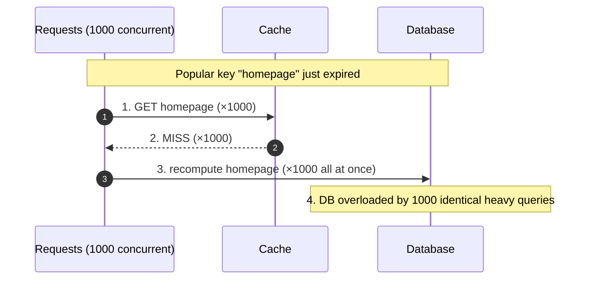

# Caching — Junior Interview Questions

> **Collection:** [System Design](../README.md) · **Level:** Junior · **Section 14 of 42**
> **Goal:** Confirm you can explain *why* caching exists, name the common read and
> write strategies and when each fits, reason about eviction and invalidation, and
> recognize the failure modes — stampedes and hot keys — that turn a cache from a
> shield into a liability.

A cache is simply a faster, smaller copy of data kept closer to the work. The junior
bar is not memorizing buzzwords — it is knowing *which* strategy a given workload
wants, *why* stale data happens, and *how* a cache can make an outage worse if you
get invalidation wrong. Each question below lists **what the interviewer is really
probing**, a **model answer**, and often a **follow-up** they will ask next.

---

## Contents

1. [Cache-Aside](#1-cache-aside)
2. [Write-Through](#2-write-through)
3. [Write-Behind](#3-write-behind)
4. [Refresh-Ahead](#4-refresh-ahead)
5. [Eviction Policies (LRU, LFU, FIFO, TTL)](#5-eviction-policies-lru-lfu-fifo-ttl)
6. [Types of Caching (client, CDN, web, DB, application)](#6-types-of-caching-client-cdn-web-db-application)
7. [Cache Invalidation](#7-cache-invalidation)
8. [Cache Stampede & Hot Keys](#8-cache-stampede--hot-keys)
9. [Rapid-Fire Self-Check](#9-rapid-fire-self-check)

---

## 1. Cache-Aside

### Q1.1 — What is the cache-aside (lazy-loading) pattern?

**Probing:** Do you know the most common caching pattern, and that the *application*
owns the cache logic?

**Model answer:** In cache-aside, the application code is in charge of the cache, not
the database or a library. On a read, the app first looks in the cache. On a **hit**,
it returns the cached value. On a **miss**, it reads from the database, writes the
result into the cache (usually with a TTL), and then returns it. The cache is
populated *lazily* — only data that someone actually asked for ends up cached. It is
the default pattern for systems like Redis or Memcached sitting beside a primary
database.

**Follow-up:** *"What happens the very first time data is requested?"* → It is always a
miss, so the first request pays the full database cost and warms the cache for
everyone after it. This is why a cold cache (after a restart or deploy) is a
vulnerable moment.

### Q1.2 — What are the main advantages of cache-aside?

**Probing:** Trade-off awareness, not just mechanics.

**Model answer:** Three things. **(1) Only requested data is cached**, so memory is
spent on what's actually hot, not the whole dataset. **(2) It is resilient to cache
failure** — if the cache is down, reads simply fall through to the database and the
app still works (slower, but up). **(3) It's simple and explicit** — the logic lives
in app code you control. The cost is that every miss is *two* round trips (cache then
DB), the first read of any key is always slow, and the app must handle invalidation
itself.

### Q1.3 — In cache-aside, how do you handle an update so reads don't go stale?

**Probing:** The classic write-side question for this pattern.

**Model answer:** On a write, update the database first, then **delete** (invalidate)
the cached key rather than trying to update it in place. The next read misses and
re-populates from the fresh database value. Deleting is safer than writing the new
value into the cache, because two concurrent updates can race and leave a wrong value
cached — whereas a delete just forces a re-read of the source of truth. This is the
"write to DB, evict from cache" rule.

**Follow-up:** *"Why not update the cache directly on write?"* → Because of a race:
request A reads the old DB value, then request B updates DB and sets the cache, then A
sets the cache with its stale value — leaving the cache permanently wrong until TTL.
Deleting avoids storing a stale write.

---

## 2. Write-Through

### Q2.1 — What is write-through caching?

**Probing:** Do you understand writes go *through* the cache synchronously?

**Model answer:** In write-through, every write goes to the cache **and** the database
as one synchronous operation — the write is not acknowledged until both succeed. The
cache is always populated with the latest value, so reads of recently written data are
fast and never stale. You can think of it as the cache sitting in front of the
database on the write path, keeping the two in lock-step.

**Follow-up:** *"Is the data safe if the cache crashes right after the write?"* → Yes —
because the write only returns success *after* the database has persisted it. The
cache is never the sole source of truth in write-through.

### Q2.2 — What's the main downside of write-through, and when is it worth it?

**Probing:** Latency cost vs consistency benefit.

**Model answer:** The downside is **write latency**: every write pays for both the
cache and the database synchronously, so writes are slower than writing to the DB
alone. It also caches data that may never be read again, wasting memory. It's worth it
when the same data is read soon and often after being written — e.g., a user's profile
that they immediately view after editing — so the extra write cost buys guaranteed-fresh,
fast reads. It's a poor fit for write-heavy, rarely-read data.

---

## 3. Write-Behind

### Q3.1 — What is write-behind (write-back) caching, and how does it differ from write-through?

**Probing:** The async-vs-sync distinction, and the durability trade-off it creates.

**Model answer:** In write-behind, the write goes to the **cache only** and is
acknowledged immediately; the cache then writes to the database **asynchronously** a
short time later, often batching multiple writes together. Write-through writes to both
stores synchronously before acking; write-behind defers the database write. The win is
very low write latency and fewer database operations (batched/coalesced writes). The
risk is **durability**: if the cache crashes before it flushes, those acknowledged
writes are lost.

| | Write-through | Write-behind |
|---|---|---|
| DB write timing | Synchronous, before ack | Asynchronous, after ack |
| Write latency | Higher (waits for DB) | Very low (cache only) |
| Durability risk | None (DB always has it) | Data loss if cache dies pre-flush |
| DB load | One write per app write | Batched / coalesced — fewer writes |

**Follow-up:** *"Give a workload where write-behind shines."* → High-volume,
loss-tolerant counters and metrics — e.g., view counts or "likes" — where coalescing a
thousand increments into one periodic DB write hugely reduces database load, and losing
a few seconds of counts on a crash is acceptable.

### Q3.2 — Why is write-behind risky for something like a payment record?

**Probing:** Matching the pattern to the data's value.

**Model answer:** Because a payment must never be silently lost, and write-behind
acknowledges the write *before* it is durably stored. A cache crash in the flush window
would lose an acknowledged payment — unacceptable. Money, orders, and audit logs need
the durability guarantee of write-through or a direct, durable write to the database
(ideally inside a transaction), not the deferred write of write-behind.

---

## 4. Refresh-Ahead

### Q4.1 — What is refresh-ahead caching?

**Probing:** Do you know this *proactive* read-side pattern?

**Model answer:** Refresh-ahead proactively reloads a cache entry **before** it expires,
based on a prediction that it will be needed again. When an entry is accessed and its
TTL is, say, within the last 20% of its lifetime, the cache asynchronously refreshes it
from the database in the background while still serving the current (still-valid) value.
The goal is to keep frequently accessed, predictable data fresh so users *never* hit the
slow path of a cold miss on a popular key.

**Follow-up:** *"How is this different from just using a longer TTL?"* → A longer TTL
keeps the *same* (increasingly stale) value around longer; refresh-ahead keeps the value
*fresh* by re-fetching it ahead of expiry. It trades extra background database reads for
better hit latency and fresher data on hot keys.

### Q4.2 — What's the risk of refresh-ahead, and when does it pay off?

**Probing:** Recognizing wasted work on cold data.

**Model answer:** The risk is **wasted refreshes**: if your prediction is wrong, you
spend database reads refreshing entries nobody asks for again. It pays off only for data
that is read repeatedly and predictably — homepage content, a popular product, exchange
rates — where the steady background refresh cost is far cheaper than letting a hot key
expire and stampede the database. For random-access, long-tail data, plain cache-aside is
better.

---

## 5. Eviction Policies (LRU, LFU, FIFO, TTL)

### Q5.1 — Why does a cache need an eviction policy at all?

**Probing:** Understanding the fundamental constraint.

**Model answer:** A cache has **finite memory** but the dataset it could hold is usually
larger. When the cache fills up and a new entry needs space, the policy decides *which
existing entry to remove*. A good policy keeps the entries most likely to be requested
again and discards the ones least likely to be — maximizing the hit rate for the memory
you have. Without a policy, the cache would either reject new entries or grow until it
runs out of memory.

### Q5.2 — Compare LRU, LFU, FIFO, and TTL in one line each.

**Probing:** Precise vocabulary; juniors often confuse "recently" and "frequently."

**Model answer:**

| Policy | Evicts… | Best when |
|---|---|---|
| **LRU** (Least Recently Used) | the entry not touched for the longest time | recent access predicts future access (most general default) |
| **LFU** (Least Frequently Used) | the entry with the fewest accesses overall | popularity is stable over time (a few keys are always hot) |
| **FIFO** (First In, First Out) | the oldest *inserted* entry, regardless of use | order of insertion matters more than access; simplest to implement |
| **TTL** (Time To Live) | any entry whose age exceeds its expiry, on a timer | data has a natural freshness window (sessions, prices) |

The key distinction: **LRU** is about *when last used*, **LFU** is about *how often
used*. TTL is orthogonal — it bounds *staleness* and is usually combined with one of the
others (e.g., LRU eviction *plus* a TTL).

**Follow-up:** *"Where does LFU beat LRU?"* → When a burst of one-off scans would evict
your genuinely popular keys. A single large batch job reading millions of rows once will
pollute an LRU cache (those rows look "most recent"); LFU keeps the long-term-popular
keys because the scan rows have low frequency.

### Q5.3 — Redis is configured with `maxmemory` reached. What happens to a write?

**Probing:** Connecting the concept to a real tool's behavior.

**Model answer:** It depends on the configured eviction policy (`maxmemory-policy`). With
an eviction policy like `allkeys-lru`, Redis evicts a least-recently-used key to make room
and accepts the write. With `noeviction`, Redis **rejects** the write with an error and
keeps existing data. So the same "memory full" situation either silently drops old cache
entries or starts failing writes — which is why choosing the policy deliberately matters,
especially when Redis is used as more than a pure cache.

---

## 6. Types of Caching (client, CDN, web, DB, application)

### Q6.1 — Name the layers where caching happens, from the user inward.

**Probing:** A mental map of *where* caches live in a real request path.

**Model answer:** A request passes through several cacheable layers:

| Layer | Where it lives | Caches | Example |
|---|---|---|---|
| **Client cache** | Browser / mobile app | responses, assets | browser caching a CSS file via `Cache-Control` |
| **CDN cache** | Edge servers near users | static + cacheable dynamic content | Cloudflare serving an image from the nearest POP |
| **Web / reverse-proxy cache** | In front of app servers | full HTTP responses, fragments | Varnish or Nginx caching a rendered page |
| **Application cache** | Beside the app (in-memory or Redis) | computed objects, query results | Redis holding a user's timeline |
| **Database cache** | Inside the DB | query results, buffer pool | the DB's buffer pool keeping hot pages in RAM |

The principle is the same at every layer — keep a faster copy closer to where it's
needed — but the closer to the user the cache sits, the more round trips it saves and the
harder it is to invalidate.

**Follow-up:** *"Which layer saves the most latency?"* → The client and CDN caches,
because they answer without touching your origin servers or crossing long network
distances at all. A cache hit at the browser is essentially free.

### Q6.2 — What kind of content is a good fit for a CDN, and what isn't?

**Probing:** Static vs personalized/dynamic distinction.

**Model answer:** CDNs excel at **static, shared content** that is the same for everyone:
images, video, CSS/JS bundles, fonts, downloads. It can be cached at the edge for hours
or days and served to millions without hitting the origin. A poor fit is **personalized
or rapidly changing content** — a logged-in user's account page or a real-time price — because
it differs per user or changes constantly, so it can't be safely shared from the edge
(though techniques like edge-side includes or short TTLs can cache parts of it).

---

## 7. Cache Invalidation

### Q7.1 — Why is cache invalidation considered hard?

**Probing:** Appreciating the core tension of caching.

**Model answer:** Because a cache is a *copy*, and the moment the source of truth changes,
the copy is stale. Invalidation is deciding *when* and *how* to make stale copies go away —
and getting it wrong gives users old data, while being too aggressive destroys your hit
rate. It's hard because the data can live in many caches at once (browser, CDN, app cache),
updates and reads race against each other, and there's no single switch to flip. The
famous quip — "there are only two hard things in computer science: cache invalidation and
naming things" — is about exactly this.

### Q7.2 — What are the common invalidation strategies?

**Probing:** Knowing the menu of options.

**Model answer:**

- **TTL / expiration** — every entry expires after a fixed time; simple, but you tolerate
  staleness up to the TTL. Good default.
- **Explicit invalidation (write-driven)** — on a write, the app deletes or updates the
  affected key. Precise, but you must remember every place a piece of data is cached.
- **Versioned / key-based** — embed a version or hash in the key (e.g.,
  `product:7:v3`); changing the version makes old entries unreachable and they age out.
  Common for static assets (`app.4f9a.css`).

Most real systems combine them: a TTL as a safety net so nothing is stale *forever*, plus
explicit invalidation on writes for freshness when it matters.

**Follow-up:** *"What's the simplest strategy and its cost?"* → TTL. The cost is bounded
staleness — a value can be wrong for up to the TTL duration — and you accept that in
exchange for not having to track every write.

### Q7.3 — A user updates their profile photo but still sees the old one. Where could the staleness be?

**Probing:** Reasoning across *multiple* cache layers, not just one.

**Model answer:** Staleness can hide at any layer the response passed through. The
**browser** may have cached the image (or the page) per its `Cache-Control` headers. The
**CDN** may still be serving the old image from the edge until its TTL expires or it's
purged. The **application cache** (Redis) may hold the old profile object. Fixing it means
finding the right layer: bust the asset URL (versioned filename) for client/CDN caches,
and explicitly invalidate the app cache key on update. A junior who only thinks of the app
cache misses where the bug usually is.

---

## 8. Cache Stampede & Hot Keys

### Q8.1 — What is a cache stampede (thundering herd)?

**Probing:** The single most important cache *failure mode* to understand.

**Model answer:** A cache stampede happens when a popular cached entry expires (or the
cache restarts cold) and **many concurrent requests miss at the same instant**. They all
fall through to the database simultaneously to recompute the same value, and that sudden
flood can overload the database — the very thing the cache was protecting. Ironically, the
cache makes the *normal* case fast but concentrates the pain into the moment of expiry.

**Follow-up:** *"How do you prevent it?"* → Common fixes: a **lock / single-flight** so
only one request recomputes while others wait for the result; **probabilistic early
expiration** so the entry is refreshed slightly before it expires (spreading recomputes
out); and serving a **slightly stale value** while one worker refreshes in the background
(refresh-ahead). Adding **jitter** to TTLs also prevents many keys expiring at once.

### Q8.2 — What is a hot key, and why is it a problem?

**Probing:** Understanding skew and single-node limits.

**Model answer:** A hot key is a single cache entry that receives a disproportionate share
of traffic — for example, a celebrity's profile or a trending product. The problem is that
in a distributed cache, a given key lives on **one node** (by hashing), so all that traffic
hammers a single server, creating a hotspot that can saturate that one node's CPU or
network even though the cluster as a whole has spare capacity. It breaks the assumption that
load spreads evenly across the cache cluster.

**Follow-up:** *"How might you mitigate a hot key?"* → Replicate the hot value across
multiple nodes and read from a random replica; add a small **local (in-process) cache** in
front of the distributed cache so most reads never leave the app server; or shard the key
into several sub-keys (`trending:0`, `trending:1`, …) and pick one at random to spread the
load.

### Q8.3 — How does adding jitter to TTLs help?

**Probing:** A simple, practical stampede mitigation.

**Model answer:** If you cache many entries at the same moment with the *same* TTL — say,
right after a deploy or a batch warm-up — they all expire at the same instant later,
causing a synchronized stampede. Adding **jitter** (a small random offset to each TTL, e.g.
300 s ± 10%) spreads the expirations across a window so misses arrive gradually instead of
all at once. It's a one-line change that turns a sharp load spike into a gentle, survivable
trickle.

---

## 9. Rapid-Fire Self-Check

If you can answer each of these in a sentence, you're ready for the junior bar on this section:

- [ ] In cache-aside, who owns the cache logic, and what happens on a miss? *(the app; read DB, populate cache, return)*
- [ ] On a cache-aside write, do you update or delete the cached key? *(delete/invalidate, to avoid stale-write races)*
- [ ] Write-through vs write-behind — which one risks data loss and why? *(write-behind; it acks before the DB is durable)*
- [ ] What does refresh-ahead do, and for what kind of data? *(refresh before expiry; hot, predictable keys)*
- [ ] LRU vs LFU — recency vs what? *(frequency)*
- [ ] Name the five caching layers from user inward. *(client, CDN, web/proxy, application, database)*
- [ ] Which content suits a CDN, and which doesn't? *(static/shared yes; personalized/real-time no)*
- [ ] Why is invalidation hard? *(a cache is a copy; staleness, multiple layers, races)*
- [ ] What is a cache stampede, and one way to prevent it? *(mass simultaneous miss; lock/single-flight or TTL jitter)*
- [ ] What is a hot key, and why does it hurt a distributed cache? *(one key = one node = a hotspot)*

---

**Next step:** Section 15 — [Data Streaming & Big Data](15-data-streaming.md): event streams, batch vs stream processing, and the systems that move data at scale.
