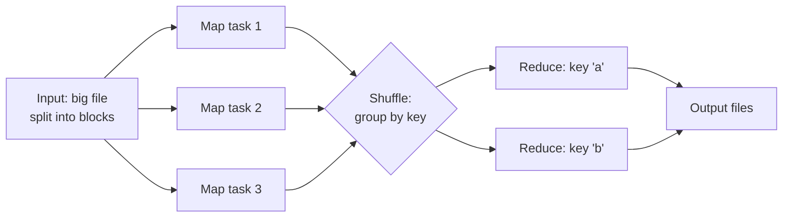
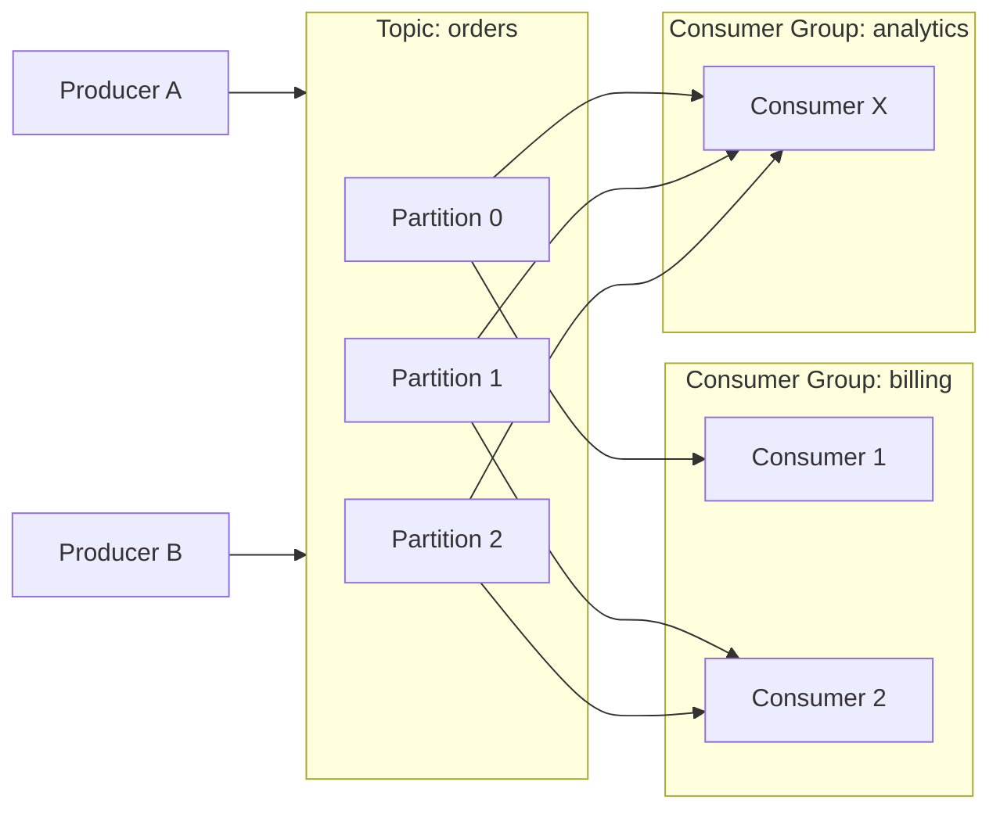
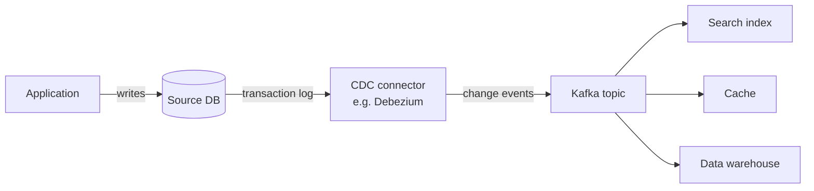

# Data Streaming & Big Data — Junior Interview Questions

> **Collection:** [System Design](../README.md) · **Level:** Junior · **Section 15 of 42**
> **Goal:** Explain how large data is processed both *in bulk* and *as it arrives*,
> name the canonical tools (MapReduce, Spark, Kafka), and reason clearly about the
> trade-offs between batch and stream, lake and warehouse, ETL and ELT.

A "junior" answer here is not a deep-internals answer — it is a *correct, concrete, and
honest* one. Interviewers at this level want to hear that you know **why** big data
needs its own toolset, that you can sketch the data flow, and that you reach for real
systems (Hadoop, Spark, Kafka, S3, Snowflake) as examples rather than hand-waving. Each
question below lists **what the interviewer is really probing**, a **model answer**, and
often a **follow-up** they will ask next.

---

## Contents

1. [Batch Processing (MapReduce)](#1-batch-processing-mapreduce)
2. [Apache Spark](#2-apache-spark)
3. [Stream Processing](#3-stream-processing)
4. [Apache Kafka](#4-apache-kafka)
5. [Lambda vs Kappa Architecture](#5-lambda-vs-kappa-architecture)
6. [Data Lake & Warehouse](#6-data-lake--warehouse)
7. [Change Data Capture (CDC)](#7-change-data-capture-cdc)
8. [ETL vs ELT](#8-etl-vs-elt)
9. [Rapid-Fire Self-Check](#9-rapid-fire-self-check)

---

## 1. Batch Processing (MapReduce)

### Q1.1 — What is batch processing, and when do you use it?

**Probing:** Do you understand the core idea — process a *bounded* dataset all at once?

**Model answer:** Batch processing runs a job over a large, **finite** dataset that is
already at rest — yesterday's logs, a month of transactions, a full table snapshot. You
collect the data, kick off the job, and it produces output after it has chewed through
everything. You use it when the result doesn't need to be instant: nightly billing
rollups, building a search index, generating a daily analytics report. The defining
traits are **high throughput** (it processes huge volumes efficiently) and **high
latency** (results arrive minutes to hours later, by design).

**Follow-up:** *"What's the opposite?"* → Stream processing, which handles an *unbounded*
flow of events continuously, trading some throughput for low latency.

### Q1.2 — Explain MapReduce as if to a new teammate.

**Probing:** Can you describe the two phases and *why* this model scales?

**Model answer:** MapReduce is a programming model for processing huge datasets across
many machines. You express the job as two functions. **Map** takes each input record and
emits intermediate `(key, value)` pairs. The framework then **shuffles** — it groups all
values that share a key onto the same machine. **Reduce** takes a key and its list of
values and combines them into a final result. The classic example is word count: *map*
emits `(word, 1)` for every word; *reduce* sums the `1`s per word. It scales because Map
and Reduce both run in parallel across the cluster, and the framework — not your code —
handles distribution, retries on failed nodes, and moving data.

**Follow-up:** *"What does the shuffle cost?"* → It moves intermediate data across the
network and sorts it by key — often the most expensive part of a MapReduce job.

### Q1.3 — Hadoop comes up a lot. What is it, in relation to MapReduce?

**Probing:** Can you separate the *model* from the *implementation/ecosystem*?

**Model answer:** Hadoop is the open-source ecosystem that made MapReduce mainstream. It
has two pillars: **HDFS** (the Hadoop Distributed File System), which stores enormous
files split into blocks and replicated across cheap machines, and **MapReduce** (the
execution engine) that runs jobs close to where the data lives — "move the computation to
the data" to avoid shipping terabytes over the network. Modern stacks have largely
replaced Hadoop MapReduce with Spark for speed, but HDFS and the "data-local processing"
idea are still foundational.

---

## 2. Apache Spark

### Q2.1 — What problem does Spark solve that MapReduce didn't?

**Probing:** The single most important Spark fact: **in-memory** processing.

**Model answer:** Classic MapReduce writes intermediate results to disk between every
Map and Reduce stage. For multi-step jobs — and especially **iterative** ones like
machine-learning training that pass over the data many times — that constant disk I/O is
crushingly slow. Spark keeps intermediate data **in memory** across stages whenever it
can, so iterative and interactive workloads run roughly an order of magnitude faster. It
also offers a far richer, higher-level API than raw map/reduce, so the same job takes far
less code.

**Follow-up:** *"Is Spark always faster?"* → No. If a job is a single pass over data too
big for cluster memory, the advantage shrinks; Spark spills to disk and the gap narrows.

### Q2.2 — What is an RDD, and what does "lazy evaluation" mean?

**Probing:** Core Spark vocabulary, junior depth only.

**Model answer:** An **RDD** (Resilient Distributed Dataset) is Spark's basic abstraction:
an immutable, partitioned collection spread across the cluster that can be rebuilt if a
node fails (that's the "resilient" part — Spark remembers the steps to recompute it). You
build a job by chaining **transformations** (`map`, `filter`, `join`) and **actions**
(`count`, `collect`, `save`). **Lazy evaluation** means transformations don't run when you
call them — Spark just records the plan. Nothing executes until an *action* forces it,
which lets Spark optimize the whole chain before running. Most code today uses the
higher-level **DataFrame/Dataset** API built on top of RDDs, which gets extra query
optimization.

### Q2.3 — Name the pieces of the Spark ecosystem you'd mention in an interview.

**Probing:** Breadth — Spark is a unified engine, not just batch.

**Model answer:** **Spark SQL** for querying structured data with SQL/DataFrames; **Spark
Structured Streaming** for processing live event streams with the same API as batch;
**MLlib** for machine learning at scale; and **GraphX** for graph computation. The selling
point is one engine and one programming model covering batch, streaming, SQL, and ML —
instead of stitching together separate tools.

---

## 3. Stream Processing

### Q3.1 — How is stream processing different from batch?

**Probing:** Bounded vs unbounded data, latency vs throughput.

**Model answer:** Batch processes a **bounded** dataset that's already complete; stream
processing handles an **unbounded**, never-ending flow of events and produces results
**continuously**, as data arrives. The goal flips from throughput to **low latency** —
seconds or milliseconds from event to result. Use it for fraud detection, live
dashboards, real-time recommendations, and monitoring/alerting, where waiting for a
nightly batch would defeat the purpose.

| Aspect | Batch Processing | Stream Processing |
|---|---|---|
| **Data** | Bounded (finite, at rest) | Unbounded (continuous events) |
| **Latency** | Minutes to hours | Milliseconds to seconds |
| **Throughput** | Very high | High, but per-event overhead |
| **Trigger** | Scheduled / on-demand | Always running |
| **Example** | Nightly billing report | Live fraud alert, dashboard |
| **Tools** | MapReduce, Spark batch | Flink, Spark Streaming, Kafka Streams |

### Q3.2 — What's the difference between event time and processing time?

**Probing:** A classic gotcha — juniors who name it stand out.

**Model answer:** **Event time** is *when the event actually happened* (the timestamp the
sensor or app recorded). **Processing time** is *when your system got around to handling
it*. They differ because events arrive **late or out of order** — a phone goes offline,
buffers events, and uploads them ten minutes later. If you aggregate "purchases per
minute" by processing time, those late events land in the wrong bucket. Correct stream
systems aggregate by **event time** and use **watermarks** to decide when a time window is
"probably complete" and safe to emit.

**Follow-up:** *"What's a window?"* → A way to bound an unbounded stream into finite chunks
— e.g., a 5-minute tumbling (non-overlapping) window — so you can compute aggregates over
"the last 5 minutes."

### Q3.3 — What does "exactly-once processing" mean, and why is it hard?

**Probing:** Delivery semantics — awareness, not implementation detail.

**Model answer:** It's the guarantee that each event affects the result **once**, even
when failures cause retries. The three levels are **at-most-once** (may drop events, never
duplicates), **at-least-once** (never drops, but may double-count on retry), and
**exactly-once** (the ideal). It's hard because in a distributed system a node can process
an event, then crash before recording that it did — so on restart, did it finish or not?
Systems achieve effective exactly-once through **idempotent writes** (re-applying is a
no-op) or **transactional checkpoints** that commit progress and output together.

---

## 4. Apache Kafka

### Q4.1 — What is Kafka, in one paragraph?

**Probing:** Is it "a message queue," or do you grasp the *durable log* idea?

**Model answer:** Kafka is a distributed, durable **commit log** used as the backbone for
streaming data. Producers append events to **topics**; consumers read them. Unlike a
traditional queue that deletes a message once it's consumed, Kafka **retains** events for
a configured period (hours, days, or forever), so many independent consumers can read the
same stream at their own pace, and you can replay history. It's the standard "central
nervous system" that decouples the systems producing data from those consuming it.

### Q4.2 — Explain topics, partitions, and consumer groups.

**Probing:** The core data model — and how Kafka scales and orders.

**Model answer:** A **topic** is a named stream of events (e.g., `orders`). Each topic is
split into **partitions** — that's the unit of parallelism and ordering. A producer's
event is appended to one partition (often chosen by a key, so all events for the same
customer land in the same partition and stay ordered). Kafka guarantees order **within a
partition**, not across the whole topic. A **consumer group** is a set of consumers
sharing the work: Kafka assigns each partition to exactly one consumer in the group, so
adding consumers (up to the partition count) scales throughput. Different consumer
*groups* each get the full stream independently.

**Follow-up:** *"What happens if you have more consumers than partitions?"* → The extra
consumers sit idle — a partition can feed only one consumer per group, so partition count
caps a group's parallelism.

### Q4.3 — What is an offset, and why does it matter?

**Probing:** How Kafka tracks progress and enables replay.

**Model answer:** An **offset** is the sequential position of an event within a partition
— event 0, 1, 2, and so on. Each consumer group records the offset it has read up to (its
"committed offset"). This is what lets a consumer crash and resume exactly where it left
off, and what lets you **replay** by resetting the offset backward to reprocess old data.
Because Kafka stores offsets per group, the analytics team and the billing team can be at
completely different positions in the same topic.

---

## 5. Lambda vs Kappa Architecture

### Q5.1 — What problem do these architectures solve?

**Probing:** Why anyone needs a named "architecture" here at all.

**Model answer:** They answer: *"How do I serve both fast, real-time results and accurate,
complete historical results from the same data?"* Real-time stream results are quick but
can be approximate (late data, no time to recompute); batch results are accurate but slow.
**Lambda** and **Kappa** are two patterns for reconciling speed with correctness.

### Q5.2 — Contrast Lambda and Kappa.

**Probing:** The core trade-off: two code paths vs one.

**Model answer:** **Lambda** runs **two parallel pipelines**: a *batch layer* that
reprocesses all historical data for accuracy, and a *speed layer* that processes the live
stream for low latency. A *serving layer* merges both so queries see fresh-but-approximate
plus accurate-but-delayed results. Its weakness is you maintain the **same logic twice**,
in two codebases, which drift apart. **Kappa** says: drop the batch layer entirely. Treat
**everything as a stream**, and if you need to reprocess history, just **replay** the
event log from the beginning through the *same* streaming code. One codebase, simpler to
maintain — assuming your stream engine and log (e.g., Kafka + Flink) can replay at scale.

| | Lambda | Kappa |
|---|---|---|
| **Pipelines** | Two (batch + speed) | One (stream only) |
| **Reprocessing** | Re-run the batch job | Replay the event log |
| **Code paths** | Duplicated logic | Single codebase |
| **Complexity** | Higher (merge layer) | Lower |
| **Best when** | Batch and stream logic genuinely differ | Logic is uniform; log replay is feasible |

**Follow-up:** *"Which is more popular now?"* → Kappa-style is increasingly favored because
maintaining duplicated logic in Lambda is painful — but Lambda still appears where heavy
historical recomputation differs fundamentally from real-time handling.

---

## 6. Data Lake & Warehouse

### Q6.1 — Define a data lake and a data warehouse, and contrast them.

**Probing:** Schema-on-read vs schema-on-write; raw vs curated.

**Model answer:** A **data warehouse** stores **structured, cleaned, modeled** data
optimized for analytical SQL queries — you define the schema *before* loading
(**schema-on-write**). Examples: Snowflake, BigQuery, Redshift. A **data lake** stores
**raw data in any format** — JSON, logs, images, Parquet — cheaply, often on object
storage like S3, and you impose structure *when you read it* (**schema-on-read**). The
warehouse is a curated library; the lake is a giant, cheap storage room you sort through
later.

| | Data Warehouse | Data Lake |
|---|---|---|
| **Data** | Structured, cleaned | Raw, any format |
| **Schema** | On write (defined first) | On read (defined later) |
| **Cost** | Higher per TB | Low (object storage) |
| **Users** | Analysts, BI tools | Data scientists, ML |
| **Examples** | Snowflake, BigQuery, Redshift | S3, ADLS, HDFS |

### Q6.2 — When would you choose a lake over a warehouse?

**Probing:** Practical judgment, not just definitions.

**Model answer:** Choose a **lake** when you have large volumes of varied or unstructured
data, you don't yet know all the questions you'll ask (so you don't want to commit to a
schema early), and you need cheap storage for ML feature engineering or exploratory work.
Choose a **warehouse** when you have well-understood structured data and analysts need
fast, reliable SQL for dashboards and reports. In practice many companies use **both** —
land everything raw in the lake, then transform the useful slices into the warehouse.

**Follow-up:** *"Have you heard of a 'lakehouse'?"* → Yes — formats like Delta Lake,
Iceberg, and Hudi add warehouse-like reliability (transactions, schema enforcement)
directly on lake storage, blurring the line so you get one system instead of two.

---

## 7. Change Data Capture (CDC)

### Q7.1 — What is CDC, and what's it for?

**Probing:** Do you see it as streaming a database's *changes*, not its *state*?

**Model answer:** **Change Data Capture** is the technique of detecting every **insert,
update, and delete** in a database and streaming those changes to other systems in near
real time. Instead of periodically dumping and reloading the whole table (slow, stale),
CDC continuously propagates just the deltas. It's used to keep a search index, cache, data
warehouse, or downstream microservice **in sync** with the source database without
hammering it with repeated full scans.

### Q7.2 — How does log-based CDC work, and why is it preferred?

**Probing:** Awareness that databases already have a change log.

**Model answer:** Every transactional database keeps a **write-ahead/transaction log** (the
WAL in Postgres, the binlog in MySQL) recording every change for durability and
replication. Log-based CDC **tails that log** and emits each change as an event — often
into Kafka via a tool like **Debezium**. It's preferred over the alternatives (polling a
`updated_at` column, or trigger-based capture) because it's **low-overhead** (it reads a
log the DB already writes), captures **every** change including deletes, and doesn't add
query load to the source. The pattern is so common it has a name: the **outbox** /
"database as a stream" pattern.

**Follow-up:** *"What ordering guarantee do you need?"* → Changes for a given row must stay
**in order**, so you key the CDC events by primary key into the same Kafka partition.

---

## 8. ETL vs ELT

### Q8.1 — What does ETL stand for, and what's the difference from ELT?

**Probing:** The single most important contrast: *where* the transform happens.

**Model answer:** **ETL** = **Extract, Transform, Load**: pull data from sources,
transform/clean it on a separate processing tier, *then* load the finished result into the
warehouse. **ELT** = **Extract, Load, Transform**: pull the data and load it **raw** into
the warehouse first, then transform it **inside** the warehouse using its own compute (via
SQL). The only swap is the order of "Transform" and "Load" — but it changes everything
about where the heavy lifting runs.

| | ETL | ELT |
|---|---|---|
| **Order** | Transform before load | Load raw, transform after |
| **Transform runs on** | Separate processing engine | The warehouse itself |
| **Warehouse holds** | Only clean data | Raw + transformed |
| **Flexibility** | Schema fixed up front | Re-transform raw anytime |
| **Fits** | Limited warehouse compute, on-prem | Cheap, elastic cloud warehouses |

### Q8.2 — Why has ELT become popular recently?

**Probing:** Connecting the trend to cloud economics.

**Model answer:** Modern cloud warehouses (Snowflake, BigQuery) have **cheap, massive,
elastic compute**, so it's now efficient to load raw data and transform it *in place* with
SQL. ELT keeps the **raw data available**, so if business rules change you can re-transform
without re-extracting from the source. It also simplifies the pipeline — you don't run a
separate transformation cluster — which is why tools like **dbt** (transform-in-warehouse)
have taken off. ETL still wins when warehouse compute is scarce or when sensitive data must
be cleaned/masked **before** it ever lands.

**Follow-up:** *"How does this relate to lakes and warehouses?"* → ELT pairs naturally with
the schema-on-read philosophy: land raw first, structure later — the same instinct behind
data lakes.

---

## 9. Rapid-Fire Self-Check

If you can answer each of these in a sentence, you're ready for the junior bar on this section:

- [ ] Batch vs stream — bounded vs unbounded, and the latency trade-off?
- [ ] What are the two phases of MapReduce, and what happens between them? *(shuffle)*
- [ ] What's the one-line reason Spark beats classic MapReduce? *(in-memory)*
- [ ] Event time vs processing time — why does the difference matter? *(late/out-of-order events)*
- [ ] In Kafka, what guarantees ordering, and what scales parallelism? *(partitions; consumer groups)*
- [ ] What is a Kafka offset good for? *(resume + replay)*
- [ ] Lambda vs Kappa — how many code paths each? *(two vs one)*
- [ ] Data lake vs warehouse — schema-on-read vs schema-on-write?
- [ ] What does log-based CDC tail, and what tool is typical? *(the WAL/binlog; Debezium)*
- [ ] ETL vs ELT — where does the transform run? *(before load vs inside the warehouse)*

---

**Next step:** Section 16 — [Asynchronism](16-asynchronism.md): message queues, background
jobs, and decoupling work from the request path.
