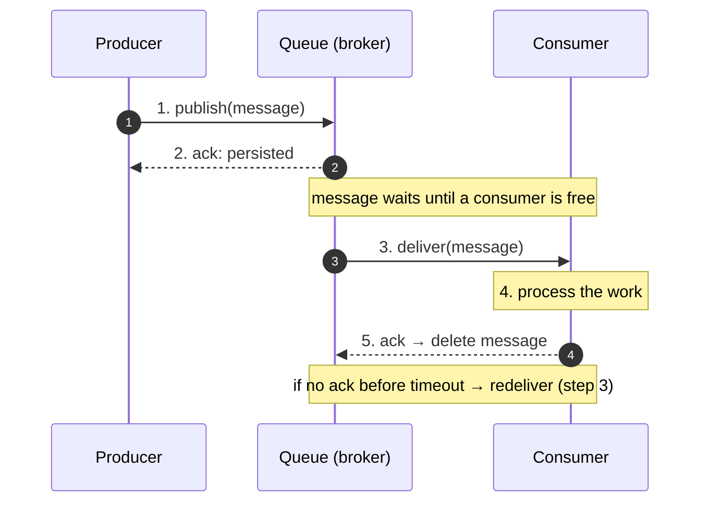
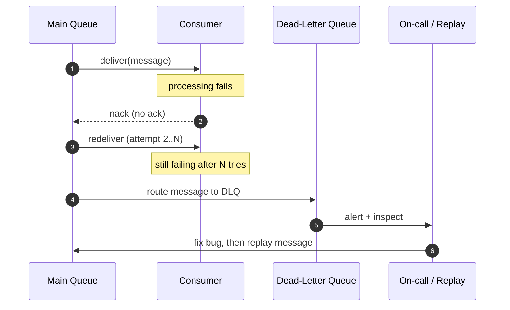

# Asynchronism — Junior Interview Questions

> **Collection:** [System Design](../README.md) · **Level:** Junior · **Section 16 of 42**
> **Goal:** Show you understand *why* systems do heavy work out-of-band — how a
> message or task queue decouples producers from consumers, what back pressure and
> dead-letter queues protect against, and the honest trade-offs between at-most-once,
> at-least-once, and exactly-once delivery.

Asynchronism is the art of *not making the caller wait*. Instead of doing the slow,
risky, or bursty work inline, a service hands it off to a queue and returns
immediately; a separate worker picks it up later. A junior answer here is not about
naming brokers — it's about explaining what decoupling buys you, what it costs, and
the failure modes (lost messages, duplicate work, stuck consumers) that every async
system has to handle. Each question lists **what the interviewer is really probing**,
a **model answer**, and often a **follow-up** they will ask next.

---

## Contents

1. [Message Queues](#1-message-queues)
2. [Task Queues](#2-task-queues)
3. [Back Pressure](#3-back-pressure)
4. [Dead-Letter Queues (DLQ)](#4-dead-letter-queues-dlq)
5. [Delivery Guarantees](#5-delivery-guarantees)
6. [Rapid-Fire Self-Check](#6-rapid-fire-self-check)

---

## 1. Message Queues

### Q1.1 — What is a message queue, and what problem does it solve?

**Probing:** Do you understand *decoupling*, not just "a list of messages"?

**Model answer:** A message queue is a buffer that sits between a **producer** (who
sends a message) and a **consumer** (who processes it), so the two never have to be
online or fast at the same time. The producer drops a message and moves on; the
consumer reads it whenever it's ready. This solves three problems at once: **temporal
decoupling** (the consumer can be slow, restarting, or scaled-down without blocking
the producer), **load smoothing** (a traffic spike fills the queue instead of
crashing the consumer), and **failure isolation** (if the consumer is down, messages
wait safely instead of being lost). RabbitMQ and Amazon SQS are the canonical
examples.

**Follow-up:** *"How is that different from just calling the service directly?"* → A
direct (synchronous) call couples the caller's success to the callee being up and
fast *right now*; if the callee is down, the caller fails. A queue lets the caller
succeed immediately and the work happen later, at the cost of the result no longer
being available in the same request.

### Q1.2 — Walk me through the lifecycle of a single message.

**Probing:** Mechanical fluency: enqueue → deliver → acknowledge.

**Model answer:** The producer **publishes** a message, and a durable broker
**persists** it and acknowledges receipt. The message then sits in the queue until a
consumer is available. The broker **delivers** it to a consumer, which **processes**
the work and sends an **acknowledgement (ack)**; only then does the broker delete the
message. If the consumer crashes or doesn't ack within a timeout (SQS calls this the
*visibility timeout*), the broker assumes failure and **redelivers** the message to
another consumer. The ack is the heart of reliability — "don't delete until someone
confirms they're done."

**Follow-up:** *"What happens if the consumer acks before doing the work?"* → You've
turned an at-least-once system into an at-most-once one: a crash after the ack but
before completion silently loses the work. Always ack *after* the work is durably done.

### Q1.3 — Point-to-point queue vs publish/subscribe — what's the difference?

**Probing:** Do you know that "one consumer" vs "every subscriber" is a design choice?

**Model answer:** In a **point-to-point queue**, each message is delivered to exactly
*one* consumer from a pool — used to distribute work (a job should run once). In
**publish/subscribe**, each message is delivered to *every* interested subscriber —
used to broadcast events (an "order placed" event that billing, shipping, and
analytics all need). RabbitMQ models both via exchanges and bindings; SQS is
point-to-point, and SNS adds fan-out on top. The question to ask is: "should this
message be handled once, or should everyone hear about it?"

### Q1.4 — Does a message queue guarantee ordering?

**Probing:** Awareness that ordering is not free and often partial.

**Model answer:** Not automatically, and usually not globally. A standard queue with
multiple consumers reading in parallel can process messages out of order — consumer A
might finish message 2 before consumer B finishes message 1. Strict global ordering
forces a single consumer (no parallelism), which kills throughput. Most systems use
**per-key ordering** instead: SQS FIFO queues and Kafka partitions guarantee order
only *within a message group / partition key* (e.g., all events for one user are
ordered), so you keep parallelism across keys. If your design says "these must be
ordered," always ask "ordered relative to *what*?"

---

## 2. Task Queues

### Q2.1 — What is a task queue, and how does it relate to a message queue?

**Probing:** Do you see a task queue as a *job-oriented* layer on top of messaging?

**Model answer:** A task queue is a higher-level abstraction for running **background
jobs**: instead of raw messages, you enqueue named units of work — "resize this
image," "send this email" — and workers execute them. It is usually built *on top of*
a message queue or broker. **Celery** (Python) is the classic example: it puts tasks
on a broker like RabbitMQ or Redis, and a pool of worker processes pulls and runs
them, with built-in retries, scheduling, and result tracking. The message queue moves
bytes; the task queue knows those bytes represent a function call to retry, schedule,
and monitor.

**Follow-up:** *"Give a real use case."* → A web request that triggers a slow PDF
export returns instantly with "we'll email you when it's ready," enqueues a Celery
task, and a worker generates the PDF seconds later — keeping the request fast.

### Q2.2 — Why move work to a task queue instead of doing it in the request?

**Probing:** The core async motivation, applied to user-facing latency.

**Model answer:** Three reasons. **(1) Latency** — the user shouldn't wait for slow
work (transcoding a video, calling a third-party API) that doesn't affect the
immediate response. **(2) Resilience** — if the email provider is down, a queued task
can retry later instead of failing the user's signup. **(3) Smoothing** — a flood of
sign-ups becomes a backlog the workers drain at their own pace, rather than a thundering
herd that overwhelms a downstream service. The rule of thumb: *if the user doesn't need
the result to continue, and the work is slow or failure-prone, queue it.*

### Q2.3 — A task fails halfway. What should the worker do?

**Probing:** Retries, idempotency, and not corrupting state on partial failure.

**Model answer:** The worker should **retry**, ideally with **exponential backoff and
jitter** so a failing dependency isn't hammered. But retries only work safely if the
task is **idempotent** — running it twice produces the same result as running it once.
For example, "charge the customer" must be keyed by an idempotency token so a retry
doesn't double-charge; "set status = shipped" is naturally idempotent. After a bounded
number of retries, the task should be routed to a **dead-letter queue** for inspection
rather than retried forever.

**Follow-up:** *"How do you bound retries?"* → A max-retry count or a max-age; once
exceeded, stop retrying and dead-letter the task so a human or alert can investigate.

### Q2.4 — How do you run a task in the future, not right now?

**Probing:** Awareness that scheduling/delay is a first-class queue feature.

**Model answer:** Use the queue's **delay / scheduling** support. SQS has per-message
*delay seconds*; Celery has `countdown` and `eta`; many systems pair the queue with a
scheduler (cron-like, e.g. Celery Beat) for recurring jobs. A "send a reminder in 24
hours" feature is just a task enqueued with a 24-hour delay, so you don't need to poll
a database for due items. This is the bridge to Section 17 on background jobs.

---

## 3. Back Pressure

### Q3.1 — What is back pressure?

**Probing:** Do you understand it as a *feedback signal* about overload, not just "slow"?

**Model answer:** Back pressure is the mechanism by which a system under load tells its
upstream producers to **slow down** instead of silently falling over. When consumers
can't keep up, the queue grows; back pressure turns that growing backlog into an
explicit signal — rejecting new messages, blocking the producer, or returning a "try
again later" — so the overload is felt and controlled at the *source* rather than
causing an unbounded queue, exhausted memory, and a crash. It's the difference between
a restaurant saying "20-minute wait" and one that seats everyone and then collapses.

**Follow-up:** *"What goes wrong without it?"* → An unbounded queue. Producers keep
adding faster than consumers drain, memory or disk fills, latency climbs without limit,
and eventually the broker or workers crash — taking the backlog with them.

### Q3.2 — Name concrete ways a system applies back pressure.

**Probing:** Can you turn the concept into mechanisms?

**Model answer:**
- **Bounded queues** — the queue has a max depth; when full, new messages are rejected
  or the producer blocks.
- **Rate limiting / throttling** — the producer is capped (e.g., 1,000 messages/sec),
  and excess gets a 429 "slow down."
- **Load shedding** — under extreme load, drop or reject low-priority work to protect
  the critical path.
- **Blocking / pull-based flow** — the consumer *pulls* at its own pace (as in Kafka),
  so it can never be pushed faster than it can handle.

The unifying idea: make "too much work" a visible, handled condition rather than a
hidden, fatal one.

### Q3.3 — How does a pull-based consumer naturally provide back pressure?

**Probing:** Push vs pull mental model.

**Model answer:** In a **pull** model, the consumer asks for the next batch only when
it's ready for more — so it can *never* be overwhelmed by the broker. The backlog
simply accumulates in the durable queue, and the consumer's own throughput sets the
pace. In a **push** model, the broker sends messages to the consumer as they arrive,
which can flood a slow consumer unless it has explicit limits (RabbitMQ's *prefetch
count*, which caps unacknowledged messages per consumer, is exactly this safety valve).
Pull gives back pressure for free; push needs you to configure it.

---

## 4. Dead-Letter Queues (DLQ)

### Q4.1 — What is a dead-letter queue and why do you need one?

**Probing:** Do you understand it as a *quarantine for unprocessable messages*?

**Model answer:** A dead-letter queue is a separate queue where messages go when they
**cannot be processed successfully** — typically after exceeding a max number of retries,
expiring, or failing to deserialize ("poison messages"). Without a DLQ, such a message
either gets retried forever (blocking the queue and wasting resources) or gets silently
dropped (data loss). The DLQ isolates the failures so the main queue keeps flowing,
and gives operators a place to inspect, fix, and **replay** the bad messages once the
underlying bug is resolved. SQS supports this natively via a *redrive policy*;
RabbitMQ routes to a dead-letter exchange.

**Follow-up:** *"What's a poison message?"* → A message that will *never* succeed no
matter how many times you retry — e.g., malformed JSON or a reference to a deleted
record. The DLQ exists precisely so poison messages stop poisoning the main queue.

### Q4.2 — A message has failed 5 times. What should happen, and what should you avoid?

**Probing:** Retry budgets, alerting, and not infinite-looping.

**Model answer:** After a configured max-receive count (say 5), the broker should move
the message to the DLQ and **stop retrying it on the main queue**. You should
**alert** on DLQ depth — a growing DLQ means something is systematically broken and
needs a human. What to avoid: retrying forever (it blocks throughput and never
resolves), and *silently deleting* the message (you lose data and visibility). The DLQ
turns "this keeps failing" from an invisible loop into an actionable signal.

### Q4.3 — Once messages are in the DLQ, then what?

**Probing:** The full operational loop — DLQs are not a graveyard.

**Model answer:** You **triage**: inspect the messages to find the root cause (a bug, a
schema change, a down dependency). After fixing it, you **replay** (redrive) the
messages back onto the main queue to process them successfully. Some truly invalid
messages may be discarded deliberately. The key mindset is that a DLQ is a *holding
area for later action*, not a trash can — its whole value is that no failed work is
lost, and you can recover it once the system is healthy.

---

## 5. Delivery Guarantees

### Q5.1 — Explain at-most-once, at-least-once, and exactly-once.

**Probing:** The central trade-off of all messaging systems.

**Model answer:**

| Guarantee | Meaning | Risk | Typical use |
|---|---|---|---|
| **At-most-once** | Each message delivered 0 or 1 times | May be **lost**, never duplicated | Metrics, telemetry where occasional loss is fine |
| **At-least-once** | Each message delivered 1 or more times | May be **duplicated**, never lost | The common default (SQS standard, most task queues) |
| **Exactly-once** | Each message processed once, no loss, no dupes | Hardest to achieve; costly | Financial / billing where both loss and dupes are unacceptable |

**At-most-once** acks (or fires-and-forgets) *before* doing the work — fast, but a
crash loses the message. **At-least-once** acks *after* the work is durably done — so a
crash before the ack causes a redelivery (a duplicate), but nothing is ever lost.
**Exactly-once** promises no loss *and* no duplicates, which is the strongest and the
most expensive.

**Follow-up:** *"Which is the realistic default and why?"* → At-least-once. It's
simple, never loses data, and the duplicate problem is solvable by making consumers
idempotent.

### Q5.2 — Is true exactly-once delivery actually possible?

**Probing:** Senior-flavored honesty — knowing the marketing vs the mechanism.

**Model answer:** True exactly-once *delivery* over an unreliable network is generally
impossible — the sender can never be sure whether a lost ack meant "message lost" or
"ack lost," so it must either risk a duplicate or risk a loss. What systems actually
provide is **exactly-once *processing***: at-least-once delivery (so nothing is lost)
combined with **idempotent consumers** or transactional **deduplication** (so
duplicates have no effect). So you get the *effect* of exactly-once by accepting
duplicates at the transport layer and neutralizing them at the application layer.

### Q5.3 — How do you make at-least-once safe in practice?

**Probing:** The practical fix: idempotency and deduplication.

**Model answer:** Make the consumer **idempotent** so reprocessing a duplicate is a
no-op. Common techniques: attach a unique **idempotency key** to each message and store
processed keys (skip any you've already seen); use **upserts** keyed on a natural ID
instead of blind inserts; or design operations that are inherently idempotent ("set
balance to X" rather than "add X"). SQS FIFO offers built-in deduplication within a
5-minute window using a deduplication ID. The principle: assume every message can
arrive twice, and make sure it doesn't matter when it does.

**Follow-up:** *"Where do you store the seen-keys?"* → A fast, durable store —
typically a database table or Redis set with a TTL covering your retry window — checked
atomically as part of processing.

### Q5.4 — Map each guarantee to where the ack happens.

**Probing:** Connecting the abstract guarantee back to the concrete ack timing.

**Model answer:** The guarantee is decided by *when you acknowledge relative to doing
the work*:

- **At-most-once:** ack **before** processing → a crash mid-work loses the message.
- **At-least-once:** ack **after** processing succeeds → a crash before the ack causes
  a safe redelivery (possible duplicate).
- **Exactly-once (processing):** at-least-once delivery + dedup/idempotency so the
  duplicate is absorbed.

If an interviewer asks "how would you build at-least-once?", the answer is literally
"don't ack until the work is durably committed." Ack timing *is* the guarantee.

---

## 6. Rapid-Fire Self-Check

If you can answer each of these in a sentence, you're ready for the junior bar on this section:

- [ ] What three things does a message queue decouple? *(time, load, failure)*
- [ ] When should a consumer send its ack? *(after the work is durably done)*
- [ ] Point-to-point vs pub/sub — handled once, or by everyone? *(once vs broadcast)*
- [ ] Why use a task queue instead of doing work in the request? *(latency, resilience, smoothing)*
- [ ] What makes a retry safe? *(idempotency)*
- [ ] What is back pressure, and what does its absence cause? *(slow-down signal; unbounded queue → crash)*
- [ ] What goes into a DLQ, and what do you do with it after? *(poison/failed messages; triage then replay)*
- [ ] At-most-once vs at-least-once — lost or duplicated? *(lost vs duplicated)*
- [ ] Is exactly-once delivery real? *(no — you get exactly-once *processing* via idempotency)*

---

**Next step:** Section 17 — [Background Jobs](17-background-jobs.md): scheduling, workers, cron, and running deferred work reliably.
