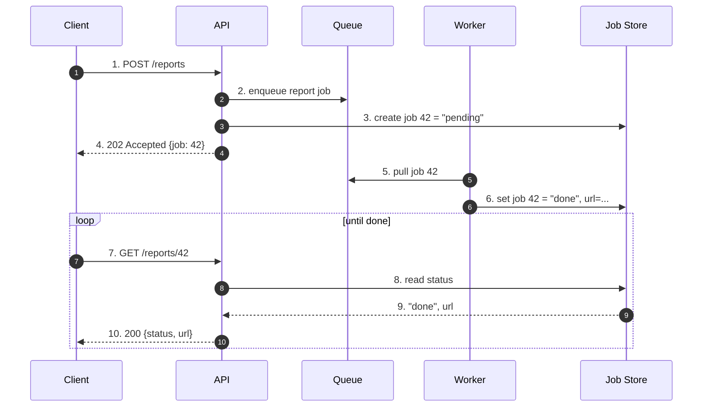

# Background Jobs — Junior Interview Questions

> **Collection:** [System Design](../README.md) · **Level:** Junior · **Section 17 of 42**
> **Goal:** Explain why slow or non-urgent work is pushed off the request path,
> distinguish jobs triggered by *events* from jobs triggered by a *schedule*, describe
> how an asynchronous job hands its result back to the caller, and reason about what
> happens when a job is re-run — because in distributed systems, it will be.

A background job is any unit of work the system does *outside* the request that asked
for it. The user clicks "Generate report," gets an instant "We're working on it,"
and the actual report — which might take 30 seconds — is built by a separate worker.
At the junior level, interviewers want to see that you know *when* to move work to the
background, *how* the result gets back to the user, and that you respect the one rule
that trips up everyone: **a background job can and will run more than once.** Each
question lists **what the interviewer is really probing**, a **model answer**, and
often a **follow-up**.

---

## Contents

1. [Event-Driven Jobs](#1-event-driven-jobs)
2. [Schedule-Driven Jobs (Cron)](#2-schedule-driven-jobs-cron)
3. [Returning Results](#3-returning-results)
4. [Retries & Idempotency](#4-retries--idempotency)
5. [Rapid-Fire Self-Check](#5-rapid-fire-self-check)

---

## 1. Event-Driven Jobs

### Q1.1 — Why move work into a background job instead of doing it in the request?

**Probing:** Do you understand the *latency* and *resilience* motivation, not just "it's faster"?

**Model answer:** Two reasons. **(1) Responsiveness** — the user shouldn't wait for slow,
non-urgent work. When you sign up, the system can return "Account created" in 50 ms
and send the welcome email a moment later in the background; making the user wait for
the email server to respond would be slower and pointless. **(2) Resilience** — if the
email provider is down, a background job can retry without failing the signup. The web
request stays fast and reliable because the heavy or flaky work has been decoupled from it.

**Follow-up:** *"Name three things that belong in a background job."* → Sending email or
push notifications, generating a report or PDF, and transcoding an uploaded video into
multiple resolutions. All are slow, all are tolerable to finish a few seconds late, and
all may need retries.

### Q1.2 — What does "event-driven" mean for a background job?

**Probing:** Can you describe the trigger? An event-driven job starts because *something happened*.

**Model answer:** An event-driven job runs in response to an action somewhere in the
system — a user uploaded a video, an order was placed, a file landed in storage. The
triggering component doesn't run the work itself; it *emits an event* or *enqueues a
message*, and a worker picks it up and processes it. The classic shape is a **queue**:
the web server pushes a "transcode this video" message onto a queue, and a pool of
worker processes pull messages off and do the transcoding. The work happens *as soon as*
a worker is free, not on a clock.

**Follow-up:** *"Why put a queue in the middle instead of calling the worker directly?"*
→ The queue decouples producer from consumer: it absorbs bursts (1,000 uploads in a
second don't overload the workers), it buffers work if all workers are busy or down,
and it lets you scale workers independently of web servers.

### Q1.3 — Walk me through what happens when a user uploads a video.

**Probing:** Mechanical fluency with the enqueue → worker flow.

```mermaid
sequenceDiagram
    autonumber
    participant U as User
    participant API as Web/API Server
    participant Q as Job Queue
    participant W as Worker
    participant S as Storage/DB
    U->>API: 1. POST /videos (upload)
    API->>S: 2. save original file
    API->>Q: 3. enqueue "transcode video 42"
    API-->>U: 4. 202 Accepted (job id 42)
    Note over U,W: request is done; user is not blocked
    W->>Q: 5. pull next job
    Q-->>W: 6. "transcode video 42"
    W->>S: 7. read original, write 480p/720p/1080p
    W->>S: 8. mark video 42 "ready"
```

**Model answer:** The API saves the original file, enqueues a transcode job, and
immediately returns `202 Accepted` with a job id — the user is unblocked in a fraction
of a second. A worker later pulls the job off the queue, produces the resized versions,
and marks the video ready. The expensive work (transcoding) never touches the request
path, so the upload always feels fast even though the full processing takes much longer.

---

## 2. Schedule-Driven Jobs (Cron)

### Q2.1 — What is a schedule-driven (cron) job, and how does it differ from an event-driven one?

**Probing:** The core distinction of this section — *trigger by clock* vs *trigger by event*.

**Model answer:** A schedule-driven job runs on a fixed timetable — every night at 2 AM,
every 5 minutes, on the first of the month — regardless of whether anything happened.
"Cron" is the classic Unix scheduler that popularized this, and the term is now used
generically. An event-driven job runs *because something happened*; a schedule-driven
job runs *because the clock said so*. A nightly job that emails every user their daily
activity summary is schedule-driven; a job that emails *one* user a receipt the instant
they pay is event-driven.

| | Event-driven job | Schedule-driven (cron) job |
|---|---|---|
| **Trigger** | An action/event (upload, order, signup) | A time on the clock (every night, every 5 min) |
| **Latency** | Runs ASAP after the event | Waits until the next scheduled tick |
| **Typical mechanism** | Queue + workers | Cron / scheduler fires the job |
| **Example** | Send receipt when a payment succeeds | Generate the daily sales report at 2 AM |
| **Volume shape** | Follows user activity (bursty) | Predictable, often a big batch |

**Follow-up:** *"Can the two combine?"* → Yes. A cron job at 2 AM might *enqueue* 10,000
"send summary email" messages that the same event-driven worker pool then processes.
The schedule decides *when* the batch starts; the queue handles *how* it's worked through.

### Q2.2 — Give two good uses for a cron job and one thing it's bad at.

**Probing:** Practical judgment about when batching on a clock is the right tool.

**Model answer:** Good uses: a **nightly report** that aggregates the day's orders into a
summary, and **periodic cleanup** — deleting expired sessions or temp files every hour.
Both are non-urgent, naturally batchable, and fine to run on a timetable. What cron is
bad at: **low-latency, per-event reactions.** If a user needs a password-reset email
*now*, you don't wait for the next cron tick — that's an event-driven job. Cron trades
immediacy for predictable, batched, low-overhead processing.

### Q2.3 — You run a cron job on three servers for redundancy. What can go wrong?

**Probing:** Awareness that "schedule on every box" causes duplicate execution.

**Model answer:** All three servers fire the job at 2 AM, so the work runs **three times**
— three copies of every summary email, or a report aggregated three times over. The fix
is to ensure only *one* runs the work: elect a single leader, or have each instance grab
a **distributed lock** ("nightly-report-2026-06-26") before starting and skip if it
can't acquire it. This is the same lesson as idempotency below — in a distributed
system you must plan for the job to be triggered more than once.

**Follow-up:** *"What if the job is slow and the next tick fires before it finishes?"* →
You can get overlapping runs. Guard against it with a lock or a "skip if previous run
still in progress" flag, so a slow job doesn't pile up on top of itself.

---

## 3. Returning Results

### Q3.1 — An async job has no open connection to the user. How does the result get back?

**Probing:** Do you know the result-delivery patterns — polling, webhook/callback, push?

**Model answer:** Because the original request already returned, the job needs a separate
channel to deliver its result. The three common strategies are:

- **Polling** — the job writes its status/result to a store (e.g., a `jobs` row), and the
  client periodically asks `GET /jobs/42` until it sees `"done"` with a result URL.
- **Webhook / callback** — when the job finishes, the *server* calls a URL the client
  registered (e.g., POSTs "video 42 ready" to the client's endpoint). No polling needed.
- **Push to the client** — the server pushes the result over a live connection the user
  already holds, such as WebSocket or Server-Sent Events, so the UI updates instantly.

The job almost always also records its result durably (a row, a file) so it survives even
if the notification is missed.

| Strategy | How result is delivered | Good when | Cost / downside |
|---|---|---|---|
| **Polling** | Client repeatedly asks for status | Simple; client can't receive callbacks | Wasted requests; result is seen late |
| **Webhook / callback** | Server calls client's URL on completion | Server-to-server; client has a public endpoint | Client must host an endpoint; needs retries |
| **Push (WebSocket/SSE)** | Server pushes over a live connection | A user is watching the UI live | Must maintain open connections |

### Q3.2 — Show the polling flow for "generate report."

**Probing:** Can you sketch submit → poll → fetch concretely?



**Model answer:** Submitting returns a job id immediately. The client then polls
`GET /reports/42` on an interval; each poll reads the job's status from the store. While
the worker is busy the status is `"pending"`; once the worker writes `"done"` plus a
download URL, the next poll returns it and the client stops. Polling is the simplest
pattern and needs nothing special on the client, at the cost of some wasted requests and
a small delay between completion and the client noticing.

**Follow-up:** *"How do you avoid hammering the server with polls?"* → Poll on a sensible
interval (e.g., every 2–3 s), use exponential back-off, or switch to a webhook/push so
the client is told rather than having to ask.

### Q3.3 — When would you choose a webhook over polling?

**Probing:** Matching the delivery mechanism to the caller.

**Model answer:** Use a webhook when the caller is another **server** that can host a
public endpoint and you want the result the instant it's ready without wasted polling —
for example, a payment provider POSTing "payment succeeded" to your `/webhooks/payments`
URL. Use polling when the caller is a simple client (a browser, a script) that can't
easily receive an inbound call. The trade-off: webhooks deliver promptly and cheaply but
require the receiver to expose and secure an endpoint and to tolerate **retries**, since
the sender will re-deliver if it doesn't get a 200 — which means the receiver must handle
duplicates.

---

## 4. Retries & Idempotency

### Q4.1 — Why must a background job be ready to run more than once?

**Probing:** The headline lesson — at-least-once delivery is the norm.

**Model answer:** Most queues and schedulers guarantee **at-least-once** delivery, not
exactly-once. A worker might finish the work, then crash *before* acknowledging the
message — so the queue, seeing no ack, hands the same job to another worker. Network
timeouts cause the same thing: the job succeeded, but the caller never heard back and
retries. So a job re-running isn't an edge case; it's the expected behavior. You design
for it rather than hope it doesn't happen.

**Follow-up:** *"Why not just use exactly-once delivery?"* → True exactly-once across a
network is extremely hard and expensive. The practical pattern is **at-least-once
delivery + idempotent jobs**, which gets you the same end result far more simply.

### Q4.2 — What is idempotency, and why does it matter for jobs?

**Probing:** Clear definition plus a concrete example of the danger.

**Model answer:** An operation is **idempotent** if running it twice has the same effect
as running it once. It matters because jobs retry: if "charge the customer $50" runs
twice, you've double-charged them — *not* idempotent and a real bug. If "set order
status to shipped" runs twice, the order is just shipped — idempotent and harmless. The
goal is to design jobs so that a duplicate run is a no-op, so retries are always safe.

**Follow-up:** *"How do you make 'send welcome email' idempotent?"* → Record that the
email was sent (e.g., a `welcome_email_sent_at` flag or a dedup key). On a retry, the job
checks the flag first and skips if it's already set — so the user gets one email, not two.

### Q4.3 — How do you make a payment-charge job safe to retry?

**Probing:** Applying idempotency keys to a money operation.

**Model answer:** Attach an **idempotency key** to the operation — a unique id for *this
specific charge*, generated once and reused on every retry (e.g., `charge-order-42`). The
payment system records the key with the result of the first successful charge. If the
same key arrives again, it returns the original result instead of charging again. So even
if the job runs five times due to retries, the customer is charged exactly once. This is
exactly how real payment APIs (idempotency keys) solve the double-charge problem.

### Q4.4 — A job keeps failing on every retry. What should the system do?

**Probing:** Awareness of retry limits, back-off, and dead-letter queues — not infinite retries.

**Model answer:** Retry, but with limits. Use **exponential back-off** so retries space
out (1 s, 2 s, 4 s…) instead of hammering a struggling dependency. Cap the number of
attempts — after, say, 5 failures the job is clearly not a transient blip. At that point
move it to a **dead-letter queue (DLQ)**: a holding area for jobs that exhausted their
retries, so engineers can inspect and fix them without blocking the main queue. Retrying
forever just burns resources and can turn one bad job into a cascading overload.

**Follow-up:** *"Which failures should you retry and which shouldn't?"* → Retry
**transient** failures (timeout, temporary 503, a deadlock) — they may succeed next time.
Don't retry **permanent** failures (malformed input, "user does not exist," a 400) — they
will fail identically forever, so send them straight to the DLQ.

---

## 5. Rapid-Fire Self-Check

If you can answer each of these in a sentence, you're ready for the junior bar on this section:

- [ ] Two reasons to push work into a background job? *(responsiveness + resilience)*
- [ ] Event-driven vs schedule-driven — what's the trigger for each? *(an event vs the clock)*
- [ ] Why put a queue between the producer and the worker? *(decouple, buffer bursts, scale independently)*
- [ ] One thing cron is bad at? *(low-latency per-event reactions)*
- [ ] What breaks if a cron job runs on three servers at once? *(it runs three times — use a lock/leader)*
- [ ] Three ways an async job returns its result? *(polling, webhook/callback, push)*
- [ ] Polling vs webhook — when do you pick each? *(simple client vs server with an endpoint)*
- [ ] Why must every job tolerate running more than once? *(at-least-once delivery)*
- [ ] What does idempotent mean? *(running twice = same effect as once)*
- [ ] How do you stop a charge job from double-charging? *(idempotency key)*
- [ ] What happens to a job after it exhausts its retries? *(dead-letter queue)*

---

**Next step:** Section 18 — [Concurrency & Coordination](18-concurrency-coordination.md): locks, leader election, and coordinating work across many machines.
