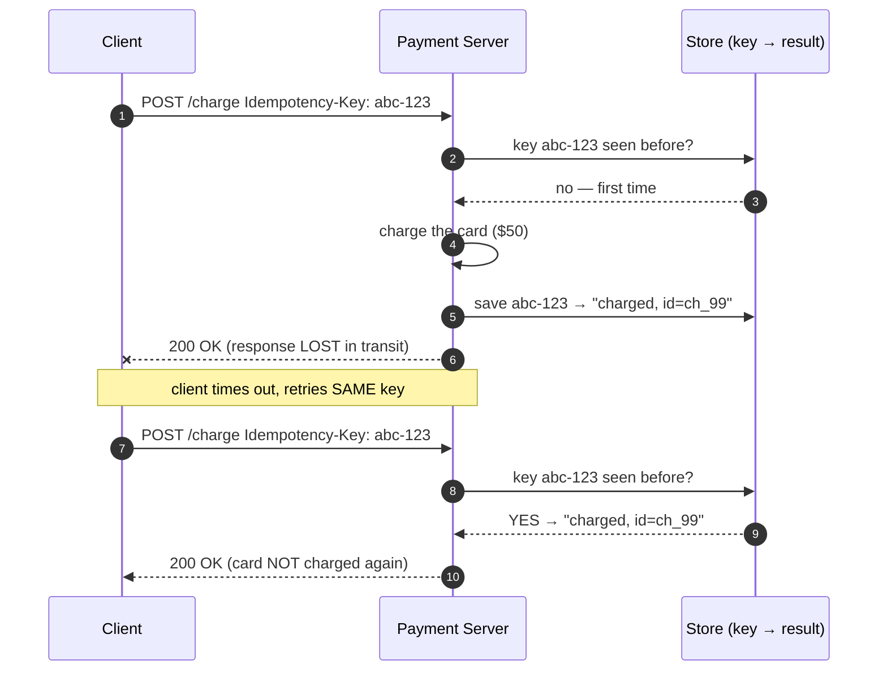
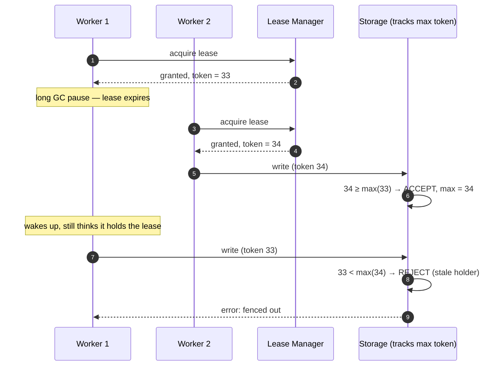

# Concurrency & Coordination — Junior Interview Questions

> **Collection:** [System Design](../README.md) · **Level:** Junior · **Section 18 of 42**
> **Goal:** Show you can reason about what happens when *two things run at once* —
> two workers grabbing one job, a retried request charging a card twice, a stale lock
> holder still writing — and name the standard mechanisms (idempotency keys, fencing
> tokens, locks, coordination services) that make concurrent systems behave correctly.

Almost every hard bug in a distributed system is a *timing* bug: the same message
arrives twice, two nodes both think they're the leader, a request that "failed"
actually succeeded. A junior answer doesn't need to derive consensus from first
principles — it needs to recognize these patterns by name, explain the failure they
prevent with a **concrete** example, and not confuse "I sent it once" with "it ran
once." Each question lists **what the interviewer is really probing**, a **model
answer**, and often a **follow-up**.

---

## Contents

1. [Idempotency Keys](#1-idempotency-keys)
2. [Leases & Fencing](#2-leases--fencing)
3. [Exactly-Once Semantics](#3-exactly-once-semantics)
4. [Optimistic vs Pessimistic Locking](#4-optimistic-vs-pessimistic-locking)
5. [Coordination Services](#5-coordination-services)
6. [Rapid-Fire Self-Check](#6-rapid-fire-self-check)

---

## 1. Idempotency Keys

### Q1.1 — What does "idempotent" mean, and why do APIs need it?

**Probing:** Do you understand that retries are *normal*, not exceptional?

**Model answer:** An operation is **idempotent** if performing it many times has the
same effect as performing it once. `GET /user/42` is naturally idempotent — reading
twice changes nothing. The problem is *writes*: `POST /charge $50` performed twice
charges $100. APIs need idempotency because networks lose responses. A client sends a
charge, the server processes it, but the `200 OK` is lost on the way back. The client
can't tell "the charge failed" from "the charge succeeded but the reply vanished," so
it **retries** — and without protection, the customer is charged twice.

**Follow-up:** *"Which HTTP methods are idempotent by spec?"* → `GET`, `PUT`, and
`DELETE` are defined as idempotent; `POST` is not, which is exactly why `POST`
endpoints that move money or create resources need an explicit idempotency key.

### Q1.2 — How does an idempotency key actually prevent a double charge?

**Probing:** Mechanical understanding, not just the vocabulary.

**Model answer:** The client generates a unique key (a UUID) **once per logical
operation** and sends it with every attempt — including retries — usually in a header
like `Idempotency-Key`. The server stores that key with the result of the first
successful execution. On any later request with the same key, the server *skips
re-executing* and returns the stored result instead.

The card is touched exactly once; the retry safely returns the original result.

**Follow-up:** *"Where should the key be generated — client or server?"* → The
**client**, before the first attempt, so all retries of the same intent carry the
same key. If the server generated it, each retry would look like a brand-new request.

### Q1.3 — A junior writes: "I'll just check if a charge with this amount exists first."
Why is that not real idempotency?

**Probing:** The difference between a fragile heuristic and a correct guarantee.

**Model answer:** Two failures. **(1)** It's racy — two retries can both run the
"check" before either runs the "insert," so both see "no charge yet" and both proceed.
**(2)** It's ambiguous — a customer who legitimately buys the same $50 item twice is
indistinguishable from a retry. A real idempotency key ties dedup to the *specific
intent* (this exact request), stored atomically (a unique constraint on the key, so
the database rejects the duplicate), not to coincidental field values.

### Q1.4 — How long should the server remember an idempotency key?

**Probing:** Awareness that keys cost storage and have a useful lifetime.

**Model answer:** Long enough to cover the client's realistic retry window — minutes
to a day is typical (Stripe, for example, retains keys for 24 hours). Storing keys
forever wastes space and serves no purpose, since no sane client retries a request
from last month. The TTL is a trade-off: too short and a slow retry re-executes; too
long and you pay to remember keys nobody will ever resend.

---

## 2. Leases & Fencing

### Q2.1 — What is a lease, and how is it different from a plain lock?

**Probing:** Do you know that a lock without a timeout is a liability in a distributed system?

**Model answer:** A **lease** is a lock with an expiration. Instead of "I hold this
until I release it," a lease says "I hold this until time T unless I renew it." This
matters because the lock holder might *crash* — if a plain lock had no timeout, a
dead node would hold it forever and nobody else could make progress. A lease
auto-expires, so the resource frees itself even if the holder vanishes. The holder
must periodically **renew** (heartbeat) to keep it.

**Follow-up:** *"What's the danger if the lease is too short?"* → A slow-but-alive
holder can have its lease expire mid-work; the system thinks it's dead and hands the
lease to someone else, producing two active holders — exactly the situation fencing
exists to make safe.

### Q2.2 — A worker holds a lease, pauses for a long GC, and its lease expires. Another worker takes over. Now the first worker wakes up and writes. What goes wrong, and how does fencing fix it?

**Probing:** The classic split-brain write, and the fix. This is the heart of the topic.

**Model answer:** The first worker doesn't *know* its lease expired — from its point
of view it just paused. It wakes up and writes to the shared resource, but the lease
now belongs to worker 2. Two writers are active; the resource can be corrupted (e.g.,
both write a file, or both process the same job). **Fencing tokens** fix this: every
time the lease is granted, the coordinator attaches a monotonically increasing number
(the token). The protected resource (storage) **remembers the highest token it has
seen and rejects any write carrying a lower one.**

Worker 1's stale write is rejected because its token 33 is below the 34 the storage
has already seen. The resource itself enforces "only the newest holder wins" — no
timing assumption required.

**Follow-up:** *"Why does the check have to live at the resource, not at the worker?"*
→ Because the stale worker believes it's valid; it can't fence itself. Only the
resource sees the global order of tokens, so the rejection must happen there.

### Q2.3 — Why must the fencing token be monotonically increasing?

**Probing:** The single property that makes fencing work.

**Model answer:** Monotonicity gives a *total order* of who-came-later. If token 34
was issued after token 33, then "reject anything below the max I've seen" reliably
means "reject anyone older than the current holder." If tokens could repeat or go
backward, the resource couldn't tell an old holder from a new one, and the whole
guarantee collapses. A coordination service like ZooKeeper or etcd can hand out such
ever-increasing numbers for exactly this purpose.

---

## 3. Exactly-Once Semantics

### Q3.1 — Define at-most-once, at-least-once, and exactly-once delivery.

**Probing:** Precise vocabulary — juniors blur these constantly.

**Model answer:**

| Guarantee | What it means | Risk |
|---|---|---|
| **At-most-once** | Send and forget; never retry | Message may be **lost** |
| **At-least-once** | Retry until acknowledged | Message may be **duplicated** |
| **Exactly-once** | Effect happens once, no loss, no dup | Hardest to achieve |

The key insight: there's an inherent tension. To avoid *loss* you must retry, but
retrying risks *duplicates*. Most real systems pick **at-least-once delivery** (accept
duplicates) and then make the *processing* idempotent, so a duplicate has no
additional effect.

### Q3.2 — Is true "exactly-once delivery" actually possible over a network?

**Probing:** Do you understand the famous "exactly-once is a myth" nuance?

**Model answer:** Exactly-once *delivery* — the network physically transmitting a
message once and only once with no retransmits — is generally **not** achievable,
because the sender can never be sure an acknowledgement was lost vs. the message was
lost, so it must sometimes resend. What systems *do* achieve is exactly-once
**processing** (or "effectively-once"): combine **at-least-once delivery** with
**idempotent handling or deduplication** so that even if a message arrives twice, its
effect is applied once. So the honest answer is: "Exactly-once delivery, no.
Exactly-once *effect*, yes — by deduping on the consumer side."

**Follow-up:** *"How does that connect to idempotency keys?"* → They're the same idea
in different clothes: an idempotency key is the dedup mechanism that turns
at-least-once delivery into an exactly-once effect.

### Q3.3 — A job queue redelivers a "send welcome email" task because the first worker died after sending but before acking. How do you avoid two emails?

**Probing:** Applying dedup to a concrete at-least-once scenario.

**Model answer:** The queue is at-least-once: if a worker doesn't ack within the
visibility timeout, the task is redelivered — and it *will* sometimes redeliver a task
whose side effect already happened. To make it effectively-once, dedup on a stable id:
record "email for `user=42, type=welcome`" in a table with a unique constraint
*before or atomically with* sending, and check it on every delivery. The second
delivery sees the marker and skips. The general rule: with at-least-once queues, the
**consumer must be idempotent**, because the queue cannot promise single delivery.

---

## 4. Optimistic vs Pessimistic Locking

### Q4.1 — Explain optimistic vs pessimistic locking with one concrete example.

**Probing:** The central trade-off — coordination cost vs. conflict cost.

**Model answer:** Both protect a shared row from being clobbered by concurrent
updates; they differ in *when* they pay the cost.

| | Pessimistic locking | Optimistic locking |
|---|---|---|
| **Assumption** | Conflicts are likely | Conflicts are rare |
| **Mechanism** | Lock the row *before* reading/writing (`SELECT … FOR UPDATE`) | Read freely; check a **version** at write time |
| **On conflict** | Others *wait* (blocked) | Writer *fails* and retries |
| **Cost** | Lock contention, risk of deadlock | Wasted work on retry |
| **Best when** | High contention, short critical section | Low contention, long think-time |

**Example — editing a wiki page.** *Pessimistic:* when Ann opens the page to edit, lock
it; Bob can't edit until she saves — safe, but Bob is blocked, maybe for an hour.
*Optimistic:* both open version 7 freely; Ann saves first and the row becomes version
8; when Bob saves, his "update where version = 7" matches zero rows, so he's told "the
page changed, please reload." Nobody was blocked; the loser just retries.

### Q4.2 — How does optimistic locking detect a conflict mechanically?

**Probing:** The version-number / compare-and-set mechanism.

**Model answer:** Keep a `version` (or timestamp) column on the row. Read the row and
remember its version. When writing, issue a conditional update:
`UPDATE … SET data=?, version = version + 1 WHERE id = ? AND version = <the version I read>`.
If someone else updated the row in between, its version no longer matches, the
`WHERE` clause matches **zero rows**, and you know you lost the race — reload and
retry. This is a **compare-and-set**: the update only applies if nothing changed
underneath you. No locks are held during the user's think-time.

**Follow-up:** *"What if you ignore the 'zero rows updated' result?"* → You silently
overwrite the other person's change — the **lost update** problem, which is the exact
bug optimistic locking exists to catch.

### Q4.3 — When is pessimistic locking the right call despite blocking?

**Probing:** Knowing optimistic isn't a universal default.

**Model answer:** When conflicts are *frequent* and retrying is expensive or unfair. If
a hot resource — say, the last seat on a flight — has hundreds of buyers per second,
optimistic locking degenerates into a retry storm where almost everyone fails and
tries again, wasting work. A short pessimistic lock serializes the contenders cleanly:
one buyer at a time, briefly, no thundering retries. The guideline: **low contention →
optimistic; high contention on a short critical section → pessimistic.**

---

## 5. Coordination Services

### Q5.1 — What problem do ZooKeeper, etcd, and Consul solve?

**Probing:** Why a *separate* system exists just to coordinate.

**Model answer:** They are **coordination services**: small, strongly-consistent,
highly-available stores that a cluster of machines uses to agree on shared truth —
*who is the leader, who is alive, what is the current config, who holds this lock.*
Distributed agreement is hard and easy to get subtly wrong, so rather than each app
re-implementing consensus, they offload it to a service built for exactly this. They
hold a small amount of critical metadata reliably; they are **not** general-purpose
databases for bulk data.

| Service | Often associated with |
|---|---|
| **ZooKeeper** | Kafka, Hadoop, HBase (older Java ecosystem) |
| **etcd** | Kubernetes' backing store |
| **Consul** | Service discovery + health checking (HashiCorp) |

### Q5.2 — Name two concrete things teams use a coordination service for.

**Probing:** Translating the abstraction into real uses.

**Model answer:** **(1) Leader election** — out of N replicas, exactly one must be the
active leader; the service lets them race to create a single special key, and whoever
wins is leader. If the leader dies, its **ephemeral** entry disappears and a new
election happens. **(2) Distributed locks / config** — a service can grant a lease on a
lock (and hand out a **fencing token** with it) so only one worker processes a job, or
it can store config that all nodes watch so a change propagates instantly. Service
**discovery** (which instances of service X are healthy right now) is a third common
use, especially with Consul.

**Follow-up:** *"What's an ephemeral node?"* → An entry tied to a client's live
session; when that client's heartbeat stops (it crashed or disconnected), the entry is
automatically deleted. That auto-cleanup is what makes leader election and liveness
detection work.

### Q5.3 — Why are these services deliberately built to favor consistency over availability?

**Probing:** Connecting coordination to the CAP trade-off at a junior level.

**Model answer:** Because the *whole point* is to be the single source of truth.
There must never be two leaders or two answers to "who holds the lock." So when a
network partition forces the classic choice, these systems **sacrifice availability to
preserve consistency** (they're CP): the minority side stops answering rather than
risk disagreeing with the majority. They use a consensus protocol — **Raft** (etcd,
Consul) or **ZAB** (ZooKeeper) — and require a **majority quorum** to make decisions,
which is why they're typically run as an odd-numbered cluster of 3 or 5 nodes.

**Follow-up:** *"Why an odd number like 3 or 5?"* → A majority of 3 is 2 and of 5 is
3; an odd count gives a clear majority and tolerates the most failures per node added
(3 tolerates 1 down, 5 tolerates 2). An even number wastes a node — 4 also only
tolerates 1 failure, same as 3.

### Q5.4 — Why not just use your main database for locks and leader election?

**Probing:** Understanding what coordination services add over a plain DB.

**Model answer:** You *can* for simple cases, but coordination services provide
features a vanilla database lacks: **ephemeral keys** that vanish on client death
(automatic liveness cleanup), **watches** that push notifications when a value changes
(no polling), built-in **monotonic counters** for fencing tokens, and a consensus core
tuned to stay correct under partition. Bolting all of that onto a general database is
error-prone; these services package the hard parts correctly. The trade-off is one
more critical system to run — so use them when you genuinely need cluster-wide
coordination, not for ordinary application data.

---

## 6. Rapid-Fire Self-Check

If you can answer each of these in a sentence, you're ready for the junior bar on this section:

- [ ] What does *idempotent* mean, and why do retries make it necessary? *(same effect repeated; networks lose responses → clients retry)*
- [ ] Who generates the idempotency key and when? *(the client, once per intent, reused on every retry)*
- [ ] What is a lease, and how does it differ from a plain lock? *(a lock with an expiry, so a dead holder frees it)*
- [ ] What does a fencing token prevent, and why must it increase monotonically? *(a stale holder's write; so the resource can order holders and reject the older)*
- [ ] At-most-once vs at-least-once vs exactly-once — which do real systems usually build, and how? *(at-least-once delivery + idempotent processing)*
- [ ] Is exactly-once *delivery* possible? *(no — but exactly-once *effect* is, via dedup)*
- [ ] Optimistic vs pessimistic locking — when do you pick each? *(low contention → optimistic; high contention/short section → pessimistic)*
- [ ] How does optimistic locking detect a conflict? *(version column + conditional update matching zero rows)*
- [ ] Name a coordination service and one thing it's used for. *(etcd/ZooKeeper/Consul — leader election, locks, discovery)*
- [ ] Why do coordination services favor consistency over availability? *(they're the single source of truth — two leaders is worse than no answer)*

---

**Next step:** Section 19 — [Building Blocks](19-building-blocks.md): the reusable
components (load balancers, caches, queues, gateways) you assemble every design from.
