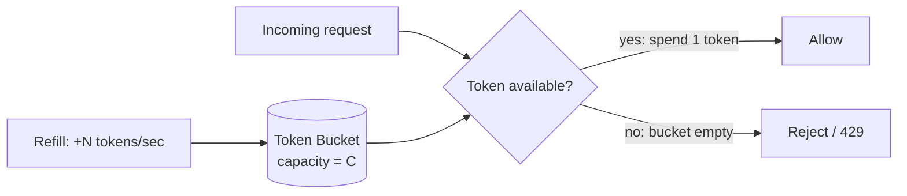
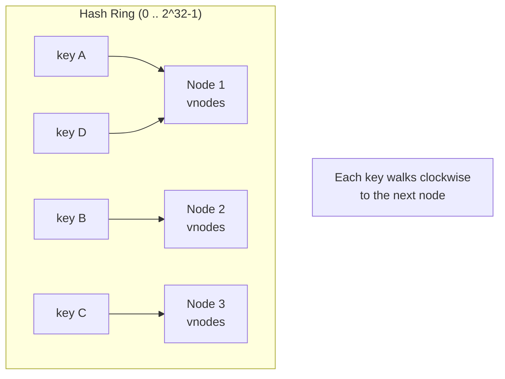
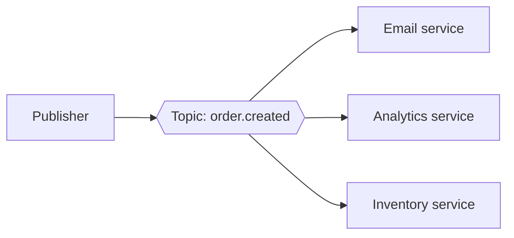

# Building Blocks — Junior Interview Questions

> **Collection:** [System Design](../README.md) · **Level:** Junior · **Section 19 of 42**
> **Goal:** Recognize the dozen-or-so reusable components that show up in almost every
> system design interview — rate limiters, ID generators, queues, caches, locks — and
> explain how each one works, why it exists, and the one trade-off the interviewer is
> waiting to hear.

Most "design X" interviews are really "assemble these building blocks correctly."
A junior is expected to *name* the right component, *sketch* how it works internally,
and *state its core trade-off* without bluffing. Each question below gives **what the
interviewer is really probing**, a **model answer**, and often a **follow-up** they'll
reach for next. Keep answers concrete: name the algorithm, the data structure, the
failure mode.

---

## Contents

1. [Rate Limiter](#1-rate-limiter)
2. [Consistent Hashing](#2-consistent-hashing)
3. [Unique ID Generator](#3-unique-id-generator)
4. [Distributed Key-Value Store](#4-distributed-key-value-store)
5. [Distributed Cache](#5-distributed-cache)
6. [Distributed Message Queue](#6-distributed-message-queue)
7. [Pub-Sub System](#7-pub-sub-system)
8. [Blob / Object Store](#8-blob--object-store)
9. [Distributed Search / Typeahead](#9-distributed-search--typeahead)
10. [Distributed Task Scheduler](#10-distributed-task-scheduler)
11. [Distributed Lock](#11-distributed-lock)
12. [Distributed Logging](#12-distributed-logging)
13. [Sharded Counters / Leaderboard](#13-sharded-counters--leaderboard)
14. [Rapid-Fire Self-Check](#14-rapid-fire-self-check)

---

## 1. Rate Limiter

### Q1.1 — Compare token bucket, leaky bucket, fixed window, and sliding window.

**Probing:** Do you know there are several algorithms and that they differ in how they treat *bursts*?

**Model answer:** A rate limiter caps how many requests a client may make in a time
window, protecting a service from abuse and overload. The four classic algorithms trade
burst tolerance against memory and smoothness:

| Algorithm | How it works | Bursts? | Memory | Gotcha |
|---|---|---|---|---|
| **Token bucket** | Bucket refills *N* tokens/sec; each request spends one | Allows bursts up to bucket size | Tiny (count + timestamp) | Tuning bucket size vs rate |
| **Leaky bucket** | Requests queue and drain at a fixed rate | No — smooths output | Queue length | Adds latency; queue can fill |
| **Fixed window** | Count requests per fixed clock window (e.g., per minute) | Yes, at window edges | Tiny | 2x burst across the boundary |
| **Sliding window log** | Keep timestamps; count those within the last window | Accurate, no edge spike | O(requests) | Memory grows with traffic |

The most common interview answer is **token bucket** — it's cheap (a counter and a
last-refill timestamp), allows controlled bursts, and is what most API gateways use.

**Follow-up:** *"Why does the fixed window leak at the boundary?"* → If the limit is 100/min,
a client can send 100 at 0:59 and another 100 at 1:00 — 200 requests in ~2 seconds.
Sliding window fixes this by counting over a rolling interval, not a reset-at-the-minute clock.

### Q1.2 — Where do you put the rate limiter, and what does it return when it blocks?

**Probing:** Placement and protocol correctness.

**Model answer:** Put it at the **edge** — API gateway or a middleware in front of the
service — so bad traffic is rejected before it touches expensive backends. State (the
counters) usually lives in a fast shared store like **Redis** so all gateway instances
agree on a client's count. When blocking, return **HTTP 429 Too Many Requests** with a
`Retry-After` header so well-behaved clients back off instead of hammering.

---

## 2. Consistent Hashing

### Q2.1 — What problem does consistent hashing solve that `hash(key) % N` does not?

**Probing:** The core motivation — minimizing remapping when the cluster resizes.

**Model answer:** With `hash(key) % N`, adding or removing one node changes `N`, so
*almost every* key remaps to a different node — a cache stampede or a massive data
reshuffle. **Consistent hashing** places both keys and nodes on a hash ring; a key is
owned by the next node clockwise. When a node joins or leaves, only the keys in its
immediate arc move — on average **K/N keys**, not all of them. That's the whole point:
graceful scaling and failure.

**Follow-up:** *"What are virtual nodes for?"* → Without them, three physical nodes split
the ring into three arcs that are almost never equal, so load is lopsided. Giving each
physical node many **virtual nodes** (e.g., 100–200 points scattered on the ring) averages
out the arcs, smoothing load distribution and making rebalancing finer-grained when a node leaves.

---

## 3. Unique ID Generator

### Q3.1 — Compare UUID, Snowflake, and a ticket server for generating IDs at scale.

**Probing:** Do you know the trade-off triangle: coordination-free vs sortable vs compact?

**Model answer:** All three produce unique IDs across many machines, but differ in
*sortability*, *size*, and whether they need coordination:

| Approach | Size | Sortable by time? | Coordination | Note |
|---|---|---|---|---|
| **UUID v4** | 128-bit | No (random) | None — generate anywhere | Simple, but big and not index-friendly |
| **Snowflake** | 64-bit | Yes (time-prefixed) | Needs unique worker ID + clock | Twitter's design; compact & sortable |
| **Ticket server** | 64-bit | Yes (incrementing) | Central counter (single point) | Simple, but the server is a bottleneck/SPOF |

**Snowflake** is the usual senior-favored answer: a 64-bit integer packing
`timestamp | datacenter/worker id | per-ms sequence`. It's compact, roughly time-sortable
(great for database index locality), and needs no central coordinator at request time.

**Follow-up:** *"What can break Snowflake?"* → **Clock skew.** Because the high bits are a
timestamp, if a machine's clock jumps backward (NTP correction), it can mint IDs that
collide with or sort before earlier ones. Mitigations: refuse to generate while the clock
is behind the last-seen timestamp, and ensure every worker has a unique worker ID.

---

## 4. Distributed Key-Value Store

### Q4.1 — Explain quorum reads and writes (the R + W > N rule).

**Probing:** Can you reason about tunable consistency over replicas?

**Model answer:** Data is replicated to **N** nodes. A write succeeds once **W** replicas
acknowledge it; a read queries **R** replicas and takes the freshest answer. If you choose
**R + W > N**, the read set and write set are guaranteed to overlap by at least one node,
so a read always sees the latest acknowledged write — *strong consistency* over the
quorum. Tuning these is a latency/consistency dial:

- **W = N** → durable writes but slow, and unavailable if any replica is down.
- **W = 1** → fast writes, weaker durability.
- **R + W > N** (e.g., N=3, R=2, W=2) → the common balanced choice.

**Follow-up:** *"What if R + W ≤ N?"* → Reads may miss the latest write and return stale
data — *eventual consistency*. That's an acceptable choice for things like a shopping
cart or a profile view where speed matters more than reading your own write instantly.

---

## 5. Distributed Cache

### Q5.1 — How do you spread cache data across many nodes, and what's a "hot key"?

**Probing:** Sharding awareness plus the classic skew failure mode.

**Model answer:** A distributed cache (Redis/Memcached cluster) **shards** keys across
nodes, usually by **consistent hashing**, so each node holds a slice of the keyspace and
total capacity scales with node count. A **hot key** is a single key — say the cache entry
for a celebrity's profile during a viral moment — that receives a disproportionate share
of traffic. Because all requests for that key hash to *one* node, that node saturates
while the rest sit idle; sharding doesn't help because the heat is on a single key.

**Follow-up:** *"How do you fix a hot key?"* → **Replicate the hot entry** to multiple
nodes and read from a random replica, and/or add a small **local (in-process) cache** in
front of the distributed cache so repeated reads never leave the app server. You can also
**split the key** (e.g., `profile:123#0..9`) to fan the load across shards.

---

## 6. Distributed Message Queue

### Q6.1 — What guarantees does a message queue give around ordering and delivery?

**Probing:** Does the candidate know ordering is *partition-scoped*, not global?

**Model answer:** A message queue decouples producers from consumers: the producer drops
a message and moves on; consumers pull and process at their own pace, which absorbs spikes
and lets you scale consumers independently. Two facts a junior must get right:

- **Ordering is per-partition, not global.** Systems like Kafka guarantee order only
  *within* a partition. To keep related events ordered (e.g., one user's actions), route
  them to the same partition via a partition key.
- **Delivery is usually "at-least-once."** A consumer may see the same message twice (e.g.,
  it crashed after processing but before acknowledging), so consumers must be **idempotent**.

**Follow-up:** *"What's a dead-letter queue (DLQ)?"* → A separate queue where messages go
after they fail processing too many times. Instead of blocking the main queue or being
silently dropped, poison messages are parked in the DLQ for later inspection, alerting,
or manual replay — keeping the main pipeline flowing.

---

## 7. Pub-Sub System

### Q7.1 — How does pub-sub differ from a point-to-point message queue?

**Probing:** Fan-out semantics — one message, many independent consumers.

**Model answer:** In a **point-to-point queue**, each message is consumed by exactly one
worker — it's about distributing *work*. In **pub-sub**, a publisher sends to a **topic**
and *every* subscriber gets its own copy — it's about distributing *events* (fan-out).
The publisher doesn't know or care who is listening, which decouples producers from a
growing, changing set of consumers.

**Follow-up:** *"What happens if a subscriber is slow or offline?"* → A durable pub-sub
system (like Kafka with consumer groups, or Google Pub/Sub) buffers messages and tracks
each subscriber's read position (offset) independently, so a slow consumer falls behind
without affecting the others, and an offline one catches up when it returns.

---

## 8. Blob / Object Store

### Q8.1 — How would you design storage for large files like videos or images?

**Probing:** Knowing not to put blobs in a relational DB, plus chunking and metadata split.

**Model answer:** Large binary files go in an **object store** (e.g., S3-style), *not* in a
relational database, which is bad at multi-megabyte rows. The pattern is to split storage
into two parts: the **blob data** itself (the bytes) and a **metadata** record in a
database (filename, size, owner, content-type, and the storage key/location). The DB stays
small and queryable; the object store handles the bulk bytes cheaply and durably.

**Follow-up:** *"Why chunk large uploads?"* → Splitting a big file into fixed-size **chunks**
lets you upload in parallel, **resume** after a network drop without restarting from zero,
and **deduplicate** identical chunks across files. Each chunk is stored and addressed
independently; the metadata stitches them back into the logical file.

---

## 9. Distributed Search / Typeahead

### Q9.1 — What data structure powers full-text search, and what powers typeahead?

**Probing:** Inverted index vs trie — matching the structure to the query shape.

**Model answer:** **Full-text search** uses an **inverted index**: a map from each term to
the list of documents containing it (`"design" → [doc3, doc7, doc9]`). To answer a query
you intersect the posting lists of the query terms — far faster than scanning every
document. **Typeahead / autocomplete** uses a **trie** (prefix tree): characters form a
path from the root, so all completions of a prefix live in one subtree, retrievable in
time proportional to the prefix length.

**Follow-up:** *"How do you rank the top 5 suggestions for a prefix?"* → Precompute and
cache, at each trie node, the top-K most-popular completions for that prefix (by search
frequency). A keystroke then returns the cached top-K instantly instead of walking the
whole subtree on every request.

---

## 10. Distributed Task Scheduler

### Q10.1 — How do you run cron-style jobs across many servers without double-firing?

**Probing:** The coordination problem — exactly one worker runs each scheduled job.

**Model answer:** A naive "cron on every box" fires each job N times. A distributed
scheduler stores jobs in a shared store (DB) with a `next_run_at` time, and workers poll
for due jobs. The trick to avoid double execution is **leasing**: a worker atomically
*claims* a due job by setting an owner and a lease expiry (e.g., via a conditional update
or `SELECT ... FOR UPDATE`). Only one worker wins the claim; the others skip it.

**Follow-up:** *"What if the worker that leased a job crashes?"* → The **lease expires.**
Because the claim has a timeout rather than being permanent, once the lease lapses another
worker can re-claim and run the job — so a crash doesn't strand the task forever. Jobs
should still be **idempotent** in case the crash happened mid-execution.

---

## 11. Distributed Lock

### Q11.1 — What is a fencing token, and why isn't a lock with a TTL enough on its own?

**Probing:** The subtle correctness bug in naive distributed locks.

**Model answer:** A distributed lock grants one client exclusive access to a resource
across machines, typically by setting a key with a TTL in Redis or a node in ZooKeeper.
The TTL prevents a crashed holder from locking forever. But TTLs create a hazard: a client
can hold the lock, **pause** (GC, network stall) past the TTL, lose the lock to someone
else, then **wake up and act as if it still holds it** — two clients writing at once.

A **fencing token** fixes this: the lock service hands out a monotonically increasing
number with each grant. The protected resource records the highest token it has seen and
**rejects any write carrying a smaller token.** The stale client's delayed write arrives
with an old token and is refused.

**Follow-up:** *"What's Redlock and why is it debated?"* → Redlock acquires the lock on a
majority of independent Redis nodes for fault tolerance. It's debated because, under clock
drift and pauses, it still can't guarantee mutual exclusion *without* fencing tokens — so
for correctness-critical sections you need the fencing token regardless of the lock backend.

---

## 12. Distributed Logging

### Q12.1 — Walk through the pipeline that collects logs from thousands of servers.

**Probing:** Ingestion → buffer → index → store, and why you don't write logs straight to a DB.

**Model answer:** Each server runs a lightweight **agent** that ships log lines to a
central pipeline. The agents feed a **buffer/queue** (e.g., Kafka) so a spike in logging
doesn't overwhelm downstream systems. A processing layer parses and **indexes** the logs
(by timestamp, service, level, trace ID) into a search store like Elasticsearch, while the
raw logs are archived cheaply (object storage). The decoupling via the queue is the key
design move: it absorbs bursts and lets indexing scale independently of ingestion.

**Follow-up:** *"Logging volume is too expensive — what do you do?"* → **Sampling.** Keep
all `ERROR` logs but retain only, say, 1% of `INFO`/`DEBUG`; or use head/tail-based
sampling that keeps every log for traces that errored. You can also tier retention: search
the last 7 days hot, archive older logs to cold storage. This trades total visibility for
a large cost reduction.

---

## 13. Sharded Counters / Leaderboard

### Q13.1 — A "like" counter on a viral post gets thousands of increments per second. What breaks?

**Probing:** Write contention on a single row, and how sharding the counter fixes it.

**Model answer:** A single `UPDATE posts SET likes = likes + 1` row becomes a **hot row**:
every increment must serialize on the same lock, so concurrent writers queue up and
throughput collapses. The fix is a **sharded counter**: split the count into *M* sub-counters
(`likes_shard_0 .. likes_shard_M`). Each increment goes to a random shard, spreading the
write contention across *M* rows. The displayed total is the **sum of all shards**, computed
on read (and usually cached). You trade a cheap read-side aggregation for a huge gain in
write concurrency.

**Follow-up:** *"How would you build a top-10 leaderboard?"* → Use a **Redis sorted set**
(`ZSET`): scores update in O(log N), and `ZREVRANGE 0 9` returns the top 10 directly.
For massive scale, shard players across multiple sorted sets and merge the per-shard
top-K to assemble the global leaderboard.

---

## 14. Rapid-Fire Self-Check

If you can answer each of these in a sentence or two, you're at the junior bar for this section:

- [ ] Which rate-limiter algorithm allows controlled bursts cheaply? *(token bucket)*
- [ ] Why does `hash(key) % N` hurt when you add a node? *(almost every key remaps)*
- [ ] What do virtual nodes fix in consistent hashing? *(uneven load between physical nodes)*
- [ ] Snowflake vs UUID — which is sortable and compact, and what breaks it? *(Snowflake; clock skew)*
- [ ] State the quorum rule for strong consistency. *(R + W > N)*
- [ ] What is a hot key and one way to fix it? *(skewed single-key load; replicate / local cache)*
- [ ] Message-queue ordering is guaranteed at what scope? *(per partition, not global)*
- [ ] Queue vs pub-sub — one message goes to how many consumers? *(one vs every subscriber)*
- [ ] Why split blob bytes from metadata? *(DB stays small/queryable; object store holds bulk)*
- [ ] Inverted index vs trie — which powers search vs typeahead?
- [ ] How does a scheduler avoid double-firing a cron job? *(leasing with expiry)*
- [ ] Why do you need a fencing token even with a TTL lock? *(stale paused holder can still write)*
- [ ] How do you cut logging cost without going blind? *(sampling + tiered retention)*
- [ ] Why shard a like-counter? *(avoid single-row write contention)*

---

**Next step:** Section 20 — [Reliability Patterns](20-reliability-patterns.md): retries, timeouts, circuit breakers, and designing for partial failure.
