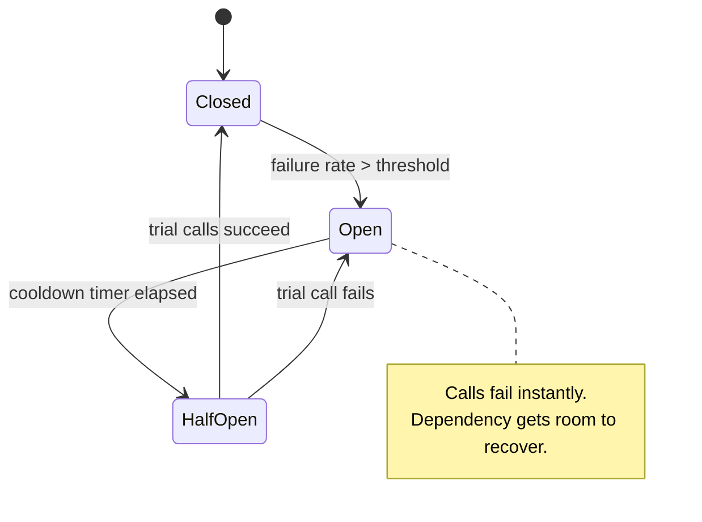

# Reliability Patterns — Junior Interview Questions

> **Collection:** [System Design](../README.md) · **Level:** Junior · **Section 20 of 42**
> **Goal:** Recognize the named patterns that keep a distributed system standing when
> dependencies fail — circuit breakers, bulkheads, retries, throttling, health checks,
> leader election, compensation, deployment stamps, and load leveling — and explain
> *which failure each one prevents* with a concrete example.

A "junior" answer here is not a shallow answer — it is a *correct, concrete, and
honest* one. Reliability patterns all answer the same underlying question: *what does
my system do when something it depends on is slow, broken, or overloaded?* Interviewers
are checking that you reach for the right named pattern, can say what it protects
against, and know its cost. Each question below lists **what the interviewer is really
probing**, a **model answer**, and often a **follow-up** they will likely ask next.

---

## Contents

1. [Circuit Breaker](#1-circuit-breaker)
2. [Bulkhead](#2-bulkhead)
3. [Retry (with Backoff & Jitter)](#3-retry-with-backoff--jitter)
4. [Throttling & Load Shedding](#4-throttling--load-shedding)
5. [Health Endpoint Monitoring](#5-health-endpoint-monitoring)
6. [Leader Election](#6-leader-election)
7. [Compensating Transaction](#7-compensating-transaction)
8. [Deployment Stamps & Geodes](#8-deployment-stamps--geodes)
9. [Queue-Based Load Leveling](#9-queue-based-load-leveling)
10. [Rapid-Fire Self-Check](#10-rapid-fire-self-check)

---

## 1. Circuit Breaker

### Q1.1 — What problem does a circuit breaker solve?

**Probing:** Do you understand it stops *cascading* failure, not the original failure?

**Model answer:** When a downstream dependency (say, a payments API) starts failing or
timing out, every caller that keeps retrying it piles up threads and connections waiting
on something that won't answer. Those waiting threads exhaust the caller's own resources,
so the caller fails too — the failure *cascades* upstream. A circuit breaker watches the
error/timeout rate to a dependency and, once it crosses a threshold, **trips open**:
calls fail *immediately* without even attempting the dead dependency. This frees the
caller's resources, gives the dependency room to recover, and lets you serve a fast,
degraded response instead of hanging.

**Follow-up:** *"How is this different from a retry?"* → A retry tries *harder*; a
circuit breaker tries *less* — it stops calling so the system can recover. They are
complementary: retry handles a single transient blip, the breaker handles a sustained
outage.

### Q1.2 — Explain the three states of a circuit breaker.

**Probing:** Can you describe the state machine and the transitions?

**Model answer:** A circuit breaker has three states:

- **Closed** — normal operation; calls pass through. Failures are counted.
- **Open** — too many recent failures; calls are rejected instantly (fail fast). After
  a cooldown timer, it moves to half-open.
- **Half-Open** — a *trial* state; a limited number of test calls are allowed through. If
  they succeed, the breaker closes (recovered); if they fail, it re-opens and waits again.



**Follow-up:** *"Why have a half-open state at all — why not just close after the
timer?"* → Because the timer expiring doesn't mean the dependency recovered. Half-open
sends a *small probe* of real traffic; if you blindly closed, you'd slam the still-broken
dependency with full load and trip again immediately.

### Q1.3 — Give a concrete example where a circuit breaker improves user experience.

**Model answer:** An e-commerce product page calls a "recommended items" service. If that
service goes down, without a breaker every page load hangs for the full timeout (say
30 s) before rendering — the *whole page* feels broken. With a breaker, after a few
failures it trips open and recommendation calls return instantly with an empty result,
so the page renders in normal time, just without the recommendations carousel. The core
purchase flow stays fast; only a non-critical feature degrades. That's **graceful
degradation** enabled by the breaker.

---

## 2. Bulkhead

### Q2.1 — What is the bulkhead pattern, and where does the name come from?

**Probing:** Do you grasp *isolation* of resource pools?

**Model answer:** The name comes from ships: a hull is divided into watertight
**bulkhead** compartments, so a breach in one doesn't flood and sink the whole vessel.
In software, the bulkhead pattern isolates resources (thread pools, connection pools,
instances) per dependency or per tenant, so that one of them being exhausted can't take
down everything. If service A and service B share one thread pool of 100 threads, and B
hangs and consumes all 100, then A can't get a thread either — B's failure sank A. Give
each its *own* pool (say 50 and 50), and B exhausting its 50 leaves A's 50 untouched.

**Follow-up:** *"How does this relate to the circuit breaker?"* → They stack. The
bulkhead *contains* the blast radius (B can only ever burn its own pool); the breaker
then *stops* calling B so even B's own pool recovers. Bulkhead = isolation; breaker =
fast-fail.

### Q2.2 — Give a concrete example of bulkheading in a real system.

**Model answer:** An API gateway serves both free-tier and paying customers. If a flood
of free-tier traffic shares the same worker pool as paying traffic, the free flood
starves paying customers. Bulkheading assigns separate worker pools (or separate instances)
per tier, so a free-tier spike can saturate only the free-tier pool — paying customers
keep their guaranteed capacity. The same idea applies per *dependency*: a separate
connection pool for the database vs the search service means a slow search service can't
consume all your database connections.

---

## 3. Retry (with Backoff & Jitter)

### Q3.1 — When should you retry a failed request, and when should you not?

**Probing:** Do you distinguish transient from permanent failures, and know about idempotency?

**Model answer:** Retry only **transient** failures — a dropped packet, a brief timeout,
an HTTP 503, a momentary connection reset. These are likely to succeed on a second
attempt. Do **not** blindly retry **permanent** failures — a 400 Bad Request or 401
Unauthorized will fail identically every time, so retrying just wastes resources. The
critical safety condition: only retry operations that are **idempotent** (safe to repeat),
or that you've made idempotent with an idempotency key. Retrying a non-idempotent "charge
card" call can double-charge the customer.

**Follow-up:** *"How would you make a payment retry-safe?"* → Send a client-generated
**idempotency key** with the request; the server records that key and, if it sees the same
key again, returns the original result instead of charging twice.

### Q3.2 — What are backoff and jitter, and why do you need both?

**Probing:** Awareness of the retry storm / thundering herd.

**Model answer:** **Exponential backoff** means waiting progressively longer between
retries (e.g., 1 s, 2 s, 4 s, 8 s) instead of hammering immediately. This gives a
struggling dependency time to recover rather than adding load to an already-overwhelmed
service. **Jitter** adds a small random amount to each wait. Without jitter, many clients
that all failed at the same instant retry at the *same* synchronized times (1 s, 2 s, 4 s…),
producing coordinated spikes — a **retry storm** that re-overloads the recovering service.
Jitter spreads those retries randomly across the window so the load is smooth.

| Strategy | Wait between retries | Problem |
|---|---|---|
| Immediate retry | 0, 0, 0… | Hammers a struggling service; worsens the outage |
| Fixed delay | 1 s, 1 s, 1 s… | All clients still synchronized; spiky load |
| Exponential backoff | 1 s, 2 s, 4 s… | Eases load, but synchronized clients still spike together |
| **Backoff + jitter** | ~1 s, ~2.3 s, ~3.7 s… (randomized) | Eases load *and* desynchronizes clients — recommended |

**Follow-up:** *"What stops retries from going forever?"* → A retry cap (max attempts)
and ideally a circuit breaker, so a sustained outage trips the breaker instead of
generating endless retries.

### Q3.3 — How do retries and circuit breakers work together?

**Model answer:** They cover different timescales. A retry handles a *single transient
blip* — one bad request that succeeds on attempt two. A circuit breaker handles a
*sustained outage* — when retries keep failing, the breaker trips and stops all calls so
the dependency can recover. Used together, the retry absorbs noise; the breaker prevents
the retries themselves from becoming a denial-of-service attack on a dying dependency.
The order is: retry a couple of times with backoff+jitter, and if failures persist, let
the breaker open.

---

## 4. Throttling & Load Shedding

### Q4.1 — What is throttling, and how does it differ from a circuit breaker?

**Probing:** Self-protection (server limiting *incoming* load) vs caller-protection.

**Model answer:** **Throttling** limits how much work a service accepts so it stays
within its capacity — e.g., "max 1000 requests/second per client" or "reject new requests
once the queue is full." It protects the service *from being overwhelmed by callers*. A
circuit breaker, by contrast, protects the *caller from a failing dependency*. The
direction is opposite: throttling looks *inward* (don't let too much in), the breaker
looks *outward* (stop calling something broken). A well-designed service often has both.

### Q4.2 — What is load shedding, and why is dropping requests sometimes the *right* move?

**Probing:** The counterintuitive idea that refusing work preserves availability.

**Model answer:** **Load shedding** is deliberately rejecting some requests when a system
is overloaded, so that the requests it *does* accept still succeed. The intuition: a
server pushed past capacity doesn't slow down gracefully — it falls over, timing out
*everything*, so 100% of users fail. If instead you shed (reject) 30% of traffic early
with a fast 503, the remaining 70% get served correctly. Serving 70% well beats serving
0% because you collapsed. Smart shedding sheds the *least important* work first — drop
low-priority background or free-tier requests before paid, user-facing ones.

**Follow-up:** *"How do you decide what to shed?"* → By priority/criticality (shed
non-critical first), and ideally based on a real signal of overload such as queue depth
or rising latency, not a static guess.

---

## 5. Health Endpoint Monitoring

### Q5.1 — What is a health endpoint and who consumes it?

**Probing:** Do you know who *reads* the health check and what they do with it?

**Model answer:** A health endpoint is a lightweight URL (commonly `/health` or
`/healthz`) that an instance exposes to report whether it's fit to serve traffic. Its
main consumers are **load balancers** and **orchestrators** (like Kubernetes): they poll
it on an interval, and when an instance reports unhealthy, the load balancer stops routing
traffic to it and the orchestrator may restart or replace it. The endpoint turns "is this
box okay?" into an automated, continuous signal instead of a human noticing after users
complain.

### Q5.2 — What's the difference between a liveness and a readiness check?

**Probing:** A frequently confused but important distinction.

**Model answer:**

| Check | Question it answers | Failure action |
|---|---|---|
| **Liveness** | "Is the process alive / not deadlocked?" | Restart the instance |
| **Readiness** | "Can it serve traffic *right now*?" | Stop routing traffic to it (don't restart) |

A freshly started service may be **live** but not yet **ready** — it's still warming its
cache or connecting to the database. If you only had a liveness check, the load balancer
would send it traffic too early and those requests would fail. Readiness handles "alive
but not ready yet" and also "alive but temporarily can't serve" (e.g., a dependency is
down) — in those cases you want to *divert traffic*, not *restart*, since restarting won't
fix a down dependency.

**Follow-up:** *"Should a shallow health check call all downstream dependencies?"* → Be
careful: a *deep* check that fails when any dependency is down can cause your whole fleet
to report unhealthy at once during a shared-dependency blip, taking everything out of
rotation. Keep liveness shallow; make readiness reflect only what *this* instance truly
needs.

---

## 6. Leader Election

### Q6.1 — Why would a distributed system need a leader?

**Probing:** Understanding that some work must be done by exactly *one* node.

**Model answer:** Some tasks must be performed by exactly one node at a time to stay
correct — running a scheduled cleanup job once (not once per instance), assigning work
partitions, or being the single writer that coordinates an operation. If five replicas
each ran the nightly billing job, customers would be billed five times. **Leader election**
is the mechanism by which a group of nodes agrees on one "leader" to do that singular work,
while the rest stand by ready to take over.

**Follow-up:** *"Why not just hard-code one node as the leader?"* → Because that node is a
single point of failure; when it dies, the singular work stops forever. Election lets the
survivors *automatically* pick a new leader.

### Q6.2 — What happens when the leader fails, and what's the danger to watch for?

**Probing:** Failover awareness and the split-brain hazard.

**Model answer:** The other nodes detect the leader is gone — typically because it stops
renewing a lease or heartbeat — and elect a new leader so the singular work resumes. The
classic danger is **split-brain**: a network partition makes two nodes each *believe*
they're the leader, so the once-only work runs twice (double billing again). Production
systems avoid this by electing via a consensus system that guarantees a single leader —
usually a coordination service like **ZooKeeper**, **etcd**, or **Consul**, often using a
time-bounded **lease** so a leader that loses contact automatically gives up its role
before a new one takes over.

---

## 7. Compensating Transaction

### Q7.1 — What is a compensating transaction, and why can't we just use a database rollback?

**Probing:** Why distributed multi-step operations can't use a single ACID transaction.

**Model answer:** When a single business operation spans *multiple* services or systems —
e.g., book a flight, book a hotel, charge a card, each owned by a different service — you
can't wrap them in one database transaction, because there's no shared transaction across
those independent systems. So each step commits on its own. If a later step fails, you
can't `ROLLBACK` the earlier already-committed steps. Instead you run a **compensating
transaction**: an explicit *undo* action that semantically reverses each completed step —
cancel the flight booking, cancel the hotel, refund the card. It's a *business-level*
undo, not a storage-level rollback.

**Follow-up:** *"Does a compensating transaction restore the exact prior state?"* → Not
necessarily. A refund offsets a charge but the original charge still appears in history;
cancelling a booking may leave an audit record. Compensation reverses the *effect*, not
the *fact* that it happened.

### Q7.2 — Walk through a concrete example of compensation in a multi-step booking.

**Model answer:** A trip booking does three steps: (1) reserve flight → success,
(2) reserve hotel → success, (3) charge card → **fails** (declined). Since steps 1 and 2
already committed in separate services, the workflow runs compensations *in reverse*:
release the hotel reservation, then release the flight reservation. The customer ends up
with no booking and no charge — consistency restored through explicit undo steps rather
than an automatic rollback. This pattern is the backbone of the **Saga** pattern for
long-running distributed transactions.

---

## 8. Deployment Stamps & Geodes

### Q8.1 — What is the deployment stamp pattern?

**Probing:** Understanding scale-by-cloning isolated units.

**Model answer:** A **deployment stamp** (also called a "scale unit" or "cell") is a
complete, self-contained copy of an application stack — app servers, database, cache —
that serves a *subset* of customers. Instead of one giant shared system for everyone, you
deploy many identical stamps and assign each group of tenants to one. This gives you two
big wins: **scale**, because you add capacity by deploying another stamp rather than
growing one shared system; and **blast-radius isolation**, because a failure or bad deploy
in stamp 3 affects only stamp 3's tenants, not all customers. It also simplifies
per-tenant data residency (put a stamp in a specific region).

**Follow-up:** *"What's the cost of this approach?"* → Operational complexity: you now
operate, deploy to, and monitor *many* stamps, and you need a routing layer that maps each
tenant to its stamp. You also lose some efficiency from not pooling all load into one
elastic system.

### Q8.2 — How do the Geode and deployment-stamp patterns differ?

**Probing:** Stamps partition *tenants*; geodes partition by *geography* and serve *any* user.

**Model answer:**

| | **Deployment Stamp** | **Geode** |
|---|---|---|
| Primary purpose | Scale + isolation by tenant group | Low latency for a global user base |
| A given user is served by | *Their* assigned stamp only | The *nearest* geode (any of them) |
| Data | Often partitioned per stamp | Geo-distributed; any node can serve any request |
| Mental model | Identical cells, each owns some tenants | Many regional nodes, all serving all users |

A **geode** ("geographical node") deploys the service into multiple regions so each user
is served from the closest one, cutting round-trip latency for a worldwide audience. The
key distinction: a stamp serves a *fixed subset* of tenants (you route by tenant), whereas
geodes can each serve *any* user (you route by geography/proximity), backed by data that's
replicated globally.

---

## 9. Queue-Based Load Leveling

### Q9.1 — What is queue-based load leveling and what failure does it prevent?

**Probing:** Decoupling producers from consumers to absorb spikes.

**Model answer:** You place a **queue** between a task producer (e.g., the web front end)
and the service that processes the work. Instead of the producer calling the worker
directly — where a sudden traffic spike would overwhelm the worker and cause timeouts and
crashes — the producer drops messages into the queue, and the worker pulls them at its own
steady pace. The queue **absorbs the burst**: during a spike it simply gets longer, and the
worker drains it over time. This protects the worker from being overloaded and smooths a
spiky, bursty load into a steady one the worker can handle.

```mermaid
sequenceDiagram
    autonumber
    participant P as Producer (spiky)
    participant Q as Queue (buffer)
    participant W as Worker (steady rate)
    P->>Q: enqueue task (burst of 1000)
    P->>Q: enqueue task
    Note over Q: Queue absorbs the spike;<br/>length grows temporarily
    loop at the worker's own pace
        W->>Q: pull next task
        Q-->>W: deliver one task
        W->>W: process
    end
```

**Follow-up:** *"What does the producer give up by using a queue?"* → Immediate
synchronous results. The work becomes **asynchronous** — the producer gets back "accepted"
quickly but the actual processing finishes later. You trade instant completion for the
ability to absorb load, so it fits work that doesn't need a synchronous answer (sending
email, generating thumbnails, processing uploads).

### Q9.2 — How does load leveling compare to throttling? They both handle overload.

**Probing:** Buffering (don't drop) vs shedding (drop) as two overload responses.

**Model answer:** Both protect a service from too much load, but they respond oppositely.
**Queue-based load leveling buffers** the excess — no work is lost, it's just done later;
ideal for deferrable tasks. **Throttling/load shedding rejects** the excess — work *is*
dropped (or the caller is told to back off); necessary when work can't be deferred or the
queue itself would grow unbounded. Rule of thumb: if the work can wait, *level it with a
queue*; if it can't wait and you're out of capacity, *shed it*. Many real systems combine
both: a queue to absorb normal bursts, plus shedding when the queue gets dangerously deep.

---

## 10. Rapid-Fire Self-Check

If you can answer each of these in a sentence, you're ready for the junior bar on this section:

- [ ] What failure does a circuit breaker prevent, and what are its three states? *(cascading failure; closed → open → half-open)*
- [ ] Where does the bulkhead pattern's name come from, and what does it isolate? *(ship compartments; resource pools)*
- [ ] Why add *jitter* to exponential backoff? *(desynchronize clients; avoid a retry storm)*
- [ ] What single condition must hold before you retry a request safely? *(idempotency)*
- [ ] Why can dropping requests (load shedding) *increase* availability? *(serving 70% well beats collapsing and serving 0%)*
- [ ] Liveness vs readiness check — which one restarts, which one diverts traffic? *(liveness restarts; readiness diverts)*
- [ ] What hazard does leader election guard against, and how? *(split-brain; consensus + leases)*
- [ ] Why use a compensating transaction instead of a rollback? *(no shared transaction across services; need a business-level undo)*
- [ ] Deployment stamp vs geode — what does each partition by? *(stamp: tenant group; geode: geography)*
- [ ] Load leveling vs throttling — buffer or drop? *(queue buffers; throttling drops)*

---

**Next step:** Section 21 — [Cloud Design Patterns](21-cloud-design-patterns.md): the
broader catalog of reusable patterns for building and operating cloud applications.
