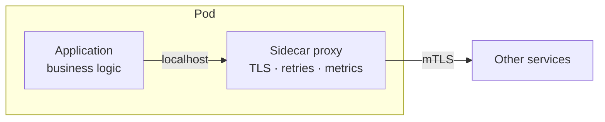
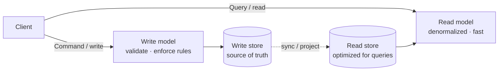
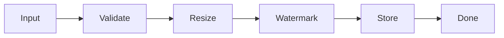
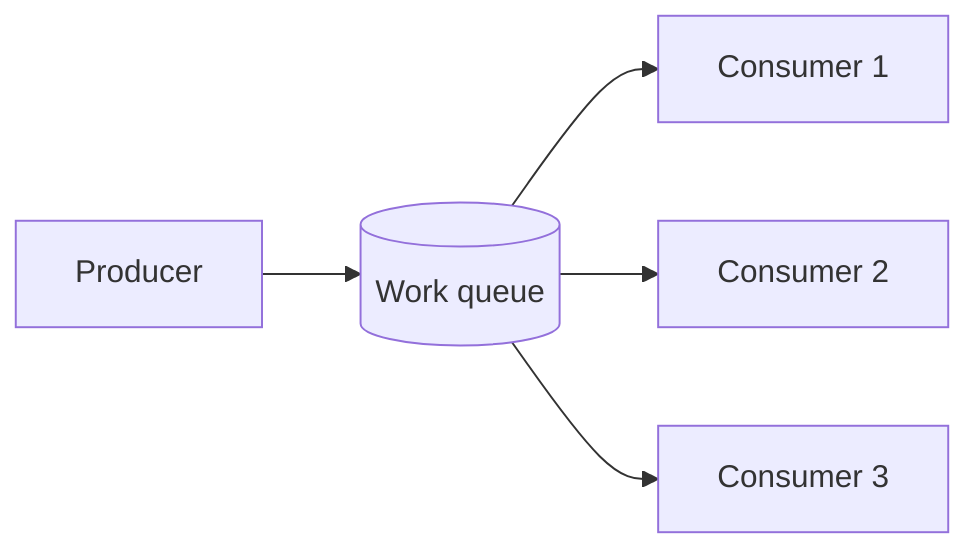

# Cloud Design Patterns — Junior Interview Questions

> **Collection:** [System Design](../README.md) · **Level:** Junior · **Section 21 of 42**
> **Goal:** Recognize the named, reusable cloud patterns by their intent — what
> problem each one solves, when you'd reach for it, and the one trade-off it buys —
> so you can name the right pattern instead of re-deriving it under interview pressure.

Cloud design patterns are the vocabulary of distributed-system architecture: each is a
proven answer to a recurring problem (migration, cross-cutting concerns, scale, data
separation). A junior is not expected to implement them from scratch — only to *name the
right one*, state its intent in a sentence, and give one concrete trade-off. Each
question below lists **what the interviewer is really probing**, a **model answer**, and
where useful a **follow-up**.

---

## Contents

1. [Strangler Fig](#1-strangler-fig)
2. [Sidecar](#2-sidecar)
3. [Ambassador](#3-ambassador)
4. [Anti-Corruption Layer](#4-anti-corruption-layer)
5. [CQRS](#5-cqrs)
6. [Event Sourcing](#6-event-sourcing)
7. [Materialized View](#7-materialized-view)
8. [Pipes and Filters](#8-pipes-and-filters)
9. [External Config Store](#9-external-config-store)
10. [Valet Key](#10-valet-key)
11. [Claim Check](#11-claim-check)
12. [Competing Consumers](#12-competing-consumers)
13. [Publisher/Subscriber](#13-publishersubscriber)
14. [Rapid-Fire Self-Check](#14-rapid-fire-self-check)

---

## 1. Strangler Fig

### Q1.1 — What problem does the Strangler Fig pattern solve, and where does the name come from?

**Probing:** Do you understand it as a *safe, incremental migration* strategy, not a big-bang rewrite?

**Model answer:** The Strangler Fig pattern incrementally replaces a legacy system by
building new features alongside it and routing traffic to the new code piece by piece,
until the old system is fully "strangled" and can be retired. The name comes from the
strangler fig vine that grows around a host tree and eventually replaces it. You put a
*façade* (usually a routing proxy) in front of the legacy app; each migrated route is
redirected to the new service while everything else still hits the old system. The win is
risk reduction — you ship and validate one slice at a time and can roll back a single
route instead of betting the company on a single cutover.

**Follow-up:** *"When is it the wrong choice?"* → When the legacy system is small enough
to rewrite cheaply, or when the façade can't cleanly intercept traffic — the routing
layer is the load-bearing part, and if you can't insert it, the pattern doesn't apply.

---

## 2. Sidecar

### Q2.1 — Explain the Sidecar pattern with one concrete use.

**Probing:** Do you see it as co-locating cross-cutting concerns *next to* an app rather than *inside* it?

**Model answer:** The Sidecar pattern deploys a helper component into the same unit
(typically the same Kubernetes pod) as the main application, sharing its lifecycle and
local network, so it can handle cross-cutting concerns — TLS, retries, metrics, logging —
*without* the app having to implement them. The app talks to `localhost`; the sidecar
intercepts and handles the rest. The canonical example is a service-mesh proxy (Envoy):
your service sends a plain HTTP call to the sidecar, and the sidecar adds mutual TLS,
load balancing, and telemetry transparently.

**Follow-up:** *"Why a separate process instead of a shared library?"* → A sidecar is
language-agnostic and upgradable independently — you patch the proxy without rebuilding or
redeploying every service that would otherwise embed the library.

---

## 3. Ambassador

### Q3.1 — How does the Ambassador pattern differ from a Sidecar?

**Probing:** Can you distinguish *general* co-located helper (sidecar) from a *client-side network proxy* (ambassador)?

**Model answer:** Ambassador is a *specialization* of the sidecar idea focused on
*outbound* network calls. It's a helper that sits between your app and a remote service
and owns the messy connectivity concerns of *calling out*: retries with backoff, circuit
breaking, timeouts, connection pooling, and routing. Your app makes a simple local call;
the ambassador handles the unreliable network. The distinction: "sidecar" is the general
co-deployment shape for *any* cross-cutting concern; "ambassador" is the sidecar applied
specifically to making your app a smarter, more resilient *client*.

**Follow-up:** *"Give a non-mesh example."* → A legacy app that can't speak modern auth
or TLS gets an ambassador process that upgrades its outbound calls — the old app stays
untouched while the ambassador adds the modern handshake.

---

## 4. Anti-Corruption Layer

### Q4.1 — What is an Anti-Corruption Layer (ACL) and what is it protecting?

**Probing:** Do you understand it as a *translation/isolation* boundary that keeps a clean model from being polluted?

**Model answer:** An Anti-Corruption Layer is a translation layer placed between two
subsystems — typically a new, cleanly-modeled service and a legacy or third-party system —
that converts between their data models and protocols so the legacy model never leaks into
the new one. It protects your domain model from being *corrupted* by the assumptions,
naming, and quirks of the other side. Concretely: instead of letting your new order
service speak the legacy ERP's confusing schema everywhere, you funnel all interaction
through one adapter that maps legacy terms to your clean domain terms.

**Follow-up:** *"How does this relate to the Strangler Fig?"* → They pair naturally: during
a Strangler Fig migration, the ACL is what lets the new and old systems talk during the
transition without the new code inheriting the old design's flaws.

---

## 5. CQRS

### Q5.1 — What does CQRS stand for, and what is the core idea?

**Probing:** Do you grasp the *separation of read and write models*, not just the acronym?

**Model answer:** CQRS is **Command Query Responsibility Segregation**: split the model
that *changes* state (commands/writes) from the model that *reads* state (queries), so
each can be optimized independently. The write side enforces business rules and validation;
the read side serves denormalized, query-shaped data that's fast to fetch. They can even
use different data stores. You reach for it when read and write workloads have very
different shapes or scale — for example, a system that takes a trickle of complex writes
but serves a flood of varied read queries.

**Follow-up:** *"What's the cost?"* → Complexity and *eventual consistency* — the read
store often lags the write store, so a user might not immediately see their own change
reflected in a query.

---

## 6. Event Sourcing

### Q6.1 — What is Event Sourcing, and how does it differ from storing current state?

**Probing:** Do you understand it stores the *sequence of changes*, not just the latest snapshot?

**Model answer:** Event Sourcing persists every change to application state as an immutable,
append-only sequence of *events* (e.g., `ItemAddedToCart`, `ItemRemoved`,
`OrderPlaced`) rather than overwriting a single "current state" row. The current state is
*derived* by replaying the events in order. This gives you a perfect audit log, the
ability to reconstruct state at any past point in time, and a natural fit for CQRS (the
events feed the read model). The classic analogy is a bank ledger: you never overwrite a
balance, you append transactions and compute the balance by summing them.

**Follow-up:** *"Why is it usually paired with CQRS and snapshots?"* → Replaying millions
of events to answer a simple query is slow, so you project events into read-optimized
views (CQRS) and periodically save a *snapshot* of state to avoid replaying from the
beginning.

### Q6.2 — Compare CQRS and Event Sourcing — when do you use each?

**Probing:** Avoid the common conflation; they're separate patterns that combine well.

**Model answer:** They are independent but synergistic. CQRS is about *separating read and
write models*; Event Sourcing is about *how you store writes* (as events). You can do CQRS
with a plain relational write store, and you can do Event Sourcing without CQRS. They're
often used together because the event stream is a great source to project into CQRS read
models.

| Aspect | CQRS | Event Sourcing |
|---|---|---|
| **Core idea** | Separate read model from write model | Store state as a log of events |
| **Storage** | Any store(s); often two | Append-only event store |
| **Main benefit** | Independent read/write scaling & shapes | Full audit trail, time travel |
| **Main cost** | Eventual consistency, more moving parts | Replay complexity, schema evolution of events |
| **Use when** | Read and write workloads diverge sharply | You need a complete history / audit of changes |

---

## 7. Materialized View

### Q7.1 — What is the Materialized View pattern and why use one?

**Probing:** Do you understand it as *precomputed, query-shaped data* trading freshness for read speed?

**Model answer:** A Materialized View pre-computes and stores the result of an expensive
query in a read-optimized shape, so reads hit a ready-made answer instead of recomputing it
every time. It's used when the source data is expensive to query in its natural form — for
example, joining and aggregating across many tables, or assembling data scattered across
services into one view tailored to a screen. The trade-off is freshness: the view must be
refreshed (on a schedule or via events), so it can be slightly stale.

**Follow-up:** *"How does it relate to the read model in CQRS?"* → The CQRS read store is
essentially a materialized view — a denormalized projection kept up to date from the write
side. Materialized View is the general pattern; CQRS is one place it shows up.

---

## 8. Pipes and Filters

### Q8.1 — Describe the Pipes and Filters pattern.

**Probing:** Do you see it as decomposing processing into independent, composable, reusable stages?

**Model answer:** Pipes and Filters breaks a complex processing task into a chain of
discrete steps (**filters**) connected by channels (**pipes**), where each filter does one
transformation and passes its output to the next. Because each stage is independent and
single-purpose, you can reuse them, reorder them, test them in isolation, and scale a slow
stage independently of the rest. A familiar example is a Unix shell pipeline
(`cat | grep | sort | uniq`) or an image-upload pipeline: validate → resize → watermark →
store, each as its own stage.

**Follow-up:** *"What's a downside?"* → Each pipe hop adds latency and a potential failure
point, and you must decide how to handle a filter that fails partway through a message —
the stages should ideally be idempotent so a retry is safe.

---

## 9. External Config Store

### Q9.1 — Why move configuration out of the application into an External Config Store?

**Probing:** Do you understand the goal — change config *without redeploying*, and share it across instances?

**Model answer:** The External Configuration Store pattern keeps configuration —
feature flags, connection strings, tunable limits — in a centralized store outside the
application package (a config service, key-value store, or secrets manager) instead of
baking it into the deployed artifact. This lets you change behavior without a rebuild or
redeploy, share consistent settings across many instances, and manage environment-specific
values in one place. It also keeps secrets out of source control.

**Follow-up:** *"What must you be careful about?"* → The config store becomes a dependency
in the hot path, so you typically cache config locally and tolerate the store being
briefly unavailable; and you must secure it tightly because it often holds credentials.

---

## 10. Valet Key

### Q10.1 — Explain the Valet Key pattern.

**Probing:** Do you understand it as giving a client *scoped, time-limited direct access* to a resource, bypassing your servers?

**Model answer:** The Valet Key pattern hands a client a token (a "valet key") that grants
*limited, time-boxed* access to a specific resource — most commonly a pre-signed URL to a
cloud blob store — so the client can read or write that resource *directly* without routing
the bulky data through your application servers. Like a parking valet key that can drive but
not open the trunk, the token is narrowly scoped: one object, one operation, expiring soon.
The classic use is large file uploads/downloads: the app issues a pre-signed S3 URL, and the
client streams the file straight to storage.

**Follow-up:** *"Why not just proxy the upload through your server?"* → Proxying gigabytes
through your app servers wastes their bandwidth, memory, and connections; the Valet Key
offloads that to the storage service, which is built for it, while your server only does the
cheap work of authorizing and minting the key.

---

## 11. Claim Check

### Q11.1 — What is the Claim Check pattern and what problem does it fix?

**Probing:** Do you understand it as keeping large payloads *out of the message*, passing a reference instead?

**Model answer:** The Claim Check pattern stores a large payload in external storage and
sends only a small *reference* ("claim check") through the messaging system; the consumer
uses the reference to fetch the full payload when it needs it. It fixes the problem of
message brokers having size limits and degrading when stuffed with big blobs. Like a coat
check at a theater — you carry a ticket, not the coat — the queue carries a lightweight
pointer, and the heavy data sits in a blob store until claimed.

**Follow-up:** *"How does this relate to Valet Key?"* → They compose: the claim check can
*be* a valet-key URL, letting the consumer fetch the payload directly from storage with a
scoped, expiring token.

---

## 12. Competing Consumers

### Q12.1 — Explain the Competing Consumers pattern.

**Probing:** Do you understand it as multiple consumers pulling from *one* queue to scale and load-balance work?

**Model answer:** Competing Consumers has multiple consumer instances read from the *same*
message queue, each pulling and processing different messages, so work is distributed
across them. It lets you scale throughput by simply adding more consumers, smooths out
spikes (the queue buffers bursts), and improves resilience — if one consumer dies, the
others keep draining the queue. The key property: each message is processed by *exactly one*
consumer (the consumers compete for messages), unlike Pub/Sub where every subscriber gets a
copy.

**Follow-up:** *"What does the message broker need to guarantee?"* → That a message handed
to one consumer isn't given to another until it's acknowledged or times out — usually via a
visibility timeout, so a crashed consumer's message becomes available again instead of being
lost.

---

## 13. Publisher/Subscriber

### Q13.1 — How does Publisher/Subscriber differ from Competing Consumers?

**Probing:** The classic distinction — *fan-out copies to all* vs *one queue, work split among consumers*.

**Model answer:** In Publisher/Subscriber (Pub/Sub), a publisher emits a message to a topic
and *every* interested subscriber receives its *own copy*, with publishers and subscribers
fully decoupled — the publisher doesn't know or care who is listening. This is for *fan-out
notification*: one "OrderPlaced" event triggers the email service, the inventory service, and
the analytics service independently. Competing Consumers, by contrast, has one logical
queue where each message goes to *exactly one* consumer — that's for distributing *work*,
not broadcasting *events*.

| | Competing Consumers | Publisher/Subscriber |
|---|---|---|
| **Delivery** | Each message → exactly one consumer | Each message → every subscriber gets a copy |
| **Goal** | Distribute and scale *work* | Broadcast *events* / notify many |
| **Coupling** | Producer ↔ shared queue | Publisher fully decoupled from subscribers |
| **Add a node to…** | Increase throughput | Add a new independent reaction |

**Follow-up:** *"Can they combine?"* → Yes — a common shape is a Pub/Sub topic that
fans out to several *queues*, and each queue is then drained by its own pool of competing
consumers, giving you both broadcast and per-consumer scaling.

---

## 14. Rapid-Fire Self-Check

If you can answer each of these in a sentence, you're ready for the junior bar on this section:

- [ ] Which pattern incrementally replaces a legacy system behind a routing façade? *(Strangler Fig)*
- [ ] Sidecar vs Ambassador — what's the distinction? *(general co-located helper vs outbound-call proxy)*
- [ ] What does an Anti-Corruption Layer protect? *(your clean model from a legacy/third-party model)*
- [ ] What does CQRS separate, and what's its main cost? *(read model from write model; eventual consistency)*
- [ ] Event Sourcing stores *what* instead of current state? *(an append-only log of events)*
- [ ] A Materialized View trades freshness for *what*? *(read speed via precomputed, query-shaped data)*
- [ ] Pipes and Filters decomposes processing into *what*? *(independent, composable single-purpose stages)*
- [ ] Why use an External Config Store? *(change config without redeploying; share across instances)*
- [ ] What does a Valet Key grant? *(scoped, time-limited direct access to one resource)*
- [ ] Claim Check puts *what* in the message? *(a small reference, not the large payload)*
- [ ] Competing Consumers vs Pub/Sub — one message goes to *how many* consumers each? *(exactly one vs every subscriber)*

---

**Next step:** Section 22 — [Performance Antipatterns](22-performance-antipatterns.md): the recurring mistakes that quietly wreck latency and throughput.
