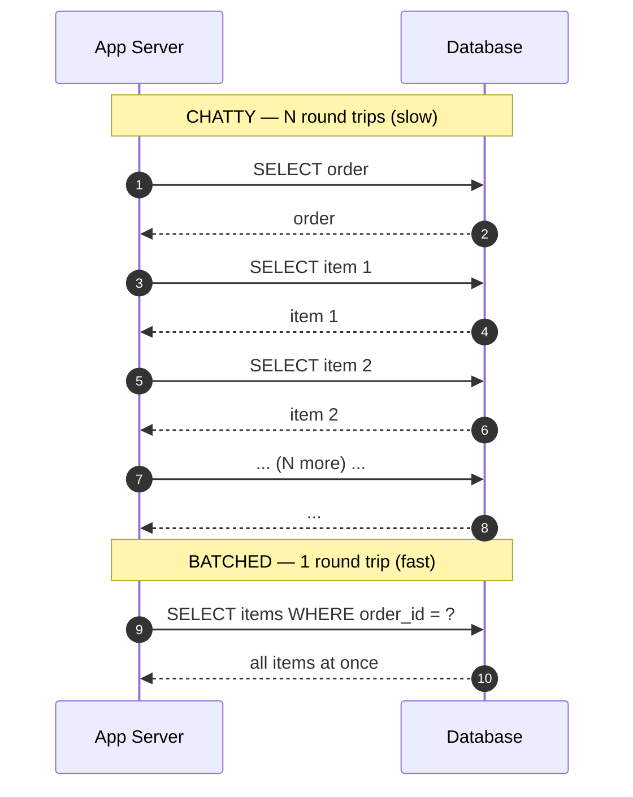

# Performance Antipatterns — Junior Interview Questions

> **Collection:** [System Design](../README.md) · **Level:** Junior · **Section 22 of 42**
> **Goal:** Train your eye to *recognize* the ten classic performance antipatterns from
> their symptoms, explain *why* each one degrades latency or throughput, and state the
> standard *fix* — without hand-waving.

An antipattern is a solution that looks reasonable and works fine in a demo, but
predictably fails under real load. Interviewers love them because each one has a clear
**smell**, a clear **reason it hurts**, and a clear **fix** — exactly the
recognize-and-remedy reasoning a good engineer uses on production systems. For every
question below you get **what the interviewer is really probing**, a **model answer**,
and often a **follow-up**. The drill is always the same: *name the smell, explain the
cost, state the fix.*

---

## Contents

1. [Busy Database](#1-busy-database)
2. [Busy Frontend](#2-busy-frontend)
3. [Chatty I/O](#3-chatty-io)
4. [Extraneous Fetching](#4-extraneous-fetching)
5. [Improper Instantiation](#5-improper-instantiation)
6. [Monolithic Persistence](#6-monolithic-persistence)
7. [Noisy Neighbor](#7-noisy-neighbor)
8. [Synchronous I/O](#8-synchronous-io)
9. [Retry Storm](#9-retry-storm)
10. [No Caching](#10-no-caching)
11. [Rapid-Fire Self-Check](#11-rapid-fire-self-check)

---

### Cheat sheet — antipattern → symptom → fix

Skim this before the deep dives; the rest of the section is each row argued out.

| Antipattern | Telltale symptom | Standard fix |
|---|---|---|
| Busy Database | DB CPU pegged; app servers idle | Move computation out of the DB; cache; offload to app tier |
| Busy Frontend | UI freezes; web tier CPU-bound on background work | Push heavy/async work to a queue + background workers |
| Chatty I/O | Thousands of tiny calls; latency = N × round-trip | Batch / coalesce into fewer, larger calls |
| Extraneous Fetching | Pulling whole rows/tables, using a few fields | Project only needed columns; paginate; filter server-side |
| Improper Instantiation | New client/connection per request | Reuse via pooling / singletons |
| Monolithic Persistence | One DB for every workload, all contended | Split stores by access pattern (polyglot persistence) |
| Noisy Neighbor | One tenant's spike degrades everyone | Isolate, quota, and throttle per tenant |
| Synchronous I/O | Threads blocked waiting on I/O; pool exhausted | Async / non-blocking I/O; offload long work |
| Retry Storm | Failure triggers a self-amplifying flood of retries | Exponential backoff + jitter + circuit breaker |
| No Caching | Repeated identical reads hammer the origin | Add a cache layer with a sane TTL + invalidation |

---

## 1. Busy Database

### Q1.1 — Your database CPU sits at 95% while the app servers are nearly idle. What antipattern is this, and what's the fix?

**Probing:** Can you recognize that work has been pushed *into the wrong tier*?

**Model answer:** This is the **Busy Database** antipattern: the database is doing work
that doesn't need to be in the database. Classic culprits are heavy business logic in
stored procedures, large aggregations or sorts computed on every request, complex
multi-join reports run against the live transactional store, and string/JSON munging in
SQL. It hurts because the database is the **hardest tier to scale horizontally** — app
servers you can add behind a load balancer in minutes, but a primary database is a
shared, stateful bottleneck. Burning its CPU on work the cheap, scalable app tier could
do starves the queries that *only* the database can serve.

**The fix:** move computation out of the database. Push business logic up into the
stateless application tier (which scales out cheaply), cache expensive read results,
add the right indexes so queries stop doing full scans, and route heavy analytical
queries to a read replica or a separate analytics store rather than the primary.

**Follow-up:** *"How do you tell Busy Database from a missing index?"* → A missing index
shows as specific slow queries doing sequential scans (visible in `EXPLAIN`); Busy
Database is broader — the DB is structurally doing work that belongs elsewhere. Often
you have both: fix indexes first, then offload.

---

## 2. Busy Frontend

### Q2.1 — A web server thread handles an upload by resizing the image inline before responding, and under load the whole site becomes unresponsive. Name the smell and the fix.

**Probing:** Do you see that the request-handling tier is tied up doing background-class work?

**Model answer:** This is the **Busy Frontend** antipattern: the tier whose job is to
accept requests *fast* is instead spending its limited threads on slow, resource-heavy
work (image resizing, report generation, sending emails, video transcoding). Every
request thread that's busy resizing is a thread *not* available to accept the next
user's request, so the request queue backs up and the entire site appears frozen —
even for users doing nothing heavy.

**The fix:** keep the frontend's job small and fast — accept the request, persist the
input, return quickly — and **push the heavy work onto a message queue** consumed by a
pool of background workers that scale independently. The user gets an immediate "upload
received," and the thumbnails appear a moment later. This is the same fast-write-path /
deferred-heavy-work split that responsive products use everywhere.

**Follow-up:** *"What does the user see while the work runs?"* → A pending/processing
state, or the result via polling, a webhook, or a push — never a spinning, blocked
request.

---

## 3. Chatty I/O

### Q3.1 — Rendering one order page issues 200 separate database queries. What's the antipattern, why is it slow, and how do you fix it?

**Probing:** The single most common junior performance bug — the N+1 / chatty pattern.

**Model answer:** This is **Chatty I/O**: instead of a few well-shaped requests, the
code makes a large number of tiny ones — the classic **N+1 query** (one query for the
list, then one more per item), or a loop that calls a remote API once per element. It
hurts because *each call carries fixed overhead* — network round-trip, connection
acquisition, query parsing, serialization — and that overhead is paid **N times**. The
total time is dominated not by the data volume but by `N × round_trip`. With a 1 ms
round trip, 200 sequential calls cost ~200 ms of pure waiting.

**The fix:** **batch and coalesce.** Replace the N small calls with one larger call —
an `IN (...)` query or a join instead of a per-row lookup, a bulk/batch endpoint
instead of a per-item API call, or eager-loading the related data up front. Fewer,
fatter requests amortize the per-call overhead.

**Follow-up:** *"When is chatty actually fine?"* → When N is small and bounded, or when
the calls genuinely must be independent and you can run them in **parallel** rather than
sequentially. The danger is unbounded N inside a loop on the hot path.

---

## 4. Extraneous Fetching

### Q4.1 — An endpoint that only needs a user's name and email runs `SELECT * FROM users`, pulling every column for every row. What's wrong, and what's the fix?

**Probing:** Awareness that *how much* you fetch — not just *how often* — costs money.

**Model answer:** This is **Extraneous Fetching**: retrieving far more data than the
operation actually uses. Two flavors: fetching too many **columns** (`SELECT *` when you
need two fields, dragging large blobs or JSON across the wire) and fetching too many
**rows** (loading an entire table to filter or count in application code). It hurts on
every axis — more disk I/O on the database, more bytes over the network, more memory and
GC pressure in the app, and it defeats covering indexes. At scale, the cost is wildly
out of proportion to the data you actually use.

**The fix:** fetch only what you need. **Project** just the required columns, **filter
and aggregate server-side** in the query rather than in app code, and **paginate** large
result sets with `LIMIT`/keyset pagination instead of loading everything. Pushing the
work down to the database and pulling back only the result is almost always cheaper than
shipping raw data up to the app.

**Follow-up:** *"How is this different from Chatty I/O?"* → Chatty I/O is *too many*
calls; Extraneous Fetching is calls that each return *too much*. They're opposite
failure modes — and naive fixes for one can cause the other (over-batching can pull
extraneous data), so balance both.

---

## 5. Improper Instantiation

### Q5.1 — Each incoming request creates a brand-new database connection (or HTTP client), uses it once, and discards it. Why is this a problem, and what's the fix?

**Probing:** Understanding that some objects are expensive to create and meant to be reused.

**Model answer:** This is **Improper Instantiation**: repeatedly creating objects that
are **expensive to construct and designed to be shared**, then throwing them away.
Database connections, HTTP/SDK clients, and serializers are the usual victims — each one
involves a handshake (TCP + TLS + auth) or internal setup that can cost tens of
milliseconds and consume a socket and memory. Doing that per request means the setup
cost dwarfs the actual work, sockets pile up, and the database can run out of
connections entirely.

**The fix:** **create once, reuse many times.** Use a **connection pool** for the
database, a single long-lived HTTP/client instance shared across requests, and treat
heavyweight clients as singletons. Reuse amortizes the construction cost and bounds
resource usage. The mirror-image mistake is making something shared that *isn't*
thread-safe — so reuse the genuinely reusable, and isolate the genuinely per-request.

**Follow-up:** *"How would you size a connection pool?"* → Big enough to keep workers
busy, small enough that `pool_size × app_instances` stays under the database's max
connection limit — not "one per request."

---

## 6. Monolithic Persistence

### Q6.1 — A team stores transactional orders, full-text search, time-series metrics, and a session cache all in one relational database, and it's constantly contended. What antipattern is this?

**Probing:** Do you see that one store can't be optimal for fundamentally different workloads?

**Model answer:** This is **Monolithic Persistence**: forcing every kind of data and
access pattern into a single data store regardless of fit. A relational primary is great
for transactional reads and writes, but it's the wrong tool for high-churn session data
(better in an in-memory cache), full-text search (better in a search engine), append-
heavy metrics (better in a time-series store), and large blobs (better in object
storage). Cramming them together means these very different workloads **contend for the
same connections, locks, cache, and I/O**, and you can't tune the box for any of them.

**The fix:** **polyglot persistence** — split data across stores chosen for each access
pattern: relational for transactions, a cache for sessions/hot reads, a search index for
text, a time-series DB for metrics, object storage for files. Each store scales and
tunes independently, and removing the secondary workloads relieves pressure on the
primary.

**Follow-up:** *"What's the cost of splitting?"* → More moving parts, no cross-store
transactions, and harder consistency. So you don't split prematurely — you split when a
workload's needs clearly diverge and the contention is real.

---

## 7. Noisy Neighbor

### Q7.1 — On a shared multi-tenant platform, one customer runs a huge job and *every other customer* suddenly gets slow. What's the antipattern, and how do you contain it?

**Probing:** Understanding shared-resource contention and isolation.

**Model answer:** This is the **Noisy Neighbor** antipattern: tenants share a resource
pool — CPU, connection pool, disk I/O, a database — with **no isolation**, so one
tenant's spike consumes a disproportionate share and starves everyone else. The system
is "up," but for most users it's degraded, and the cause (someone *else's* workload) is
invisible from their side.

**The fix:** **isolate and bound per tenant.** Apply per-tenant **rate limits and
quotas**, allocate dedicated resources or use the **bulkhead** pattern (separate
connection pools / worker pools per tenant or tier) so a runaway tenant can only exhaust
*its own* slice, and move the heaviest tenants onto dedicated infrastructure. The goal is
that no single tenant can degrade the experience of the others.

**Follow-up:** *"Cheapest first step?"* → A per-tenant rate limit / concurrency cap. It
doesn't isolate perfectly, but it caps how much damage any one neighbor can do.

---

## 8. Synchronous I/O

### Q8.1 — A request thread calls a slow external API and **blocks**, holding the thread until the call returns. Under load the thread pool runs out and the service stops accepting requests. What happened?

**Probing:** Understanding blocking I/O and thread-pool exhaustion.

**Model answer:** This is the **Synchronous (blocking) I/O** antipattern: a thread issues
an I/O call — a slow database query, a remote API, a disk write — and sits idle **holding
the thread** until it completes. Threads are a finite, expensive resource. If every
in-flight request parks a thread waiting on a 2-second downstream call, a burst of
traffic exhausts the pool; new requests then queue or get rejected even though the CPU is
mostly idle, just *waiting*. One slow dependency can take the whole service down.

**The fix:** stop blocking threads on waiting. Use **asynchronous / non-blocking I/O**
(async-await, event loops, reactive frameworks) so a thread can serve other work while a
call is in flight, and **offload genuinely long operations** to a background queue
instead of doing them inside the request. Pair this with sensible **timeouts** so a stuck
dependency can never hold a thread indefinitely.

**Follow-up:** *"Does async make the downstream call faster?"* → No — it makes your
service *survive* slowness by not wasting a thread per wait. Throughput and resilience
improve; the downstream latency itself is unchanged.

---

## 9. Retry Storm

### Q9.1 — A downstream service hiccups, so every client retries immediately, the flood of retries keeps it down, and it never recovers. Name the antipattern and the fix.

**Probing:** Do you see how naive retries *amplify* a failure instead of healing it?

**Model answer:** This is the **Retry Storm** (retry amplification) antipattern: when a
dependency starts failing, clients **retry immediately and in lockstep**, multiplying the
load on an already-struggling service. The retries pile onto the original traffic, the
service stays overloaded, that triggers *more* retries, and the failure becomes
self-sustaining — a feedback loop that can cascade across the whole system. Synchronized
retries are especially deadly because everyone hammers at the same instant.

**The fix:** make retries **polite and bounded.**
- **Exponential backoff** — wait longer after each failure (1s, 2s, 4s…) instead of
  hammering.
- **Jitter** — randomize the wait so clients don't all retry at the same instant.
- **A retry cap** — give up after a few attempts instead of retrying forever.
- **A circuit breaker** — after repeated failures, *stop calling* the dependency for a
  cool-down period so it can recover, then probe before resuming.

Together these let the struggling service breathe instead of being kept down by its own
clients.

**Follow-up:** *"Which requests are even safe to retry?"* → Only **idempotent** ones.
Blindly retrying a non-idempotent write (e.g., "charge card") can double-charge — so
make the operation idempotent (idempotency keys) before retrying it.

---

## 10. No Caching

### Q10.1 — The same expensive query for the homepage feed runs from scratch on every single request, even though the data barely changes. What's the antipattern, and what's the fix?

**Probing:** Recognizing repeated identical work that should be reused.

**Model answer:** This is the **No Caching** antipattern: recomputing or re-fetching the
**same rarely-changing result** on every request instead of remembering it. In read-heavy
systems — where reads outnumber writes by 100:1 or more — this means the origin
(database, downstream API, or compute) does enormous redundant work, latency stays high,
and the system can't absorb traffic spikes because there's no cheap fast path.

**The fix:** **add a cache** between the caller and the origin. On a request, check the
cache first; on a **hit**, return immediately without touching the origin; on a **miss**,
compute once, store the result with a sensible **TTL**, then serve it. Caches can live at
many layers — in-memory, a distributed cache like Redis, an HTTP/CDN edge cache — and the
right one depends on the data. The payoff is fewer origin hits, lower latency, and
headroom to absorb bursts.

**Follow-up:** *"What's the hard part of caching?"* → **Invalidation** — keeping the
cache from serving stale data after the source changes. A short TTL bounds staleness
cheaply; explicit invalidation on write is precise but harder to get right. Note this is
the inverse of an over-eager cache: cache things that are read often and change rarely.

---

## 11. Rapid-Fire Self-Check

If you can give the **symptom + fix** for each in one breath, you're at the junior bar
for this section:

- [ ] **Busy Database** — DB pegged, app idle → *move work out of the DB; cache; offload reports to replicas.*
- [ ] **Busy Frontend** — request threads stuck on heavy work → *queue it to background workers.*
- [ ] **Chatty I/O** — N tiny calls (N+1) → *batch into fewer, larger calls.*
- [ ] **Extraneous Fetching** — `SELECT *`, whole tables for a few fields → *project, filter, paginate.*
- [ ] **Improper Instantiation** — new connection/client per request → *pool and reuse.*
- [ ] **Monolithic Persistence** — one DB for every workload → *split by access pattern (polyglot).*
- [ ] **Noisy Neighbor** — one tenant slows everyone → *quota, throttle, bulkhead per tenant.*
- [ ] **Synchronous I/O** — blocked threads exhaust the pool → *async I/O + timeouts; offload long work.*
- [ ] **Retry Storm** — retries amplify a failure → *backoff + jitter + cap + circuit breaker.*
- [ ] **No Caching** — same expensive read on every request → *cache with a TTL; mind invalidation.*

> **Mental model:** almost every antipattern here is *work done in the wrong place, at
> the wrong size, the wrong number of times, or with the wrong reuse.* Name which of
> those four it is, and the fix follows.

---

**Next step:** Section 23 — [Monitoring](23-monitoring.md): how you *detect* these
antipatterns in production before your users do — metrics, dashboards, and alerts.
