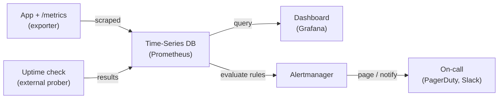

# Monitoring — Junior Interview Questions

> **Collection:** [System Design](../README.md) · **Level:** Junior · **Section 23 of 42**
> **Goal:** Confirm you can explain what monitoring *is*, name the distinct things
> worth watching (health, availability, performance, security, usage), describe how
> data gets out of an app (instrumentation), and turn that data into dashboards and
> alerts people actually trust.

Monitoring is how a system *tells you* it is healthy before your users do. A junior
answer here is judged on whether you can name **what** to watch, **why** each signal
matters, and reach for real tools — Prometheus scraping metrics, Grafana drawing the
dashboard, an uptime check pinging from the outside, Alertmanager paging on-call. Each
question below lists **what the interviewer is really probing**, a **model answer**, and
often a **follow-up** they will ask next.

---

## Contents

1. [Health Monitoring](#1-health-monitoring)
2. [Availability Monitoring](#2-availability-monitoring)
3. [Performance Monitoring](#3-performance-monitoring)
4. [Security Monitoring](#4-security-monitoring)
5. [Usage Monitoring](#5-usage-monitoring)
6. [Instrumentation](#6-instrumentation)
7. [Visualization & Alerts](#7-visualization--alerts)
8. [Rapid-Fire Self-Check](#8-rapid-fire-self-check)

---

## The monitoring pipeline at a glance

Every monitoring story has the same shape: the application *emits* numbers, something
*collects and stores* them over time, and humans *see* and *get paged* on them.

Keep this picture in mind — almost every question below is one box or one arrow in it.

---

## 1. Health Monitoring

### Q1.1 — What is a health check, and what's the difference between *liveness* and *readiness*?

**Probing:** Do you know health checks are how the platform decides whether to route
traffic or restart a process — not just a vibe?

**Model answer:** A health check is an endpoint (commonly `GET /healthz`) the system
polls to ask "are you okay?" There are two distinct questions:

- **Liveness** — "Is this process alive, or is it wedged and needs a restart?" A failing
  liveness check tells the orchestrator (e.g., Kubernetes) to kill and restart the pod.
- **Readiness** — "Is this process ready to *serve traffic* right now?" A failing
  readiness check tells the load balancer to stop sending requests, without killing the
  process — useful during startup, warm-up, or while a dependency is briefly down.

Conflating them is a classic bug: if your liveness check also pings the database, a
database blip restarts every healthy app instance and makes the outage worse.

**Follow-up:** *"Should a health check call the database?"* → A *readiness* check can, to
shed traffic when the DB is gone. A *liveness* check generally should not, so a shared
dependency failure doesn't trigger a restart storm.

### Q1.2 — What's the difference between a *shallow* and a *deep* health check?

**Probing:** Awareness that "returns 200" can lie.

**Model answer:** A **shallow** check returns `200 OK` as long as the web server can
respond — it proves the process is up but nothing about whether it actually works. A
**deep** check verifies the critical dependencies: can it reach the database, the cache,
the message broker? Deep checks catch "the app is up but can't do anything," but they're
heavier and can cause cascading restarts if wired into liveness. The pragmatic rule:
shallow for liveness, selectively deep for readiness.

### Q1.3 — A pod keeps restarting every few minutes. How would monitoring help you find why?

**Probing:** Can you connect a symptom to specific signals?

**Model answer:** I'd look at the restart count and the liveness-probe failure metric
first — that confirms it's the probe killing it. Then I'd check resource metrics
(memory) for an OOM kill pattern: memory climbing to the limit right before each
restart points to a leak. I'd cross-reference logs at the restart timestamps. The
monitoring stack turns "it keeps dying" into "it OOMs at 512 MB after ~4 minutes,"
which is an actionable lead.

---

## 2. Availability Monitoring

### Q2.1 — What is availability monitoring, and why must it probe from *outside* the system?

**Probing:** Do you understand that internal "all green" can coexist with users seeing
errors?

**Model answer:** Availability monitoring answers "can a real user reach the service and
get a correct response?" The key is it probes from **outside** — an external prober (a
synthetic monitor) hitting your public URL on a schedule, ideally from multiple regions.
Internal metrics can all read healthy while DNS, a load balancer, a TLS cert, or a CDN
edge is broken between the user and your servers. Only an outside-in check sees what the
user sees. Tools like Pingdom, an uptime service, or a Prometheus blackbox exporter do
this by issuing real HTTP requests and recording success and latency.

**Follow-up:** *"Why probe from multiple regions?"* → To distinguish a global outage from
a regional one (a single ISP or edge POP failing), and to measure latency as different
users experience it.

### Q2.2 — How is availability actually measured, and what's an SLA vs an SLO?

**Probing:** Can you turn "is it up" into a number, and know the vocabulary?

**Model answer:** Availability is the fraction of time (or of requests) the service is
working: `successful / total`, usually expressed in "nines."

| Term | Meaning |
|---|---|
| **SLI** (Indicator) | The measured number, e.g., "% of requests that returned 2xx/3xx within 300 ms." |
| **SLO** (Objective) | The internal target for that SLI, e.g., "99.9% over 30 days." |
| **SLA** (Agreement) | The contractual promise to customers, with penalties; usually *looser* than the SLO so you have buffer. |

The SLO is the line your alerts and dashboards are built around; the SLA is the
promise you make so you don't breach it.

### Q2.3 — "99.9% availability" — how much downtime is that, and how do you alert before you breach it?

**Probing:** Concrete intuition plus the idea of an error budget.

**Model answer:** 99.9% allows about **43 minutes of downtime per month** (~8.8 hours
per year). The complement — 0.1% — is your **error budget**: the amount of failure you're
*allowed*. Instead of alerting on every single error, you alert on the *burn rate*: if
you're consuming the budget fast enough to blow it before the window ends, page someone.
This catches real degradation while ignoring harmless one-off blips.

---

## 3. Performance Monitoring

### Q3.1 — What are the "four golden signals," and why those four?

**Probing:** The single most useful framing in this section. Juniors who can name them
sound senior fast.

**Model answer:** From Google's SRE practice, the four signals that summarize the health
of any request-driven service:

| Signal | Question it answers | Example metric |
|---|---|---|
| **Latency** | How long does a request take? | p50 / p95 / p99 response time |
| **Traffic** | How much demand is there? | requests per second |
| **Errors** | What fraction is failing? | rate of 5xx responses |
| **Saturation** | How full are my resources? | CPU %, memory %, queue depth |

They're chosen because together they cover *demand* (traffic), *the user experience*
(latency, errors), and *how close to the wall you are* (saturation). If you can watch
only four things, watch these.

**Follow-up:** *"You can add only one more — what is it?"* → Often *queue depth* or
*dependency latency*, since saturation downstream is what eventually breaks the user-facing
signals.

### Q3.2 — Why report **p95/p99 latency** instead of the average?

**Probing:** Do you understand averages hide the pain?

**Model answer:** The average is dominated by the common fast case and *hides the tail*.
If 99% of requests take 50 ms and 1% take 5 seconds, the average looks fine (~100 ms),
but 1 in 100 of your users is having a terrible experience — and at high traffic that's
thousands of people. **Percentiles** describe the tail directly: p99 = 5 s says "1% of
requests are at least this slow." Since a single page load often makes many backend
calls, tail latency compounds, so p95/p99 is what correlates with user-perceived
slowness. Always monitor a percentile, not just the mean.

### Q3.3 — A dashboard shows latency spiking but error rate is flat. What does that tell you?

**Probing:** Reading signals *together*, not in isolation.

**Model answer:** Requests are still succeeding (errors flat) but getting *slower*
(latency up) — that's the classic signature of **saturation**: a resource is filling up
and requests are queuing behind it. I'd check the saturation signals — CPU, a thread or
connection pool maxing out, a database with growing lock wait, or a backed-up queue. The
fix is usually capacity (scale out) or relieving the bottleneck, not chasing a bug,
because nothing is actually erroring yet.

---

## 4. Security Monitoring

### Q4.1 — What is security monitoring, and how does it differ from performance monitoring?

**Probing:** Do you see security as its own monitoring discipline, not an afterthought?

**Model answer:** Security monitoring watches for *malicious or anomalous* activity
rather than *health or speed*. Performance monitoring asks "is it fast and up?";
security monitoring asks "is someone attacking, misusing, or exfiltrating from it?"
Concrete signals: spikes in failed logins (credential stuffing or brute force), access
from unexpected geographies, sudden surges in 401/403 responses, unusual data-egress
volume, or privilege-escalation events. These often flow into a SIEM (e.g.,
Splunk, an ELK stack) that correlates events across services.

**Follow-up:** *"Where do these events come from?"* → Auth logs, the WAF/load balancer,
audit logs of sensitive actions, and OS/network logs — security monitoring is heavily
**log-** and **audit-driven**, where performance leans on metrics.

### Q4.2 — Give two concrete security signals worth alerting on, and the trade-off.

**Probing:** Concreteness plus awareness of false positives.

**Model answer:** **(1)** A sharp rise in failed-login rate from a single IP or against
many accounts — likely brute force or credential stuffing; mitigate with rate limiting or
a temporary block. **(2)** A spike in 403s or access to admin endpoints from a normal-user
session — possible privilege-escalation probing. The trade-off is **false positives**: a
marketing campaign or a flaky client can spike traffic that *looks* like an attack.
That's why you tune thresholds to baselines and route security alerts to a team that can
investigate, rather than auto-blocking everything and locking out real users.

---

## 5. Usage Monitoring

### Q5.1 — What is usage monitoring, and how does it differ from health or performance monitoring?

**Probing:** Can you separate "is the system okay?" from "what are people doing with it?"

**Model answer:** Usage monitoring tracks *how the product is actually used* — sign-ups
per day, active users, feature adoption, API calls per customer, storage consumed per
tenant. Health and performance monitoring serve **operations** (keep it running);
usage monitoring serves the **business and capacity planning** (what to build, what to
charge, what to scale). The same raw event ("user uploaded a file") feeds both: an
operations view counts it as load, a usage view counts it as a billable action and an
engagement signal.

**Follow-up:** *"Give an example where usage data drives an engineering decision."* → If
usage shows 80% of requests hit one endpoint, that's where caching and optimization pay
off; if a region's usage is growing 20%/month, that informs when to add capacity there.

### Q5.2 — Why is usage monitoring critical for capacity planning and cost?

**Probing:** Forward-looking, business-aware thinking.

**Model answer:** Usage trends are how you predict the future load curve. Watching
requests-per-second and storage grow month over month tells you *when* you'll hit a
limit, so you provision before users feel it instead of after. It's also the basis of
**metered billing** — counting API calls or gigabytes per customer — and of spotting
waste, like a feature nobody uses that still costs money to run. Health monitoring keeps
today alive; usage monitoring keeps *next quarter* affordable and planned.

---

## 6. Instrumentation

### Q6.1 — What is instrumentation, and what are the three "pillars" of telemetry?

**Probing:** Do you know data doesn't appear by magic — the app must emit it?

**Model answer:** **Instrumentation** is adding code (or auto-injecting agents) so the
application *emits* signals about what it's doing. Without it there's nothing to monitor.
The three pillars of telemetry:

| Pillar | What it is | Good for |
|---|---|---|
| **Metrics** | Numeric measurements over time (counters, gauges, histograms) | Dashboards, alerts, trends — cheap and aggregatable |
| **Logs** | Timestamped text/structured records of discrete events | Debugging the *details* of a specific event |
| **Traces** | The path of one request across many services, with timing | Finding *where* latency is spent in a distributed call |

A practical junior point: metrics tell you *that* something is wrong and where to look;
logs and traces tell you *why*.

**Follow-up:** *"Why not just log everything and compute metrics from logs?"* → Logs are
expensive to store and slow to aggregate at scale; pre-aggregated metrics are tiny and
queryable in real time. You use each for what it's good at.

### Q6.2 — Explain the difference between a counter, a gauge, and a histogram.

**Probing:** Fluency with the basic metric types Prometheus exposes.

**Model answer:**

- **Counter** — a value that only goes up (or resets to zero on restart), e.g.,
  `http_requests_total`. You take its *rate* to get requests/second.
- **Gauge** — a value that goes up *and* down, a snapshot of "right now," e.g.,
  `memory_bytes_in_use` or `queue_depth`.
- **Histogram** — buckets observations to summarize a *distribution*, e.g.,
  `request_duration_seconds`, which lets you compute percentiles like p95/p99.

Choosing the wrong type is a common mistake — tracking request duration as a gauge loses
the distribution, so you can never recover a percentile from it.

### Q6.3 — What's the difference between a *push* and a *pull* (scrape) model? Which does Prometheus use?

**Probing:** How metrics travel from app to store.

**Model answer:** In a **pull/scrape** model the monitoring server periodically fetches
metrics from each target's endpoint — this is what **Prometheus** does, scraping a
`/metrics` page from each instance every few seconds. In a **push** model the application
sends metrics out to a collector (e.g., StatsD, or the Prometheus Pushgateway for
short-lived jobs). Pull makes service discovery and "is this target up?" easy (a failed
scrape *is* a down signal) and centralizes config; push fits ephemeral batch jobs that
vanish before anyone can scrape them. Prometheus is pull-first with push available for
the batch-job exception.

---

## 7. Visualization & Alerts

### Q7.1 — What's the difference between a dashboard and an alert, and why do you need both?

**Probing:** Do you know monitoring data is useless if nobody sees or is told about it?

**Model answer:** A **dashboard** (e.g., a Grafana board) is for *humans actively
looking* — it visualizes trends and helps you investigate during an incident or review.
An **alert** is for *grabbing attention* when nobody is looking — a rule that fires and
pages on-call when a signal crosses a threshold or burns the error budget. You need both
because dashboards don't wake anyone at 3 a.m., and alerts don't help you *explore* once
you're awake. The flow: a metric crosses a rule in Prometheus → Alertmanager → routes a
page to PagerDuty/Slack → the engineer opens the Grafana dashboard to diagnose.

**Follow-up:** *"Should every metric have an alert?"* → No. Alert on *symptoms users
feel* (high error rate, slow latency, service down) and a few leading indicators; leave
the rest for dashboards. Over-alerting is a real failure mode.

### Q7.2 — What is *alert fatigue*, and how do you reduce it?

**Probing:** The most important operational lesson in alerting.

**Model answer:** Alert fatigue is when on-call gets so many alerts — especially noisy,
non-actionable, or duplicate ones — that they start ignoring them, and the *real* alert
gets missed in the noise. Ways to reduce it:

- **Alert on symptoms, not causes** — one "checkout error rate high" beats fifty
  low-level alerts that all stem from it.
- **Require actionability** — if there's nothing to do, it shouldn't page; make it a
  dashboard panel or a ticket instead.
- **Use sensible thresholds and `for` durations** — don't fire on a 5-second blip;
  require the condition to hold for a few minutes.
- **Group and deduplicate** — Alertmanager can fold related alerts into one notification.

The goal: every page is real, urgent, and actionable.

### Q7.3 — Distinguish a *page* (wake-someone-up) alert from a *ticket* / warning alert.

**Probing:** Severity discipline.

**Model answer:** A **page** demands *immediate* human action — the service is down or
the error budget is burning fast; it interrupts sleep. A **ticket/warning** is something
to handle during business hours — disk is 70% full, a non-critical dependency is
degraded, a cert expires in two weeks. Mixing them is how you get alert fatigue: if a
disk-at-70% warning pages someone at night, they'll soon mute *all* pages. Route by
severity: pages to PagerDuty, warnings to a ticket queue or a Slack channel.

---

## 8. Rapid-Fire Self-Check

If you can answer each of these in a sentence, you're ready for the junior bar on this section:

- [ ] Liveness vs readiness — which one restarts the process, which one sheds traffic?
- [ ] Why must availability checks probe from *outside* the system?
- [ ] SLI vs SLO vs SLA — one line each.
- [ ] Name the four golden signals. *(latency, traffic, errors, saturation)*
- [ ] Why report p99 latency instead of the average?
- [ ] Latency up but errors flat — what does that usually mean? *(saturation/queuing)*
- [ ] Give two security signals worth alerting on. *(failed-login spike, unexpected 403s/egress)*
- [ ] How does usage monitoring differ from health monitoring? *(business/capacity vs ops)*
- [ ] Name the three pillars of telemetry. *(metrics, logs, traces)*
- [ ] Counter vs gauge vs histogram — one example each.
- [ ] Push vs pull — which does Prometheus use? *(pull/scrape)*
- [ ] What is alert fatigue and one way to reduce it? *(symptom-based, actionable alerts)*

---

**Next step:** Section 24 — [Observability](24-observability.md): from "is it broken?" to
"why is it broken?" — metrics, logs, and traces as a single, queryable whole.
