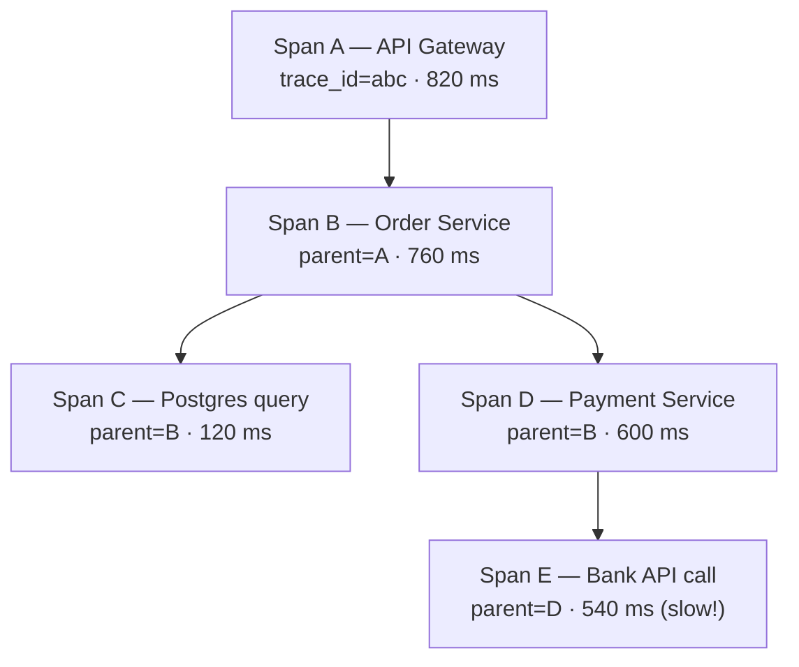
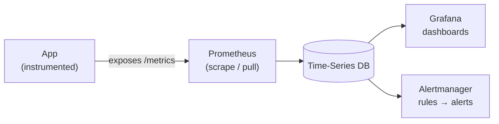
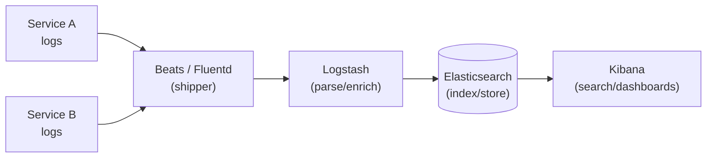

# Observability — Junior Interview Questions

> **Collection:** [System Design](../README.md) · **Level:** Junior · **Section 24 of 42**
> **Goal:** Confirm you can explain the three pillars of observability, turn vague
> "is it healthy?" questions into measurable signals (SLIs, SLOs, error budgets),
> apply the RED and USE methods to pick the right metrics, follow a request across
> services with distributed tracing, and reason about how telemetry is collected,
> stored, and turned into alerts that a human can act on.

Observability is the difference between "the site feels slow" and "the checkout
service's p99 latency tripled at 14:03 because its database connection pool
saturated." A junior answer here is one that names *concrete signals and tools* —
OpenTelemetry, Prometheus, Jaeger, the ELK stack — and that distinguishes
**monitoring** (watching things you already knew to watch) from **observability**
(being able to ask new questions of a running system without shipping new code).
Each question lists **what the interviewer is really probing**, a **model answer**,
and often a **follow-up** they will ask next.

---

## Contents

1. [Logs, Metrics, Traces — the Three Pillars](#1-logs-metrics-traces--the-three-pillars)
2. [SLO / SLI / Error Budgets](#2-slo--sli--error-budgets)
3. [RED & USE Methods](#3-red--use-methods)
4. [Distributed Tracing](#4-distributed-tracing)
5. [Metrics Pipelines](#5-metrics-pipelines)
6. [Log Aggregation](#6-log-aggregation)
7. [Alerting & On-Call](#7-alerting--on-call)
8. [Rapid-Fire Self-Check](#8-rapid-fire-self-check)

---

## 1. Logs, Metrics, Traces — the Three Pillars

### Q1.1 — What are the three pillars of observability, and what is each good for?

**Probing:** Do you know all three *and* when to reach for each? Juniors often
conflate logs and metrics.

**Model answer:**

| Pillar | What it is | Best at | Weak at | Example tool |
|---|---|---|---|---|
| **Metrics** | Numeric measurements aggregated over time (counters, gauges, histograms) | Cheap dashboards & alerts; "*is* something wrong, and how much?" | Cardinality limits; can't tell you *which* request failed | Prometheus, Grafana |
| **Logs** | Timestamped, often structured records of discrete events | Deep detail on one event; "*what exactly* happened here?" | Expensive to store/query at volume; hard to aggregate | ELK (Elasticsearch/Logstash/Kibana), Loki |
| **Traces** | The path of a single request across services, as timed spans | "*Where* in the call graph did time go / did it break?" | Sampling means you may not have the trace you want | Jaeger, Tempo, Zipkin |

The shorthand: **metrics tell you something is wrong, traces tell you where, and
logs tell you why.** A good investigation usually flows metric → trace → log,
zooming from aggregate to a single line of detail.

**Follow-up:** *"Why not just log everything and compute metrics from logs?"* →
Because logs are far more expensive to store and query at scale. Computing a p99
latency by scanning billions of log lines is slow and costly; a pre-aggregated
histogram answers it in milliseconds. Logs and metrics are complementary, not
substitutes.

### Q1.2 — What's the difference between monitoring and observability?

**Probing:** Conceptual maturity — these words are often used loosely.

**Model answer:** **Monitoring** is watching a predefined set of signals you
*already decided* matter — CPU, error rate, a dashboard you built in advance. It
answers known questions. **Observability** is a property of the system: having rich
enough telemetry (high-cardinality, well-structured) that you can ask *new*
questions about its internal state after the fact, without deploying new code —
e.g., "show me latency just for users in Germany on the new app version." Monitoring
catches the failures you anticipated; observability helps you debug the ones you
didn't.

### Q1.3 — What does "structured logging" mean and why does it matter?

**Probing:** Practical logging hygiene.

**Model answer:** Structured logging emits each log entry as machine-parseable
key–value data — typically JSON — instead of a free-text string. So instead of
`"User 42 failed login from 1.2.3.4"` you emit
`{"event":"login_failed","user_id":42,"ip":"1.2.3.4","ts":"..."}`. It matters
because you can then *query and aggregate* logs ("count `login_failed` by `ip`")
instead of writing fragile regexes against prose. It also pairs naturally with
correlation IDs (a `trace_id` field) so logs can be tied back to a specific request.

---

## 2. SLO / SLI / Error Budgets

### Q2.1 — Define SLI, SLO, and SLA, and how they relate.

**Probing:** The vocabulary of reliability. Juniors frequently mix up SLO and SLA.

**Model answer:**

| Term | Stands for | Plain meaning | Example |
|---|---|---|---|
| **SLI** | Service Level *Indicator* | A measured number — the actual signal | "% of requests served in < 200 ms" = 99.92% |
| **SLO** | Service Level *Objective* | The internal target for that SLI | "99.9% of requests in < 200 ms over 28 days" |
| **SLA** | Service Level *Agreement* | A contract with customers, with penalties | "99.5% uptime or we refund 10%" |

The relationship: you **measure** an SLI, you **aim** for an SLO, and you **promise**
an SLA. SLAs are usually looser than SLOs on purpose — you set your internal target
tighter than your external promise so you have margin before you break a contract.

**Follow-up:** *"Why measure an SLI as a ratio of good events rather than an
average?"* → Averages hide tail pain. An average latency of 100 ms can still mean
5% of users wait 3 seconds. A ratio like "fraction of requests under 200 ms"
directly captures the user experience and matches how SLOs are written.

### Q2.2 — What is an error budget and how is it used?

**Probing:** The single most useful operational idea in this section.

**Model answer:** An error budget is the amount of unreliability you're *allowed* —
it's `100% − SLO`. If your SLO is 99.9% successful requests, your error budget is
0.1%; over a month that might be, say, ~43 minutes of "down" or a few thousand
failed requests. The budget turns reliability into a number you can *spend*: while
budget remains, the team can ship features fast and take risks; if the budget is
exhausted, the policy flips to "freeze risky changes and focus on reliability." It
ends the endless "are we reliable enough?" argument by making it data-driven.

**Follow-up:** *"What happens when you burn the budget too fast?"* → A **burn-rate
alert** fires. Burning a month's budget in an hour is an emergency even if the raw
error rate looks small; burning it slowly over weeks is a lower-urgency signal.

### Q2.3 — Why not just target 100% availability?

**Probing:** Understanding the cost curve of reliability.

**Model answer:** Because each additional nine costs exponentially more (redundancy,
multi-region, on-call burden) while users rarely notice it — their own network and
device are often less reliable than your service already is. 100% is also
impossible: dependencies fail, deploys happen, hardware dies. A well-chosen SLO
(say 99.9%) is the point where more reliability isn't worth the engineering cost,
and the *error budget* it implies is what lets the team keep shipping.

---

## 3. RED & USE Methods

### Q3.1 — What are the RED and USE methods, and when do you use each?

**Probing:** Do you know two standard recipes for "which metrics should I even
collect?"

**Model answer:** Both are checklists for picking metrics, but from different angles:

| | **RED** (request-centric) | **USE** (resource-centric) |
|---|---|---|
| Stands for | **R**ate, **E**rrors, **D**uration | **U**tilization, **S**aturation, **E**rrors |
| Asks about | A *service* handling requests | A *resource* (CPU, disk, queue, pool) |
| Coined by | Tom Wilkinson (Weaveworks) | Brendan Gregg |
| Use it for | "How is my API doing for users?" | "Is this machine/component the bottleneck?" |
| Example signals | req/s, % 5xx, p99 latency | CPU %, run-queue depth, ENOMEM errors |

- **RED** = **Rate** (requests per second), **Errors** (how many failed), **Duration**
  (how long they took). Apply it to every service.
- **USE** = **Utilization** (how busy a resource is), **Saturation** (how much
  queued/waiting work it has), **Errors** (error events). Apply it to every resource.

They're complementary: RED tells you the *symptom* users feel; USE helps you find
the *resource* that's the cause. There's also the **Four Golden Signals** (Google
SRE): latency, traffic, errors, saturation — essentially RED plus saturation.

**Follow-up:** *"Utilization is at 60% — is the resource fine?"* → Not necessarily.
Utilization is an *average*; saturation (queue depth, wait time) can be high even at
moderate average utilization due to bursts. That's why USE pairs the two — high
saturation with moderate utilization signals a bottleneck a utilization gauge alone
would miss.

### Q3.2 — For a payments API, what three metrics would you start with?

**Probing:** Can you apply RED concretely?

**Model answer:** Start with RED:
1. **Rate** — payment requests per second, so I know the load and can spot traffic
   anomalies.
2. **Errors** — the fraction returning 5xx or a declined-due-to-our-fault code, which
   is the core reliability signal and feeds the SLO.
3. **Duration** — latency as a histogram so I can watch **p50/p95/p99**, because the
   tail is what frustrates users and what an average would hide.

From there I'd add USE on the dependencies (database connection pool saturation,
queue depth) to explain *why* the RED numbers move.

---

## 4. Distributed Tracing

### Q4.1 — What problem does distributed tracing solve that logs and metrics don't?

**Probing:** Why traces exist at all in a microservice world.

**Model answer:** In a microservice architecture, one user click fans out into calls
across many services. A metric tells you the overall request was slow; per-service
logs are scattered and hard to stitch together. **Distributed tracing follows a
single request end-to-end**, recording each hop as a timed **span** with a shared
**trace ID**, so you can see the *whole* call tree and exactly which service (or
which serial dependency) consumed the time or threw the error. It answers "where did
my 800 ms go?" across service boundaries — something no single service's logs can.

### Q4.2 — Explain spans, trace IDs, and context propagation.

**Probing:** The mechanics of how a trace is actually assembled.

**Model answer:** A **trace** represents one request's journey and is identified by a
single **trace ID**. Each unit of work within it — an HTTP handler, a DB query — is a
**span**, with a start time, duration, and a **parent span ID** linking it to its
caller. Together the spans form a tree. **Context propagation** is how the trace ID
and parent span ID travel between services: the caller injects them into outgoing
request headers (e.g., the W3C `traceparent` header), and the callee extracts them so
its spans attach to the same trace. **OpenTelemetry** is the vendor-neutral standard
for generating and propagating this context; **Jaeger** or **Zipkin** then collect
and visualize the assembled traces.

The flat metric just said "820 ms." The trace shows the bank API call (span E, 540
ms) is the real culprit, nested two levels deep — exactly the insight tracing gives
you that a single latency number cannot.

**Follow-up:** *"All those spans share one trace ID — how does each service know
it?"* → It rides along in request headers via context propagation; each service reads
the incoming `traceparent`, creates child spans under it, and re-injects it on any
calls it makes downstream.

### Q4.3 — Why is trace sampling necessary, and what's the trade-off?

**Probing:** Awareness that you usually can't trace 100% of traffic.

**Model answer:** A high-traffic service produces far too many traces to store and
process all of them — the cost and overhead would be enormous. **Sampling** keeps
only a fraction (say 1%). The trade-off is coverage: with **head-based sampling** you
decide at the start of the request, cheaply, but you might drop the very trace
containing a rare error. **Tail-based sampling** decides *after* the request finishes,
so you can keep all the slow or failed traces and a sample of the normal ones — better
signal, but it needs more infrastructure because you must buffer spans until the trace
completes.

---

## 5. Metrics Pipelines

### Q5.1 — Walk through how a metric gets from application code to a dashboard.

**Probing:** End-to-end mental model of a metrics system.

**Model answer:** Roughly four stages:
1. **Instrument** — the app increments counters / records histograms via a client
   library (e.g., the OpenTelemetry or Prometheus client) and exposes them, often on
   a `/metrics` endpoint.
2. **Collect** — a system gathers the numbers. **Prometheus** *pulls* (scrapes) each
   target on an interval; push-based systems (StatsD, the OTel Collector) have apps
   *send* metrics to a collector instead.
3. **Store** — values land in a **time-series database** (TSDB) optimized for
   `(metric, labels, timestamp → value)` data.
4. **Query & visualize** — a tool like **Grafana** runs queries (e.g., PromQL) against
   the TSDB to draw dashboards and evaluate alert rules.

### Q5.2 — Pull vs push for metrics collection — what's the difference?

**Probing:** A classic design trade-off in metrics systems.

**Model answer:** With **pull** (Prometheus' default), the monitoring system reaches
out and scrapes each target's `/metrics` endpoint on a schedule. The collector
controls the rate, and a target that stops responding is itself a clear "down"
signal. With **push**, the application sends metrics to a collector. Push suits
short-lived jobs (a batch task may finish before any scrape) and clients behind
firewalls that the collector can't reach. Many real setups use both: pull for
long-lived services, push (via a gateway or the OTel Collector) for ephemeral jobs.

### Q5.3 — What are the basic metric types: counter, gauge, histogram?

**Probing:** Foundational vocabulary you'll use in every PromQL query.

**Model answer:**
- **Counter** — a value that only ever goes *up* (or resets to zero on restart):
  total requests, total errors. You usually look at its *rate* of increase.
- **Gauge** — a value that goes up *and* down: current memory in use, queue depth,
  in-flight requests — a snapshot.
- **Histogram** — buckets observations to let you compute distributions and
  **percentiles** (p50/p95/p99), e.g., request latency. Essential because the tail,
  not the average, is what hurts users.

**Follow-up:** *"What is cardinality and why does it matter?"* → Cardinality is the
number of unique label combinations for a metric. Adding a high-cardinality label
like `user_id` creates a separate time series per user, which can explode memory and
storage and bring a metrics system to its knees. Keep labels low-cardinality (status
code, region) — push per-request detail into traces or logs instead.

---

## 6. Log Aggregation

### Q6.1 — Why do we aggregate logs centrally instead of reading them on each box?

**Probing:** The motivation for an ELK-style pipeline.

**Model answer:** In a distributed system, logs are scattered across many ephemeral
instances — and containers vanish, taking their local logs with them. **Centralized
log aggregation** ships every instance's logs to one searchable store so you can query
across the whole fleet from one place, correlate events between services, and still
have the logs after a pod dies. It turns "SSH into ten boxes and `grep`" into one
search query.

### Q6.2 — Describe a typical log aggregation pipeline, e.g., the ELK stack.

**Probing:** Concrete knowledge of a real toolchain.

**Model answer:** The classic **ELK** pipeline has three stages, plus a shipper:
- A lightweight **shipper/agent** on each host (Filebeat, Fluentd, or the OTel
  Collector) tails log files and forwards them.
- **Logstash** (the "L") parses, filters, and enriches the lines — turning raw text
  into structured fields.
- **Elasticsearch** (the "E") indexes and stores them for fast full-text and
  field-based search.
- **Kibana** (the "K") is the UI for searching, filtering, and dashboarding.

A common lighter-weight alternative is **Grafana Loki**, which indexes only labels
(not full text), making it cheaper to run at the cost of less powerful search.

### Q6.3 — What are log levels, and why not just log everything at the highest detail?

**Probing:** Operational judgement about log volume and cost.

**Model answer:** Log levels (`DEBUG`, `INFO`, `WARN`, `ERROR`) rank entries by
severity so you can filter signal from noise and tune verbosity per environment —
verbose `DEBUG` in staging, mostly `WARN`/`ERROR` in production. You don't log
everything at full detail because volume is expensive: storage and indexing cost real
money, high write rates can swamp the pipeline, and a flood of noise *buries* the one
line that mattered. The skill is logging *enough* structured context to debug,
attaching a `trace_id` so logs tie back to traces, and not logging secrets or PII.

---

## 7. Alerting & On-Call

### Q7.1 — What makes a good alert versus a bad one?

**Probing:** The most practical, judgement-heavy topic in this section.

**Model answer:** A good alert is **actionable, urgent, and tied to user impact** —
it fires only when a human needs to do something *now*, and it points toward what.
A bad alert is noisy, ambiguous, or fires on a cause that doesn't actually hurt users
(e.g., "CPU is at 90%" when latency is fine). The gold standard is **alert on
symptoms, not causes**: page on "error rate breached the SLO" (a symptom users feel),
not on every internal hiccup. High CPU that doesn't degrade the user experience is a
*dashboard*, not a *page*.

**Follow-up:** *"What is alert fatigue and why is it dangerous?"* → When alerts fire
too often or for non-issues, on-call engineers start ignoring them — and then miss the
real one. It also burns people out. The fix is fewer, higher-quality, symptom-based
alerts, plus tuning thresholds and deleting alerts nobody acts on.

### Q7.2 — Page vs ticket vs log — how do you decide an alert's urgency?

**Probing:** Severity routing, not just "fire an alert."

**Model answer:** Match the response to the urgency:

| Severity | Means | Channel | Example |
|---|---|---|---|
| **Page** | Act now, wake someone up | Phone/PagerDuty | Checkout down; SLO burning fast |
| **Ticket** | Needs attention, not tonight | Issue tracker / Slack | Disk 70% full, trending up |
| **Log / dashboard** | Informational only | No notification | Single transient timeout, auto-recovered |

The rule of thumb: only **page** for things that are both urgent *and* actionable. If
it can wait until business hours, it's a ticket. If no one needs to do anything, it's
just a dashboard line.

### Q7.3 — What is on-call, and what practices keep it humane?

**Probing:** Awareness that observability serves *people*, not just systems.

**Model answer:** **On-call** is a rotation where designated engineers are responsible
for responding to production alerts during their shift, including outside business
hours. Humane practices: a **runbook** for each alert (so the responder knows the
steps), a **rotation** so the load is shared and no one is always on the hook,
**escalation policies** (if the primary doesn't ack in N minutes, page the secondary),
**blameless postmortems** that fix systems rather than people, and continuously
**pruning noisy alerts** so sleep is interrupted only for things that truly matter.

**Follow-up:** *"What's a runbook?"* → A short, step-by-step document attached to an
alert: what it means, how to confirm impact, immediate mitigations, and who to
escalate to. It lets a half-awake engineer act correctly without reverse-engineering
the system at 3 a.m.

---

## 8. Rapid-Fire Self-Check

If you can answer each of these in a sentence, you're ready for the junior bar on this section:

- [ ] What are the three pillars, and what is each best at? *(metrics = is it wrong; traces = where; logs = why)*
- [ ] Monitoring vs observability — the difference? *(known questions vs asking new ones of a live system)*
- [ ] SLI vs SLO vs SLA? *(measured number vs internal target vs external contract)*
- [ ] What is an error budget and how is it spent? *(100% − SLO; spend it on shipping until it runs out)*
- [ ] RED vs USE — what does each cover? *(Rate/Errors/Duration for services; Utilization/Saturation/Errors for resources)*
- [ ] What are spans and trace IDs, and how does context propagate? *(timed units of work, shared ID, carried in request headers)*
- [ ] Why is trace sampling needed, and head- vs tail-based? *(too much volume; decide at start vs after, to keep the failures)*
- [ ] Pull vs push metrics collection — one trade-off each.
- [ ] Counter vs gauge vs histogram? *(only-up / up-and-down / distribution for percentiles)*
- [ ] Name the ELK components. *(Elasticsearch, Logstash, Kibana — plus a shipper like Beats)*
- [ ] What makes a good alert? *(actionable, urgent, symptom-based — page only when a human must act now)*
- [ ] Page vs ticket vs log — how do you decide?

---

**Next step:** Section 25 — [Chaos Engineering](25-chaos-engineering.md): deliberately injecting failure to prove your system — and your observability — actually hold up.
