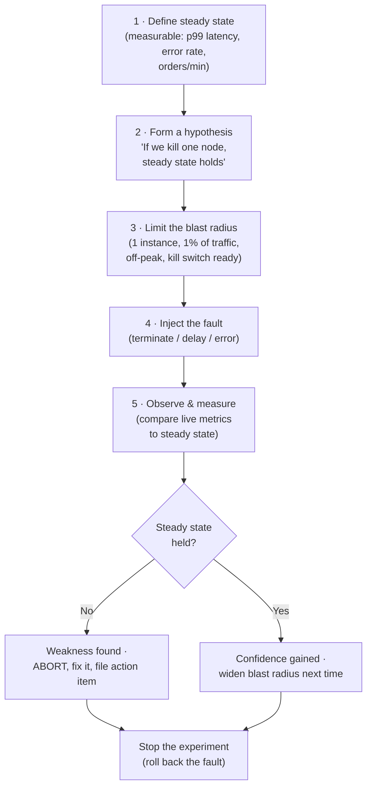

# Chaos Engineering — Junior Interview Questions

> **Collection:** [System Design](../README.md) · **Level:** Junior · **Section 25 of 42**
> **Goal:** Confirm you can explain *why* deliberately breaking a system makes it
> stronger, name the failure modes a distributed system actually suffers, describe how
> a fault is injected and observed, run a basic Game Day, and — most importantly —
> contain the blast radius so an experiment never becomes an outage.

Chaos engineering is the practice of *running controlled experiments on a system to
build confidence that it survives turbulent conditions in production.* A "junior"
answer here is not "we randomly break things." It is a *disciplined, hypothesis-driven,
blast-radius-limited* one. Interviewers are checking that you understand the difference
between testing (does this code path work?) and chaos engineering (does the *whole
system* stay healthy when something fails?), that you reach for the real example —
Netflix's **Chaos Monkey** — and that your first instinct is to ask *"how do we stop
this from hurting users?"* Each question below lists **what the interviewer is really
probing**, a **model answer**, and often a **follow-up** they will ask next.

---

## Contents

1. [Failure Modes](#1-failure-modes)
2. [Fault Injection](#2-fault-injection)
3. [Game Days](#3-game-days)
4. [Resilience Testing](#4-resilience-testing)
5. [Blast Radius & Recovery](#5-blast-radius--recovery)
6. [Rapid-Fire Self-Check](#6-rapid-fire-self-check)

---

## 1. Failure Modes

### Q1.1 — What is chaos engineering, in one sentence, and why would anyone break production on purpose?

**Probing:** Do you understand it is *controlled, confidence-building experimentation* —
not vandalism?

**Model answer:** Chaos engineering is the discipline of injecting controlled failures
into a system to verify it behaves the way you *believe* it does under stress, so you
discover weaknesses before real outages do. The reason to do it in (or close to)
production is that failures are emergent: a service can pass every unit test and still
collapse when a downstream dependency slows down, a node disappears, or a retry storm
forms. Those behaviors only appear at real scale with real traffic. Netflix pioneered
this with **Chaos Monkey**, which randomly terminates production instances during
business hours — forcing engineers to build services that tolerate any single machine
vanishing, rather than hoping one never does.

**Follow-up:** *"Isn't that just testing?"* → Testing asks "does this component do the
right thing in isolation?" Chaos engineering asks "does the *whole system* stay healthy
when a real-world fault occurs?" — a question you cannot answer from a single unit test.

### Q1.2 — Name the common failure modes a distributed system actually suffers.

**Probing:** Vocabulary. Juniors often only think of "the server crashes."

**Model answer:** The big categories are:

| Failure mode | What happens | Why it's nasty |
|---|---|---|
| **Crash / instance loss** | A node or process dies outright | Easiest to handle *if* you designed for it; lethal if you didn't |
| **Latency / slow dependency** | A service responds, but very slowly | Often *worse* than a crash — threads/connections pile up and back-pressure spreads |
| **Network partition** | Nodes can't reach each other | Forces consistency-vs-availability choices (CAP) |
| **Resource exhaustion** | CPU, memory, disk, or connections run out | Causes cascading slowdowns and OOM kills |
| **Dependency failure** | A database, cache, or third-party API is down | Tests your fallbacks and timeouts |
| **Gray failure** | Component is "up" but misbehaving (corrupt data, partial errors) | Hardest to detect — health checks say green |

The subtle insight: a **slow** dependency is frequently more dangerous than a **dead**
one, because a dead one fails fast and your retries/circuit breakers kick in, while a
slow one quietly consumes every thread and connection until the whole service stalls.

### Q1.3 — What is a "cascading failure," and give a concrete example.

**Probing:** Do you understand how one small failure becomes a total outage?

**Model answer:** A cascading failure is when one component's failure overloads its
neighbors, which then fail and overload *their* neighbors, until the whole system is
down. Classic example: a cache cluster loses a node, so all its traffic suddenly hits
the database; the database can't handle the flood, slows down; application threads block
waiting on the slow database; the thread pool fills; the service stops answering health
checks; the load balancer marks it down and shifts traffic to the *remaining* servers,
which now get even more load and fall over too. One lost cache node took down the entire
service. Chaos experiments deliberately probe for these chains so you can add bulkheads,
circuit breakers, and back-pressure before they happen for real.

### Q1.4 — Why do failures cluster instead of staying isolated?

**Probing:** Awareness that real systems have shared resources and tight coupling.

**Model answer:** Because services share things — connection pools, thread pools,
network links, a common database, a retry policy. When one part struggles, it consumes
a shared resource (e.g., all the connections to a downstream service), starving
everything else that needs it. Tight coupling (synchronous calls with no timeout, no
isolation) lets the failure propagate instantly. The whole point of resilience
patterns — timeouts, bulkheads, circuit breakers — is to *decouple* failures so one
component's bad day stays contained.

---

## 2. Fault Injection

### Q2.1 — What is fault injection, and what are the typical "faults" you can inject?

**Probing:** Mechanical fluency — do you know the actual knobs?

**Model answer:** Fault injection is deliberately introducing a controlled fault into a
running system to observe how it responds. The common faults map directly to the failure
modes:

| Injected fault | How it's simulated | What it tests |
|---|---|---|
| **Kill an instance** | Terminate a VM/pod/process | Self-healing, redundancy, failover |
| **Add latency** | Delay responses by N ms | Timeouts, back-pressure, user experience |
| **Drop / error responses** | Return 500s or refuse connections | Retries, fallbacks, circuit breakers |
| **Network partition** | Block traffic between nodes | Consistency model, split-brain handling |
| **Resource pressure** | Burn CPU, fill memory or disk | Autoscaling, graceful degradation |
| **Clock skew** | Shift a node's clock | Time-sensitive logic, token expiry |

The Netflix **Simian Army** generalized this idea beyond Chaos Monkey: **Latency Monkey**
injects artificial delays, **Chaos Gorilla** takes down a whole Availability Zone, and
**Chaos Kong** simulates the loss of an entire AWS region.

### Q2.2 — Walk me through the lifecycle of a single chaos experiment.

**Probing:** Do you follow a disciplined method, or just "break stuff and see"?

**Model answer:** Every experiment has the same shape. (1) **Define a steady state** —
a *measurable* signal of "the system is healthy," like p99 latency under 200 ms or
1,000 orders/minute. (2) **Form a hypothesis** — "if I terminate one instance, the
steady state will be unaffected." (3) **Limit the blast radius** — start with the
smallest possible scope and have a kill switch. (4) **Inject the fault.** (5)
**Observe** — compare live metrics to the steady state. If it held, you've *gained
confidence* and can widen scope next time; if it broke, you've *found a weakness* —
abort immediately, roll back, and fix it.

**Follow-up:** *"What if you can't define a steady state?"* → Then you're not ready to
run the experiment — you'd have no way to tell success from failure. Defining the metric
*is* the first deliverable.

### Q2.3 — Why must a chaos experiment always have a "kill switch"?

**Probing:** Safety-first instinct.

**Model answer:** Because a chaos experiment is a *bet*, and sometimes you lose. If the
fault starts causing real customer harm — error rate spiking, orders failing — you need
to stop it instantly and return to normal. A kill switch (an automated abort that rolls
back the injected fault the moment a guardrail metric is breached) is what separates a
controlled experiment from an outage you caused. The rule of thumb: never run a chaos
experiment you can't stop within seconds.

### Q2.4 — Why does Netflix run Chaos Monkey during business hours, not at 3 a.m.?

**Probing:** Understanding the purpose — engineers, not just code, must be ready.

**Model answer:** Because the goal is to make instance loss a *non-event*. If Chaos
Monkey killed instances at 3 a.m., a failure that the system *didn't* handle would page
a half-asleep engineer with no colleagues around. Running it during business hours means
that when something *does* break, the whole team is awake, watching, and able to fix it
fast — and over time, the constant low-grade pressure forces every service to be built
so that losing a single instance simply doesn't matter. You normalize failure by
practicing it when you're best equipped to respond.

---

## 3. Game Days

### Q3.1 — What is a "Game Day"?

**Probing:** Do you know chaos engineering includes a *human/process* dimension, not
just automated tooling?

**Model answer:** A Game Day is a planned, scheduled exercise where a team deliberately
injects a failure into a system and practices detecting and responding to it — like a
fire drill for software. The point isn't only to test the *system*; it's to test the
*people and process*: Did the right alert fire? Did the on-call engineer get paged? Was
the runbook accurate? How long did recovery take? You learn whether your monitoring,
dashboards, and incident response actually work — *before* a real incident, when the
stakes are real and the clock is unforgiving.

### Q3.2 — Walk me through how you'd run your first Game Day.

**Probing:** Practical organization, and again — safety.

**Model answer:**
1. **Pick one clear scenario** — e.g., "the primary database fails over to a replica."
   Keep it small for the first one.
2. **State the hypothesis** — "failover completes in under 30 seconds and no orders are
   lost."
3. **Schedule it and tell people** — announce the window, assign roles (who injects, who
   observes, who is on-call), and have a kill switch.
4. **Run it in a controlled window** — ideally staging first, then a blast-radius-limited
   slice of production, during low traffic.
5. **Observe and time everything** — when did the alert fire? when did a human notice?
   how long to recover?
6. **Run a blameless retrospective** — what surprised us? what was missing? Each surprise
   becomes an action item.

**Follow-up:** *"What's the most common outcome of a first Game Day?"* → Discovering the
*monitoring* was wrong — the alert never fired, or fired too late, or paged the wrong
team. Finding that in a drill is a win; finding it during a real outage is a disaster.

### Q3.3 — What is a "blameless" retrospective and why does it matter for chaos work?

**Probing:** Cultural maturity.

**Model answer:** A blameless retrospective focuses on *what in the system and process
allowed the failure*, not *who made a mistake*. It matters because the whole value of a
Game Day is honest information: if people fear blame, they hide what really happened, and
you learn nothing. Treating failure as a property of the system — fixable with better
guardrails, runbooks, and automation — is what turns each incident into a permanent
improvement instead of a search for someone to punish.

---

## 4. Resilience Testing

### Q4.1 — How is resilience testing different from regular testing?

**Probing:** The core conceptual distinction of this section.

**Model answer:**

| | Regular testing | Resilience / chaos testing |
|---|---|---|
| **Question asked** | "Does the code do the right thing?" | "Does the system stay healthy when something fails?" |
| **Scope** | One unit or service in isolation | The whole system, with real dependencies |
| **Environment** | CI, mocked dependencies | Staging or production, real infrastructure |
| **Failure model** | Assumes dependencies work | Assumes dependencies *will* fail |
| **Success** | Assertions pass | Steady-state metric holds despite the fault |

Regular tests verify *correctness under normal conditions*. Resilience testing verifies
*survival under abnormal conditions*. You need both: a service can be 100% correct in
tests and still melt down the first time its cache goes away.

### Q4.2 — Which resilience patterns are you actually testing when you inject a slow dependency?

**Probing:** Can you connect the experiment to the defenses it validates?

**Model answer:** Injecting latency into a dependency tests several patterns at once:

- **Timeouts** — does the caller give up after a sane bound, or wait forever?
- **Circuit breaker** — after enough slow/failed calls, does it stop calling the sick
  dependency and fail fast?
- **Bulkhead** — is the slow dependency isolated to its own thread/connection pool, so it
  can't starve the rest of the service?
- **Fallback / graceful degradation** — when the dependency is unavailable, does the
  system serve a degraded-but-useful response (e.g., cached or default data) instead of
  an error?

If injecting 5 seconds of latency into a non-critical dependency takes down your whole
service, you've just proven you're missing timeouts and bulkheads.

### Q4.3 — What does "graceful degradation" mean, with an example?

**Probing:** A key resilience concept juniors should be able to make concrete.

**Model answer:** Graceful degradation means that when a part of the system fails, the
product loses a *feature* instead of going fully down. Example: on Netflix, if the
*personalized recommendations* service is unavailable, the app doesn't show an error
screen — it falls back to a generic, non-personalized list of popular titles. The user
gets a slightly worse experience, but they can still browse and watch. The recommendation
failure is contained to one row of the UI rather than breaking the entire homepage. Chaos
experiments are how you *prove* that fallback actually works.

### Q4.4 — Where should you run resilience tests — staging or production?

**Probing:** Nuance and safety, not a dogmatic answer.

**Model answer:** Start in **staging** to catch the obvious breakages cheaply and safely.
But the honest answer is that some failures only appear in **production**, because staging
never perfectly matches production's scale, traffic patterns, data, and real
dependencies. So the mature path is: validate in staging, then run *carefully
blast-radius-limited* experiments in production (small scope, off-peak, kill switch,
guardrail metrics). Running in production is the point — it's the only place you build
*real* confidence — but you earn the right to do it by first proving you can contain the
damage.

---

## 5. Blast Radius & Recovery

### Q5.1 — What is "blast radius" and why is limiting it the central safety rule?

**Probing:** The single most important safety concept in chaos engineering.

**Model answer:** Blast radius is the *scope of impact* an experiment can have — how many
users, requests, or systems it could affect if it goes wrong. Limiting it is the central
rule because chaos experiments are run on real systems, and the difference between a
*useful experiment* and a *self-inflicted outage* is entirely about scope. You contain
the blast radius by starting small and widening only as confidence grows:

| Lever | Small (start here) | Wide (only after success) |
|---|---|---|
| **Scope of fault** | 1 instance | A whole Availability Zone |
| **Traffic affected** | 1% of users | All users |
| **Timing** | Off-peak hours | Peak traffic |
| **Environment** | Staging | Production |
| **Duration** | Seconds, with kill switch | Sustained |

The principle: **minimize the blast radius, maximize the learning.** You want the
smallest experiment that still teaches you something real.

### Q5.2 — How do you actually contain the blast radius in practice?

**Probing:** Concrete mechanisms, not just the concept.

**Model answer:** A handful of concrete controls:

- **Scope the fault** to one instance, one shard, or one cell — never the whole fleet.
- **Limit affected traffic** — route only 1% of requests (or internal test traffic) into
  the experiment.
- **Define guardrail metrics** — pre-agreed thresholds (error rate, latency) that
  **automatically abort** the experiment when breached.
- **Have a kill switch** — a single action that instantly rolls back the injected fault.
- **Run off-peak first**, and announce the window so humans are watching.

Together these mean that even in the worst case, only a tiny, recoverable slice of the
system was ever at risk.

### Q5.3 — After an experiment finds a weakness, what happens — and what does "recovery" mean here?

**Probing:** Closing the loop. An experiment that finds a bug and changes nothing is wasted.

**Model answer:** Two senses of recovery matter. **(1) Immediate recovery:** the moment
the steady state breaks, you abort — the kill switch rolls back the fault and the system
returns to normal. The *time to recover* is itself a key measurement (this is where MTTR,
mean time to recovery, comes from). **(2) Long-term recovery:** the weakness becomes an
action item — add the missing timeout, the circuit breaker, the autoscaling rule, the
fixed alert — and then you **re-run the same experiment** to confirm the fix holds. The
loop is: experiment → find weakness → fix → re-verify. A weakness found but not fixed is
just an outage you've scheduled for later.

**Follow-up:** *"What's MTTR?"* → Mean Time To Recovery — the average time to restore
service after a failure. Chaos experiments give you a safe way to *measure and improve*
it, instead of finding out the hard way during a real incident.

### Q5.4 — Should a team adopt chaos engineering before or after it has good monitoring?

**Probing:** Prerequisites and maturity — do you know chaos isn't step one?

**Model answer:** **After.** Chaos engineering is built on observation: you cannot judge
whether the steady state held if you can't *see* your steady state. Without solid
monitoring, alerting, and dashboards, an experiment is just breaking things blindly. The
sensible maturity order is: first get reliable monitoring and the resilience basics
(timeouts, retries, health checks, redundancy) in place; *then* introduce chaos
engineering to verify they actually work. Chaos engineering doesn't *create* resilience —
it *reveals* whether the resilience you built is real.

---

## 6. Rapid-Fire Self-Check

If you can answer each of these in a sentence, you're ready for the junior bar on this section:

- [ ] In one line, what is chaos engineering? *(controlled experiments to build confidence the system survives failure)*
- [ ] Why is a *slow* dependency often worse than a *dead* one? *(it quietly consumes threads/connections instead of failing fast)*
- [ ] What is a cascading failure? *(one component's failure overloads its neighbors until the whole system is down)*
- [ ] What are the five steps of a chaos experiment? *(steady state → hypothesis → limit blast radius → inject → observe)*
- [ ] Why does Netflix run Chaos Monkey during business hours? *(so engineers are awake and ready, normalizing instance loss)*
- [ ] What is a Game Day testing besides the system? *(the people, process, monitoring, and runbooks)*
- [ ] How is resilience testing different from unit testing? *(survival under failure vs correctness in isolation)*
- [ ] Give an example of graceful degradation. *(Netflix falls back to generic recommendations when personalization is down)*
- [ ] What is blast radius and the rule about it? *(scope of impact — minimize it, maximize learning)*
- [ ] Should chaos engineering come before or after good monitoring? *(after — you can't observe a steady state without it)*

---

**Next step:** Section 26 — [Deployment & Infrastructure](26-deployment-infrastructure.md): how systems get built, shipped, and run in production.
