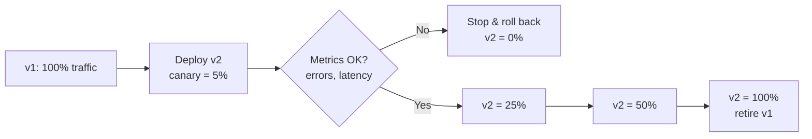
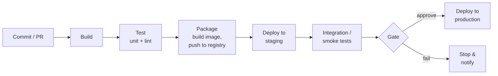

# Deployment & Infrastructure — Junior Interview Questions

> **Collection:** [System Design](../README.md) · **Level:** Junior · **Section 26 of 42**
> **Goal:** Confirm you can package an app into a container, explain what an
> orchestrator does for you, ship a change safely without a full outage, and reason
> about how a system survives a region failing — using concrete tools and real numbers.

A "junior" answer here is not a shallow answer — it is a *correct, concrete, and
honest* one. Interviewers at this level want to hear that you know the difference
between a container and a VM, that you can name a deployment strategy and say *why*
you'd pick it, and that you understand the words behind the acronyms (CI/CD, IaC,
RTO/RPO) instead of just reciting them. Each question lists **what the interviewer is
really probing**, a **model answer**, and often a **follow-up** they will ask next.

---

## Contents

1. [Containers & Docker](#1-containers--docker)
2. [Kubernetes Orchestration](#2-kubernetes-orchestration)
3. [Deployment Strategies](#3-deployment-strategies)
4. [CI/CD Pipelines](#4-cicd-pipelines)
5. [Infrastructure as Code](#5-infrastructure-as-code)
6. [Multi-Region Deployment](#6-multi-region-deployment)
7. [Disaster Recovery (RTO/RPO)](#7-disaster-recovery-rtorpo)
8. [Autoscaling](#8-autoscaling)
9. [Rapid-Fire Self-Check](#9-rapid-fire-self-check)

---

## 1. Containers & Docker

### Q1.1 — What is a container, and how is it different from a virtual machine?

**Probing:** Do you know what is actually being virtualized? This is the single most common confusion.

**Model answer:** A container packages an application together with its libraries and
dependencies so it runs the same way everywhere. The key difference is the *layer* being
shared. A **virtual machine** virtualizes the hardware — each VM ships a full guest
operating system on top of a hypervisor, so it's heavy (gigabytes, tens of seconds to
boot). A **container** virtualizes the operating system — all containers on a host share
the host's kernel and are isolated with Linux primitives (namespaces and cgroups), so
they're light (megabytes, sub-second to start). The trade-off: VMs give stronger
isolation; containers give far higher density and speed.

| | Virtual Machine | Container |
|---|---|---|
| Virtualizes | Hardware (full guest OS) | The OS (shares host kernel) |
| Typical size | Gigabytes | Tens of megabytes |
| Start time | Seconds to minutes | Milliseconds to seconds |
| Isolation | Stronger (separate kernel) | Weaker (shared kernel) |
| Density per host | Tens | Hundreds to thousands |

**Follow-up:** *"Can you run a Windows container on a Linux host?"* → Not natively —
containers share the host kernel, so the container OS family must match the host kernel.

### Q1.2 — What is the difference between a Docker image and a Docker container?

**Probing:** Class vs instance thinking applied to deployment.

**Model answer:** An **image** is the immutable, read-only template — the built artifact
containing your app, its dependencies, and a startup command, stored as stacked layers.
A **container** is a running (or stopped) *instance* of an image, with a thin writable
layer on top. The relationship is exactly like class and object: one image, many
containers. You build an image once (`docker build`), push it to a registry, and run
many identical containers from it across your fleet.

### Q1.3 — Why are containers good for system design? Name two concrete benefits.

**Probing:** Connecting the tool to architecture, not just defining it.

**Model answer:** **(1) "Works on my machine" goes away** — because the image bundles
the exact runtime and dependencies, the artifact that passes tests is byte-for-byte the
one that runs in production. **(2) They are the unit of horizontal scaling** — a
container starts in under a second and is stateless if you design it that way, so an
orchestrator can launch ten more in seconds during a traffic spike and kill them when
it's over. A bonus third: they make **microservices** practical, since each service
ships and scales independently in its own container.

**Follow-up:** *"What should a container NOT store?"* → Persistent state. Containers are
ephemeral and can be killed anytime; durable data belongs in a database or attached
volume, not the container's writable layer.

---

## 2. Kubernetes Orchestration

### Q2.1 — What problem does Kubernetes solve? Why not just run containers with Docker?

**Probing:** Do you understand *orchestration* as distinct from *containerization*?

**Model answer:** Docker runs containers on *one* host. The moment you have hundreds of
containers across dozens of machines, you need answers to: which container runs where,
what happens when one crashes, how do replicas get traffic, and how do you roll out a
new version without downtime. **Kubernetes is the orchestrator** that automates exactly
that: scheduling containers onto machines, restarting failed ones, scaling replica
counts, load-balancing across them, and performing rolling updates — all from a desired
state you declare, not steps you script.

### Q2.2 — Define Pod, Deployment, and Service in one line each.

**Probing:** Fluency with the three objects every Kubernetes user touches first.

**Model answer:**
- **Pod** — the smallest deployable unit: one (or a few tightly-coupled) containers that
  share a network address and lifecycle. Pods are disposable; you rarely create them directly.
- **Deployment** — declares *"I want N identical replicas of this Pod"* and manages them:
  if a Pod dies it recreates one, and it handles rolling out new versions.
- **Service** — a stable virtual IP and DNS name in front of a set of Pods, so callers
  reach the app without caring which Pods exist right now or which machine they're on.

**Follow-up:** *"A Pod restarts and gets a new IP. How do callers still reach it?"* →
Through the Service, whose IP/DNS is stable; it tracks the live Pods behind it.

### Q2.3 — What does "declarative, desired-state" mean in Kubernetes?

**Probing:** The core mental model — the most important idea in the whole section.

**Model answer:** You don't tell Kubernetes the *steps* ("start a container, then start
another"). You tell it the *end state* you want — "3 replicas of version 2.0" — in a YAML
manifest. A control loop continuously compares the actual state to your desired state and
takes whatever action closes the gap. If a node dies and drops a replica to 2, Kubernetes
notices and starts a new one to get back to 3. This self-healing is why you describe
*what* you want, not *how* to achieve it.

---

## 3. Deployment Strategies

### Q3.1 — What is the problem with deploying by stopping the old version and starting the new one?

**Probing:** Do you see why naive deploys cause outages?

**Model answer:** That's a "recreate" deploy: you take the old version fully down, then
bring the new one up. During the gap, the service returns errors — every user sees
downtime, and if the new version is broken, you've broken production with no fast way
back. The whole point of deployment *strategies* is to ship a new version with **zero or
minimal downtime** and a **fast rollback** when something goes wrong.

### Q3.2 — Explain blue-green, canary, and rolling deployments.

**Probing:** Can you name three strategies and the trade-off of each?

**Model answer:**
- **Blue-green** — run two full environments. "Blue" is live; you deploy the new version
  to an idle "green" environment, test it, then flip the load balancer to green instantly.
  Rollback is just flipping back. Cost: you pay for double the infrastructure during the cutover.
- **Rolling** — replace instances a few at a time (e.g., 4 of 20, then the next 4) until
  all run the new version. Cheap (no extra fleet) and gradual, but during the roll you have
  *both* versions live, and rolling back means rolling forward again — slower to undo.
- **Canary** — release the new version to a small slice of traffic first (say 5%), watch
  error rates and latency, then progressively widen to 25%, 50%, 100%. It limits the blast
  radius of a bad release to that slice, but needs good monitoring to decide go/no-go.

| Strategy | Extra infra | Rollback speed | Blast radius of a bad release | Best when |
|---|---|---|---|---|
| **Blue-green** | High (2x fleet) | Instant (flip back) | All-or-nothing (caught in test) | You want instant rollback and can pay for it |
| **Rolling** | None | Slow (roll forward) | Grows as the roll proceeds | Default; cost-sensitive, gradual |
| **Canary** | Low (small slice) | Fast (stop the rollout) | Small (only the canary %) | You can measure health per-slice |

A canary rollout typically progresses like this:

**Follow-up:** *"Which gives the fastest rollback?"* → Blue-green — you just point the
load balancer back at the still-running old environment, no rebuild required.

### Q3.3 — In a canary, what signals tell you to roll back instead of proceeding?

**Probing:** Do you know what "watch the canary" actually means?

**Model answer:** You compare the canary's metrics against the stable version's over the
same window: a rise in **error rate** (5xx responses, exceptions), a regression in
**latency** (p95/p99 going up), and **business or health signals** (checkout failures,
crash loops, failing health checks). If any breach a threshold, you halt the rollout and
shift the canary's traffic back to the stable version. The discipline is to define those
thresholds *before* the deploy, not eyeball a dashboard during it.

---

## 4. CI/CD Pipelines

### Q4.1 — What do CI and CD stand for, and what is each responsible for?

**Probing:** Do you actually know the terms, or just say "CI/CD" as one word?

**Model answer:** **CI = Continuous Integration**: every push is automatically built and
tested so that integration problems surface within minutes, not at a painful end-of-sprint
merge. **CD** is overloaded — **Continuous Delivery** means every change that passes CI is
*automatically prepared and ready to release* (a human clicks deploy), while **Continuous
Deployment** goes one step further and *automatically ships* every passing change to
production with no manual gate. CI keeps the codebase always-mergeable; CD keeps it
always-releasable (or always-released).

### Q4.2 — Walk through the stages of a typical CI/CD pipeline.

**Probing:** Mechanical fluency with the canonical flow from commit to production.

**Model answer:** A change flows left to right and each stage gates the next. **Build**
compiles the code; **Test** runs unit tests and linters to catch regressions early;
**Package** builds the immutable container image and pushes it to a registry; **Deploy to
staging** runs it in a production-like environment where **integration/smoke tests**
verify it works end-to-end; then a **gate** (automatic checks, sometimes a human approval)
decides whether it promotes to **production**. The principle: fail fast and cheap on the
left so nothing broken reaches the right.

**Follow-up:** *"Why run cheap tests before expensive ones?"* → To fail fast — a 2-second
lint failure shouldn't wait behind a 10-minute integration suite. Order stages cheapest
and most-likely-to-fail first.

### Q4.3 — What is a "pipeline as code," and why is it better than clicking through a UI?

**Probing:** Awareness that the pipeline itself should be versioned.

**Model answer:** Pipeline-as-code means the build/test/deploy steps live in a file in the
repo (e.g., a YAML workflow) rather than configured by clicking buttons in a CI tool's UI.
The benefits mirror IaC: it's **version-controlled** (you can see who changed the pipeline
and why, and revert), **reviewable** (it goes through code review like any change), and
**reproducible** (a fresh repo clone has its full pipeline). UI clicks leave no history and
can't be reviewed or rolled back.

---

## 5. Infrastructure as Code

### Q5.1 — What is Infrastructure as Code, and what problem does it solve?

**Probing:** Do you understand IaC as *reproducibility*, not just "scripts"?

**Model answer:** Infrastructure as Code means you define your servers, networks,
databases, and load balancers in **declarative configuration files** (e.g., Terraform)
that are committed to version control, instead of clicking through a cloud console by
hand. It solves **configuration drift and irreproducibility**: with manual setup, no two
environments are quite the same and nobody remembers exactly how production was built. With
IaC, the same files create identical dev, staging, and production environments, every
change is reviewed and version-controlled, and you can recreate the whole stack from
scratch after a disaster.

### Q5.2 — What does "declarative" mean for IaC, and what is idempotency?

**Probing:** The two ideas that make IaC safe to re-run.

**Model answer:** **Declarative** means you describe the *desired end state* ("I want one
load balancer, three app servers, and a database"), and the tool figures out the actions
needed to reach it — versus imperative scripts that list step-by-step commands.
**Idempotency** means applying the same configuration repeatedly produces the same result:
if the three servers already exist, re-running changes nothing; if one was deleted, it
recreates just that one. Together they let you run `apply` safely anytime — the tool
reconciles reality to your declared state without you tracking what already exists.

### Q5.3 — Why should infrastructure config live in version control?

**Probing:** Connecting IaC back to ordinary software engineering hygiene.

**Model answer:** Because infrastructure changes are as risky as code changes and deserve
the same discipline: a **history** of who changed what and when, **code review** before a
change to production networking lands, the ability to **roll back** to a known-good
configuration, and a single **source of truth** the whole team reads instead of tribal
knowledge. Treating infrastructure like code is what makes it auditable and recoverable.

---

## 6. Multi-Region Deployment

### Q6.1 — Why deploy a system across multiple geographic regions?

**Probing:** Can you name the motivations beyond a vague "for reliability"?

**Model answer:** Three reasons. **(1) Lower latency** — serving users from a nearby
region avoids the ~150 ms cross-continent round trip, so a user in Tokyo hits a Tokyo
region instead of Virginia. **(2) Higher availability / disaster tolerance** — if an entire
region goes down (power, network, natural disaster), traffic fails over to another region
and the product stays up. **(3) Data residency / compliance** — some laws require user
data to physically stay within a country or region. The cost is real: cross-region data
replication, higher spend, and the hard problem of keeping data consistent across regions.

**Follow-up:** *"What new problem does multi-region create?"* → Data consistency across
regions — replicating writes over high-latency links forces a choice between strong
consistency (slow, coordinated) and eventual consistency (fast, but regions can briefly disagree).

### Q6.2 — What is the difference between active-passive and active-active multi-region?

**Probing:** Two common topologies and their trade-offs.

**Model answer:** In **active-passive**, one region serves all traffic while a second
stands by as a warm replica; on failure, you fail over to the standby. It's simpler and
avoids multi-region write conflicts, but the standby's capacity sits mostly idle and
failover takes time. In **active-active**, *all* regions serve live traffic
simultaneously — better latency for everyone and no idle capacity — but you must solve
writes happening in multiple regions at once (conflict resolution, or routing each
user/data partition to a home region). Active-active is more powerful and much harder.

### Q6.3 — A user in Europe is slow because the database is in the US. What's the simplest first improvement?

**Probing:** Practical, incremental thinking — not jumping to full active-active.

**Model answer:** Add a **read replica in Europe** so European users' *reads* are served
locally at low latency, while writes still go to the US primary. Most apps are read-heavy,
so this fixes the common case cheaply without taking on multi-region write conflicts. You'd
also front static assets with a **CDN** at the edge. Only if writes are also too slow would
you consider the much bigger step of multi-master/active-active.

---

## 7. Disaster Recovery (RTO/RPO)

### Q7.1 — Define RTO and RPO. What's the difference?

**Probing:** The two numbers that define every disaster-recovery plan — juniors mix them up constantly.

**Model answer:** Both are recovery targets, but along different axes:

- **RTO — Recovery Time Objective**: how long you can be *down* before recovering. It's
  about **time** — "we must be back up within 1 hour." It drives your failover and restore speed.
- **RPO — Recovery Point Objective**: how much *data* you can afford to lose, measured as a
  time window. It's about **data freshness** — "we can lose at most the last 5 minutes of
  writes." It drives your backup/replication frequency.

A memory hook: **RTO = "how long until we're back?"**, **RPO = "how much work did we lose?"**

| | RTO (Recovery Time Objective) | RPO (Recovery Point Objective) |
|---|---|---|
| Measures | Downtime tolerated | Data loss tolerated |
| Axis | Time to recover | Time between safe points |
| Example target | "Back up within 30 min" | "Lose at most 5 min of data" |
| Driven by | Failover/restore speed | Backup/replication frequency |

**Follow-up:** *"You want RPO near zero. What does that imply?"* → Continuous,
synchronous replication of every write — expensive and adds latency, since each write must
be acknowledged in a second location before it's confirmed.

### Q7.2 — Your backup runs once every 24 hours. What is your RPO?

**Probing:** Can you connect a concrete backup policy to the metric?

**Model answer:** Up to **24 hours** — if disaster strikes just before the next backup,
you lose almost a full day of writes back to the last successful backup. To shrink the RPO
you back up more often (e.g., hourly) or stream changes continuously to a replica or a
write-ahead log, which can push RPO down to seconds. The backup *interval* is effectively
your worst-case RPO.

### Q7.3 — What's the difference between a backup and replication for disaster recovery?

**Probing:** Do you know each protects against a *different* kind of failure?

**Model answer:** **Replication** keeps a near-live copy of the data on another node or
region, so on failure you fail over quickly — it protects against *hardware/region
failure* and gives low RTO. But replication faithfully copies *everything*, including a
bad delete or a corruption, to the replica. **Backups** are point-in-time snapshots you can
restore from, which protect against *logical errors and corruption* (someone dropped a
table, ransomware) because you can go back to a moment before the mistake. You need both:
replication for availability, backups for "undo." And a backup you've never tested
restoring is not a backup.

---

## 8. Autoscaling

### Q8.1 — What is autoscaling, and what does it buy you?

**Probing:** Core definition plus the cost/reliability motivation.

**Model answer:** Autoscaling automatically adjusts the number of running instances (or
their size) based on demand — adding capacity when load rises and removing it when load
falls. It buys you two things at once: **reliability** (you don't fall over during a
traffic spike because capacity grows with demand) and **cost-efficiency** (you don't pay
for a fleet sized for peak during the quiet hours of the night). Instead of provisioning
statically for the worst case, you track the actual curve.

### Q8.2 — What's the difference between horizontal and vertical autoscaling?

**Probing:** Two directions of scaling applied to the auto case.

**Model answer:** **Horizontal autoscaling** (scaling out/in) changes the *number* of
instances — add more identical app servers behind the load balancer when busy, remove them
when idle. This is the common, robust approach because it has no real ceiling and survives
a single instance dying. **Vertical autoscaling** (scaling up/down) changes the *size* of
an instance — give it more CPU/RAM. It's simpler but hits a hardware ceiling and usually
requires a restart. In practice, stateless web tiers scale horizontally; vertical is used
for things that are hard to spread, like some databases.

**Follow-up:** *"What property must a service have to scale horizontally?"* →
Statelessness — any instance must handle any request, so session/state lives in a shared
store (cache or database), not in instance memory.

### Q8.3 — What metric would you scale a web service on, and what's the risk of scaling too aggressively?

**Probing:** Practical tuning sense, and awareness of instability.

**Model answer:** Commonly **CPU utilization** (e.g., add instances when average CPU
exceeds 70%), or a request-based signal like requests-per-instance or queue length, which
often tracks user-facing load better than CPU. The risk of overly twitchy scaling is
**thrashing** (or "flapping"): the system scales up on a brief spike, then immediately
scales down, then up again, churning instances that take time to warm up. You damp this
with **cooldown periods**, scaling on a *sustained* average rather than instantaneous
spikes, and keeping a sensible minimum instance count so you're never starting from cold.

---

## 9. Rapid-Fire Self-Check

If you can answer each of these in a sentence, you're ready for the junior bar on this section:

- [ ] Container vs VM — what does each virtualize? *(the OS/shared kernel vs the hardware/full guest OS)*
- [ ] Image vs container? *(immutable template vs running instance — class vs object)*
- [ ] What problem does Kubernetes solve that Docker alone doesn't? *(orchestrating containers across many machines)*
- [ ] Pod, Deployment, Service — one line each.
- [ ] Blue-green vs canary vs rolling — which has the fastest rollback? *(blue-green)*
- [ ] CI vs CD — what does each stand for and do? *(integrate/test vs deliver/deploy)*
- [ ] What does IaC give you that clicking in a console doesn't? *(version control, review, reproducibility)*
- [ ] Why deploy multi-region? *(latency, availability/DR, data residency)*
- [ ] RTO vs RPO — which is time-down and which is data-lost? *(RTO = time, RPO = data)*
- [ ] A 24-hour backup interval implies what RPO? *(up to 24 hours of data loss)*
- [ ] What must a service be to scale horizontally? *(stateless)*

---

**Next step:** Section 27 — [Security at Scale](27-security-at-scale.md): authentication,
authorization, secrets, and defending a distributed system.
