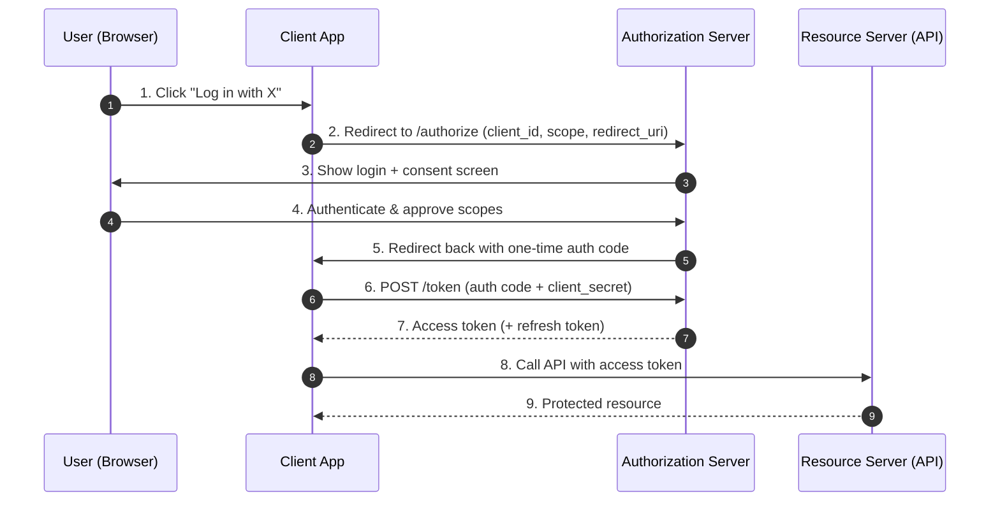

# Security at Scale — Junior Interview Questions

> **Collection:** [System Design](../README.md) · **Level:** Junior · **Section 27 of 42**
> **Goal:** Confirm you can separate *authentication* from *authorization*, explain how
> OAuth2/OIDC and JWTs actually flow, reason about encryption in transit vs at rest,
> keep secrets out of source control, and name the defenses that keep a public system
> standing under DDoS, bot, and login abuse.

Security is where vague answers get caught fastest. An interviewer at this level isn't
looking for cryptography research — they want to hear the classics stated *precisely*:
who-you-are vs what-you-can-do, signed vs encrypted, symmetric vs asymmetric, and a
secret is never a thing you commit. Each question below lists **what the interviewer is
really probing**, a **model answer**, and often a **follow-up** they'll reach for next.

---

## Contents

1. [Authentication](#1-authentication)
2. [Authorization (RBAC, ABAC)](#2-authorization-rbac-abac)
3. [OAuth2 & OIDC](#3-oauth2--oidc)
4. [JWT & Tokens](#4-jwt--tokens)
5. [Encryption at Rest & in Transit](#5-encryption-at-rest--in-transit)
6. [Secrets Management](#6-secrets-management)
7. [DDoS Mitigation](#7-ddos-mitigation)
8. [WAF & API Security](#8-waf--api-security)
9. [Rate Limiting for Abuse](#9-rate-limiting-for-abuse)
10. [Rapid-Fire Self-Check](#10-rapid-fire-self-check)

---

## 1. Authentication

### Q1.1 — What is authentication, and how is it different from authorization?

**Probing:** The single most important distinction in this section. Blurring them is an instant red flag.

**Model answer:** **Authentication** answers *"who are you?"* — it verifies the
identity of the caller (a user logging in with a password, a service presenting an API
key). **Authorization** answers *"what are you allowed to do?"* — it decides whether
that now-known identity may perform a given action. Authentication always comes first;
you can't grant permissions to an identity you haven't established. A useful one-liner:
*authentication is the bouncer checking your ID; authorization is the list deciding
which rooms you can enter.*

| | Authentication (AuthN) | Authorization (AuthZ) |
|---|---|---|
| **Question** | "Who are you?" | "What can you do?" |
| **Happens** | First | After authentication |
| **Example** | Verify password / token | Check "is this user an admin?" |
| **Fails with** | 401 Unauthorized | 403 Forbidden |
| **Produces** | A verified identity / principal | An allow / deny decision |

**Follow-up:** *"A logged-in user requests `/admin` and gets a 403 — was that authN or authZ?"* → Authorization. They proved who they are (no 401), they just lack the permission.

### Q1.2 — Name three authentication factors and give an example of each.

**Probing:** Understanding of multi-factor authentication (MFA), not just passwords.

**Model answer:** The three classic factors are: **(1) something you know** — a
password or PIN; **(2) something you have** — a phone running an authenticator app, a
hardware security key, an SMS code; **(3) something you are** — a biometric like a
fingerprint or face scan. **Multi-factor authentication** combines two or more from
*different* categories, so stealing one (a leaked password) isn't enough. Two passwords
isn't MFA — both are "something you know."

### Q1.3 — How should passwords be stored on the server?

**Probing:** Do they know "never plaintext, never plain hash" — they must say *salted, slow hash*.

**Model answer:** Never store the password itself, and never a fast hash like raw
SHA-256. Store the output of a **slow, salted password-hashing function** built for
this — **bcrypt**, **scrypt**, or **Argon2**. Each password gets a unique random
**salt** (so identical passwords hash differently and precomputed "rainbow tables" are
useless), and the function is deliberately slow/memory-hard to make brute force
expensive. At login you hash the submitted password with the stored salt and compare.
If the database leaks, attackers still can't cheaply recover passwords.

**Follow-up:** *"Why is a unique salt per user better than one global salt?"* → A global salt lets an attacker attack all hashes at once; per-user salts force them to crack each account independently.

---

## 2. Authorization (RBAC, ABAC)

### Q2.1 — Explain RBAC in one paragraph.

**Probing:** Can they describe role-based access control concretely?

**Model answer:** **Role-Based Access Control** assigns permissions to **roles**, and
roles to **users**, instead of granting permissions directly to each person. A role
like `editor` bundles permissions such as `article:create` and `article:edit`; you give
a user the `editor` role and they inherit the bundle. The win is manageability: to
onboard someone you assign roles, to change a policy you edit one role rather than
hundreds of users. Most internal tools start here — `admin`, `editor`, `viewer`.

### Q2.2 — What is ABAC, and when would you choose it over RBAC?

**Probing:** Awareness that roles alone can't express context-dependent rules.

**Model answer:** **Attribute-Based Access Control** makes decisions from **attributes**
of the subject, the resource, the action, and the environment, evaluated as policies —
e.g., *"allow if `user.department == document.department` **and** `time` is within work
hours **and** `user.clearance >= document.classification`."* You reach for ABAC when
access depends on context and data relationships that roles can't capture without
exploding into thousands of micro-roles ("editor-for-team-A-in-EU-during-business-hours").
RBAC answers "what role do you have?"; ABAC answers "do your attributes satisfy this rule
*for this specific resource right now*?"

| | RBAC | ABAC |
|---|---|---|
| **Decision based on** | The user's role(s) | Attributes of user, resource, action, environment |
| **Example rule** | "Editors can edit articles" | "Edit if you own the doc and it's not locked" |
| **Strength** | Simple, easy to audit | Fine-grained, context-aware |
| **Weakness** | "Role explosion" for nuanced rules | Harder to reason about and audit |
| **Good fit** | Stable org structures | Multi-tenant, data-dependent rules |

**Follow-up:** *"Can they be combined?"* → Yes — a common pattern is RBAC for coarse access ("is this a billing user?") plus ABAC for fine checks ("is this *their* invoice?").

### Q2.3 — What is the principle of least privilege?

**Probing:** A core security instinct, not a specific mechanism.

**Model answer:** Least privilege means every identity — user, service, token — gets
**only the permissions it needs to do its job, and no more**, for **only as long as it
needs them**. A read-only reporting service should hold read credentials, not write or
admin. The payoff is blast-radius reduction: if that service is compromised, the
attacker inherits a small, read-only capability instead of the keys to the kingdom.

---

## 3. OAuth2 & OIDC

### Q3.1 — What problem does OAuth2 solve?

**Probing:** Do they understand it's *delegated authorization*, not login per se?

**Model answer:** OAuth2 lets a user grant a third-party app **limited access to their
resources on another service without sharing their password**. "Let this photo-printing
app read your Google Photos" — you authorize *scoped* access, the printing app receives
an **access token**, not your Google password, and you can revoke that token later. The
core idea is **delegated authorization** with scoped, revocable tokens instead of
password sharing.

### Q3.2 — Walk through the OAuth2 authorization-code flow.

**Probing:** Mechanical fluency with the most common, most secure web flow.

**Model answer:** The user is redirected to the authorization server to log in and
consent. That server hands the client a short-lived **authorization code** via a browser
redirect. The client then exchanges that code **server-to-server**, along with its
client secret, for an **access token** (and often a refresh token). The token, not the
code, is what calls the API. The two-step design matters: the code travels through the
browser where it's exposed, but it's useless without the client secret, and the secret
never leaves the backend.

**Follow-up:** *"Why not just return the access token in step 5?"* → That older "implicit flow" exposed the token in the URL/browser. The code exchange keeps the token off the front channel; for public clients (SPAs, mobile) you add **PKCE** to secure the code exchange without a secret.

### Q3.3 — How does OIDC relate to OAuth2?

**Probing:** Knowing OAuth2 is for *authorization* and OIDC adds *authentication*.

**Model answer:** OAuth2 was designed for **authorization** (delegated access to
resources) — it deliberately doesn't say *who* the user is. **OpenID Connect (OIDC)** is
a thin **identity layer on top of OAuth2** that adds authentication: alongside the access
token it returns an **ID token**, a JWT containing verified claims about the user (their
subject ID, email, name). So "Log in with Google" is OIDC; "let this app access your
Google Drive" is plain OAuth2. Rule of thumb: **access token is for calling APIs; ID
token is for knowing who logged in.**

---

## 4. JWT & Tokens

### Q4.1 — What are the three parts of a JWT?

**Probing:** Basic structural literacy.

**Model answer:** A JWT (JSON Web Token) has three Base64URL-encoded parts joined by
dots: **header.payload.signature**. The **header** names the signing algorithm (e.g.,
`HS256`, `RS256`). The **payload** holds the **claims** — data like `sub` (subject/user
id), `exp` (expiry), `iat` (issued-at), and any custom fields. The **signature** is
computed over the header and payload with a secret or private key, and it's what lets the
receiver verify the token wasn't tampered with.

### Q4.2 — Is a JWT encrypted? Can I put a password in the payload?

**Probing:** The classic trap. JWTs are **signed, not encrypted** by default.

**Model answer:** **No — a standard JWT is signed, not encrypted.** Base64URL is just
encoding, not encryption; anyone holding the token can decode and read the payload. The
signature guarantees **integrity and authenticity** (it wasn't altered, and it came from
someone with the key) — **not confidentiality**. So never put secrets, passwords, or
sensitive PII in a JWT payload. (If you genuinely need confidentiality there's JWE —
encrypted JWTs — but the default and the common case is a *signed* JWS.)

**Follow-up:** *"Then what stops me from editing the payload to make myself an admin?"* → The signature. Change one byte of the payload and the signature no longer verifies, so the server rejects the token.

### Q4.3 — Symmetric vs asymmetric signing for JWTs — when to use which?

**Probing:** Understanding HS256 vs RS256 and the key-distribution trade-off.

**Model answer:** **Symmetric (e.g., HS256)** uses one shared secret to both sign and
verify — simple and fast, fine when the **same trusted party** signs and verifies
(a single backend issuing tokens to itself). **Asymmetric (e.g., RS256)** signs with a
**private key** and verifies with the corresponding **public key**. You use asymmetric
when **many independent services** must verify tokens issued by one authority: distribute
the public key freely, keep the private key locked in the issuer, and a leaked verifier
still can't *mint* tokens. OAuth/OIDC providers use asymmetric signing for exactly this
reason.

| | Symmetric (HS256) | Asymmetric (RS256) |
|---|---|---|
| **Keys** | One shared secret | Private (sign) + public (verify) |
| **Who can verify** | Anyone with the secret (who can also forge) | Anyone with the public key (cannot forge) |
| **Best for** | Single trusted issuer+verifier | One issuer, many verifiers |
| **Risk** | Shared secret leaks → forgery | Private key must be protected |

### Q4.4 — Access tokens vs refresh tokens — why have both?

**Probing:** Token lifetime trade-offs and revocation.

**Model answer:** **Access tokens** are short-lived (minutes) and sent on every API
call; keeping them short limits the damage if one leaks, because it expires soon.
**Refresh tokens** are long-lived, stored securely, and used only to obtain new access
tokens when the old one expires — so the user isn't forced to log in every few minutes.
The split balances security (short exposure for the token that travels constantly) with
usability (a long session without re-login). Refresh tokens can also be **revoked**
server-side to end a session immediately.

---

## 5. Encryption at Rest & in Transit

### Q5.1 — Distinguish encryption in transit from encryption at rest.

**Probing:** Two different threat models; juniors often only name TLS.

**Model answer:** **In transit** protects data **moving over the network** — TLS/HTTPS
encrypts the connection so an eavesdropper on the wire can't read or tamper with requests
and responses. **At rest** protects data **sitting in storage** — disks, databases,
backups, object stores — so that someone who steals the physical disk or a backup file
can't read it. They guard different attack points; a serious system uses **both**, plus
typically encryption *in use* protections for the most sensitive paths.

| | In Transit | At Rest |
|---|---|---|
| **Protects** | Data moving over a network | Data stored on disk/DB/backup |
| **Threat** | Eavesdropping, man-in-the-middle | Stolen disk, leaked backup |
| **Typical tech** | TLS / HTTPS, mTLS | AES-256 disk/DB/field encryption |
| **Example** | `https://` API call | Encrypted RDS volume / S3 bucket |

### Q5.2 — What does TLS actually give you, in plain terms?

**Probing:** Beyond "it's the lock icon."

**Model answer:** TLS provides three things on a connection: **confidentiality** (the
traffic is encrypted, so it can't be read in flight), **integrity** (it can't be
silently modified in flight), and **authentication of the server** (the certificate,
signed by a trusted Certificate Authority, proves you're really talking to
`bank.com` and not an impostor). It uses **asymmetric** cryptography during the handshake
to safely agree on a fast **symmetric** session key, then encrypts the bulk traffic with
that symmetric key — best of both worlds.

**Follow-up:** *"What is mTLS?"* → Mutual TLS — *both* sides present certificates, so the server also verifies the client. Common for service-to-service authentication inside a system.

### Q5.3 — Where do the encryption keys live, and why does that matter?

**Probing:** Recognizing that encryption is only as strong as key management.

**Model answer:** Encryption just moves the secret from the data to the **key**, so the
key must be protected harder than the data was. Storing the key next to the encrypted
data (or in the same database) defeats the purpose. Real systems use a **Key Management
Service (KMS)** or hardware security module to store and control keys, and a common
pattern is **envelope encryption**: a per-object **data key** encrypts the data, and a
**master key** held in the KMS encrypts the data keys. This makes **key rotation**
cheap — rotate the master key without re-encrypting every object.

---

## 6. Secrets Management

### Q6.1 — Why is committing a database password to Git a problem?

**Probing:** The most common real-world security mistake.

**Model answer:** Because Git history is **permanent and widely copied**. Once a secret
lands in a commit, it lives in every clone, fork, and backup — deleting it in a later
commit doesn't remove it from history. Anyone with repo access (or anyone, if the repo is
ever made public) has the credential. Worse, secrets in code can't be **rotated**
independently — changing the password means a code change and redeploy. Any secret that
touches version control should be considered **compromised and rotated immediately**.

### Q6.2 — Where *should* secrets live instead?

**Probing:** Knowing the standard alternatives.

**Model answer:** In a dedicated **secrets manager** — HashiCorp Vault, AWS Secrets
Manager, GCP Secret Manager, or Kubernetes Secrets backed by a KMS — that stores them
**encrypted**, controls **who can read them** via fine-grained access policies, **audits**
every access, and supports **rotation**. The application fetches secrets at startup or
runtime (or has them injected as environment variables/mounted files by the platform),
so the secret never appears in source code or the image. For local development, untracked
`.env` files listed in `.gitignore` are a pragmatic baseline.

**Follow-up:** *"What's the benefit of automatic rotation?"* → A leaked credential has a short useful life, and rotation is routine rather than a fire drill, so you can rotate aggressively without operational pain.

### Q6.3 — How should a service authenticate to the secrets manager without a chicken-and-egg secret?

**Probing:** The bootstrap problem.

**Model answer:** You avoid hardcoding *any* long-lived secret by leaning on the
platform's **identity**. On a cloud VM or container, the workload is given a **machine
identity** (an IAM role, a workload identity, an attested service-account token) that the
secrets manager trusts directly — the environment proves who the workload is, and it
exchanges that for short-lived credentials. So instead of "a secret to fetch the secrets,"
the *infrastructure itself* vouches for the workload's identity.

---

## 7. DDoS Mitigation

### Q7.1 — What is a DDoS attack, and how is it different from a DoS?

**Probing:** Basic definition and the "distributed" part.

**Model answer:** A **DoS** (Denial of Service) attack tries to make a service
unavailable by overwhelming it — flooding it with traffic or expensive requests so
legitimate users can't get through. A **DDoS** (Distributed DoS) does the same thing from
**many sources at once** — often a botnet of thousands of compromised machines — which
makes it far harder to block, because you can't just blacklist one IP. The goal is
exhaustion: of bandwidth, connections, CPU, or memory.

### Q7.2 — Name a few defenses against volumetric DDoS.

**Probing:** Practical mitigation layers, not a single silver bullet.

**Model answer:** Defense is layered: **(1)** put a **CDN / edge network** in front (the
attack hits a globally distributed edge with huge capacity, not your origin); **(2)** use
a cloud **DDoS protection service** (AWS Shield, Cloudflare, Google Cloud Armor) that
absorbs and scrubs traffic; **(3)** **rate-limit** and apply IP reputation at the edge;
**(4)** **autoscale** so capacity can grow under load; **(5)** keep the **origin hidden**
behind the edge so attackers can't bypass it. The theme: absorb or filter as far from
your origin as possible, with enough capacity to outlast the flood.

**Follow-up:** *"What's an application-layer (L7) DDoS, and why is it sneakier?"* → It sends *valid-looking* requests (e.g., hammering an expensive search endpoint) at lower volume, so it blends in with real traffic and a pure bandwidth defense won't catch it — you need request-level analysis and rate limits.

### Q7.3 — What is "graceful degradation" under attack or overload?

**Probing:** Designing to bend, not break.

**Model answer:** It means shedding or simplifying work so the **core** of the service
survives instead of the whole thing collapsing. Under extreme load you might disable
expensive features, serve cached/stale content, queue or reject low-priority requests, or
return a lightweight response — keeping critical paths alive for as many users as
possible. A system that degrades gracefully stays partly useful; one that doesn't tips
over entirely.

---

## 8. WAF & API Security

### Q8.1 — What is a WAF and what does it protect against?

**Probing:** Knowing the layer it operates at and its typical job.

**Model answer:** A **Web Application Firewall** inspects **HTTP/HTTPS traffic** at the
application layer (L7) and blocks malicious requests *before* they reach your app. It
filters for common web attacks — **SQL injection**, **cross-site scripting (XSS)**, path
traversal — using rule sets (often the **OWASP Core Rule Set**), and frequently adds rate
limiting, bot filtering, and geo/IP blocking. A WAF is a useful *outer* layer, but it's
**not a substitute** for secure coding: it catches known patterns, not every flaw.

### Q8.2 — Name a few items from the OWASP API Security Top 10 you'd watch for.

**Probing:** Familiarity with the dominant API risks, especially authorization bugs.

**Model answer:** The most common and damaging is **Broken Object-Level Authorization
(BOLA / IDOR)** — `GET /orders/123` returns *someone else's* order because the server
checks that you're logged in but not that the object is *yours*. Others: **Broken
Authentication** (weak token handling), **Broken Function-Level Authorization** (a regular
user reaching an admin endpoint), **Excessive Data Exposure** (the API returns more fields
than the client needs and the client filters them), and **lack of resource/rate limiting**.
The recurring theme is **authorization**: most API breaches are missing or incorrect
"are you allowed to touch *this specific* resource?" checks.

**Follow-up:** *"How do you prevent BOLA?"* → On every object access, verify the authenticated user actually owns or may access *that object id* — enforce it server-side, never trust an id from the client as proof of ownership.

### Q8.3 — Why is input validation a security control, not just a correctness one?

**Probing:** Connecting validation to injection defense.

**Model answer:** Because most injection attacks (SQL injection, command injection, XSS)
arrive as **untrusted input** that the system later interprets as code or markup.
Validating and constraining input (allow-lists, type/length checks) at the trust boundary,
and — critically — using **parameterized queries** and **output encoding** so data is
never mixed into code, is what stops that input from being executed. "Never trust user
input" is the security restatement of input validation; the same check that rejects a
malformed email also rejects a `'; DROP TABLE` payload.

---

## 9. Rate Limiting for Abuse

### Q9.1 — How does rate limiting help with *abuse* specifically, beyond capacity protection?

**Probing:** Seeing rate limiting as a security tool, not only a stability tool.

**Model answer:** Rate limiting caps how many actions an identity can take in a window,
which directly defangs **abuse** patterns: **credential-stuffing and brute-force logins**
(slow attackers to a crawl so guessing millions of passwords becomes infeasible), **scraping
and bot traffic**, **OTP/SMS bombing**, and **spam/signup floods**. Beyond protecting
capacity, it raises the **cost and time** of abuse to the point where it's no longer worth
it — many attacks only work because they can be run fast and cheap.

### Q9.2 — How would you rate-limit login attempts to stop brute force?

**Probing:** A concrete, sensible scheme — and the right key to limit on.

**Model answer:** Limit on **multiple keys**: per-account (so one targeted account can't
be hammered) **and** per-IP (so one source can't spray many accounts). After a few failed
attempts, apply **exponential backoff** or a temporary lockout, and add **CAPTCHA** or MFA
challenges once a threshold is crossed. Crucially, **don't leak** whether the username
exists in your error messages or timing. The combination — slow the attacker, challenge
suspicious clients, and stay quiet about which guesses were "close" — makes brute force
impractical without locking out real users permanently.

**Follow-up:** *"Why limit per-account, not only per-IP?"* → A distributed botnet rotates IPs, so per-IP alone misses a slow, IP-spread attack on one account; per-account catches it regardless of source.

### Q9.3 — Name a common rate-limiting algorithm and its behavior.

**Probing:** At least one concrete algorithm.

**Model answer:** The **token bucket** is the classic: a bucket holds up to N tokens,
refilling at a steady rate; each request spends a token, and requests are rejected (or
delayed) when the bucket is empty. It allows short **bursts** (spend accumulated tokens)
while enforcing a long-run average rate. Alternatives include the **fixed window**
(simple, but allows a burst at window edges), the **sliding window** (smoother, fixes the
edge problem), and the **leaky bucket** (smooths output to a constant rate). For a
distributed system, the counters typically live in a shared store like Redis so the limit
holds across all servers.

**Follow-up:** *"Where do you enforce it in a multi-server deployment?"* → At a shared layer — API gateway or edge, backed by a central store like Redis — so the limit is global, not per-instance (otherwise N servers each allow the full quota).

---

## 10. Rapid-Fire Self-Check

If you can answer each of these in a sentence, you're ready for the junior bar on this section:

- [ ] Authentication vs authorization — which answers "who are you?" *(authentication; authz answers "what can you do?")*
- [ ] Which status code is authN failure vs authZ failure? *(401 vs 403)*
- [ ] How should passwords be stored? *(salted, slow hash — bcrypt/scrypt/Argon2)*
- [ ] RBAC vs ABAC — one-line difference. *(role-based vs attribute/context-based)*
- [ ] What does OAuth2 solve, and what does OIDC add? *(delegated authz; OIDC adds authentication via an ID token)*
- [ ] Is a JWT encrypted? *(no — signed by default; integrity, not confidentiality)*
- [ ] Symmetric vs asymmetric signing — when do you need asymmetric? *(one issuer, many verifiers)*
- [ ] Encryption in transit vs at rest — name the tech for each. *(TLS vs AES-encrypted storage)*
- [ ] Where do secrets belong instead of Git? *(a secrets manager — Vault/KMS)*
- [ ] Name two DDoS defenses. *(CDN/edge absorption, cloud DDoS protection, rate limiting, autoscale)*
- [ ] What's BOLA/IDOR, and why is it dangerous? *(missing per-object authorization — access others' data)*
- [ ] Why limit login attempts per-account *and* per-IP? *(botnets rotate IPs; per-account catches the targeted attack)*

---

**Next step:** Section 28 — [Data Privacy & Compliance](28-data-privacy-compliance.md): PII handling, GDPR/CCPA, data residency, and the right to be forgotten.
