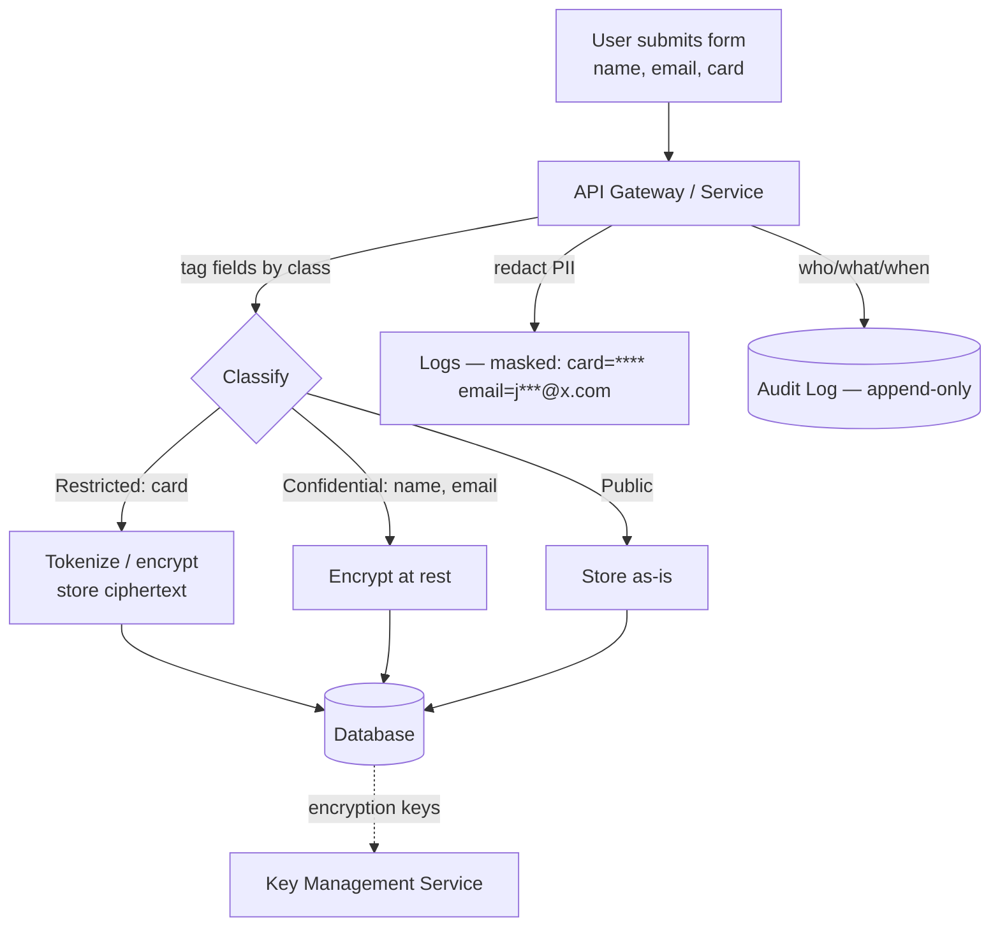
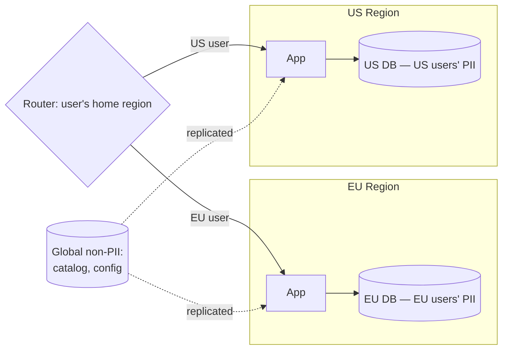
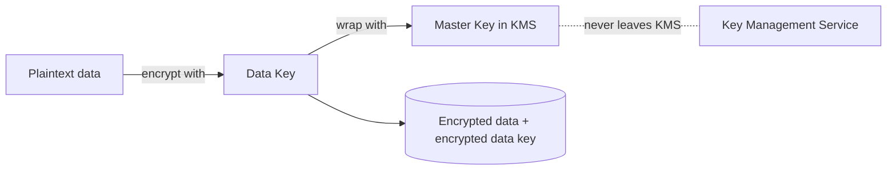

# Data Privacy & Compliance — Junior Interview Questions

> **Collection:** [System Design](../README.md) · **Level:** Junior · **Section 28 of 42**
> **Goal:** Confirm you can identify sensitive data, explain the core privacy laws an
> engineer touches in practice, reason about where data is allowed to live, and design
> the two safety nets every regulated system needs — an audit trail and a sane
> encryption-key lifecycle.

Privacy is not a legal department's problem that engineers can ignore — it is a set of
*design constraints* that change your schema, your APIs, your storage topology, and your
logging. A junior answer here is not a recitation of statutes; it is showing you know
*which data is dangerous*, *what the system must be able to do with it* (delete it,
locate it, encrypt it, prove who touched it), and *where the simple mistakes are*. Each
question lists **what the interviewer is really probing**, a **model answer**, and often
a **follow-up**.

---

## Contents

1. [PII & Data Classification](#1-pii--data-classification)
2. [GDPR & Right to Be Forgotten](#2-gdpr--right-to-be-forgotten)
3. [Data Residency](#3-data-residency)
4. [Audit Logging](#4-audit-logging)
5. [Encryption Key Lifecycle](#5-encryption-key-lifecycle)
6. [Rapid-Fire Self-Check](#6-rapid-fire-self-check)

---

## 1. PII & Data Classification

### Q1.1 — What is PII, and give three examples that aren't obvious.

**Probing:** Do you know PII is broader than "name and email"?

**Model answer:** PII (Personally Identifiable Information) is any data that can identify
a specific person, either on its own or when combined with other data. The obvious ones
are name, email, phone, and government ID. The non-obvious ones matter more in design:
**(1) an IP address** (treated as personal data under GDPR), **(2) a device or
advertising ID** that follows a user across sessions, and **(3) a combination of
quasi-identifiers** — birth date + ZIP code + gender can uniquely pin down a large
fraction of people even with no name attached. The lesson: data can be PII *in
combination* even when no single field looks sensitive.

**Follow-up:** *"Is a hashed email still PII?"* → Usually yes. A hash is deterministic,
so the same email always produces the same hash — it still links records to one person
and can be reversed by guessing common emails. Hashing is pseudonymization, not
anonymization.

### Q1.2 — Why classify data into tiers instead of treating it all the same?

**Probing:** Understanding that controls should be proportional to sensitivity.

**Model answer:** Because protecting everything at the highest level is expensive and
slows the whole system down, while protecting everything at the lowest level is
negligent. Classification lets you apply *proportional* controls: encrypt and tightly
audit the sensitive tiers, and keep public data cheap and fast. It also makes
obligations concrete — "encrypt restricted data at rest, mask it in logs, and require
two approvals to export it" is enforceable; "be careful with data" is not.

| Tier | Example data | Typical controls |
|---|---|---|
| **Public** | Marketing pages, public usernames | None beyond integrity; freely cacheable |
| **Internal** | Aggregated metrics, non-personal config | Access limited to employees |
| **Confidential (PII)** | Name, email, address, IP | Encrypt at rest + in transit, access-logged |
| **Restricted (sensitive PII)** | Payment card, health, biometrics, gov ID | Encryption + tokenization, masked in logs, strict need-to-know, audited |

### Q1.3 — Where does PII tend to "leak" by accident in a system?

**Probing:** Practical awareness — the real failures aren't in the database, they're at
the edges.

**Model answer:** The database is usually the *least* likely place to leak because it's
the most guarded. The accidental leaks happen at the edges: **logs and error traces**
that print a full request body containing a card number; **analytics events** that ship
emails to a third-party tool; **URLs** that put a user ID or token in a query string
(which ends up in access logs and browser history); **backups** that aren't encrypted;
and **non-production environments** seeded with a copy of real production data. A good
design tags PII fields explicitly so the logging and analytics layers can redact them
automatically rather than relying on every developer to remember.

### Q1.4 — Draw how PII should flow through a system so it stays protected.

**Probing:** Can you connect classification, encryption, masking, and audit into one path?

**Model answer:** The key ideas in the diagram: PII is **classified as it enters**, the
sensitive fields are **encrypted or tokenized before they hit the database**, the
**logs receive a masked copy** (never the raw value), every access is recorded in an
**append-only audit log**, and the database's encryption keys live in a separate **key
management service**, not next to the data. Each control is independent, so one mistake
doesn't expose everything.

---

## 2. GDPR & Right to Be Forgotten

### Q2.1 — In plain terms, what is GDPR and who does it apply to?

**Probing:** Can you describe the law's reach without legal jargon?

**Model answer:** GDPR (General Data Protection Regulation) is the EU's data-protection
law. The practical surprise for engineers is its *reach*: it applies to the personal
data of people in the EU **regardless of where your company is located**. A US startup
with EU users is subject to it. For engineers it boils down to a handful of buildable
obligations: collect only the data you need (data minimization), have a lawful basis to
process it (often consent), let users **access** and **delete** their data, **report
breaches** within 72 hours, and keep data only as long as you need it.

**Follow-up:** *"Name a similar law outside the EU."* → CCPA/CPRA in California gives
similar access and deletion rights; many others exist (Brazil's LGPD, etc.). The design
patterns are largely the same, so engineers build for the strictest one.

### Q2.2 — What is the "right to be forgotten," and why is it hard to implement?

**Probing:** Understanding that "DELETE FROM users" is the easy 10% of the problem.

**Model answer:** The right to erasure means a user can request that you delete their
personal data, and you must comply (with some exceptions, like data you're legally
required to keep). It's hard because personal data **fans out** far beyond one table:
it's in **read replicas**, **backups**, **caches**, **search indexes**, **analytics
warehouses**, **third-party processors** (your email vendor, payment provider), and
**logs**. Deleting one row in the primary database doesn't touch any of those. A real
implementation needs a *data map* of everywhere PII lives and a deletion workflow that
reaches all of them.

**Follow-up:** *"You can't rewrite last week's encrypted backup — now what?"* → A common
technique is **crypto-shredding**: encrypt each user's data with a per-user key, and to
"delete" them, destroy that key. The ciphertext in old backups becomes permanently
unreadable without ever editing the backup.

### Q2.3 — How would you handle a deletion request when data is spread across many systems?

**Probing:** Can you design an asynchronous, trackable workflow?

**Model answer:** Treat it as an **orchestrated, asynchronous job**, not a single query.
A request comes in and is recorded; a coordinator then fans out deletion tasks to every
system that holds the user's data — primary DB, search index, cache, analytics, and each
third-party processor via their API. Because some of these are slow or eventually
consistent, the workflow tracks each subtask's status and retries failures, and only
marks the request "complete" when all confirm. You typically have a regulatory deadline
(GDPR allows up to one month), so the system must *prove* completion, which is why every
step writes to the audit log.

### Q2.4 — What's the difference between deletion and anonymization?

**Probing:** Knowing there's an alternative that preserves analytics value.

**Model answer:** **Deletion** removes the data entirely. **Anonymization** strips or
irreversibly transforms the identifying fields so the remaining record can no longer be
tied to a person — e.g., replacing a user ID with a random token and dropping name/email,
while keeping "a purchase of $40 happened on this date." Properly anonymized data falls
*outside* GDPR, so it's a legitimate way to keep aggregate analytics after a user leaves.
The catch: true anonymization is hard — if the leftover quasi-identifiers can be combined
to re-identify someone, it's only *pseudonymization* and is still personal data.

---

## 3. Data Residency

### Q3.1 — What is data residency, and why do companies care?

**Probing:** Understanding the difference between *where data lives* and *where it's processed*.

**Model answer:** Data residency is the requirement that certain data be **stored (and
sometimes processed) within a specific country or region**. Companies care for three
reasons: **legal** (some countries' laws require citizens' data to stay in-country),
**contractual** (an enterprise customer may demand their data never leaves the EU), and
**trust** (users are more comfortable when their data stays local). It directly shapes
architecture, because it can forbid the simplest design — one global database — and force
you to deploy per-region.

### Q3.2 — How does data residency change a system's architecture?

**Probing:** Can you connect a compliance rule to concrete topology?

**Model answer:** It usually pushes you toward **regional isolation**: deploy a full
stack — app servers, database, cache — in each region (e.g., EU and US), and **route each
user's requests and data to their home region**. The hard parts are: deciding the
routing key (often the user's account region, fixed at signup), handling features that
need a *global* view (like a username uniqueness check or cross-region search), and
keeping **non-personal** shared data (product catalog, config) replicated everywhere
while keeping **personal** data pinned to its region.

**Follow-up:** *"A user moves from Germany to the US — what happens to their data?"* →
This is a migration problem: their data must be moved to the new region's store and
removed from the old one, which is a sensitive, audited operation. Many systems avoid
this by pinning region at account creation and treating moves as rare, manual cases.

### Q3.3 — Why can't you just put a CDN in front and call it "data residency"?

**Probing:** Distinguishing *caching of public content* from *residency of personal data*.

**Model answer:** A CDN caches and serves *content* close to users for speed, but
residency is about where the **system of record for personal data** physically sits. A
CDN edge in Frankfurt serving cached images does nothing to satisfy a rule that EU users'
account data must be *stored* in the EU — that data still lives in your origin database
wherever it is. Residency is solved at the *storage and processing* layer, not the
delivery layer.

---

## 4. Audit Logging

### Q4.1 — What is an audit log, and how is it different from an application log?

**Probing:** Do you know audit logs answer "who did what to whom, when"?

**Model answer:** An **application log** is for debugging — it records what the code did
(errors, timings, traces) and is meant for engineers. An **audit log** is for
accountability — it records **who** performed **what** action on **which** resource, **when**,
and **from where**, in a way that can be reviewed later by security, compliance, or an
auditor. The audience, the retention, and the integrity guarantees differ: audit logs
must be **tamper-resistant** and kept for a defined period, because their whole value is
being trustworthy evidence after the fact.

| | Application log | Audit log |
|---|---|---|
| **Purpose** | Debug behavior | Prove accountability |
| **Audience** | Engineers | Security, compliance, auditors |
| **Typical entry** | "DB query took 240 ms" | "user 42 viewed customer 88's SSN at 14:03 from IP x" |
| **Integrity** | Best-effort, can be noisy | Append-only, tamper-evident |
| **Retention** | Days to weeks | Months to years (per regulation) |

### Q4.2 — What fields belong in a good audit log entry?

**Probing:** Concreteness — can you list the schema?

**Model answer:** At minimum: **who** (actor identity — user or service ID), **what**
(the action, e.g., `read`, `update`, `delete`, `export`), **which** (the target resource
ID and type), **when** (a precise, trusted timestamp), **where** (source IP / device),
**outcome** (success or denied), and ideally a **before/after** for changes. Crucially,
the audit log itself **must not contain the sensitive value** — you log "user 42 viewed
customer 88's card," not the card number. Otherwise the audit log becomes the biggest PII
leak in the system.

**Follow-up:** *"Should reads be audited or only writes?"* → For restricted data (health,
financial, government ID), **reads are audited too**, because viewing someone's record is
itself a sensitive event. For low-sensitivity data, auditing only changes is usually
enough.

### Q4.3 — Why must audit logs be append-only and tamper-evident?

**Probing:** Understanding the threat model — the person who can edit the log is often the suspect.

**Model answer:** Because an audit log only has value if it can't be quietly altered by
the very people it's watching. If an admin can delete the line showing they exported a
customer list, the log proves nothing. So audit logs are **append-only** (no updates or
deletes), shipped to **separate storage** that the application's normal operators can't
modify (e.g., a write-once bucket or a dedicated logging account), and often
**tamper-evident** — each entry chained with a hash of the previous one so any
modification breaks the chain and is detectable. Write access to create entries is fine;
the ability to *change history* is what you eliminate.

---

## 5. Encryption Key Lifecycle

### Q5.1 — Why don't we store encryption keys next to the encrypted data?

**Probing:** The single most common key-management mistake.

**Model answer:** Because if the keys live with the data, anyone who steals the data
steals the keys too — the encryption protects nothing. It's like locking a door and
taping the key to it. Keys belong in a **separate, hardened system** — a Key Management
Service (KMS) or hardware security module — with its own strict access control. Then a
stolen database dump is just unreadable ciphertext, because the attacker never got the
key. This separation is the entire point of encryption at rest.

### Q5.2 — Walk through the lifecycle of an encryption key.

**Probing:** Awareness that a key is not "set once and forget."

**Model answer:** A key moves through distinct stages, and each needs a plan:

| Stage | What happens | Why it matters |
|---|---|---|
| **Generation** | Key created from a strong random source, usually inside a KMS | Weak randomness = guessable keys |
| **Distribution / use** | App asks KMS to encrypt/decrypt; the raw key rarely leaves the KMS | Limits exposure of the key itself |
| **Rotation** | Replace the key periodically; new data uses the new key | Limits the blast radius if a key leaks |
| **Revocation / disable** | A compromised key is disabled so it can't be used | Stops the bleeding after an incident |
| **Destruction** | Key is permanently deleted | Makes data encrypted with it unrecoverable (crypto-shredding) |

The headline: keys are **rotated** regularly so that a single leaked key exposes only a
limited window of data, and they can be **destroyed** to render data permanently
unreadable — which is how you "delete" data from immutable backups.

### Q5.3 — What is envelope encryption, and why is it used?

**Probing:** Knowing the standard pattern that makes rotation practical at scale.

**Model answer:** Envelope encryption uses **two layers of keys**. A **data key**
encrypts the actual data, and a **master key** (held in the KMS) encrypts the data key.
You store the encrypted data alongside its encrypted data key, while the master key never
leaves the KMS. It's used because it's both **fast and manageable**: you encrypt large
data with a local data key (fast symmetric crypto) but only ever ask the KMS to wrap or
unwrap the tiny data key (cheap). And to **rotate**, you re-encrypt just the data keys
with a new master key — you don't have to re-encrypt terabytes of data.

**Follow-up:** *"How does this make 'right to be forgotten' easier?"* → Give each user
their own data key. To erase that user everywhere — including in old backups — you destroy
their data key. The ciphertext remains, but it's now permanently undecryptable. That's
crypto-shredding, and it's far simpler than rewriting every backup.

### Q5.4 — A key is leaked. What's the first thing you do?

**Probing:** Incident instinct — contain before you clean up.

**Model answer:** **Revoke/disable the compromised key first** so it can't be used for
any new encryption or decryption — contain the damage. Then **rotate** to a new key and
**re-encrypt** the affected data with it. In parallel, use the **audit log** to determine
what was accessed with that key and when, which scopes the incident and tells you whether
you have a breach you must report. The order matters: stop the bleeding (revoke), then
clean up (rotate + re-encrypt), then investigate (audit) — not the reverse.

---

## 6. Rapid-Fire Self-Check

If you can answer each of these in a sentence, you're ready for the junior bar on this section:

- [ ] Give one piece of PII that isn't a name or email. *(IP address, device ID, quasi-identifier combo)*
- [ ] Why classify data into tiers? *(proportional, enforceable controls)*
- [ ] Where does PII most often leak by accident? *(logs, analytics, URLs, backups, non-prod)*
- [ ] Who does GDPR apply to? *(anyone processing EU residents' data, regardless of company location)*
- [ ] Why is "right to be forgotten" hard? *(data fans out to replicas, backups, caches, indexes, third parties)*
- [ ] What is crypto-shredding? *(delete the per-user key so ciphertext becomes unreadable)*
- [ ] What is data residency, and how does it change architecture? *(store data in a region → per-region deployment)*
- [ ] How is an audit log different from an app log? *(who-did-what-to-whom vs debug; tamper-evident, retained)*
- [ ] Why must audit logs be append-only? *(the operator being audited mustn't be able to rewrite history)*
- [ ] Why keep keys separate from data? *(stolen data without keys is just ciphertext)*
- [ ] Name the stages of a key's lifecycle. *(generate → use → rotate → revoke → destroy)*
- [ ] What is envelope encryption? *(data key encrypts data; master key wraps the data key)*

---

**Next step:** Section 29 — [Multi-Tenancy & SaaS](29-multi-tenancy-saas.md): isolating tenants, noisy neighbors, and per-tenant data boundaries.
