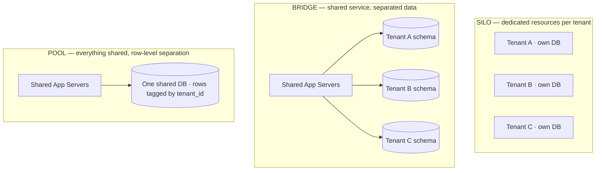
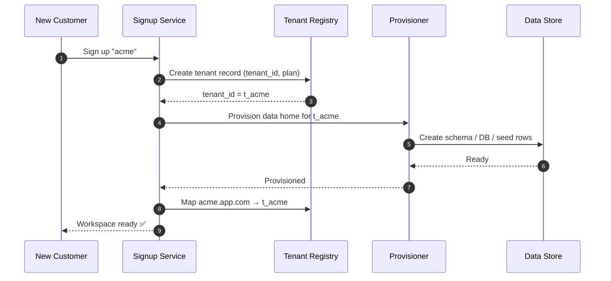

# Multi-Tenancy & SaaS — Junior Interview Questions

> **Collection:** [System Design](../README.md) · **Level:** Junior · **Section 29 of 42**
> **Goal:** Confirm you can explain how one running system serves many independent
> customers (tenants) safely and cheaply — the isolation models, how tenant data is
> partitioned, how to stop one tenant from hurting another, how per-tenant limits and
> scaling work, and what happens the moment a new customer signs up.

A SaaS product runs *one* codebase and *one* fleet, but every customer must feel like
they have their own private system. That illusion is the whole game of multi-tenancy.
A "junior" answer here is not a hand-wave about "just add a `tenant_id` column" — it is
a *correct, concrete* explanation that names the trade-off being made. Interviewers
check that you reach for real products (a Slack **workspace**, a Shopify **store**) and
that you never confuse "two customers share a table" with "two customers can see each
other's data." Each question lists **what the interviewer is really probing**, a **model
answer**, and often a **follow-up**.

---

## Contents

1. [Tenant Isolation Models](#1-tenant-isolation-models)
2. [Data Partitioning per Tenant](#2-data-partitioning-per-tenant)
3. [Noisy-Neighbor Mitigation](#3-noisy-neighbor-mitigation)
4. [Per-Tenant Scaling & Limits](#4-per-tenant-scaling--limits)
5. [Tenant Onboarding & Config](#5-tenant-onboarding--config)
6. [Rapid-Fire Self-Check](#6-rapid-fire-self-check)

---

## 1. Tenant Isolation Models

### Q1.1 — What is a "tenant," and what does multi-tenancy mean?

**Probing:** Do you have the core vocabulary before anything else?

**Model answer:** A **tenant** is one customer organization whose users and data are
logically separated from every other customer's. A Slack **workspace** is a tenant; a
Shopify **store** is a tenant. **Multi-tenancy** means a single deployment of the
application — the same servers, the same code, often the same database — serves many
tenants at once, while each tenant sees only its own data and can't tell the others
exist. The opposite is **single-tenancy**, where each customer gets their own dedicated
stack. Multi-tenancy is what makes SaaS economical: you amortize one fleet across
thousands of customers instead of running thousands of fleets.

### Q1.2 — Explain the three isolation models: silo, pool, and bridge.

**Probing:** The central framing of the whole topic. Can you name the spectrum, not just one point?

**Model answer:** They sit on a spectrum from "fully separate" to "fully shared":

- **Silo:** each tenant gets dedicated resources (their own database, sometimes their
  own app instance). Strongest isolation, highest cost, hardest to operate at scale.
- **Pool:** all tenants share the same resources, separated only by a `tenant_id` on
  every row. Cheapest and most scalable, weakest isolation, easiest to leak data if a
  query forgets its filter.
- **Bridge:** a middle ground — shared compute, but separated data, e.g. one database
  server holding a **separate schema per tenant**. Good isolation with much of pool's
  efficiency.

**Follow-up:** *"Which would you pick for a free tier vs an enterprise customer?"* →
Free/small tenants go in the **pool** (cheap, dense). A large enterprise paying for a
strict data-residency or compliance guarantee gets a **silo**. Mature SaaS often runs a
**mix**, placing tenants in different models by tier.

### Q1.3 — Give the silo-vs-pool trade-off as a table.

**Probing:** Can you compare on the two axes that matter — isolation and cost?

**Model answer:**

| Dimension | Silo (dedicated) | Pool (shared) |
|---|---|---|
| **Isolation** | Strong — blast radius is one tenant | Weak — a bad query can expose all tenants |
| **Cost per tenant** | High — resources sit idle for small tenants | Low — one fleet amortized across thousands |
| **Noisy neighbor** | None — separate resources | Real risk — one tenant can starve others |
| **Operational toil** | High — N databases to patch, back up, migrate | Low — one database to operate |
| **"Restore one tenant"** | Easy — restore that tenant's DB | Hard — must surgically extract one tenant's rows |
| **Scales to many tenants** | Poorly | Excellently |

The one-line summary: **silo buys isolation with money and operational effort; pool
buys cheap density at the cost of weaker isolation.** Bridge sits in between.

### Q1.4 — Why is the pool model the default for most SaaS despite weaker isolation?

**Probing:** Do you understand the economics that make SaaS work?

**Model answer:** Because most tenants are *small*. If Shopify gave every one of its
millions of stores a dedicated database, the vast majority would be near-empty and the
fixed cost per database (memory, connections, backups, patching) would dwarf the
revenue from a small merchant. The pool packs thousands of small tenants into shared
infrastructure so each one costs almost nothing to host. You only reach for stronger
isolation (bridge or silo) for the minority of tenants whose size or compliance needs
justify the expense.

---

## 2. Data Partitioning per Tenant

### Q2.1 — What are the three common ways to partition tenant data in a database?

**Probing:** Can you map the isolation models onto concrete database layouts?

**Model answer:** They line up directly with silo / bridge / pool:

| Layout | What it is | Maps to |
|---|---|---|
| **Database per tenant** | Each tenant gets its own physical database | Silo |
| **Schema per tenant** | One database server, a separate schema (set of tables) per tenant | Bridge |
| **Shared table with `tenant_id`** | All tenants share the same tables; every row carries a `tenant_id` column | Pool |

For a shared-table layout, *every* table that holds tenant data gets a `tenant_id`, and
*every* query must filter on it — that filter is the only thing separating customers.

### Q2.2 — In the shared-table model, what is the single most dangerous bug?

**Probing:** The classic multi-tenant footgun. Do you know where the data leaks come from?

**Model answer:** Forgetting the `WHERE tenant_id = ?` filter on a query. If a developer
writes `SELECT * FROM orders WHERE id = ?` instead of `... WHERE id = ? AND tenant_id =
?`, one tenant can read or modify another tenant's row — a **cross-tenant data leak**,
which is among the worst possible SaaS bugs. The mitigation is to never rely on
developers remembering: push the filter down into a shared layer so it can't be skipped.

**Follow-up:** *"How do you make that filter automatic?"* → Three common techniques:
**(1)** a repository/ORM layer that injects `tenant_id` into every query from the
request's authenticated tenant context; **(2)** database **row-level security** (e.g.
PostgreSQL RLS policies) that enforce the filter inside the database itself, so even a
raw query is constrained; **(3)** scoped database connections that set the tenant for
the session. Defense in depth uses more than one.

### Q2.3 — Where does the `tenant_id` come from on each request?

**Probing:** Do you understand that tenancy is resolved per request, not configured globally?

**Model answer:** It is derived from the authenticated request, never trusted from the
client body. Common sources: a claim inside the user's **JWT/session** (the user belongs
to a workspace), the **subdomain or path** (`acme.slack.com` or `/store/acme`), or an
**API key** that is bound to one tenant. The server resolves the tenant *once*, early in
the request (in middleware), stores it in a request-scoped context, and every downstream
query reads it from there. Letting the client pass `tenant_id` as a parameter would let
anyone request another tenant's data.

### Q2.4 — Schema-per-tenant vs shared-table: name one operational pain of each.

**Probing:** Honest awareness of the cost on *both* sides.

**Model answer:** **Schema-per-tenant** pain: schema migrations must run across *every*
schema — with 10,000 tenants, an `ALTER TABLE` becomes 10,000 operations, and a partial
failure leaves tenants on different schema versions. **Shared-table** pain: the "noisy
neighbor" and the "one giant tenant" problem — one huge customer's rows dominate the
shared tables and indexes, and you can't move or restore a single tenant without
surgically filtering by `tenant_id`. Neither is free; you pick the pain that matches
your tenant size distribution.

---

## 3. Noisy-Neighbor Mitigation

### Q3.1 — What is the "noisy neighbor" problem?

**Probing:** Can you define it concretely, with a SaaS example?

**Model answer:** In a shared (pool) system, one tenant's heavy usage consumes shared
resources — CPU, database connections, memory, I/O — and degrades performance for
everyone else. The classic example: one Shopify store runs a giant export or gets a
flash-sale traffic spike, monopolizes the shared database's connections and CPU, and
suddenly every *other* store on that database sees slow checkouts. The tenants are
"neighbors" sharing a wall, and one is being loud. It exists precisely *because*
resources are shared — silos don't have it, but they cost more.

### Q3.2 — Name three concrete ways to mitigate noisy neighbors.

**Probing:** Practical toolbox, not just naming the problem.

**Model answer:**
1. **Per-tenant rate limits and quotas** — cap requests/second, query cost, or job
   concurrency per tenant so no single tenant can consume more than its share.
2. **Resource isolation / fair scheduling** — give each tenant a bounded pool of
   connections or worker slots, or use separate queues per tenant tier so a flood from
   one tenant can't drain the workers serving others.
3. **Tier-based placement** — move the heaviest tenants out of the pool into a **bridge
   or silo** so their load lands on dedicated resources and stops affecting neighbors.

Other tools: caching per-tenant hot data, and timeouts/circuit breakers so one tenant's
slow queries don't pile up and exhaust shared capacity.

**Follow-up:** *"A tenant suddenly sends 100x normal traffic — what protects everyone
else?"* → The per-tenant rate limiter sheds that tenant's excess load (returning 429s to
*them*), keeping the shared resources available for everyone else. The limit turns a
fleet-wide outage into a single-tenant slowdown.

### Q3.3 — Why is a per-tenant limit better than one global limit?

**Probing:** Do you see that a global limit punishes the innocent?

**Model answer:** A single global limit can't tell tenants apart, so when one tenant
floods the system, the global limit trips and *everyone* — including well-behaved
tenants — gets throttled. A **per-tenant** limit isolates the blast radius: the abusive
tenant hits *its own* ceiling and gets throttled, while every other tenant is untouched.
Fairness in multi-tenancy means accounting for usage *per tenant*, not in aggregate.

---

## 4. Per-Tenant Scaling & Limits

### Q4.1 — Why does each tenant need its own limits and quotas?

**Probing:** Do you connect limits to fairness, cost control, and plan tiers?

**Model answer:** Three reasons. **(1) Fairness** — limits stop one tenant from
consuming a disproportionate share of shared capacity (the noisy-neighbor defense).
**(2) Cost control** — usage maps to your infrastructure bill, so unbounded usage by one
tenant is an unbounded cost. **(3) Plan enforcement** — SaaS pricing tiers are
*expressed* as limits: a free Slack workspace caps message history and integrations; a
paid plan raises those caps. The quota system is how the business model is enforced in
the product.

### Q4.2 — Give examples of per-tenant limits you'd enforce.

**Probing:** Concrete vocabulary of what actually gets limited.

**Model answer:**
- **Rate limits:** API requests per second/minute per tenant (often per API key).
- **Resource quotas:** max storage (GB), max rows/records, number of users/seats.
- **Feature caps:** number of integrations, projects, webhooks, or automation runs.
- **Concurrency limits:** simultaneous background jobs, exports, or report generations.

Concretely: a Shopify plan limits staff accounts and API call rate; a free Slack
workspace limits searchable message history and the number of installed apps. Each is a
per-tenant counter checked against the tenant's plan.

### Q4.3 — How can a multi-tenant system scale unevenly-sized tenants?

**Probing:** Do you understand that "tenants" aren't uniform and placement matters?

**Model answer:** Tenant sizes follow a heavy skew — a few huge tenants, a long tail of
tiny ones. You scale by **placing tenants according to size**: pack the thousands of
small tenants densely into shared pool databases (each costs almost nothing), and
**shard or silo** the few giant tenants onto their own resources so they don't dominate
a shared node. This is **tenant placement / sharding by tenant**: a routing layer maps
each `tenant_id` to the shard or cluster that hosts it, letting you move a tenant that
outgrows its pool onto bigger or dedicated infrastructure without changing application
code.

**Follow-up:** *"A small tenant grows into a huge one — what do you do?"* → Migrate it
out of the shared pool onto its own shard or silo (a **tenant migration**), updating the
routing map so future requests for that `tenant_id` go to the new home. Doing this online
without downtime is a real engineering project, which is why placement decisions matter.

### Q4.4 — What happens when a tenant hits its limit?

**Probing:** Do you know the graceful-degradation answer, not just "block it"?

**Model answer:** It depends on the limit type. For **rate limits**, return HTTP **429
Too Many Requests** with a `Retry-After` hint so clients back off — it's a transient
"slow down," not an error in the data. For **quota limits** (storage, seats), reject the
*write* with a clear message and prompt to upgrade the plan, while keeping existing data
**readable**. The principle: degrade gracefully and communicate clearly — never corrupt
data or silently drop it, and make the path to a higher tier obvious since that's the
business goal.

---

## 5. Tenant Onboarding & Config

### Q5.1 — What happens, technically, when a new customer signs up?

**Probing:** Can you walk the **tenant provisioning** flow end to end?

**Model answer:** Signing up triggers **tenant provisioning** — creating everything the
new tenant needs to exist:
1. **Create the tenant record** — a new row in a central `tenants` registry with a unique
   `tenant_id`, name, plan tier, and status.
2. **Provision its data home** — depending on the isolation model: insert a `tenant_id`
   nothing extra (pool), create a new schema (bridge), or spin up a new database (silo).
3. **Seed defaults** — create the first admin user, default settings, sample/starter
   data, and apply the plan's limits.
4. **Wire up routing** — register the subdomain (`acme.app.com`) or path mapping so
   requests resolve to this tenant.

The whole flow should be **automated and idempotent** — a customer creating a Slack
workspace or a Shopify store expects to be using it in seconds, not after a manual ops
ticket.

### Q5.2 — Where does per-tenant configuration live, and what goes in it?

**Probing:** Do you separate *shared code* from *per-tenant settings*?

**Model answer:** Per-tenant config lives in data (a `tenant_settings` store or columns
on the tenant record), **not** in code or per-tenant deploys — the code is shared by all
tenants. It holds the things that vary per customer: plan tier and limits, enabled
feature flags, branding (logo, custom domain, theme), locale/timezone, integration
credentials, and isolation/placement metadata (which shard hosts this tenant). At
request time the app loads the tenant's config from this store and behaves accordingly —
same binary, different behavior per tenant.

**Follow-up:** *"Why not bake a tenant's settings into a config file you deploy?"* →
Because that would require a deploy to change one customer's setting and would break the
"one shared fleet" model. Config-as-data lets a tenant flip a feature or upgrade a plan
instantly, with no deploy and no effect on other tenants.

### Q5.3 — How do you let different tenants enable different features?

**Probing:** Do you know per-tenant feature flags?

**Model answer:** With **per-tenant feature flags** — a feature's on/off state is keyed
by `tenant_id` (and often by plan tier). When a request comes in, the app checks the
flag for *that* tenant before exposing the feature. This lets you ship a feature to
enterprise tenants first, gate premium features behind a paid plan, or run a beta for a
handful of tenants — all from the same codebase, controlled by data rather than code
branches. It's the same mechanism that enforces plan tiers in Q4.

### Q5.4 — How do you offboard a tenant, and why is it tricky?

**Probing:** Awareness that the lifecycle doesn't end at signup.

**Model answer:** Offboarding (a customer cancels) typically goes through **suspend →
export → delete**: first *suspend* access (often keeping data for a grace period in case
they return), offer a **data export**, then permanently **delete** the tenant's data. It
is tricky in the **pool** model because the tenant's rows are interleaved with everyone
else's in shared tables, so deletion means carefully removing every row with that
`tenant_id` across many tables without touching neighbors — and proving it's complete,
which matters for compliance ("right to be forgotten"). In a **silo**, you just drop the
tenant's database — clean and verifiable. This deletion asymmetry is another point in
the silo-vs-pool trade-off.

---

## 6. Rapid-Fire Self-Check

If you can answer each of these in a sentence, you're ready for the junior bar on this section:

- [ ] What is a tenant? Give a real-world example. *(a Slack workspace / a Shopify store)*
- [ ] Name the three isolation models. *(silo, pool, bridge)*
- [ ] Silo vs pool — trade isolation against what? *(cost & operational toil)*
- [ ] The three data-partitioning layouts? *(DB-per-tenant, schema-per-tenant, shared table + `tenant_id`)*
- [ ] The #1 bug in the shared-table model? *(forgetting the `tenant_id` filter → cross-tenant leak)*
- [ ] Where does `tenant_id` come from on a request? *(authenticated context — JWT/subdomain/API key, never the client body)*
- [ ] What is the noisy-neighbor problem and one mitigation? *(one tenant starves shared resources; per-tenant rate limits)*
- [ ] Why per-tenant limits instead of one global limit? *(isolate blast radius; don't punish innocent tenants)*
- [ ] Name two per-tenant limits. *(rate limit, storage/seat quota)*
- [ ] What does tenant provisioning create at signup? *(tenant record, data home, seed defaults, routing)*
- [ ] Where does per-tenant config live? *(in data, not code — settings store / feature flags)*
- [ ] Why is deleting a tenant harder in pool than silo? *(interleaved rows vs just dropping a database)*

---

**Next step:** Section 30 — [Geospatial Systems](30-geospatial-systems.md): geohashing, quadtrees, and "find nearby" at scale.
