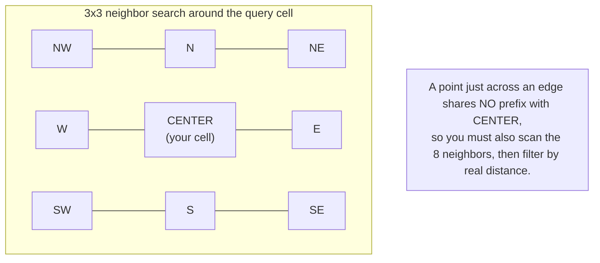
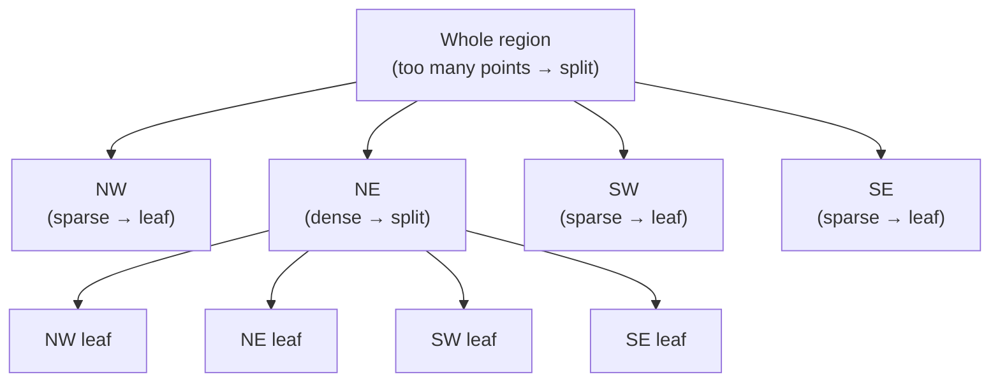
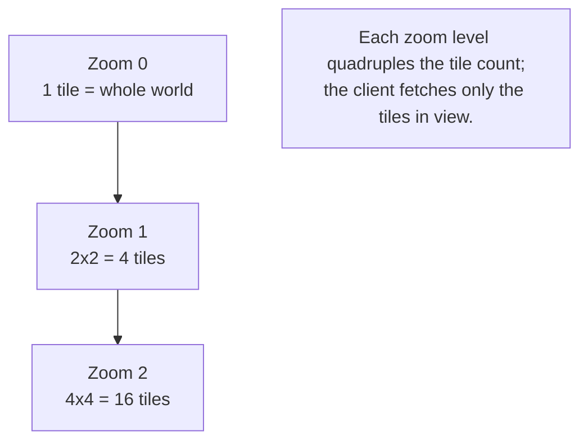

# Geospatial Systems — Junior Interview Questions

> **Collection:** [System Design](../README.md) · **Level:** Junior · **Section 30 of 42**
> **Goal:** Confirm you can explain how to index points on a sphere, turn a "find
> nearby" query into something a database can answer in milliseconds, and reason about
> the trade-offs between geohashing, quadtrees, and modern cell systems like S2 and H3.

The defining problem of geospatial systems is that *space is two-dimensional but
indexes are one-dimensional*. A B-tree sorts numbers on a line; latitude and longitude
are two numbers on a curved surface. Every technique in this section — geohash,
quadtree, S2, H3 — is a different answer to one question: **how do you flatten the
globe into something you can sort, shard, and look up quickly?** A strong junior answer
reaches for a real product (Uber matching riders to drivers, Yelp finding restaurants,
Google Maps routing), explains the *idea* before the syntax, and is honest about where
each approach breaks down at edges and boundaries.

---

## Contents

1. [Geohashing](#1-geohashing)
2. [Quadtrees](#2-quadtrees)
3. [S2 & H3](#3-s2--h3)
4. [Proximity Search](#4-proximity-search)
5. [Map Tiling & Routing](#5-map-tiling--routing)
6. [Rapid-Fire Self-Check](#6-rapid-fire-self-check)

---

## 1. Geohashing

### Q1.1 — What is a geohash, in one sentence?

**Probing:** Do you understand it converts 2D coordinates into a 1D sortable string?

**Model answer:** A geohash encodes a latitude/longitude pair into a single short string
(like `9q8yyk`) by recursively dividing the world into a grid and recording which cell
the point falls in at each level. The key property is that it turns a 2D coordinate into
a **1D string you can sort and index in an ordinary B-tree**, so "find points near here"
becomes "find strings with this prefix" — a query a normal database already does fast.

**Follow-up:** *"What does the length of the geohash control?"* → Precision. Each extra
character narrows the cell roughly 32x (alternating between latitude and longitude
splits). A 5-character geohash is a cell roughly 5 km × 5 km; a 7-character one is
roughly 150 m × 150 m. Shorter = coarser, longer = more precise.

### Q1.2 — Why is the prefix property so useful?

**Probing:** Connecting the encoding to the actual query you run.

**Model answer:** Points that are physically close usually share a long common prefix,
because they fall in the same coarse cells before diverging. So to find everything in a
neighborhood, you do a **prefix scan**: `WHERE geohash LIKE '9q8yy%'` returns all points
in that ~150 m cell. No trigonometry, no scanning the whole table — just an index range
scan, which is exactly what databases are built for. This is why Yelp or a delivery app
can store every restaurant's geohash in one indexed column and answer "what's around me"
cheaply.

### Q1.3 — What's the classic failure case of geohashes?

**Probing:** Awareness that the prefix trick has a sharp edge — literally.

**Model answer:** The **boundary problem**: two points can be a few meters apart but sit
on opposite sides of a cell edge, so they share *no* common prefix. A restaurant right
across the street from you might have a completely different geohash. If you only query
your own cell's prefix, you miss it. The standard fix is to also query the **8
neighboring cells** (the 3×3 grid around you), then filter by true distance. You search
nine prefixes instead of one to make sure nothing near a border is dropped.

**Follow-up:** *"Does a longer geohash make the boundary problem better or worse?"* →
Worse for coverage, better for precision. Longer geohashes mean smaller cells and more
edges, so a fixed-radius search may straddle *many* cells. You pick a geohash length
whose cell size is close to your search radius, then take the neighbors.

---

## 2. Quadtrees

### Q2.1 — What is a quadtree and how does it differ from a geohash grid?

**Probing:** Understanding adaptive subdivision vs a fixed uniform grid.

**Model answer:** A quadtree is a tree where every node represents a square region and
each node has up to four children — one per quadrant (NW, NE, SW, SE). The crucial
difference from a geohash grid is that a quadtree subdivides **adaptively**: a square is
split into four only when it holds more than some threshold of points. Empty oceans stay
as one big node; dense cities like Manhattan get subdivided many levels deep. A geohash
grid is *uniform* — every cell at a given precision is the same size regardless of how
many points are there.

### Q2.2 — Why is adaptive subdivision an advantage?

**Probing:** Linking the structure to a real performance concern: data skew.

**Model answer:** Real geographic data is wildly uneven — a Uber-style app has thousands
of drivers per square kilometer in downtown San Francisco and almost none in the desert
nearby. A uniform grid wastes cells on empty areas and lumps too many points into busy
ones. A quadtree keeps each leaf at a roughly balanced number of points, so a "nearby"
query touches a predictable, small amount of data whether you're in a city or the
countryside. The depth of the tree *adapts to density* instead of being fixed.

### Q2.3 — What's the cost of a quadtree compared to a geohash?

**Probing:** Honesty about the trade-off, not just selling the structure.

**Model answer:** A quadtree is a **pointer-based tree in memory**, so it's more complex
to build, update, and especially to shard across machines than a flat geohash string in
a database column. When a driver moves, you may have to remove and reinsert them, and if
a dense cell crosses a threshold you split it — extra bookkeeping. Geohashes are
trivially stored and sharded because they're just sortable strings. The rule of thumb:
quadtrees shine for **highly skewed, in-memory, frequently-queried** data (like live
driver positions); geohashes shine for **simple, persistent, evenly-ish distributed**
data you want in an ordinary indexed table.

---

## 3. S2 & H3

### Q3.1 — What problem do S2 and H3 solve that plain geohashes don't?

**Probing:** Awareness that lat/lng grids distort badly on a sphere.

**Model answer:** A geohash grid is built in flat latitude/longitude space, so its cells
are **not equal-area** — a cell near the equator covers far more ground than the same
cell near the poles, and the shapes distort. Google's **S2** and Uber's **H3** are
designed to tile the *sphere* with cells that are much more uniform in size and shape.
S2 projects the globe onto the six faces of a cube and subdivides each face into a
hierarchy of cells; H3 tiles the globe with **hexagons** (plus 12 pentagons to make the
math close). Both give you cells that behave consistently anywhere on Earth, which
matters when your service is global.

### Q3.2 — Why does Uber's H3 use hexagons instead of squares?

**Probing:** Do you know the practical reason, not just "hexagons look cool"?

**Model answer:** Hexagons have a nice property: **every neighbor is the same distance
away**. A square cell has 4 edge-neighbors that are close and 4 corner-neighbors that are
farther, so "adjacent" is ambiguous. A hexagon has 6 neighbors all sharing an edge and
all roughly equidistant from the center. For Uber's use — measuring demand, drawing
surge-pricing zones, expanding a search ring outward evenly — uniform neighbor distance
makes the analysis cleaner and the smoothing more natural. The cost is that hexagons
can't perfectly subdivide into smaller hexagons, so H3 levels don't nest exactly (it's
approximate), whereas square systems nest cleanly.

### Q3.3 — Compare geohash, quadtree, and S2/H3.

**Probing:** Can you hold three options in your head and pick by context?

**Model answer:**

| | Geohash | Quadtree | S2 / H3 |
|---|---|---|---|
| **Shape** | Rectangular grid | Square (adaptive) | S2: square on cube faces · H3: hexagons |
| **Cell sizes** | Uniform per length; distorts near poles | Adaptive to density | Near-equal-area globally |
| **Storage** | Sortable string → any DB index | In-memory tree | 64-bit cell ID (sortable) |
| **Handles skew** | No (fixed grid) | Yes (splits dense areas) | No (fixed levels), but even cells |
| **Neighbor query** | 8 prefixes around cell | Tree traversal | Built-in neighbor functions |
| **Best for** | Simple persistent storage | Live, skewed, in-memory data | Global services, analytics, ride-sharing |
| **Used by** | Many DBs, Redis | Many in-memory indexes | S2: Google Maps · H3: Uber |

The honest summary: geohash is the simplest and works great in any SQL database;
quadtree handles uneven density; S2/H3 are the most sophisticated and shine for global,
analytics-heavy products. For a junior interview, knowing *when* to reach for each
matters more than knowing the bit-level encoding.

---

## 4. Proximity Search

### Q4.1 — How would you find the 10 nearest drivers to a rider?

**Probing:** Can you avoid the naive full-scan answer?

**Model answer:** The naive approach — compute the distance from the rider to *every*
driver and sort — is O(n) per query and impossible at Uber's scale. The right approach
uses a spatial index. **(1)** Compute the rider's cell (geohash, quadtree leaf, or H3
index). **(2)** Gather candidate drivers in that cell **and its neighboring cells** so
you don't miss anyone near a boundary. **(3)** Compute the true distance only for that
small candidate set, then sort and take the top 10. The index turns a global scan into a
local one: you only do expensive distance math on dozens of nearby drivers, not millions.

### Q4.2 — Driver positions change every few seconds. How does that affect your design?

**Probing:** Recognizing that geospatial data here is *write-heavy and ephemeral*.

**Model answer:** Live driver locations are a high-frequency, short-lived workload —
constant updates, and you rarely need yesterday's position. That pushes you toward an
**in-memory store** rather than a disk database on the hot path. Redis, for example, has
geospatial commands (`GEOADD` / `GEOSEARCH`) backed by geohash-sorted sets, so you can
update a driver's position and query "drivers within 2 km" in memory in microseconds.
The system of record (trip history) can persist to disk asynchronously, but the
*matching* index lives in RAM because it's rewritten constantly and read constantly.

**Follow-up:** *"Why not just keep driver locations in your main SQL database?"* →
Because thousands of position updates per second per city would hammer the database with
writes and the radius queries would compete with everything else. Separating the volatile
"where is everyone right now" index from the durable trip data keeps each system doing
what it's good at.

### Q4.3 — Your search radius is 5 km but your cells are 1 km wide. What do you do?

**Probing:** Matching cell size to query radius — a common real bug.

**Model answer:** A single cell is too small to cover a 5 km radius, so you must query a
**block of cells** that together cover the search circle — roughly an 11×11 grid of 1 km
cells centered on the rider — then filter by true distance. The general rule is to pick a
cell size **close to your typical search radius**: if cells are far smaller, you scan too
many; if far larger, you pull in too many irrelevant candidates and filter most of them
out. Many systems store points at *multiple* precisions so they can choose the right
level per query. The final distance filter (the actual circle) is always applied at the
end, because cells are squares/hexagons and the search area is a circle.

---

## 5. Map Tiling & Routing

### Q5.1 — What is map tiling and why do maps use it?

**Probing:** Understanding why Google Maps doesn't ship one giant image.

**Model answer:** A world map at full detail is far too large to send or render as one
image, so map services cut each zoom level into a grid of small fixed-size images called
**tiles** (typically 256×256 pixels). When you pan or zoom, the client requests only the
handful of tiles visible in your viewport at your current zoom. This makes maps **cacheable
and incrementally loadable**: tiles are static files identified by `(zoom, x, y)`, so they
sit happily on a CDN, and moving the map fetches a few new tiles instead of redrawing the
planet. Higher zoom levels have exponentially more tiles, each covering a smaller area.

### Q5.2 — At a high level, how does routing (driving directions) work?

**Probing:** Connecting maps to graph algorithms without overreaching.

**Model answer:** Routing models the road network as a **graph**: intersections are
nodes, road segments are edges, and each edge has a weight — usually travel time, which
depends on distance, speed limit, and live traffic. Finding the best route is then a
**shortest-path problem**, solved with algorithms like Dijkstra or A\* (A\* uses the
straight-line distance to the destination as a hint to search toward the goal instead of
in all directions). Google Maps precomputes a lot to make continent-scale routing fast,
but the core idea a junior should state is: *roads become a weighted graph, and the route
is the lowest-cost path through it*.

**Follow-up:** *"What makes the edge weights change?"* → Live traffic. The same road
segment costs 2 minutes at 3 a.m. and 8 minutes at rush hour, so weights are updated from
real-time speed data, which is why the suggested route changes throughout the day.

### Q5.3 — Why are map tiles a great fit for a CDN, but routing results are not?

**Probing:** Distinguishing static, shared content from dynamic, personalized content.

**Model answer:** Tiles are **static and shared** — the image for `(zoom 12, x, y)` is
the same for every user and changes rarely, so you render it once and let a CDN serve it
worldwide from the edge, close to users. A routing result is **dynamic and specific** —
it depends on your exact start, destination, and the current traffic, so it can't be
pre-baked into a shared file and must be computed per request. The general lesson:
cache the parts that are identical for everyone (tiles), compute the parts that are
unique per request (routes).

---

## 6. Rapid-Fire Self-Check

If you can answer each of these in a sentence, you're ready for the junior bar on this section:

- [ ] What does a geohash turn a 2D coordinate into, and why is that useful? *(a 1D sortable/prefix-able string)*
- [ ] What is the geohash boundary problem and the standard fix? *(close points across an edge share no prefix → also query the 8 neighbors)*
- [ ] How does a quadtree differ from a uniform grid? *(it subdivides adaptively by density)*
- [ ] When do you prefer a quadtree over a geohash? *(skewed, in-memory, frequently-updated data)*
- [ ] Why do S2/H3 exist when geohashes already work? *(near-equal-area cells on the sphere; geohash distorts near the poles)*
- [ ] Why does H3 use hexagons? *(all 6 neighbors are equidistant)*
- [ ] What are the three steps of an indexed proximity search? *(cell → neighbors → true-distance filter)*
- [ ] Why keep live driver positions in memory (e.g., Redis) instead of SQL? *(write-heavy, ephemeral, microsecond reads)*
- [ ] What is a map tile and why is it CDN-friendly? *(a static (zoom, x, y) image, identical for all users)*
- [ ] How is routing modeled? *(roads as a weighted graph; route = shortest path via Dijkstra/A\*)*

---

**Next step:** Section 31 — [ML & Recommendation Systems](31-ml-recommendation-systems.md): turning user behavior into rankings, candidate generation, and serving predictions at scale.
